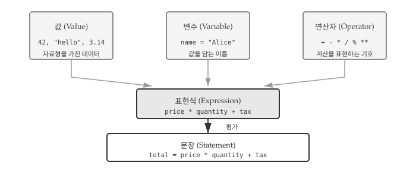
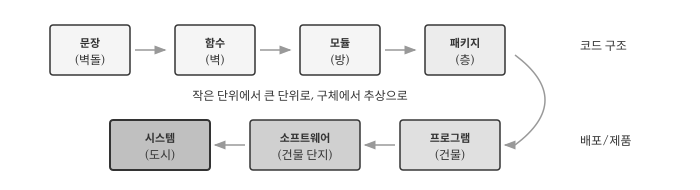
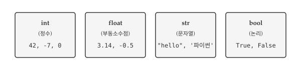
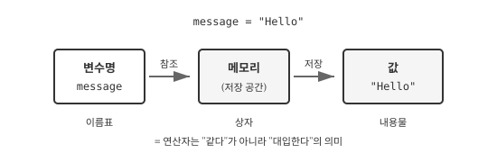
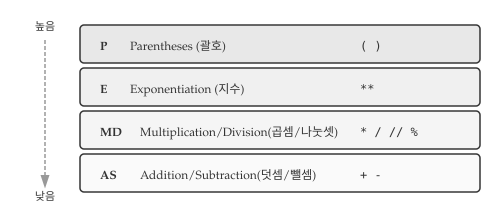
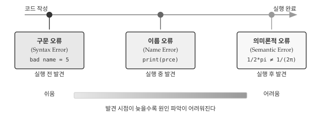

# 변수, 표현식, 문장 {#sec-var}

\index{변수}
\index{표현식}
\index{문장}

사용자 이름을 저장하거나, 쇼핑몰에서 총 금액을 계산하거나, 센서에서 읽은 온도 값을 처리하는 상황을 떠올려보자. 모두 데이터를 저장하고 계산하는 작업이다. 프로그래밍에서 데이터를 담아두는 그릇이 **변수**이고, 계산을 표현하는 방법이 **표현식**이며, 실행 가능한 명령 단위가 **문장**이다. 세 개념은 프로그래밍의 가장 기초적인 구성 요소로, 어떤 프로그래밍 언어를 배우든 반드시 이해해야 하는 핵심이다.

AI에게 "사용자 입력을 받아서 원화를 달러로 변환해줘"라고 요청하면 AI는 변수를 선언하고 연산자로 계산하는 코드를 생성한다. 변수와 표현식의 기본 원리를 이해하면 AI가 생성한 코드를 검증하고 수정하는 것이 한결 수월해진다. 코드를 직접 작성하지 않더라도 코드가 어떻게 동작하는지 읽고 이해하는 능력은 AI 시대에도 여전히 중요하다.

{#fig-var-overview fig-align="center" width="100%"}

@fig-var-overview 는 핵심 개념 간의 관계를 보여준다. **값**은 데이터의 기본 단위이고, **변수**는 값에 이름을 붙여 저장하는 수단이다. 값과 변수를 **연산자**로 조합하면 **표현식**이 되고, 표현식에 대입이나 출력 같은 동작을 더하면 컴퓨터가 실행할 수 있는 **문장**이 완성된다.

::: {.callout-note}
### 문장에서 시스템까지

프로그래밍 구성 요소는 건축에 비유하면 이해하기 쉽다. 집을 지을 때 벽돌을 쌓아 벽을 만들고, 벽을 조합해 방을 만들고, 방이 모여 건물이 되듯이 프로그래밍도 작은 단위에서 큰 단위로 조립해 나간다. 코드 한 줄이 벽돌이라면, 완성된 시스템은 하나의 도시와 같다.

*   **문장**: 컴퓨터에 내리는 하나의 명령으로, 건축의 **벽돌**에 해당한다.
*   **함수**: 문장들이 모여 특정 기능을 수행하는 단위로, **벽**이 된다.
*   **모듈**: 함수와 변수들이 모인 파일로, **방**에 해당한다.
*   **패키지**: 관련 모듈들을 묶은 디렉토리로, **층**에 해당한다.
*   **프로그램**: 패키지와 모듈이 결합되어 실행 가능한 **건물**이 된다.
*   **소프트웨어**: 프로그램과 데이터, 문서가 결합된 **건물 단지**다.
*   **시스템**: 소프트웨어와 하드웨어, 사용자가 어우러진 **도시** 환경이다.

{#fig-var-hierarchy fig-align="center" width="100%"}

2장에서는 가장 작은 단위인 문장을 다루고, 4장에서 함수, 이후 모듈과 패키지를 차례로 다룬다.
:::

## 값과 자료형 {#sec-var-value-type}

\index{값}
\index{자료형}
\index{문자열}

프로그램은 데이터를 다룬다. 사용자가 입력한 이름, 계산에 사용할 숫자, 화면에 출력할 메시지 모두 데이터다. 파이썬에서 데이터의 가장 작은 단위가 **값(value)**이고, 값의 종류를 구분하는 것이 **자료형(type)**이다. 정수와 문자열을 더할 수 없듯이, 자료형이 맞지 않으면 연산이 실패한다. 자료형을 이해하면 오류의 원인을 빠르게 파악할 수 있다.

@fig-var-types 는 파이썬에서 가장 많이 사용하는 네 가지 기본 자료형을 보여준다. 정수(`int`)와 실수(`float`)는 수치 계산에, 문자열(`str`)은 텍스트 처리에, 불리언(`bool`)은 조건 판단에 사용한다.

{#fig-var-types fig-align="center" width="100%"}

프로그램이 다루는 가장 기본적인 단위는 **값(value)**이다. 숫자 `2`도 값이고, 문자열 `'헬로 월드!'`도 값이다. 모든 값은 저마다 **자료형(type)**을 가진다. `2`는 **정수(integer)** 자료형이고, `'헬로 월드!'`는 **문자열(string)** 자료형이다. 문자열은 문자들이 순서대로 나열된 시퀀스로, 작은따옴표나 큰따옴표로 감싸서 표현한다. 파이썬은 두 종류의 인용부호를 동등하게 취급하므로 `"hello"`와 `'hello'`는 같은 문자열이다.

\index{인용부호}

```python
print(7)
#> 7
```

값의 자료형이 궁금할 때는 `type()` 함수를 사용한다. `type()` 함수는 전달받은 값의 자료형을 알려주므로, 코드가 예상대로 동작하지 않을 때 디버깅 도구로 유용하다. 정수는 `int`, 부동소수점 수는 `float`, 문자열은 `str`로 표시된다.

```python
print(type("헬로 월드!"))
#> <class 'str'>
print(type(17))
#> <class 'int'>
```

\index{type}
\index{type!str}
\index{type!int}
\index{type!float}

::: {.callout-warning}
### 콤마와 의미론적 오류

1,000,000처럼 큰 정수를 입력할 때 가독성을 위해 세 자리마다 콤마를 넣고 싶을 수 있다. 그러나 파이썬에서는 기대한 대로 동작하지 않는다.

```python
1,000,000
#> (1, 0, 0)
```

파이썬은 `1,000,000`을 백만이라는 하나의 정수가 아니라 콤마로 구분된 세 개의 정수 `1`, `0`, `0`으로 인식한다. 결과적으로 세 원소를 가진 튜플이 만들어진다. 코드가 오류 없이 실행되지만 의도한 결과가 아니다. 문법적으로는 올바르지만 의도한 동작과 다른 경우를 **의미론적 오류(semantic error)**라고 한다. 구문 오류와 달리 프로그램이 멈추지 않아 발견하기 어려운 경우가 많다.
:::

\index{의미론적 오류}
\index{오류!의미론}

## 변수 {#sec-var-variable}

\index{변수}
\index{대입문}

값을 한 번 사용하고 버리는 경우도 있지만, 대부분의 프로그램은 값을 저장해두고 여러 번 사용한다. 환율 계산기에서 환율을 변수에 저장해두면 여러 금액을 변환할 때마다 다시 입력할 필요가 없다. **변수(variable)**는 값에 이름을 붙여 저장하는 수단이다. 이름을 통해 저장된 값에 접근하고, 필요하면 새로운 값으로 교체할 수 있다.

@fig-var-assignment 는 변수 대입 구조를 보여준다. 변수명은 메모리 공간을 가리키는 이름표이고, 그 공간에 실제 값이 저장된다. `=` 기호는 수학의 "같다"가 아니라 "대입한다"는 의미다.

{#fig-var-assignment fig-align="center" width="90%"}

### 대입문

프로그래밍 언어의 가장 강력한 기능 중 하나는 변수다. **변수(variable)**는 값을 저장하고 나중에 다시 참조할 수 있도록 이름을 붙이는 수단이다. 수학에서 $x = 5$라고 쓰면 "$x$와 5가 같다"는 뜻이지만, 프로그래밍에서 `x = 5`는 "5라는 값을 `x`라는 이름에 저장한다"는 뜻이다. **대입문(assignment statement)**은 등호(`=`) 기호를 사용해 변수를 생성하고 값을 저장하는 문장이다.

```{python}
message = "매월 셋째 주 수요일 파이썬 Meetup이 열립니다."
n = 17
pi = 3.1415926535897931
```

위 코드는 세 가지 대입을 수행한다. `message` 변수에는 문자열이, `n`에는 정수가, `pi`에는 부동소수점 수가 저장된다. 변수에 값을 저장한 뒤에는 변수명을 사용해 저장된 값에 접근할 수 있다. `print()` 함수에 변수명을 전달하면 해당 변수에 저장된 값이 화면에 출력된다.

```{python}
print(message)
print(n)
print(pi)
```

변수의 자료형은 저장된 값의 자료형에 따라 자동으로 결정된다. 파이썬은 동적 타이핑 언어이므로 변수를 선언할 때 자료형을 명시하지 않아도 되고, 같은 변수에 다른 자료형의 값을 다시 대입할 수도 있다.

```python
type(message)   # str
type(n)         # int
type(pi)        # float
```

### 변수명과 예약어 {#sec-var-keywords}

\index{예약어}
\index{밑줄}

변수명은 프로그래머가 자유롭게 정할 수 있지만, 파이썬 문법에서 정한 몇 가지 규칙을 따라야 한다. 규칙을 어기면 프로그램이 실행되기 전에 구문 오류가 발생한다.

- 문자와 숫자를 포함할 수 있지만, **반드시 문자나 밑줄로 시작**해야 한다
- 밑줄(`_`)을 사용할 수 있다: `my_name`, `user_age`, `_private`
- 대소문자를 구분한다: `Name`과 `name`은 서로 다른 변수다
- 예약어는 변수명으로 사용할 수 없다

규칙을 어긴 변수명은 구문 오류를 일으킨다. 아래 예시에서 `76trombones`는 숫자로 시작해서, `more@`는 허용되지 않는 특수문자 `@`를 포함해서, `class`는 파이썬 예약어여서 각각 오류가 발생한다.

```python
76trombones = 'big parade'
#> SyntaxError: invalid syntax

more@ = 1000000
#> SyntaxError: invalid syntax

class = 'Advanced Theoretical Zymurgy'
#> SyntaxError: invalid syntax
```

**예약어(reserved word)**는 프로그래밍 언어가 특별한 목적으로 사용하도록 지정한 단어다. 조건문, 반복문, 함수 정의 등 문법 구조를 표현하는 데 사용되므로 변수명으로 쓸 수 없다. 파이썬 3.10+ 기준 35개 예약어가 있으며, 처음에는 모두 외울 필요 없이 오류가 발생할 때 확인하면 된다.


### 좋은 변수명 짓기 {#sec-var-name}

\index{의미 있는 변수명}

변수명은 규칙만 지키면 기술적으로는 어떤 이름이든 사용할 수 있다. 하지만 좋은 변수명과 나쁜 변수명의 차이는 코드 가독성에 큰 영향을 미친다. 다음 세 프로그램은 모두 동일한 결과를 출력하지만, 코드를 읽고 이해하는 데 드는 노력은 천차만별이다.

```python
# 버전 1: 의미 없는 이름
a = 35.0
b = 12.50
c = a * b
print(c)

# 버전 2: 의미 있는 이름
hours = 35.0
rate = 12.50
pay = hours * rate
print(pay)

# 버전 3: 암호 같은 이름
x1q3z9ahd = 35.0
x1q3z9afd = 12.50
x1q3p9afd = x1q3z9ahd * x1q3z9afd
print(x1q3p9afd)
```

두 번째 버전이 가장 읽기 쉽다. 변수명만 보고도 `hours`에는 근무 시간이, `rate`에는 시급이, `pay`에는 급여가 저장되어 있음을 알 수 있다. 변수의 역할을 쉽게 떠올릴 수 있도록 지은 이름을 **의미 있는 변수명(mnemonic variable name)**이라고 한다. 코드를 작성할 때 조금 더 고민이 필요하지만, 나중에 코드를 다시 읽거나 다른 사람과 협업할 때 그 노력이 몇 배로 보답받는다.

::: {.callout-note}
### 예약어와 변수명 구분하기

다음 코드에서 어떤 단어가 예약어이고 어떤 단어가 변수명인지 구분해보자.

```python
for word in words:
    print(word)
```

`for`와 `in`은 반복문을 구성하는 파이썬 예약어이고, `print`는 내장 함수 이름이다. 반면 `word`와 `words`는 프로그래머가 정한 변수명이다. 대부분의 코드 편집기는 예약어와 내장 함수를 다른 색으로 표시해서 구분을 도와준다.
:::

## 연산자와 표현식 {#sec-var-operator}

\index{연산자}
\index{피연산자}
\index{표현식}

**연산자(operator)**는 덧셈, 곱셈 같은 계산을 표현하는 기호다. 연산자가 계산을 수행하는 대상이 되는 값을 **피연산자(operand)**라고 한다. `3 + 5`에서 `+`가 연산자이고, `3`과 `5`가 피연산자다. 파이썬은 기본적인 산술 연산자를 제공하며, 수학에서 익숙한 기호를 대부분 그대로 사용한다.

```python
20 + 32       # 덧셈
hour - 1      # 뺄셈
hour * 60     # 곱셈
minute / 60   # 나눗셈
5 ** 2        # 지수(거듭제곱)
```

값, 변수, 연산자를 조합한 것을 **표현식(expression)**이라고 한다. 표현식은 평가(evaluate)되어 하나의 값으로 귀결된다. 단독으로 쓰인 값 `17`도 표현식이고, 변수 `x`도 표현식이며, `x + 17`처럼 연산자로 연결한 것도 표현식이다. 모든 표현식은 평가되면 하나의 값을 만들어낸다.

```python
1 + 1
#> 2
```

인터랙티브 모드(대화형 모드)에서는 표현식을 입력하면 결과가 바로 화면에 표시된다. 하지만 스크립트 파일에서는 표현식만 작성하면 계산은 수행되지만 결과가 화면에 나타나지 않는다. 결과를 확인하려면 `print()` 함수로 명시적으로 출력해야 한다.

### 연산자 우선순위 {#sec-var-precedence}

\index{연산자 우선순위}
\index{PEMDAS}

수학 시간에 "곱셈을 덧셈보다 먼저 계산한다"고 배운 기억이 있을 것이다. 프로그래밍에서도 동일한 규칙이 적용된다. 표현식에 여러 연산자가 섞여 있을 때 어떤 순서로 계산하는지 명확히 알아야 의도한 결과를 얻을 수 있다. 순서를 잘못 이해하면 코드가 오류 없이 실행되더라도 전혀 다른 값이 나온다.

@fig-var-precedence 는 파이썬 연산자의 우선순위를 보여준다. 위에 있을수록 먼저 계산되고, 같은 줄에 있는 연산자는 왼쪽에서 오른쪽 순서로 평가된다. 괄호가 가장 높은 우선순위를 가지므로, 계산 순서가 헷갈릴 때는 괄호로 명시하면 된다.

{#fig-var-precedence fig-align="center" width="85%"}

하나의 표현식에 여러 연산자가 포함되면 어떤 순서로 계산할지가 중요해진다. `2 + 3 * 4`는 `(2 + 3) * 4 = 20`일까, `2 + (3 * 4) = 14`일까? 파이썬은 수학의 관례를 따르는 **우선순위 규칙**에 따라 표현식을 평가한다. 영어 두문어 **PEMDAS**로 우선순위를 기억하면 편하다.

- **P**arentheses(괄호): 가장 높은 우선순위. `2 * (3-1)`은 4
- **E**xponentiation(지수): `2**1+1`은 3이다 (4가 아님)
- **M**ultiplication/**D**ivision(곱셈/나눗셈): 덧셈/뺄셈보다 먼저 계산
- **A**ddition/**S**ubtraction(덧셈/뺄셈): 가장 낮은 우선순위

같은 우선순위를 가진 연산자가 나란히 있으면 왼쪽에서 오른쪽 순서로 평가한다. `5-3-1`은 `(5-3)-1 = 1`이지, `5-(3-1) = 3`이 아니다. 계산 순서가 헷갈리거나 의도를 명확히 하고 싶을 때는 괄호를 사용하는 것이 좋다. 괄호는 코드를 읽는 사람에게도 계산 의도를 분명히 전달한다.

다음 표현식들의 결과를 예측해보자. 정수와 부동소수점 수 사이의 연산, 우선순위 규칙이 어떻게 적용되는지 확인할 수 있다.

```python
width = 17
height = 12.0

width / 2       #> 8.5 (float)
width // 2      #> 8 (int, 버림 나눗셈)
height / 3      #> 4.0 (float)
1 + 2 * 5       #> 11 (곱셈 먼저)
```

`width / 2`에서 `width`는 정수지만 나눗셈 결과는 부동소수점이다. 파이썬 3에서 `/` 연산자는 항상 부동소수점 결과를 반환한다. 정수 결과가 필요하면 버림 나눗셈 연산자 `//`를 사용한다.

### 나머지 연산자 {#sec-var-modular}

\index{나머지 연산자}
\index{버림 나눗셈}

**나머지 연산자** `%`는 나눗셈을 수행한 뒤 나머지를 반환한다. 7을 3으로 나누면 몫이 2이고 나머지가 1이므로 `7 % 3`은 1이다. 나머지 연산자는 겉보기보다 활용도가 높다. `x % y`가 0이면 x가 y로 나누어 떨어진다는 뜻이므로 짝수/홀수 판별이나 배수 확인에 유용하다. `x % 10`은 10진수 정수 x의 마지막 자릿수를 추출한다.

```python
7 % 3
#> 1
```

**버림 나눗셈** 연산자 `//`는 나눗셈을 수행한 뒤 소수점 아래를 버리고 정수 몫만 반환한다. `/`와 `//`의 차이, 그리고 `%`와의 관계를 다음 예시에서 확인해보자.

```python
minute = 59
minute / 60    # 0.9833...
minute // 60   # 0
minute % 60    # 59
```

### 문자열 연산 {#sec-var-string-operator}

\index{문자열!연산}
\index{연결}

연산자는 숫자뿐 아니라 문자열에도 적용할 수 있다. 다만 같은 연산자라도 피연산자의 자료형에 따라 다르게 동작한다. `+` 연산자는 숫자에서는 덧셈을 수행하지만, 문자열에서는 **연결(concatenation)** 작업을 수행한다. 두 문자열을 이어붙여 하나의 새 문자열을 만든다.

```python
first = '100'
second = '150'
print(first + second)
#> 100150
```

숫자 `10 + 15`는 `25`가 되지만, 문자열 `'100' + '150'`은 `'100150'`이 된다. 문자열 `'100'`과 정수 `100`은 화면에 출력하면 비슷해 보이지만 완전히 다른 자료형이다. 자료형에 따라 연산자의 동작이 달라지므로, 예상치 못한 결과가 나온다면 `type()` 함수로 자료형을 확인해보는 것이 좋다.

## 입력과 출력 {#sec-var-io}

\index{input 함수}
\index{키보드 입력}

프로그램은 데이터를 받아들이고, 처리하고, 결과를 내보내는 과정을 반복한다. 지금까지 변수에 값을 직접 대입하는 방식으로 데이터를 다뤘지만, 실제 프로그램은 사용자나 파일, 네트워크 등 외부로부터 데이터를 받아들인다. 파이썬에서 가장 기본적인 입력 수단은 `input()` 함수이고, 출력 수단은 `print()` 함수다. 두 함수를 사용하면 사용자와 상호작용하는 프로그램을 만들 수 있다.

### 사용자 입력 {#sec-var-input}

프로그램이 유용하려면 외부에서 데이터를 받아들일 수 있어야 한다. `input()` 함수는 키보드로부터 사용자 입력을 받는 가장 기본적인 방법이다. 프로그램 실행 중 `input()` 함수를 만나면 사용자가 Enter 키를 누를 때까지 대기하고, 입력된 내용을 **문자열**로 반환한다. 괄호 안에 문자열을 전달하면 사용자에게 입력을 안내하는 프롬프트로 표시된다.

```python
name = input("이름을 입력하세요: ")
#> 이름을 입력하세요: 길동
print("안녕하세요 " + name + "님")
#> 안녕하세요 길동님
```

\index{프롬프트}

`input()` 함수가 반환하는 값은 항상 문자열이다. 따라서 숫자 계산을 하려면 `int()`나 `float()` 함수로 자료형을 변환해야 한다. 섭씨 온도를 화씨로 변환하는 프로그램으로 이 과정을 살펴보자.

```python
celsius = float(input("섭씨 온도를 입력하세요: "))
#> 섭씨 온도를 입력하세요: 25
fahrenheit = 9/5 * celsius + 32
print(f"화씨 온도는 {fahrenheit}도입니다.")
#> 화씨 온도는 77.0도입니다.
```

변환 공식 $F = \frac{9}{5} \times C + 32$를 코드로 옮길 때 연산자 우선순위가 자연스럽게 적용된다. `9/5 * celsius + 32`에서 나눗셈과 곱셈이 덧셈보다 먼저 수행되므로 괄호 없이도 의도대로 동작한다. 하지만 공식이 복잡해지면 괄호로 의도를 명확히 하는 것이 안전하다.

::: {.callout-warning}
### 자료형 변환 오류

사용자가 숫자 대신 문자를 입력하면 `int()`나 `float()` 변환에서 오류가 발생한다. 프로그램이 사용자 입력을 받을 때는 항상 잘못된 입력 가능성을 고려해야 한다.

```python
speed = input('속도를 입력하세요: ')
#> 속도를 입력하세요: 빠르게!
result = int(speed) + 5
#> ValueError: invalid literal for int() with base 10: '빠르게!'
```

`ValueError`는 함수에 전달된 값이 적절하지 않을 때 발생하는 오류다. 예외 처리(`try-except`)를 사용해 오류를 우아하게 처리하는 방법은 뒷장에서 다룬다.
:::

\index{값오류}
\index{예외!값오류}

### 주석 {#sec-var-comment}

\index{주석}

프로그램이 커지면 코드만으로는 작성 의도를 파악하기 어려워진다. **주석(comment)**은 코드에 설명을 추가하는 방법으로, `#` 기호로 시작한다. `#` 뒤에 오는 내용은 줄 끝까지 파이썬이 무시하므로 프로그램 실행에 영향을 주지 않는다. 주석은 코드를 읽는 사람(미래의 자신 포함)을 위한 메모다.

```python
# 경과한 시간을 퍼센트로 계산
percentage = (minute * 100) / 60

v = 5  # 미터/초 단위 속도
```

주석을 작성할 때는 **무엇을** 하는지보다 **왜** 그렇게 하는지를 설명하는 것이 좋다. 코드가 이미 표현하고 있는 내용을 반복하는 주석은 오히려 방해가 된다. 다음은 쓸모없는 주석의 예다.

```python
v = 5  # 5를 v에 대입
```

반면 다음 주석은 코드에서 읽어낼 수 없는 유용한 정보를 담고 있다. 변수 `v`가 어떤 물리량을 나타내며 어떤 단위로 측정되었는지 알려준다.

```python
v = 5  # 미터/초 단위로 측정된 속도
```

## 디버깅 {#sec-var-debug}

\index{디버깅}
\index{구문 오류}
\index{런타임 오류}

프로그래밍에서 오류는 피할 수 없다. 숙련된 프로그래머도 매일 오류를 만나고 수정한다. 차이점은 오류를 두려워하지 않고 체계적으로 접근하는 방법을 아는 것이다. 디버깅 능력은 코드를 작성하는 능력만큼이나 중요하며, 경험이 쌓일수록 오류 메시지만 보고도 원인을 직감할 수 있게 된다.

@fig-var-debugging 은 파이썬에서 발생하는 세 가지 주요 오류 유형과 발견 시점을 보여준다. 오류는 발견 시점이 늦을수록 원인을 찾기 어렵다. 구문 오류는 코드 실행 전에 발견되어 가장 수정하기 쉽고, 의미론적 오류는 코드가 정상 실행된 후에야 드러나 가장 찾기 어렵다.

{#fig-var-debugging fig-align="center" width="100%"}

### 구문 오류: 문법이 틀렸다

\index{구문 오류}

**구문 오류(Syntax Error)**는 파이썬 문법 규칙에 맞지 않는 코드를 작성했을 때 발생한다. 파이썬 인터프리터는 코드를 실행하기 전에 먼저 문법을 검사하므로, 구문 오류가 있으면 프로그램 자체가 시작되지 않는다. 오류 메시지가 정확한 위치를 알려주기 때문에 세 유형 중 가장 수정하기 쉽다.

```python
bad name = 5
#> SyntaxError: invalid syntax
```

변수명에 공백이 들어가면 파이썬은 `bad`와 `name`을 두 개의 별개 토큰으로 인식한다. 대입문의 왼쪽에는 하나의 변수명만 올 수 있으므로 문법 오류가 발생한다. 따옴표를 닫지 않거나, 괄호 짝이 맞지 않거나, 들여쓰기가 잘못된 경우도 구문 오류에 해당한다.

### 이름 오류: 없는 이름을 불렀다

\index{이름 오류}

**이름 오류(Name Error)**는 정의되지 않은 변수를 사용하려 할 때 발생한다. 코드 문법은 올바르지만 실행 중에 존재하지 않는 이름을 참조하면 프로그램이 멈춘다. 가장 흔한 원인은 오타다.

```python
principal = 327.68
interest = principle * rate  # 오타: principal → principle
#> NameError: name 'principle' is not defined
```

`principal`을 `principle`로 잘못 입력하면 파이썬은 `principle`이라는 변수를 찾을 수 없다고 알려준다. 오류 메시지에서 `name 'principle' is not defined`라고 명확히 알려주므로, 해당 변수명을 검색해서 오타를 찾으면 된다. 변수를 사용하기 전에 정의했는지, 스코프(유효 범위)가 맞는지도 확인해야 한다.

### 의미론적 오류: 실행은 되는데 결과가 틀렸다

\index{의미론적 오류}

**의미론적 오류(Semantic Error)**는 코드가 문법적으로 올바르고 정상적으로 실행되지만, 결과가 의도한 것과 다른 경우다. 파이썬이 오류 메시지를 주지 않으므로 찾기 가장 어렵다. 프로그래머가 직접 결과를 검증해야만 발견할 수 있다.

```python
import math
result = 1.0 / 2.0 * math.pi  # 의도: 1/(2π)
print(result)
#> 1.5707963267948966
```

위 코드는 $\frac{1}{2\pi}$를 계산하려 했지만, 연산자 우선순위 때문에 $\frac{1}{2} \times \pi$가 계산되었다. 올바른 결과는 약 0.159인데 1.57이 출력되었다. 올바른 결과를 얻으려면 `1.0 / (2.0 * math.pi)`처럼 괄호로 의도를 명확히 해야 한다.

의미론적 오류를 예방하는 가장 좋은 방법은 복잡한 수식을 여러 단계로 나누어 계산하는 것이다. 중간 결과를 변수에 저장하고 출력해서 확인하면 어느 단계에서 의도와 달라졌는지 쉽게 파악할 수 있다. 또한 예상 결과를 미리 계산해두고 프로그램 출력과 비교하는 습관이 중요하다.

## AI와 함께하는 변수와 표현식 {#sec-var-ai}

AI에게 계산 코드를 요청할 때 "환율 계산 프로그램 만들어줘"처럼 모호하게 요청하면 AI가 임의로 해석하여 수정 작업이 늘어난다. 좋은 프롬프트는 **입력 데이터**, **계산 방식**, **출력 형태**, **변수명 규칙**을 한 번에 명시한다. 다음은 2장에서 배운 개념을 모두 반영한 프롬프트 예시다.

```
사용자로부터 원화 금액과 환율(1달러당 원화)을 입력받아 달러로 변환하는
프로그램을 작성해줘.

- 입력: input() 함수로 원화 금액과 환율을 각각 입력받음
- 자료형: 소수점 금액을 처리할 수 있도록 float로 변환
- 계산: 원화 ÷ 환율 = 달러
- 출력: "10000원은 7.69달러입니다" 형식으로 소수점 둘째 자리까지 표시
- 변수명: krw(원화), exchange_rate(환율), usd(달러)처럼 의미 있는 이름 사용
- 예외처리: 환율이 0이면 나눗셈 오류가 발생하므로 확인 로직 추가
```

프롬프트에 요구사항을 구체적으로 명시하면 AI가 생성한 코드를 검증하기도 쉬워진다. 변수명이 `krw`, `usd`, `exchange_rate`로 되어 있는지, `input()` 결과를 `float()`로 변환했는지, 환율이 0인 경우를 처리했는지 하나씩 확인하면 된다. 코드에 문제가 있으면 "환율이 0일 때 오류가 발생한다"처럼 구체적인 상황을 설명해야 AI가 정확히 수정할 수 있다.

::: {.callout-tip}
### 명세 기반 개발(Spec-Driven Development)

2025년 AI 코딩의 핵심 방법론으로 **명세 기반 개발**이 부상했다. 기존의 "바이브 코딩(vibe coding)"—AI와 즉흥적으로 대화하며 코드를 생성하는 방식—은 빠른 프로토타입에는 유용하지만, 실제 서비스 코드에서는 품질 문제가 발생한다. AI가 수천 가지 암묵적 요구사항을 추측해야 하기 때문이다.

명세 기반 개발은 **명세(Specify) → 계획(Plan) → 작업(Tasks) → 구현(Implement)**의 4단계 워크플로우를 따른다.

1. **명세**: 사용자 여정, 기대 결과, 성공 지표를 문서화한다
2. **계획**: 기술 스택, 아키텍처, 제약 조건을 정의한다
3. **작업**: AI가 명세를 독립적으로 테스트 가능한 작은 단위로 분해한다
4. **구현**: AI가 작업 단위별로 코드를 생성하고, 개발자가 검토한다

핵심은 **인간이 "무엇을(what)"과 "어떻게(how)"를 정의하고, AI가 코드 생성을 담당**하는 역할 분담이다. 명세가 명확할수록 AI의 첫 번째 시도 정확도가 95% 이상으로 높아진다고 알려져 있다. GitHub의 Spec Kit, AWS Kiro 등 오픈소스 도구가 이 방법론을 지원한다.

앞서 작성한 환율 변환 프롬프트가 바로 명세 기반 개발의 축소판이다. 입력, 자료형, 계산, 출력, 변수명, 예외 처리를 명시한 것이 곧 "명세"에 해당한다.
:::

::: {.content-visible when-format="pdf"}
\faLightbulb\ 생각해볼 점
:::

::: {.content-visible when-format="html"}
## 💡 생각해볼 점 {.unnumbered}
:::

2장에서 배운 **값**, **변수**, **표현식**, **문장**은 프로그래밍의 가장 기본적인 벽돌이다. 문장이 모여 함수가 되고, 함수가 모여 모듈이 되고, 결국 시스템이 완성된다. 처음에는 `=`가 "같다"가 아니라 "대입한다"는 뜻이라는 점, 파이썬이 자료형을 자동으로 추론한다는 점이 어색할 수 있다. 하지만 몇 번 코드를 작성하다 보면 금방 자연스러워진다.

**좋은 변수명**은 코드의 품질을 결정한다. `a`, `b`, `c` 대신 `hours`, `rate`, `pay`를 사용하면 코드 자체가 문서가 된다. AI에게 코드를 요청할 때도 "의미 있는 변수명을 사용해줘"라고 명시하면 더 읽기 좋은 코드를 얻을 수 있다. 변수명 짓기에 시간을 투자하면 나중에 코드를 읽고 유지보수하는 시간이 절약된다.

**연산자 우선순위**는 의미론적 오류의 주요 원인이다. `1/2*pi`와 `1/(2*pi)`는 전혀 다른 결과를 낸다. 확신이 없으면 괄호를 사용하는 것이 좋다. 영리해 보이는 한 줄 코드보다 의도가 명확한 여러 줄 코드가 실무에서는 더 가치 있다.

**오류는 배움의 일부**다. 구문 오류는 오류 메시지가 위치를 알려주니 두렵지 않다. 이름 오류는 대부분 오타다. 가장 주의할 것은 의미론적 오류로, 코드가 정상 실행되지만 결과가 틀린 경우다. 예상 결과를 미리 계산해두고 프로그램 출력과 비교하는 습관이 중요하다.

AI 시대에도 프로그래밍 기초 개념의 가치는 변하지 않는다. 오히려 **명세 기반 개발**이 보여주듯, 자료형, 변수명, 예외 처리 같은 개념을 명확히 알아야 AI에게 정확한 요구사항을 전달할 수 있다. "환율 계산기 만들어줘"보다 "입력은 float, 변수명은 krw와 usd, 환율이 0이면 예외 처리"라고 명시할 때 AI가 더 정확한 코드를 생성한다. 코드를 직접 작성하든 AI가 생성하든, 결국 코드를 읽고 검증하는 것은 사람의 몫이다.

다음 장에서는 **조건부 실행**을 다룬다. 지금까지 작성한 코드는 위에서 아래로 순차적으로 실행되었다. 조건문을 배우면 프로그램이 상황에 따라 다르게 동작하도록 분기를 만들 수 있다.
