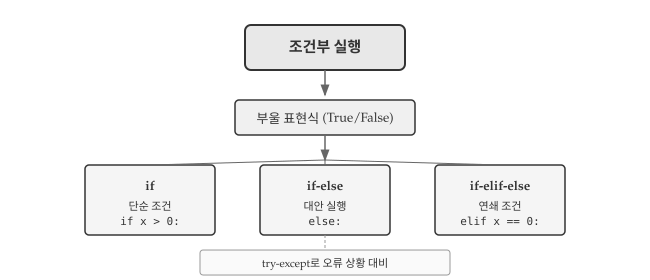
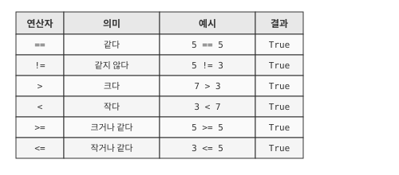
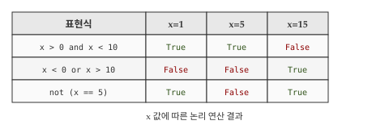
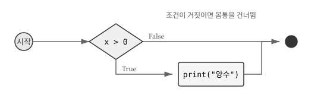
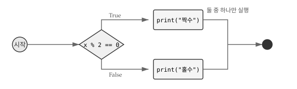
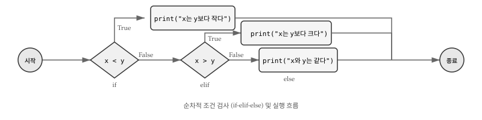
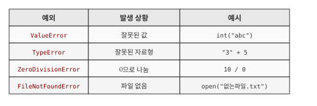
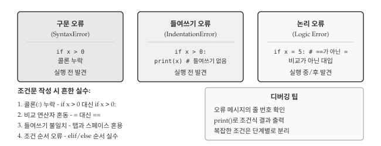

# 조건부 실행 {#sec-cont}

\index{조건부 실행}
\index{부울 표현식}
\index{조건문}

앞 장에서 작성한 코드는 위에서 아래로 순차적으로 실행되었다. 하지만 실제 프로그램은 상황에 따라 다르게 동작해야 한다. 사용자가 비밀번호를 맞게 입력하면 로그인하고, 틀리면 오류 메시지를 보여준다. 점수가 60점 이상이면 합격, 미만이면 불합격 처리한다. 이처럼 조건에 따라 실행 흐름을 분기하는 것이 **조건부 실행(conditional execution)**이다.

조건부 실행은 프로그래밍의 핵심 개념 중 하나로, 프로그램이 "판단"할 수 있게 해준다. AI에게 "로그인 기능 만들어줘"라고 요청하면 조건문이 포함된 코드가 생성된다. 조건문의 원리를 이해하면 AI가 생성한 분기 로직이 올바른지 검증할 수 있고, 예외 상황을 빠뜨리지 않았는지 확인할 수 있다.

{#fig-cont-overview fig-align="center" width="100%"}

@fig-cont-overview 는 조건부 실행의 구조를 보여준다. 모든 조건문은 **부울 표현식**으로 시작하며, 표현식의 결과가 참(True)인지 거짓(False)인지에 따라 실행 경로가 결정된다. 가장 단순한 `if`문부터 여러 조건을 순차 검사하는 `if-elif-else`까지, 상황에 맞는 조건문을 선택해서 사용한다.

## 부울 표현식과 논리 연산 {#sec-cont-boolean}

\index{부울 표현식}
\index{비교 연산자}
\index{논리 연산자}

조건문을 작성하려면 먼저 조건을 표현할 수 있어야 한다. **부울 표현식(boolean expression)**은 참(`True`) 또는 거짓(`False`) 중 하나의 값을 갖는 표현식이다. `True`와 `False`는 파이썬 예약어로, `bool` 자료형에 속한다.

### 비교 연산자

두 값을 비교하는 **비교 연산자**는 부울 값을 반환한다. 가장 흔히 쓰는 `==` 연산자는 두 값이 같으면 `True`, 다르면 `False`를 반환한다.

```python
5 == 5
#> True

5 == 6
#> False

type(True)
#> <class 'bool'>
```

\index{참}
\index{거짓}

@fig-cont-comparison 은 파이썬에서 사용할 수 있는 6가지 비교 연산자를 보여준다. `==`와 `!=`는 두 값이 같은지 다른지 판단하고, `>`, `<`, `>=`, `<=`는 크기를 비교한다. 비교 연산자는 숫자뿐 아니라 문자열에도 적용되는데, 문자열 비교는 사전 순서(알파벳 순서)를 따른다. `"apple" < "banana"`는 `True`를 반환한다.

{#fig-cont-comparison fig-align="center" width="80%"}

::: {.callout-warning}
### `=`와 `==`의 차이

초보자가 가장 많이 범하는 실수 중 하나가 비교 연산자 `==`와 대입 연산자 `=`를 혼동하는 것이다. `x = 5`는 "x에 5를 저장한다"는 대입문이고, `x == 5`는 "x가 5와 같은가?"라는 비교 표현식이다.

```python
x = 5      # 대입: x에 5를 저장
x == 5     # 비교: x가 5인지 확인 → True 반환
```

수학에서 `=`가 "같다"를 의미하기 때문에 혼동하기 쉽다. 프로그래밍에서 "같다"를 비교할 때는 반드시 `==`를 사용해야 한다.
:::

### 논리 연산자

\index{and}
\index{or}
\index{not}

하나의 비교만으로 조건을 표현하기 어려운 경우가 많다. "18세 이상이고 65세 미만"처럼 두 조건을 동시에 만족해야 하거나, "회원이거나 쿠폰 보유자"처럼 둘 중 하나만 만족해도 되는 상황이 있다. **논리 연산자**는 여러 부울 표현식을 조합하여 복합 조건을 만든다. 파이썬에서는 `and`, `or`, `not` 세 가지 논리 연산자를 제공한다.

```python
x = 5

x > 0 and x < 10   # x가 0보다 크고 10보다 작으면 True
#> True

x < 0 or x > 3     # x가 0보다 작거나 3보다 크면 True
#> True

not (x > 10)       # x가 10보다 크지 않으면 True
#> True
```

@fig-cont-logical 은 세 논리 연산자의 동작을 진리표로 정리한 것이다. `and` 연산자는 두 조건이 **모두 참**일 때만 `True`를 반환한다. 하나라도 `False`면 결과는 `False`다. `or` 연산자는 두 조건 중 **하나라도 참**이면 `True`를 반환하며, 둘 다 `False`일 때만 `False`가 된다. `not` 연산자는 단항 연산자로, 부울 값을 **반전**시킨다.

{#fig-cont-logical fig-align="center" width="85%"}

::: {.callout-note}
### Truthy와 Falsy

파이썬에서 0이 아닌 숫자는 `True`로, 0은 `False`로 평가된다. 빈 문자열 `""`이나 빈 리스트 `[]`도 `False`로 취급된다. 이를 "truthy"와 "falsy" 값이라고 한다.

```python
bool(17)   #> True
bool(0)    #> False
bool("")   #> False
bool("hi") #> True
```

이러한 특성은 유용하지만 혼란을 줄 수 있으므로, 명시적인 비교를 권장한다. `if x:` 보다 `if x != 0:`이 의도가 명확하다.
:::

## 조건문 {#sec-cont-conditional}

\index{if문}
\index{조건문}
\index{분기}

프로그램은 단순히 위에서 아래로 순차 실행되지 않는다. "비가 오면 우산을 챙기고, 아니면 선글라스를 쓴다"처럼 상황에 따라 다른 행동을 해야 한다. **조건문(conditional statement)**은 부울 표현식의 참/거짓에 따라 서로 다른 코드 블록을 실행하는 구조다. 파이썬에서는 조건이 참일 때만 실행하는 `if`문, 참/거짓 두 갈래로 나뉘는 `if-else`문, 여러 조건을 순차 검사하는 `if-elif-else`문을 제공한다.

### if문: 단순 조건

가장 간단한 조건문은 `if`문이다. 특정 조건이 참일 때만 추가 작업을 수행하고, 거짓이면 아무 일 없이 다음 코드로 넘어간다. 예를 들어 "잔액이 부족하면 경고 메시지를 출력"하는 상황에서, 잔액이 충분하면 경고 없이 진행하면 된다.

```python
x = 10

if x > 0:
    print('x는 양수이다.')
```

`if` 키워드 뒤에 조건(부울 표현식)을 쓰고, 콜론(`:`)으로 헤더를 마친다. 다음 줄부터 들여쓰기된 코드가 **몸통(body)**이며, 조건이 참일 때 실행된다.

{#fig-cont-if fig-align="center" width="70%"}

@fig-cont-if 에서 보듯이, 조건이 `True`면 몸통을 실행하고, `False`면 몸통을 건너뛴다. 파이썬에서 들여쓰기는 문법의 일부이므로, 같은 블록에 속하는 코드는 동일한 들여쓰기를 유지해야 한다.

```python
if x > 0:
    print('x는 양수이다.')
    print('x의 값:', x)  # 같은 블록

print('조건문 끝')  # if문 바깥, 항상 실행
```

::: {.callout-tip}
### 빈 몸통과 pass

아직 코드를 작성하지 않았지만 구조만 잡아두고 싶을 때, 파이썬에서는 `pass` 문을 사용한다. `pass`는 "아무것도 하지 않는다"는 의미의 플레이스홀더다.

```python
if x < 0:
    pass  # TODO: 음수 처리 로직 추가 예정
```
:::

### if-else문: 대안 실행

\index{else}
\index{대안 실행}

단순 `if`문은 조건이 거짓일 때 아무것도 하지 않는다. 하지만 "짝수면 A를 출력하고, 홀수면 B를 출력"처럼 양쪽 경우 모두 특정 작업이 필요한 상황이 있다. `if-else`문은 조건의 참/거짓에 따라 **서로 다른 두 코드 블록 중 하나**를 실행하는 **대안 실행(alternative execution)** 구조다.

```{python}
x = 7

if x % 2 == 0:
    print("x는 짝수이다.")
else:
    print("x는 홀수이다.")
```

`else`는 "그 외 모든 경우"를 의미한다. `if`의 조건이 거짓일 때 `else` 블록이 실행된다. 두 분기 중 정확히 하나만 실행된다.

{#fig-cont-if-else fig-align="center" width="75%"}

실무에서 if-else 패턴은 매우 흔하다. 알바비 계산 프로그램을 예로 들면, 40시간까지는 정상 시급을, 초과 근무에는 1.5배 시급을 적용한다.

```{python}
hours = 45
rate = 10000

if hours <= 40:
    pay = hours * rate
else:
    pay = 40 * rate + (hours - 40) * rate * 1.5

print(f"알바비: {pay:,.0f}원")
```

### if-elif-else문: 연쇄 조건

\index{elif}
\index{연쇄 조건문}

`if-else`문은 두 갈래 분기만 처리한다. 하지만 학점 판정처럼 A, B, C, D, F 다섯 가지 경우를 구분해야 하거나, 요일에 따라 일곱 가지 다른 동작을 해야 하는 상황도 있다. **연쇄 조건문(chained conditional)**은 `elif`(else if의 줄임)를 사용하여 여러 조건을 순차적으로 검사하고, 첫 번째로 참인 조건의 블록만 실행한다.

```{python}
x = 5
y = 5

if x < y:
    print("x가 y보다 작다.")
elif x > y:
    print("x가 y보다 크다.")
else:
    print("x와 y가 같다.")
```

조건은 위에서 아래로 순서대로 검사된다. 첫 번째로 참인 조건의 블록만 실행되고, 나머지는 건너뛴다. `else`는 모든 조건이 거짓일 때 실행되며, 생략할 수 있다.

{#fig-cont-chained fig-align="center" width="80%"}

점수에 따른 등급 판정은 연쇄 조건문의 전형적인 활용 예다.

```{python}
score = 0.85

if score >= 0.9:
    grade = 'A'
elif score >= 0.8:
    grade = 'B'
elif score >= 0.7:
    grade = 'C'
elif score >= 0.6:
    grade = 'D'
else:
    grade = 'F'

print(f"점수: {score}, 등급: {grade}")
#> 점수: 0.85, 등급: B 
```

조건 순서가 중요하다. `score >= 0.8`을 먼저 검사하면 0.95점도 B등급이 되어버린다. 높은 점수부터 검사해야 올바른 등급이 매겨진다. 

### 중첩 조건문과 대안

\index{중첩 조건문}

복잡한 조건을 표현할 때 조건문 안에 또 다른 조건문을 넣고 싶은 유혹이 생긴다. "양수인지 먼저 확인하고, 양수라면 짝수인지 다시 확인"하는 식이다. 이처럼 조건문 내부에 조건문을 배치한 구조를 **중첩 조건문(nested conditional)**이라 한다. 중첩 조건문은 논리적으로 정확하지만, 들여쓰기가 깊어질수록 코드 가독성이 급격히 나빠진다. 따라서 가능하면 `elif`나 논리 연산자를 활용해 평면적인 구조로 바꾸는 것이 좋다.

```python
if x == y:
    print("x와 y가 같다.")
else:
    if x > y:
        print("x가 y보다 크다.")
    else:
        print("x가 y보다 작다.")
```

중첩 조건문은 들여쓰기가 깊어지면서 가독성이 급격히 떨어진다. 가능하면 `elif`를 사용하거나 논리 연산자로 조건을 조합하는 것이 좋다.

```python
# 중첩 대신 논리 연산자 사용
if 0 < x and x < 10:
    print('x는 한 자리 양수이다.')

# 파이썬 스타일: 연쇄 비교
if 0 < x < 10:
    print('x는 한 자리 양수이다.')
```

파이썬은 `0 < x < 10`처럼 수학 표기와 유사한 연쇄 비교를 지원한다. 이 표현은 `0 < x and x < 10`과 동일하지만 더 읽기 쉽다.

## 예외 처리와 방어적 프로그래밍 {#sec-cont-exception}

\index{try-except}
\index{예외 처리}
\index{단락 평가}

프로그램은 예상치 못한 입력이나 상황을 만날 수 있다. 사용자가 숫자 대신 문자를 입력하거나, 0으로 나누려 하거나, 존재하지 않는 파일을 열려 할 수 있다. 이런 상황에 프로그램이 멈추지 않고 우아하게 대처하는 것이 **방어적 프로그래밍**이다.

### try-except 문

\index{ValueError}
\index{예외}

파이썬의 `try-except` 문은 오류가 발생할 수 있는 코드를 안전하게 실행한다. 오류가 발생하면 프로그램이 멈추는 대신 `except` 블록으로 제어가 넘어간다.

```python
inp = input('숫자를 입력하세요: ')

try:
    num = int(inp)
    print(f'입력한 숫자: {num}')
except ValueError:
    print('올바른 숫자를 입력해주세요.')
```

사용자가 "abc" 같은 문자를 입력하면 `int()` 함수가 `ValueError`를 발생시킨다. `try-except` 없이는 프로그램이 멈추지만, 예외 처리를 하면 오류 메시지를 보여주고 프로그램이 계속된다.

화씨 온도를 섭씨로 변환하는 프로그램에 예외 처리를 적용해보자.

```python
inp = input('화씨 온도를 입력하세요: ')

try:
    fahr = float(inp)
    cel = (fahr - 32.0) * 5.0 / 9.0
    print(f'섭씨 온도: {cel:.1f}도')
except ValueError:
    print('숫자를 입력해주세요.')
```

자주 발생하는 파이썬 예외 유형은 @fig-cont-exceptions 에서 확인할 수 있다. `except` 뒤에 예외 유형을 명시하면 해당 예외만 처리한다. 모든 예외를 처리하려면 `except:` 또는 `except Exception:`을 사용하지만, 디버깅이 어려워지므로 권장하지 않는다.

{#fig-cont-exceptions fig-align="center" width="90%"}

### 단락 평가와 가디언 패턴

\index{단락 평가}
\index{가디언 패턴}

**단락 평가(short-circuit evaluation)**는 논리 표현식의 결과가 확정되면 나머지 평가를 생략하는 동작이다. `and`의 경우 첫 번째 조건이 `False`면 두 번째 조건은 검사하지 않는다. 어차피 전체가 `False`이기 때문이다.

```python
x = 1
y = 0

# 첫 번째 조건이 False이므로 x/y는 평가되지 않음
x >= 2 and (x/y) > 2
#> False
```

단락 평가를 활용하면 오류를 미리 방지할 수 있다. 위험한 연산 앞에 방어 조건을 배치하는 것을 **가디언 패턴(guardian pattern)**이라 한다.

```python
x = 6
y = 0

# y가 0이 아닐 때만 나눗셈 수행
if y != 0 and (x/y) > 2:
    print("조건 충족")
else:
    print("조건 불충족 또는 나눗셈 불가")
```

`y != 0`이 `False`면 `(x/y)`는 평가되지 않으므로 `ZeroDivisionError`가 발생하지 않는다. 가디언 조건을 먼저 배치하면 위험한 연산을 안전하게 보호할 수 있다.

::: {.callout-warning}
### 가디언 순서의 중요성

가디언 조건은 반드시 위험한 연산 **앞에** 배치해야 한다.

```python
# 잘못된 순서: 나눗셈이 먼저 평가됨
x >= 2 and (x/y) > 2 and y != 0  # ZeroDivisionError 발생!

# 올바른 순서: 가디언이 먼저
x >= 2 and y != 0 and (x/y) > 2  # 안전
```

`and`는 왼쪽에서 오른쪽으로 평가하므로, 가디언 조건을 앞에 두어야 단락 평가의 이점을 얻을 수 있다.
:::

## 디버깅 {#sec-cont-debug}

\index{디버깅}
\index{구문 오류}
\index{들여쓰기 오류}

조건문을 작성할 때 발생하는 오류는 크게 세 단계로 나타난다. 먼저 **구문 오류**가 코드 실행 자체를 막고, 구문을 고치면 **들여쓰기 오류**가 나타나며, 두 오류를 모두 해결해도 **논리 오류**로 인해 프로그램이 의도와 다르게 동작할 수 있다. @fig-cont-debugging 은 세 오류 유형의 특징과 해결 전략을 정리한 것이다. 학점 계산 프로그램을 작성하며 세 가지 오류를 순서대로 만나고 해결하는 과정을 살펴보자.

{#fig-cont-debugging fig-align="center" width="100%"}

### 첫 번째 시도: 구문 오류

\index{SyntaxError}

점수에 따라 학점을 출력하는 코드를 처음 작성했다. 실행하면 `SyntaxError`가 발생한다.

```python
score = 85

if score >= 90
    grade = 'A'
elif score >= 80:
    grade = 'B'
else:
    grade = 'C'
#> SyntaxError: expected ':'
```

`if score >= 90` 뒤에 콜론이 빠졌다. 파이썬 3.10 이상에서는 `expected ':'`처럼 무엇이 빠졌는지 알려주므로, 오류 메시지의 줄 번호와 화살표 위치를 확인하면 문제를 빠르게 찾을 수 있다. 콜론을 추가하고 다시 실행한다.

### 두 번째 시도: 들여쓰기 오류

\index{IndentationError}

콜론을 추가했지만 이번에는 `IndentationError`가 발생한다.

```python
score = 85

if score >= 90:
grade = 'A'  # 들여쓰기 없음
elif score >= 80:
    grade = 'B'
else:
    grade = 'C'
#> IndentationError: expected an indented block after 'if' statement
```

파이썬에서 들여쓰기는 문법의 일부다. `if` 아래의 `grade = 'A'`가 들여쓰기되지 않아 오류가 발생했다. 탭과 스페이스를 섞어 쓰면 눈에는 같아 보여도 오류가 발생할 수 있으므로, **스페이스 4칸**을 표준으로 사용하는 것이 좋다. 들여쓰기를 맞추고 다시 실행한다.

### 세 번째 시도: 논리 오류

이제 코드가 실행된다. 하지만 95점을 입력해도 'C'가 출력된다.

```python
score = 95

if score >= 70:
    grade = 'C'  # 95점도 여기서 걸림!
elif score >= 80:
    grade = 'B'
elif score >= 90:
    grade = 'A'

print(grade)
#> C
```

**논리 오류**는 코드가 실행되지만 결과가 틀린 경우다. 95점은 `score >= 70`도 만족하므로 첫 번째 조건에서 'C'가 할당되고 나머지 조건은 검사하지 않는다. 연쇄 조건문에서는 **높은 조건부터 검사**해야 한다. 조건 순서를 바꾸면 올바른 결과가 나온다.

```python
score = 95

if score >= 90:
    grade = 'A'
elif score >= 80:
    grade = 'B'
elif score >= 70:
    grade = 'C'
else:
    grade = 'F'

print(grade)
#> A
```

경계값(60, 70, 80, 90, 100)을 테스트해보면 논리 오류를 발견하기 쉽다. `print(f"score={score}, grade={grade}")`처럼 중간 결과를 출력하면 어디서 잘못되었는지 추적할 수 있다.

::: {.callout-note}
### pytest로 경계값 테스트 자동화

\index{pytest}

경계값 9개를 매번 손으로 입력하며 테스트하기는 번거롭고, 코드를 수정할 때마다 다시 확인하기 어렵다. **테스트 자동화**는 경계값 목록과 기대 결과를 미리 정의해두고, 한 번의 명령으로 모두 검증하는 방식이다. R에서 `testthat` 패키지를 사용하듯, 파이썬에서는 **pytest**가 가장 널리 사용되는 테스트 프레임워크다.

```python
# grade.py
def get_grade(score):
    if score >= 90:
        return 'A'
    elif score >= 80:
        return 'B'
    elif score >= 70:
        return 'C'
    elif score >= 60:
        return 'D'
    else:
        return 'F'

# test_grade.py
import pytest
from grade import get_grade

# 경계값 테스트: 각 등급의 최솟값과 직전 값
@pytest.mark.parametrize("score, expected", [
    (100, 'A'),  # 최댓값
    (90, 'A'),   # A 경계
    (89, 'B'),   # A 직전
    (80, 'B'),   # B 경계
    (79, 'C'),   # B 직전
    (70, 'C'),   # C 경계
    (60, 'D'),   # D 경계
    (59, 'F'),   # D 직전
    (0, 'F'),    # 최솟값
])
def test_grade_boundaries(score, expected):
    assert get_grade(score) == expected
```

터미널에서 `pytest test_grade.py -v`를 실행하면 9개 경계값 모두 통과하는지 확인할 수 있다.

```bash
$ pytest test_grade.py -v
========================= test session starts ==========================
collected 9 items

test_grade.py::test_grade_boundaries[100-A] PASSED
test_grade.py::test_grade_boundaries[90-A] PASSED
test_grade.py::test_grade_boundaries[89-B] PASSED
test_grade.py::test_grade_boundaries[80-B] PASSED
test_grade.py::test_grade_boundaries[79-C] PASSED
test_grade.py::test_grade_boundaries[70-C] PASSED
test_grade.py::test_grade_boundaries[60-D] PASSED
test_grade.py::test_grade_boundaries[59-F] PASSED
test_grade.py::test_grade_boundaries[0-F] PASSED

========================== 9 passed in 0.02s ===========================
```

조건 순서를 잘못 바꾸면 테스트가 실패하면서 어떤 경계값에서 문제가 생겼는지 알려준다.
:::

## AI와 함께하는 조건부 실행 {#sec-cont-ai}

\index{AI 코딩}
\index{프롬프트}

AI에게 조건문이 포함된 코드를 요청할 때는 **분기 조건**과 **각 분기에서 수행할 동작**을 명확히 명시해야 한다. "로그인 기능 만들어줘"보다 구체적인 요구사항을 담은 프롬프트가 더 좋은 코드를 생성한다.

```
사용자로부터 점수(0~100)를 입력받아 학점을 출력하는 프로그램을 작성해줘.

- 입력: input()으로 점수 입력, int로 변환
- 조건:
  * 90점 이상: A
  * 80점 이상 90점 미만: B
  * 70점 이상 80점 미만: C
  * 60점 이상 70점 미만: D
  * 60점 미만: F
- 예외 처리:
  * 숫자가 아닌 입력: "숫자를 입력해주세요" 출력
  * 0~100 범위 벗어남: "0~100 사이 점수를 입력해주세요" 출력
- 출력: "점수: 85, 학점: B" 형식
```

프롬프트에 조건을 명확히 명시하면 AI가 생성한 코드를 검증하기 쉽다. 90점 이상이 A인지, 경계값 처리가 올바른지, 예외 상황을 빠뜨리지 않았는지 하나씩 확인하면 된다.

AI가 생성한 조건문을 검토할 때 확인할 사항은 다음과 같다.

1. **경계값 처리**: 60점이 D인지 F인지, 90점이 A인지 B인지
2. **조건 순서**: 높은 조건부터 검사하는지
3. **모든 경우 처리**: `else`로 예상치 못한 입력 처리
4. **예외 처리**: `try-except`로 오류 상황 대비

::: {.callout-tip}
### 조건 로직 검증 프롬프트

AI가 생성한 조건문이 복잡할 때, 다음과 같이 검증을 요청할 수 있다.

```
위 코드에서 다음 입력값들에 대해 예상 출력을 알려줘:
- 90 (경계값)
- 89 (경계값 바로 아래)
- 0 (최솟값)
- 100 (최댓값)
- -5 (범위 벗어남)
- "abc" (잘못된 입력)
```

AI가 예상 출력을 알려주면 실제 실행 결과와 비교해서 논리 오류를 찾을 수 있다.
:::

::: {.content-visible when-format="pdf"}
\faLightbulb\ 생각해볼 점
:::

::: {.content-visible when-format="html"}
## 💡 생각해볼 점 {.unnumbered}
:::

3장에서 배운 **조건부 실행**은 프로그램에 "판단" 능력을 부여한다. `if`문 하나로 프로그램은 상황에 따라 다르게 동작할 수 있게 된다. 부울 표현식으로 조건을 표현하고, 비교 연산자와 논리 연산자로 복잡한 조건을 조합하며, 조건문으로 분기를 만드는 것이 핵심이다.

**들여쓰기**는 파이썬 문법의 일부다. 다른 언어에서 중괄호 `{}`로 블록을 구분하는 것을 파이썬은 들여쓰기로 대신한다. 처음에는 불편해 보이지만, 들여쓰기 덕분에 코드 구조가 시각적으로 드러나 가독성이 높아진다. 탭과 스페이스를 섞지 않도록 주의하고, 에디터 설정에서 탭을 스페이스 4칸으로 변환하는 것이 권장된다.

**가디언 패턴**은 방어적 프로그래밍의 핵심 기법이다. 위험한 연산(0으로 나누기, None 접근 등) 앞에 방어 조건을 배치하면 오류를 미리 차단할 수 있다. 단락 평가를 이해하면 `and`와 `or`의 순서가 왜 중요한지 알 수 있다. AI에게 코드를 요청할 때도 "0으로 나누는 경우를 처리해줘"처럼 예외 상황을 명시하면 더 견고한 코드를 얻을 수 있다.

**테스트는 경계값부터** 시작한다. 60점 이상이 합격인 조건에서 60점, 59점, 0점, 100점을 테스트하면 경계값 오류를 발견할 수 있다. 조건문을 작성했다면 각 분기가 실행되는 입력값을 하나씩 넣어보는 습관이 좋다. AI가 생성한 코드도 마찬가지로, 직접 테스트해보아야 논리 오류를 발견할 수 있다.

다음 장에서는 **함수**를 다룬다. 조건문이 "어떤 조건일 때 무엇을 할지"를 정의한다면, 함수는 "반복되는 작업을 하나의 이름으로 묶는" 방법이다. 코드의 재사용성을 높이고 프로그램 구조를 명확하게 만드는 함수의 세계로 들어가보자.
