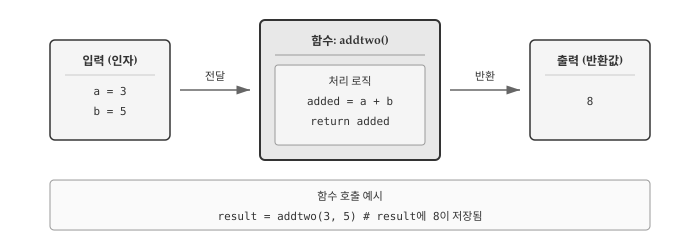
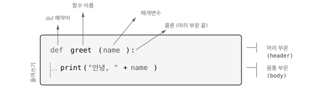
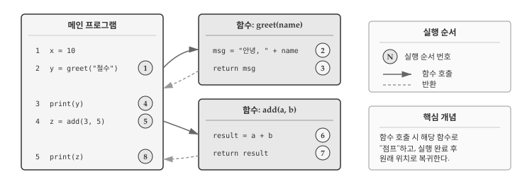
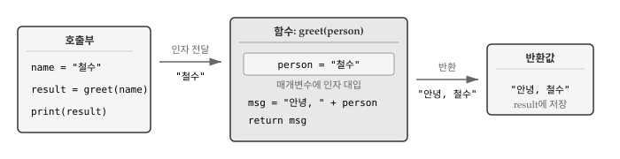
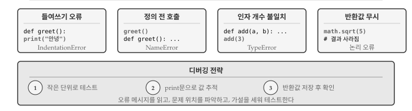

# 함수 {#sec-func}

프로그래밍에서 반복되는 작업을 효율적으로 처리하는 방법이 필요하다. 같은 계산을 여러 번 수행해야 할 때마다 동일한 코드를 복사해서 붙여넣는 것은 비효율적이고 오류가 발생하기 쉽다. **함수(function)**는 특정 작업을 수행하는 코드 블록에 이름을 붙여 재사용할 수 있게 해준다.

@fig-func-overview 는 함수의 핵심 개념을 보여준다. 함수는 입력(인자)을 받아 정해진 연산을 수행하고 결과(반환값)를 돌려준다. 마치 자판기에 동전을 넣고 버튼을 누르면 음료가 나오는 것처럼, 함수에 값을 전달하면 처리된 결과를 얻는다. 

{#fig-func-overview}

## 함수 호출 {#sec-func-call}
\index{함수 호출}

**함수(function)**는 명명된 명령어의 집합으로 특정 연산을 수행한다. 함수를 사용하려면 함수 이름 뒤에 괄호를 붙여 **호출(call)**한다. 이미 함수 호출 예제를 살펴보았다.

```{pyodide-python}
type(32)  # <class 'int'>
```

함수명은 `type`이고, 괄호 안의 `32`가 **인자(argument)**다. 인자는 함수에 전달하는 입력값으로, 함수가 작업을 수행하는 데 필요한 재료다. `type()` 함수는 인자의 자료형을 알려주는 결과를 **반환(return)**한다.
\index{괄호!인자 입력}
\index{인자}
\index{반환값}

함수는 인자를 "받아서" 결과를 "돌려준다"고 표현한다. 함수가 돌려주는 결과를 **반환값(return value)**이라고 부른다.

## 내장 함수 {#sec-func-builtin}
\index{내장 함수}

파이썬에는 직접 정의하지 않아도 바로 사용할 수 있는 **내장 함수(built-in function)**가 많다. 자주 필요한 기능을 파이썬 개발자들이 미리 만들어 두었기 때문이다.

`max()`와 `min()` 함수는 여러 값 중에서 최댓값과 최솟값을 각각 찾아준다.

```{pyodide-python}
max(1, 5, 3, 9, 2)  # 9
```

```{pyodide-python}
min(1, 5, 3, 9, 2)  # 1
```

문자열에도 `max()`와 `min()`을 적용할 수 있다. 문자열에서는 알파벳 순서(정확히는 유니코드 코드 포인트)를 기준으로 비교한다.

```{pyodide-python}
min('Hello world')  # ' ' (공백)
```

공백 문자(' ')의 유니코드 값이 알파벳보다 작아서 최솟값으로 반환된다.

`len()` 함수는 객체의 길이를 반환한다. 문자열에 사용하면 문자 개수를 알려준다.

```{pyodide-python}
len('Hello world')  # 11
```

```{pyodide-python}
len('헬로 월드')  # 5
```

영문은 공백 포함 11자, 한글은 공백 포함 5자다. `len()` 함수는 바이트 수가 아니라 문자 개수를 센다.

::: {.callout-warning}
### 내장 함수명은 변수로 사용하지 않는다

`max`, `min`, `len`, `type` 같은 내장 함수 이름을 변수명으로 사용하면 원래 함수를 덮어써서 더 이상 사용할 수 없게 된다.

```python
# 나쁜 예: 내장 함수명을 변수로 사용
max = 100  # 이제 max() 함수를 호출할 수 없다!
```
:::

### 자료형 변환 함수 {#sec-func-type-conversion}
\index{변환!자료형}
\index{자료형 변환}

한 자료형을 다른 자료형으로 변환하는 내장 함수가 있다. `int()` 함수는 값을 정수로 변환한다. 변환이 가능하면 정수를, 불가능하면 오류를 발생시킨다.
\index{int 함수}
\index{함수!int}

```{pyodide-python}
int('32')  # 32
```

```{pyodide-python}
int('Hello')  # ValueError: 문자열을 정수로 변환 불가
```

`int()`는 부동 소수점 숫자도 정수로 변환하는데, 소수점 이하를 버린다(반올림하지 않는다).

```{pyodide-python}
int(3.99999)  # 3
```

```{pyodide-python}
int(-2.3)  # -2
```

`float()` 함수는 정수와 문자열을 부동 소수점 숫자로 변환한다.
\index{float 함수}
\index{함수!float}

```{pyodide-python}
float(32)  # 32.0
```

```{pyodide-python}
float('3.14159')  # 3.14159
```

`str()` 함수는 인자를 문자열로 변환한다.
\index{str 함수}
\index{함수!str}

```{pyodide-python}
str(32)  # '32'
```

```{pyodide-python}
str(3.14159)  # '3.14159'
```

### 난수 함수 {#sec-func-random}
\index{난수}
\index{숫자, 랜덤}
\index{결정론적}
\index{의사 난수}

컴퓨터는 같은 입력에 같은 출력을 내는 **결정론적(deterministic)** 기계다. 하지만 게임이나 시뮬레이션처럼 예측 불가능한 결과가 필요한 경우도 있다. 이때 **의사 난수(pseudorandom number)**를 사용한다. 의사 난수는 결정론적 알고리즘으로 생성되지만, 겉보기에는 무작위처럼 보인다.

파이썬에서 난수를 사용하려면 `random` 모듈을 가져와야 한다. `random.random()` 함수는 0.0 이상 1.0 미만의 부동 소수점 난수를 반환한다.
\index{random 모듈}
\index{함수!random}

```{pyodide-python}
import random

for i in range(5):
    x = random.random()
    print(x)
```

실행할 때마다 다른 숫자가 출력된다. `random.randint(a, b)` 함수는 a 이상 b 이하의 정수 난수를 반환한다.
\index{randint 함수}
\index{함수!randint}

```{pyodide-python}
random.randint(1, 10)  # 1~10 사이 정수 (무작위)
```

`random.choice()` 함수는 시퀀스에서 무작위로 요소 하나를 선택한다.

```{pyodide-python}
parties = ["민주당", "국민의힘", "녹색정의당"]
random.choice(parties)  # 리스트에서 무작위 선택
```

### 수학 함수 {#sec-func-math}
\index{수학 함수}
\index{함수, 수학}
\index{math 모듈}

과학 계산이나 데이터 분석에서 제곱근, 삼각함수, 로그 같은 수학 연산이 필요할 때가 많다. 파이썬은 `math` 모듈에 수학 함수들을 모아두었다. **모듈(module)**은 관련 함수들을 묶어놓은 파일로, 필요할 때 `import`문으로 불러와서 사용한다.

```{pyodide-python}
import math

math.sqrt(2)  # 1.4142135623730951
```

**점 표기법(dot notation)**으로 모듈 이름과 함수 이름을 연결한다. `math.sqrt(2)`는 "math 모듈의 sqrt 함수에 2를 전달"한다는 의미다.
\index{점 표기법}

삼각함수도 제공된다. `sin()`, `cos()`, `tan()` 등은 **라디안(radian)** 단위의 각도를 인자로 받는다.
\index{삼각 함수}
\index{함수, 삼각법}
\index{라디안}

```{pyodide-python}
degrees = 45
radians = degrees / 360.0 * 2 * math.pi
math.sin(radians)  # 0.7071067811865476
```

$\sin(45°) = \frac{\sqrt{2}}{2}$와 일치하는지 확인해보자.

```{pyodide-python}
math.sqrt(2) / 2  # 0.7071067811865476
```

`math.pi`는 원주율 $\pi$ 값을 약 15자리까지 정확하게 제공한다.
\index{원주율}

```{pyodide-python}
math.pi  # 3.141592653589793
```

로그 함수는 지수의 역연산으로, 과학과 공학 분야에서 광범위하게 사용된다. `math.log10()`은 상용로그(밑이 10)를 계산하고, `math.log()`는 자연로그(밑이 $e$)를 계산한다. 오디오 신호의 데시벨(dB) 계산, 지진 강도의 리히터 규모, pH 농도 측정 등이 모두 로그를 기반으로 한다.
\index{로그 함수}
\index{함수!log}

```{pyodide-python}
signal_power = 9
noise_power = 10
ratio = signal_power / noise_power
decibels = 10 * math.log10(ratio)
print(decibels)  # -0.4575749056067512
```

신호 대 잡음비(9/10 = 0.9)를 데시벨로 변환하면 약 -0.46dB이 나온다. 음수가 나오는 것은 신호가 잡음보다 약하다는 의미다.

## 함수 정의 {#sec-func-definition}
\index{함수}
\index{함수 정의}
\index{정의!함수}

파이썬이 제공하는 내장 함수만으로는 모든 문제를 해결할 수 없다. 특정 업무에 맞는 계산이나 반복적으로 수행해야 하는 작업이 있다면 직접 함수를 만들어야 한다. **함수 정의(function definition)**는 새 함수의 이름을 짓고, 호출될 때 실행할 문장들을 지정하는 것이다.

{#fig-func-anatomy}

@fig-func-anatomy 는 함수 정의의 구조를 보여준다. 함수 정의는 크게 **머리 부문(header)**과 **몸통 부문(body)**으로 나뉜다. 머리 부문은 `def` 예약어로 시작해서 함수 이름, 괄호로 감싼 매개변수, 콜론(`:`)으로 구성된다. 몸통 부문은 머리 부문 아래에 들여쓰기된 문장들로, 함수가 호출될 때 실제로 실행되는 코드다.

```{pyodide-python}
def print_lyrics():
    print("나는 나무꾼이고, 괜찮아요.")
    print("나는 밤새도록 자고, 하루 종일 일해요.")
```

`print_lyrics` 함수는 매개변수가 없어서 괄호 안이 비어 있다. 함수 이름 규칙은 변수와 같아서 문자, 숫자, 밑줄을 사용할 수 있고, 숫자로 시작할 수 없으며, 예약어는 사용할 수 없다.
\index{def 예약어}
\index{예약어!def}
\index{머리 부문}
\index{몸통 부문}

함수를 정의하면 같은 이름의 **함수 객체(function object)**가 생성된다. 함수 객체는 변수처럼 출력하거나 타입을 확인할 수 있다.

```{pyodide-python}
print(print_lyrics)  # <function print_lyrics at 0x...>
type(print_lyrics)   # <class 'function'>
```

함수를 실제로 실행하려면 함수명 뒤에 괄호를 붙여 **호출**해야 한다. 괄호가 없으면 함수 객체 자체를 참조할 뿐 실행되지 않는다. 

```{pyodide-python}
print_lyrics()
```

한 번 정의한 함수는 여러 번 호출할 수 있고, 다른 함수 내부에서도 사용할 수 있다. 아래 `repeat_lyrics()` 함수는 `print_lyrics()`를 두 번 호출해서 가사를 반복 출력한다.

```{pyodide-python}
def repeat_lyrics():
    print_lyrics()
    print_lyrics()

repeat_lyrics()
```

::: {.callout-note}
### 함수 정의 순서

함수는 호출되기 전에 정의되어야 한다. 다음 코드는 `greet()` 함수가 정의되기 전에 호출되어 오류를 발생시킨다.

```python
greet()              # NameError: 정의 전에 호출

def greet():
    print("안녕하세요!")
```

하지만 함수 정의 내부에서 아직 정의되지 않은 함수를 참조하는 것은 괜찮다. 파이썬은 함수를 정의할 때 내부 코드를 실행하지 않고, 호출할 때 실행한다. 따라서 실제 호출 시점에 참조하는 함수가 존재하면 문제없이 동작한다.

```python
def repeat_lyrics():
    print_lyrics()   # 정의 시점에는 없지만 OK

def print_lyrics():
    print("나는 나무꾼이고, 괜찮아요.")

repeat_lyrics()      # 호출 시점에는 둘 다 정의됨
```
:::

## 실행 흐름 {#sec-func-flow}
\index{실행 흐름} 

프로그램은 첫 문장부터 시작해서 위에서 아래로 한 문장씩 실행된다. 함수 정의는 실행 순서를 바꾸지 않지만, 함수 내부 문장은 호출될 때까지 실행되지 않는다.

{#fig-func-flow}

@fig-func-flow 는 함수 호출 시 실행 흐름을 보여준다. 함수가 호출되면 프로그램은 함수 몸통으로 "점프"해서 모든 문장을 실행한 뒤, 원래 위치로 돌아와서 다음 문장을 계속 실행한다.

함수 내부에서 다른 함수를 호출할 수도 있다. 한 함수 실행 중에 또 다른 함수로 점프하고, 그 함수가 끝나면 돌아오는 식이다. 파이썬은 현재 실행 위치를 정확히 추적하므로, 함수 실행이 끝나면 정확히 떠났던 지점으로 복귀한다.

프로그램을 읽을 때 반드시 위에서 아래로 읽을 필요는 없다. 때로는 실행 흐름을 따라가는 것이 코드 이해에 도움이 된다.

## 매개변수와 반환값 {#sec-func-parameter}
\index{매개변수}
\index{인자}
\index{반환값}

함수의 진정한 힘은 **매개변수**와 **반환값**에서 나온다. 매개변수를 통해 함수에 다양한 입력을 전달하고, 반환값을 통해 계산 결과를 받아올 수 있다. 같은 함수라도 입력에 따라 다른 결과를 내놓기 때문에, 한 번 작성한 함수를 여러 상황에서 재사용할 수 있다.

{#fig-func-param-return}

@fig-func-param-return 은 함수 호출 시 데이터가 어떻게 흐르는지 보여준다. 호출부에서 인자 `"철수"`를 전달하면, 함수 내부에서 매개변수 `person`에 대입된다. 함수가 처리를 마치고 `return`문을 만나면 반환값 `"안녕, 철수"`가 호출부로 돌아와 변수 `result`에 저장된다.

### 매개변수 {#sec-func-param-detail}

**매개변수(parameter)**는 함수 정의의 괄호 안에 선언하는 변수로, 함수가 외부에서 값을 받아들이는 통로 역할을 한다. 함수를 호출할 때 전달하는 실제 값을 **인자(argument)**라고 부르며, 인자가 매개변수에 대입되어 함수 내부에서 사용된다.

```{pyodide-python}
def print_twice(bruce):
    print(bruce)
    print(bruce)
```

`print_twice` 함수는 `bruce`라는 매개변수를 가진다. 함수를 호출할 때 전달한 인자가 `bruce`에 대입되고, 함수 몸통에서 두 번 출력된다. 문자열, 숫자, 변수 등 다양한 값을 인자로 전달할 수 있다.

```{pyodide-python}
print_twice('Spam')       # Spam (두 번 출력)
```

```{pyodide-python}
print_twice(17)           # 17 (두 번 출력)
```

```{pyodide-python}
import math
print_twice(math.pi)      # 3.141592653589793 (두 번 출력)
```

인자로 표현식을 전달하면 함수 호출 전에 먼저 평가된다. `'Spam' * 4`는 `'SpamSpamSpamSpam'`으로, `math.cos(math.pi)`는 `-1.0`으로 계산된 후 함수에 전달된다.

```{pyodide-python}
print_twice('Spam' * 4)   # SpamSpamSpamSpam (두 번 출력)
```

```{pyodide-python}
print_twice(math.cos(math.pi))  # -1.0 (두 번 출력)
```

변수를 인자로 전달할 수도 있다. 변수에 저장된 값이 매개변수에 복사된다.

```{pyodide-python}
half_chicken = "요기, 닭 반마리요"
print_twice(half_chicken)  # 요기, 닭 반마리요 (두 번 출력)
```

인자로 전달된 변수명(`half_chicken`)과 매개변수명(`bruce`)은 서로 무관하다. 호출 시점에 값이 복사될 뿐, 함수 내부에서는 오직 매개변수명으로만 값을 참조한다. 변수명이 달라도 문제없이 동작하는 이유가 여기에 있다.

### 반환값 {#sec-func-return}
\index{return 문}
\index{값 반환 함수}

매개변수가 함수로 들어가는 입구라면, **반환값(return value)**은 함수에서 나오는 출구다. `math.sqrt()`, `math.cos()` 같은 함수는 계산 결과를 반환하므로, 그 값을 변수에 저장하거나 다른 계산에 바로 활용할 수 있다. 결과를 반환하는 함수를 **값 반환 함수(fruitful function)**라고 부른다.

```{pyodide-python}
x = math.cos(0)                    # 1.0
golden = (math.sqrt(5) + 1) / 2    # 1.618033988749895 (황금비)
print(x, golden)
```

`math.cos(0)`의 반환값 `1.0`이 변수 `x`에 저장되고, `math.sqrt(5)`의 반환값은 표현식에서 바로 사용되어 황금비를 계산한다. 반환값을 활용하면 함수 호출을 연쇄적으로 연결하거나 복잡한 계산식을 구성할 수 있다.

반면 `print_twice()` 같은 함수는 화면에 출력하는 **동작**만 수행하고 의미 있는 값을 돌려주지 않는다. 반환값 없이 동작만 수행하는 함수를 **무반환 함수(void function)**라고 부른다.

```{pyodide-python}
result = print_twice('Bing')  # Bing 출력 (두 번)
print(result)                 # None
```

무반환 함수도 실제로는 `None`을 반환한다. `None`은 파이썬에서 "값이 없음"을 나타내는 특별한 값이다. `print_twice()`의 반환값을 변수에 저장하면 `None`이 들어간다.
\index{None}

직접 정의한 함수에서 결과를 반환하려면 `return` 문을 사용한다. `return` 뒤에 반환할 값을 지정하면, 함수 실행이 즉시 종료되고 해당 값이 호출한 곳으로 전달된다.

```{pyodide-python}
def addtwo(a, b):
    added = a + b
    return added

x = addtwo(3, 5)
print(x)  # 8
```

`addtwo(3, 5)`를 호출하면 `a`에 3, `b`에 5가 대입되고, `added`에 8이 저장된 후 `return`문이 8을 반환한다. 호출한 곳에서는 반환값 8이 변수 `x`에 대입된다.

::: {.callout-note}
### 함수를 사용하는 이유 {#sec-func-why}
\index{함수, 사용 이유}

프로그램 규모가 커지면 코드 관리가 어려워진다. 수백 줄의 코드가 한 파일에 쭉 나열되어 있으면 특정 기능이 어디에 있는지 찾기 힘들고, 같은 계산을 여러 곳에서 반복하게 되며, 한 부분을 수정했을 때 다른 부분에 어떤 영향을 미치는지 파악하기 어렵다. 함수는 코드 관리 문제를 해결하는 핵심 도구다.

`calculate_tax(income)`이라는 함수 호출 한 줄은 세금 계산 로직 10줄보다 의도를 명확하게 전달한다. 함수 이름만 보고도 "소득에서 세금을 계산한다"는 것을 알 수 있기 때문이다. 내부 구현이 복잡하더라도 호출하는 쪽에서는 신경 쓸 필요가 없다. 마치 자동차 운전자가 엔진 내부 작동 원리를 몰라도 운전할 수 있는 것과 같다.

- **가독성**: 코드 블록에 의미 있는 이름을 붙여 프로그램 구조를 명확하게 드러낸다.
- **중복 제거**: 반복되는 코드를 한 번만 작성하고, 수정할 때도 한 곳만 고치면 된다.
- **분할 정복**: 큰 문제를 작은 함수 단위로 나눠서 독립적으로 개발하고 테스트할 수 있다.
- **재사용**: 잘 만든 함수는 다른 프로젝트에서도 활용할 수 있다.
:::

## 디버깅 {#sec-func-debug}
\index{디버깅}

함수를 작성하다 보면 예상대로 동작하지 않는 상황을 자주 만난다. 오류 메시지가 뜨기도 하고, 프로그램은 실행되지만 결과가 이상할 때도 있다. 함수 관련 오류는 크게 **구문 오류(syntax error)**와 **논리 오류(logic error)**로 나뉜다. 구문 오류는 파이썬이 코드를 해석조차 못하는 경우이고, 논리 오류는 실행은 되지만 의도와 다르게 동작하는 경우다.

{#fig-func-debug}

@fig-func-debug 는 함수 작성 시 자주 만나는 네 가지 오류 유형을 보여준다. 들여쓰기 오류와 정의 전 호출은 파이썬이 즉시 오류 메시지를 띄우므로 발견하기 쉽다. 반면 인자 개수 불일치는 실행 시점에, 반환값 무시는 결과를 확인할 때 비로소 드러난다.

### 들여쓰기 오류 {#sec-func-debug-indent}

파이썬에서 들여쓰기는 단순한 스타일이 아니라 **문법**이다. 함수 몸통은 머리 부문보다 반드시 한 단계 안쪽으로 들여쓰기해야 한다. 들여쓰기가 없거나 일관되지 않으면 `IndentationError`가 발생한다.

```python
def greet():
print("안녕")  # IndentationError: expected an indented block
```

더 까다로운 문제는 탭과 공백이 섞인 경우다. 화면에서는 똑같이 보여도 파이썬은 탭(1개)과 공백(4개)을 다르게 인식한다. 어떤 줄은 탭으로, 어떤 줄은 공백으로 들여쓰기하면 `TabError`나 예상치 못한 동작이 발생한다. 대부분의 코드 편집기는 **탭을 공백으로 자동 변환**하는 기능을 제공한다. VS Code, PyCharm 같은 IDE에서 자동 변환 기능을 켜두면 들여쓰기 문제를 원천적으로 예방할 수 있다.

### 함수 정의 전 호출 {#sec-func-debug-order}

파이썬 인터프리터는 코드를 **위에서 아래로** 읽는다. 함수를 정의하기 전에 호출하면, 파이썬은 아직 호출된 함수가 무엇인지 모르기 때문에 `NameError`를 발생시킨다.

```python
greet()  # NameError: name 'greet' is not defined

def greet():
    print("안녕")
```

오류 메시지 `name 'greet' is not defined`는 "greet라는 이름을 모르겠다"는 뜻이다. `NameError`가 발생하면 두 가지를 확인해야 한다. 첫째, 함수 이름에 오타가 없는지(대소문자 포함). 둘째, 함수 정의가 호출보다 위에 있는지. 특히 여러 파일로 나뉜 프로젝트에서는 `import`문을 빠뜨렸을 때도 같은 오류가 발생한다.

### 인자 개수 불일치 {#sec-func-debug-args}

함수를 정의할 때 매개변수를 2개 선언했는데 호출할 때 인자를 1개만 전달하면 `TypeError`가 발생한다. 반대로 인자를 너무 많이 전달해도 마찬가지다.

```python
def addtwo(a, b):
    return a + b

addtwo(3)      # TypeError: addtwo() missing 1 required positional argument: 'b'
addtwo(1,2,3)  # TypeError: addtwo() takes 2 positional arguments but 3 were given
```

오류 메시지가 상세해서 문제 파악이 쉽다. `missing 1 required positional argument: 'b'`는 "필수 인자 b가 빠졌다"는 뜻이고, `takes 2 positional arguments but 3 were given`은 "2개를 받는데 3개가 전달됐다"는 뜻이다. 함수를 호출할 때는 정의를 확인해서 매개변수 개수와 순서를 맞춰야 한다.

### 반환값 무시 {#sec-func-debug-return}

값 반환 함수를 호출하고 결과를 변수에 저장하지 않으면, 계산은 수행되지만 결과가 **사라진다**. 파이썬이 오류를 띄우지 않기 때문에 논리 오류에 해당한다.

```python
math.sqrt(5)  # 2.2360...이 계산되지만 어디에도 저장되지 않음
```

초보자가 자주 하는 실수는 함수가 값을 "자동으로 기억한다"고 생각하는 것이다. 함수는 호출될 때마다 독립적으로 실행되고, 반환값을 명시적으로 받아두지 않으면 휘발된다. 결과를 사용하려면 반드시 변수에 저장하거나 다른 표현식에서 바로 활용해야 한다.

```python
result = math.sqrt(5)  # 변수에 저장해서 나중에 사용
print(math.sqrt(5))    # 바로 출력 함수에 전달
area = math.pi * math.sqrt(5) ** 2  # 표현식에서 바로 사용
```

::: {.callout-tip}
### 함수 디버깅 3단계 전략

함수가 예상대로 동작하지 않을 때 다음 순서로 점검한다.

**1단계: 작은 입력으로 테스트**
함수를 작성한 직후, 결과를 예측할 수 있는 간단한 값으로 테스트한다. `addtwo(1, 2)`가 3을 반환하는지, `greet("철수")`가 "안녕, 철수"를 출력하는지 확인한다.

**2단계: print문으로 값 추적**
함수 내부에서 변수 값이 어떻게 변하는지 확인하려면 `print()`를 삽입한다. 매개변수가 제대로 전달됐는지, 중간 계산 결과가 맞는지, 반환 직전 값이 예상과 일치하는지 출력해본다.

**3단계: 반환값 저장 후 확인**
함수 호출 결과를 변수에 저장하고 `print()`로 출력해서 예상값과 비교한다. 예상과 다르면 2단계로 돌아가 함수 내부를 추적한다.
:::

## AI와 함께하는 함수 {#sec-func-ai}

\index{AI 코딩}
\index{프롬프트}

AI에게 함수 작성을 요청할 때는 **입력(매개변수)**, **출력(반환값)**, **수행할 동작**을 명확히 명시해야 한다. "계산 함수 만들어줘"보다 구체적인 요구사항을 담은 프롬프트가 더 정확한 코드를 생성한다.

```
두 숫자를 받아 사칙연산 결과를 반환하는 함수를 작성해줘.

- 함수명: calculate
- 매개변수:
  * a (숫자)
  * b (숫자)
  * operator (문자열: '+', '-', '*', '/')
- 반환값: 계산 결과 (숫자)
- 예외 처리:
  * 나누기에서 b가 0이면 None 반환
  * 잘못된 연산자면 None 반환
- 예시: calculate(10, 3, '+') → 13
```

함수 **시그니처(signature)**—이름, 매개변수, 반환값—를 프롬프트에 명시하면 AI가 생성한 코드를 검증하기 쉽다. 매개변수 이름이 의도대로인지, 반환값 타입이 맞는지, 예외 상황을 처리하는지 확인하면 된다.

AI가 생성한 함수를 검토할 때 확인할 사항은 다음과 같다.

1. **매개변수 검증**: 예상치 못한 입력(None, 빈 문자열, 음수 등)에 대한 처리
2. **반환값 일관성**: 모든 경로에서 같은 타입을 반환하는지
3. **경계값 처리**: 최솟값, 최댓값, 0 등 특수 값에서 동작 확인
4. **부작용 여부**: 함수가 전역 변수를 변경하거나 예상치 못한 출력을 하지 않는지

::: {.callout-tip}
### 함수 테스트 케이스 생성 프롬프트

AI가 생성한 함수가 복잡할 때, 테스트 케이스 생성을 요청할 수 있다.

```
위 calculate 함수에 대해 pytest 테스트 코드를 작성해줘.
다음 케이스를 포함해야 해:
- 정상 동작: 각 연산자별 기본 테스트
- 경계값: 0으로 나누기, 음수 연산
- 예외 상황: 잘못된 연산자 입력
```

AI가 테스트 코드를 생성하면 `pytest`로 실행해서 함수의 정확성을 검증할 수 있다. 테스트가 실패하면 어느 입력에서 문제가 생겼는지 바로 알 수 있다.
:::

함수 분해(decomposition)도 AI에게 도움을 요청할 수 있다. 긴 코드를 여러 함수로 나누는 것은 설계 판단이 필요한 작업인데, AI가 합리적인 분해 방안을 제시해준다.

```
아래 코드를 여러 함수로 분해해줘. 각 함수는 한 가지 일만 해야 해.

[긴 코드 붙여넣기]

함수별로 다음을 명시해줘:
- 함수명 (동사로 시작)
- 매개변수와 반환값
- 한 줄 설명
```

AI가 제안한 함수 구조가 마음에 들지 않으면 "더 작은 단위로 나눠줘" 또는 "validate_input과 check_format은 하나로 합쳐줘"처럼 피드백을 주면서 반복적으로 개선할 수 있다.

::: {.content-visible when-format="pdf"}
\faLightbulb\ 생각해볼 점
:::

::: {.content-visible when-format="html"}
## 💡 생각해볼 점 {.unnumbered}
:::


함수는 프로그래밍의 핵심 도구다. 코드를 함수로 구조화하면 복잡한 문제를 작은 단위로 분해하여 해결할 수 있다. 각 함수는 하나의 명확한 목적을 가지고, 입력을 받아 출력을 내놓는 독립적인 단위로 동작한다.

좋은 함수는 **한 가지 일을 잘 수행**한다. 함수가 너무 많은 일을 하면 이해하기 어렵고 재사용하기도 힘들다. `calculate_tax_and_send_email_and_update_database()`보다는 `calculate_tax()`, `send_email()`, `update_database()`로 분리하는 것이 낫다.

함수 이름은 **동사로 시작**하는 것이 관례다. `get_user()`, `calculate_sum()`, `is_valid()` 등 동작을 나타내는 이름이 좋다. 이름만 보고도 함수가 무엇을 하는지 짐작할 수 있어야 한다.

매개변수와 반환값의 관계를 명확히 이해하는 것이 중요하다. 매개변수는 함수 외부에서 내부로 값을 전달하는 통로이고, 반환값은 함수 내부에서 외부로 결과를 전달하는 통로다. 입력과 출력, 단 두 개의 통로만으로 함수는 외부 세계와 소통한다.

앞으로 더 복잡한 프로그램을 작성하면서 함수의 진가를 경험하게 될 것이다. 반복문, 조건문과 함께 함수를 활용하면 어떤 복잡한 문제도 체계적으로 해결할 수 있다.
