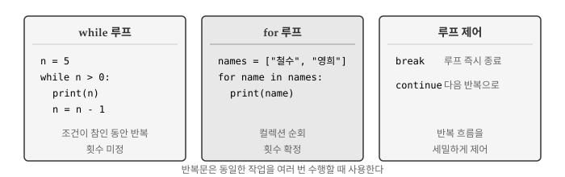
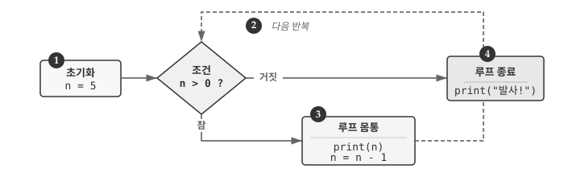
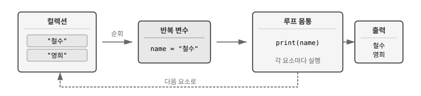
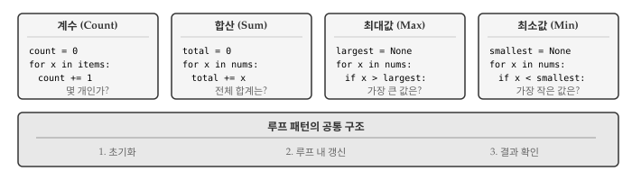
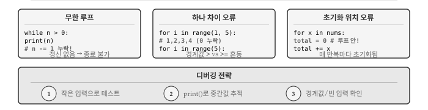

# 반복문 {#sec-loop}

프로그래밍에서 같은 작업을 여러 번 수행해야 하는 상황은 흔하다. 리스트의 모든 항목을 출력하거나, 파일의 각 줄을 처리하거나, 특정 조건이 만족될 때까지 계산을 반복해야 할 때가 있다. **반복문(loop)**은 코드 블록을 여러 번 실행하게 해주는 제어 구조로, 컴퓨터가 사람보다 잘하는 일—오류 없이 동일한 작업을 반복하는 일—을 활용할 수 있게 해준다.
\index{반복문}
\index{루프}

{#fig-loop-overview}

@fig-loop-overview 는 파이썬의 두 가지 반복문과 루프 제어 키워드를 보여준다. `while` 문은 조건이 참인 동안 반복하며 반복 횟수가 미리 정해지지 않는다. `for` 문은 컬렉션의 각 요소를 순회하며 반복 횟수가 확정된다. `break`와 `continue`는 반복 흐름을 세밀하게 제어한다.

## while 문 {#sec-loop-while}
\index{while 문}
\index{문장!while}

`while` 문은 조건이 참인 동안 코드 블록을 반복 실행한다. "~하는 동안"이라는 영어 단어 while에서 알 수 있듯이, 특정 조건이 유지되는 한 같은 작업을 계속한다. 조건을 먼저 검사하고, 참이면 몸통을 실행한 뒤 다시 조건을 검사하는 과정을 거짓이 될 때까지 반복한다. 반복 횟수가 미리 정해지지 않아서 **불확정 루프(indefinite loop)**라고도 부른다.

```{pyodide-python}
n = 5
while n > 0:
    print(n)
    n = n - 1

print("발사!")
```

`n`이 5에서 시작해서 0보다 큰 동안 값을 출력하고 1씩 감소시킨다. `n`이 0이 되면 조건 `n > 0`이 거짓이 되어 루프를 빠져나가고 "발사!"를 출력한다.

{#fig-loop-while}

@fig-loop-while 은 `while` 루프의 실행 흐름을 보여준다. 조건 검사 → 몸통 실행 → 조건 재검사의 순환 구조가 핵심이다. 조건이 거짓이 되면 루프를 벗어나 다음 문장으로 진행한다.

### 변수 갱신과 초기화 {#sec-loop-update}
\index{갱신}
\index{변수!갱신}
\index{초기화}

`while` 문을 사용하려면 **반복 변수(iteration variable)**를 적절히 관리해야 한다. 반복 변수는 루프가 몇 번 실행되었는지 추적하거나, 종료 조건을 판단하는 데 사용된다. 루프 실행 전에 **초기화**하고, 루프 내부에서 **갱신**해야 한다. 초기화 없이 갱신하려 하면 오류가 발생하고, 갱신 없이 루프를 돌리면 무한 루프에 빠진다.

```{pyodide-python}
x = 0       # 초기화
x = x + 1   # 갱신 (증가)
print(x)    # 1
```

변수에 1을 더해서 갱신하는 것을 **증가(increment)**, 1을 빼서 갱신하는 것을 **감소(decrement)**라고 부른다. 존재하지 않는 변수를 갱신하려고 하면 오류가 발생하므로 반드시 초기화를 먼저 해야 한다.

```python
# 초기화하지 않고 갱신하면 오류
y = y + 1  # NameError: name 'y' is not defined
```

### 무한 루프 {#sec-loop-infinite}
\index{무한 루프}
\index{반복!무한}

반복 변수가 없거나 조건이 항상 참이면 루프가 영원히 반복된다. **무한 루프(infinite loop)**는 프로그램이 멈추지 않고 계속 실행되는 상태로, 대부분 버그에서 비롯된다. 그러나 서버가 요청을 계속 기다리거나, 게임이 사용자 입력을 반복적으로 받아야 할 때처럼 의도적으로 사용하는 경우도 있다.

```python
# 무한 루프 - 실행하면 멈추지 않음
while True:
    print("끝없이 반복")
```

카운트다운 예제는 `n`이 매번 감소해서 결국 0에 도달하므로 루프가 종료된다. 반면 조건이 `True` 상수이거나 반복 변수를 갱신하지 않으면 종료 조건을 만족할 수 없어 무한 루프에 빠진다.

::: {.callout-warning}
### 무한 루프 탈출법

무한 루프에 빠진 프로그램을 멈추려면 다음과 같이 각각 조치를 취한다.

- **터미널**: `Ctrl+C` (키보드 인터럽트)
- **주피터 노트북**: 커널 중단 버튼 (정사각형 아이콘)
- **IDE**: 실행 중지 버튼
:::

## 루프 제어 {#sec-loop-control}
\index{break 문}
\index{continue 문}

루프 실행 중에 특정 조건에서 즉시 빠져나가거나, 현재 반복을 건너뛰고 다음 반복으로 넘어가야 할 때가 있다. 예를 들어 리스트에서 원하는 값을 찾으면 더 이상 반복할 필요가 없고, 유효하지 않은 데이터는 처리를 건너뛰어야 한다. `break`와 `continue` 문이 루프 흐름을 세밀하게 제어한다. `break`는 루프를 완전히 탈출하고, `continue`는 현재 반복만 건너뛴다. 

### break 루프 종료 {#sec-loop-break}

`break` 문은 루프를 즉시 종료하고 루프 다음 문장으로 이동한다. 조건문 내부에서 `break`를 실행하면 남은 반복을 모두 건너뛰고 루프 밖으로 나온다. 무한 루프와 함께 사용하면 "특정 조건이 발생하면 멈춘다"는 논리를 명확하게 표현할 수 있다. 검색 문제에서 원하는 값을 찾으면 더 탐색할 필요가 없을 때 유용하다.

```{pyodide-python}
while True:
    line = input("> ")
    if line == "done":
        break
    print(line)

print("종료!")
```

사용자가 "done"을 입력하기 전까지 입력값을 그대로 출력한다. `break` 문이 실행되면 `while` 루프를 벗어나 "종료!"를 출력한다. 루프 조건 자체는 항상 `True`지만, `break` 덕분에 안전하게 종료된다.

### continue 반복 건너뛰기 {#sec-loop-continue}

`continue` 문은 현재 반복의 나머지 부분을 건너뛰고 루프 조건 검사(while) 또는 다음 요소(for)로 바로 이동한다. `break`와 달리 루프 자체는 계속 실행된다. 특정 조건에서 처리를 생략하고 다음 항목으로 넘어가고 싶을 때 유용하다. 데이터 전처리에서 빈 값이나 잘못된 형식을 건너뛸 때 자주 사용된다.

```{pyodide-python}
for num in range(10):
    if num % 2 == 0:
        continue
    print(num)  # 홀수만 출력
```

`num`이 짝수면 `continue`가 실행되어 `print(num)`을 건너뛴다. 결과적으로 1, 3, 5, 7, 9만 출력된다.

다음 예제는 주석(#으로 시작하는 줄)을 제외하고 입력을 출력한다.

```{pyodide-python}
lines = ["hello", "# 주석입니다", "world", "# 또 다른 주석"]

for line in lines:
    if line.startswith("#"):
        continue
    print(line)
```

`startswith("#")`로 주석 여부를 판단하고, 주석이면 `continue`로 건너뛴다.

## for 문 {#sec-loop-for}
\index{for 문}
\index{문장!for}

`for` 문은 리스트, 문자열, range 객체 같은 **시퀀스(sequence)**의 각 요소를 순회하며 반복한다. 시퀀스의 첫 번째 요소부터 마지막 요소까지 차례로 반복 변수에 대입하고, 각 요소마다 루프 몸통을 한 번씩 실행한다. 반복 횟수가 시퀀스 길이로 확정되어 있어서 **확정 루프(definite loop)**라고도 부른다. `while` 문과 달리 반복 변수를 직접 갱신할 필요가 없어서 무한 루프 위험이 없다.

```{pyodide-python}
friends = ["철수", "영희", "민수"]

for friend in friends:
    print(f"안녕, {friend}!")

print("인사 완료!")
```

`friends` 리스트의 각 요소가 차례로 `friend` 변수에 대입되고, 루프 몸통이 실행된다. 리스트에 3개 요소가 있으므로 루프가 정확히 3번 반복된다.

{#fig-loop-for}

@fig-loop-for 는 `for` 루프의 동작 방식을 보여준다. 컬렉션에서 요소를 하나씩 꺼내 반복 변수에 대입하고, 루프 몸통을 실행한 뒤, 다음 요소로 넘어간다. 모든 요소를 순회하면 루프가 종료된다.

### range 함수 {#sec-loop-range}
\index{range 함수}

정해진 횟수만큼 반복하려면 `range()` 함수를 사용한다. `range()`는 연속된 정수 시퀀스를 생성하는 함수로, 메모리에 모든 숫자를 저장하지 않고 필요할 때마다 다음 숫자를 계산한다. 인자 개수에 따라 시작값, 끝값, 간격을 지정할 수 있다.

```{pyodide-python}
for i in range(5):
    print(i)  # 0, 1, 2, 3, 4
```

`range(5)`는 0부터 4까지의 정수 시퀀스를 생성한다. `range(start, stop)`은 start부터 stop-1까지, `range(start, stop, step)`은 step 간격으로 생성한다.

```{pyodide-python}
for i in range(2, 10, 2):
    print(i)  # 2, 4, 6, 8
```

### 문자열 순회 {#sec-loop-string}

문자열도 시퀀스이므로 `for` 문으로 각 문자를 순회할 수 있다. 문자열은 문자들의 순서 있는 나열이기 때문에, 첫 글자부터 마지막 글자까지 차례로 접근할 수 있다. 텍스트에서 특정 문자의 개수를 세거나, 각 문자를 변환할 때 유용하다.

```{pyodide-python}
word = "Python"
for char in word:
    print(char)
```

## 루프 패턴 {#sec-loop-patterns}

루프를 사용해 데이터를 처리할 때 반복적으로 등장하는 패턴이 있다. **계수(counting)**, **합산(summing)**, **최대값/최소값 찾기**가 대표적이다. 패턴마다 루프 전 초기화, 루프 내 갱신, 루프 후 결과 확인이라는 공통 구조를 따른다. 패턴을 익히면 다양한 데이터 처리 문제에 체계적으로 접근할 수 있다. 파이썬은 `len()`, `sum()`, `max()`, `min()` 같은 내장 함수를 제공하지만, 패턴을 이해하면 조건부 처리나 복잡한 로직도 구현할 수 있다.

{#fig-loop-patterns}

@fig-loop-patterns 는 네 가지 핵심 루프 패턴을 보여준다. 모든 패턴은 세 단계 구조를 따른다: (1) 루프 전 변수 초기화, (2) 루프 내부에서 변수 갱신, (3) 루프 후 결과 확인.

### 계수 패턴 {#sec-loop-count}
\index{계수}
\index{누산기}

시퀀스의 항목 개수를 세려면 카운터 변수를 0으로 초기화하고, 각 반복마다 1씩 증가시킨다. 계수(counting) 패턴은 "몇 개인가?"라는 질문에 답한다. 단순히 전체 개수를 셀 수도 있고, 조건을 추가해서 특정 조건을 만족하는 항목만 셀 수도 있다.

```{pyodide-python}
numbers = [3, 41, 12, 9, 74, 15]
count = 0

for num in numbers:
    count = count + 1

print(f"항목 개수: {count}")  # 6
```

실제로는 `len()` 함수가 같은 기능을 제공하지만, 패턴을 이해하면 조건부 계수 같은 응용이 가능하다.

```{pyodide-python}
# 짝수만 세기
numbers = [3, 41, 12, 9, 74, 15]
even_count = 0

for num in numbers:
    if num % 2 == 0:
        even_count += 1

print(f"짝수 개수: {even_count}")  # 3
```

### 합산 패턴 {#sec-loop-sum}

시퀀스의 모든 값을 더하려면 합계 변수를 0으로 초기화하고, 각 반복마다 현재 값을 더한다. 합산(summing) 패턴은 "총 얼마인가?"라는 질문에 답한다. 판매액 총합, 점수 합계, 거리 누적 등 다양한 상황에서 사용된다.

```{pyodide-python}
numbers = [3, 41, 12, 9, 74, 15]
total = 0

for num in numbers:
    total = total + num

print(f"합계: {total}")  # 154
```

루프를 도는 동안 `total`은 "지금까지의 합계"를 담고 있다가, 루프가 끝나면 전체 합계가 된다. 합계를 누적하는 변수를 **누산기(accumulator)**라고 부른다.

```{pyodide-python}
# 평균 계산
numbers = [3, 41, 12, 9, 74, 15]
total = 0
count = 0

for num in numbers:
    total += num
    count += 1

average = total / count
print(f"평균: {average}")  # 25.666...
```

### 최대값과 최소값 패턴 {#sec-loop-minmax}
\index{루프!최대값}
\index{루프!최소값}

시퀀스에서 가장 큰 값이나 가장 작은 값을 찾으려면 특별한 초기화가 필요하다. 최대값(max)/최소값(min) 패턴은 "가장 큰(작은) 값은 무엇인가?"라는 질문에 답한다. 최고 점수, 최저 기온, 가장 비싼 상품 등을 찾을 때 사용된다. `None`으로 시작해서 첫 번째 값을 만나면 그 값으로 설정하고, 이후에는 비교를 통해 갱신한다.

```{pyodide-python}
numbers = [3, 41, 12, 9, 74, 15]
largest = None

for num in numbers:
    if largest is None or num > largest:
        largest = num

print(f"최대값: {largest}")  # 74
```

`largest is None`은 아직 아무 값도 보지 않았다는 뜻이다. 첫 번째 값 3이 `largest`에 저장되고, 이후 41, 74를 만날 때 더 큰 값으로 갱신된다.

최소값 찾기는 비교 연산자만 바꾸면 된다.

```{pyodide-python}
numbers = [3, 41, 12, 9, 74, 15]
smallest = None

for num in numbers:
    if smallest is None or num < smallest:
        smallest = num

print(f"최소값: {smallest}")  # 3
```

::: {.callout-note}
### 내장 함수 활용

파이썬은 계수, 합산, 최대/최소 계산을 위한 내장 함수를 제공한다.

```python
numbers = [3, 41, 12, 9, 74, 15]

len(numbers)   # 6 (개수)
sum(numbers)   # 154 (합계)
max(numbers)   # 74 (최대값)
min(numbers)   # 3 (최소값)
```

내장 함수가 있어도 루프 패턴을 이해하면 조건부 처리나 복잡한 로직을 구현할 수 있다.
:::

## 디버깅 {#sec-loop-debug}
\index{디버깅}

반복문은 같은 코드를 여러 번 실행하기 때문에, 작은 버그도 반복되면서 예상치 못한 결과를 만들어낸다. 루프가 예상대로 반복되는지, 반복 변수가 올바르게 갱신되는지 확인하는 것이 반복문 디버깅의 핵심이다.

{#fig-loop-debug}

@fig-loop-debug 는 반복문에서 자주 발생하는 세 가지 오류와 디버깅 전략을 보여준다. 무한 루프, 하나 차이(off-by-one) 오류, 초기화 위치 오류가 대표적이며, 작은 입력 테스트와 중간값 출력으로 대부분 해결할 수 있다.

### 무한 루프 {#sec-loop-debug-infinite}

무한 루프는 가장 흔하면서도 당황스러운 반복문 버그다. 프로그램이 멈추지 않고 계속 실행되거나, 같은 출력이 끝없이 반복된다. 원인은 단순하다. 반복 변수를 갱신하지 않거나, 종료 조건을 만족시킬 수 없는 경우다.

```python
# 버그: n을 감소시키지 않음
n = 5
while n > 0:
    print(n)
    # n = n - 1  # 이 줄이 빠지면 무한 루프
```

카운트다운 코드에서 `n = n - 1` 한 줄이 빠지면 `n`은 영원히 5로 남아 조건 `n > 0`이 항상 참이 된다. 무한 루프가 의심되면 먼저 반복 변수가 루프 내에서 갱신되는지 확인해야 한다. `while True:` 패턴을 사용할 때는 `break`문이 반드시 실행될 수 있는 경로가 있는지 검토한다.

### 하나 차이(off-by-one) 오류 {#sec-loop-debug-offbyone}
\index{하나 차이 오류}
\index{off-by-one 오류|see{하나 차이 오류}}

하나 차이 오류는 루프가 한 번 더 또는 한 번 덜 실행되는 경우다. 경계 조건에서 `>` 대신 `>=`를 쓰거나, `range()` 함수의 시작과 끝 값을 혼동하면 발생한다. 결과가 "거의 맞지만 하나가 빠졌거나 하나가 더 있다"면 경계 조건을 의심해야 한다.

```{pyodide-python}
# 0부터 4까지 출력하려면
for i in range(5):      # 올바름: 0, 1, 2, 3, 4
    print(i, end=" ")
print()

for i in range(1, 5):   # 잘못됨: 1, 2, 3, 4 (0 누락)
    print(i, end=" ")
```

`range(5)`는 0부터 4까지 5개의 숫자를 생성하고, `range(1, 5)`는 1부터 4까지 4개만 생성한다. 파이썬의 `range()`는 끝 값을 포함하지 않는다는 점을 기억해야 한다. 경계값에서 헷갈리면 작은 예제로 직접 확인하는 것이 확실하다.

### 초기화 위치 오류 {#sec-loop-debug-init}

누산기나 카운터 변수를 루프 **안**에서 초기화하면, 매 반복마다 값이 초기화되어 누적이 되지 않는다. 합계를 구하려 했는데 마지막 값만 나온다면 초기화 위치를 확인해야 한다.

```{pyodide-python}
# 잘못된 위치: 루프 안에서 초기화
numbers = [3, 41, 12, 9]
for num in numbers:
    total = 0      # 매 반복마다 0으로 리셋
    total += num
print(f"잘못된 합계: {total}")  # 9 (마지막 값만)

# 올바른 위치: 루프 밖에서 초기화
total = 0
for num in numbers:
    total += num
print(f"올바른 합계: {total}")  # 65
```

### 이분법 디버깅 {#sec-loop-debug-bisection}
\index{디버깅!이분법}

루프가 많은 반복을 수행하는데 어디서 문제가 생기는지 모르겠다면 **이분법(bisection)**을 활용한다. 루프 중간에 `print()`를 넣어 변수 상태를 확인하고, 문제가 전반부인지 후반부인지 파악한 뒤 범위를 좁혀간다. 100번 반복하는 루프에서 50번째에 출력을 넣으면, 문제가 앞쪽 절반인지 뒤쪽 절반인지 바로 알 수 있다.

```{pyodide-python}
numbers = [3, 41, 12, 9, 74, 15]
total = 0

for i, num in enumerate(numbers):
    total += num
    print(f"반복 {i}: num={num}, total={total}")  # 디버그용 출력

print(f"최종 합계: {total}")
```

`enumerate()`를 사용하면 인덱스와 값을 함께 확인할 수 있어 "몇 번째 반복에서 문제가 생겼는지" 파악하기 쉽다. 디버깅이 끝나면 `print()` 문을 제거하거나 주석 처리한다.

::: {.callout-tip}
### 루프 디버깅 3단계

**1단계: 작은 입력으로 테스트**. 2~3개 항목으로 예상 결과를 손으로 계산하고 프로그램 결과와 비교한다. 작은 입력에서 문제가 발견되면 큰 입력에서도 같은 문제가 있다.

**2단계: 중간 상태 출력**. 매 반복마다 반복 변수, 누산기, 조건 변수 등을 `print()`로 출력해서 예상 값과 비교한다. 어느 시점에서 예상과 달라지는지 찾는다.

**3단계: 경계값 확인**. 빈 리스트, 단일 요소, 음수, 0 등 특수 케이스에서 루프가 올바르게 동작하는지 테스트한다. 경계값에서 발생하는 오류가 가장 찾기 어렵다.
:::

## AI와 함께하는 반복문 {#sec-loop-ai}
\index{AI 코딩}

AI에게 반복문 관련 코드를 요청할 때는 **무엇을 반복하는지**, **언제 멈추는지**, **각 반복에서 무엇을 하는지** 명확히 설명해야 한다.

```
파이썬 함수를 작성해줘:
- 함수명: find_average
- 입력: 숫자 리스트
- 반환: 평균값 (리스트가 비어있으면 None)
- 조건: sum()이나 len() 함수 사용하지 않고 for 루프로 직접 계산
```

AI가 생성한 반복문 코드를 검토할 때 확인할 사항은 다음과 같다.

1. **초기화 확인**: 루프 전에 변수가 올바르게 초기화되었는지
2. **갱신 확인**: 루프 내에서 반복 변수나 누산기가 적절히 갱신되는지
3. **종료 조건**: 무한 루프 가능성이 없는지
4. **경계값 처리**: 빈 입력, 단일 요소 등 특수 케이스가 처리되는지

::: {.callout-tip}
### AI에게 테스트 케이스 요청하기

```
위 함수에 대한 pytest 테스트 코드를 작성해줘.
다음 케이스를 포함해야 해:
- 일반적인 숫자 리스트
- 단일 요소 리스트
- 빈 리스트
- 음수가 포함된 리스트
```
:::

::: {.content-visible when-format="pdf"}
\faLightbulb\ 생각해볼 점
:::

::: {.content-visible when-format="html"}
## 💡 생각해볼 점 {.unnumbered}
:::


반복문은 컴퓨터의 강점—지치지 않고 동일한 작업을 반복하는 능력—을 활용하는 핵심 도구다. `while`과 `for` 중 어느 것을 사용할지는 상황에 따라 다르다.

**반복 횟수가 미리 정해져 있다면** `for` 문이 적합하다. 리스트 순회, 정해진 횟수 반복, 파일의 각 줄 처리 등이 해당한다. `for` 문은 반복 변수 관리를 자동으로 해주므로 무한 루프 위험이 없다.

**종료 조건이 동적으로 결정된다면** `while` 문이 적합하다. 사용자 입력 대기, 수렴 조건 만족, 파일 끝 도달 등이 해당한다. 단, 반복 변수를 적절히 갱신해서 무한 루프를 방지해야 한다.

루프 패턴을 익히면 다양한 데이터 처리 문제를 체계적으로 해결할 수 있다. 계수, 합산, 최대/최소 찾기는 가장 기본적인 패턴이며, 필터링, 변환, 검색 등으로 확장된다. 패턴의 공통 구조—초기화, 갱신, 결과 확인—를 이해하면 새로운 문제에도 쉽게 적용할 수 있다.

앞으로 문자열, 리스트, 파일을 다루면서 반복문을 더 자주 사용하게 될 것이다. 지금 익힌 `for`와 `while`의 기본 구조가 모든 반복 처리의 토대가 된다.
