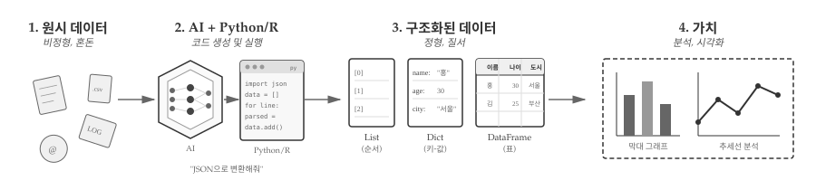
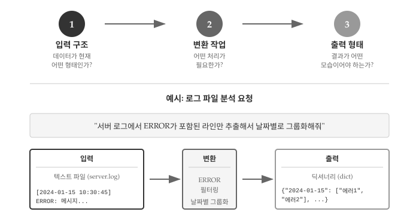

```{r}
#| include: false

source("_common.R")
```

# 데이터, AI 식량 {#data-intro}

\index{자료구조}

1부에서 프로그래밍의 핵심이 "의도를 명확히 전달하는 것"임을 배웠다. 테스트로 원하는 결과를 정의하고, AI에게 코드를 요청하고, 생성된 코드를 검증하는 흐름이었다. 이제 실제 데이터를 다룰 차례다.

프로그램은 데이터를 처리한다. 사용자 입력, 파일, 웹 API, 데이터베이스 등 다양한 곳에서 데이터가 들어오고, 프로그램은 이를 변환하여 유용한 결과물을 만들어낸다. AI도 마찬가지다. AI에게 작업을 요청할 때, 데이터의 형태와 구조를 명확히 전달해야 원하는 결과를 얻을 수 있다.

이번 부를 마치면, 지저분한 텍스트 파일 하나를 AI에게 던져주고 "로그에서 에러만 추출해서 날짜별로 정리해줘"라고 요청할 수 있게 된다.

## 데이터 두 얼굴 {#data-intro-types}

\index{비정형 데이터}
\index{정형 데이터}

회사에서 "지난달 회의록 정리해줘"라는 요청을 받았다고 하자. 메일함을 열어보니 회의록이 이메일 본문, 워드 파일, 슬랙 메시지 등 제각각 흩어져 있다. 어떤 것은 날짜가 제목에 있고, 어떤 것은 본문 첫 줄에 있다. 사람은 문맥을 파악해서 정리할 수 있지만, 컴퓨터에게 "알아서 정리해"라고 시킬 수는 없다. 바로 여기서 비정형 데이터와 정형 데이터의 구분이 시작된다.

**비정형 데이터(Unstructured Data)**는 자유로운 형식을 갖는 데이터다. 이메일 본문, 채팅 로그, 웹페이지 HTML, 자연어 텍스트 등이 해당한다. 사람은 읽을 수 있지만, 컴퓨터가 바로 처리하기엔 구조가 없다.

```
From: user@example.com
Date: 2024-01-15
Subject: 프로젝트 회의 결과

오늘 회의에서 다음 주 마감을 3월 20일로 확정했습니다.
참석자: 홍길동, 김철수, 이영희
```

**정형 데이터(Structured Data)**는 미리 정해진 구조를 따르는 데이터다. CSV 파일, JSON, 데이터베이스 테이블, 엑셀 시트 등이 해당한다. 행과 열, 또는 키와 값으로 명확히 구분되어 있어 컴퓨터가 바로 처리할 수 있다.

```json
{
  "meeting": {
    "date": "2024-01-15",
    "deadline": "2024-03-20",
    "participants": ["홍길동", "김철수", "이영희"]
  }
}
```

## AI 역할: 변환과 분석 {#data-intro-ai-role}

\index{데이터 변환}
\index{파싱}

앞서 본 회의록 이메일을 JSON으로 정리하고 싶다면 어떻게 해야 할까? 직접 정규표현식을 작성하고 파싱 로직을 짜야 할까? AI 코딩 도구가 있다면 그럴 필요가 없다. "이 이메일에서 날짜, 참석자, 마감일을 추출해서 JSON으로 만들어줘"라고 요청하면 된다.

**변환(Transformation)**은 비정형 데이터를 정형 데이터로 바꾸는 작업이다. 로그 파일에서 특정 패턴을 추출하거나, 이메일에서 날짜와 발신자를 파싱하거나, 웹페이지에서 표를 긁어오는 작업이 해당한다.

**분석(Analysis)**: 정형 데이터를 집계, 필터링, 시각화하는 작업이다. 월별 매출 합계를 구하거나, 특정 조건을 만족하는 행만 추출하거나, 데이터 분포를 차트로 그리는 작업이 해당한다.

변환과 분석 역할을 수행하려면, AI에게 데이터의 **현재 구조**와 **원하는 결과 구조**를 명확히 전달해야 한다. 바로 여기서 자료구조 지식이 필요하다.

::: {.callout-note}
## LLM 시대 새로운 기본 단위: 토큰

\index{토큰}
\index{토큰화}
\index{BPE}

리스트, 딕셔너리, 데이터프레임은 프로그래머가 데이터를 다루는 자료구조다. 그런데 AI, 특히 대규모 언어 모델(LLM)은 텍스트를 어떤 단위로 처리할까? 바로 **토큰(Token)**이다.

토큰은 LLM이 텍스트를 이해하고 생성하는 가장 작은 단위다. 단어도 아니고 글자도 아닌, 그 사이 어딘가에 있는 **부분어(subword)**다. 예를 들어 "토큰화"라는 단어는 "토큰"과 "화"로 나뉠 수 있고, "unhappiness"는 "un", "happiness"로 분리될 수 있다. GPT 모델은 BPE(Byte Pair Encoding)라는 알고리즘으로 자주 등장하는 문자열 조합을 하나의 토큰으로 묶는다.

왜 토큰이 중요한가? LLM의 모든 것이 토큰 단위로 작동하기 때문이다. 입력 길이 제한(컨텍스트 윈도우), API 비용 계산, 응답 생성 속도 모두 토큰 수에 따라 결정된다. GPT-4 Turbo의 128K 토큰 컨텍스트는 대략 영어 기준 96,000단어, 한글 기준 그보다 적은 양을 처리할 수 있다는 뜻이다. 한글은 같은 의미를 전달하는 데 영어보다 더 많은 토큰이 필요해서 상대적으로 불리하다.

프로그래머 관점에서 토큰을 직접 다룰 일은 드물다. 하지만 AI에게 긴 문서를 요약하거나 대량의 데이터를 분석 요청할 때, "토큰 한도를 초과했습니다"라는 오류를 만나게 된다. 그때 토큰이 무엇인지 알면 입력을 어떻게 나눠야 할지, 프롬프트를 어떻게 줄여야 할지 감이 온다.
:::

## 핵심 자료구조 미리보기 {#data-intro-preview}

"데이터를 리스트로 저장해줘"와 "데이터를 딕셔너리로 저장해줘"는 결과가 완전히 다르다. 프로그래밍에서 자료구조는 데이터를 담는 그릇이고, 어떤 그릇을 선택하느냐에 따라 할 수 있는 작업이 달라진다. AI에게 요청할 때도 적절한 자료구조를 언급하면 더 정확한 결과를 얻는다.

수많은 자료구조 중에서 **리스트**, **딕셔너리**, **데이터프레임** 세 가지를 먼저 소개하는 데는 이유가 있다. 프로그래밍에서 리스트는 순서가 있는 데이터를 다루는 가장 기본적인 컬렉션이고, 딕셔너리는 JSON과 API가 지배하는 현대 웹 환경에서 데이터 교환의 표준 형식이 됐다. 데이터 과학에서는 데이터프레임이 분석의 출발점이자 종착점이다. CSV를 읽으면 데이터프레임이 되고, 분석 결과도 데이터프레임으로 정리된다. 세 자료구조만 제대로 이해해도 대부분의 데이터 처리 작업을 AI에게 명확히 요청할 수 있다.

### 순서 데이터는 리스트 {#data-intro-list}

\index{리스트}

프로그래밍에서 리스트는 반복 처리의 기본 단위다. 파일의 각 줄, 사용자 목록, 작업 큐 등 "여러 개를 순서대로 처리"해야 하는 모든 상황에서 리스트가 등장한다. 데이터 과학에서는 시계열 데이터나 관측값 시퀀스를 담는 데 사용된다. **리스트(List)**는 순서가 있는 데이터 모음이다. 첫 번째, 두 번째, 세 번째 등 위치가 의미를 갖는다.

```python
# 할 일 목록 - 순서대로 처리해야 함
tasks = ["데이터 수집", "전처리", "분석", "시각화", "보고서 작성"]

# 월별 매출 - 시간 순서가 중요함
monthly_sales = [1200, 1500, 1350, 1800, 2100]
```

### 이름 기준 데이터는 딕셔너리 {#data-intro-dict}

\index{딕셔너리}

프로그래밍에서 딕셔너리는 빠른 검색이 필요할 때 빛을 발한다. 사용자 ID로 정보를 찾거나, 설정값을 키로 조회하거나, 캐시를 구현할 때 핵심 역할을 한다. 웹 개발에서는 JSON이 곧 딕셔너리이므로, API 통신 기본 언어라 해도 과언이 아니다. **딕셔너리(Dictionary)**는 키-값 쌍의 모음이다. 이름표(키)로 값을 찾는다.

```python
# 사용자 정보 - 필드명으로 접근
user = {
    "name": "홍길동",
    "email": "hong@example.com",
    "age": 30
}

# 설정 파일 - 키로 값 조회
config = {
    "database_host": "localhost",
    "port": 5432,
    "debug": True
}
```

### 표 형태 데이터는 데이터프레임 {#data-intro-dataframe}

\index{데이터프레임}

데이터 과학에서 데이터프레임은 분석 작업의 중심이다. CSV 파일을 읽으면 데이터프레임이 되고, 필터링·그룹화·집계 결과도 데이터프레임으로 반환된다. 파이썬 pandas, R data.frame/tibble 모두 동일한 개념이다. 행은 개별 관측치(사람, 거래, 이벤트)를, 열은 속성(이름, 금액, 날짜)을 나타내는 구조가 직관적이어서 통계 분석과 시각화의 표준 입력 형식으로 자리 잡았다.**데이터프레임(DataFrame)**은 행과 열로 구성된 표 형식 데이터다. 엑셀 시트와 유사하다.

```
   이름      부서      급여
0  홍길동    개발팀   5000
1  김철수    기획팀   4500
2  이영희    마케팅   4800
```

## 데이터 처리 워크플로우 {#data-intro-workflow}

서버 로그 파일 하나를 받았다고 하자. 수천 줄의 텍스트에서 에러만 골라내고, 날짜별로 정리하고, 최종적으로 막대 그래프로 시각화하고 싶다. 데이터를 다루는 과정이 바로 데이터 처리 워크플로우다.

{#fig-data-workflow fig-align="center" width="100%"}

데이터 처리는 혼돈에서 질서로 나아가는 과정이다. 처음에는 로그 파일, CSV, 이메일 등 형식이 제각각인 **원시 데이터**가 있다. 다양한 비정형 데이터를 그대로 분석에 사용할 수는 없다.

여기서 **AI와 프로그래밍 언어**가 등장한다. "JSON으로 변환해줘"라고 요청하면, AI가 파이썬이나 R 코드를 생성하고 실행한다. 사용자는 원하는 결과만 말하고, 구체적인 구현은 AI가 담당하는 구조다.

AI가 생성한 코드는 원시 데이터를 **구조화된 형태**로 변환한다. 순서가 중요하면 리스트, 이름표로 접근해야 하면 딕셔너리, 행과 열로 구성된 표 형식이면 데이터프레임이 된다. 자료구조를 알면 AI에게 더 정확한 명세를 전달할 수 있다.

구조화된 데이터는 곧 **가치**로 이어진다. 집계하고, 필터링하고, 시각화하여 의미 있는 인사이트^[인사이트(insight)는 데이터에서 발견한 '통찰'을 뜻한다. 단순한 수치 확인이 아니라, "왜 이런 현상이 발생했는가", "다음에 어떤 일이 일어날 것인가"처럼 의사결정에 도움이 되는 깊은 이해를 말한다.]를 도출한다. 막대 그래프로 비교하거나 추세선으로 패턴을 파악하는 것이 최종 목표다.

## AI에게 데이터 작업 지시 {#data-intro-ai-request}

AI에게 "데이터 분석해줘"라고 요청하면 어떤 결과가 나올까? 아마도 기대와 다른 결과가 나올 가능성이 높다. AI가 마음을 읽을 수 없기 때문이다. "매출 데이터 정리해줘"라고 하면 AI는 어떤 파일인지, 어떤 형식으로 정리할지, 결과를 어디에 저장할지 알 수 없다. 모호한 요청은 모호한 결과를 낳는다.

효과적인 데이터 작업 요청에는 세 가지 요소가 필요하다. 첫째, **입력 구조**를 명확히 한다. 데이터가 CSV인지 JSON인지, 어떤 필드가 있는지, 몇 줄짜리인지 알려준다. 둘째, **변환 작업**을 구체적으로 기술한다. 필터링할 조건, 그룹화 기준, 계산할 집계 함수를 명시한다. 셋째, **출력 형태**를 지정한다. 결과가 리스트인지 딕셔너리인지 데이터프레임인지, 어떤 필드를 포함해야 하는지 말해준다.

{#fig-ai-request-spec fig-align="center" width="100%"}

@fig-ai-request-spec 은 서버 로그 분석 요청을 예로 든다. "ERROR가 포함된 라인만 추출해서 날짜별로 그룹화해줘"라는 요청에는 입력(텍스트 파일, 특정 라인 형식), 변환(ERROR 필터링, 날짜별 그룹화), 출력(딕셔너리 형태) 세 요소가 모두 담겨 있다. 이처럼 자료구조 용어를 사용해서 입출력을 명세하면, AI가 정확한 코드를 생성할 가능성이 높아진다.

자료구조를 배우는 진짜 이유가 여기에 있다. 단순히 문법을 익히는 것이 아니라, AI와 소통하는 공통 언어를 갖추는 것이다. "리스트로 반환해줘", "딕셔너리 키를 날짜로 해줘", "데이터프레임으로 조인해줘"처럼 정확한 용어로 요청하면 AI도 정확하게 응답한다. 이제 각 자료구조를 하나씩 살펴보자.

::: {.content-visible when-format="pdf"}
\faLightbulb\ 생각해볼 점
:::

::: {.content-visible when-format="html"}
## 💡 생각해볼 점 {.unnumbered}
:::

2부는 **문자열 → 파일 → 리스트 → 딕셔너리 → 튜플 → 데이터프레임** 순서로 진행된다. 파일이 자료구조 사이에 끼어 있어 어색해 보일 수 있지만, 실무 데이터 처리 흐름을 반영한 배치다.

문자열은 텍스트 데이터의 기본 단위다. 로그 한 줄, 이메일 본문, CSV의 각 셀 모두 문자열이다. 파일은 문자열의 원천이자 저장소다. 파일을 열어 한 줄씩 읽으면 문자열이 나오고, 처리 결과를 파일에 쓰면 영구 저장된다. 문자열을 배운 직후에 파일을 다루면 "문자열이 어디서 오는가"를 바로 체험할 수 있다.

리스트는 파일에서 읽은 여러 줄을 담는 그릇이다. `readlines()`로 파일을 읽으면 각 줄이 리스트 요소가 된다. 딕셔너리, 튜플, 데이터프레임은 리스트 위에 쌓이는 고급 자료구조다. 결국 **문자열 → 파일 → 리스트**는 "텍스트 조각 → 텍스트 덩어리 → 텍스트 모음"으로 확장되는 자연스러운 흐름이다.

