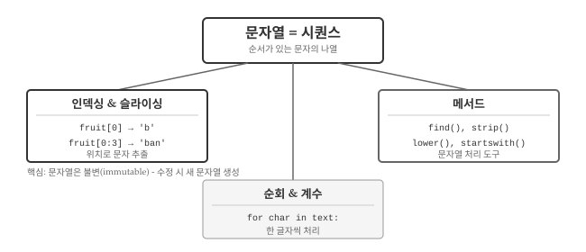
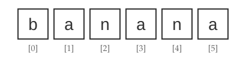
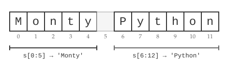
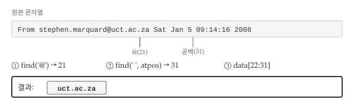
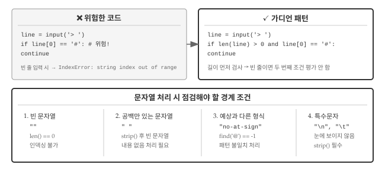

# 문자열 {#string}

\index{문자열}

서버 로그에서 에러 메시지만 추출하거나, 이메일 주소에서 도메인을 분리하거나, 사용자 입력에서 공백을 제거하는 작업을 떠올려보자. 모두 문자열을 다루는 작업이다. 텍스트 데이터는 프로그래밍에서 가장 흔히 마주치는 데이터 유형이고, 문자열 조작 능력은 데이터 처리의 기본이다.

AI에게 "로그 파일에서 ERROR가 포함된 라인만 추출해줘"라고 요청하면 AI는 문자열 패턴 매칭 코드를 생성한다. "문자열의 3번째부터 7번째 문자를 추출해줘"라고 말하려면, 먼저 인덱싱(indexing)과 슬라이싱(slicing)이 무엇인지 알아야 한다. 문자열의 기본 개념을 이해하면 AI가 생성한 코드를 검증하고 수정하는 것도 수월해진다.

{#fig-string-overview fig-align="center" width="100%"}

@fig-string-overview 는 문자열 핵심 개념을 보여준다. 문자열은 **시퀀스**, 즉 순서가 있는 문자들의 나열이다. 시퀀스라는 특성 덕분에 인덱싱으로 특정 위치의 문자를 꺼내고, 슬라이싱으로 구간을 추출하며, 순회로 한 글자씩 처리할 수 있다. 파이썬이 제공하는 문자열 메서드는 기본 연산 위에 편리한 도구를 더해준다.

## 인덱싱과 길이 {#string-indexing}
\index{시퀀스}
\index{문자}
\index{꺾쇠 연산자}
\index{연산자!꺾쇠}

"banana"라는 단어에서 세 번째 글자만 꺼내고 싶다면 어떻게 해야 할까? 문자열은 단순한 텍스트 덩어리가 아니라, 개별 문자들이 순서대로 나열된 시퀀스(sequence)다. 책장에 꽂힌 책처럼 각 문자는 고유한 위치를 갖고 있어서, 그 위치를 알면 원하는 문자를 정확히 집어낼 수 있다. 꺾쇠 연산자 `[]`로 특정 위치의 문자에 접근한다.

```python
fruit = 'banana'
letter = fruit[1]
print(letter)
#> a
```

변수 `fruit`에서 1번 위치 문자를 추출하여 `letter`에 대입했다. 꺾쇠 안의 숫자를 **인덱스(index)**라고 부르며, 시퀀스에서 원하는 문자의 위치를 지정한다. 그런데 결과가 'b'가 아니라 'a'다. 파이썬 인덱스는 문자열 처음부터의 오프셋(offset)[^string-1]으로, 첫 글자의 오프셋은 0이다. 따라서 `fruit[0]`이 'b', `fruit[1]`이 'a'가 된다.

[^string-1]: 오프셋은 어떤 기준점으로부터 떨어진 거리를 뜻한다. 메모리 주소 계산에서 자주 쓰이는 개념으로, 시작 주소에 오프셋을 더하면 원하는 위치를 찾을 수 있다.
\index{인덱스!0에서 시작}
\index{0, 인덱스 시작점}

{#fig-banana-string fig-align="center" width="100%"}

@fig-banana-string 에서 보듯이 6글자 문자열 'banana'의 인덱스는 0부터 5까지다. 인덱스에는 정수뿐 아니라 변수나 수식도 사용할 수 있지만, 인덱스 값은 반드시 정수여야 한다. 소수를 사용하면 TypeError가 발생한다.
\index{인덱스}
\index{예외!자료형 오류}
\index{자료형 오류}

```python
letter = fruit[1.5]
#> TypeError: string indices must be integers
```

문자열의 길이를 알려면 `len()` 함수를 쓴다. 사용자 입력을 받을 때 "비밀번호는 8자 이상이어야 합니다"라는 조건을 검사하려면, 먼저 입력된 문자열이 몇 글자인지 알아야 한다.
\index{len 함수}
\index{함수!len}

```python
fruit = 'banana'
len(fruit)
#> 6
```

문자열의 마지막 문자를 얻으려면 어떻게 해야 할까? 길이를 인덱스로 바로 사용하면 오류가 발생한다. 'banana'는 6글자지만 인덱스가 0부터 시작하므로 유효한 인덱스는 0~5다.
\index{예외!인덱스 오류}
\index{인덱스 오류}

```python
length = len(fruit)
last = fruit[length]
#> IndexError: string index out of range
```

마지막 문자를 얻으려면 `length - 1`을 사용하거나, 더 간편하게 음수 인덱스를 쓸 수 있다. `fruit[-1]`은 마지막 문자, `fruit[-2]`는 끝에서 두 번째 문자를 가리킨다. 음수 인덱스는 문자열 끝에서부터 거꾸로 센다고 생각하면 된다.
\index{인덱스!음수}
\index{음수 인덱스}

```python
fruit[-1]
#> 'a'
fruit[-2]
#> 'n'
```

## 슬라이싱 {#string-slice}
\index{슬라이스 연산자}
\index{연산자!슬라이스}
\index{인덱스!슬라이스}
\index{문자열!슬라이스}
\index{슬라이스!문자열}

URL에서 도메인 부분만 잘라내거나, 파일 경로에서 확장자만 추출하는 작업은 문자열의 특정 구간을 잘라내는 것이다. 이렇게 문자열의 일부분을 추출하는 것을 **슬라이싱(slicing)**이라 부르고, 추출된 부분 문자열을 **슬라이스(slice)**라고 한다. 한 글자만 꺼내는 인덱싱과 달리, 슬라이싱은 시작 위치와 끝 위치를 지정해서 여러 글자를 한 번에 가져온다.

{#fig-string-slice fig-align="center" width="100%"}

@fig-string-slice 는 'Monty Python' 문자열에서 슬라이싱이 어떻게 동작하는지 보여준다. `[n:m]` 연산자는 인덱스 `n`부터 `m-1`까지의 문자열을 반환한다. 끝 인덱스 `m`은 포함되지 않는다는 점이 중요하다.

```python
s = 'Monty Python'
print(s[0:5])
#> Monty
print(s[6:12])
#> Python
```

인덱스를 생략할 수도 있다. `fruit[:3]`은 처음부터 인덱스 2까지, `fruit[3:]`은 인덱스 3부터 끝까지를 의미한다. `fruit[:]`는 문자열 전체를 복사한다.

```python
fruit = 'banana'
fruit[:3]
#> 'ban'
fruit[3:]
#> 'ana'
```

시작 인덱스가 끝 인덱스보다 크거나 같으면 빈 문자열이 반환된다. 빈 문자열은 길이가 0인 문자열로, 문자가 없다는 점 외에는 일반 문자열과 동일하게 취급된다.
\index{빈 문자열}
\index{복사!슬라이스}
\index{슬라이스!복사}

```python
fruit[3:3]
#> ''
```

::: {.callout-note}
### 문자열은 불변이다
\index{가변성}
\index{불변성}
\index{문자열!불변성}

"Hello"를 "Jello"로 바꾸고 싶다면 첫 글자만 'J'로 교체하면 될 것 같다. 그런데 파이썬에서 이 시도는 오류를 일으킨다. 파이썬 문자열은 **불변(immutable)** 객체이기 때문이다. 한 번 생성된 문자열은 내부 문자를 직접 수정할 수 없다.

```python
greeting = 'Hello, world!'
greeting[0] = 'J'
#> TypeError: 'str' object does not support item assignment
```

문자열을 수정하려면 새 문자열을 생성해야 한다. 원하는 부분을 슬라이싱으로 잘라내고 새 문자와 연결하는 방식이다.

```python
new_greeting = 'J' + greeting[1:]
print(new_greeting)
#> Jello, world!
```
:::

## 순회와 계수 {#string-traversal}
\index{순회}
\index{루프!순회}
\index{for 문}
\index{루프!for}
\index{문장!for}

문자열에서 특정 문자가 몇 번 나오는지 세거나, 각 문자를 하나씩 검사해서 조건에 맞는 것만 골라내는 작업을 생각해보자. 이런 작업은 문자열을 처음부터 끝까지 한 글자씩 훑어가며 처리해야 한다. 이 패턴을 **순회(traversal)**라고 부른다. 순회는 `while` 루프나 `for` 루프로 구현할 수 있다.

```python
fruit = 'banana'
index = 0

while index < len(fruit):
    letter = fruit[index]
    print(letter)
    index = index + 1
```

`while` 루프가 문자열을 순회하며 한 줄에 한 글자씩 출력한다. `index`가 문자열 길이를 초과하면 조건이 거짓이 되어 루프가 종료된다. `for` 루프를 사용하면 인덱스 관리 없이 더 간결하게 순회할 수 있다.

```python
for char in fruit:
    print(char)
```

매 반복마다 다음 문자가 `char`에 대입되고, 문자열 끝에 도달하면 루프가 자동으로 종료된다.

### 계수기 패턴
\index{계수기}
\index{계수와 루프 돌기}
\index{루프 돌기와 계수}
\index{루프 돌기!문자열}

텍스트 분석에서 특정 문자나 단어가 몇 번 등장하는지 세는 것은 기본적인 작업이다. DNA 서열에서 'A' 염기가 몇 개인지, 문서에서 특정 키워드가 몇 번 나오는지 파악할 때 계수기 패턴을 사용한다. **계수기(counter)**라는 변수를 0으로 초기화한 뒤, 문자열을 순회하면서 조건에 맞을 때마다 1씩 증가시키는 방식이다.

```python
word = 'banana'
count = 0

for letter in word:
    if letter == 'a':
        count = count + 1

print(count)
#> 3
```

위 프로그램은 계수기 패턴의 전형적인 예다. `count`를 0으로 초기화하고, 조건에 맞을 때마다 1씩 증가시킨다. 루프가 끝나면 `count`에 총 횟수가 담긴다.

::: {.callout-tip}
### `in` 연산자와 문자열 비교
\index{in 연산자}
\index{연산자!in}
\index{문자열!비교}

문자열 안에 특정 문자나 부분 문자열이 포함되어 있는지 확인할 때는 `in` 연산자를 쓴다. 이메일 주소에 '@'가 있는지, 파일명에 '.txt'가 포함되어 있는지 검사할 때 유용하다.

```python
'a' in 'banana'
#> True
'seed' in 'banana'
#> False
```

문자열끼리도 `==`, `<`, `>` 같은 비교 연산자를 쓸 수 있다. 단, 문자열 비교는 ASCII 코드 기준 사전식 순서를 따르고, 대문자(65~90)가 소문자(97~122)보다 "작다". 따라서 "Pineapple"이 "banana"보다 앞에 온다. 대소문자 문제를 피하려면 비교 전에 `lower()`로 소문자로 통일하는 것이 좋다.
:::

## 문자열 메서드 {#string-method}

지금까지 배운 인덱싱, 슬라이싱, 순회만으로도 많은 것을 할 수 있지만, 실무에서는 더 편리한 도구가 필요하다. 대문자를 소문자로 바꾸거나, 앞뒤 공백을 제거하거나, 특정 패턴을 찾는 작업을 매번 직접 구현하는 것은 비효율적이다. 파이썬의 문자열 메서드는 이런 반복적인 작업을 한 줄로 처리할 수 있게 해준다.
\index{메서드}
\index{문자열!메서드}
\index{점 표기법}
\index{호출}

객체에 대해 이용 가능한 메서드를 보여주는 `dir` 함수가 있다. 메서드에 대한 상세한 문서는 `help`를 사용하거나 파이썬 공식 문서에서 찾을 수 있다.

```python
stuff = 'Hello world'
type(stuff)
#> <class 'str'>
dir(stuff)
#> ['capitalize', 'casefold', 'center', 'count', 'encode', ...]
```

메서드를 호출할 때는 점(`.`)을 사용해서 변수명에 메서드명을 붙인다. `upper` 메서드는 문자열을 모두 대문자로 변환한다.

```python
word = 'banana'
new_word = word.upper()
print(new_word)
#> BANANA
```

자주 쓰이는 메서드 몇 가지를 살펴보자. `find()` 메서드는 문자열 안에서 특정 문자의 위치를 찾는다. 첫 번째 매칭 위치(인덱스)를 반환하며, 찾지 못하면 -1을 반환한다. 두 번째 인자로 시작 위치를 지정할 수도 있다.

```python
word = 'banana'
word.find('a')
#> 1
word.find('na')
#> 2
word.find('na', 3)
#> 4
```

`strip()` 메서드는 문자열 앞뒤의 공백, 탭, 줄바꿈을 제거한다. 사용자 입력을 처리할 때 필수적으로 쓰인다. `startswith()`와 `endswith()`는 문자열이 특정 패턴으로 시작하거나 끝나는지 확인한다.

```python
line = '     Here we go '
line.strip()
#> 'Here we go'

line = '좋은 하루되세요!'
line.startswith('좋은')
#> True
```

대소문자 변환이 필요할 때는 `lower()`와 `upper()`를 쓴다. 대소문자를 구분하는 비교에서, 비교 전에 `lower()`로 소문자로 통일하면 문제를 피할 수 있다. 여러 메서드를 연결해서 한 줄에 처리하는 것도 가능하다.

```python
line = 'Please have a nice day'
line.lower().startswith('p')
#> True
```

### 문자열 파싱

로그 파일, 이메일 헤더, 설정 파일 등 실무에서 마주치는 텍스트 데이터는 대부분 일정한 형식을 갖고 있다. 형식을 분석해서 필요한 정보만 추출하는 작업을 **파싱(parsing)**이라 한다. 문자열 메서드와 슬라이싱을 조합하면 복잡해 보이는 텍스트에서도 원하는 부분만 정확히 뽑아낼 수 있다.

{#fig-string-parsing fig-align="center" width="100%"}

@fig-string-parsing 은 이메일 헤더에서 도메인을 추출하는 전략을 보여준다. 먼저 `@` 기호 위치를 찾고, 그 다음 공백 위치를 찾아서, 두 위치 사이의 문자열을 슬라이싱으로 추출한다.

```python
data = 'From stephen.marquard@uct.ac.za Sat Jan 5 09:14:16 2008'
atpos = data.find('@')
print(atpos)
#> 21
sppos = data.find(' ', atpos)
print(sppos)
#> 31
host = data[atpos+1:sppos]
print(host)
#> uct.ac.za
```

`find()` 메서드의 두 번째 인자로 `atpos`를 넘겨서 `@` 이후의 첫 공백을 찾았다. `find()`와 슬라이싱을 조합하면 복잡한 문자열에서도 원하는 부분을 정확히 추출할 수 있다.

::: {.callout-note}
### 서식 문자열
\index{서식 연산자}
\index{연산자!서식}
\index{서식 문자열}
\index{f-string}

"사용자 홍길동님, 포인트가 1500점 적립되었습니다"처럼 고정된 문장 틀에 변수 값을 끼워넣어야 할 때가 많다. 파이썬 3.6부터 도입된 **f-string**이 가장 간결하고 읽기 쉽다. 문자열 앞에 `f`를 붙이고, 중괄호 안에 변수명을 넣는다.

```python
camels = 42
message = f'I have spotted {camels} camels.'
print(message)
#> I have spotted 42 camels.
```

여러 변수도 자연스럽게 넣을 수 있다.

```python
years = 3
count = 0.1
animal = 'camels'
result = f'In {years} years I have spotted {count} {animal}'
print(result)
#> In 3 years I have spotted 0.1 camels
```

오래된 코드에서는 `format()` 메서드나 `%` 연산자를 볼 수 있지만, 새 코드에서는 f-string을 권장한다.
:::


## AI와 함께하는 문자열 처리 {#string-ai}

지금까지 배운 인덱싱, 슬라이싱, 문자열 메서드는 AI에게 작업을 요청할 때 더욱 빛을 발한다. "이메일에서 도메인 추출해줘"라고 막연히 말하는 것보다, "골뱅이 뒤부터 첫 번째 공백 전까지 슬라이싱해줘"라고 구체적으로 요청하면 AI가 훨씬 정확한 코드를 생성한다. 문자열 처리의 기본 개념을 알아야 AI와 효과적으로 소통할 수 있다.

AI에게 문자열 처리를 요청할 때 세 가지 정보를 명확히 전달해야 한다. 첫째, 처리할 문자열이 어떤 형태인지 **입력 예시**를 보여준다. 둘째, 결과가 어떤 모습이어야 하는지 **출력 예시**를 제시한다. 셋째, 빈 문자열이나 특수문자 같은 **경계 조건**을 명시한다.

**이메일 주소 추출** 프롬프트 예시:

> 다음 형식의 로그 라인에서 도메인(@뒤 부분)만 추출하는 함수를 작성해줘.
>
> 입력 예시: `"From user@example.com Sat Jan 5 09:14:16 2008"`
>
> 출력 예시: `"example.com"`
>
> 조건: 이메일이 없는 라인은 빈 문자열 반환

**텍스트 정규화** 프롬프트 예시:

> 사용자 입력 문자열을 정규화하는 함수가 필요해.
>
> - 앞뒤 공백 제거
> - 연속된 공백은 하나로
> - 모두 소문자로 변환
>
> 입력: `"  Hello   WORLD  "` → 출력: `"hello world"`

구체적인 입출력 예시와 경계 조건을 명시하면, AI가 정확한 코드를 생성할 가능성이 높아진다. 앞서 배운 슬라이싱, 문자열 메서드 개념을 알고 있으면 AI가 생성한 코드를 검증하고 수정하는 것도 수월해진다.

## 디버깅 {#string-debugging}
\index{디버깅}
\index{가디언 패턴}
\index{패턴!가디언}
\index{경계 조건}
\index{단락 평가}

문자열 처리 코드가 정상적인 입력에서는 잘 동작하다가, 실제 환경에서 예기치 않게 중단되는 경우가 있다. 대부분 **경계 조건(edge case)**을 고려하지 않아서 발생하는 문제다. 빈 문자열, 공백만 있는 문자열, 예상과 다른 형식의 데이터가 대표적인 경계 조건이다.

{#fig-string-debugging fig-align="center" width="100%"}

@fig-string-debugging 는 문자열 처리에서 흔히 발생하는 오류와 해결책을 보여준다. 왼쪽의 위험한 코드는 빈 줄을 입력하면 `IndexError`가 발생한다. 오른쪽의 가디언 패턴은 길이를 먼저 검사해서 인덱스 오류를 방지한다.

### 경계 조건 점검

문자열 처리 코드를 작성할 때 가장 먼저 점검해야 할 것은 빈 문자열이다. 길이가 0인 문자열에 `text[0]`처럼 인덱싱을 시도하면 `IndexError`가 발생한다.

```python
text = ""
if text[0] == "#":  # IndexError 발생!
    pass
```

공백만 있는 문자열도 주의가 필요하다. `"   "`처럼 공백 세 개가 있으면 `len()`은 3을 반환하지만, `strip()` 후에는 빈 문자열이 된다. 겉보기에는 내용이 있어 보이지만 실제로는 의미 있는 데이터가 없는 셈이다. 파이썬에서 빈 문자열은 조건문에서 `False`로 평가되므로, 불리언 특성을 활용해서 내용 유무를 검사할 수 있다.

```python
text = "   "
if text.strip():  # strip() 후 빈 문자열이면 False
    process(text)
```

예상과 다른 형식의 입력도 문제를 일으킨다. 이메일 주소에서 도메인을 추출하는 코드가 `@`가 없는 문자열을 만나면, `find()` 메서드는 -1을 반환한다. -1을 그대로 슬라이싱에 사용하면 예상치 못한 결과가 나온다. `find()`의 반환값을 항상 확인하는 습관이 필요하다.

```python
text = "invalid-email"
atpos = text.find("@")  # -1 반환
if atpos == -1:
    print("유효한 이메일이 아닙니다")
```

눈에 보이지 않는 특수문자도 흔한 함정이다. 줄바꿈(`\n`), 탭(`\t`), 캐리지 리턴(`\r`) 같은 문자는 화면에 표시되지 않지만 문자열에 포함되어 있다. 파일에서 읽은 데이터에는 이런 문자가 많으므로, 처리 전에 `strip()`으로 정리하는 것이 안전하다.

### 가디언 패턴

**가디언 패턴(guardian pattern)**은 위험한 연산 전에 조건을 먼저 검사해서 오류를 방지하는 기법이다. 파이썬의 `and` 연산자는 **단락 평가(short-circuit evaluation)**를 하기 때문에, 첫 조건이 `False`면 두 번째 조건을 평가하지 않는다. 단락 평가 특성을 활용하면 안전하게 조건을 연결할 수 있다.

```python
# 가디언 패턴: 길이 검사를 먼저
if len(line) > 0 and line[0] == "#":
    continue
```

`len(line) > 0`이 `False`면 `line[0]`은 평가되지 않으므로 `IndexError`가 발생하지 않는다. 여러 조건을 연결할 때도 같은 원리를 적용한다.

```python
# 이메일 파싱 시 가디언 패턴
atpos = data.find("@")
sppos = data.find(" ", atpos) if atpos != -1 else -1
if atpos != -1 and sppos != -1:
    host = data[atpos+1:sppos]
```

### `startswith()` 활용

가디언 패턴의 대안으로 `startswith()` 메서드를 활용할 수 있다. `startswith()`는 빈 문자열에서도 오류 없이 `False`를 반환한다.

```python
# 가디언 패턴 대신 startswith() 사용
line = ""
line.startswith("#")  # False, 오류 없음
```

두 방식 모두 유효하다. 코드의 의도가 "특정 문자로 시작하는지"를 확인하는 것이라면 `startswith()`가 더 명확하고, 첫 글자를 다른 용도로도 사용해야 한다면 가디언 패턴이 적합하다.

### AI 생성 코드 검증

AI가 생성한 문자열 처리 코드를 검증할 때도 경계 조건 점검이 핵심이다. AI에게 "코드가 빈 문자열을 받으면 어떻게 되는지 설명해줘"라고 물으면 잠재적 버그를 찾을 수 있다. 또한 "경계 조건을 처리하는 코드를 추가해줘"라고 요청하면 더 견고한 코드를 얻을 수 있다.

```
프롬프트 예시:
이 함수가 빈 문자열, 공백만 있는 문자열, @가 없는 문자열을
입력받으면 어떻게 동작하는지 분석하고, 문제가 있다면 수정해줘.
```

경계 조건을 명시적으로 언급하면 AI도 더 방어적인 코드를 생성한다. 문자열 처리에서 발생하는 대부분의 버그는 "정상적인 입력"만 가정하고 코드를 작성했기 때문이다.

::: {.content-visible when-format="pdf"}
\faLightbulb\ 생각해볼 점
:::

::: {.content-visible when-format="html"}
## 💡 생각해볼 점 {.unnumbered}
:::

문자열은 **시퀀스**라는 점이 핵심이다. 각 문자가 고유한 위치(인덱스)를 갖고 있어서, 인덱싱과 슬라이싱으로 원하는 부분을 정확히 추출할 수 있다. 파이썬 인덱스가 0부터 시작한다는 점, 문자열이 불변이라 직접 수정이 불가능하다는 점은 처음에 혼란스럽지만 금방 익숙해진다.

AI에게 문자열 처리를 요청할 때는 **입력 형태**, **원하는 변환**, **출력 형태** 세 가지를 명확히 전달하는 것이 중요하다. "이메일에서 도메인 추출해줘"보다 "`@`부터 첫 공백까지 슬라이싱해서 반환해줘"가 더 정확한 결과를 얻는다.

다음 장에서는 텍스트 데이터의 원천인 **파일**을 다룬다. 문자열을 파일에서 읽고, 처리 결과를 파일에 저장하는 방법을 배운다.
 