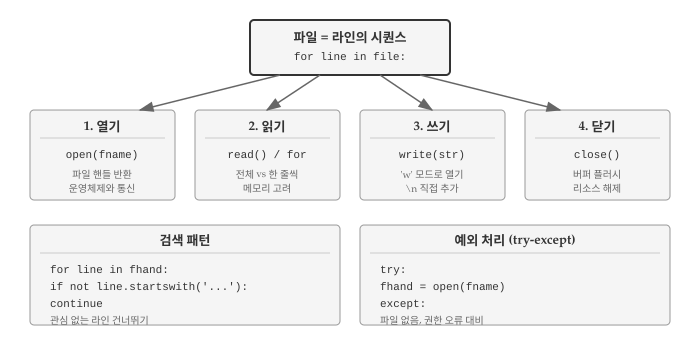
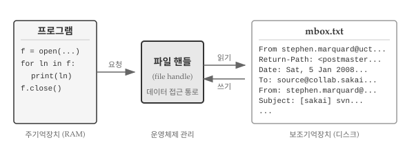
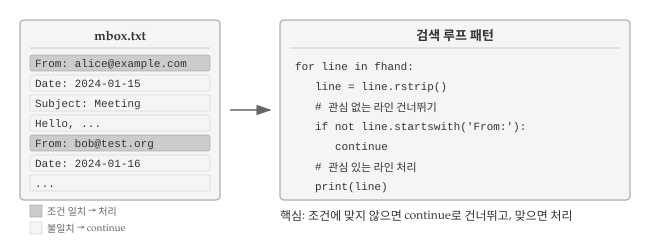
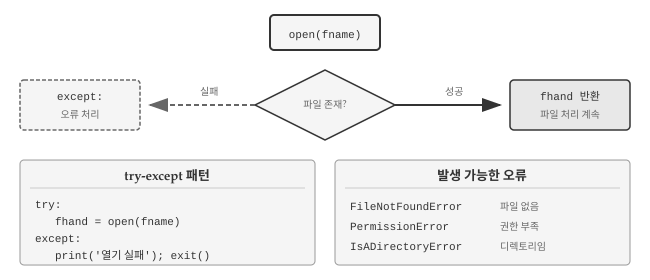

# 파일 {#sec-file}

\index{파일}
\index{자료형!파일}

데이터 분석은 파일에서 시작해서 파일로 끝난다. CSV, JSON, 텍스트 로그, 설정 파일 등 거의 모든 데이터가 파일 형태로 저장되고 교환된다. 웹에서 데이터를 가져오든 데이터베이스 결과를 저장하든, 결국 파일 읽기와 쓰기가 필요하다.

열기, 읽기, 쓰기, 닫기라는 기본 패턴을 익히면 AI에게 "대용량 파일을 청크 단위로 읽어서 처리해줘"와 같이 구체적으로 요청할 수 있게 된다.

{#fig-file-overview fig-align="center" width="100%"}

@fig-file-overview 는 파일 처리의 핵심 개념을 보여준다. 파일은 라인의 시퀀스이며, 열기-읽기/쓰기-닫기 패턴으로 처리한다.

## 영속성 {#sec-file-persistence}

\index{영속성}
\index{보조 기억장치}

앞선 장에서 조건문, 함수, 반복문으로 CPU에 명령을 전달하는 방법을 익혔다. 변수와 자료구조를 주기억장치(RAM)에 만들어 데이터를 다루는 법도 배웠다. CPU와 RAM은 프로그램이 실행되는 무대이자 모든 연산이 일어나는 공간이다.

그런데 컴퓨터 전원을 끄면 어떻게 될까? CPU와 RAM에 있던 모든 데이터가 사라진다. 지금까지 작성한 프로그램은 파이썬 학습용 연습에 불과했던 셈이다.

{#fig-software-architecture fig-align="center" width="100%"}

@fig-software-architecture 는 휘발성과 영속성의 차이를 보여준다. 왼쪽 CPU와 RAM은 프로그램 실행 중에만 데이터를 유지한다. 전원이 꺼지면 변수 값, 계산 결과, 자료구조가 모두 사라진다. 반면 오른쪽 보조기억장치는 전원과 무관하게 데이터를 보존한다. 파일로 저장하면 컴퓨터를 껐다 켜도 데이터가 남아 있고, USB 드라이브에 담아 다른 컴퓨터로 옮길 수도 있다.

이번 장에서는 보조 기억장치, 즉 파일을 다루기 시작한다. 먼저 텍스트 편집기로 작성한 텍스트 파일 읽기와 쓰기에 집중하고, 이후 데이터베이스 같은 바이너리 파일 처리는 별도 장에서 살펴본다.

## 파일 열기와 구조 {#sec-file-open}
\index{파일!열기}
\index{열기 함수}
\index{함수!열기}

하드 디스크에 있는 파일을 읽거나 쓰려면 먼저 파일을 열어야 한다. 파일을 열면 운영체제가 해당 파일의 위치를 찾아 접근 통로를 마련해 준다. 다음 예제에서는 [https://www.py4e.com/code3/mbox.txt](https://www.py4e.com/code3/mbox.txt)에서 파일을 내려받아 파이썬 스크립트와 같은 폴더에 저장한 뒤 열어본다.

```python
fhand = open('mbox.txt')
print(fhand)
#> <_io.TextIOWrapper name='mbox.txt' mode='r' encoding='cp949'>
```

`open()` 함수가 성공하면 **파일 핸들**(file handle)이 반환된다. 파일 핸들은 파일 안의 실제 데이터가 아니라, 데이터를 읽을 수 있게 해주는 "손잡이"다. 파일이 존재하고 읽기 권한이 있으면 운영체제가 이 핸들을 넘겨준다.
\index{파일 핸들}

{#fig-file-handler}

파일이 없으면 `open()`은 오류를 일으키며 실패한다. 파일 경로가 틀렸거나, 파일명을 잘못 입력했거나, 파일이 다른 폴더에 있으면 모두 같은 오류가 발생한다. 오류 메시지에서 `FileNotFoundError`와 함께 어떤 파일을 찾으려 했는지 확인할 수 있다.

```python
fhand = open('stuff.txt')
#> Traceback (most recent call last):
#>   File "file.py", line 1, in <module>
#>     fhand = open('stuff.txt')
#> FileNotFoundError: [Errno 2] No such file or directory: 'stuff.txt'
```

존재하지 않는 파일을 열 때 프로그램이 멈추지 않게 하려면 `try-except`를 사용한다. 이 내용은 예외 처리 절에서 다룬다.

```python
with open("mbox.txt", "r") as f:
    txt_file = f.readlines()

for line in txt_file[:6]:
    print(line, end='')
```

### 텍스트 파일과 라인

문자열이 문자의 시퀀스인 것처럼, 텍스트 파일은 라인의 시퀀스다. 다음은 오픈소스 프로젝트에서 참여자들의 이메일 활동을 기록한 텍스트 파일 예시다.

```
From stephen.marquard@uct.ac.za Sat Jan  5 09:14:16 2008
Return-Path: <postmaster@collab.sakaiproject.org>
Date: Sat, 5 Jan 2008 09:12:18 -0500
To: source@collab.sakaiproject.org
From: stephen.marquard@uct.ac.za
Subject: [sakai] svn commit: r39772 - content/branches/
Details: http://source.sakaiproject.org/viewsvn/?view=revrev=39772
...
```


전체 이메일 파일은 [https://www.py4e.com/code3/mbox.txt](https://www.py4e.com/code3/mbox.txt)에서, 짧은 버전은 [https://www.py4e.com/code3/short-mbox.txt](https://www.py4e.com/code3/short-mbox.txt)에서 내려받을 수 있다. 이 파일들은 여러 이메일 메시지를 담고 있는 표준 mbox 형식이다. "From "으로 시작하는 라인은 메시지 구분자이고, "From: "으로 시작하는 라인은 메시지 본문에 속한다. 자세한 내용은 [Mbox](http://en.wikipedia.org/wiki/Mbox) 문서를 참고한다.

파일을 라인으로 나누는 기준은 **줄바꿈 문자**(newline)다.
\index{줄바꿈}

파이썬에서 줄바꿈 문자는 `\n`으로 표현한다. 두 글자처럼 보이지만 실제로는 한 문자다. 변수에 `\n`이 들어 있으면 그대로 표시되지만, `print()`로 출력하면 그 위치에서 줄이 바뀐다.

```python
stuff = 'Hello\nWorld!'
stuff
#> 'Hello\nWorld!'
print(stuff)
#> Hello
#> World!
stuff = 'X\nY'
print(stuff)
#> X
#> Y
len(stuff)
#> 3
```


`X\nY`의 길이가 3인 이유는 줄바꿈도 한 문자로 취급되기 때문이다.

파일의 각 라인 끝에는 눈에 보이지 않는 줄바꿈 문자가 있다. 이 문자가 파일 내용을 라인 단위로 구분한다.

{#fig-file-newline fig-align="center" width="100%"}

@fig-file-newline 은 줄바꿈 문자가 파일에서 어떻게 작동하는지 보여준다. `\n`은 눈에 보이지 않지만 파일 내부에 존재하며, 라인을 구분하는 역할을 한다.

## 파일 읽기 {#sec-file-read}
\index{파일!읽어 오기}
\index{계수기}

파일 핸들 자체에는 데이터가 들어 있지 않지만, `for` 루프와 결합하면 파일을 한 줄씩 읽을 수 있다.

```python
fhand = open('mbox.txt')
count = 0

for line in fhand:
    count = count + 1

print('행수:', count)
#> 행수: 132045
```

파일 핸들을 `for` 루프에 넣으면 파일의 각 라인을 순회한다. 위 코드는 "파일의 각 라인마다 `count`에 1을 더한다"는 뜻이다.

`open()` 함수는 파일을 열기만 할 뿐 내용을 읽지 않는다. 파일이 수 GB에 달해도 여는 데 걸리는 시간은 같다. 실제 읽기는 `for` 루프가 수행한다.

`for` 루프로 읽으면 줄바꿈 문자를 기준으로 라인이 나뉜다. 각 `line` 변수에는 줄바꿈 문자가 끝에 포함된다. 한 줄을 읽고 처리한 뒤 버리기 때문에, 아무리 큰 파일도 메모리를 거의 쓰지 않고 처리할 수 있다.

파일이 메모리에 충분히 들어갈 정도로 작다면, `read()` 메서드로 전체 내용을 한 번에 문자열로 읽을 수 있다.

```python
fhand = open('mbox-short.txt')
inp = fhand.read()
print(len(inp))
#> 94626
print(inp[:20])
#> From stephen.marquar
```

위 예제에서 `mbox-short.txt` 전체 내용(94,626자)이 변수 `inp`에 담긴다. 슬라이싱으로 처음 20자를 출력했다.

`read()`로 읽으면 모든 라인과 줄바꿈 문자가 하나의 긴 문자열이 된다. 파일 크기가 메모리보다 크면 `for` 루프로 나눠 읽어야 한다.

{#fig-file-read-methods fig-align="center" width="100%"}

@fig-file-read-methods 는 두 가지 읽기 방식을 비교한다. `for` 루프는 한 줄씩 읽어서 메모리 효율이 좋고, `read()`는 전체를 한 번에 읽어서 작은 파일에 적합하다.

### 파일 검색
\index{필터 패턴}
\index{패턴!필터}

파일을 읽을 때 흔히 쓰는 패턴은 대부분의 라인을 건너뛰고 특정 조건에 맞는 라인만 처리하는 것이다. 파일 읽기와 문자열 메서드를 조합하면 간단한 검색 기능을 구현할 수 있다.

"From:"으로 시작하는 라인만 출력하려면 `startswith()` 메서드를 사용한다.

```python
fhand = open('mbox-short.txt')
for line in fhand:
    if line.startswith('From:'):
        print(line)
```

실행 결과는 다음과 같다.

```
From: stephen.marquard@uct.ac.za
From: louis@media.berkeley.edu
From: zqian@umich.edu
From: rjlowe@iupui.edu
From: zqian@umich.edu
From: rjlowe@iupui.edu
From: cwen@iupui.edu
...
```

"From:"으로 시작하는 라인만 골라서 출력된다. 그런데 출력 결과를 자세히 보면 빈 줄이 생긴 것을 알 수 있다. 파일에서 읽은 라인 끝에 줄바꿈 문자(`\n`)가 있고, `print()` 함수도 줄바꿈을 추가하기 때문이다. 이 문제는 `rstrip()`으로 라인 끝 공백을 제거하면 해결된다.

프로그램이 복잡해지면 `continue`를 활용해 검색 루프를 구조화하는 것이 좋다. 핵심 아이디어는 관심 없는 라인을 빨리 건너뛰고, 관심 있는 라인에서만 작업하는 것이다.

```python
fhand = open('mbox-short.txt')

for line in fhand:
    line = line.rstrip()
    # 관심 없는 라인 건너뛰기
    if not line.startswith('From:'):
        continue
    # 관심 있는 라인 작업
    print(line)
```

출력 결과는 같지만 코드 구조가 다르다. "From:"으로 시작하지 않는 라인은 `continue`로 즉시 건너뛰고, "From:"으로 시작하는 라인에서만 실제 작업을 수행한다. 조건이 복잡해지거나 처리 로직이 길어질 때 이 패턴이 유용하다. 관심 없는 경우를 먼저 걸러내면 나머지 코드의 들여쓰기가 줄어들어 가독성이 좋아진다.

{#fig-file-search-pattern fig-align="center" width="100%"}

@fig-file-search-pattern 은 검색 루프의 작동 방식을 보여준다. 조건에 맞지 않는 라인은 `continue`로 건너뛰고, 조건에 맞는 라인만 처리한다.

`in` 연산자를 사용하면 텍스트 편집기의 검색 기능처럼 문자열이 라인 어디에 있는지 찾을 수 있다. `in`은 문자열이 포함되어 있으면 `True`, 없으면 `False`를 반환한다. "@uct.ac.za"(남아프리카 케이프타운 대학)를 포함하는 라인을 찾으려면 다음과 같이 작성한다.

```python
fhand = open('mbox-short.txt')

for line in fhand:
    line = line.rstrip()
    if '@uct.ac.za' not in line:
        continue
    print(line)
```

실행 결과:

```
From stephen.marquard@uct.ac.za Sat Jan  5 09:14:16 2008
X-Authentication-Warning: nakamura.uits.iupui.edu: apache set sender to stephen.marquard@uct.ac.za using -f
From: stephen.marquard@uct.ac.za
Author: stephen.marquard@uct.ac.za
From david.horwitz@uct.ac.za Fri Jan  4 07:02:32 2008
X-Authentication-Warning: nakamura.uits.iupui.edu: apache set sender to david.horwitz@uct.ac.za using -f
From: david.horwitz@uct.ac.za
Author: david.horwitz@uct.ac.za
...
```

## 예외 처리 {#sec-file-exception}

파일을 다룰 때는 예상치 못한 상황이 자주 발생한다. 파일이 존재하지 않거나, 읽기 권한이 없거나, 인코딩이 맞지 않을 수 있다. 이런 상황에서 프로그램이 갑자기 멈추면 사용자는 당황하고, 데이터는 손실될 수 있다. 예외 처리(exception handling)는 오류 상황에 대비하여 프로그램이 안전하게 대응하도록 만드는 기법이다.

### 사용자 입력과 오류

파일을 바꿀 때마다 코드를 수정하는 것은 번거롭다. 실행 시점에 파일명을 입력받으면 코드를 고치지 않고도 여러 파일을 처리할 수 있다.

`input()` 함수로 파일명을 받아보자.

```python
fname = input('Enter the file name: ')
fhand = open(fname)
count = 0
for line in fhand:
    if line.startswith('Subject:'):
        count += 1
print('There were', count, 'subject lines in', fname)
```

사용자가 입력한 파일명을 `fname`에 저장하고 해당 파일을 연다. 이제 여러 파일에 대해 같은 프로그램을 반복 실행할 수 있다.

```
$ python file-user-input.py
Enter the file name: mbox.txt
There were 1797 subject lines in mbox.txt

$ python file-user-input.py
Enter the file name: mbox-short.txt
There were 27 subject lines in mbox-short.txt
```

잠시 멈추고 생각해 보자. 이 프로그램에서 무엇이 잘못될 수 있을까? 사용자가 엉뚱한 입력을 넣으면 어떻게 될까?

### try-except 사용하기

존재하지 않는 파일명을 입력하면 어떻게 될까? 프로그램이 오류 메시지를 출력하며 갑자기 종료된다. 사용자 입장에서는 당황스러운 경험이다. 프로그램이 왜 멈췄는지, 어떻게 해야 하는지 알려주지 않기 때문이다.

```
$ python file-user-input.py
Enter the file name: missing.txt
Traceback (most recent call last):
  File "file-user-input.py", line 2, in <module>
    fhand = open(fname)
FileNotFoundError: [Errno 2] No such file or directory: 'missing.txt'

$ python file-user-input.py
Enter the file name: na na boo boo
Traceback (most recent call last):
  File "file-user-input.py", line 2, in <module>
    fhand = open(fname)
FileNotFoundError: [Errno 2] No such file or directory: 'na na boo boo'
```

사용자는 의도적이든 실수든 예상치 못한 입력을 넣는다. 소프트웨어 개발팀에는 **품질 보증**(Quality Assurance, QA) 조직이 있어서 프로그램을 온갖 방법으로 테스트한다. 출시 전에 버그를 찾아내는 것이 QA의 역할이다.
\index{품질 보증}
\index{QA}

`try-except` 구조로 오류를 처리하면 프로그램이 멈추지 않고 계속 실행된다. `open()` 호출이 실패할 수 있다고 가정하고 복구 코드를 추가해 보자.

{#fig-file-try-except fig-align="center" width="100%"}

@fig-file-try-except 는 `try-except`의 작동 흐름을 보여준다. 파일 열기에 성공하면 정상 처리를 계속하고, 실패하면 `except` 블록에서 오류를 처리한다.

\index{try 문장}
\index{문장!try}
\index{예외!입출력 오류}
\index{입출력 오류}

```python
fname = input('Enter the file name: ')
try:
    fhand = open(fname)
except:
    print('File cannot be opened:', fname)
    exit()

count = 0
for line in fhand:
    if line.startswith('Subject:'):
        count += 1

print('There were', count, 'subject lines in', fname)
```


이제 잘못된 파일명을 입력해도 프로그램이 멈추지 않는다. 오류 상황에서도 사용자에게 무엇이 잘못되었는지 알려주고, 프로그램이 정상적으로 종료된다. 이것이 예외 처리의 핵심이다. 예상 가능한 오류에 대비하여 프로그램이 우아하게(gracefully) 대응하도록 만드는 것이다.

```
$ python file-user-input-try.py
Enter the file name: mbox.txt
There were 1797 subject lines in mbox.txt

$ python file-user-input-try.py
Enter the file name: no no no
File cannot be opened: no no no
```

`open()` 호출을 `try-except`로 보호하는 것은 "파이썬다운"(Pythonic) 코드의 좋은 예다. 파이썬 커뮤니티에서는 같은 문제를 푸는 여러 방법 중 더 우아하고 명확한 방식을 "파이썬다운" 코드라고 부른다.

프로그래밍은 단순히 작동하는 코드를 만드는 것에 그치지 않는다. 읽기 쉽고 유지보수하기 좋은 코드, 다른 개발자가 봐도 납득할 수 있는 코드를 작성하는 것도 중요하다.


## 파일 쓰기 {#sec-file-write}
\index{파일!쓰기}

지금까지는 파일에서 데이터를 읽는 방법을 다뤘다. 이제 반대로 프로그램 실행 결과를 파일에 저장하는 방법을 알아보자. 파일 쓰기는 데이터 분석 결과를 보고서로 남기거나, 처리한 데이터를 다른 프로그램에서 사용할 수 있도록 내보낼 때 필요하다.

파일에 쓰려면 `open()` 함수에 `'w'` 모드를 지정한다. 읽기 모드(`'r'`)가 기본값이므로 쓰기를 할 때는 반드시 모드를 명시해야 한다.

```python
fout = open('output.txt', 'w')
print(fout)
```

쓰기 모드로 열면 기존 파일 내용이 모두 지워지므로 주의해야 한다. 실수로 중요한 파일을 덮어쓰면 복구할 수 없다. 파일이 없으면 새로 만들어진다. 기존 내용을 유지하면서 뒤에 추가하려면 `'a'`(append) 모드를 사용한다.

파일에 내용을 기록할 때는 `write()` 메서드를 사용한다. `print()`와 달리 `write()`는 줄바꿈을 자동으로 추가하지 않으므로 직접 `\n`을 넣어야 한다.
\index{줄바꿈}

```python
fout = open("output.txt", "w")
line1 = "This here's the wattle,\n"
fout.write(line1)
line2 = 'the emblem of our land.\n'
fout.write(line2)
fout.close()
```

쓰기가 끝나면 반드시 파일을 닫아야 한다. `close()`를 호출하면 버퍼에 남아 있던 데이터가 디스크에 기록된다. 닫지 않으면 전원이 나갔을 때 데이터가 손실될 수 있다.

읽기 모드로 연 파일도 닫는 것이 좋지만, 쓰기 모드에서는 반드시 닫아야 한다. 프로그램 종료 시 파이썬이 열린 파일을 자동으로 닫지만, 명시적으로 닫는 습관을 들이자.

결과 파일을 확인하면 두 줄이 들어 있다.

```
$ cat output.txt
This here's the wattle,
the emblem of our land.
```

\index{close 메서드}
\index{메서드!close}

## 디버깅 {#sec-file-debug}
\index{디버깅}
\index{공백}

파일 처리에서 발생하는 오류는 눈에 보이지 않는 문자가 원인인 경우가 많다. 공백, 탭, 줄바꿈은 화면에 표시되지 않아 문제를 찾기 어렵다. 문자열 비교가 실패하거나, 파싱이 예상대로 되지 않거나, 출력 형식이 이상할 때 공백 문자를 의심해 봐야 한다.

::: {.callout-note}
## 공백 문자(Whitespace)란?
\index{공백 문자}
\index{whitespace}

**공백 문자**(whitespace)는 화면에 표시되지 않지만 공간을 차지하는 문자들을 총칭한다. 파일 처리에서 자주 마주치는 세 가지 공백 문자가 있다.

- **공백(Space)**: 단어 사이를 구분하는 일반 스페이스. ASCII 코드 32번.
- **탭(Tab)**: `\t`로 표현. 열 정렬이나 들여쓰기에 사용. ASCII 코드 9번.
- **줄바꿈(Newline)**: `\n`으로 표현. 라인을 구분. ASCII 코드 10번.

이 문자들은 `print()`로 출력하면 보이지 않지만, 문자열 길이에는 포함된다. `"Hello World!\n"`의 길이는 13이다. 'Hello'(5) + 공백(1) + 'World!'(6) + 줄바꿈(1) = 13.

Windows에서는 줄바꿈이 `\r\n`(캐리지 리턴 + 라인 피드) 두 문자로 표현된다. 파이썬은 텍스트 모드에서 자동 변환하지만, 다른 시스템에서 만든 파일을 읽을 때 `\r`이 남아 있을 수 있다.
:::

{#fig-file-whitespace fig-align="center" width="100%"}

@fig-file-whitespace 는 세 가지 공백 문자와 문자열 내부 구조를 보여준다. 공백과 줄바꿈은 눈에 보이지 않지만 각각 인덱스를 차지하고 문자열 길이에 포함된다.

### 보이지 않는 문자 확인

공백 문자 때문에 예상과 다른 결과가 나오는 경우가 있다. 문자열이 같아 보이는데 비교가 실패하거나, 숫자로 변환이 안 되거나, 검색이 안 될 때 공백 문자가 숨어 있을 가능성이 높다.

```python
s = '1 2\t 3\n 4'
print(s)
#> 1 2	 3
#>  4
```

출력만 봐서는 탭(`\t`)과 줄바꿈(`\n`)의 위치를 알 수 없다. `repr()` 함수를 사용하면 문자열의 실제 내용이 드러난다.
\index{repr 함수}
\index{함수!repr}
\index{문자열 표현}

```python
s = '1 2\t 3\n 4'
print(repr(s))
#> '1 2\t 3\n 4'
```

`repr()`은 문자열을 있는 그대로 보여준다. 탭은 `\t`, 줄바꿈은 `\n`으로 표시되어 정확한 구조를 파악할 수 있다.

### 파일 읽기 후 예상과 다른 결과

파일에서 읽은 라인이 예상대로 동작하지 않으면 줄바꿈 문자를 의심해 보자.

```python
fhand = open('test.txt')
for line in fhand:
    if line == 'hello':
        print('찾았다!')
```

파일에 'hello'가 있어도 이 코드는 아무것도 출력하지 않는다. 읽은 라인에는 줄바꿈 문자가 포함되어 있기 때문이다.

```python
fhand = open('test.txt')
for line in fhand:
    print(repr(line))
#> 'hello\n'
#> 'world\n'
```

`rstrip()` 또는 `strip()`으로 줄 끝 공백을 제거하면 해결된다.

```python
fhand = open('test.txt')
for line in fhand:
    line = line.rstrip()
    if line == 'hello':
        print('찾았다!')
#> 찾았다!
```

### 인코딩 문제

한글 파일을 읽을 때 `UnicodeDecodeError`가 발생하면 인코딩이 맞지 않는 것이다.
\index{인코딩}
\index{UnicodeDecodeError}

```python
# UTF-8 인코딩 지정
fhand = open('korean.txt', encoding='utf-8')

# Windows 한글 파일
fhand = open('korean.txt', encoding='cp949')
```

인코딩을 모를 때는 `errors='ignore'`나 `errors='replace'`로 오류를 무시할 수 있다. 다만 데이터가 손실될 수 있으므로 주의한다.

```python
fhand = open('unknown.txt', encoding='utf-8', errors='replace')
```

::: {.callout-warning}
## 운영체제별 줄 끝 문자 차이
\index{줄 끝 문자}

운영체제마다 줄 끝을 표시하는 방식이 다르다. 다른 시스템에서 만든 파일을 읽을 때 예상치 못한 문자가 나타날 수 있다.

| 운영체제 | 줄 끝 문자 | 이스케이프 | ASCII 코드 |
|:---------|:-----------|:-----------|:-----------|
| Unix/Linux/macOS | LF (Line Feed) | `\n` | 10 |
| Windows | CR+LF | `\r\n` | 13, 10 |
| 구형 macOS (9 이전) | CR (Carriage Return) | `\r` | 13 |

: 운영체제별 줄 끝 문자 {#tbl-line-endings}

Windows에서 만든 파일을 Linux나 macOS에서 읽으면 라인 끝에 `\r`이 남아 있을 수 있다. `rstrip()`은 `\r`과 `\n`을 모두 제거하므로 대부분의 경우 문제를 해결한다.

```python
line = line.rstrip()  # \r\n 모두 제거
# 또는 명시적으로
line = line.replace('\r', '').replace('\n', '')
```

파이썬 3은 텍스트 모드로 파일을 열면 줄 끝 문자를 자동으로 `\n`으로 변환한다. 원본 그대로 읽으려면 `newline=''` 옵션을 지정한다.
:::


## AI와 함께하는 파일 처리 {#sec-file-ai}

파일 처리는 패턴이 명확해서 AI 코딩 도구를 활용하기 좋은 영역이다. 특히 대용량 로그 분석, 여러 파일 일괄 처리, 형식 변환처럼 반복적이고 정형화된 작업에서 효과적이다.

AI에게 파일 처리를 요청할 때는 세 가지 정보를 명확히 전달해야 한다. 첫째, 파일의 형식과 인코딩이다. 텍스트인지 바이너리인지, UTF-8인지 CP949인지에 따라 처리 방식이 달라진다. 둘째, 파일 크기와 처리 방식이다. 수백 MB 로그 파일을 한 번에 메모리에 올릴 수 없다면 한 줄씩 스트리밍으로 처리해야 한다. 셋째, 예외 상황이다. 파일이 없거나, 권한이 없거나, 인코딩 오류가 발생하면 어떻게 할지 미리 정해두어야 한다.

> 수백 MB 크기의 서버 로그 파일(`server.log`)에서 ERROR 패턴이 포함된 라인만 추출하는 파이썬 함수를 작성해줘. 파일이 너무 커서 한 번에 메모리에 올릴 수 없으니 한 줄씩 읽으면서 처리하고, 결과는 `errors.log`에 저장해줘.

이런 식으로 파일 크기 제약과 처리 방식을 명시하면 AI가 적절한 스트리밍 전략을 적용한 코드를 생성한다. 여러 CSV 파일 병합이나 JSON-CSV 변환 같은 작업도 입력 파일 경로, 출력 형식, 예외 처리 방침만 전달하면 된다.

::: {.content-visible when-format="pdf"}
\faLightbulb\ 생각해볼 점
:::

::: {.content-visible when-format="html"}
## 💡 생각해볼 점 {.unnumbered}
:::

파일은 프로그램에 **영속성**(persistence)을 부여한다. 변수에 저장한 값은 프로그램이 끝나면 사라지지만, 파일에 쓴 데이터는 컴퓨터를 꺼도 남아 있다. 프로그램 실행 결과를 보존하고 나중에 다시 사용할 수 있다는 점에서 파일은 단순한 입출력 수단이 아니라 데이터의 영구 저장소다.

파일 처리의 기본 흐름은 열기-읽기(또는 쓰기)-닫기다. `open()` 함수로 파일 핸들을 얻고, `for` 루프나 `read()` 메서드로 내용을 읽고, 작업이 끝나면 `close()`로 닫는다. 이러한 패턴은 텍스트 파일이든 로그 파일이든 CSV 파일이든 동일하게 적용된다. 파일을 다루는 모든 프로그램이 이러한 골격 위에서 작동한다.

예외 처리는 실제 환경에서 필수다. 파일이 없거나, 권한이 없거나, 인코딩이 맞지 않는 상황은 언제든 발생할 수 있다. `try-except` 구문으로 이런 상황에 대비하면 프로그램이 갑자기 멈추는 대신 사용자에게 적절한 안내를 제공할 수 있다. 견고한 프로그램은 정상 경로뿐 아니라 예외 경로도 설계한다.

파일에서 데이터를 읽으면 자연스럽게 여러 값을 다루게 된다. `readlines()` 메서드는 파일의 모든 줄을 **리스트**로 반환한다. 각 줄이 리스트의 요소가 되어 `lines[0]`, `lines[1]`처럼 인덱스로 접근할 수 있다. 파일에서 읽은 데이터를 저장하고, 정렬하고, 필터링하려면 리스트를 알아야 한다. 다음 장에서는 여러 값을 하나로 묶어 다루는 기본 자료구조인 **리스트**를 살펴본다.
