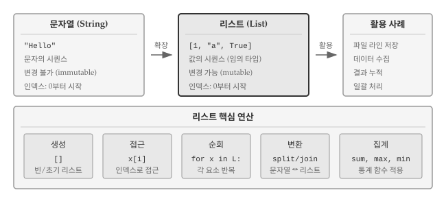
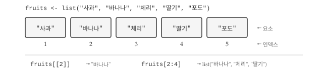
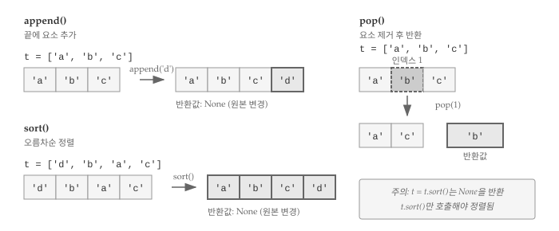
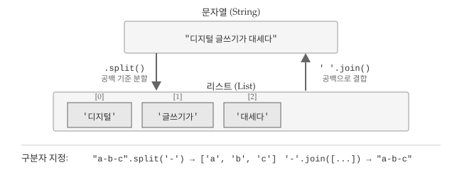
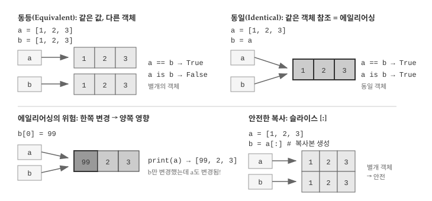
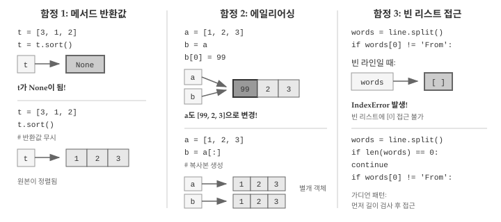

```{r}
#| include: false

source("_common.R")
```

# 리스트 {#r-list}
\index{리스트}
\index{자료형!리스트}

앞 장에서 파일을 읽으면 각 줄이 문자열로 반환된다는 것을 배웠다. 그런데 수천 줄짜리 파일을 읽으면 수천 개의 문자열이 생긴다. 개별 변수로 관리할 수는 없다. 여러 값을 하나로 묶어 관리하는 도구가 필요하다.

**리스트(list)**는 여러 값을 순서대로 담는 컬렉션이다. 파일을 읽으면 각 줄이 리스트의 요소가 된다. 사용자 입력, 웹에서 가져온 데이터, 계산 결과 등 "여러 개"를 다룰 때 리스트가 등장한다. 리스트 개념과 조작 방법을 이해하면, AI에게 "리스트에서 조건에 맞는 요소만 필터링해줘", "각 요소에 함수를 적용해줘"처럼 명확한 요청을 전달할 수 있다.

{#fig-list-overview}

@fig-list-overview 는 리스트의 전체 구조를 보여준다. 문자열이 문자만 담는 불변(immutable) 시퀀스라면, 리스트는 정수, 문자열, 불리언 등 임의 자료형을 담을 수 있는 가변(mutable) 시퀀스다. 파일에서 읽은 라인을 저장하거나, 사용자 입력을 수집하거나, 계산 결과를 누적할 때 리스트가 자연스럽게 등장한다. 핵심 연산은 다섯 가지로 요약된다. 대괄호 `[]`로 빈 리스트를 생성하고, `x[i]` 형식으로 특정 위치에 접근하며, `for x in L:` 구문으로 전체를 순회한다. `split()`과 `join()`으로 문자열과 리스트를 상호 변환하고, `sum()`, `max()`, `min()` 같은 집계 함수로 통계값을 산출한다.

## 리스트 기초 {#r-list-sequence}

리스트는 문자열과 마찬가지로 값의 시퀀스(sequence)다. 문자열이 문자의 나열이라면, 리스트는 임의 자료형을 담을 수 있는 값의 나열이다. 리스트에 담긴 각 값을 요소(element) 또는 항목(item)이라 부른다.
\index{요소}
\index{시퀀스}
\index{항목}

리스트를 생성하는 가장 간단한 방법은 대괄호 `[]`로 요소를 감싸는 것이다.

```{python}
#| eval: false
[10, 20, 30, 40]
['crunchy frog', 'ram bladder', 'lark vomit']
['고양이', '호랑이', '사자']
```

정수 4개로 이루어진 리스트, 영문 문자열 리스트, 한글 문자열 리스트를 차례로 보여준다. 리스트 요소가 반드시 같은 자료형일 필요는 없다. 문자열, 부동 소수점 숫자, 정수, 심지어 또 다른 리스트까지 한 리스트 안에 섞어 담을 수 있다.

```{python}
#| eval: false
['spam', 2.0, 5, [10, 20]]
```


리스트 안에 또 다른 리스트가 들어가면 **중첩(nested)** 리스트라 부른다. 요소가 하나도 없는 리스트는 빈 리스트(empty list)이며, `[]`로 만든다. 리스트도 다른 자료형처럼 변수에 대입할 수 있다.
\index{중첩 리스트}
\index{리스트!중첩}
\index{빈 리스트}
\index{리스트!빈}

```{python}
#| label: py-list-data
cheeses = ['체다', '브리', '까망베르']
numbers = [17, 123]
empty = []
print(cheeses, numbers, empty)
```

\index{대입}


### 인덱스와 변경 {#r-list-mutable}
\index{리스트!요소}
\index{접근}
\index{인덱스}
\index{꺾쇠 연산자}
\index{연산자!꺾쇠}

리스트 요소 접근법은 문자열과 같다. 꺾쇠 괄호 `[]` 안에 인덱스를 넣으면 해당 위치의 요소를 가져온다. 파이썬 인덱스는 0부터 시작한다.

{#fig-list-indexing}

```{python}
#| label: py-list-access
cheeses[0]
```


문자열과 달리, 리스트는 **변경 가능(mutable)**하다. 꺾쇠 괄호 연산자가 대입문 왼쪽에 오면 해당 위치의 요소를 새 값으로 교체한다.
\index{변경성}

```{python}
#| label: py-list-mutable
numbers = [17, 123]
numbers[1] = 5
print(numbers)
```

리스트 인덱스 규칙은 문자열과 같다. 정수 표현식을 인덱스로 쓸 수 있고, 범위를 벗어나면 `IndexError`가 발생한다. 음수 인덱스는 끝에서부터 역순으로 센다.
\index{인덱스!1 에서 시작}
\index{1, 인덱스 시작점}
\index{항목 대입}
\index{대입!항목}
\index{예외!인덱스 오류}
\index{인덱스 오류}

`in` 연산자로 특정 값이 리스트에 포함되어 있는지 확인할 수 있다.
\index{리스트!인덱스}
\index{리스트!소속}
\index{소속!리스트}
\index{in 연산자}
\index{연산자!in}

```{python}
#| label: py-list-in
cheeses = ['체다', '브리', '까망베르']
'체다' in cheeses
'고르곤졸라' in cheeses
```

### 리스트 순회 {#r-list-traversal}
\index{리스트!운행법}
\index{운행법!리스트}
\index{for 루프}
\index{루프!for}
\index{문장!for}

리스트의 진가는 순회(traversal)에서 드러난다. 수백, 수천 개의 요소를 일일이 변수로 다루는 대신, `for` 문 하나로 전체를 훑으며 처리할 수 있다. 파일의 각 줄을 읽어 특정 패턴을 찾거나, 숫자 리스트에서 합계를 구하거나, 조건에 맞는 요소만 골라내는 작업이 모두 순회로 시작된다.

```{python}
#| eval: false
#| label: py-list-for
for cheese in cheeses:
    print(cheese)
```

요소를 읽기만 한다면 위 방식이면 충분하다. 요소 값을 직접 바꾸려면 인덱스가 필요하므로 `range(len())` 패턴을 사용한다.
\index{루프!인덱스}
\index{인덱스!루프}

```{python}
#| label: py-list-seq_along
numbers = [1, 2, 3, 4, 5]

for i in range(len(numbers)):
    numbers[i] = numbers[i] * 2
    print("결과:", numbers[i])
```

`range(len(numbers))`는 0부터 리스트 길이 직전까지 인덱스를 생성한다. 루프 안에서 `i`로 요소에 접근해 값을 읽고 갱신할 수 있다. 빈 리스트라면 `for` 문 본문이 한 번도 실행되지 않는다.
\index{항목 갱신}
\index{갱신!항목}

```{python}
#| eval: false
#| label: py-list-empty
for x in []:
    print('이런 일은 절대 발생하지 않는다.')
```


리스트가 다른 리스트를 담을 수 있다. 중첩된 리스트라도 요소 하나로 취급되므로 다음 리스트의 길이는 4다.
\index{중첩 리스트}
\index{리스트!중첩}

```{python}
#| eval: false
#| label: py-list-length
['spam', 1, ['브리', '체다', '까망베르'], [1, 2, 3]]
```

## 리스트 연산 {#r-list-operator}
\index{리스트!연산}

문자열에서 `+`로 문자열을 이어 붙이고 `*`로 반복했던 것처럼, 리스트에도 동일한 연산자가 작동한다. 두 리스트를 합치거나, 같은 패턴을 여러 번 반복하거나, 일부분만 잘라내는 작업이 리스트 연산의 핵심이다. 결합, 반복, 슬라이싱 세 가지를 차례로 살펴보자. `+` 연산자는 두 리스트를 이어 붙인다.
\index{연결!리스트}
\index{리스트!연결}

```{python}
#| label: py-list-append
a = [1, 2, 3]
b = [4, 5, 6]
c = a + b
print(c)
```

`*` 연산자는 리스트를 지정 횟수만큼 반복한다.
\index{반복!리스트}
\index{리스트!반복}

```{python}
#| label: py-list-repeat
[0] * 4
[1, 2, 3] * 3
```


### 슬라이싱 {#r-list-slice}
\index{슬라이스 연산자}
\index{연산자!슬라이스}
\index{인덱스!슬라이스}
\index{리스트!슬라이스}
\index{슬라이스!리스트}

리스트에서 연속된 여러 요소를 한꺼번에 다루어야 할 때가 있다. 처음 세 개만 꺼내거나, 중간 부분만 잘라내거나, 전체를 복사하는 경우다. **슬라이스(slice)** 연산자는 인덱스 범위를 지정해 리스트의 일부분을 추출한다. 문자열 슬라이싱과 문법이 같으므로 익숙할 것이다.

```{python}
#| label: py-list-slice
t = ['a', 'b', 'c', 'd', 'e', 'f']
t[1:3]
t[:4]
t[3:]
t[:]
```


`1:3`은 인덱스 1부터 2까지(3 미포함) 요소를 추출한다. `[:]`는 전체 리스트를 복사한다. 리스트는 변경 가능하므로 원본을 보존하려면 복사본을 만들어두는 편이 안전하다. 대입문 왼쪽에 슬라이스를 두면 여러 요소를 한꺼번에 바꿀 수 있다.
\index{리스트!복사}
\index{슬라이스!복사}
\index{복사!슬라이스}
\index{변경성}
\index{슬라이스!갱신}
\index{갱신!슬라이스}

```{python}
#| label: py-list-update
t = ['a', 'b', 'c', 'd', 'e', 'f']
t[1:3] = [1, 2]
print(t)
```

## 리스트 조작 {#r-list-function}
\index{리스트!함수}
\index{함수, 리스트}

파이썬은 리스트를 조작하는 여러 메서드를 제공한다. @fig-list-methods 에서 보듯이 `append()`는 요소 추가, `sort()`는 정렬, `pop()`은 요소 제거와 반환을 담당한다. `sort()`와 `append()`는 원본을 직접 변경하고 `None`을 반환하므로 주의가 필요하다.

{#fig-list-methods}

`append()` 메서드는 리스트 끝에 요소를 추가한다.

```{python}
#| label: py-list-function-append
t = ['a', 'b', 'c']
t.append('d')
print(t)
```

`sort()` 메서드는 리스트를 오름차순으로 정렬한다. 원본이 직접 바뀐다는 점을 기억하자.
\index{정렬 함수}
\index{함수!정렬}

```{python}
#| label: py-list-function-sort
t = ['d', 'c', 'e', 'b', 'a']
t.sort()
print(t)
```

### 요소 삭제 {#r-list-delete}
\index{리스트 요소 삭제}
\index{삭제, 리스트 요소}

리스트에 요소를 추가하는 만큼, 제거하는 일도 자주 발생한다. 더 이상 필요 없는 데이터를 정리하거나, 조건에 맞지 않는 항목을 걸러낼 때 삭제 연산이 필요하다. 파이썬은 상황에 따라 선택할 수 있는 여러 삭제 방법을 제공한다. 인덱스를 알면 `pop()` 메서드로 해당 요소를 제거하면서 값을 반환받을 수 있다.

```{python}
#| label: py-list-delete-by-index
t = ['a', 'b', 'c']
x = t.pop(1)
print(t)
print(x)
```

`del` 문으로도 인덱스 위치의 요소를 삭제할 수 있다.
\index{del 문}
\index{문!del}

```{python}
#| label: py-list-delete-by-del
t = ['a', 'b', 'c']
del t[1]
print(t)
```


값을 기준으로 삭제하려면 `remove()` 메서드를 쓴다. 일치하는 첫 번째 요소만 제거된다.

```{python}
#| label: py-list-delete-by-value
t = ['a', 'b', 'c']
t.remove('b')
print(t)
```

여러 요소를 한꺼번에 제거하려면 슬라이스와 `del` 문을 함께 쓴다.

```{python}
#| label: py-list-delete-slice
t = ['a', 'b', 'c', 'd', 'e', 'f']
del t[1:5]
print(t)
```

### 리스트와 함수 {#r-list-func}

리스트를 다루다 보면 요소 전체에 대해 합계, 최댓값, 최솟값, 개수 같은 통계를 구해야 할 때가 많다. 직접 루프를 돌며 계산할 수도 있지만, 파이썬 내장 함수를 쓰면 한 줄로 끝난다. `sum()`, `max()`, `min()`, `len()` 함수가 대표적이다.

```{python}
#| label: py-list-unlist
nums = [3, 41, 12, 9, 74, 15]

print(len(nums))
print(max(nums))
print(min(nums))
print(sum(nums))
print(sum(nums) / len(nums))
```


입력에 결측값이나 잘못된 자료형이 섞여 있으면 예상과 다른 결과가 나올 수 있다. 자료형을 미리 점검하는 습관이 필요하다.

`sum()`, `len()` 같은 집계 함수가 실전에서 어떻게 쓰이는지 살펴보자. 사용자가 숫자를 여러 개 입력하면 평균을 계산하는 프로그램이다. 먼저 리스트 없이 누적 변수만으로 구현한 방식과, 리스트에 값을 모은 뒤 내장 함수로 처리하는 방식을 비교한다. 두 접근법의 차이를 이해하면 리스트와 집계 함수의 조합이 얼마나 코드를 간결하게 만드는지 체감할 수 있다.

```{python}
#| label: py-list-user-input-average
#| eval: false
total = 0
count = 0

while True:
    inp = input('숫자를 입력하세요: ')
    if inp == 'done':
        break
    value = float(inp)
    total += value
    count += 1

average = total / count
print('평균:', average)
```


`count`와 `total` 변수로 누적 합계를 구하는 방식이다. 리스트를 활용하면 입력값을 모아두었다가 마지막에 내장 함수로 한 번에 처리할 수 있다.

```{python}
#| label: py-list-user-input-average2
#| eval: false
numlist = []

while True:
    inp = input('숫자를 입력하세요: ')
    if inp == 'done':
        break
    value = float(inp)
    numlist.append(value)

average = sum(numlist) / len(numlist)
print('평균:', average)
```

빈 리스트에 입력값을 누적한 후, `sum()`과 `len()`으로 평균을 계산한다.

## 리스트와 문자열 {#r-list-string}
\index{리스트}
\index{문자열}
\index{시퀀스}

문자열은 문자의 시퀀스, 리스트는 값의 시퀀스다. @fig-list-split-join 은 `split()`과 `join()` 메서드로 문자열과 리스트를 오가는 과정을 보여준다. `split()`은 구분자 기준으로 문자열을 리스트로 쪼개고, `join()`은 리스트 요소를 하나의 문자열로 이어 붙인다.

{#fig-list-split-join}

문자열을 리스트로 바꾸는 방법은 두 가지다. 문자 하나하나를 요소로 분리하려면 `list()` 함수를, 단어나 구분자 기준으로 쪼개려면 `split()` 메서드를 쓴다. 용도가 다르므로 상황에 맞게 선택해야 한다. 먼저 `list()` 함수부터 살펴보자.
\index{리스트!함수}
\index{함수!리스트}

```{python}
#| label: py-list-strsplit
s = 'spam'
t = list(s)
print(t)
```


문자 하나하나가 아니라 의미 있는 단위로 분리하려면 `split()` 메서드가 적합하다. 문장을 단어별로 나누거나, CSV 파일의 각 줄을 쉼표로 쪼개는 작업에 `split()`이 쓰인다. 인자 없이 호출하면 공백(스페이스, 탭, 줄바꿈)을 기준으로 분리하고, 구분자를 직접 지정할 수도 있다.
\index{분할 함수}
\index{함수!분할}

```{python}
#| label: py-list-split-separator
s = '이제는 디지털 글쓰기가 대세다.'
t = s.split()
print(t)
```


분할된 리스트에서 인덱스로 특정 단어를 꺼낼 수 있다. 구분자는 공백 외에 하이픈 등 원하는 문자를 지정할 수 있다.
\index{옵션 인자}
\index{인자!옵션}
\index{구분자}

```{python}
#| label: py-list-delimiter
s = 'spam-spam-spam'
delimiter = '-'
print(s.split(delimiter))
```

`join()` 메서드는 `split()`의 반대로, 리스트 요소를 하나의 문자열로 합친다.
\index{합병 함수}
\index{합병!join}
\index{연결}

```{python}
#| label: py-list-paste
t = ['이제는', '디지털', '글쓰기가', '대세다.']
delimiter = ' '
print(delimiter.join(t))
```


구분자를 공백으로 지정하면 단어 사이에 공백이 삽입된다. 빈 문자열 `''`을 구분자로 쓰면 공백 없이 바로 이어 붙인다.
\index{빈 문자열}
\index{문자열!빈}

### 라인 파싱 {#r-list-parsing}

실제 데이터 처리에서 파일을 그대로 출력하는 경우는 드물다. 대부분 특정 패턴을 찾아 필요한 정보만 추출하는 **파싱(parse)** 작업이 뒤따른다. `split()`으로 라인을 단어 리스트로 변환한 뒤, 인덱스로 원하는 위치의 값을 꺼내는 패턴이 핵심이다. 이메일 로그 파일에서 "From "으로 시작하는 라인만 골라 요일을 추출하는 예를 통해 이 패턴을 익혀보자.

> `From stephen.marquard@uct.ac.za` **Sat** `Jan  5 09:14:16 2008`

위 라인을 `split()`으로 쪼개면 `['From', 'stephen.marquard@uct.ac.za', 'Sat', 'Jan', '5', ...]` 형태의 리스트가 된다. 요일 "Sat"은 인덱스 2에 위치하므로 `words[2]`로 꺼낼 수 있다. 파일 전체를 순회하면서 조건에 맞는 라인만 골라 파싱하는 코드를 작성해보자.

```{python}
#| label: py-list-email-parsing
#| eval: false
fhand = open('data/mbox-short.txt')

for line in fhand:
    line = line.rstrip()
    if not line.startswith('From '):
        continue
    words = line.split()
    print(words[2])
```

조건에 맞지 않는 라인은 `continue`로 건너뛰고, 조건을 만족하는 라인만 파싱해 원하는 정보를 꺼낸다.

## 객체와 참조 {#r-list-object-value}
\index{객체}
\index{값}

리스트를 제대로 다루려면 변수가 값을 "담는" 것이 아니라 객체를 "가리킨다"는 점을 이해해야 한다. 두 변수가 같은 값을 가지는 것(동등, equivalent)과 같은 객체를 가리키는 것(동일, identical)은 다른 개념이다. 문자열처럼 불변 객체에서는 별 문제가 없지만, 리스트처럼 변경 가능한 객체에서는 이러한 차이가 예상치 못한 버그로 이어질 수 있다. 먼저 문자열로 동등과 동일의 차이를 확인해보자.

```{python}
#| eval: false
a = 'banana'
b = 'banana'
```

`a`와 `b` 모두 문자열을 참조하지만, 같은 객체인지 다른 객체인지는 확인이 필요하다. `is` 연산자로 두 변수가 같은 객체를 가리키는지 확인할 수 있다.
\index{에일리어싱}

```{python}
#| label: py-a-b-reference
a = 'banana'
b = 'banana'
print(a is b)
```

`is` 연산자는 메모리 상 같은 객체인지 확인한다. 문자열은 불변(immutable)이므로 파이썬은 동일한 문자열을 재사용하기도 한다.
\index{동일 연산자}
\index{연산자!is}

리스트는 상황이 다르다.

```{python}
#| label: py-a-b-list
a = [1, 2, 3]
b = [1, 2, 3]
print(a is b)
```

같은 요소를 가진 두 리스트는 **동등(equivalent)**하지만, 별개의 객체이므로 **동일(identical)**하지는 않다. 동등성은 `==`로, 동일성은 `is`로 확인한다.
\index{동등}
\index{동일}

### 에일리어싱 {#r-list-aliasing}

**에일리어싱(aliasing)**은 두 개 이상의 변수가 동일한 객체를 참조하는 상황이다. @fig-list-aliasing 은 동등과 동일의 차이, 그리고 에일리어싱의 위험성을 보여준다. `b = a`로 대입하면 두 변수가 같은 객체를 가리키므로, 한쪽을 변경하면 다른 쪽도 바뀐다.

{#fig-list-aliasing}

`b = a`로 대입하면 두 변수가 같은 객체를 가리킨다.
\index{에일리어싱}
\index{참조!에일리어싱}

```{python}
#| label: py-list-alias
a = [1, 2, 3]
b = a
print(a is b)
a = [4, 5, 6]
print(a is b)
```

변수와 객체 사이의 연결을 **참조(reference)**라 부른다. 에일리어스된 객체가 변경 가능하면 한쪽에서 바꾼 내용이 다른 쪽에도 반영된다.
\index{참조}
\index{변경성}

```{python}
#| label: py-mutable-alias
a = [1, 2, 3]
b = a
b[0] = 17
print(a)
```

`b`를 변경했는데 `a`도 함께 바뀌었다. 같은 객체를 가리키기 때문이다. 변경 가능한 객체를 다룰 때는 에일리어싱에 주의해야 한다.
\index{불변성}

## 디버깅 {#r-list-debug}
\index{디버깅}

리스트는 강력하지만 초보자가 빠지기 쉬운 함정이 세 가지 있다. 메서드 반환값 오해, 에일리어싱, 빈 리스트 접근이다. @fig-list-debug 는 각 함정의 원인과 해결책을 보여준다.

{#fig-list-debug}

### 메서드 반환값 오해
\index{정렬 함수}
\index{함수!정렬}

문자열 메서드는 새 문자열을 반환하므로 `word = word.strip()` 패턴이 자연스럽다. 리스트 메서드는 다르다. `sort()`, `append()`, `reverse()` 같은 메서드는 원본을 직접 변경하고 `None`을 반환한다. 반환값을 변수에 대입하면 리스트가 아닌 `None`이 들어간다.

```{python}
#| label: py-sort-debug
t = [4, 2, 3]
t = t.sort()  # 잘못된 패턴: t가 None이 됨
print(t)
```

올바른 방법은 반환값을 무시하고 메서드만 호출하는 것이다. `t.sort()`를 실행하면 `t` 자체가 정렬된다.
\index{관용구}

### 에일리어싱 함정
\index{에일리어싱!회피하기 위한 복사}
\index{복사!에일리어싱 회피하기}

`b = a`로 리스트를 대입하면 복사가 아니라 같은 객체를 가리키게 된다. 한쪽을 변경하면 다른 쪽도 바뀐다. 원본을 보존하려면 `b = a[:]` 슬라이스로 복사본을 만들어야 한다.

```{python}
#| label: py-list-debug-aliasing
t = [3, 1, 5, 2]
orig = t[:]  # 원본 리스트 복사
t.sort()
print(orig)  # 원본 유지
print(t)     # 정렬된 리스트
```

### 빈 리스트 접근

파일을 파싱할 때 빈 라인을 만나면 `split()` 결과가 빈 리스트가 된다. 빈 리스트에 `words[0]`으로 접근하면 `IndexError`가 발생한다. 인덱스로 접근하기 전에 리스트 길이를 먼저 확인하는 **가디언 패턴(guardian pattern)**으로 이 문제를 방지할 수 있다.

"From "으로 시작하는 라인에서 요일을 추출하는 예제를 다시 살펴보자.

```{python}
#| label: py-list-email-parsing-ex
#| eval: false
fhand = open('data/mbox-short.txt')

for line in fhand:
    words = line.split()
    if words[0] != 'From':
        continue
    print(words[2])
```

간단해 보이지만 빈 라인을 만나면 오류가 발생한다. 원인을 찾으려면 `print()` 문으로 디버그 출력을 추가해보자.

```{python}
#| label: py-list-email-parsing-ex-print
#| eval: false
fhand = open('data/mbox-short.txt')

for line in fhand:
    words = line.split()
    print('Debug:', words)
    if words[0] != 'From':
        continue
    print(words[2])
```

빈 라인에서 `words`가 빈 리스트가 되어 `words[0]` 접근 시 오류가 발생한다. 단어 개수를 먼저 확인하는 가디언 코드를 추가하면 문제가 해결된다.

```{python}
#| label: py-list-email-parsing-ex-guardian
fhand = open('data/mbox-short.txt')
days = []

for line in fhand:
    words = line.split()
    if len(words) == 0:
        continue
    if words[0] != 'From':
        continue
    days.append(words[2])

# 처음 3개와 마지막 2개만 출력
print(days[:3], '...', days[-2:])
```

`len(words) == 0`이면 다음 라인으로 건너뛴다. 여러 조건으로 관심 있는 라인만 걸러내는 방식이다. 결과를 리스트에 모아두면 슬라이싱으로 일부만 확인할 수 있어 디버깅에 유용하다. 프로그램을 작성할 때는 "무엇이 잘못될 수 있을까?"를 항상 염두에 두어야 한다.

## AI와 함께하는 리스트 처리 {#r-list-ai}

AI에게 리스트 처리 작업을 요청할 때는 입력 구조, 처리 방식, 기대 출력을 명확히 전달해야 한다. "정수 리스트에서 짝수만 추출해줘"보다 "입력: `[1, 2, 3, 4, 5]`, 출력: `[2, 4]`, 빈 리스트면 빈 리스트 반환"처럼 구체적인 예시를 포함하면 정확한 결과를 얻기 쉽다.

리스트 작업은 필터링, 변환, 집계로 나눌 수 있다. 필터링은 조건에 맞는 요소 추출, 변환은 각 요소에 함수 적용, 집계는 `sum()`, `max()` 같은 함수로 단일 값을 산출하는 것이다. 순회, 슬라이싱, 리스트 함수 개념을 알고 있으면 AI가 생성한 코드가 맞는지 검증하기 수월하다.

중첩 리스트나 문자열-리스트 변환 같은 복잡한 작업을 요청할 때는 입력과 출력 예시를 반드시 포함하자. "2차원 리스트 `[[1,2,3], [4,5,6]]`에서 각 행의 합계 `[6, 15]`를 구해줘"처럼 명세를 구체화하면 AI가 의도를 정확히 파악할 수 있다.

::: {.content-visible when-format="pdf"}
\faLightbulb\ 생각해볼 점
:::

::: {.content-visible when-format="html"}
## 💡 생각해볼 점 {.unnumbered}
:::

리스트는 프로그래밍에서 가장 기본적이면서도 강력한 자료구조다. 파일의 각 줄, 사용자 입력, 계산 결과 등 "여러 개"를 다루는 거의 모든 상황에서 리스트가 등장한다. 리스트를 자유롭게 다룰 수 있다면 데이터 처리의 절반은 해결된 셈이다.

리스트 핵심은 순서와 변경 가능성이다. 인덱스로 특정 위치에 접근하고, 요소를 추가하거나 삭제하며, 전체를 순회할 수 있다. 문자열이 문자의 불변 시퀀스라면, 리스트는 임의 값의 가변 시퀀스다. 가변/불변 차이를 이해하면 에일리어싱 같은 함정도 피할 수 있다.

`split()`과 `join()`으로 문자열과 리스트를 자유롭게 오갈 수 있다. 파일을 읽어 라인을 단어로 쪼개고, 필요한 정보를 추출한 후, 다시 문자열로 결합하는 패턴은 데이터 처리에서 끊임없이 반복된다. 본 장에서 다룬 예제들이 그 기본 틀이다.

다음 장에서는 딕셔너리(dictionary)를 배운다. 리스트가 인덱스로 요소에 접근한다면, 딕셔너리는 키(key)로 접근한다. 이메일 주소별 발신 횟수를 세거나, 단어 빈도를 계산하는 등 "대응 관계"가 필요한 상황에서 딕셔너리가 빛을 발한다.

