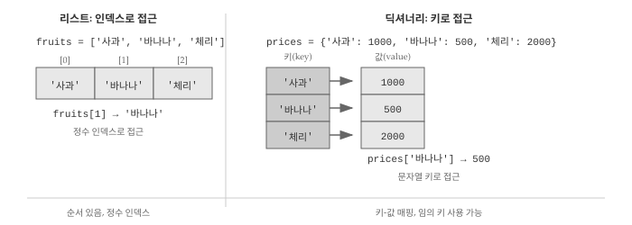
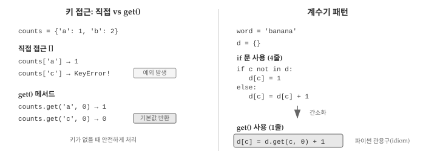
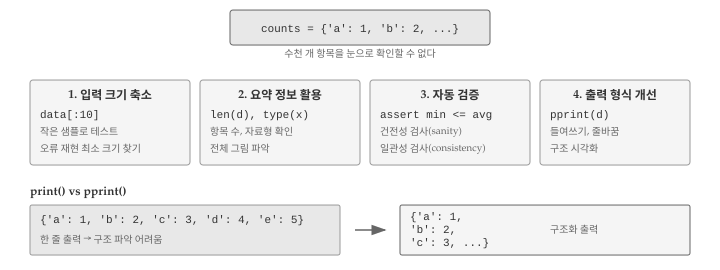
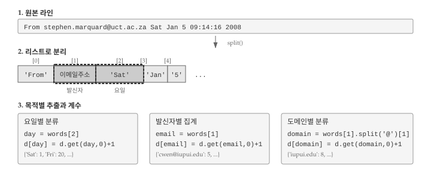

# 딕셔너리 {#dictionary}
\index{딕셔너리}
\index{자료형!딕셔너리}
\index{키}
\index{키-값 페어}
\index{인덱스}

현대 프로그래밍에서 딕셔너리(키-값 쌍)는 가장 중요한 자료구조 중 하나다. 웹 API에서 데이터를 가져오면 대부분 JSON 형식인데, JSON의 기본 구조가 바로 딕셔너리다. 설정 파일, 사용자 정보, 데이터베이스 조회 결과 등 거의 모든 곳에서 키-값 구조를 만난다.

딕셔너리의 개념을 이해하면, AI에게 "JSON 데이터에서 특정 필드를 추출해줘", "사용자 정보를 딕셔너리로 구성해줘"와 같은 요청을 명확하게 전달할 수 있다.

## 딕셔너리 기초 {#dict-basics}

**딕셔너리(dictionary)**는 리스트와 비슷하지만 더 유연한 자료구조다. 리스트는 0, 1, 2 같은 정수 인덱스로만 요소에 접근할 수 있지만, 딕셔너리는 문자열이나 숫자 등 다양한 자료형을 인덱스로 사용할 수 있다. @fig-dict-structure 는 리스트와 딕셔너리의 접근 방식 차이를 보여준다.

{#fig-dict-structure}

딕셔너리는 **키(key)** 집합에서 **값(value)** 집합으로의 매핑(mapping)이다. 각 키는 하나의 값에 대응하며, 키와 값의 쌍을 **키-값 페어(key-value pair)** 또는 항목(item)이라고 부른다. 실생활의 사전(dictionary)을 떠올리면 이해가 쉽다. 단어(키)를 찾으면 그 뜻(값)이 나오는 구조와 같다.

영어 단어를 키로, 한국어 번역을 값으로 갖는 간단한 번역 사전을 만들어보자. `dict()` 함수로 빈 딕셔너리를 생성할 수 있다. 단, `dict`는 내장 함수명이므로 변수명으로 사용하면 안 된다.

```python
eng2kr = dict()
print(eng2kr)
#> {}
```

출력된 `{}`는 빈 딕셔너리를 의미한다. 딕셔너리에 새 항목을 추가하려면 대괄호 안에 키를 넣고 값을 할당하면 된다. 아래 코드는 키 `'one'`에 값 `'하나'`를 연결하는 항목을 추가한다.

여러 항목을 한 번에 정의하려면 중괄호 `{}` 안에 `키: 값` 형식으로 나열하면 된다.

```python
eng2kr['one'] = '하나'
print(eng2kr)
#> {'one': '하나'}

eng2kr = {'one': '하나', 'two': '둘', 'three': '셋'}
print(eng2kr)
#> {'one': '하나', 'two': '둘', 'three': '셋'}
```


::: {.callout-note}
### 딕셔너리 항목 순서

파이썬 3.7 이전에는 딕셔너리 항목 순서가 예측 불가능했다. 3.7 버전부터는 입력한 순서대로 유지된다. 다만 딕셔너리는 정수 인덱스가 아닌 키로 접근하므로, 순서보다는 키-값 대응 관계가 더 중요하다.
:::


딕셔너리에서 값을 꺼내려면 대괄호 안에 키를 넣으면 된다. `'two'` 키는 항상 `'둘'`을 반환하므로 항목 순서와 무관하게 원하는 값을 얻을 수 있다.

```python
print(eng2kr['two'])
#> 둘
```

존재하지 않는 키로 접근하면 `KeyError` 예외가 발생한다. `len()` 함수로 딕셔너리에 저장된 키-값 쌍의 개수를 확인할 수 있다.
\index{len 함수}
\index{함수!len}

```python
print(eng2kr['four'])
#> KeyError: 'four'
print(len(eng2kr))
#> 3
```

`in` 연산자로 특정 키가 딕셔너리에 있는지 확인할 수 있다. 리스트에서 요소 존재 여부를 확인하는 것과 같은 방식이지만, 딕셔너리에서는 키만 검사한다는 점이 다르다.
\index{소속!딕셔너리}
\index{in 연산자}
\index{연산자!in}

```python
'one' in eng2kr
#> True
'uno' in eng2kr
#> False
```

값의 존재 여부를 확인하려면 `values()` 메서드로 모든 값을 먼저 추출한 뒤 `in` 연산자를 사용해야 한다.

```python
vals = eng2kr.values()
print(vals)
#> dict_values(['하나', '둘', '셋'])
'하나' in vals
#> True
```

리스트 컴프리헨션을 활용하면 여러 값의 존재 여부를 한 번에 확인할 수 있다. 아래 예제는 딕셔너리의 각 값이 특정 목록에 포함되는지 검사한다.

```python
eng2kr = {'one': '하나', 'two': '둘', 'three': '셋'}
results = [item in ["둘", "셋"] for item in eng2kr.values()]
print(results)
#> [False, True, True]
```

## 계수기로 딕셔너리 사용 {#dict-counter}
\index{계수기}

문자열에서 각 문자가 몇 번 등장하는지 세는 프로그램을 작성한다고 가정하자. 구현 방법은 여러 가지가 있다. 첫째, 알파벳 문자마다 변수를 26개 만들고 연쇄 조건문으로 각 변수를 증가시키는 방법이 있다. 둘째, 26개 요소를 가진 리스트를 만들고 문자에 해당하는 인덱스 위치의 값을 증가시킬 수 있다. 셋째, 문자를 키로, 출현 횟수를 값으로 갖는 딕셔너리를 사용하는 방법이 있다.

세 방법 모두 같은 결과를 내지만, **구현(implementation)** 방식이 다르다. 구현이란 특정 연산을 수행하는 구체적인 방법을 의미한다. 셋 중에서 딕셔너리를 사용하는 방법이 가장 간결하고 확장성도 좋다. 알파벳뿐 아니라 한글, 숫자, 특수문자 등 어떤 문자든 처리할 수 있기 때문이다.
\index{구현}

```python
word = 'brontosaurus'
d = dict()

for c in word:
    if c not in d:
        d[c] = 1
    else:
        d[c] = d[c] + 1

print(d)
#> {'b': 1, 'r': 2, 'o': 2, 'n': 1, 't': 1, 's': 2, 'a': 1, 'u': 2}
```

위 코드는 각 문자의 출현 횟수, 즉 **히스토그램(histogram)**을 산출한다. 히스토그램은 빈도 분포를 나타내는 통계 용어로, 데이터 분석에서 자주 사용된다.
\index{히스토그램}
\index{빈도}
\index{운행법}

`for` 루프가 문자열의 각 문자를 순회하면서 딕셔너리를 갱신한다. 처음 만나는 문자는 딕셔너리에 키로 추가하고 값을 1로 설정한다. 이미 존재하는 문자라면 해당 값을 1 증가시킨다.

딕셔너리의 `get()` 메서드를 활용하면 코드를 더 간결하게 작성할 수 있다. `get(키, 기본값)` 형태로 호출하면, 키가 존재할 때는 해당 값을 반환하고, 키가 없으면 지정한 기본값을 반환한다. `KeyError` 예외 없이 안전하게 값을 조회할 수 있다는 장점이 있다.
@fig-dict-operations 는 직접 접근 `[]`과 `get()` 메서드의 차이, 그리고 계수기 패턴의 간소화를 보여준다.

{#fig-dict-operations}

아래 예제에서 `'jan'`은 딕셔너리에 존재하므로 저장된 값 `100`이 반환된다. 반면 `'tim'`은 존재하지 않으므로 기본값 `0`이 반환된다.

```python
counts = {'chuck': 1, 'annie': 42, 'jan': 100}
print(counts.get('jan', 0))
#> 100
print(counts.get('tim', 0))
#> 0
```

`get()` 메서드의 진가는 계수기 루프에서 드러난다. 앞서 작성한 4줄짜리 `if-else` 문을 단 1줄로 줄일 수 있다. 키가 없을 때 기본값 0을 반환하므로, 처음 등장하는 문자든 이미 있는 문자든 동일한 코드로 처리된다.

```python
word = 'brontosaurus'
d = dict()
for c in word:
    d[c] = d.get(c, 0) + 1
print(d)
#> {'b': 1, 'r': 2, 'o': 2, 'n': 1, 't': 1, 's': 2, 'a': 1, 'u': 2}
```

`d[c] = d.get(c, 0) + 1` 패턴은 파이썬에서 빈도를 셀 때 가장 널리 쓰이는 관용구(idiom)다. 처음에는 낯설게 느껴지지만 몇 번 사용하다 보면 자연스러워진다. 딕셔너리를 계수기로 활용할 때는 이 패턴을 기억해두자.

## 딕셔너리와 파일 {#dict-file}

딕셔너리의 대표적인 활용 사례는 텍스트 파일에서 단어 빈도를 세는 것이다. 셰익스피어의 *로미오와 줄리엣(Romeo and Juliet)* 텍스트로 실습해보자. 먼저 구두점을 제거한 간단한 버전으로 시작하고, 이후에 원본 텍스트를 다루는 방법을 살펴본다.

```bash
But soft what light through yonder window breaks
It is the east and Juliet is the sun
Arise fair sun and kill the envious moon
Who is already sick and pale with grief
```

파일의 각 라인을 읽고, 단어로 분리한 뒤, 딕셔너리로 빈도를 세는 프로그램을 작성해보자. 두 개의 `for` 루프가 필요하다. 바깥쪽(외곽) 루프는 파일의 라인을 순회하고, 안쪽(내부) 루프는 각 라인의 단어를 순회한다. 루프 안에 또 다른 루프가 있는 구조를 **중첩 루프(nested loops)**라고 한다.

중첩 루프에서 외곽 루프가 한 번 반복할 때마다 내부 루프는 처음부터 끝까지 전체 반복을 수행한다. 시계의 분침과 초침을 떠올리면 이해가 쉽다. 분침이 한 칸 움직일 동안 초침은 60칸을 다 돈다. 외곽 루프는 분침처럼 천천히, 내부 루프는 초침처럼 빠르게 움직인다고 생각하면 된다. 중첩 루프 덕분에 파일의 모든 라인에 있는 모든 단어를 빠짐없이 처리할 수 있다.

```python
fname = input('파일명을 입력하세요: ')

try:
    fhand = open(fname)
except:
    print('파일을 열 수 없습니다:', fname)
    exit()

counts = dict()
for line in fhand:
    words = line.split()
    for word in words:
        if word not in counts:
            counts[word] = 1
        else:
            counts[word] += 1

print(counts)
#> 파일명을 입력하세요: romeo.txt
#> {'But': 1, 'soft': 1, 'what': 1, 'light': 1, 'through': 1,
#>  'yonder': 1, 'window': 1, 'breaks': 1, 'It': 1, 'is': 3,
#>  'the': 3, 'east': 1, 'and': 3, 'Juliet': 1, 'sun': 2, ...}
```

프로그램을 실행하면 모든 단어와 출현 횟수가 출력된다. 결과가 정렬되지 않아 어떤 단어가 가장 많이 등장했는지 한눈에 파악하기 어렵다. 출력 결과를 개선하는 방법은 잠시 후에 다룬다.

## 반복과 딕셔너리 {#dict-loop}

딕셔너리에 저장된 모든 항목을 처리하려면 `for` 루프로 순회해야 한다. 리스트를 순회하면 요소가 차례로 반환되듯이, 딕셔너리를 순회하면 키(key)가 차례로 반환된다. 값은 직접 반환되지 않으므로, 각 키에 대응하는 값을 얻으려면 대괄호 `[]`로 접근해야 한다. 이 패턴을 이해하면 딕셔너리의 모든 키-값 쌍을 자유롭게 다룰 수 있다.

```python
counts = {'chuck': 1, 'annie': 42, 'jan': 100}

for key in counts:
    print(key, counts[key])
#> chuck 1
#> annie 42
#> jan 100
```

딕셔너리 순회 패턴을 활용하면 조건에 맞는 항목만 선별할 수 있다. 예를 들어 값이 특정 기준보다 큰 항목만 출력하거나, 특정 문자로 시작하는 키만 처리하는 식이다. `for` 루프가 키를 순회하므로, 값을 확인하려면 `counts[key]`처럼 대괄호로 접근해야 한다. 아래 예제는 값이 10보다 큰 항목만 출력한다.

```python
counts = {'chuck': 1, 'annie': 42, 'jan': 100}

for key in counts:
    if counts[key] > 10:
        print(key, counts[key])

#> annie 42
#> jan 100
```

딕셔너리를 그냥 순회하면 항목이 입력 순서대로 출력된다. 키를 알파벳 순이나 값 크기순으로 정렬해서 출력하려면 별도의 처리가 필요하다. `keys()` 메서드가 반환하는 `dict_keys` 객체는 `sort()` 메서드를 지원하지 않으므로, 먼저 `list()` 함수로 리스트로 변환한 뒤 정렬해야 한다.

```python
counts = {'chuck': 1, 'annie': 42, 'jan': 100}

lst = list(counts.keys())
lst.sort()

for key in lst:
    print(key, counts[key])

#> annie 42
#> chuck 1
#> jan 100
```

정렬된 키 리스트를 순회하면 알파벳 순서대로 키-값 쌍을 출력할 수 있다. 딕셔너리 자체의 내부 순서는 변하지 않지만, 출력 순서를 원하는 대로 제어할 수 있다는 점이 핵심이다. 값 기준으로 정렬하려면 튜플을 활용해야 하는데, 다음 장에서 자세히 다룬다.

## 고급 텍스트 파싱{#dict-advanced}
\index{로미오와 쥴리엣}

앞선 예제에서는 구두점을 미리 제거한 깔끔한 텍스트를 사용했다. 하지만 실제 텍스트에는 쉼표, 마침표, 느낌표, 물음표 등 다양한 구두점이 포함되어 있다.

```bash
But, soft! what light through yonder window breaks?
It is the east, and Juliet is the sun.
Arise, fair sun, and kill the envious moon,
Who is already sick and pale with grief,
```

`split()` 메서드는 공백을 기준으로 문자열을 분리하므로, "soft!"와 "soft"를 서로 다른 단어로 취급한다. 대소문자도 마찬가지다. "Who"와 "who"는 별개의 항목으로 집계된다. 정확한 빈도 분석을 위해서는 구두점을 제거하고 대소문자를 통일해야 한다.

`string` 모듈의 `punctuation` 상수에는 모든 구두점 문자가 들어 있다. `translate()` 메서드로 구두점을 일괄 제거하고, `lower()` 메서드로 소문자로 변환하면 된다.

```python
import string

fname = input('파일명을 입력하세요: ')

try:
    fhand = open(fname)
except:
    print('파일을 열 수 없습니다:', fname)
    exit()

counts = dict()
for line in fhand:
    line = line.translate(str.maketrans('', '', string.punctuation))
    line = line.lower()
    words = line.split()
    for word in words:
        if word not in counts:
            counts[word] = 1
        else:
            counts[word] += 1

print(counts)
```

`translate()` 메서드가 구두점을 제거하고, `lower()` 메서드가 모든 문자를 소문자로 변환한다. 나머지 코드는 이전과 동일하다.

`translate()`와 `lower()` 조합으로 "soft!"와 "soft", "Who"와 "who" 같은 변형이 하나의 항목으로 정확히 집계된다. 텍스트 정규화는 빈도 분석의 정확도를 높이는 핵심 전처리 단계다.

그런데 딕셔너리 출력에는 한 가지 한계가 있다. 키-값 쌍이 정렬되지 않은 채로 나열되어 "어떤 단어가 가장 많이 등장했는가?"라는 질문에 바로 답하기 어렵다. 빈도순으로 정렬하거나 상위 10개 단어만 추출하려면 딕셔너리를 다른 자료구조로 변환해야 한다. 다음 장에서 배울 **튜플(tuple)**이 바로 그 역할을 담당한다. 튜플을 활용하면 딕셔너리의 키-값 쌍을 정렬 가능한 형태로 바꿔 원하는 순서로 출력할 수 있다.

## 디버깅 {#dict-debugging}
\index{디버깅}

딕셔너리를 다루다 보면 리스트와는 다른 종류의 오류를 마주하게 된다. 가장 흔한 오류는 존재하지 않는 키에 접근할 때 발생하는 `KeyError`다. 리스트에서 범위를 벗어난 인덱스로 접근하면 `IndexError`가 발생하듯이, 딕셔너리에서 없는 키로 접근하면 `KeyError`가 발생한다. `get()` 메서드를 사용하면 이 문제를 우회할 수 있지만, 오류가 발생했다는 것 자체가 프로그램 로직에 문제가 있다는 신호일 수 있으므로 원인을 파악하는 것이 중요하다.

::: {.callout-note}
## KeyError 디버깅

`KeyError`가 발생하면 두 가지를 확인해야 한다. 첫째, 키 이름에 오타가 없는지 점검한다. `counts['apple']`과 `counts['Apple']`은 다른 키다. 둘째, 데이터가 예상대로 들어왔는지 확인한다. 파일 파싱 중 빈 라인이나 형식이 다른 라인이 섞여 있으면 키가 누락될 수 있다.
:::

데이터 규모가 커지면 전체 딕셔너리를 출력해서 눈으로 확인하는 방식이 한계에 부딪힌다. 수천 개의 키-값 쌍을 화면에 뿌려놓고 문제를 찾기란 불가능에 가깝다. @fig-dict-debug 는 대용량 딕셔너리를 디버깅할 때 유용한 네 가지 전략을 보여준다.

{#fig-dict-debug}

### 입력 크기 축소

대용량 파일을 처리하는 프로그램에서 오류가 발생하면, 먼저 작은 샘플로 테스트하는 것이 현명하다. 1만 줄짜리 로그 파일 대신 처음 10줄만 읽도록 수정하거나, 별도의 작은 테스트 파일을 만들어 사용한다. 오류가 재현되면 그 상태에서 디버깅하고, 재현되지 않으면 데이터 크기를 점진적으로 늘려가며 문제가 나타나는 지점을 찾는다. 오류를 재현하는 최소 크기를 찾으면 원인 파악이 훨씬 수월해진다.

### 요약 정보 활용

전체 데이터를 출력하는 대신 요약 통계로 전체 그림을 파악할 수 있다. 딕셔너리의 항목 수 `len(d)`, 모든 값의 합계 `sum(d.values())`, 특정 변수의 자료형 `type(x)` 등이 유용하다. 실행 오류의 상당수는 예상과 다른 자료형 때문에 발생한다. 숫자를 기대했는데 문자열이 들어오거나, 딕셔너리를 기대했는데 `None`이 반환되는 식이다. `type()`으로 자료형을 수시로 확인하는 습관이 디버깅 시간을 크게 줄여준다.

```python
counts = {'a': 10, 'b': 20, 'c': 30}
print(f"항목 수: {len(counts)}")
print(f"값 합계: {sum(counts.values())}")
print(f"자료형: {type(counts)}")
#> 항목 수: 3
#> 값 합계: 60
#> 자료형: <class 'dict'>
```

### 자동 검증 코드
\index{건전성 검사}
\index{일관성 검사}

결과의 타당성을 자동으로 검사하는 코드를 추가하면 오류를 조기에 발견할 수 있다. 예를 들어 빈도를 집계한 딕셔너리라면 모든 값이 양수여야 하고, 값의 합계는 처리한 항목 총 개수와 일치해야 한다. 말이 안 되는 결과를 걸러내는 검사를 **건전성 검사(sanity check)**라고 한다. 리스트의 평균값이 최솟값보다 작거나 최댓값보다 크면 어딘가 잘못된 것이다. 두 가지 다른 방법으로 같은 결과를 계산하고 비교하는 **일관성 검사(consistency check)**도 유용하다. 빈도 합계를 `sum(counts.values())`로 계산한 값과 파일에서 읽은 라인 수가 일치하는지 확인하는 식이다.

### 출력 형식 개선

딕셔너리를 `print()`로 출력하면 모든 항목이 한 줄에 나열되어 구조를 파악하기 어렵다. `pprint` 모듈의 `pprint()` 함수는 딕셔너리나 리스트를 들여쓰기와 줄바꿈으로 정돈해서 출력한다. 중첩된 딕셔너리나 긴 리스트를 디버깅할 때 특히 유용하다.

```python
from pprint import pprint

data = {'user': {'name': '홍길동', 'email': 'hong@example.com'},
        'scores': [85, 92, 78, 95]}
pprint(data)
#> {'scores': [85, 92, 78, 95],
#>  'user': {'email': 'hong@example.com', 'name': '홍길동'}}
```

디버깅 보조 코드를 작성하는 데 투자한 시간은 결국 전체 디버깅 시간을 줄여준다. 임시 코드라도 체계적으로 작성하면 문제의 원인을 빠르게 좁혀갈 수 있다. 프로그램이 복잡해질수록 "눈으로 확인" 방식의 한계가 분명해지므로, 자동화된 검증 습관을 일찍 들이는 것이 좋다.
\index{발판}

## AI와 함께하는 딕셔너리 처리 {#dict-ai}

딕셔너리는 JSON 데이터 처리, API 응답 파싱, 설정 관리 등 실무에서 핵심적인 역할을 한다. 웹 API가 반환하는 데이터는 대부분 JSON 형식이고, JSON은 파이썬 딕셔너리와 거의 동일한 구조를 가진다. AI에게 딕셔너리 관련 작업을 요청할 때는 데이터 구조와 기대 결과를 구체적으로 전달해야 정확한 코드를 얻을 수 있다.

효과적인 프롬프트는 세 가지 요소를 포함한다. 첫째, 입력 데이터의 구조를 명시한다. 키와 값의 타입이 무엇인지, 중첩 구조가 있는지, 리스트가 포함되어 있는지 등을 실제 예시와 함께 보여준다. 둘째, 원하는 처리 방식을 설명한다. 특정 필드만 추출할 것인지, 조건에 맞는 항목을 필터링할 것인지, 값을 집계할 것인지 명확히 한다. 셋째, 기대하는 출력 형식을 구체적으로 제시한다. 입력과 출력 예시를 함께 보여주면 AI가 의도를 정확히 파악할 수 있다.

API 응답에서 필요한 정보만 추출하는 작업을 예로 들어보자. "JSON에서 사용자 정보를 추출해줘"라고 요청하면 AI가 어떤 필드를 어떤 형식으로 추출해야 하는지 알 수 없다. 대신 다음과 같이 구체적으로 요청한다.

> 다음 JSON API 응답에서 사용자 이름과 이메일만 추출하는 Python 함수를 작성해줘.
>
> 입력: `{"users": [{"id": 1, "name": "홍길동", "email": "hong@test.com", "age": 30}, ...]}`
>
> 출력: `[{"name": "홍길동", "email": "hong@test.com"}, ...]`
>
> 조건: users 배열이 비어있으면 빈 리스트 반환

입력 구조, 출력 형식, 예외 처리 조건까지 명시하면 AI가 정확한 코드를 생성한다. 중첩 딕셔너리를 다루는 작업도 마찬가지다.

> 중첩된 딕셔너리를 평탄한 딕셔너리로 변환해줘.
>
> 입력: `{"user": {"name": "홍길동", "address": {"city": "서울"}}}`
>
> 출력: `{"user.name": "홍길동", "user.address.city": "서울"}`

AI가 생성한 코드를 검증하려면 앞서 배운 딕셔너리 개념이 필요하다. 키-값 접근 방식, `for` 루프 순회 패턴, `get()` 메서드의 동작 원리를 이해하고 있으면 생성된 코드가 의도대로 작동하는지 쉽게 확인할 수 있다. AI가 생성한 코드를 그대로 사용하기보다, 작은 테스트 데이터로 먼저 검증하는 습관이 중요하다.

## 이메일 로그 분석 실습 {#dict-email}

지금까지 배운 딕셔너리 개념을 실제 데이터에 적용해보자. 이메일 서버 로그 파일은 시스템 관리자가 일상적으로 분석하는 데이터다. 누가 언제 얼마나 자주 메일을 보냈는지, 어느 기관에서 메일이 많이 오는지 등을 파악하려면 로그 파일을 체계적으로 처리해야 한다. 딕셔너리와 문자열 파싱을 조합하면 이런 분석 작업을 간결하게 구현할 수 있다.

@fig-dict-email-parsing 은 이메일 로그 라인을 파싱하고 딕셔너리로 계수하는 전체 과정을 보여준다. 원본 라인을 `split()`으로 분리한 뒤, 목적에 따라 다른 인덱스의 값을 키로 사용하여 빈도를 집계한다.

{#fig-dict-email-parsing}

### 요일별 이메일 분류

이메일 서버 로그 파일에는 다양한 형식의 라인이 섞여 있다. 그중 "From"으로 시작하는 라인은 새로운 이메일 메시지의 시작을 알리며, 발신자 정보와 타임스탬프를 담고 있다. 시스템 관리자가 "언제 이메일이 많이 오는가?"를 분석하려면 이 라인에서 요일 정보를 추출해야 한다.

```bash
From stephen.marquard@uct.ac.za Sat Jan  5 09:14:16 2008
```

위 라인을 `split()`으로 분리하면 `['From', 'stephen.marquard@uct.ac.za', 'Sat', 'Jan', '5', ...]` 형태의 리스트가 된다. 세 번째 요소(인덱스 2)인 "Sat"가 요일 정보다. 파일 전체를 순회하면서 "From"으로 시작하는 라인만 골라 요일을 추출하고, 딕셔너리로 빈도를 집계하면 요일별 이메일 분포를 파악할 수 있다. `startswith()` 메서드로 조건에 맞는 라인만 걸러내고, 앞서 배운 계수기 패턴을 적용한다.

```python
counts = {}
for line in fhand:
    if line.startswith('From '):
        words = line.split()
        day = words[2]
        counts[day] = counts.get(day, 0) + 1
print(counts)
#> {'Sat': 1, 'Fri': 20, 'Thu': 6}
```

결과를 보면 금요일에 20건으로 가장 많은 이메일이 발송되었고, 토요일에는 단 1건만 발송되었다. 업무일과 주말의 이메일 패턴 차이가 명확하게 드러난다.

### 발신자별 이메일 히스토그램

요일별 분석 외에도 "누가 이메일을 많이 보내는가?"라는 질문에 답할 수 있다. 발신자 이메일 주소별로 메시지 수를 집계하면 가장 활발하게 소통하는 사람을 파악할 수 있다. "From" 라인의 두 번째 단어(인덱스 1)가 이메일 주소다. 앞서 배운 계수기 패턴 `d[key] = d.get(key, 0) + 1`을 그대로 적용하면 되고, 키만 요일에서 이메일 주소로 바꾸면 된다.

```python
counts = {}
for line in fhand:
    if line.startswith('From '):
        words = line.split()
        email = words[1]
        counts[email] = counts.get(email, 0) + 1
print(counts)
#> {'gopal.ramasammycook@gmail.com': 1, 'louis@media.berkeley.edu': 3,
#>  'cwen@iupui.edu': 5, 'david.horwitz@uct.ac.za': 4, ...}
```

결과 딕셔너리에서 `cwen@iupui.edu`가 5건으로 가장 많은 이메일을 보냈음을 알 수 있다. 하지만 딕셔너리가 커지면 눈으로 최댓값을 찾기 어렵다.

### 최다 발신자 찾기

히스토그램을 만들었다면 한 단계 더 나아가 "가장 많은 이메일을 보낸 사람이 누구인가?"라는 질문에 답할 수 있다. 딕셔너리 항목이 수십, 수백 개라면 눈으로 최댓값을 찾기 어려우므로 프로그램으로 자동화해야 한다. 딕셔너리를 순회하면서 최댓값과 해당 키를 함께 추적하는 패턴을 사용한다. `max_count` 변수에 지금까지 본 최댓값을, `max_sender` 변수에 해당 발신자를 저장하면서 전체 딕셔너리를 훑는다.

```python
max_count = 0
max_sender = None
for sender in counts:
    if counts[sender] > max_count:
        max_count = counts[sender]
        max_sender = sender
print(max_sender, max_count)
#> cwen@iupui.edu 5
```

위 패턴은 리스트에서 최댓값을 찾는 것과 유사하지만, 키-값 쌍을 함께 추적한다는 점이 다르다. 딕셔너리 순회 시 키가 반환되므로, 값을 얻으려면 `counts[sender]`처럼 대괄호로 접근해야 한다.

### 도메인별 분류

개인별 집계보다 더 넓은 시각으로 "어느 기관에서 이메일이 많이 오는가?"를 분석할 수도 있다. 이메일 주소 전체 대신 도메인만 추출하면 기관별 소통 빈도를 파악할 수 있다. 도메인은 `@` 기호 뒤에 오는 부분으로, 예를 들어 `stephen.marquard@uct.ac.za`에서 `uct.ac.za`가 도메인이다. `split('@')`으로 이메일 주소를 분리하고 두 번째 요소(인덱스 1)를 키로 사용한다.

```python
email = 'stephen.marquard@uct.ac.za'
parts = email.split('@')
print(parts)
#> ['stephen.marquard', 'uct.ac.za']
domain = parts[1]
print(domain)
#> uct.ac.za
```

`split()`을 두 번 적용하는 셈이다. 먼저 라인 전체를 공백으로 분리해 이메일 주소를 추출하고, 다시 `@`로 분리해 도메인을 얻는다. 두 단계를 한 줄로 연결하면 `words[1].split('@')[1]`이 된다.

```python
counts = {}
for line in fhand:
    if line.startswith('From '):
        words = line.split()
        domain = words[1].split('@')[1]
        counts[domain] = counts.get(domain, 0) + 1
print(counts)
#> {'media.berkeley.edu': 4, 'uct.ac.za': 6, 'umich.edu': 7,
#>  'gmail.com': 1, 'caret.cam.ac.uk': 1, 'iupui.edu': 8}
```

결과를 보면 `iupui.edu` 도메인에서 8건으로 가장 많은 이메일이 발송되었다. 개인별 집계와 달리 기관별 집계는 협업 패턴이나 조직 간 소통 빈도를 파악하는 데 유용하다.

딕셔너리는 로그 분석, 빈도 집계, 데이터 분류 등 다양한 실무 작업에서 핵심 도구로 활용된다. 파일 읽기, 문자열 파싱, 딕셔너리 계수기를 조합하면 복잡해 보이는 분석 작업도 간결하게 구현할 수 있다. 본 절에서 다룬 패턴들은 웹 서버 로그, 시스템 로그, 트랜잭션 기록 등 다양한 텍스트 데이터 분석에 그대로 적용할 수 있다.

::: {.content-visible when-format="pdf"}
## 생각해볼 점 {.unnumbered}
:::

::: {.content-visible when-format="html"}
## 💡 생각해볼 점 {.unnumbered}
:::

딕셔너리는 "이름으로 값을 찾는" 가장 자연스러운 자료구조다. 전화번호부에서 이름으로 번호를 찾고, 사전에서 단어로 뜻을 찾듯이, 딕셔너리는 키로 값을 찾는다. 리스트가 "몇 번째?"라고 묻는다면, 딕셔너리는 "무엇으로?"라고 묻는다.

딕셔너리의 핵심은 키-값 매핑이다. 키는 유일해야 하고, 값은 무엇이든 될 수 있다. 같은 키로 다시 값을 할당하면 기존 값이 덮어씌워진다. 리스트의 인덱스가 0부터 시작하는 정수라면, 딕셔너리의 키는 문자열, 숫자, 튜플 등 불변 객체면 무엇이든 가능하다.

`get()` 메서드는 딕셔너리를 다루는 핵심 도구다. 키가 없을 때 `KeyError` 대신 기본값을 반환하므로, 계수기 패턴을 한 줄로 구현할 수 있다. `d[c] = d.get(c, 0) + 1`은 파이썬에서 가장 자주 쓰이는 관용구 중 하나다. 처음 보면 낯설지만, 익숙해지면 자연스럽게 사용하게 된다.

다음 장에서는 튜플(tuple)을 배운다. 튜플은 불변 리스트로, 딕셔너리와 함께 쓰면 강력한 조합이 된다. 딕셔너리의 `items()`가 반환하는 키-값 쌍을 정렬하거나, 여러 값을 하나로 묶어 딕셔너리 키로 사용하는 등 실용적인 패턴을 익히게 될 것이다.
