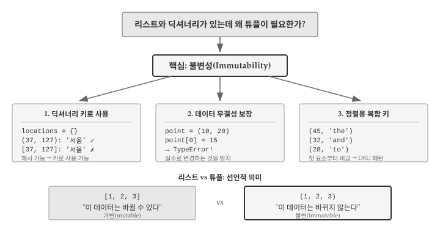
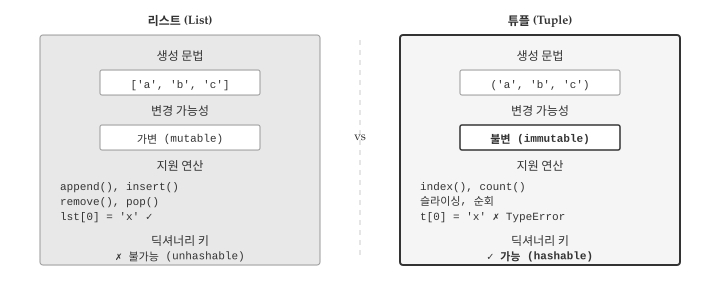
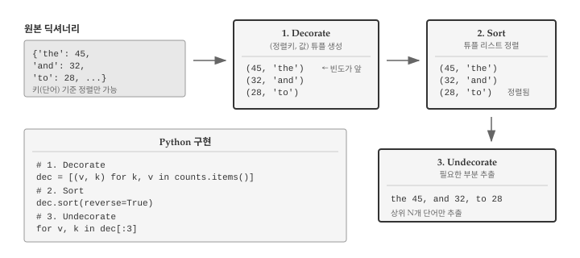
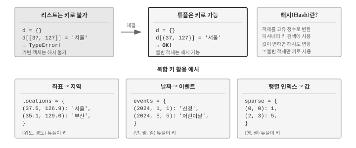

# 튜플 {#py-tuple}
\index{튜플}

리스트와 딕셔너리만으로 충분해 보이지만, 파이썬에는 튜플이라는 또 다른 자료구조가 있다. 튜플은 왜 존재할까? 리스트가 "변경 가능한 순서 있는 값의 모음"이라면, 튜플은 "변경 불가능한 순서 있는 값의 모음"이다. 불변성이라는 특성 때문에 튜플은 리스트가 할 수 없는 역할을 수행한다. 딕셔너리 키로 사용할 수 있고, 함수에서 여러 값을 안전하게 반환할 수 있으며, 데이터가 실수로 변경되는 것을 방지한다.

앞선 장에서 리스트로 순서 있는 데이터를, 딕셔너리로 키-값 매핑을 다루는 방법을 배웠다. 튜플은 두 자료구조를 연결하는 다리 역할을 한다. 딕셔너리의 `items()` 메서드가 반환하는 키-값 쌍이 튜플이고, 여러 값을 묶어 딕셔너리 키로 사용할 때도 튜플이 필요하다. 단어 빈도를 집계한 딕셔너리를 값 기준으로 정렬하려면 튜플 없이는 불가능하다. @fig-tuple-why 는 튜플이 필요한 이유와 세 가지 핵심 이점을 보여준다.

{#fig-tuple-why}

## 튜플이 필요한 이유 {#tuple-why}

리스트와 딕셔너리가 있는데 왜 튜플이 필요할까? 핵심은 **불변성(immutability)**에 있다. 리스트는 생성 후에도 요소를 추가하거나 삭제하거나 변경할 수 있지만, 튜플은 한 번 생성하면 내용을 바꿀 수 없다. 불변성이 제약처럼 보이지만, 실제로는 강력한 이점을 제공한다.

첫째, **딕셔너리 키로 사용할 수 있다.** 딕셔너리 키는 해시 가능해야 하는데, 가변 객체인 리스트는 해시할 수 없다. 좌표 `(x, y)`나 날짜 `(년, 월, 일)` 같은 복합 키가 필요할 때 튜플이 유일한 선택지다.

```python
# 리스트는 딕셔너리 키로 사용 불가
locations = {}
locations[[37, 127]] = '서울'  # TypeError!

# 튜플은 딕셔너리 키로 사용 가능
locations = {}
locations[(37, 127)] = '서울'  # OK
print(locations[(37, 127)])
#> 서울
```

둘째, **데이터 무결성을 보장한다.** 함수가 여러 값을 반환할 때 튜플을 사용하면 호출자가 실수로 반환값을 수정하는 것을 방지할 수 있다. 설정값이나 상수처럼 변하면 안 되는 데이터를 튜플로 저장하면 프로그램의 안정성이 높아진다.

```python
# 튜플은 수정 시도 시 오류 발생
point = (10, 20)
point[0] = 15  # TypeError: 'tuple' object does not support item assignment
```

셋째, **정렬에서 복합 키로 활용된다.** 튜플은 첫 번째 요소부터 차례로 비교되므로, `(빈도, 단어)` 형태로 만들면 빈도순 정렬이 자연스럽게 이루어진다. DSU(Decorate-Sort-Undecorate) 패턴의 핵심이 바로 튜플이다.

## 튜플 기초 {#tuple-basics}
\index{튜플!생성}

튜플의 문법은 리스트와 거의 동일하다. 대괄호 `[]` 대신 괄호 `()`를 사용한다는 점만 다르다. @fig-tuple-vs-list 는 리스트와 튜플의 핵심 차이를 비교한다. 생성 문법, 변경 가능성, 지원 연산, 딕셔너리 키 사용 가능 여부에서 두 자료구조가 어떻게 다른지 한눈에 파악할 수 있다.

{#fig-tuple-vs-list}

튜플은 괄호 `()`로 생성하고 쉼표로 요소를 구분한다. 리스트와 마찬가지로 인덱스로 요소에 접근하고, 슬라이싱도 지원한다.

```python
t = ('a', 'b', 'c', 'd', 'e')
print(t[0])
#> a
print(t[1:3])
#> ('b', 'c')
```

요소가 하나인 튜플을 만들 때는 쉼표가 필수다. `('hello')`처럼 괄호만 사용하면 파이썬은 이를 문자열로 인식한다. 단일 요소 튜플을 만들려면 `('hello',)`처럼 쉼표를 반드시 추가해야 한다. 이런 튜플을 **싱글톤(singleton)**이라고 부른다.

```python
t1 = ('hello',)  # 튜플
t2 = ('hello')   # 문자열
print(type(t1))
#> <class 'tuple'>
print(type(t2))
#> <class 'str'>
```

문자열이나 리스트 같은 다른 시퀀스를 튜플로 변환하려면 `tuple()` 함수를 사용한다. 문자열을 전달하면 각 문자가 개별 요소가 되고, 리스트를 전달하면 동일한 요소를 가진 튜플이 생성된다.

```python
t = tuple('lupins')
print(t)
#> ('l', 'u', 'p', 'i', 'n', 's')

t = tuple(['a', 'b', 'c'])
print(t)
#> ('a', 'b', 'c')
```

## 튜플 대입 {#tuple-assignment}
\index{튜플 대입}
\index{튜플 언패킹}
\index{언패킹}

튜플이 불변이라는 특성은 앞 절에서 살펴보았다. 그렇다면 튜플은 단순히 "변경할 수 없는 리스트"에 불과할까? 실제로 튜플이 파이썬에서 널리 사용되는 이유는 **튜플 대입(tuple assignment)**이라는 강력한 기능 때문이다. **튜플 언패킹(tuple unpacking)**이라고도 불리는 튜플 대입을 사용하면 여러 변수에 동시에 값을 할당할 수 있어 코드가 훨씬 간결해진다. 등호 오른쪽 튜플의 각 요소가 왼쪽 변수들에 순서대로 "풀려서" 들어가기 때문에 언패킹이라는 이름이 붙었다.

```python
# 일반적인 방식
a = 1
b = 2

# 튜플 대입
a, b = 1, 2
print(a, b)
#> 1 2
```

두 변수의 값을 교환할 때 튜플 대입이 특히 유용하다. 임시 변수 없이 한 줄로 교환할 수 있다.

```python
a, b = 1, 2
a, b = b, a  # 값 교환
print(a, b)
#> 2 1
```

함수가 튜플을 반환하면 여러 값을 한 번에 받을 수 있다. `divmod()` 함수가 대표적인 예다.

```python
quotient, remainder = divmod(7, 3)
print(f"몫: {quotient}, 나머지: {remainder}")
#> 몫: 2, 나머지: 1
```

튜플 대입은 딕셔너리를 순회할 때 진가를 발휘한다. 앞선 장에서 딕셔너리를 `for` 루프로 순회하면 키만 반환되어, 값을 얻으려면 `d[key]`처럼 별도로 접근해야 했다. `items()` 메서드는 키-값 쌍을 `(key, value)` 형태의 튜플로 반환하므로, 튜플 대입을 활용하면 키와 값을 동시에 변수에 받을 수 있다. 코드가 간결해질 뿐 아니라 "키로 값을 다시 찾는" 불필요한 단계가 사라진다.

```python
d = {'a': 10, 'b': 20, 'c': 30}

for key, value in d.items():
    print(key, value)
#> a 10
#> b 20
#> c 30
```

## 딕셔너리와 튜플 {#tuple-dict}
\index{items 메서드}
\index{키-값 페어}

앞선 장에서 딕셔너리로 단어 빈도를 집계하는 방법을 배웠다. 하지만 딕셔너리 출력은 정렬되지 않아 "가장 많이 등장한 단어가 무엇인가?"라는 질문에 바로 답하기 어려웠다. 딕셔너리 자체는 정렬 기능을 제공하지 않는다. 키-값 쌍을 원하는 순서로 정렬하려면 딕셔너리를 다른 자료구조로 변환해야 하는데, 바로 여기서 튜플이 등장한다. `items()` 메서드는 딕셔너리의 모든 키-값 쌍을 `(키, 값)` 형태의 튜플로 묶어 반환한다. 반환된 결과를 리스트로 변환하면 `sort()` 메서드로 정렬할 수 있다.

```python
d = {'b': 1, 'a': 10, 'c': 22}
t = list(d.items())
print(t)
#> [('b', 1), ('a', 10), ('c', 22)]

t.sort()
print(t)
#> [('a', 10), ('b', 1), ('c', 22)]
```

위 예제에서 `sort()`를 호출하면 알파벳 순서로 정렬된다. 튜플끼리 비교할 때는 첫 번째 요소부터 차례로 비교하기 때문이다. `('a', 10)`과 `('b', 1)`을 비교하면 첫 요소인 `'a'`와 `'b'`를 먼저 비교하고, `'a' < 'b'`이므로 `('a', 10)`이 앞에 온다. 두 번째 요소인 10과 1은 비교하지 않는다. 그렇다면 값 기준으로 정렬하려면 어떻게 해야 할까? 정렬 기준으로 삼고 싶은 값을 튜플의 첫 번째 요소에 배치하면 된다. `(키, 값)` 대신 `(값, 키)` 형태로 튜플을 재구성하는 것이다.

```python
d = {'b': 1, 'a': 10, 'c': 22}
lst = [(v, k) for k, v in d.items()]
lst.sort(reverse=True)
print(lst)
#> [(22, 'c'), (10, 'a'), (1, 'b')]
```

리스트 컴프리헨션 `[(v, k) for k, v in d.items()]`은 딕셔너리의 각 키-값 쌍을 순회하면서 순서를 뒤집은 `(값, 키)` 튜플을 생성한다. `reverse=True`를 지정하면 내림차순으로 정렬되어 가장 큰 값이 맨 앞에 온다. 결과를 보면 값이 22인 `'c'`가 맨 앞에, 값이 1인 `'b'`가 맨 뒤에 위치한다. 딕셔너리를 튜플 리스트로 변환하고, 정렬한 뒤, 원하는 정보를 추출하는 패턴은 실무에서 매우 자주 사용되어 별도의 이름이 붙어 있다.

## 빈도순 정렬: DSU 패턴 {#tuple-dsu}
\index{DSU 패턴}

앞 절에서 딕셔너리를 튜플 리스트로 변환하고 정렬하는 방법을 살펴보았다. 실무에서 이러한 패턴은 매우 자주 등장하여 별도 이름이 붙어 있다. **DSU(Decorate-Sort-Undecorate)** 패턴이다. "장식하고, 정렬하고, 장식을 제거한다"라는 세 단계로 구성된 DSU 패턴은 딕셔너리 뿐 아니라 복잡한 정렬 기준이 필요한 모든 상황에서 활용된다. @fig-tuple-dsu 는 단어 빈도 딕셔너리를 값 기준으로 정렬하는 DSU 패턴의 전체 흐름을 보여준다.

{#fig-tuple-dsu}

단어 빈도를 계산한 후 "가장 많이 등장한 단어는 무엇인가?"라는 질문에 답하려면 딕셔너리를 값 기준으로 정렬해야 한다. 딕셔너리 자체는 정렬 기능이 없으므로 튜플 리스트로 변환하는 과정이 필요하다. DSU 패턴은 이 작업을 세 단계로 체계화한다.

첫 번째 단계인 **Decorate(장식)**에서는 정렬 기준이 될 값을 튜플의 첫 번째 요소로 배치한다. 단어 빈도를 정렬한다면 `(빈도, 단어)` 형태로 튜플을 구성하는 것이다. 두 번째 단계인 **Sort(정렬)**에서는 생성된 튜플 리스트를 정렬한다. 튜플은 첫 번째 요소부터 비교하므로 빈도순으로 자연스럽게 정렬된다. 마지막 단계인 **Undecorate(장식 제거)**에서는 정렬된 결과에서 필요한 부분만 추출한다. 상위 10개 단어만 출력하거나, 단어만 리스트로 뽑아내는 식이다.

```python
# 단어 빈도 딕셔너리
counts = {'the': 45, 'and': 32, 'to': 28, 'of': 26, 'a': 18}

# 1. Decorate: (빈도, 단어) 튜플 리스트 생성
decorated = [(count, word) for word, count in counts.items()]
print(decorated)
#> [(45, 'the'), (32, 'and'), (28, 'to'), (26, 'of'), (18, 'a')]

# 2. Sort: 내림차순 정렬
decorated.sort(reverse=True)
print(decorated)
#> [(45, 'the'), (32, 'and'), (28, 'to'), (26, 'of'), (18, 'a')]

# 3. Undecorate: 상위 3개 단어 추출
for count, word in decorated[:3]:
    print(word, count)
#> the 45
#> and 32
#> to 28
```

DSU 패턴은 원리를 이해하기에 좋지만, 파이썬에서는 `sorted()` 함수의 `key` 매개변수를 활용하면 동일한 결과를 더 간결하게 얻을 수 있다. `key` 매개변수에 함수를 전달하면, `sorted()`는 각 요소를 정렬할 때 해당 함수의 반환값을 기준으로 비교한다. 딕셔너리를 값 기준으로 정렬하려면 `key=counts.get`을 지정하면 된다. `counts.get`은 키를 받아 값을 반환하는 메서드이므로, 결국 값을 기준으로 정렬하는 셈이다. 명시적으로 튜플 리스트를 만들지 않아도 되어 코드가 훨씬 간결해진다.

```python
counts = {'the': 45, 'and': 32, 'to': 28, 'of': 26, 'a': 18}

# 값 기준 내림차순 정렬
for word in sorted(counts, key=counts.get, reverse=True):
    print(word, counts[word])
#> the 45
#> and 32
#> to 28
#> of 26
#> a 18
```

## 가장 빈도 높은 단어 찾기 {#tuple-frequency}
\index{단어 빈도}

지금까지 배운 내용을 종합하면 실제 텍스트 분석 문제를 해결할 수 있다. "로미오와 줄리엣"에서 가장 많이 등장하는 단어 10개를 찾는 프로그램을 작성해보자. 딕셔너리로 빈도를 집계하고, DSU 패턴으로 정렬한 뒤, 상위 N개를 출력하는 전형적인 텍스트 분석 워크플로우다.

프로그램은 세 단계로 구성된다. 첫째, 파일을 읽으면서 각 단어 출현 횟수를 딕셔너리에 집계한다. 이때 `translate()`로 구두점을 제거하고 `lower()`로 소문자로 통일하여 "The"와 "the"가 같은 단어로 인식되도록 한다. 둘째, 딕셔너리 키-값 쌍을 `(빈도, 단어)` 형태의 튜플 리스트로 변환하고 내림차순 정렬한다. 셋째, 슬라이싱으로 상위 10개만 추출하여 출력한다.

```python
import string

fhand = open('data/romeo-full.txt')
counts = {}

for line in fhand:
    line = line.translate(str.maketrans('', '', string.punctuation))
    line = line.lower()
    words = line.split()
    for word in words:
        counts[word] = counts.get(word, 0) + 1

# 빈도순 정렬
lst = [(count, word) for word, count in counts.items()]
lst.sort(reverse=True)

# 상위 10개 출력
for count, word in lst[:10]:
    print(word, count)
```

실행 결과를 보면 "the", "and", "to", "i" 같은 일반적인 단어가 상위를 차지한다. 영어에서 가장 흔한 단어들이 빈도 상위에 오르는 것은 당연한 결과다. 문학 작품의 특성이나 저자의 문체를 분석하려면 **불용어(stop words)**를 제거하는 추가 처리가 필요하다. 불용어란 "the", "a", "is" 같이 의미보다는 문법적 기능을 수행하는 단어로, 대부분의 텍스트에서 높은 빈도로 등장하지만 내용 분석에는 도움이 되지 않는다.

## 복합 키로 튜플 활용 {#tuple-composite-key}
\index{복합 키}

지금까지 딕셔너리 키로 문자열이나 숫자 같은 단일 값을 사용했다. 하지만 실무에서는 여러 값을 조합해야 하나의 항목을 식별할 수 있는 경우가 많다. 지도에서 특정 위치를 찾으려면 위도와 경도 두 값이 필요하고, 달력에서 특정 날짜를 찾으려면 연, 월, 일 세 값이 필요하다. 리스트로 `[위도, 경도]`를 묶어 키로 사용하면 좋겠지만, 리스트는 가변 객체라 딕셔너리 키가 될 수 없다. 바로 여기서 튜플의 불변성이 빛을 발한다.

@fig-tuple-composite-key 는 리스트가 키로 사용 불가능한 이유와 튜플로 복합 키를 구성하는 세 가지 활용 예시를 보여준다. 딕셔너리 키는 해시 가능해야 하는데, 가변 객체인 리스트는 내용이 바뀌면 해시 값도 달라지므로 키로 사용할 수 없다. 튜플은 불변이므로 해시 값이 일정하게 유지되어 안전하게 키로 사용할 수 있다.

{#fig-tuple-composite-key}

```python
# 좌표별 지역명 저장
locations = {}
locations[(37.5665, 126.9780)] = '서울'
locations[(35.1796, 129.0756)] = '부산'
locations[(35.8714, 128.6014)] = '대구'

print(locations[(37.5665, 126.9780)])
#> 서울

# 날짜별 이벤트 저장
events = {}
events[(2024, 1, 1)] = '신정'
events[(2024, 2, 10)] = '설날'
events[(2024, 5, 5)] = '어린이날'

for date, event in events.items():
    year, month, day = date
    print(f"{year}년 {month}월 {day}일: {event}")
```

첫 번째 예제는 `(위도, 경도)` 튜플을 키로, 지역명을 값으로 저장한다. 좌표만 알면 해당 위치의 지역명을 즉시 찾을 수 있다. 두 번째 예제는 `(년, 월, 일)` 튜플을 키로, 이벤트명을 값으로 저장한다. 튜플 대입을 활용하면 `for` 루프에서 날짜의 각 구성요소를 개별 변수로 분리해 사용할 수 있다. 복합 키가 필요한 상황에서 튜플은 리스트의 대안이 아니라 유일한 선택지다.

## 디버깅 {#tuple-debugging}
\index{디버깅}
\index{형태 오류}

리스트, 딕셔너리, 튜플을 자유롭게 조합하면 복잡한 데이터도 효과적으로 표현할 수 있다. 하지만 자료구조가 복잡해질수록 **형태 오류(shape error)**에 노출되기 쉽다. 형태 오류란 자료구조의 형태가 코드가 기대하는 것과 다를 때 발생하는 오류다. 예를 들어 `(키, 값)` 튜플을 기대했는데 `(값, 키)` 순서로 들어오거나, 2개 요소 튜플을 기대했는데 3개가 들어오는 경우다. 형태 오류는 프로그램이 즉시 멈추지 않고 잘못된 결과를 낼 수 있어 발견하기 어려운 경우가 많다.

### 튜플 불변성 오류

가장 흔한 실수는 튜플을 리스트처럼 다루려는 것이다. 튜플은 불변이므로 요소를 추가하거나 변경하려 하면 오류가 발생한다. `append()`는 `AttributeError`를, 인덱스 대입은 `TypeError`를 일으킨다. 리스트에서 익숙해진 습관이 튜플에서 문제가 되는 경우다.

```python
t = (1, 2, 3)
t.append(4)  # AttributeError: 'tuple' object has no attribute 'append'
t[0] = 10    # TypeError: 'tuple' object does not support item assignment
```

튜플의 내용을 바꿔야 한다면 새 튜플을 생성해야 한다. 슬라이싱과 연결을 조합하면 특정 위치의 값을 "변경"한 것처럼 보이는 새 튜플을 만들 수 있다. `(10,) + t[1:]`은 첫 번째 요소만 10으로 바꾼 새 튜플 `(10, 2, 3)`을 생성한다.

### 언패킹 오류
\index{언패킹 오류}

튜플 대입에서 양쪽의 요소 개수가 맞지 않으면 `ValueError`가 발생한다. `for` 루프에서 딕셔너리의 `items()`를 순회할 때 특히 주의해야 한다. `for k, v in d`라고 쓰면 키만 순회하므로 언패킹이 실패한다. 반드시 `for k, v in d.items()`로 작성해야 한다.

```python
point = (10, 20, 30)
x, y = point  # ValueError: too many values to unpack (expected 2)

d = {'a': 1, 'b': 2}
for k, v in d:      # ValueError: not enough values to unpack
    print(k, v)

for k, v in d.items():  # 올바른 방법
    print(k, v)
```

::: {.callout-note}
## 별표(*)를 사용한 확장 언패킹

요소 개수가 불확실할 때는 별표(`*`)를 사용한 확장 언패킹이 유용하다. `first, *rest = (1, 2, 3, 4)`는 첫 요소를 `first`에, 나머지를 리스트로 `rest`에 할당한다. `first`는 `1`, `rest`는 `[2, 3, 4]`가 된다.
:::

### 뷰 객체와 리스트 혼동

딕셔너리의 `keys()`, `values()`, `items()` 메서드가 반환하는 것은 리스트가 아니라 **뷰 객체(view object)**다. 뷰 객체는 인덱싱이나 슬라이싱을 지원하지 않으므로, 특정 위치의 항목에 접근하거나 정렬하려면 먼저 `list()`로 변환해야 한다.

```python
d = {'a': 1, 'b': 2}
items = d.items()
# items[0]  # TypeError: 'dict_items' object is not subscriptable

items_list = list(d.items())
print(items_list[0])  # ('a', 1)
```

뷰 객체는 원본 딕셔너리와 연결되어 있어 딕셔너리가 변경되면 뷰도 함께 변한다. 반면 `list()`로 변환한 리스트는 변환 시점의 스냅샷이므로 이후 딕셔너리 변경에 영향받지 않는다. 루프 중에 딕셔너리를 수정해야 한다면 먼저 리스트로 변환하는 것이 안전하다.

### 디버깅 전략

복합 자료구조를 다룰 때는 `type()`과 `len()`으로 구조를 수시로 확인하는 습관이 중요하다. 특히 함수가 반환한 값이나 루프 변수의 형태가 불확실할 때 유용하다. `print(type(x), len(x) if hasattr(x, '__len__') else 'N/A')`처럼 타입과 길이를 함께 출력하면 문제를 빠르게 파악할 수 있다.

DSU 패턴을 사용할 때는 각 단계별로 중간 결과를 확인하는 것이 좋다. Decorate 단계에서 튜플이 의도한 순서로 구성되었는지, Sort 단계에서 정렬 방향이 맞는지, Undecorate 단계에서 올바른 요소를 추출하는지 점검한다. 한꺼번에 작성하고 오류를 찾기보다 단계별로 검증하는 것이 디버깅 시간을 줄여준다.

## AI와 함께하는 튜플 처리 {#tuple-ai}

지금까지 튜플의 불변성, 튜플 대입, DSU 패턴을 배웠다. 이제 AI와 협업하여 튜플 관련 작업을 수행하는 방법을 살펴보자. 딕셔너리를 값 기준으로 정렬하거나, 복합 키로 데이터를 분류하거나, 다중 조건으로 정렬하는 작업은 직접 코드를 작성하면 실수하기 쉽다. AI에게 이런 작업을 요청할 때는 데이터 구조와 정렬 조건을 구체적으로 전달해야 원하는 결과를 얻을 수 있다.

효과적인 프롬프트는 입력 데이터의 현재 구조, 정렬 기준, 기대하는 출력 형태를 모두 포함한다. "딕셔너리를 정렬해줘"라고 요청하면 AI가 키 기준인지 값 기준인지, 오름차순인지 내림차순인지 판단할 수 없다. 딕셔너리의 키와 값이 무엇을 의미하는지, 어떤 기준으로 어떤 방향으로 정렬할지, 결과를 어떤 형식으로 출력할지 명시하면 AI가 정확한 코드를 생성한다. 입력과 출력 예시를 함께 제공하면 의도 전달이 더욱 명확해진다.

> 단어 빈도 딕셔너리를 빈도 내림차순으로 정렬하고 상위 5개를 출력해줘.
>
> 입력: `{'apple': 3, 'banana': 7, 'cherry': 2, 'date': 5, 'elderberry': 1, 'fig': 4}`
>
> 출력 형식: `단어: 빈도` 형태로 한 줄씩
>
> 기대 결과:
> ```
> banana: 7
> date: 5
> fig: 4
> apple: 3
> cherry: 2
> ```

다중 조건 정렬은 튜플의 비교 특성을 활용하는 대표적인 사례다. 튜플은 첫 번째 요소부터 차례로 비교하므로, 정렬 우선순위에 따라 튜플 요소를 배치하면 복잡한 정렬도 자연스럽게 구현된다. 다만 오름차순과 내림차순이 섞이면 구현이 까다로워지므로, AI에게 요청할 때 각 기준의 정렬 방향을 명확히 전달해야 한다.

> 학생 정보를 학년 오름차순, 같은 학년 내에서는 점수 내림차순으로 정렬해줘.
>
> 입력: `[('홍길동', 2, 85), ('김철수', 1, 92), ('이영희', 2, 78), ('박민수', 1, 88)]`
>
> 각 튜플: `(이름, 학년, 점수)`

AI가 생성한 코드를 검증하려면 본 장에서 배운 개념이 필요하다. DSU 패턴을 사용했다면 Decorate 단계에서 정렬 키가 튜플의 첫 번째 요소에 올바르게 배치되었는지, Sort 단계에서 정렬 방향이 의도와 일치하는지, Undecorate 단계에서 필요한 정보만 추출하는지 점검한다. `sorted()`의 `key` 매개변수를 사용했다면 람다 함수나 `itemgetter`가 올바른 인덱스를 참조하는지 확인한다. 작은 테스트 데이터로 먼저 실행해보고, 결과가 예상과 일치하는지 검증하는 습관이 오류를 조기에 발견하는 가장 확실한 방법이다.

::: {.content-visible when-format="pdf"}
## 생각해볼 점 {.unnumbered}
:::

::: {.content-visible when-format="html"}
## 💡 생각해볼 점 {.unnumbered}
:::

튜플은 "변경할 수 없는 리스트"로 시작하지만, 그 이상의 역할을 수행한다. 불변성 덕분에 딕셔너리 키로 사용할 수 있고, 함수에서 여러 값을 안전하게 반환할 수 있으며, 정렬을 위한 복합 키로 활용된다. 리스트가 "데이터는 바뀔 수 있다"고 선언하는 것이라면, 튜플은 "데이터는 바뀌지 않는다"고 약속하는 것이다.

튜플 대입은 파이썬의 우아함을 보여주는 기능이다. `a, b = b, a`로 값을 교환하고, `for key, value in d.items()`로 딕셔너리를 순회하는 패턴은 코드를 간결하고 읽기 쉽게 만든다. 함수가 여러 값을 반환할 때도 튜플이 자연스럽게 사용된다.

DSU 패턴은 딕셔너리를 값 기준으로 정렬하는 표준적인 방법이다. 딕셔너리 키-값 쌍을 `(값, 키)` 튜플로 변환하고, 정렬한 뒤, 필요한 정보를 추출한다. 단어 빈도 분석, 순위 계산 등 실무에서 자주 등장하는 패턴이므로 익숙해지는 것이 좋다.

리스트, 딕셔너리, 튜플은 각각 고유한 역할이 있다. 순서가 있고 변경이 필요하면 리스트, 키로 값을 찾아야 하면 딕셔너리, 변경되지 않아야 하거나 복합 키가 필요하면 튜플을 선택한다. 세 자료구조를 자유롭게 조합할 수 있다면 대부분의 데이터 처리 문제를 해결할 수 있다.

