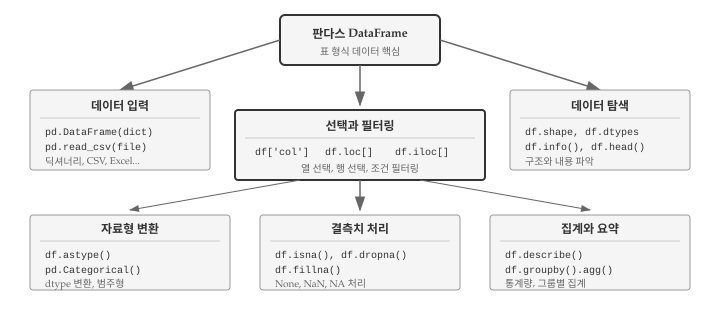
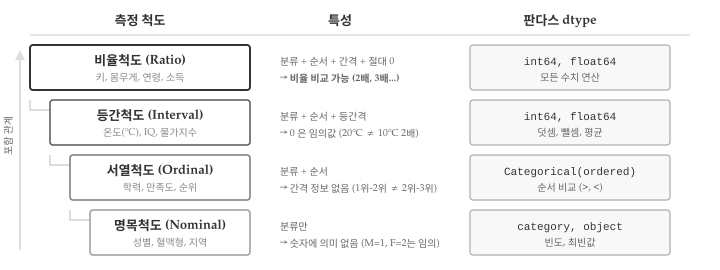
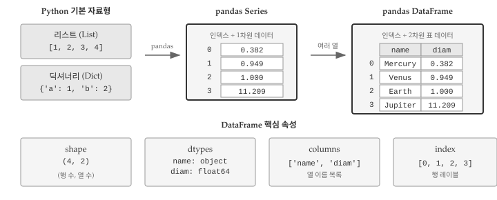
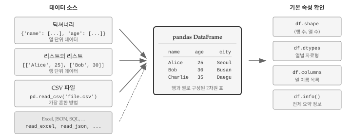
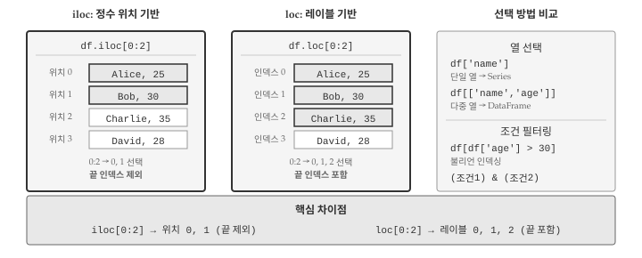
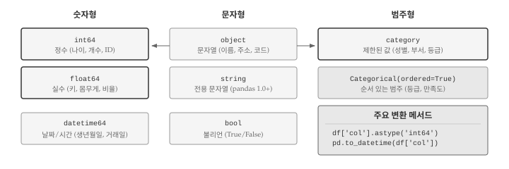
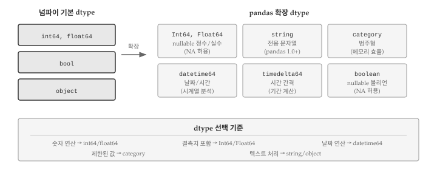
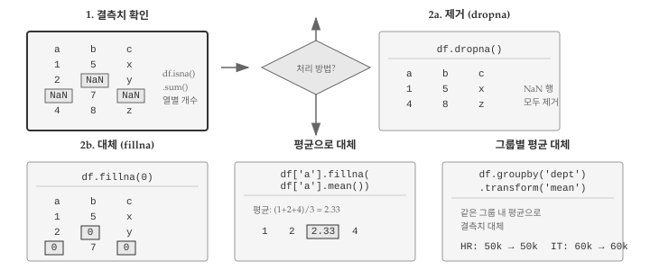

# 데이터프레임 {#dataframe}

\index{데이터프레임}

데이터 분석에서 가장 중요한 자료구조가 데이터프레임이다. CSV 파일, 데이터베이스 쿼리 결과, 엑셀 시트 등 거의 모든 표 형식 데이터가 데이터프레임으로 표현된다. 판다스(pandas) 라이브러리의 `DataFrame`은 파이썬 데이터 분석의 핵심 도구로, 행과 열로 구성된 2차원 표 형식 데이터를 효율적으로 다룬다.

앞선 장에서 리스트로 순서 있는 데이터를, 딕셔너리로 키-값 매핑을 다루는 방법을 배웠다. 데이터프레임은 두 자료구조의 장점을 결합한다. 열은 딕셔너리처럼 이름으로 접근하고, 행은 리스트처럼 순서가 있다. 여러 자료형을 하나의 표에 담을 수 있어, 실제 데이터 분석 작업에서 필수적으로 사용된다. 데이터프레임의 구조와 조작 방법을 이해하면, AI에게 "특정 조건을 만족하는 행을 필터링해줘", "그룹별 평균을 계산해줘", "두 데이터프레임을 조인해줘"와 같은 데이터 처리 요청을 명확하게 전달할 수 있다. @fig-dataframe-chapter-overview 는 이번 장에서 다룰 핵심 내용을 보여준다.

{#fig-dataframe-chapter-overview}

@fig-dataframe-chapter-overview 에서 보듯이, 데이터프레임 작업은 크게 다섯 단계로 나뉜다. 먼저 딕셔너리나 CSV 파일에서 **데이터를 입력**받아 데이터프레임을 생성한다. 생성된 데이터프레임의 **구조를 탐색**하여 행과 열의 수, 각 열의 자료형, 결측치 현황을 파악한다. 분석에 필요한 부분만 **선택하고 필터링**한 뒤, **자료형을 변환**하거나 **결측치를 처리**한다. 마지막으로 **집계와 요약** 통계를 계산하여 데이터에서 의미 있는 정보를 추출한다. 각 단계마다 판다스가 제공하는 메서드와 속성을 활용하면 수백만 행의 데이터도 몇 줄의 코드로 처리할 수 있다.

데이터프레임을 제대로 다루려면 먼저 데이터의 본질을 이해해야 한다. 같은 숫자라도 성별을 나타내는 1과 2는 키를 나타내는 170과 180과 근본적으로 다르다. 전자는 단순 분류 코드이고 후자는 비율 비교가 가능한 측정값이다. 측정 척도에 따라 적용할 수 있는 연산과 통계 기법이 달라지므로, 데이터프레임의 각 열에 적합한 자료형을 설정하는 것이 분석의 첫걸음이다.

## 측정 변수의 구분 {#sec-dataframe-scale}

\index{측정}

데이터 분석의 첫 단계는 데이터가 어떤 종류인지 파악하는 것이다. 현실 세계의 사건과 현상을 관찰하고 측정하면 숫자나 범주 형태의 데이터가 만들어진다. 측정 방식에 따라 데이터는 서로 다른 특성을 가지며, 적용할 수 있는 연산과 통계 기법도 달라진다. 측정 척도를 이해하면 판다스에서 적절한 자료형을 선택하고, 올바른 분석 방법을 적용할 수 있다. @fig-dataframe-scale 은 4가지 측정 척도가 계층적으로 쌓이는 구조와 각 척도에 대응하는 판다스 dtype을 보여준다.

{#fig-dataframe-scale}

자료의 고유 특성을 수치화하는 측정 척도는 명목형, 순서형, 구간형, 비율형 4가지 유형으로 분류된다. 각 척도는 이전 척도의 특성을 포함하면서 새로운 정보를 추가하는 계층 구조를 이룬다.
\index{척도} \index{척도!명목척도} \index{척도!서열척도} \index{척도!등간척도} \index{척도!비율척도}

::: {.callout-note}
## 측정 척도 4가지 유형

- **명목척도(Nominal)**: 단순히 개체 특성 분류를 위해 숫자나 부호를 부여한 척도로 숫자는 의미가 없다.
  - 예: 남자(M), 여자(F), 요일(월화수목금토일)
- **서열척도(Ordinal)**: 명목척도에 "순서(서열)" 정보가 추가된 척도로 측정대상 간 차이 정보는 없다.
  - 예: 군대계급(사병, 장교, 장군), 소득계층(1분위, 2분위, 3분위)
- **등간척도(Interval)**: 서열척도에 "등간격" 정보가 추가된 척도. 0은 상대적인 위치로, 서울 10도와 제주 20도에서 제주가 2배 따뜻한 것은 아니다.
  - 예: 온도, 시력, IQ 지수, 물가지수
- **비율척도(Ratio)**: 등간척도에 "비율" 비교특성이 추가된 척도로 절대 0이 존재한다. 100m는 200m의 절반이다.
  - 예: 키, 몸무게, 연령, 월소득
:::

측정 척도를 올바르게 파악하는 것이 중요한 이유는 척도에 따라 적용할 수 있는 분석 방법이 달라지기 때문이다. 명목척도 데이터에는 평균을 구할 수 없고, 등간척도 데이터에는 비율을 계산할 수 없다. 예를 들어 성별 데이터에서 평균은 의미가 없고, 섭씨 온도에서 "20도는 10도의 2배"라는 표현은 틀렸다. 반면 비율척도인 키나 몸무게는 "A가 B의 2배"라는 비교가 가능하다. 

판다스에서 dtype을 올바르게 설정하면 이러한 실수를 예방할 수 있다. 명목척도 데이터를 `category` 타입으로 저장하면 실수로 평균을 구하려 할 때 오류가 발생한다. 서열척도는 `pd.Categorical(..., ordered=True)`로 생성하면 순서 비교(`>`, `<`)가 가능해진다. 등간척도와 비율척도는 `int64`나 `float64`로 저장하여 산술 연산을 수행한다.

## 리스트에서 데이터프레임까지 {#sec-dataframe-evolution}

\index{pandas}

파이썬 기본 자료형인 리스트와 딕셔너리는 간단한 데이터를 다루기에 충분하다. 하지만 행과 열이 있는 표 형식 데이터를 다루려면 한계가 있다. 리스트의 리스트로 표를 표현할 수 있지만, 열 이름으로 데이터에 접근하거나 특정 조건으로 행을 필터링하려면 복잡한 코드가 필요하다. 판다스는 이러한 문제를 해결하기 위해 `Series`와 `DataFrame`이라는 자료구조를 제공한다.

{#fig-dataframe-overview}

@fig-dataframe-overview 는 파이썬 기본 자료형에서 판다스 데이터프레임으로 발전하는 과정을 보여준다. 리스트는 순서 있는 값의 모음이고, 딕셔너리는 키-값 쌍의 모음이다. 두 자료형을 조합하면 표 형식 데이터를 표현할 수 있지만, 열 단위 접근이나 조건 필터링에는 한계가 있다. 판다스의 Series는 인덱스가 붙은 1차원 배열로 딕셔너리와 리스트의 장점을 결합하고, 데이터프레임은 여러 Series를 열로 묶어 완전한 표 구조를 제공한다. 각 열은 서로 다른 자료형을 가질 수 있으면서도 행 단위로 정렬된 대응 관계를 유지한다.

### 리스트와 딕셔너리 한계

파이썬 기본 자료형만으로 표 형식 데이터를 다루면 곧 한계에 부딪힌다. 리스트의 리스트로 표를 표현하면 행 접근은 간단하지만 열 접근은 번거롭다. `data[0]`으로 첫 번째 행 전체를 가져올 수 있지만, 두 번째 열의 모든 값을 가져오려면 리스트 컴프리헨션이나 반복문이 필요하다. 열 이름도 없어서 `data[1]`이 무엇을 의미하는지 코드만 봐서는 알 수 없다.

```{python}
# 리스트의 리스트로 표 표현
data = [
    ['Mercury', 0.382, False],
    ['Venus', 0.949, False],
    ['Earth', 1.0, False],
    ['Jupiter', 11.209, True]
]

# 첫 번째 행 접근은 쉽다
print(data[0])

# 두 번째 열(지름) 접근은 루프가 필요하다
diameters = [row[1] for row in data]
print(diameters)
```

딕셔너리의 리스트로 표현하면 열 이름 문제는 해결된다. 각 행이 딕셔너리이므로 `planet['diameter']`처럼 의미 있는 이름으로 값에 접근할 수 있다. 하지만 열 전체를 대상으로 연산하려면 여전히 반복문이 필요하다. 모든 행성의 지름 평균을 구하려면 제너레이터 표현식으로 각 딕셔너리에서 값을 추출한 뒤 직접 계산해야 한다. 데이터가 수천, 수만 행이라면 이런 방식은 코드가 복잡해지고 성능도 떨어진다.

```{python}
# 딕셔너리의 리스트
planets = [
    {'name': 'Mercury', 'diameter': 0.382, 'rings': False},
    {'name': 'Venus', 'diameter': 0.949, 'rings': False},
    {'name': 'Earth', 'diameter': 1.0, 'rings': False}
]

# 모든 지름의 평균을 구하려면
avg = sum(p['diameter'] for p in planets) / len(planets)
print(f"평균 지름: {avg:.3f}")
```

### 판다스 Series

판다스의 `Series`는 리스트와 딕셔너리의 장점을 결합한 1차원 자료구조다. 리스트처럼 순서가 있으면서 딕셔너리처럼 각 요소에 레이블(인덱스)이 붙어 있다. 정수 위치로도, 레이블 이름으로도 데이터에 접근할 수 있어 유연하다. 또한 넘파이(NumPy) 배열을 기반으로 하여 벡터화 연산이 가능하므로, 반복문 없이도 전체 데이터에 대한 산술 연산이나 조건 필터링을 한 줄로 수행할 수 있다.
\index{Series}

```{python}
import pandas as pd

# 리스트로 Series 생성
diameters = pd.Series([0.382, 0.949, 1.0, 11.209])
print(diameters)
```

Series 생성 시 인덱스를 직접 지정하면 데이터에 의미를 부여할 수 있다. 행성 이름을 인덱스로 사용하면 `diameters['Earth']`처럼 직관적인 코드로 값을 조회할 수 있고, `diameters[diameters > 1]`처럼 조건을 만족하는 요소만 필터링하는 것도 간단하다.

```{python}
# 인덱스 지정
diameters = pd.Series(
    [0.382, 0.949, 1.0, 11.209],
    index=['Mercury', 'Venus', 'Earth', 'Jupiter']
)
print(diameters['Earth'])
print(diameters[diameters > 1])  # 조건 필터링
```

### 판다스 데이터프레임

Series가 1차원이라면 데이터프레임은 여러 Series를 열로 묶은 2차원 표다. 엑셀 스프레드시트나 데이터베이스 테이블과 유사한 구조로, 행과 열로 데이터를 조직한다. 각 열은 하나의 Series이며 서로 다른 자료형을 가질 수 있다. 이름, 나이, 급여처럼 문자열, 정수, 실수가 하나의 표에 공존할 수 있다는 뜻이다. 다만 **모든 열의 길이는 반드시 같아야 한다**. 이 제약 덕분에 행 단위로 데이터를 정렬하거나 필터링할 때 열 간의 대응 관계가 항상 유지된다.
\index{DataFrame}

데이터프레임의 강력함은 열 단위 연산과 행 단위 필터링을 간결하게 수행할 수 있다는 점에 있다. `df['salary'].mean()`처럼 열 전체의 평균을 한 줄로 계산하고, `df[df['age'] > 30]`처럼 조건을 만족하는 행만 추출할 수 있다. 딕셔너리의 리스트로는 수십 줄이 필요했던 작업이 데이터프레임에서는 직관적인 한 줄 표현으로 가능해진다.

```{python}
# 딕셔너리로 데이터프레임 생성
planets = pd.DataFrame({
    'name': ['Mercury', 'Venus', 'Earth', 'Jupiter'],
    'diameter': [0.382, 0.949, 1.0, 11.209],
    'rings': [False, False, False, True]
})
print(planets)
```

데이터프레임의 각 열은 Series다. 대괄호에 열 이름을 넣어 개별 열에 접근하면 Series 객체가 반환되고, Series가 제공하는 모든 메서드를 그대로 사용할 수 있다. 아래 코드에서 `planets['diameter']`는 Series를 반환하며, `mean()` 메서드로 평균을 계산한다.

```{python}
print(type(planets['diameter']))
print(planets['diameter'].mean())
```

여러 열을 동시에 선택하면 데이터프레임이 반환된다. 열 이름의 리스트를 대괄호에 전달하면 된다. 이 방식으로 분석에 필요한 열만 추출하여 새로운 데이터프레임을 만들 수 있다.

## 데이터프레임 생성 {#sec-dataframe-create}

데이터 분석의 첫 단계는 분석할 데이터를 데이터프레임으로 가져오는 것이다. 판다스는 다양한 데이터 소스를 데이터프레임으로 변환하는 방법을 제공한다. 메모리에 있는 파이썬 자료구조(딕셔너리, 리스트)에서 직접 생성할 수도 있고, CSV, Excel, JSON, SQL 데이터베이스 같은 외부 파일이나 시스템에서 읽어올 수도 있다. @fig-dataframe-create 는 데이터프레임 생성의 주요 경로를 보여준다.
\index{DataFrame!생성}

{#fig-dataframe-create}

### 딕셔너리로 생성

가장 직관적인 데이터프레임 생성 방법은 딕셔너리를 사용하는 것이다. 딕셔너리의 키가 열 이름이 되고, 각 키에 대응하는 리스트가 해당 열의 데이터가 된다. 열 단위로 데이터를 준비할 때 자연스러운 방식이며, 코드에서 테스트용 데이터를 빠르게 만들 때도 유용하다.

```{python}
df = pd.DataFrame({
    'name': ['Alice', 'Bob', 'Charlie'],
    'age': [25, 30, 35],
    'city': ['Seoul', 'Busan', 'Daegu']
})
print(df)
```

### 리스트의 리스트로 생성

데이터가 행 단위로 정리되어 있다면 리스트의 리스트를 사용한다. 웹 스크래핑이나 API 응답에서 데이터를 가져올 때 흔히 만나는 형태다. 각 내부 리스트가 하나의 행이 되고, `columns` 매개변수로 열 이름을 별도로 지정해야 한다. 열 이름을 지정하지 않으면 0, 1, 2 같은 정수 인덱스가 열 이름으로 사용된다.

```{python}
data = [
    ['Alice', 25, 'Seoul'],
    ['Bob', 30, 'Busan'],
    ['Charlie', 35, 'Daegu']
]
df = pd.DataFrame(data, columns=['name', 'age', 'city'])
print(df)
```

### CSV 파일 읽기

실무에서 가장 많이 사용하는 방법이 CSV 파일 읽기다. `pd.read_csv()` 함수 하나로 파일을 열고 파싱하고 데이터프레임으로 변환하는 작업을 한 번에 처리한다. 첫 번째 행을 열 이름으로 자동 인식하고, 각 열의 자료형도 데이터를 분석하여 추론한다. 인코딩, 구분자, 결측치 표시 등 다양한 옵션을 지원하므로 대부분의 CSV 형식을 처리할 수 있다.
\index{read\_csv}

```{python}
#| eval: false
# CSV 파일 읽기
df = pd.read_csv('data/employees.csv')

# 처음 5행 확인
print(df.head())
```

### 기본 속성 확인

데이터프레임을 생성하거나 파일에서 읽어왔다면 가장 먼저 기본 속성을 확인해야 한다. 행과 열의 수는 예상과 일치하는가? 열 이름은 올바른가? 각 열의 자료형은 적절한가? 이 세 가지 질문에 답할 수 있어야 본격적인 분석을 시작할 수 있다. `shape`, `columns`, `dtypes` 속성과 `info()` 메서드가 이 정보를 제공한다.

```{python}
df = pd.DataFrame({
    'name': ['Alice', 'Bob', 'Charlie', 'David'],
    'age': [25, 30, 35, 28],
    'salary': [50000, 60000, 70000, 55000],
    'department': ['HR', 'IT', 'IT', 'HR']
})

print(f"행, 열 수: {df.shape}")
print(f"열 이름: {list(df.columns)}")
print(f"인덱스: {list(df.index)}")
```

`dtypes` 속성으로 각 열의 자료형을 확인한다.

```{python}
print(df.dtypes)
```

`info()` 메서드는 데이터프레임의 전체 정보를 요약해서 보여준다.

```{python}
df.info()
```

## 데이터 선택과 필터링 {#sec-dataframe-select}

데이터프레임에서 원하는 데이터를 선택하는 방법을 익히는 것이 판다스 활용 핵심이다. 수천 개의 열 중에서 분석에 필요한 몇 개만 추출하거나, 수백만 행 중에서 특정 조건을 만족하는 행만 걸러내는 작업이 데이터 분석의 대부분을 차지한다. 열 선택, 행 선택, 조건 필터링 세 가지 방법을 구분해서 이해해야 한다. `loc`과 `iloc`의 차이점과 열/행 선택 방법이 @fig-dataframe-selection 에 나와 있다.
\index{DataFrame!인덱싱}

{#fig-dataframe-selection}


### 열 선택

열 선택은 데이터프레임에서 가장 기본적인 연산이다. 분석에 필요한 변수만 추출하거나, 특정 열에 대해 통계를 계산할 때 사용한다. 단일 열을 선택하면 판다스 시리즈가 반환되고, 여러 열을 선택하면 데이터프레임이 반환된다는 점을 기억해야 한다.

```{python}
print(df['name'])
print(type(df['name']))
```

여러 열을 선택하려면 열 이름의 리스트를 전달한다. 결과는 데이터프레임이다.

```{python}
print(df[['name', 'salary']])
```

### 행 선택: loc과 iloc

행을 선택할 때는 `loc`과 `iloc` 두 가지 방법을 사용한다. `loc`은 레이블(인덱스 이름) 기반이고, `iloc`은 정수 위치 기반이다. 데이터프레임의 인덱스가 정수일 때는 두 방법의 결과가 비슷해 보이지만, 문자열 인덱스를 사용하거나 슬라이싱을 할 때 중요한 차이가 드러난다.
\index{loc} \index{iloc}

```{python}
# iloc: 정수 인덱스로 선택 (0부터 시작)
print(df.iloc[0])      # 첫 번째 행
print(df.iloc[0:2])    # 첫 두 행 (슬라이싱)
```

```{python}
# loc: 레이블로 선택
print(df.loc[0])       # 인덱스가 0인 행
print(df.loc[0:2])     # 인덱스 0부터 2까지 (끝 포함!)
```

::: {.callout-warning}
## loc과 iloc 슬라이싱 차이

`iloc[0:2]`는 인덱스 0, 1만 선택한다(끝 제외). `loc[0:2]`는 인덱스 0, 1, 2를 모두 선택한다(끝 포함). 이 차이를 주의해야 한다.
:::

행과 열을 동시에 선택할 수도 있다.

```{python}
# iloc: 행 0~1, 열 0~1
print(df.iloc[0:2, 0:2])

# loc: 특정 행, 특정 열
print(df.loc[0:1, ['name', 'salary']])
```

### 조건 필터링

조건 필터링은 판다스의 가장 강력한 기능 중 하나다. SQL의 WHERE 절처럼 특정 조건을 만족하는 행만 추출할 수 있다. 조건식을 대괄호 안에 넣으면 해당 조건이 True인 행만 반환된다. 내부적으로 조건식은 불리언 Series를 생성하고, 이 Series가 True인 위치의 행만 선택된다.

```{python}
# 나이가 30 이상인 행
print(df[df['age'] >= 30])

# IT 부서 직원
print(df[df['department'] == 'IT'])
```

여러 조건을 조합할 때는 `&`(and)와 `|`(or)를 사용하고, 각 조건을 괄호로 감싼다.

```{python}
# IT 부서이면서 나이 30 이상
print(df[(df['department'] == 'IT') & (df['age'] >= 30)])
```

## 자료형과 형변환 {#sec-dataframe-dtype}

데이터프레임의 각 열은 고유한 자료형(dtype)을 갖는다. 판다스는 데이터를 읽을 때 각 열의 자료형을 자동으로 추론하지만, 추론이 항상 정확하지는 않다. CSV 파일에서 "001", "002" 같은 코드를 읽으면 정수로 인식해 앞의 0이 사라지고, "2024-01-15" 같은 날짜 문자열도 단순 텍스트로 처리된다. 올바른 자료형을 설정해야 정확한 연산과 분석이 가능하다. @fig-dataframe-dtype 은 주요 dtype과 형변환 관계를 보여준다.
\index{dtype}

{#fig-dataframe-dtype}

### 판다스 dtype 종류

판다스 dtype 시스템은 넘파이 배열을 기반으로 하면서 데이터 분석에 필요한 타입을 추가로 제공한다. @fig-dataframe-dtype-system 은 넘파이 기본 dtype에서 판다스 확장 dtype으로 발전하는 관계를 보여준다.

{#fig-dataframe-dtype-system}

넘파이는 `int64`, `float64`, `bool`, `object` 네 가지 기본 dtype을 제공한다. 판다스는 여기에 데이터 분석에 특화된 타입을 추가했다. `datetime64`는 날짜와 시간을 다루며 시계열 분석의 기반이 된다. `category`는 성별이나 부서처럼 제한된 값을 효율적으로 저장하고, `string`은 텍스트 전용 타입으로 문자열 메서드를 더 일관되게 지원한다. 판다스 1.0부터는 `Int64`, `Float64`, `boolean` 같은 nullable 타입도 도입되어 결측치가 포함된 정수 열도 정수형을 유지할 수 있게 되었다.

각 dtype에 따라 사용 가능한 메서드와 연산이 달라지므로, 분석 전에 `dtypes` 속성으로 각 열의 자료형을 확인하는 습관이 중요하다. 숫자 연산이 필요하면 `int64`나 `float64`를, 날짜 계산이 필요하면 `datetime64`를, 메모리 효율이 중요하고 값의 종류가 제한적이면 `category`를 선택한다.

### astype()으로 형변환

`astype()` 메서드는 열의 자료형을 다른 타입으로 변환한다. 문자열로 저장된 숫자를 정수나 실수로 바꾸거나, 숫자를 문자열로 변환할 때 사용한다. 변환이 불가능한 값이 있으면 오류가 발생하므로, 변환 전에 데이터를 확인하거나 `errors='coerce'` 옵션으로 변환 실패 시 결측치로 처리할 수 있다.
\index{astype}

```{python}
# 정수를 실수로
df['age_float'] = df['age'].astype('float64')
print(df['age_float'].dtype)

# 숫자를 문자열로
df['age_str'] = df['age'].astype('str')
print(df['age_str'].dtype)
```

### 범주형 데이터

성별, 부서, 등급처럼 제한된 값 중 하나를 갖는 데이터는 범주형(category)으로 저장하는 것이 효율적이다. 문자열(`object`)로 저장하면 "HR"이 100번 반복될 때 100개의 문자열 객체가 생성되지만, category로 저장하면 고유 값은 한 번만 저장하고 정수 인덱스로 참조한다. 메모리 사용량이 크게 줄어들고, 그룹화나 정렬 연산도 빨라진다.
\index{category}

```{python}
print(f"변환 전: {df['department'].dtype}")

df['department'] = df['department'].astype('category')
print(f"변환 후: {df['department'].dtype}")
print(df['department'].cat.categories)
```

순서가 있는 범주형은 `pd.Categorical`로 생성한다.

```{python}
# 순서 있는 범주형
satisfaction = pd.Categorical(
    ['High', 'Low', 'Medium', 'High', 'Low'],
    categories=['Low', 'Medium', 'High'],
    ordered=True
)
print(satisfaction)
print(satisfaction > 'Low')  # 순서 비교 가능
```

## 결측치 처리 {#sec-dataframe-missing}

실제 데이터는 완벽하지 않다. 설문 응답에서 누락된 문항, 센서 오류로 기록되지 않은 측정값, 데이터 입력 실수 등 다양한 이유로 결측치(missing values)가 발생한다. 결측치를 무시하고 분석하면 잘못된 결론에 도달할 수 있고, 무조건 제거하면 중요한 정보를 잃을 수 있다. 결측치의 패턴을 파악하고 적절한 처리 전략을 선택하는 것이 데이터 분석의 핵심 역량이다. @fig-dataframe-missing 은 결측치 처리 과정을 보여준다.
\index{결측치} \index{NaN}

{#fig-dataframe-missing}

### 결측치 종류

파이썬과 판다스에서 결측치를 나타내는 값이 여러 가지 있다. `None`은 파이썬 기본 null 값이고, `np.nan`은 넘파이에서 사용하는 "Not a Number" 값이다. 판다스 1.0부터는 `pd.NA`라는 통합 결측치 표현이 도입되었다. 세 값 모두 데이터프레임에서 결측치로 인식되지만, dtype에 따라 내부적으로 다르게 처리된다. 숫자형 열에서는 `np.nan`이 사용되고, 문자열 열에서는 `None`이 그대로 유지된다.

```{python}
import numpy as np

# 결측치가 있는 데이터프레임
df_missing = pd.DataFrame({
    'a': [1, 2, None, 4],
    'b': [5, np.nan, 7, 8],
    'c': ['x', 'y', None, 'z']
})
print(df_missing)
print(df_missing.dtypes)
```

### 결측치 확인

결측치 처리의 첫 단계는 어디에 얼마나 있는지 파악하는 것이다. `isna()` 메서드는 각 셀이 결측치인지 여부를 불리언으로 반환한다. 전체 데이터프레임에 적용하면 같은 크기의 불리언 데이터프레임이 되고, 열 단위로 `sum()`을 적용하면 열별 결측치 개수를 얻는다. `notna()`는 `isna()`의 반대로, 결측치가 아닌 셀을 True로 표시한다.
\index{isna} \index{notna}

```{python}
# 결측치 여부 확인
print(df_missing.isna())

# 열별 결측치 개수
print(df_missing.isna().sum())

# 결측치가 있는 행 확인
print(df_missing[df_missing.isna().any(axis=1)])
```

### 결측치 제거

가장 단순한 결측치 처리 방법은 해당 행이나 열을 제거하는 것이다. `dropna()` 메서드는 기본적으로 결측치가 하나라도 있는 행을 제거한다. 분석에 사용할 열이 명확할 때는 `subset` 매개변수로 특정 열만 기준으로 삼을 수 있다. 모든 값이 결측치인 행만 제거하려면 `how='all'`을 지정한다. 다만 결측치가 많은 데이터에서 무조건 제거하면 분석에 사용할 데이터가 크게 줄어들 수 있으므로 주의가 필요하다.
\index{dropna}

```{python}
# 결측치가 있는 행 제거
print(df_missing.dropna())

# 특정 열 기준으로 제거
print(df_missing.dropna(subset=['a']))
```

### 결측치 대체

결측치를 제거하는 대신 다른 값으로 대체하면 데이터 손실을 최소화할 수 있다. `fillna()` 메서드는 결측치를 지정한 값으로 채운다. 단순히 0이나 평균으로 대체할 수도 있고, 딕셔너리를 전달하여 열마다 다른 대체값을 지정할 수도 있다. 시계열 데이터에서는 `method='ffill'`(앞의 값으로 채움)이나 `method='bfill'`(뒤의 값으로 채움)을 사용하기도 한다. 어떤 값으로 대체할지는 데이터의 특성과 분석 목적에 따라 달라진다.
\index{fillna}

```{python}
# 0으로 대체
print(df_missing['a'].fillna(0))

# 평균으로 대체
print(df_missing['a'].fillna(df_missing['a'].mean()))

# 열마다 다른 값으로 대체
print(df_missing.fillna({'a': 0, 'b': -1, 'c': 'unknown'}))
```

::: {.callout-note}
## 결측치 처리 전략

결측치를 제거할지 대체할지는 분석 목적에 따라 결정한다. 무조건 제거하면 데이터가 크게 줄어들 수 있고, 무조건 평균으로 대체하면 분포가 왜곡될 수 있다. 결측치의 원인과 패턴을 먼저 파악하는 것이 중요하다.
:::

## 데이터프레임 요약 {#sec-dataframe-summary}

데이터 분석의 목표는 대량의 데이터에서 의미 있는 정보를 추출하는 것이다. 수백만 행의 데이터를 한 눈에 파악하려면 요약 통계가 필요하다. 판다스는 평균, 중앙값, 표준편차 같은 기술 통계량을 계산하는 메서드와 그룹별로 집계하는 `groupby()` 기능을 제공한다. 데이터의 전체적인 분포와 패턴을 파악한 뒤 세부 분석으로 들어가는 것이 효율적인 분석 순서다.
\index{describe} \index{groupby}

### describe()

`describe()` 메서드는 숫자형 열에 대해 개수, 평균, 표준편차, 최솟값, 사분위수, 최댓값을 한 번에 계산한다. 데이터의 분포를 빠르게 파악할 때 유용하다. 평균과 중앙값(50%)의 차이가 크면 데이터가 한쪽으로 치우쳐 있다는 신호이고, 최솟값과 최댓값이 비정상적으로 크거나 작으면 이상치를 의심해볼 수 있다.

```{python}
df = pd.DataFrame({
    'name': ['Alice', 'Bob', 'Charlie', 'David', 'Eve'],
    'age': [25, 30, 35, 28, 32],
    'salary': [50000, 60000, 70000, 55000, 65000],
    'department': ['HR', 'IT', 'IT', 'HR', 'IT']
})

print(df.describe())
```

문자열 열을 포함하려면 `include='all'`을 지정한다.

```{python}
print(df.describe(include='all'))
```

### 집계 함수

`describe()`가 여러 통계량을 한 번에 보여준다면, 개별 집계 함수는 특정 통계량 하나를 계산한다. `mean()`, `sum()`, `max()`, `min()`, `std()` 등이 자주 사용된다. `nunique()`는 고유 값의 개수를 반환하여 범주형 열의 카디널리티(고유값 수)를 파악할 때 유용하다. 이러한 집계 함수는 Series에 적용하면 스칼라 값을 반환하고, 데이터프레임 전체에 적용하면 열별 집계 결과를 Series로 반환한다.

```{python}
print(f"평균 나이: {df['age'].mean():.1f}")
print(f"급여 합계: {df['salary'].sum():,}")
print(f"부서 종류: {df['department'].nunique()}")
```

### groupby()

`groupby()`는 데이터 분석에서 가장 강력한 도구 중 하나다. 데이터를 특정 열의 값에 따라 그룹으로 나누고, 각 그룹별로 집계 연산을 수행한다. SQL의 GROUP BY와 동일한 개념으로, "부서별 평균 급여", "지역별 매출 합계", "연도별 고객 수"처럼 범주별 통계를 계산할 때 사용한다. `agg()` 메서드와 함께 사용하면 여러 열에 서로 다른 집계 함수를 동시에 적용할 수 있다.

```{python}
# 부서별 평균 급여
print(df.groupby('department')['salary'].mean())

# 부서별 여러 통계량
print(df.groupby('department').agg({
    'salary': ['mean', 'max'],
    'age': 'mean'
}))
```

## 디버깅 {#sec-dataframe-debug}

\index{디버깅}

데이터프레임 작업에서 오류는 피할 수 없다. 열 이름 오타, 자료형 불일치, 인덱스 혼동 등 다양한 문제가 발생한다. 중요한 것은 오류 메시지를 정확히 읽고 원인을 파악하는 능력이다. 데이터프레임 관련 오류는 대부분 명확한 패턴이 있어서, 몇 가지 대표적인 사례를 익혀두면 빠르게 해결할 수 있다.

### KeyError: 열 이름 오류

가장 흔한 오류 중 하나가 존재하지 않는 열 이름을 사용할 때 발생하는 `KeyError`다. 특히 대소문자 차이('Name'과 'name'), 앞뒤 공백(' name'과 'name'), 특수문자 포함 여부가 문제가 된다. CSV 파일에서 읽어온 데이터는 열 이름에 예상치 못한 공백이 포함된 경우가 많으므로, `df.columns`로 정확한 열 이름을 먼저 확인하는 습관이 필요하다.

```{python}
#| error: true
df = pd.DataFrame({'name': ['Alice'], 'age': [25]})
# df['Name']  # KeyError: 'Name' (대소문자 주의!)
print(df.columns)  # 열 이름 확인
```

### SettingWithCopyWarning

판다스를 사용하다 보면 `SettingWithCopyWarning` 경고를 자주 만난다. 데이터프레임의 일부를 선택한 결과가 원본의 "뷰(view)"인지 "복사본(copy)"인지 모호할 때 발생한다. 복사본에 값을 할당하면 원본은 변경되지 않아 의도한 대로 동작하지 않는다. 이러한 문제를 피하려면 값을 변경할 때 항상 `.loc`을 사용하여 원본 데이터프레임에 직접 접근해야 한다.

```{python}
#| warning: false
# 경고가 발생하는 패턴
subset = df[df['age'] > 20]
# subset['age'] = 30  # SettingWithCopyWarning

# 올바른 방법: .loc 사용
df.loc[df['age'] > 20, 'age'] = 30
```

### 자료형 관련 오류

CSV 파일에서 읽어온 숫자가 문자열로 인식되는 경우가 흔하다. 숫자처럼 보이지만 dtype이 `object`인 열에 `mean()`이나 `sum()` 같은 숫자 연산을 시도하면 오류가 발생하거나 예상치 못한 결과가 나온다. 분석 전에 `dtypes`로 각 열의 자료형을 확인하고, 필요하면 `astype()`으로 변환해야 한다.

```{python}
#| error: true
df = pd.DataFrame({'value': ['10', '20', '30']})
# df['value'].mean()  # 문자열이므로 오류

# 해결: 자료형 변환
df['value'] = df['value'].astype('int64')
print(df['value'].mean())
```

### 디버깅 전략

데이터프레임 작업에서 문제가 발생하면 체계적인 점검이 필요하다. 먼저 `dtypes`로 각 열의 자료형이 예상과 일치하는지 확인한다. 문자열로 저장된 숫자, 정수로 읽힌 날짜 등이 흔한 문제의 원인이다. 필터링이나 조인 후에는 `shape`로 행과 열의 수가 예상과 맞는지 점검한다. 데이터가 사라지거나 예상보다 많아졌다면 조건식에 문제가 있거나 조인 키가 잘못된 것이다. 큰 데이터프레임은 `head()`로 샘플을 확인하고, `isna().sum()`으로 결측치 현황을 파악한다.

```{python}
# 디버깅 체크리스트
df = pd.DataFrame({
    'name': ['Alice', 'Bob', None],
    'age': [25, None, 35]
})

print("1. 자료형 확인:")
print(df.dtypes)
print("\n2. 형태 확인:")
print(df.shape)
print("\n3. 결측치 확인:")
print(df.isna().sum())
print("\n4. 샘플 확인:")
print(df.head())
```

## AI와 함께하는 데이터프레임 처리 {#sec-dataframe-ai}

판다스 코드는 메서드 체이닝과 다양한 매개변수 조합으로 복잡해지기 쉽다. AI를 활용하면 원하는 변환을 자연어로 설명하고 적절한 코드를 얻을 수 있다. 핵심은 데이터 구조를 정확히 전달하는 것이다. 열 이름과 자료형을 명시하고, 가능하면 샘플 데이터 몇 행을 함께 제시한다. "sales 데이터프레임에서 region이 'Seoul'인 행만 추출"처럼 조건을 구체적으로 기술하면 정확한 코드를 얻을 확률이 높아진다.

여러 데이터프레임을 다루는 작업에서는 각 테이블 관계를 명확히 설명해야 한다. 조인 작업을 요청할 때 "customers와 orders를 customer_id로 연결"처럼 키 열을 지정하고, inner/left/outer 중 어떤 조인이 필요한지 명시한다. 그룹별 집계나 피벗 테이블처럼 데이터 형태가 크게 바뀌는 연산은 입력과 출력의 예상 형태를 함께 설명하면 오해를 줄일 수 있다.

AI가 생성한 판다스 코드는 반드시 검증이 필요하다. 작은 테스트 데이터로 먼저 실행하고, `shape`로 행과 열 수가 예상과 맞는지 확인한다. 조인 후 행이 늘어났다면 키 중복 문제를, 행이 줄었다면 매칭 실패를 의심한다. `dtypes`로 자료형이 의도대로 유지되었는지도 점검한다. 특히 날짜 열이 문자열로 남아 있거나, 정수 열에 결측치가 들어가면서 실수형으로 바뀌는 경우가 흔하다.

::: {.content-visible when-format="pdf"}
## 생각해볼 점 {.unnumbered}
:::

::: {.content-visible when-format="html"}
## 💡 생각해볼 점 {.unnumbered}
:::

데이터프레임은 데이터 분석의 기본 단위다. CSV 파일을 읽고, 조건에 맞는 행을 필터링하고, 그룹별 통계를 계산하는 작업이 모두 데이터프레임 위에서 이루어진다. 판다스 데이터프레임의 기본 조작법을 익히면 대부분의 데이터 전처리 작업을 수행할 수 있다.

열 선택에는 대괄호를, 행 선택에는 `loc`과 `iloc`을 사용한다는 점을 기억하자. `loc`은 레이블 기반, `iloc`은 위치 기반이다. 조건 필터링은 불리언 인덱싱으로 수행하며, 여러 조건을 조합할 때는 `&`, `|` 연산자와 괄호를 사용한다.

자료형은 분석 결과에 직접적인 영향을 미친다. 문자열로 저장된 숫자는 연산이 되지 않고, 범주형 데이터는 `category` 타입으로 변환하면 메모리와 성능 이점을 얻는다. 결측치는 무조건 제거하기보다 패턴을 파악하고 적절한 전략을 선택해야 한다.

다음 장에서는 여러 데이터프레임을 결합하고, 데이터를 변형하고, 복잡한 분석을 수행하는 고급 기법을 다룬다. 기본기가 탄탄해야 응용이 가능하므로, 이번 장에서 다룬 선택, 필터링, 자료형 변환, 결측치 처리를 충분히 연습하기 바란다.
