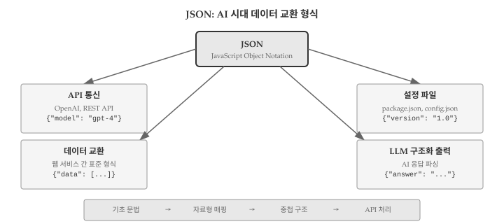
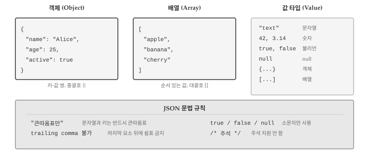
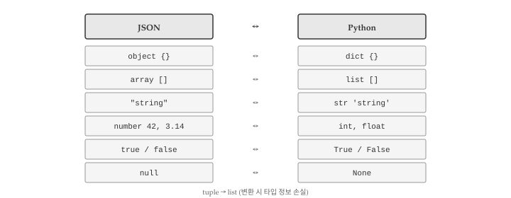
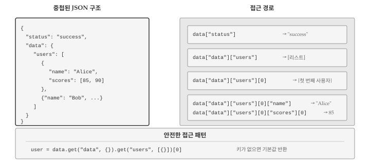
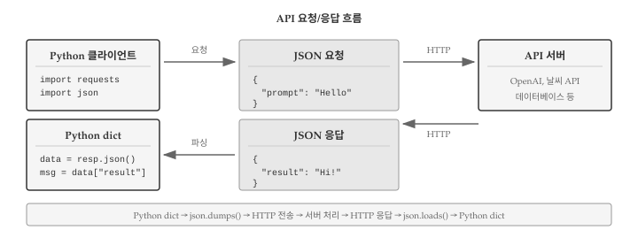

# JSON {#json}

\index{JSON}

웹 서비스와 소통하고, AI API를 호출하고, 설정 파일을 읽으려면 JSON(JavaScript Object Notation)을 다룰 줄 알아야 한다. JSON은 데이터를 텍스트로 표현하는 표준 형식으로, 사람이 읽기 쉬우면서도 프로그램이 파싱하기 쉽다는 장점이 있다. 딕셔너리와 리스트를 배웠다면 JSON은 이미 절반은 알고 있는 셈이다. JSON 객체는 파이썬 딕셔너리와, JSON 배열은 파이썬 리스트와 거의 동일한 구조를 갖기 때문이다. @fig-json-overview 는 JSON의 활용 영역과 학습 흐름을 보여준다.

{#fig-json-overview}

AI 시대에 JSON 활용 능력이 중요해진 이유는 명확하다. OpenAI, Claude, Gemini 같은 LLM API는 모두 JSON 형식으로 요청을 보내고 응답을 받는다. "날씨를 알려줘"라고 요청하면 `{"temperature": 22, "condition": "sunny"}` 같은 JSON 응답이 돌아온다. 복잡한 API 응답에서 원하는 정보를 추출하려면 중첩된 JSON 구조를 탐색하는 방법을 알아야 한다. AI에게 "이 JSON에서 사용자 이름만 추출해줘"라고 요청할 때도 JSON 구조를 이해해야 명확한 지시가 가능하다.

## JSON 기초 {#sec-json-basics}

\index{JSON!문법}

JSON은 2001년 더글라스 크록포드(Douglas Crockford)가 JavaScript의 객체 표기법을 기반으로 만든 텍스트 형식이다. 이름에 JavaScript가 들어있지만 특정 언어에 종속되지 않는다. 파이썬, 자바, C++, Go 등 거의 모든 프로그래밍 언어에서 JSON을 읽고 쓸 수 있다. @fig-json-structure 는 JSON의 기본 구조를 보여준다.

{#fig-json-structure}

### 객체와 배열

JSON 데이터는 크게 두 가지 구조로 구성된다. **객체(object)**는 중괄호 `{}`로 감싸고 키-값 쌍을 콤마로 구분한다. 파이썬 딕셔너리와 동일한 개념이다. **배열(array)**은 대괄호 `[]`로 감싸고 값을 콤마로 구분한다. 파이썬 리스트와 같다.

```{python}
# JSON 형식 예시 (파이썬 문자열로 표현)
json_object = '{"name": "Alice", "age": 25}'
json_array = '[1, 2, 3, "four", true]'

print("객체:", json_object)
print("배열:", json_array)
```

### 값 타입

JSON에서 사용할 수 있는 값 타입은 6가지다.

- **문자열**: 큰따옴표로 감싼 텍스트 (`"hello"`)
- **숫자**: 정수 또는 실수 (`42`, `3.14`)
- **불리언**: `true` 또는 `false` (소문자)
- **null**: 값이 없음을 나타냄 (파이썬의 `None`)
- **객체**: 중첩된 키-값 쌍 (`{"key": "value"}`)
- **배열**: 값의 순서 있는 목록 (`[1, 2, 3]`)

```{python}
# 모든 JSON 값 타입을 포함하는 예제
json_example = '''
{
  "string": "hello",
  "number": 42,
  "float": 3.14,
  "boolean": true,
  "null_value": null,
  "array": [1, 2, 3],
  "object": {"nested": "value"}
}
'''
print(json_example)
```

### JSON 문법 규칙

JSON은 파이썬 딕셔너리와 비슷하지만 몇 가지 중요한 차이가 있다.

::: {.callout-warning}
## JSON 문법 주의사항

1. **문자열은 반드시 큰따옴표** 사용 - 작은따옴표(`'`)는 오류
2. **키도 반드시 큰따옴표로 감싸야** 함 - 파이썬 딕셔너리와 다름
3. **마지막 요소 뒤에 쉼표 불가** - trailing comma 오류
4. **true/false/null은 소문자** - True, False, None 아님
:::

```{python}
# 유효한 JSON vs 유효하지 않은 JSON
valid_json = '{"name": "Alice", "active": true}'
# invalid_json = "{'name': 'Alice'}"  # 작은따옴표 - 오류!
# invalid_json = '{"name": "Alice",}'  # trailing comma - 오류!
print("유효한 JSON:", valid_json)
```

## 자료형 매핑 {#sec-json-mapping}

\index{JSON!자료형 매핑}

JSON과 파이썬 사이에는 자료형 변환 규칙이 있다. 파이썬 `json` 모듈이 자동으로 변환을 처리하지만, 변환 규칙을 알아야 예상치 못한 결과를 방지할 수 있다. @fig-json-python-mapping 은 JSON과 파이썬 자료형 간의 매핑 관계를 보여준다.

{#fig-json-python-mapping}

### JSON → Python

JSON을 파이썬으로 변환할 때 적용되는 규칙이다.

| JSON 타입 | Python 타입 | 예시 |
|-----------|-------------|------|
| object | dict | `{"a": 1}` → `{'a': 1}` |
| array | list | `[1, 2]` → `[1, 2]` |
| string | str | `"hello"` → `'hello'` |
| number (정수) | int | `42` → `42` |
| number (실수) | float | `3.14` → `3.14` |
| true | True | `true` → `True` |
| false | False | `false` → `False` |
| null | None | `null` → `None` |

### Python → JSON

파이썬을 JSON으로 변환할 때는 일부 제약이 있다.

| Python 타입 | JSON 타입 | 비고 |
|-------------|-----------|------|
| dict | object | 키는 문자열만 가능 |
| list | array | |
| tuple | array | 튜플도 배열로 변환 |
| str | string | |
| int, float | number | |
| True | true | |
| False | false | |
| None | null | |

### 변환 시 주의사항

파이썬에는 있지만 JSON에는 없는 타입이 있다. 튜플은 리스트로 변환되어 원래 타입 정보가 사라진다. 집합(set), 날짜(datetime), 바이트(bytes) 등은 기본적으로 JSON 변환이 불가능하다.

```{python}
import json

# 튜플은 리스트로 변환됨
data = {"coordinates": (10, 20)}
json_str = json.dumps(data)
print(json_str)  # {"coordinates": [10, 20]}

# 다시 파싱하면 리스트가 됨
parsed = json.loads(json_str)
print(type(parsed["coordinates"]))  # <class 'list'>
```

::: {.callout-note}
## 직렬화할 수 없는 객체

`set`, `datetime`, 사용자 정의 클래스 등은 기본적으로 JSON 변환이 불가능하다. 변환하려면 `default` 매개변수로 커스텀 인코더를 지정해야 한다.

```python
from datetime import datetime
json.dumps({"now": datetime.now()})  # TypeError!
```
:::

## json 모듈 {#sec-json-module}

\index{json 모듈}

파이썬 표준 라이브러리의 `json` 모듈은 JSON 인코딩(파이썬 → JSON)과 디코딩(JSON → 파이썬)을 담당한다. 네 가지 핵심 함수가 있다.

### loads()와 dumps() - 문자열 변환

`loads()`는 JSON **문자열**을 파이썬 객체로 변환한다. `dumps()`는 파이썬 객체를 JSON **문자열**로 변환한다. 함수 이름 끝의 `s`는 string을 의미한다.
\index{json.loads} \index{json.dumps}

```{python}
import json

# JSON 문자열 → 파이썬 딕셔너리
json_str = '{"name": "Alice", "age": 25, "active": true}'
data = json.loads(json_str)
print(type(data))
print(data["name"])
print(data["active"])  # true → True로 변환됨
```

```{python}
# 파이썬 딕셔너리 → JSON 문자열
person = {"name": "Bob", "age": 30, "scores": [85, 90, 78]}
json_output = json.dumps(person)
print(json_output)
print(type(json_output))
```

### load()와 dump() - 파일 입출력

`load()`는 JSON **파일**을 읽어 파이썬 객체로 변환한다. `dump()`는 파이썬 객체를 JSON **파일**로 저장한다.
\index{json.load} \index{json.dump}

```{python}
#| eval: false
# JSON 파일 읽기
with open('data.json', 'r', encoding='utf-8') as f:
    data = json.load(f)

# JSON 파일 쓰기
with open('output.json', 'w', encoding='utf-8') as f:
    json.dump(data, f)
```

### 유용한 옵션

`dumps()`와 `dump()`에는 출력 형식을 조절하는 옵션이 있다.

```{python}
data = {"name": "김철수", "items": ["apple", "banana"], "active": True}

# 기본 출력 (한 줄)
print(json.dumps(data))

# 들여쓰기 추가
print(json.dumps(data, indent=2))
```

```{python}
# 한글 유니코드 이스케이프 방지
print(json.dumps(data, ensure_ascii=False, indent=2))
```

::: {.callout-warning}
## 한글과 ensure_ascii

`ensure_ascii=True`(기본값)면 한글이 `\uae40\ucca0\uc218`처럼 유니코드 이스케이프로 변환된다. 한글을 그대로 보려면 `ensure_ascii=False`를 지정해야 한다.
:::

```{python}
# 키 정렬
data = {"zebra": 1, "apple": 2, "mango": 3}
print(json.dumps(data, sort_keys=True, indent=2))
```

## 중첩 구조 탐색 {#sec-json-nested}

\index{JSON!중첩 구조}

실제 API 응답은 단순한 키-값 쌍이 아니라 딕셔너리 안에 리스트, 리스트 안에 딕셔너리가 중첩된 복잡한 구조를 갖는다. 이러한 중첩 구조에서 원하는 데이터를 추출하는 방법을 익혀야 한다. @fig-json-nested 는 중첩 구조의 예시와 접근 경로를 보여준다.

{#fig-json-nested}

### 단계별 접근

중첩된 데이터에 접근할 때는 바깥에서 안쪽으로 단계별로 접근한다.

```{python}
response = {
    "status": "success",
    "data": {
        "users": [
            {"id": 1, "name": "Alice", "scores": [85, 90, 78]},
            {"id": 2, "name": "Bob", "scores": [92, 88, 95]}
        ],
        "count": 2
    }
}

# 단계별 접근
data = response["data"]           # 첫 번째 레벨
users = data["users"]             # 두 번째 레벨
first_user = users[0]             # 배열의 첫 번째 요소
name = first_user["name"]         # 세 번째 레벨
print(name)

# 한 줄로 접근
first_score = response["data"]["users"][0]["scores"][0]
print(first_score)
```

### 반복문으로 탐색

배열 안의 모든 요소를 처리할 때는 반복문을 사용한다.

```{python}
# 모든 사용자 이름 출력
for user in response["data"]["users"]:
    print(f"ID: {user['id']}, Name: {user['name']}")

# 모든 점수의 평균 계산
all_scores = []
for user in response["data"]["users"]:
    all_scores.extend(user["scores"])
print(f"전체 평균: {sum(all_scores) / len(all_scores):.1f}")
```

### 안전한 접근: get() 메서드

존재하지 않는 키에 접근하면 `KeyError`가 발생한다. `get()` 메서드를 사용하면 키가 없을 때 기본값을 반환하도록 할 수 있다.
\index{get()}

```{python}
user = {"name": "Alice", "age": 25}

# KeyError 위험
# print(user["email"])  # KeyError: 'email'

# 안전한 접근
email = user.get("email", "없음")
print(f"이메일: {email}")

# 중첩 구조에서 안전한 접근
response = {"data": {}}
users = response.get("data", {}).get("users", [])
print(f"사용자 수: {len(users)}")
```

## API 응답 처리 {#sec-json-api}

\index{API} \index{requests}

웹 API는 대부분 JSON 형식으로 데이터를 주고받는다. 파이썬에서 HTTP 요청을 보내고 JSON 응답을 처리하는 방법을 알아보자. @fig-json-api-flow 는 API 요청과 응답의 흐름을 보여준다.

{#fig-json-api-flow}

### 가상 API 응답 처리

`requests` 라이브러리를 사용하면 HTTP 요청을 쉽게 보낼 수 있다. 여기서는 가상의 API 응답으로 처리 방법을 연습한다.

```{python}
import json

# 가상 날씨 API 응답
weather_response = '''
{
  "location": {
    "city": "Seoul",
    "country": "KR"
  },
  "current": {
    "temp": 22,
    "humidity": 65,
    "condition": "맑음"
  },
  "forecast": [
    {"day": "월", "high": 24, "low": 18},
    {"day": "화", "high": 26, "low": 19},
    {"day": "수", "high": 23, "low": 17}
  ]
}
'''

weather = json.loads(weather_response)

# 현재 날씨 출력
city = weather["location"]["city"]
temp = weather["current"]["temp"]
condition = weather["current"]["condition"]
print(f"{city}: {temp}°C, {condition}")

# 주간 예보 출력
print("\n주간 예보:")
for day in weather["forecast"]:
    print(f"  {day['day']}: {day['low']}°C ~ {day['high']}°C")
```

### LLM API 응답 형식

OpenAI API 같은 LLM 서비스도 JSON 응답을 반환한다.

```{python}
# OpenAI API 응답 형식 예시
llm_response = '''
{
  "id": "chatcmpl-abc123",
  "object": "chat.completion",
  "model": "gpt-4",
  "choices": [
    {
      "index": 0,
      "message": {
        "role": "assistant",
        "content": "안녕하세요! 무엇을 도와드릴까요?"
      },
      "finish_reason": "stop"
    }
  ],
  "usage": {
    "prompt_tokens": 10,
    "completion_tokens": 15,
    "total_tokens": 25
  }
}
'''

data = json.loads(llm_response)

# AI 응답 추출
ai_message = data["choices"][0]["message"]["content"]
print(f"AI: {ai_message}")

# 토큰 사용량 확인
tokens = data["usage"]["total_tokens"]
print(f"사용 토큰: {tokens}")
```

### 에러 처리

API 응답에 오류가 포함된 경우를 처리해야 한다.

```{python}
# 오류가 포함된 API 응답
error_response = '''
{
  "error": {
    "code": "invalid_api_key",
    "message": "유효하지 않은 API 키입니다."
  }
}
'''

data = json.loads(error_response)

# 오류 확인
if "error" in data:
    error = data["error"]
    print(f"오류 발생: {error['code']}")
    print(f"메시지: {error['message']}")
else:
    print("성공")
```

## 디버깅 {#sec-json-debug}

\index{디버깅}

JSON 처리 과정에서 자주 발생하는 오류와 해결 방법을 알아본다.

### JSONDecodeError: 파싱 오류

`json.loads()`가 유효하지 않은 JSON을 파싱하려 할 때 발생한다. 주로 작은따옴표 사용, trailing comma, 문법 오류가 원인이다.
\index{JSONDecodeError}

```{python}
#| error: true
import json

# 잘못된 JSON - trailing comma
invalid = '{"name": "Alice",}'
try:
    data = json.loads(invalid)
except json.JSONDecodeError as e:
    print(f"파싱 오류: {e}")
```

```{python}
# 해결: 올바른 JSON 형식 사용
valid = '{"name": "Alice"}'
data = json.loads(valid)
print(data)
```

### KeyError: 키 접근 오류

존재하지 않는 키에 접근할 때 발생한다. API 응답 구조가 예상과 다를 때 흔히 발생한다.

```{python}
#| error: true
data = {"name": "Alice"}
try:
    email = data["email"]
except KeyError as e:
    print(f"키 없음: {e}")
    email = data.get("email", "기본값")
    print(f"기본값 사용: {email}")
```

### TypeError: 직렬화 불가 객체

JSON으로 변환할 수 없는 객체를 `dumps()`에 전달할 때 발생한다.
\index{TypeError}

```{python}
#| error: true
from datetime import datetime

data = {"timestamp": datetime.now()}
try:
    json_str = json.dumps(data)
except TypeError as e:
    print(f"직렬화 오류: {e}")
    # 해결: 문자열로 변환
    data["timestamp"] = str(data["timestamp"])
    json_str = json.dumps(data)
    print(json_str)
```

### 디버깅 전략

JSON 처리 문제를 해결하는 체계적인 접근법이다.

```{python}
def debug_json(json_str):
    """JSON 문자열 디버깅 도우미"""
    print("1. 원본 문자열:")
    print(f"   {repr(json_str[:50])}...")

    try:
        data = json.loads(json_str)
        print("2. 파싱 성공!")
        print(f"3. 타입: {type(data)}")
        print(f"4. 키 목록: {list(data.keys()) if isinstance(data, dict) else 'N/A'}")
        return data
    except json.JSONDecodeError as e:
        print(f"2. 파싱 오류: {e}")
        return None

# 테스트
sample = '{"name": "Alice", "items": [1, 2, 3]}'
debug_json(sample)
```

## AI와 함께하는 JSON 처리 {#sec-json-ai}

JSON 구조가 복잡할 때 AI에게 도움을 요청하면 효율적으로 작업할 수 있다. 핵심은 JSON 구조를 명확히 전달하고 원하는 결과를 구체적으로 설명하는 것이다.

복잡한 중첩 구조에서 원하는 데이터를 추출할 때 AI가 유용하다. "이 JSON에서 모든 사용자의 이메일 주소를 추출하는 코드를 작성해줘"처럼 요청하면 적절한 반복문과 접근 경로를 제시받을 수 있다. JSON 샘플을 함께 제공하면 더 정확한 코드를 얻는다. 구조가 복잡할수록 AI의 도움이 효과적이다.

LLM API를 사용할 때 구조화된 출력을 요청하면 후처리가 간편해진다. "응답을 JSON 형식으로 주세요. name, age, skills 필드를 포함해주세요"처럼 출력 형식을 지정하면 일관된 구조의 응답을 받을 수 있다. JSON Schema를 활용하면 더욱 엄격한 형식 제어가 가능하다. 구조화 출력은 AI 응답을 프로그래밍적으로 처리할 때 필수적인 기법이다.

AI가 생성한 JSON 처리 코드도 검증이 필요하다. 실제 API 응답으로 테스트하고, 예외 상황(키 누락, 빈 배열, null 값)에서의 동작을 확인한다. `get()` 메서드와 try-except 블록으로 방어적 코드를 작성하는 것이 안전하다.

::: {.content-visible when-format="pdf"}
## 생각해볼 점 {.unnumbered}
:::

::: {.content-visible when-format="html"}
## 💡 생각해볼 점 {.unnumbered}
:::

JSON은 웹 시대의 공용어다. REST API, GraphQL, 설정 파일, 로그 데이터까지 JSON 형식이 널리 사용된다. `json` 모듈의 네 가지 핵심 함수(`loads`, `dumps`, `load`, `dump`)와 중첩 구조 탐색 방법을 익히면 대부분의 JSON 처리 작업을 수행할 수 있다.

JSON과 파이썬 딕셔너리는 비슷하지만 같지 않다는 점을 기억하자. 큰따옴표 강제, trailing comma 불허, true/false/null 소문자 사용 등 JSON만의 문법 규칙이 있다. 파이썬의 튜플이나 datetime 객체는 JSON으로 직접 변환할 수 없으므로 변환 전에 처리가 필요하다.

JSON의 한계도 있다. 주석을 지원하지 않아 설정 파일로 사용할 때 불편하고, 날짜/시간 타입이 없어 문자열로 표현해야 한다. 이러한 한계를 보완하기 위해 YAML, TOML 같은 대안 형식도 사용된다. 하지만 API 통신에서는 JSON이 사실상 표준이므로 JSON 처리 능력은 필수다.

다음 장에서는 정규표현식을 배운다. JSON 파싱으로 구조화된 데이터를 다루는 법을 익혔다면, 정규표현식으로 비구조화된 텍스트에서 패턴을 찾고 추출하는 방법을 배울 차례다.
