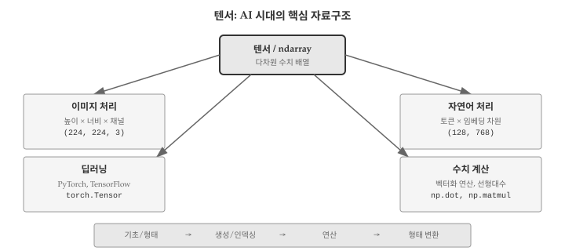
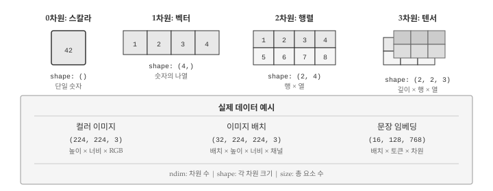
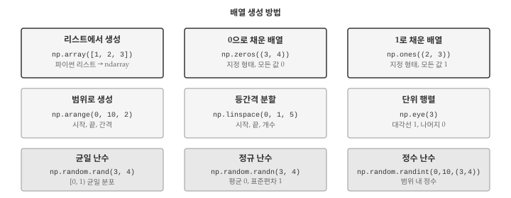
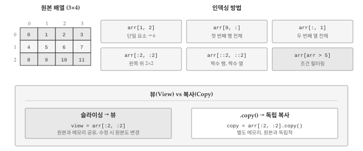
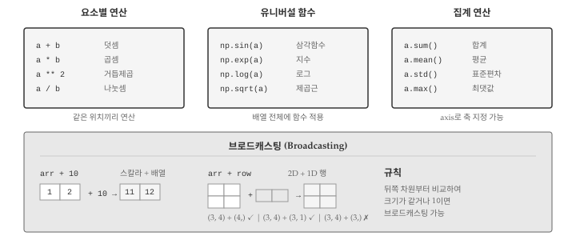

# 텐서 {#tensor}

\index{텐서} \index{ndarray}

리스트는 유연하지만 대량의 숫자 데이터를 다루기에는 느리다. 100만 개의 숫자를 더하려면 반복문이 필요하고, 행렬 곱셈은 중첩 반복문으로 구현해야 한다. 넘파이(NumPy)의 ndarray는 이러한 한계를 극복한다. C 언어로 구현된 내부 연산 덕분에 반복문 없이도 배열 전체에 연산을 적용할 수 있고, 수백 배 빠른 성능을 보인다. 텐서(Tensor)는 이러한 다차원 배열의 일반화된 개념으로, 딥러닝 프레임워크의 핵심 자료구조다. @fig-tensor-overview 는 텐서의 활용 영역과 학습 흐름을 보여준다.

{#fig-tensor-overview}

AI 시대에 텐서를 이해해야 하는 이유는 명확하다. 이미지는 3차원 텐서(높이×너비×채널)로, 동영상은 4차원 텐서(프레임×높이×너비×채널)로 표현된다. 자연어 처리에서 문장은 2차원 텐서(토큰×임베딩 차원)로 변환된다. PyTorch, TensorFlow 같은 딥러닝 프레임워크는 모두 텐서를 기본 자료구조로 사용한다. AI에게 "이 배열의 형태를 바꿔줘", "두 텐서를 곱해줘" 같은 요청을 명확히 전달하려면 텐서의 구조와 연산을 이해해야 한다.

## 텐서 기초 {#sec-tensor-basics}

\index{텐서!차원}

텐서는 숫자를 담는 다차원 컨테이너다. 0차원 텐서는 스칼라(단일 숫자), 1차원 텐서는 벡터(숫자의 나열), 2차원 텐서는 행렬(표 형태), 3차원 이상은 고차원 텐서라고 부른다. 파이썬 리스트로도 다차원 데이터를 표현할 수 있지만, 넘파이 ndarray는 모든 요소가 동일한 타입이어야 하고 크기가 고정되어 있어 훨씬 효율적이다. @fig-tensor-dimension 은 차원별 텐서의 형태를 보여준다.

{#fig-tensor-dimension}

### 차원과 형태

텐서의 **차원(dimension)** 또는 **축(axis)**은 데이터가 배열된 방향의 수를 나타낸다. **형태(shape)**는 각 차원의 크기를 튜플로 표현한다.

```{python}
import numpy as np

# 0차원: 스칼라
scalar = np.array(42)
print(f"스칼라: {scalar}, 형태: {scalar.shape}, 차원: {scalar.ndim}")

# 1차원: 벡터
vector = np.array([1, 2, 3, 4, 5])
print(f"벡터: {vector}, 형태: {vector.shape}, 차원: {vector.ndim}")

# 2차원: 행렬
matrix = np.array([[1, 2, 3], [4, 5, 6]])
print(f"행렬:\n{matrix}")
print(f"형태: {matrix.shape}, 차원: {matrix.ndim}")

# 3차원: 텐서
tensor_3d = np.array([[[1, 2], [3, 4]], [[5, 6], [7, 8]]])
print(f"3차원 텐서 형태: {tensor_3d.shape}, 차원: {tensor_3d.ndim}")
```

### 리스트와 ndarray 비교

파이썬 리스트와 넘파이 ndarray는 비슷해 보이지만 근본적으로 다르다.

| 특성 | 리스트 | ndarray |
|------|--------|---------|
| 요소 타입 | 혼합 가능 | 동일 타입 |
| 크기 | 가변 | 고정 |
| 연산 | 요소별 반복 필요 | 벡터화 연산 |
| 메모리 | 비연속적 | 연속적 |
| 속도 | 느림 | 빠름 |

```{python}
# 리스트: 요소별 반복 필요
py_list = [1, 2, 3, 4, 5]
doubled_list = [x * 2 for x in py_list]

# ndarray: 벡터화 연산
np_array = np.array([1, 2, 3, 4, 5])
doubled_array = np_array * 2

print(f"리스트 결과: {doubled_list}")
print(f"배열 결과: {doubled_array}")
```

### dtype: 데이터 타입

ndarray의 모든 요소는 동일한 데이터 타입(dtype)을 갖는다. 주요 dtype은 다음과 같다.
\index{dtype}

- `int32`, `int64`: 정수
- `float32`, `float64`: 실수
- `bool`: 불리언
- `complex64`: 복소수

```{python}
# dtype 확인 및 지정
arr_int = np.array([1, 2, 3])
arr_float = np.array([1.0, 2.0, 3.0])
arr_explicit = np.array([1, 2, 3], dtype=np.float32)

print(f"정수 배열 dtype: {arr_int.dtype}")
print(f"실수 배열 dtype: {arr_float.dtype}")
print(f"명시적 지정 dtype: {arr_explicit.dtype}")
```

## 배열 생성 {#sec-tensor-create}

\index{numpy!배열 생성}

넘파이는 다양한 방법으로 배열을 생성하는 함수를 제공한다. 상황에 맞는 함수를 선택하면 코드가 간결해진다. @fig-tensor-create 는 주요 배열 생성 방법을 보여준다.

{#fig-tensor-create}

### 리스트에서 생성

`np.array()`는 파이썬 리스트를 ndarray로 변환한다.

```{python}
# 1차원 배열
arr1d = np.array([1, 2, 3, 4, 5])

# 2차원 배열 (중첩 리스트)
arr2d = np.array([[1, 2, 3], [4, 5, 6]])

print(arr1d)
print(arr2d)
```

### 특수 배열 생성

자주 사용하는 패턴의 배열을 생성하는 함수들이 있다.

```{python}
# 0으로 채운 배열
zeros = np.zeros((2, 3))
print("zeros:\n", zeros)

# 1로 채운 배열
ones = np.ones((3, 2))
print("ones:\n", ones)

# 단위 행렬 (대각선 1)
identity = np.eye(3)
print("단위 행렬:\n", identity)

# 빈 배열 (초기화되지 않은 값)
empty = np.empty((2, 2))
print("empty:\n", empty)
```

### 범위로 생성

연속된 값이나 등간격 값을 생성하는 함수가 있다.

```{python}
# arange: 범위 내 정수 (파이썬 range와 유사)
arr_range = np.arange(0, 10, 2)  # 시작, 끝, 간격
print(f"arange: {arr_range}")

# linspace: 지정된 개수로 등분
arr_lin = np.linspace(0, 1, 5)  # 시작, 끝, 개수
print(f"linspace: {arr_lin}")

# logspace: 로그 간격으로 등분
arr_log = np.logspace(0, 2, 3)  # 10^0 ~ 10^2, 3개
print(f"logspace: {arr_log}")
```

### 난수 배열 생성

기계 학습에서 가중치 초기화나 데이터 샘플링에 난수 배열이 필요하다.
\index{numpy!random}

```{python}
# 균일 분포 [0, 1)
uniform = np.random.rand(3, 2)
print("균일 분포:\n", uniform)

# 정규 분포 (평균 0, 표준편차 1)
normal = np.random.randn(3, 2)
print("정규 분포:\n", normal)

# 정수 난수
integers = np.random.randint(0, 10, size=(2, 3))
print("정수 난수:\n", integers)

# 재현성을 위한 시드 설정
np.random.seed(42)
reproducible = np.random.rand(3)
print(f"시드 고정: {reproducible}")
```

## 인덱싱과 슬라이싱 {#sec-tensor-indexing}

\index{인덱싱} \index{슬라이싱}

다차원 배열에서 원하는 요소를 선택하는 방법을 알아야 한다. 넘파이는 파이썬 리스트의 인덱싱을 확장하여 다양한 선택 방법을 제공한다. @fig-tensor-indexing 은 주요 인덱싱 패턴을 보여준다.

{#fig-tensor-indexing}

### 기본 인덱싱

다차원 배열은 콤마로 구분된 인덱스를 사용한다.

```{python}
arr = np.array([[1, 2, 3], [4, 5, 6], [7, 8, 9]])
print("원본 배열:\n", arr)

# 단일 요소 접근 [행, 열]
print(f"arr[0, 0] = {arr[0, 0]}")  # 1
print(f"arr[1, 2] = {arr[1, 2]}")  # 6
print(f"arr[-1, -1] = {arr[-1, -1]}")  # 9 (마지막 요소)
```

### 슬라이싱

슬라이싱으로 배열의 부분을 추출한다. `[시작:끝:간격]` 형식을 사용한다.

```{python}
# 행 슬라이싱
print("첫 두 행:\n", arr[:2, :])

# 열 슬라이싱
print("두 번째 열:\n", arr[:, 1])

# 부분 배열
print("왼쪽 위 2x2:\n", arr[:2, :2])

# 간격 지정
print("짝수 열:\n", arr[:, ::2])
```

### 팬시 인덱싱

정수 배열이나 불리언 배열로 인덱싱할 수 있다.

```{python}
# 정수 배열 인덱싱
indices = [0, 2]
print(f"0, 2번 행:\n{arr[indices]}")

# 불리언 인덱싱
mask = arr > 5
print(f"5보다 큰 요소: {arr[mask]}")

# 조건부 선택
print(f"짝수 요소: {arr[arr % 2 == 0]}")
```

::: {.callout-warning}
## 뷰와 복사

슬라이싱 결과는 원본 배열의 **뷰(view)**다. 뷰를 수정하면 원본도 바뀐다. 독립적인 복사본이 필요하면 `.copy()` 메서드를 사용해야 한다.

```python
view = arr[:2, :2]     # 뷰 (원본과 메모리 공유)
copy = arr[:2, :2].copy()  # 복사본 (독립적)
```
:::

## 배열 연산 {#sec-tensor-operations}

\index{벡터화}

넘파이의 핵심 장점은 벡터화 연산이다. 반복문 없이 배열 전체에 연산을 적용할 수 있어 코드가 간결하고 빠르다. @fig-tensor-operations 는 주요 연산 종류를 보여준다.

{#fig-tensor-operations}

### 요소별 연산

산술 연산자는 요소별(element-wise)로 적용된다.

```{python}
a = np.array([1, 2, 3, 4])
b = np.array([10, 20, 30, 40])

print(f"덧셈: {a + b}")
print(f"곱셈: {a * b}")
print(f"거듭제곱: {a ** 2}")
print(f"나눗셈: {b / a}")
```

### 유니버설 함수

넘파이는 수학 함수를 배열 전체에 적용하는 유니버설 함수(ufunc)를 제공한다.
\index{ufunc}

```{python}
arr = np.array([0, np.pi/4, np.pi/2, np.pi])

print(f"sin: {np.sin(arr)}")
print(f"exp: {np.exp(np.array([0, 1, 2]))}")
print(f"log: {np.log(np.array([1, np.e, np.e**2]))}")
print(f"sqrt: {np.sqrt(np.array([1, 4, 9, 16]))}")
```

### 집계 연산

배열 전체 또는 특정 축을 따라 집계 연산을 수행한다.

```{python}
arr = np.array([[1, 2, 3], [4, 5, 6]])

print(f"전체 합: {arr.sum()}")
print(f"행별 합 (axis=1): {arr.sum(axis=1)}")
print(f"열별 합 (axis=0): {arr.sum(axis=0)}")

print(f"평균: {arr.mean()}")
print(f"표준편차: {arr.std()}")
print(f"최댓값: {arr.max()}, 최솟값: {arr.min()}")
```

### 브로드캐스팅

형태가 다른 배열 간의 연산에서 넘파이는 자동으로 형태를 맞춘다. 이를 **브로드캐스팅(broadcasting)**이라 한다.
\index{브로드캐스팅}

```{python}
# 스칼라와 배열
arr = np.array([[1, 2, 3], [4, 5, 6]])
print("배열 + 10:\n", arr + 10)

# 1차원 배열과 2차원 배열
row = np.array([1, 0, 1])
print("행 벡터 더하기:\n", arr + row)

col = np.array([[10], [20]])
print("열 벡터 더하기:\n", arr + col)
```

::: {.callout-note}
## 브로드캐스팅 규칙

두 배열의 형태가 다를 때, 뒤쪽 차원부터 비교하여:
1. 차원 크기가 같거나
2. 한쪽이 1이면

브로드캐스팅이 가능하다. 크기가 1인 차원은 다른 배열에 맞게 확장된다.
:::

## 형태 변환 {#sec-tensor-reshape}

\index{reshape}

텐서의 형태를 바꾸는 것은 딥러닝에서 매우 흔한 작업이다. 데이터를 모델에 입력하기 전에 적절한 형태로 변환해야 한다.

### reshape

`reshape()`은 데이터를 유지하면서 형태만 바꾼다. 새 형태의 총 요소 수가 원본과 같아야 한다.

```{python}
arr = np.arange(12)
print(f"원본: {arr}, 형태: {arr.shape}")

# 2x6으로 변형
reshaped = arr.reshape(2, 6)
print(f"2x6:\n{reshaped}")

# 3x4로 변형
reshaped = arr.reshape(3, 4)
print(f"3x4:\n{reshaped}")

# -1은 자동 계산
reshaped = arr.reshape(3, -1)  # 3행, 열은 자동 계산
print(f"3x?:\n{reshaped}")
```

### 전치와 축 교환

행렬의 행과 열을 바꾸는 전치(transpose)와 다차원 배열의 축을 교환하는 연산이다.

```{python}
arr = np.array([[1, 2, 3], [4, 5, 6]])
print(f"원본 형태: {arr.shape}\n{arr}")

# 전치
transposed = arr.T
print(f"전치 형태: {transposed.shape}\n{transposed}")

# 3차원 배열 축 교환
arr3d = np.arange(24).reshape(2, 3, 4)
print(f"원본 3D 형태: {arr3d.shape}")

swapped = arr3d.transpose(0, 2, 1)  # 축 순서 변경
print(f"축 교환 후 형태: {swapped.shape}")
```

### 차원 추가와 제거

차원을 추가하거나 크기가 1인 차원을 제거한다.

```{python}
arr = np.array([1, 2, 3])
print(f"원본: {arr.shape}")

# 차원 추가
expanded = arr[np.newaxis, :]  # 행 벡터로
print(f"행 벡터: {expanded.shape}")

expanded = arr[:, np.newaxis]  # 열 벡터로
print(f"열 벡터: {expanded.shape}")

# 차원 제거
squeezed = np.squeeze(expanded)
print(f"squeeze 후: {squeezed.shape}")
```

## 디버깅 {#sec-tensor-debug}

\index{디버깅}

텐서 연산에서 자주 발생하는 오류와 해결 방법을 알아본다.

### ValueError: 형태 불일치

형태가 맞지 않는 배열 간 연산 시 발생한다.

```{python}
#| error: true
a = np.array([[1, 2], [3, 4]])  # 2x2
b = np.array([1, 2, 3])  # 3

try:
    result = a + b
except ValueError as e:
    print(f"오류: {e}")

# 해결: 형태 확인 후 맞추기
print(f"a 형태: {a.shape}, b 형태: {b.shape}")
b_fixed = np.array([1, 2])  # 2
print(f"수정 후: {a + b_fixed}")
```

### reshape 오류

총 요소 수가 맞지 않으면 reshape이 실패한다.

```{python}
#| error: true
arr = np.arange(12)

try:
    reshaped = arr.reshape(5, 3)  # 5*3=15 ≠ 12
except ValueError as e:
    print(f"오류: {e}")

# 해결: 요소 수 확인
print(f"요소 수: {arr.size}")
print(f"가능한 형태: 3x4, 4x3, 2x6, 6x2, 1x12, 12x1")
```

### dtype 관련 오류

정수 배열에 실수를 대입하면 잘림이 발생한다.

```{python}
arr = np.array([1, 2, 3], dtype=np.int64)
arr[0] = 1.9  # 1로 잘림!
print(f"잘림 발생: {arr}")

# 해결: 적절한 dtype 사용
arr_float = np.array([1, 2, 3], dtype=np.float64)
arr_float[0] = 1.9
print(f"실수 유지: {arr_float}")
```

### 디버깅 전략

텐서 작업에서 문제가 발생하면 체계적으로 점검한다.

```{python}
def debug_tensor(arr, name="tensor"):
    """텐서 디버깅 정보 출력"""
    print(f"--- {name} ---")
    print(f"  형태: {arr.shape}")
    print(f"  차원: {arr.ndim}")
    print(f"  dtype: {arr.dtype}")
    print(f"  요소 수: {arr.size}")
    print(f"  최솟값: {arr.min():.4f}, 최댓값: {arr.max():.4f}")
    print(f"  평균: {arr.mean():.4f}, 표준편차: {arr.std():.4f}")

# 사용 예
sample = np.random.randn(3, 4)
debug_tensor(sample, "샘플 텐서")
```

## AI와 함께하는 텐서 처리 {#sec-tensor-ai}

텐서 연산이 복잡해질수록 AI의 도움이 유용하다. 핵심은 배열의 형태와 원하는 결과를 명확히 설명하는 것이다. "shape가 (3, 4)인 배열을 (4, 3)으로 전치해줘"처럼 구체적인 형태 정보를 제공하면 정확한 코드를 얻는다.

형태 변환이나 브로드캐스팅이 필요한 복잡한 연산에서 AI가 특히 도움이 된다. "batch_size × height × width × channels 형태의 이미지 배열을 channels-first 형태로 바꿔줘"처럼 요청하면 적절한 transpose나 reshape 코드를 제시받을 수 있다. 딥러닝 코드에서 자주 나오는 이러한 형태 변환은 처음에는 혼란스럽지만 AI 도움으로 패턴을 익힐 수 있다.

AI가 생성한 텐서 코드도 검증이 필요하다. 작은 크기의 테스트 배열로 먼저 실행하고, 결과 shape가 예상과 맞는지 확인한다. 특히 브로드캐스팅이 의도대로 작동하는지, reshape 후 데이터 순서가 올바른지 점검한다. `debug_tensor()` 같은 헬퍼 함수를 만들어 중간 결과를 확인하는 습관이 도움이 된다.

::: {.content-visible when-format="pdf"}
## 생각해볼 점 {.unnumbered}
:::

::: {.content-visible when-format="html"}
## 💡 생각해볼 점 {.unnumbered}
:::

텐서는 현대 AI의 기초 자료구조다. 이미지, 텍스트, 음성 데이터가 모두 텐서로 표현되고, 신경망의 모든 계산이 텐서 연산으로 수행된다. 넘파이 ndarray의 기본 개념을 익히면 PyTorch, TensorFlow 같은 딥러닝 프레임워크로 자연스럽게 확장할 수 있다.

형태(shape)를 항상 의식하는 습관이 중요하다. 텐서 연산 오류의 대부분은 형태 불일치에서 비롯된다. 연산 전에 `.shape`로 형태를 확인하고, 결과의 형태가 예상과 맞는지 검증한다. 브로드캐스팅 규칙을 이해하면 명시적인 형태 맞춤 없이도 효율적인 코드를 작성할 수 있다.

벡터화 사고방식을 익히면 코드가 간결하고 빨라진다. 반복문으로 요소를 하나씩 처리하는 대신, 배열 전체에 연산을 적용하는 방식을 먼저 고려한다. 넘파이의 유니버설 함수와 집계 함수를 활용하면 대부분의 수치 연산을 반복문 없이 표현할 수 있다.

다음 장에서는 정규표현식을 배운다. 텐서로 수치 데이터를 다루는 법을 익혔다면, 정규표현식으로 텍스트에서 패턴을 찾고 추출하는 방법을 배울 차례다.
