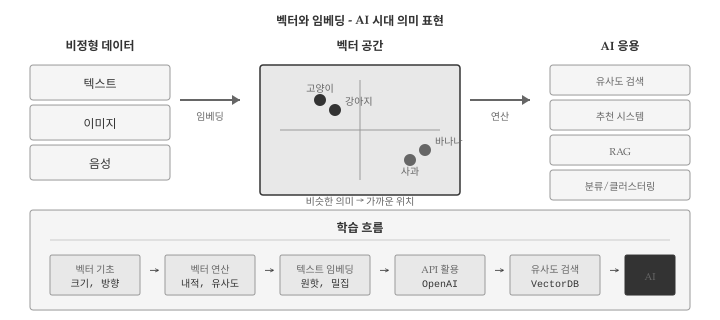
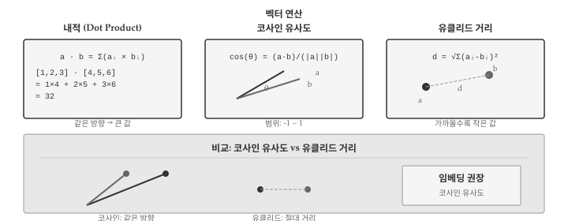
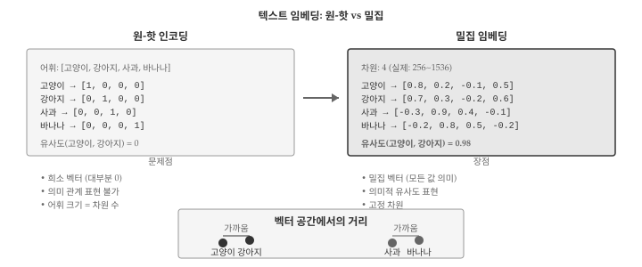
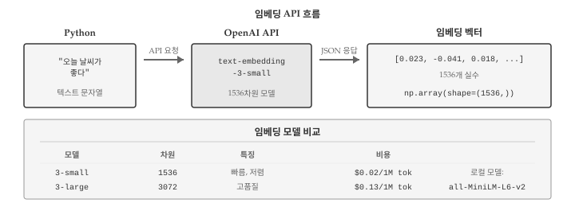
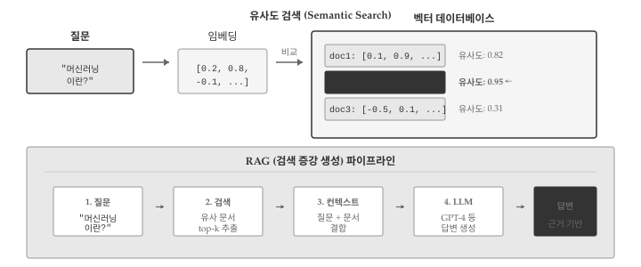

# 벡터와 임베딩 {#embedding}

```{python}
#| echo: false
import numpy as np
from numpy.linalg import norm
```

{#fig-embedding-overview}

AI 시대에 텍스트, 이미지, 음성 등 비정형 데이터를 컴퓨터가 이해하려면 숫자로 변환해야 한다. 임베딩(Embedding)\index{임베딩}은 이러한 데이터를 고정 길이의 숫자 벡터로 표현하는 기술이다. "고양이"와 "강아지"는 문자열로는 전혀 다르지만, 임베딩 공간에서는 가까운 위치에 놓인다.

챗GPT, 검색 엔진, 추천 시스템 모두 임베딩을 핵심 기술로 사용한다. 텍스트를 벡터로 변환하면 의미적 유사도를 계산할 수 있고, 이를 통해 "비슷한 문서 찾기", "질문에 맞는 답변 검색" 같은 작업이 가능해진다. 이 장에서는 벡터의 기초 개념부터 실제 임베딩 활용까지 다룬다.

## 벡터 기초 {#sec-embedding-vector}

벡터(Vector)\index{벡터}는 크기와 방향을 가진 수학적 객체다. 프로그래밍에서 벡터는 숫자의 순서 있는 나열, 즉 1차원 배열로 표현한다.

```{python}
# 3차원 벡터
v = np.array([1, 2, 3])
print(f"벡터: {v}")
print(f"차원: {len(v)}")
```

### 벡터의 크기 {#sec-embedding-magnitude}

벡터의 크기(Magnitude)\index{벡터!크기}는 원점에서 해당 점까지의 거리다. 유클리드 노름(Euclidean Norm)이라고도 한다.

```{python}
v = np.array([3, 4])

# 수동 계산: sqrt(3^2 + 4^2)
magnitude_manual = np.sqrt(np.sum(v ** 2))
print(f"수동 계산: {magnitude_manual}")

# NumPy 함수 사용
magnitude_np = norm(v)
print(f"norm() 사용: {magnitude_np}")
```

### 단위 벡터 {#sec-embedding-unit}

단위 벡터(Unit Vector)\index{단위 벡터}는 크기가 1인 벡터다. 방향만 나타내며, 원본 벡터를 크기로 나누어 구한다. 이 과정을 정규화(Normalization)\index{정규화}라고 한다.

```{python}
v = np.array([3, 4])

# 정규화: 벡터를 크기로 나눔
unit_v = v / norm(v)
print(f"단위 벡터: {unit_v}")
print(f"크기 확인: {norm(unit_v):.10f}")  # 1.0
```

## 벡터 연산 {#sec-embedding-operations}

{#fig-embedding-operations}

벡터 연산은 임베딩 활용의 핵심이다. 두 벡터 사이의 관계를 측정하는 다양한 방법이 있다.

### 내적 {#sec-embedding-dot}

내적(Dot Product)\index{내적}은 두 벡터의 대응 요소를 곱한 후 합산한 값이다. 두 벡터가 같은 방향을 가리킬수록 내적 값이 크다.

```{python}
a = np.array([1, 2, 3])
b = np.array([4, 5, 6])

# 내적 계산
dot_manual = np.sum(a * b)  # 1*4 + 2*5 + 3*6
dot_np = np.dot(a, b)

print(f"수동 계산: {dot_manual}")
print(f"np.dot(): {dot_np}")
```

### 코사인 유사도 {#sec-embedding-cosine}

코사인 유사도(Cosine Similarity)\index{코사인 유사도}는 두 벡터 사이 각도의 코사인 값이다. -1에서 1 사이 값을 가지며, 1에 가까울수록 유사하다.

```{python}
def cosine_similarity(a, b):
    """두 벡터의 코사인 유사도 계산"""
    return np.dot(a, b) / (norm(a) * norm(b))

# 같은 방향
v1 = np.array([1, 0])
v2 = np.array([1, 0])
print(f"같은 방향: {cosine_similarity(v1, v2):.2f}")

# 직각 (90도)
v3 = np.array([0, 1])
print(f"직각: {cosine_similarity(v1, v3):.2f}")

# 반대 방향
v4 = np.array([-1, 0])
print(f"반대 방향: {cosine_similarity(v1, v4):.2f}")
```

### 유클리드 거리 {#sec-embedding-euclidean}

유클리드 거리(Euclidean Distance)\index{유클리드 거리}는 두 점 사이의 직선 거리다. 값이 작을수록 가깝다.

```{python}
def euclidean_distance(a, b):
    """두 벡터 사이의 유클리드 거리"""
    return norm(a - b)

p1 = np.array([0, 0])
p2 = np.array([3, 4])

distance = euclidean_distance(p1, p2)
print(f"거리: {distance}")
```

::: {.callout-note}
## 코사인 유사도 vs 유클리드 거리

- **코사인 유사도**: 방향만 비교, 크기 무시. 문서 길이가 달라도 주제가 같으면 유사
- **유클리드 거리**: 절대적 위치 비교. 크기 차이도 거리에 반영

임베딩에서는 보통 **코사인 유사도**를 사용한다. 벡터의 방향(의미)이 중요하기 때문이다.
:::

## 텍스트 임베딩 {#sec-embedding-text}

{#fig-embedding-text}

텍스트 임베딩(Text Embedding)\index{텍스트 임베딩}은 단어나 문장을 고정 길이 벡터로 변환한다. 의미가 비슷한 텍스트는 벡터 공간에서 가까운 위치에 놓인다.

### 원-핫 인코딩의 한계 {#sec-embedding-onehot}

가장 단순한 방법은 원-핫 인코딩(One-Hot Encoding)\index{원-핫 인코딩}이다. 각 단어에 고유 인덱스를 부여하고, 해당 위치만 1인 벡터를 만든다.

```{python}
# 어휘 사전
vocab = ["고양이", "강아지", "사과", "바나나"]

# 원-핫 인코딩
def one_hot(word, vocab):
    vector = np.zeros(len(vocab))
    if word in vocab:
        vector[vocab.index(word)] = 1
    return vector

cat = one_hot("고양이", vocab)
dog = one_hot("강아지", vocab)

print(f"고양이: {cat}")
print(f"강아지: {dog}")
print(f"유사도: {cosine_similarity(cat, dog):.2f}")  # 0!
```

원-핫 인코딩의 문제점:
- **희소성**: 대부분 0인 거대한 벡터
- **의미 무시**: "고양이"와 "강아지"의 유사도가 0

### 밀집 임베딩 {#sec-embedding-dense}

밀집 임베딩(Dense Embedding)\index{밀집 임베딩}은 적은 차원(256~1536)에 의미 정보를 압축한다. 신경망 학습을 통해 비슷한 의미의 단어가 가까운 벡터를 갖도록 훈련한다.

```{python}
# 가상의 밀집 임베딩 (실제로는 신경망이 학습)
embeddings = {
    "고양이": np.array([0.8, 0.2, -0.1, 0.5]),
    "강아지": np.array([0.7, 0.3, -0.2, 0.6]),
    "사과":   np.array([-0.3, 0.9, 0.4, -0.1]),
    "바나나": np.array([-0.2, 0.8, 0.5, -0.2]),
}

# 의미적 유사도 계산
cat_dog = cosine_similarity(embeddings["고양이"], embeddings["강아지"])
cat_apple = cosine_similarity(embeddings["고양이"], embeddings["사과"])
apple_banana = cosine_similarity(embeddings["사과"], embeddings["바나나"])

print(f"고양이-강아지: {cat_dog:.3f}")
print(f"고양이-사과: {cat_apple:.3f}")
print(f"사과-바나나: {apple_banana:.3f}")
```

## 임베딩 API 활용 {#sec-embedding-api}

{#fig-embedding-api}

실제 임베딩은 대규모 데이터로 훈련된 모델을 사용한다. OpenAI, Hugging Face 등에서 API를 제공한다.

### OpenAI 임베딩 {#sec-embedding-openai}

OpenAI의 `text-embedding-3-small` 모델은 1536차원 벡터를 반환한다.

```{python}
#| eval: false
from openai import OpenAI

client = OpenAI()

def get_embedding(text):
    """텍스트를 임베딩 벡터로 변환"""
    response = client.embeddings.create(
        model="text-embedding-3-small",
        input=text
    )
    return np.array(response.data[0].embedding)

# 문장 임베딩
sentences = [
    "오늘 날씨가 좋다",
    "오늘 기분이 좋다",
    "파이썬 프로그래밍을 배운다"
]

embeddings = [get_embedding(s) for s in sentences]

# 유사도 비교
print(f"날씨-기분: {cosine_similarity(embeddings[0], embeddings[1]):.3f}")
print(f"날씨-파이썬: {cosine_similarity(embeddings[0], embeddings[2]):.3f}")
```

::: {.callout-warning}
## API 비용

OpenAI 임베딩 API는 토큰당 비용이 발생한다. `text-embedding-3-small`은 100만 토큰당 약 $0.02로 저렴하지만, 대량 처리 시 비용을 고려해야 한다.
:::

### 로컬 임베딩 {#sec-embedding-local}

API 호출 없이 로컬에서 임베딩을 생성할 수도 있다. `sentence-transformers` 라이브러리를 사용한다.

```{python}
#| eval: false
from sentence_transformers import SentenceTransformer

# 모델 로드 (첫 실행 시 다운로드)
model = SentenceTransformer('all-MiniLM-L6-v2')

# 문장 임베딩
sentences = ["고양이가 소파에 앉아 있다", "개가 마당에서 뛰어놀고 있다"]
embeddings = model.encode(sentences)

print(f"차원: {embeddings.shape}")
print(f"유사도: {cosine_similarity(embeddings[0], embeddings[1]):.3f}")
```

## 유사도 검색 {#sec-embedding-search}

{#fig-embedding-search}

임베딩의 핵심 활용은 유사도 검색(Similarity Search)\index{유사도 검색}이다. 질문과 가장 유사한 문서를 찾는 방식으로, RAG(검색 증강 생성)의 기반 기술이다.

### 단순 검색 구현 {#sec-embedding-simple-search}

```{python}
# 문서 데이터베이스 (가상 임베딩)
np.random.seed(42)
documents = [
    "파이썬은 배우기 쉬운 프로그래밍 언어다",
    "머신러닝은 데이터에서 패턴을 학습한다",
    "딥러닝은 신경망을 사용한 머신러닝이다",
    "자연어 처리는 텍스트를 분석한다",
    "컴퓨터 비전은 이미지를 분석한다",
]

# 가상 임베딩 생성 (실제로는 API 사용)
doc_embeddings = np.random.randn(len(documents), 128)
# 정규화
doc_embeddings = doc_embeddings / norm(doc_embeddings, axis=1, keepdims=True)

def search(query_embedding, doc_embeddings, documents, top_k=3):
    """가장 유사한 문서 검색"""
    # 모든 문서와 유사도 계산
    similarities = np.dot(doc_embeddings, query_embedding)

    # 상위 k개 인덱스
    top_indices = np.argsort(similarities)[::-1][:top_k]

    results = []
    for idx in top_indices:
        results.append({
            "document": documents[idx],
            "similarity": similarities[idx]
        })
    return results

# 검색 예시 (가상 쿼리 임베딩)
query_embedding = doc_embeddings[1] + np.random.randn(128) * 0.1
query_embedding = query_embedding / norm(query_embedding)

results = search(query_embedding, doc_embeddings, documents)
for i, r in enumerate(results, 1):
    print(f"{i}. [{r['similarity']:.3f}] {r['document']}")
```

### 벡터 데이터베이스 {#sec-embedding-vectordb}

대규모 데이터에서는 벡터 데이터베이스(Vector Database)\index{벡터 데이터베이스}를 사용한다. 효율적인 근사 최근접 이웃(ANN) 알고리즘으로 빠른 검색을 지원한다.

```{python}
#| eval: false
import chromadb

# 클라이언트 생성
client = chromadb.Client()

# 컬렉션 생성
collection = client.create_collection("documents")

# 문서 추가
collection.add(
    documents=["파이썬 기초", "머신러닝 입문", "딥러닝 실전"],
    ids=["doc1", "doc2", "doc3"]
)

# 검색
results = collection.query(
    query_texts=["인공지능 학습"],
    n_results=2
)
print(results)
```

주요 벡터 데이터베이스:
- **Chroma**: 경량, 로컬 개발용
- **Pinecone**: 클라우드 기반, 확장성
- **FAISS**: Meta 개발, 고성능
- **Weaviate**: 오픈소스, 다양한 기능

## 디버깅 {#sec-embedding-debug}

### 차원 불일치 {#sec-embedding-dim-mismatch}

두 임베딩의 차원이 다르면 유사도 계산이 불가능하다.

```{python}
#| error: true
v1 = np.array([1, 2, 3])      # 3차원
v2 = np.array([1, 2, 3, 4])   # 4차원

try:
    similarity = cosine_similarity(v1, v2)
except ValueError as e:
    print(f"오류: {e}")
```

**해결책**: 동일한 임베딩 모델 사용 확인

```{python}
def safe_cosine_similarity(a, b):
    """차원 확인 후 유사도 계산"""
    if len(a) != len(b):
        raise ValueError(f"차원 불일치: {len(a)} vs {len(b)}")
    return cosine_similarity(a, b)
```

### 정규화 누락 {#sec-embedding-normalize}

코사인 유사도는 정규화 여부와 무관하지만, 내적을 직접 사용할 때는 정규화가 필요하다.

```{python}
# 정규화되지 않은 벡터
v1 = np.array([1, 0])
v2 = np.array([100, 0])  # 같은 방향, 크기만 다름

# 내적은 크기에 영향받음
print(f"내적: {np.dot(v1, v2)}")

# 코사인 유사도는 방향만 비교
print(f"코사인 유사도: {cosine_similarity(v1, v2):.2f}")
```

### 디버깅 헬퍼 함수 {#sec-embedding-debug-helper}

```{python}
def debug_embedding(embedding, name="embedding"):
    """임베딩 벡터 진단"""
    print(f"=== {name} 진단 ===")
    print(f"타입: {type(embedding)}")
    print(f"dtype: {embedding.dtype}")
    print(f"차원: {embedding.shape}")
    print(f"크기(norm): {norm(embedding):.4f}")
    print(f"범위: [{embedding.min():.4f}, {embedding.max():.4f}]")
    print(f"NaN 포함: {np.isnan(embedding).any()}")
    print(f"Inf 포함: {np.isinf(embedding).any()}")

# 사용 예
test_emb = np.random.randn(384)
debug_embedding(test_emb, "테스트 임베딩")
```

::: {.callout-warning}
## NaN과 Inf 주의

임베딩에 NaN이나 Inf가 포함되면 모든 유사도 계산이 실패한다. API 응답이나 파일 로드 후 반드시 확인한다.
:::

## AI와 함께하는 임베딩 {#sec-embedding-ai}

임베딩은 AI 활용의 핵심이지만, 개념이 추상적이어서 학습이 어려울 수 있다. AI 어시스턴트를 활용하면 효과적으로 학습할 수 있다.

**개념 이해 질문**:
- "코사인 유사도와 유클리드 거리의 차이를 시각적으로 설명해줘"
- "왜 텍스트 임베딩에서 코사인 유사도를 더 많이 사용하나요?"
- "차원의 저주가 임베딩에 미치는 영향을 설명해줘"

**코드 작성 요청**:
- "OpenAI API로 문장 유사도를 비교하는 코드 작성해줘"
- "ChromaDB에 문서를 저장하고 검색하는 예제 만들어줘"
- "배치로 임베딩을 생성하는 효율적인 코드 작성해줘"

**디버깅 도움**:
- "임베딩 유사도가 모두 0으로 나오는데 원인이 뭘까요?"
- "벡터 데이터베이스 검색 결과가 이상해요. 무엇을 확인해야 하나요?"

임베딩을 이해하면 RAG, 시맨틱 검색, 추천 시스템 등 AI 응용 분야로 확장할 수 있다.

## 💡 생각해볼 점 {.unnumbered}

임베딩은 비정형 데이터를 수치화하는 혁명적인 기술이다. 텍스트, 이미지, 음성 등 다양한 데이터를 동일한 벡터 공간에서 비교할 수 있게 해준다. 이 장에서 다룬 벡터 연산과 유사도 계산은 모든 임베딩 응용의 기초가 된다.

실무에서 임베딩을 활용할 때는 모델 선택이 중요하다. OpenAI `text-embedding-3-small`은 범용적으로 우수하지만, 한국어 특화 모델(KoSBERT 등)이 더 나은 결과를 보일 수 있다. 또한 임베딩 차원이 클수록 표현력이 높지만, 저장 공간과 계산 비용도 증가한다.

벡터 데이터베이스는 대규모 임베딩 검색의 핵심 인프라다. 수백만 개의 문서에서 밀리초 단위로 유사 문서를 찾으려면 단순 반복이 아닌 ANN(Approximate Nearest Neighbor) 알고리즘이 필요하다. Chroma, Pinecone, FAISS 같은 도구들이 이 문제를 해결한다.

다음 장에서 다룰 주제들과 임베딩은 깊이 연결된다. JSON으로 저장된 데이터를 임베딩하고, 텐서 연산으로 유사도를 계산하며, 데이터프레임으로 결과를 분석한다. 자료구조들은 개별적으로 존재하는 것이 아니라, 실제 AI 파이프라인에서 유기적으로 결합된다.
