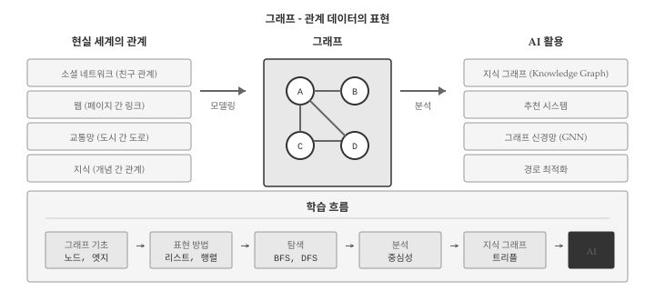
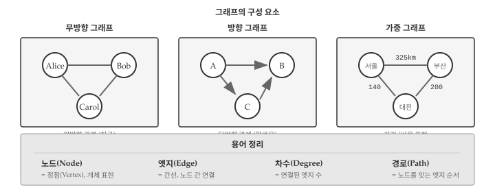
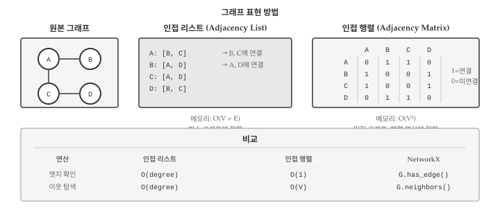
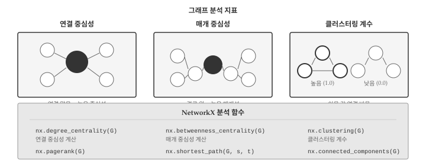
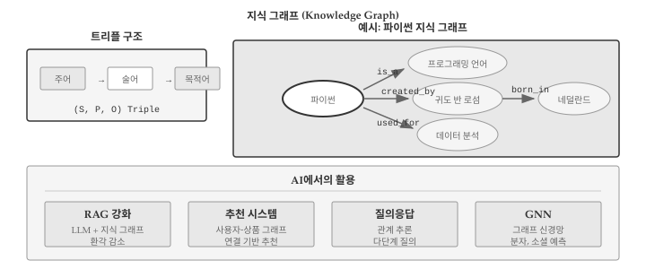

# 그래프 {#graph}

```{python}
#| echo: false
import networkx as nx
```

{#fig-graph-overview}

세상의 많은 정보는 관계로 이루어져 있다. 친구 관계, 웹 페이지 링크, 도시 간 도로, 단어 사이 연관성 모두 "무엇이 무엇과 연결되어 있는가"라는 관계 정보다. 그래프(Graph)\index{그래프}는 이러한 관계 데이터를 표현하는 자료구조로, 노드(Node)와 엣지(Edge)로 구성된다.

AI 시대에 그래프의 중요성은 더욱 커지고 있다. 지식 그래프(Knowledge Graph)는 ChatGPT 같은 LLM의 환각(hallucination)을 줄이는 핵심 기술이고, 그래프 신경망(GNN)은 분자 구조 예측, 추천 시스템 등에서 혁신적인 성과를 내고 있다. 이 장에서는 그래프의 기초 개념과 Python NetworkX 라이브러리 활용법을 다룬다.

## 그래프 기초 {#sec-graph-basics}

{#fig-graph-structure}

그래프는 두 가지 요소로 구성된다:

- **노드(Node)** 또는 **정점(Vertex)**: 개체를 나타냄 (사람, 웹페이지, 도시)
- **엣지(Edge)** 또는 **간선**: 노드 간 연결 관계

```{python}
import networkx as nx

# 빈 그래프 생성
G = nx.Graph()

# 노드 추가
G.add_node("Alice")
G.add_node("Bob")
G.add_node("Charlie")

# 엣지 추가 (관계 연결)
G.add_edge("Alice", "Bob")
G.add_edge("Bob", "Charlie")

print(f"노드: {list(G.nodes())}")
print(f"엣지: {list(G.edges())}")
```

### 방향 그래프와 무방향 그래프 {#sec-graph-directed}

그래프는 엣지의 방향 유무에 따라 두 종류로 나뉜다:

```{python}
# 무방향 그래프: 양방향 관계
undirected = nx.Graph()
undirected.add_edge("A", "B")  # A-B 친구 관계

# 방향 그래프: 단방향 관계
directed = nx.DiGraph()
directed.add_edge("A", "B")  # A가 B를 팔로우

print(f"무방향: A→B 존재? {undirected.has_edge('A', 'B')}, B→A 존재? {undirected.has_edge('B', 'A')}")
print(f"방향: A→B 존재? {directed.has_edge('A', 'B')}, B→A 존재? {directed.has_edge('B', 'A')}")
```

### 가중 그래프 {#sec-graph-weighted}

엣지에 가중치(Weight)\index{가중치}를 부여하면 관계의 강도나 비용을 표현할 수 있다.

```{python}
# 가중 그래프: 도시 간 거리
cities = nx.Graph()
cities.add_edge("서울", "부산", weight=325)
cities.add_edge("서울", "대전", weight=140)
cities.add_edge("대전", "부산", weight=200)

# 가중치 확인
for u, v, data in cities.edges(data=True):
    print(f"{u} - {v}: {data['weight']}km")
```

## 그래프 표현 방법 {#sec-graph-representation}

{#fig-graph-representation}

그래프를 컴퓨터 메모리에 저장하는 방법은 크게 두 가지다.

### 인접 리스트 {#sec-graph-adjacency-list}

인접 리스트(Adjacency List)\index{인접 리스트}는 각 노드가 연결된 이웃 노드들의 목록을 저장한다. 메모리 효율적이며 NetworkX의 기본 방식이다.

```{python}
# NetworkX는 내부적으로 인접 리스트(딕셔너리) 사용
G = nx.Graph()
G.add_edges_from([("A", "B"), ("A", "C"), ("B", "C"), ("C", "D")])

# 인접 리스트 형태로 출력
for node in G.nodes():
    neighbors = list(G.neighbors(node))
    print(f"{node}: {neighbors}")
```

### 인접 행렬 {#sec-graph-adjacency-matrix}

인접 행렬(Adjacency Matrix)\index{인접 행렬}은 노드 간 연결을 2차원 배열로 표현한다. 행렬 연산에 유리하지만 메모리 사용량이 크다.

```{python}
import numpy as np

# 인접 행렬 변환
adj_matrix = nx.to_numpy_array(G)
nodes = list(G.nodes())

print(f"노드 순서: {nodes}")
print("인접 행렬:")
print(adj_matrix.astype(int))
```

::: {.callout-note}
## 인접 리스트 vs 인접 행렬

| 특성 | 인접 리스트 | 인접 행렬 |
|------|-------------|-----------|
| 메모리 | O(V + E) | O(V²) |
| 엣지 확인 | O(degree) | O(1) |
| 이웃 탐색 | O(degree) | O(V) |
| 적합한 경우 | 희소 그래프 | 밀집 그래프, 행렬 연산 |

V: 노드 수, E: 엣지 수, degree: 노드의 연결 수
:::

## 그래프 탐색 {#sec-graph-traversal}

그래프에서 모든 노드를 방문하는 두 가지 기본 알고리즘이 있다.

### 너비 우선 탐색 (BFS) {#sec-graph-bfs}

너비 우선 탐색(Breadth-First Search)\index{너비 우선 탐색}은 시작 노드에서 가까운 노드부터 차례로 방문한다. 최단 경로 찾기에 유용하다.

```{python}
G = nx.Graph()
G.add_edges_from([
    ("A", "B"), ("A", "C"),
    ("B", "D"), ("B", "E"),
    ("C", "F"), ("D", "G")
])

# BFS 순회
bfs_order = list(nx.bfs_edges(G, source="A"))
print(f"BFS 탐색 순서: {bfs_order}")

# 최단 경로
path = nx.shortest_path(G, source="A", target="G")
print(f"A→G 최단 경로: {path}")
```

### 깊이 우선 탐색 (DFS) {#sec-graph-dfs}

깊이 우선 탐색(Depth-First Search)\index{깊이 우선 탐색}은 한 방향으로 끝까지 탐색한 후 되돌아온다. 경로 탐색, 사이클 검출에 활용한다.

```{python}
# DFS 순회
dfs_order = list(nx.dfs_edges(G, source="A"))
print(f"DFS 탐색 순서: {dfs_order}")

# 연결 요소 찾기
components = list(nx.connected_components(G))
print(f"연결 요소: {components}")
```

## 그래프 분석 {#sec-graph-analysis}

{#fig-graph-metrics}

그래프 분석을 통해 네트워크의 구조적 특성을 파악할 수 있다.

### 차수 {#sec-graph-degree}

차수(Degree)\index{차수}는 노드에 연결된 엣지의 수로, 해당 노드의 중요도를 나타낸다.

```{python}
# 소셜 네트워크 예시
social = nx.Graph()
social.add_edges_from([
    ("Alice", "Bob"), ("Alice", "Charlie"), ("Alice", "David"),
    ("Bob", "Charlie"), ("Charlie", "Eve"), ("David", "Eve")
])

# 각 노드의 차수
for node, degree in social.degree():
    print(f"{node}: 친구 {degree}명")
```

### 중심성 {#sec-graph-centrality}

중심성(Centrality)\index{중심성}은 네트워크에서 노드의 중요도를 측정하는 지표다.

```{python}
# 연결 중심성: 연결이 많을수록 중요
degree_cent = nx.degree_centrality(social)
print("연결 중심성:")
for node, cent in sorted(degree_cent.items(), key=lambda x: -x[1]):
    print(f"  {node}: {cent:.3f}")

# 매개 중심성: 다른 노드 사이 경로에 많이 포함될수록 중요
between_cent = nx.betweenness_centrality(social)
print("\n매개 중심성:")
for node, cent in sorted(between_cent.items(), key=lambda x: -x[1]):
    print(f"  {node}: {cent:.3f}")
```

### 클러스터링 계수 {#sec-graph-clustering}

클러스터링 계수(Clustering Coefficient)\index{클러스터링 계수}는 노드의 이웃들이 서로 얼마나 연결되어 있는지를 나타낸다. "친구의 친구도 친구인가?"를 측정한다.

```{python}
# 각 노드의 클러스터링 계수
clustering = nx.clustering(social)
for node, coef in clustering.items():
    print(f"{node}: {coef:.3f}")

# 전체 그래프의 평균 클러스터링 계수
avg_clustering = nx.average_clustering(social)
print(f"\n평균 클러스터링 계수: {avg_clustering:.3f}")
```

## 지식 그래프 {#sec-graph-knowledge}

{#fig-graph-knowledge}

지식 그래프(Knowledge Graph)\index{지식 그래프}는 현실 세계의 지식을 그래프로 표현한다. 주어-술어-목적어(Subject-Predicate-Object) 트리플 형태로 저장하며, AI 시스템의 지식 기반으로 활용된다.

### 트리플 표현 {#sec-graph-triple}

```{python}
# 지식 그래프 생성 (방향 그래프)
kg = nx.DiGraph()

# 트리플 추가: (주어, 술어, 목적어)
triples = [
    ("파이썬", "is_a", "프로그래밍 언어"),
    ("파이썬", "created_by", "귀도 반 로섬"),
    ("귀도 반 로섬", "born_in", "네덜란드"),
    ("파이썬", "used_for", "데이터 분석"),
    ("파이썬", "used_for", "웹 개발"),
    ("판다스", "is_a", "파이썬 라이브러리"),
    ("판다스", "used_for", "데이터 분석"),
]

for subj, pred, obj in triples:
    kg.add_edge(subj, obj, relation=pred)

# 특정 주어의 모든 관계 조회
subject = "파이썬"
print(f"'{subject}'의 관계:")
for _, obj, data in kg.out_edges(subject, data=True):
    print(f"  {data['relation']} → {obj}")
```

### 관계 질의 {#sec-graph-query}

```{python}
def query_relation(kg, subject=None, predicate=None, obj=None):
    """지식 그래프 질의"""
    results = []
    for s, o, data in kg.edges(data=True):
        p = data.get('relation')
        match = True
        if subject and s != subject:
            match = False
        if predicate and p != predicate:
            match = False
        if obj and o != obj:
            match = False
        if match:
            results.append((s, p, o))
    return results

# 질의 예시
print("'데이터 분석'에 사용되는 것:")
for s, p, o in query_relation(kg, predicate="used_for", obj="데이터 분석"):
    print(f"  {s}")

print("\n'프로그래밍 언어'인 것:")
for s, p, o in query_relation(kg, predicate="is_a", obj="프로그래밍 언어"):
    print(f"  {s}")
```

## 디버깅 {#sec-graph-debug}

### 노드/엣지 존재 확인 {#sec-graph-exists}

```{python}
G = nx.Graph()
G.add_edges_from([("A", "B"), ("B", "C")])

# 노드 존재 확인
print(f"'A' 존재? {G.has_node('A')}")
print(f"'X' 존재? {G.has_node('X')}")

# 엣지 존재 확인
print(f"A-B 연결? {G.has_edge('A', 'B')}")
print(f"A-C 연결? {G.has_edge('A', 'C')}")
```

### 그래프 연결성 확인 {#sec-graph-connected}

```{python}
# 연결 그래프
connected = nx.Graph()
connected.add_edges_from([("A", "B"), ("B", "C"), ("C", "A")])

# 분리된 그래프
disconnected = nx.Graph()
disconnected.add_edges_from([("A", "B"), ("C", "D")])

print(f"connected 연결됨? {nx.is_connected(connected)}")
print(f"disconnected 연결됨? {nx.is_connected(disconnected)}")

# 연결 요소 개수
print(f"disconnected 연결 요소: {nx.number_connected_components(disconnected)}개")
```

### 디버깅 헬퍼 함수 {#sec-graph-debug-helper}

```{python}
def debug_graph(G, name="Graph"):
    """그래프 구조 진단"""
    print(f"=== {name} 진단 ===")
    print(f"타입: {type(G).__name__}")
    print(f"노드 수: {G.number_of_nodes()}")
    print(f"엣지 수: {G.number_of_edges()}")

    if G.number_of_nodes() > 0:
        degrees = [d for _, d in G.degree()]
        print(f"평균 차수: {sum(degrees)/len(degrees):.2f}")
        print(f"최대 차수: {max(degrees)}")

    if isinstance(G, nx.Graph) and not isinstance(G, nx.DiGraph):
        print(f"연결됨? {nx.is_connected(G)}")

    # 자기 루프 확인
    self_loops = list(nx.selfloop_edges(G))
    if self_loops:
        print(f"자기 루프: {self_loops}")

# 사용 예
debug_graph(social, "소셜 네트워크")
```

::: {.callout-warning}
## 방향 그래프 주의사항

방향 그래프에서 `is_connected()`는 사용할 수 없다. 대신 `is_weakly_connected()` 또는 `is_strongly_connected()`를 사용한다.

```python
# 방향 그래프
dg = nx.DiGraph()
dg.add_edges_from([("A", "B"), ("B", "C")])

# nx.is_connected(dg)  # 오류!
nx.is_weakly_connected(dg)   # 방향 무시 연결성
nx.is_strongly_connected(dg) # 양방향 도달 가능성
```
:::

## AI와 함께하는 그래프 {#sec-graph-ai}

그래프는 관계 데이터를 다루는 강력한 도구지만, 알고리즘이 다양하고 복잡하다. AI 어시스턴트를 활용하면 효과적으로 학습하고 문제를 해결할 수 있다.

**개념 이해 질문**:
- "PageRank 알고리즘이 웹 검색에서 어떻게 작동하는지 설명해줘"
- "지식 그래프와 관계형 데이터베이스의 차이점은?"
- "그래프 신경망(GNN)이 일반 신경망과 다른 점은?"

**코드 작성 요청**:
- "NetworkX로 소셜 네트워크 분석하는 코드 작성해줘"
- "지식 그래프에서 2-hop 관계를 찾는 함수 만들어줘"
- "최단 경로를 시각화하는 코드 작성해줘"

**실용적 활용**:
- "조직도를 그래프로 표현하고 부서 간 거리를 계산하고 싶어"
- "추천 시스템에서 사용자-상품 그래프를 어떻게 활용할 수 있어?"
- "LLM과 지식 그래프를 결합하는 방법을 알려줘"

그래프 이론을 이해하면 복잡한 관계 데이터를 체계적으로 분석할 수 있고, AI 시스템의 지식 표현 방식을 깊이 이해할 수 있다.

## 💡 생각해볼 점 {.unnumbered}

그래프는 관계 중심 사고를 가능하게 하는 자료구조다. 리스트나 딕셔너리가 개별 데이터를 저장한다면, 그래프는 데이터 간의 연결을 명시적으로 표현한다. 소셜 네트워크, 추천 시스템, 지식 기반 AI 모두 이 관계 정보를 핵심 자원으로 활용한다.

지식 그래프는 AI의 한계를 보완하는 중요한 기술이다. LLM은 학습 데이터에 없는 최신 정보나 전문 지식에 약하지만, 지식 그래프와 결합하면 구조화된 지식을 바탕으로 더 정확한 답변을 생성할 수 있다. 이것이 RAG(검색 증강 생성)의 핵심 아이디어이며, 임베딩 장에서 다룬 벡터 검색과 자연스럽게 연결된다.

이로써 2부 자료구조를 마무리한다. 문자열에서 시작해 파일, 리스트, 딕셔너리, 튜플이라는 Python 기본 자료구조를 다뤘고, 데이터프레임, JSON, 텐서, 임베딩, 그래프로 AI 시대 핵심 자료구조까지 확장했다. 각 자료구조는 독립적으로 존재하는 것이 아니라, 실제 프로젝트에서 유기적으로 결합된다. JSON으로 API 응답을 받아 딕셔너리로 파싱하고, 텍스트를 임베딩 벡터로 변환해 텐서 연산으로 유사도를 계산하며, 관계 데이터는 그래프로 표현한다. 자료구조를 이해한다는 것은 곧 데이터를 어떻게 표현하고 다룰지 아는 것이다.
