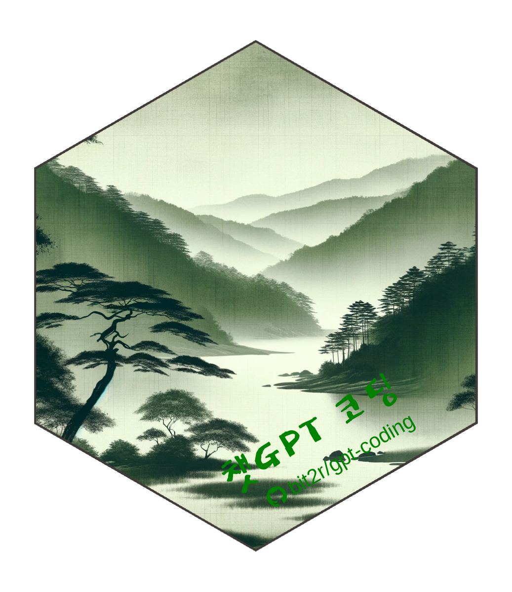

# 챗GPT 코딩(개정판) 

**프로그래밍 기초부터 소프트웨어 아키텍처, 그리고 인공지능까지**

## 📘 개요

"챗GPT 코딩 개정판"은 프로그래밍 완전 초보자가 AI 시대의 전문 개발자로 성장하는 전 과정을 안내하는 종합 가이드입니다.

2024년 초판 출간 이후 많은 독자분들의 요청에 따라, 프로그래밍 기초(1-4부)에 더해 **프로그래밍 패러다임**(5부), **소프트웨어 설계와 아키텍처**(6부), **기계학습 패러다임**(7부)을 새롭게 추가했습니다.

### 개정판의 특징

- ✅ **체계적 학습 경로**: 첫 변수 선언부터 대규모 AI 시스템 구축까지
- ✅ **AI 협업 실전**: Claude, ChatGPT, Copilot 등 AI 도구 활용법
- ✅ **실무 중심**: Git/GitHub 협업, 디자인 패턴, 아키텍처 설계
- ✅ **최신 기술**: LLM, 벡터 DB, 임베딩, 그래프 자료구조

## 📚 책의 구성 (7부)

### 1부: 전통 프로그래밍
프로그래밍의 기초 - 변수, 조건문, 반복문, 함수

### 2부: 자료구조
문자열부터 데이터프레임, JSON, 텐서, 임베딩, 그래프까지

### 3부: 버전제어와 협업
Git/GitHub를 활용한 팀 협업과 워크플로우

### 4부: 분야별 코딩
정규표현식, 네트워크, 웹, 데이터베이스, 자동화, Make

### 5부: 프로그래밍 패러다임 ⭐ *신규*
명령형, 객체지향, 함수형, 선언형, 반응형 프로그래밍

### 6부: 소프트웨어 설계와 아키텍처 ⭐ *신규*
코드 재사용, 기술 스택, 아키텍처, 디자인 패턴

### 7부: 기계학습 패러다임 ⭐ *신규*
ML 아키텍처, 워크플로우, LLM 활용

## 🌐 프로젝트 정보

### 웹사이트
- 📖 **초판 온라인**: [https://r2bit.com/gpt-coding/](https://r2bit.com/gpt-coding/)

### 소스코드
- 💻 **초판 (2024)**: [https://github.com/bit2r/gpt-coding](https://github.com/bit2r/gpt-coding)
- 💻 **개정판 (2026)**: [https://github.com/statkclee/gpt-coding2](https://github.com/statkclee/gpt-coding2)

### 제작 기술
전자책은 [Quarto Book](https://quarto.org/)을 활용하여 제작되었습니다.
PDF 파일은 한글 글꼴 및 한글 책 특성을 반영하기 위해 공익법인 한국 R 사용자회에서 제작한 [`bitPublish`](https://github.com/bit2r/bitPublish) 템플릿을 사용했습니다.

## 🛠️ 로컬 개발 환경

### 필수 요구사항
- [Quarto](https://quarto.org/docs/get-started/) 1.4 이상
- Python 3.10 이상 (선택사항)

### 의존성 설치

**Python 패키지** (선택사항):
```bash
pip install -r requirements.txt
```

### 책 렌더링

**전체 책 렌더링**:
```bash
quarto render
```

**미리보기** (포트 7771):
```bash
quarto preview
```

**특정 챕터만**:
```bash
quarto render index.qmd
```

출력 파일은 `docs/` 디렉토리에 생성됩니다.

## 📦 출판 정보

### 초판 (2024년 3월)
📘 **교보 POD 종이책**: [https://bit.ly/4a8v1JS](https://bit.ly/4a8v1JS)
📗 **교보 전자책**: [https://bit.ly/4auasHU](https://bit.ly/4auasHU)

### 개정판 (2026년)
🚀 **출간 준비 중**

## 🤝 기여 및 피드백

이슈나 개선 제안은 [GitHub Issues](https://github.com/statkclee/gpt-coding2/issues)를 통해 제출해주세요.

## 📄 라이선스

이 프로젝트는 공익법인 한국 R 사용자회가 관리합니다.

## 👨‍💻 저자

**이광춘**
국가인공지능전략위원회 자문위원

---

⭐ 이 프로젝트가 도움이 되셨다면 GitHub에 Star를 눌러주세요!
