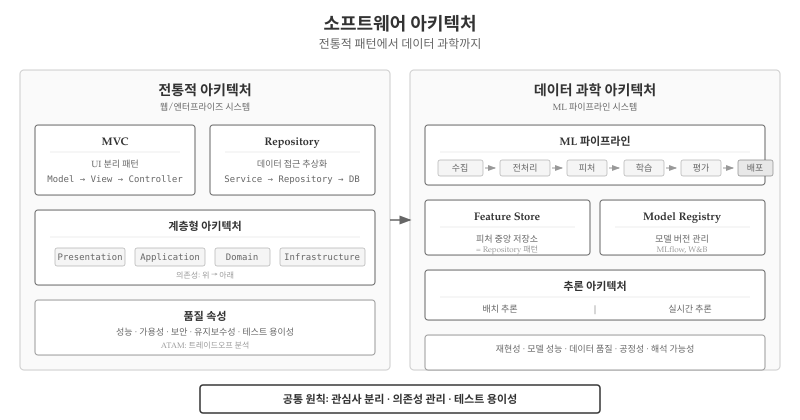
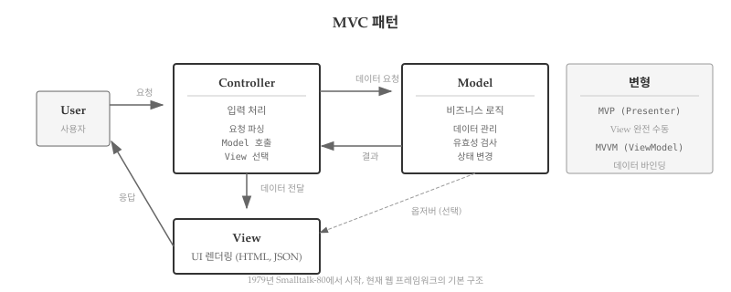
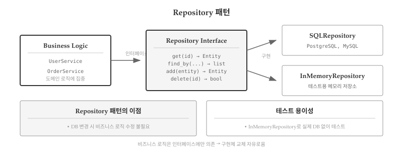
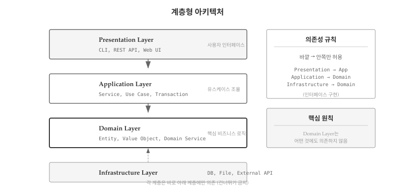
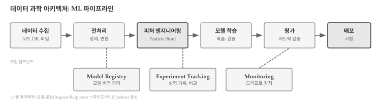
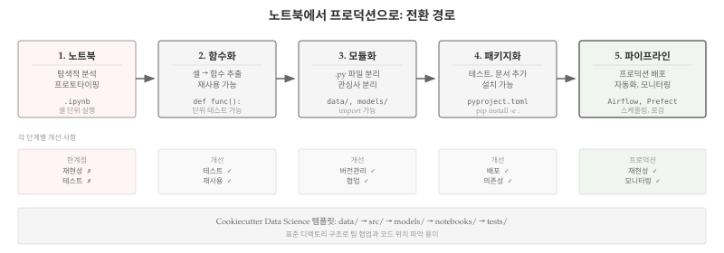
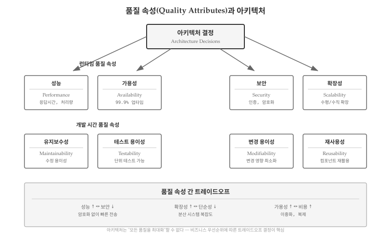
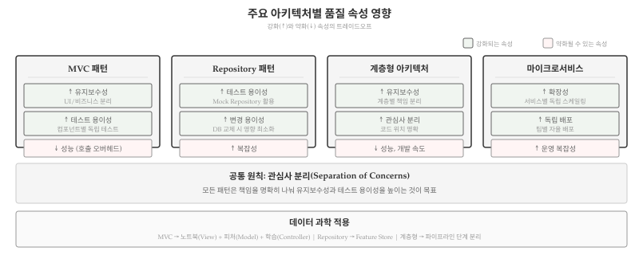

# 소프트웨어 아키텍처 {#sec-arch-architecture}

```{python}
#| echo: false
#| output: false
from abc import ABC, abstractmethod
from dataclasses import dataclass, field
from typing import Any, Callable, Optional, Protocol
from functools import wraps
```

앞선 장에서 소프트웨어 스택—플랫폼, 런타임, 라이브러리, 프레임워크—을 살펴보았다. 스택이 "무엇으로 만드는가"에 대한 답이라면, 아키텍처(Architecture)\index{아키텍처}는 "어떻게 구조화하는가"에 대한 답이다. Flask와 pandas를 사용한다고 해서 좋은 소프트웨어가 자동으로 만들어지지는 않는다. 수천 줄의 코드가 어떤 구조로 조직되는가에 따라 유지보수성, 확장성, 팀 협업 효율이 결정된다.



## 아키텍처가 중요한 이유 {#sec-arch-why}

\index{아키텍처!중요성} \index{기술 부채}

"일단 돌아가게 만들고, 나중에 정리하자"—프로젝트 초기에 흔히 하는 말이다. 하지만 그 "나중"은 대부분 오지 않는다. 코드가 쌓이고 기능이 추가되면서, 처음의 임시 구조가 시스템 전체를 지배하게 된다. 새 기능을 추가하려면 기존 코드 곳곳을 건드려야 하고, 버그를 고치면 다른 곳에서 새 버그가 터진다. 개발 속도는 점점 느려지고, 팀원들은 코드 수정을 두려워하게 된다.

아키텍처가 중요한 이유는 **변경 비용**에 있다. 소프트웨어는 한 번 만들고 끝나는 것이 아니라, 수년간 수정되고 확장된다. 잘 설계된 아키텍처는 변경이 국소화되어 한 곳을 수정해도 다른 곳에 영향이 적다. 반면 뒤엉킨 구조에서는 작은 변경도 시스템 전체에 파급된다. 프로젝트 초기에는 아키텍처 없이도 빠르게 개발할 수 있지만, 시간이 지날수록 기술 부채가 누적되어 속도가 급격히 떨어진다.

:::{.callout-note}
## 변경 비용의 곡선

아키텍처가 없는 시스템에서 변경 비용은 코드 크기에 따라 **지수적으로** 증가한다. 1만 줄 코드에서 10분 걸리던 수정이, 10만 줄에서는 10시간이 아니라 며칠이 걸릴 수 있다. 좋은 아키텍처는 이 곡선을 **선형에 가깝게** 유지한다.
:::

아키텍처는 또한 **팀 협업**의 기반이다. 10명이 동시에 하나의 파일을 수정하면 충돌이 끊이지 않는다. 하지만 시스템이 명확한 계층과 모듈로 분리되어 있으면, 각 팀원이 독립적인 영역에서 작업할 수 있다. UI 담당자는 View 계층에서, 백엔드 개발자는 Service 계층에서, 데이터베이스 전문가는 Repository 계층에서 각자의 전문성을 발휘한다. 인터페이스만 합의하면 병렬 개발이 가능해진다.

마지막으로, 아키텍처는 **의사소통 도구**다. "데이터베이스 접근 로직은 Repository에, 비즈니스 규칙은 Service에, HTTP 처리는 Controller에"라는 약속이 있으면, 새 팀원도 코드를 어디에 작성해야 하는지 금방 파악할 수 있다. 코드 리뷰에서 "이 로직은 Controller가 아니라 Service에 있어야 한다"고 피드백하면 모두가 무슨 뜻인지 이해한다. 공유된 아키텍처 언어가 팀의 생산성을 높인다.

## 아키텍처 패턴의 역할 {#sec-arch-role}

GoF 패턴이 "이 클래스를 어떻게 설계할까"에 대한 답이라면, 아키텍처 패턴은 "이 애플리케이션을 어떻게 구조화할까"에 대한 답이다. 둘의 관계를 정리하면 다음과 같다.

| 구분 | GoF 디자인 패턴 | 아키텍처 패턴 |
|------|-----------------|---------------|
| 적용 범위 | 클래스/객체 수준 | 시스템/모듈 수준 |
| 관심사 | 객체 생성, 구조, 상호작용 | 계층 분리, 데이터 흐름 |
| 예시 | Factory, Strategy, Observer | MVC, Repository, Layered |
| 언어 의존성 | 낮음 (대부분 언어에 적용) | 프레임워크에 따라 다름 |

: 디자인 패턴과 아키텍처 패턴 비교 {#tbl-pattern-level-comparison}

아키텍처 패턴의 핵심 목표는 **관심사 분리**(Separation of Concerns)\index{관심사 분리}다. 사용자 인터페이스, 비즈니스 로직, 데이터 저장소를 분리하면 각 부분을 독립적으로 수정하고 테스트할 수 있다.

## 아키텍처 결정의 세 가지 상황 {#sec-arch-scenarios}

\index{아키텍처!결정 상황}

실무에서 아키텍처를 다루는 상황은 크게 세 가지로 나뉜다. 각 상황마다 고려해야 할 점과 접근 방식이 다르다.

### 표준 아키텍처 채택 {#sec-arch-standard}

대부분의 프로젝트는 **도메인별 표준 아키텍처**를 그대로 채택한다. 웹 애플리케이션이라면 MVC, 엔터프라이즈 시스템이라면 계층형 아키텍처, 모바일 앱이라면 MVVM이 사실상 표준이다. Django를 선택하면 MTV(Model-Template-View)가, Spring Boot를 선택하면 Controller-Service-Repository가 자동으로 따라온다.

표준 아키텍처를 채택하면 얻는 이점은 명확하다. 첫째, **검증된 구조**다. 수많은 프로젝트에서 사용되어 문제점이 이미 발견되고 해결되었다. 둘째, **풍부한 자료**다. 튜토리얼, 책, 강의가 넘쳐나서 학습과 문제 해결이 쉽다. 셋째, **인력 채용이 수월**하다. Django 개발자를 찾으면 MTV 구조를 아는 사람을 찾는 것이다.

이 경우 아키텍처 설계에 시간을 쏟기보다, 프레임워크가 제시하는 관례(Convention)를 빠르게 익히고 따르는 것이 효율적이다. 아키텍처 결정은 이미 프레임워크 선택 시점에 끝났다고 봐도 무방하다.

### 신규 프로젝트의 아키텍처 설계 {#sec-arch-greenfield}

표준 아키텍처가 맞지 않는 경우가 있다. 실시간 협업 도구, 대규모 데이터 파이프라인, 이벤트 기반 마이크로서비스 같은 프로젝트는 MVC만으로 해결되지 않는다. 이런 **그린필드(Greenfield) 프로젝트**에서는 처음부터 아키텍처를 신중하게 설계해야 한다.

아키텍처 설계 시 고려할 질문은 다음과 같다.

- **확장성**: 사용자가 10배 늘어나면 어떻게 대응할 것인가?
- **가용성**: 서버 한 대가 죽으면 서비스가 멈추는가?
- **성능**: 응답 시간 요구사항을 충족할 수 있는가?
- **팀 구조**: 여러 팀이 독립적으로 개발하고 배포할 수 있는가?

이 상황에서는 @sec-arch-quality 에서 다룰 **품질 속성 시나리오**와 **ATAM**같은 체계적인 방법론이 필요하다. "일단 만들고 나중에 수정하자"는 접근이 가장 위험한 경우다.

### 아키텍처 전환 {#sec-arch-migration}

가장 어려운 상황은 **기존 아키텍처를 버리고 새 구조로 전환**하는 것이다. 모놀리식에서 마이크로서비스로, 동기 처리에서 이벤트 기반으로, 온프레미스에서 클라우드 네이티브로—이런 전환은 비용이 크고 위험하다.

아키텍처 전환이 필요한 신호는 다음과 같다.

- **확장 한계**: 수직 확장(서버 업그레이드)으로는 더 이상 트래픽을 감당할 수 없다.
- **배포 병목**: 작은 변경에도 전체 시스템을 재배포해야 해서 릴리스 주기가 길어진다.
- **팀 간 충돌**: 여러 팀이 같은 코드베이스를 수정하면서 지속적으로 충돌이 발생한다.
- **기술 부채 임계점**: 새 기능 추가보다 기존 코드 수정에 더 많은 시간이 소요된다.

전환 시 가장 흔한 실수는 **빅뱅 마이그레이션**이다. 기존 시스템을 한 번에 새 아키텍처로 교체하려다 실패한다. 대신 **점진적 전환(Strangler Fig Pattern)**\index{Strangler Fig 패턴}이 권장된다. 새 기능은 새 아키텍처로 개발하고, 기존 기능은 점진적으로 마이그레이션한다. 오래된 시스템과 새 시스템이 한동안 공존하게 된다.

:::{.callout-tip}
## 아키텍처 결정의 비가역성

아키텍처 결정 중 일부는 되돌리기 어렵다. 데이터베이스 선택, 프로그래밍 언어, 클라우드 벤더—이런 결정은 나중에 바꾸려면 큰 비용이 든다. 반면 디자인 패턴 적용, 코드 구조, 네이밍 규칙은 상대적으로 쉽게 바꿀 수 있다. 되돌리기 어려운 결정일수록 더 신중하게, 되돌리기 쉬운 결정일수록 빠르게 진행하는 것이 현명하다.
:::

## 전통적 아키텍처 패턴 {#sec-arch-traditional}

\index{MVC 패턴} \index{Repository 패턴} \index{계층형 아키텍처}

웹 애플리케이션과 엔터프라이즈 시스템에서 검증된 세 가지 핵심 패턴이 있다. MVC, Repository, 계층형 아키텍처는 각각 다른 문제를 해결하지만, 모두 **관심사 분리**라는 공통 원칙을 따른다.

### MVC: 사용자 인터페이스 분리 {#sec-arch-mvc}

MVC(Model-View-Controller)는 1979년 제록스 연구소에서 고안된 이래, 웹 프레임워크의 표준 구조로 자리 잡았다. Django의 MTV, Spring의 Controller-Service-Repository 모두 MVC의 변형이다.



**Model**은 데이터와 비즈니스 로직을 담당한다. **View**는 사용자에게 데이터를 표시한다. **Controller**는 사용자 입력을 받아 Model과 View를 조율한다. 핵심은 UI 로직과 비즈니스 로직이 분리되어 각각 독립적으로 변경할 수 있다는 점이다.

```{python}
# MVC 핵심 구조 (간략화)
@dataclass
class Task:
    id: int
    title: str
    completed: bool = False

class TaskModel:
    def __init__(self):
        self._tasks: dict[int, Task] = {}
        self._next_id = 1

    def create(self, title: str) -> Task:
        task = Task(id=self._next_id, title=title)
        self._tasks[self._next_id] = task
        self._next_id += 1
        return task

class TaskController:
    def __init__(self, model: TaskModel):
        self.model = model

    def add_task(self, title: str) -> str:
        task = self.model.create(title)
        return f"'{task.title}' 추가됨"

# 사용
controller = TaskController(TaskModel())
print(controller.add_task("MVC 학습"))
```

MVC에서 파생된 **MVP**(Model-View-Presenter)와 **MVVM**(Model-View-ViewModel)\index{MVP 패턴}\index{MVVM 패턴}도 널리 사용된다. MVP는 View와 Model이 직접 통신하지 않아 테스트가 쉽고, MVVM은 데이터 바인딩으로 UI 동기화를 자동화한다.

### Repository: 데이터 접근 추상화 {#sec-arch-repository}

Repository 패턴은 데이터 접근 로직을 비즈니스 로직에서 분리한다. 비즈니스 코드는 데이터가 메모리에 있는지, 데이터베이스에 있는지 알 필요가 없다.



```{python}
# Repository 인터페이스와 구현
@dataclass
class User:
    id: Optional[int] = None
    name: str = ""
    email: str = ""

class UserRepository:
    """데이터 저장소 추상화"""
    def __init__(self):
        self._users: dict[int, User] = {}
        self._next_id = 1

    def add(self, user: User) -> User:
        user.id = self._next_id
        self._users[self._next_id] = user
        self._next_id += 1
        return user

    def find_all(self) -> list[User]:
        return list(self._users.values())

# 비즈니스 로직은 Repository 인터페이스만 알면 됨
class UserService:
    def __init__(self, repo: UserRepository):
        self.repo = repo

    def register(self, name: str, email: str) -> User:
        return self.repo.add(User(name=name, email=email))

# 테스트: 실제 DB 없이 가능
service = UserService(UserRepository())
alice = service.register("Alice", "alice@example.com")
print(f"등록됨: {alice.name}")
```

Repository의 가치는 **테스트 용이성**에 있다. 메모리 기반 구현으로 단위 테스트를 작성하고, 프로덕션에서는 실제 데이터베이스 구현으로 교체할 수 있다.

### 계층형 아키텍처: 수직적 분리 {#sec-arch-layered}

계층형 아키텍처(Layered Architecture)는 애플리케이션을 수평적 계층으로 분리한다. 각 계층은 바로 아래 계층에만 의존하며, 건너뛰기는 허용하지 않는다.



표준 4계층 구조는 다음과 같다.

| 계층 | 역할 | 예시 |
|------|------|------|
| 프레젠테이션 | 사용자 인터페이스 | CLI, HTTP 요청 처리 |
| 애플리케이션 | 유스케이스 조율 | 트랜잭션, 보안 검사 |
| 도메인 | 비즈니스 로직 | 엔티티, 비즈니스 규칙 |
| 인프라스트럭처 | 기술 세부사항 | DB, 파일, 외부 API |

: 계층형 아키텍처의 4계층 {#tbl-layered-architecture}

의존성 방향은 항상 **위에서 아래로** 흐른다. 도메인 계층이 가장 안쪽에 있으며, 다른 어떤 계층에도 의존하지 않는다. 이 구조 덕분에 UI를 CLI에서 웹으로 바꾸거나, 데이터베이스를 MySQL에서 PostgreSQL로 교체해도 도메인 로직은 영향받지 않는다.


## 데이터 과학의 아키텍처 {#sec-arch-datascience}

\index{데이터 과학 아키텍처} \index{ML 파이프라인} \index{MLOps}

앞서 살펴본 MVC와 계층형 아키텍처는 웹 애플리케이션과 엔터프라이즈 시스템의 표준이다. 그렇다면 데이터 과학 프로젝트에서는 어떤 아키텍처를 사용할까? 흥미롭게도, 전통적 패턴의 핵심 원리—관심사 분리, 의존성 관리, 테스트 용이성—는 그대로 적용되지만 구체적인 형태는 크게 달라진다.



### MLOps의 등장 {#sec-arch-mlops-history}

\index{Hidden Technical Debt} \index{D. Sculley}

데이터 과학 아키텍처가 본격적으로 정립된 시점은 **2015년**이다. 구글의 D. Sculley 등이 NeurIPS에서 발표한 논문 **"Hidden Technical Debt in Machine Learning Systems"**[@Sculley2015]가 ML 시스템 아키텍처의 기초를 놓았다. 논문의 핵심 통찰은 다음과 같다.

> "실제 ML 시스템에서 ML 코드가 차지하는 비중은 극히 일부에 불과하다."

ML 모델 자체보다 데이터 수집, 피처 추출, 설정 관리, 모니터링 같은 주변 인프라가 훨씬 복잡하다는 지적이었다. 2018년에는 MLflow가 Spark + AI Summit에서 공개되면서 **MLOps**라는 용어가 본격적으로 확산되었다.

MLOps는 DevOps에서 직접 영향을 받았다. 소프트웨어 개발의 CI/CD(지속적 통합/배포) 원칙이 ML 시스템에 적용되어 CT/CD(지속적 학습/배포)로 변환되었다. 전통적 아키텍처 패턴도 그대로 계승되었다.

| 전통 패턴 | 데이터 과학 적용 |
|-----------|------------------|
| DevOps (CI/CD, 자동화) | MLOps (CT/CD—지속적 학습/배포) |
| Repository 패턴 | Feature Store (피처 중앙 저장소) |
| 버전 관리 (Git) | Model Registry, DVC (데이터 버전 관리) |
| 모니터링 (APM) | 모델 드리프트 감지, 데이터 품질 모니터링 |
| 계층형 아키텍처 | 파이프라인 단계별 분리 |

: 전통 아키텍처 패턴의 데이터 과학 적용 {#tbl-traditional-to-ds}

핵심은 **관심사 분리**와 **모듈화** 원칙이 그대로 적용되었다는 점이다. 다만 웹의 요청-응답 패러다임이 파이프라인 패러다임으로, 코드 배포가 모델 배포로 변환된 것이다.

### 전통 아키텍처와의 차이 {#sec-arch-ds-difference}

웹 애플리케이션과 데이터 과학 프로젝트는 근본적으로 다른 패러다임을 따른다.

| 관점 | 웹/엔터프라이즈 | 데이터 과학 |
|------|----------------|-------------|
| 중심 흐름 | 요청-응답(Request-Response) | 파이프라인(Pipeline) |
| 상태 관리 | 세션, 캐시, 데이터베이스 | 실험 추적, 모델 버전 |
| 배포 후 관심사 | 안정성, 확장성 | 모델 드리프트, 재학습 |
| 테스트 대상 | 기능 동작 여부 | 모델 성능, 데이터 품질 |
| 재현성 기준 | 동일 입력 → 동일 출력 | 동일 데이터+코드 → 동일 모델 |

: 웹 애플리케이션과 데이터 과학 프로젝트 비교 {#tbl-web-vs-ds}

웹 애플리케이션은 사용자 요청에 응답하는 구조가 중심이다. 사용자가 버튼을 클릭하면 서버가 처리하고 결과를 반환한다. 반면 데이터 과학 프로젝트는 **데이터가 흐르는 파이프라인**이 중심이다. 원시 데이터가 수집되고, 전처리를 거쳐, 모델 학습에 사용되고, 평가를 통과하면 배포된다.

### 노트북에서 프로덕션으로 {#sec-arch-notebook}

\index{주피터 노트북!한계} \index{프로덕션 코드}

{#fig-notebook-production}

데이터 과학자 대부분은 주피터 노트북(Jupyter Notebook)에서 작업을 시작한다. 노트북은 탐색적 분석과 프로토타이핑에 탁월하지만, 프로덕션 환경에는 심각한 한계가 있다.

:::{.callout-warning}
## 노트북의 프로덕션 한계

- **재현성 부재**: 셀 실행 순서에 따라 결과가 달라질 수 있다
- **테스트 불가**: 함수 단위 테스트 작성이 어렵다
- **버전 관리 어려움**: JSON 구조라 diff가 읽기 어렵다
- **배포 불가**: 서버에서 `.ipynb` 파일을 직접 실행할 수 없다
:::

노트북에서 프로덕션으로 전환하는 경로는 다음과 같다.

```
노트북 → 함수화 → 모듈화 → 패키지화 → 파이프라인
```

**1단계: 함수화** - 노트북 셀의 코드를 함수로 추출한다.

```{python}
# 노트북 셀에서 직접 실행하던 코드
# df = pd.read_csv("data.csv")
# df = df.dropna()
# df["price_log"] = np.log(df["price"])

# 함수로 추출
def load_and_preprocess(path: str):
    """데이터 로드 및 전처리"""
    import pandas as pd
    import numpy as np
    df = pd.DataFrame({"price": [100, 200, 300]})  # 예시
    df["price_log"] = np.log(df["price"])
    return df

data = load_and_preprocess("data.csv")
print(f"처리된 행: {len(data)}")
```

**2단계: 모듈화** - 관련 함수들을 `.py` 파일로 분리한다.

```
project/
├── data/
│   └── preprocess.py    # 전처리 함수
├── models/
│   └── train.py         # 학습 함수
├── evaluation/
│   └── metrics.py       # 평가 함수
└── notebooks/
    └── exploration.ipynb  # 탐색용 노트북
```

**3단계: 패키지화** - 테스트와 문서를 추가하고 설치 가능한 패키지로 만든다.

Cookiecutter Data Science\index{Cookiecutter Data Science} 템플릿은 데이터 과학 프로젝트의 표준 구조를 제공한다. 이 구조를 따르면 팀원 모두가 코드 위치를 쉽게 파악할 수 있다.

### ML 파이프라인 아키텍처 {#sec-arch-ml-pipeline}

\index{ML 파이프라인} \index{Feature Store} \index{Model Registry}

프로덕션 ML 시스템의 핵심은 **파이프라인 아키텍처**다. 데이터 수집부터 모델 배포까지 각 단계가 명확히 분리되어 독립적으로 실행되고 모니터링된다.

```
데이터 수집 → 전처리 → 피처 엔지니어링 → 학습 → 평가 → 배포
```

각 단계를 지원하는 핵심 컴포넌트가 있다.

**Feature Store**\index{Feature Store}는 데이터 과학 버전의 Repository 패턴이다. 전처리된 피처를 중앙에서 관리하여 학습과 추론에서 동일한 피처를 사용하도록 보장한다. 피처 정의가 학습 코드와 서빙 코드에 중복되면 **학습-서빙 불일치(Training-Serving Skew)**\index{Training-Serving Skew}가 발생할 수 있다.

```{python}
# Feature Store 개념 (단순화)
class FeatureStore:
    """피처 중앙 저장소"""
    def __init__(self):
        self._features: dict[str, Any] = {}

    def register(self, name: str, compute_fn: Callable) -> None:
        """피처 정의 등록"""
        self._features[name] = compute_fn

    def get_features(self, names: list[str], data: Any) -> dict:
        """피처 계산 및 반환"""
        return {name: self._features[name](data) for name in names}

# 피처 정의
store = FeatureStore()
store.register("price_log", lambda d: [round(x, 2) for x in [2.30, 2.99, 3.40]])

# 학습과 추론 모두 동일한 피처 사용
features = store.get_features(["price_log"], {"price": [100, 200, 300]})
print(f"피처: {features}")
```

**Model Registry**\index{Model Registry}는 학습된 모델의 버전을 관리한다. Git이 코드 버전을 관리하듯, Model Registry는 모델 파일, 하이퍼파라미터, 성능 지표를 함께 추적한다. MLflow, Weights & Biases 같은 도구가 이 역할을 수행한다.

**Experiment Tracking**\index{Experiment Tracking}은 수많은 실험의 설정과 결과를 기록한다. 어떤 하이퍼파라미터 조합이 최고 성능을 냈는지, 지난주 실험과 오늘 실험의 차이가 무엇인지 추적할 수 있다.

### 추론 아키텍처 {#sec-arch-inference}

\index{배치 추론} \index{실시간 추론} \index{모델 서빙}

학습된 모델을 실제 서비스에 적용하는 방식은 크게 두 가지다.

**배치 추론(Batch Inference)**은 대량의 데이터를 주기적으로 처리한다. 매일 밤 고객 이탈 확률을 계산하거나, 매주 상품 추천 목록을 갱신하는 경우다. 실시간성이 필요 없고 처리량이 중요할 때 적합하다.

**실시간 추론(Real-time Inference)**은 요청마다 즉시 예측을 반환한다. 사용자가 검색어를 입력할 때마다 추천을 제공하거나, 신용카드 거래마다 사기 여부를 판단하는 경우다. 지연 시간(Latency)이 핵심 지표다.

```{python}
# 실시간 추론 서버 구조 (FastAPI 스타일)
@dataclass
class PredictionRequest:
    features: list[float]

@dataclass
class PredictionResponse:
    prediction: float
    confidence: float

class ModelServer:
    """모델 서빙 서버"""
    def __init__(self, model_path: str):
        # 실제로는 model = load_model(model_path)
        self.model_version = "1.0"

    def predict(self, request: PredictionRequest) -> PredictionResponse:
        # 실제로는 prediction = self.model.predict(request.features)
        prediction = sum(request.features) * 0.1  # 더미 예측
        return PredictionResponse(
            prediction=prediction,
            confidence=0.95
        )

# 사용
server = ModelServer("models/v1")
response = server.predict(PredictionRequest(features=[1.0, 2.0, 3.0]))
print(f"예측: {response.prediction:.2f}, 신뢰도: {response.confidence}")
```

모델 서빙에는 FastAPI, TensorFlow Serving, Triton Inference Server 같은 도구가 사용된다. 앞서 배운 계층형 아키텍처가 여기서도 적용된다—HTTP 요청 처리(프레젠테이션), 전처리 및 후처리(애플리케이션), 모델 추론(도메인), 모델 로딩(인프라스트럭처).

:::{.callout-tip}
## 데이터 과학과 전통 패턴의 연결

- **Feature Store** = Repository 패턴 (데이터 접근 추상화)
- **Model Server** = MVC의 Controller (요청 처리 및 조율)
- **파이프라인 단계** = 계층형 아키텍처 (각 단계가 아래 단계에만 의존)

전통적 아키텍처 패턴을 이해하면 데이터 과학 아키텍처도 쉽게 파악할 수 있다.
:::


## 품질 속성과 아키텍처 {#sec-arch-quality}

\index{품질 속성} \index{Quality Attributes} \index{ATAM}

아키텍처 패턴을 선택하는 진짜 기준은 **품질 속성(Quality Attributes)**이다. MVC, Repository, 계층형 아키텍처는 모두 특정 품질 속성을 달성하기 위한 수단일 뿐이다. 아키텍처 결정은 곧 품질 속성 간 트레이드오프 결정이다.

{#fig-quality-attributes}

### 품질 속성의 두 범주 {#sec-arch-quality-categories}

품질 속성은 크게 **런타임 품질 속성**과 **개발 시간 품질 속성**으로 나뉜다.

**런타임 품질 속성**은 시스템이 실행 중일 때 관측되는 특성이다. **성능(Performance)**은 응답 시간, 처리량, 리소스 사용률로 측정된다. **가용성(Availability)**은 시스템 가동 시간과 장애 복구 시간을 의미하며, 99.9% 업타임 같은 SLA로 표현된다. **보안(Security)**은 인증, 권한 부여, 데이터 암호화, 감사 추적을 포함한다. **확장성(Scalability)**은 부하 증가에 대한 시스템 대응 능력으로, 수평 확장(서버 추가)과 수직 확장(서버 업그레이드)으로 구분된다.

**개발 시간 품질 속성**은 개발과 유지보수 과정에서 나타나는 특성이다. **유지보수성(Maintainability)**은 버그 수정과 기능 추가의 용이성을 말한다. **테스트 용이성(Testability)**은 단위 테스트, 통합 테스트 작성 가능성이다. **변경 용이성(Modifiability)**은 요구사항 변경 시 영향 범위 최소화를 의미한다. **재사용성(Reusability)**은 컴포넌트를 다른 시스템에서 활용할 가능성이다.

### 주요 아키텍처별 품질 속성 영향 {#sec-arch-pattern-quality}

{#fig-pattern-quality}

각 아키텍처 패턴은 특정 품질 속성에 강점을 보이며, 다른 속성에서는 비용을 지불한다.

**MVC 패턴**은 유지보수성과 테스트 용이성을 강화한다. View와 Model이 분리되어 UI 변경이 비즈니스 로직에 영향을 주지 않고, Controller를 통해 흐름을 제어하므로 각 컴포넌트를 독립적으로 테스트할 수 있다. 반면 계층 간 호출 오버헤드로 성능이 약간 저하될 수 있고, 작은 프로젝트에서는 구조가 과도하게 느껴질 수 있다.

**Repository 패턴**은 테스트 용이성과 변경 용이성에서 두드러진 강점을 보인다. 데이터 접근 로직이 추상화되어 메모리 기반 가짜 Repository로 단위 테스트를 작성할 수 있고, 데이터베이스를 MySQL에서 PostgreSQL로 교체해도 비즈니스 로직은 영향받지 않는다. 단점은 인터페이스와 구현 클래스가 늘어나면서 복잡성이 증가한다는 점이다.

**계층형 아키텍처**는 유지보수성과 관심사 분리에서 강점을 보인다. 각 계층이 명확한 책임을 가지므로 코드 위치를 쉽게 파악할 수 있고, 특정 계층만 수정해도 다른 계층에 영향이 적다. 그러나 모든 요청이 계층을 통과해야 하므로 성능 오버헤드가 발생하고, 계층 간 데이터 변환(DTO)이 필요하면 개발 속도가 느려질 수 있다.

| 패턴 | 강화되는 품질 속성 | 약화될 수 있는 속성 |
|------|-------------------|-------------------|
| MVC | 유지보수성, 테스트 용이성 | 성능 (계층 간 호출 오버헤드) |
| Repository | 테스트 용이성, 변경 용이성 | 복잡성 증가 |
| 계층형 | 유지보수성, 관심사 분리 | 성능, 개발 속도 |
| 마이크로서비스 | 확장성, 독립 배포 | 운영 복잡성, 네트워크 지연 |

: 주요 아키텍처별 품질 속성 영향 {#tbl-pattern-quality-mapping}

### 데이터 과학 고유 품질 속성 {#sec-arch-ds-quality}

\index{재현성} \index{모델 성능} \index{데이터 품질}

데이터 과학 프로젝트에서는 전통적 품질 속성에 더해 **고유 품질 속성**을 고려해야 한다. **재현성(Reproducibility)**은 동일한 데이터와 코드로 동일한 모델/결과를 도출할 수 있는지를 의미한다. 랜덤 시드 고정, 의존성 버전 관리, 데이터 버전 관리가 재현성을 보장하는 핵심 요소다. **모델 성능(Model Performance)**은 정확도, 정밀도, 재현율 등 예측 품질을 말한다.

**데이터 품질(Data Quality)**은 완전성, 일관성, 정확성, 최신성으로 구성된다. 결측치 비율, 중복 데이터, 이상치 처리 전략이 모델 성능에 직접적인 영향을 미친다. **공정성(Fairness)**은 특정 집단에 대한 편향 없는 예측을 보장해야 한다는 요구사항이다. **해석 가능성(Interpretability)**은 모델 결정 근거를 설명할 수 있어야 한다는 것으로, 금융이나 의료 도메인에서 특히 중요하다.

| 품질 속성 | 정의 | 측정 예시 |
|----------|------|----------|
| 재현성 | 동일 데이터+코드 → 동일 모델 | 성능 차이 1% 이내 |
| 모델 성능 | 예측 품질 | F1-score 0.85 이상 |
| 데이터 품질 | 완전성, 일관성, 최신성 | 결측치 5% 이하 |
| 공정성 | 집단 간 편향 없음 | 그룹 간 승인율 차이 5% 이내 |
| 해석 가능성 | 결정 근거 설명 가능 | SHAP 값 제공 |

: 데이터 과학 고유 품질 속성 {#tbl-ds-quality-attributes}

### ATAM: 트레이드오프 분석 {#sec-arch-atam}

\index{ATAM} \index{SEI}

ATAM(Architecture Tradeoff Analysis Method)[@Kazman2000ATAM]은 아키텍처 결정이 품질 속성에 미치는 **트레이드오프**를 명시적으로 분석하는 방법이다[@Bass2021SoftwareArchitecture]. 핵심 산출물은 다음과 같다.

- **민감점**: 하나의 결정이 하나의 품질 속성에 큰 영향을 미치는 지점
- **트레이드오프 포인트**: 하나의 결정이 여러 품질 속성에 상반된 영향을 미치는 지점
- **위험/비위험**: 잠재적 문제 여부에 따른 분류

```{python}
# 아키텍처 트레이드오프 분석 예시
tradeoffs = [
    ("데이터 암호화", "보안 ↑", "성능 ↓"),
    ("마이크로서비스 분리", "확장성 ↑", "운영 복잡성 ↑"),
    ("캐시 도입", "성능 ↑", "일관성 관리 ↑"),
]

print("=== 웹 시스템 트레이드오프 ===")
for decision, positive, negative in tradeoffs:
    print(f"• {decision}: {positive}, {negative}")
```

### 데이터 과학 ATAM 적용 {#sec-arch-ds-atam}

\index{데이터 과학!ATAM}

데이터 과학 프로젝트에도 ATAM을 적용할 수 있다. 전통적 품질 속성 대신 **재현성, 모델 성능, 추론 지연 시간** 같은 ML 고유 속성으로 분석한다.

```{python}
# 데이터 과학 ATAM 트레이드오프 분석
ds_tradeoffs = [
    {
        "결정": "복잡한 앙상블 모델 사용",
        "긍정": ("모델 성능", "정확도 5% 향상"),
        "부정": ("추론 지연", "10배 느려짐"),
        "추가_부정": ("해석 가능성", "블랙박스화")
    },
    {
        "결정": "실시간 피처 계산",
        "긍정": ("데이터 최신성", "최신 데이터 반영"),
        "부정": ("추론 지연", "계산 오버헤드"),
        "추가_부정": ("재현성", "시점 의존성 증가")
    },
    {
        "결정": "Feature Store 도입",
        "긍정": ("재현성", "학습-서빙 일치 보장"),
        "부정": ("운영 복잡성", "인프라 추가 필요"),
        "추가_긍정": ("개발 속도", "피처 재사용")
    },
]

print("=== ML 시스템 트레이드오프 ===")
for tp in ds_tradeoffs:
    pos_attr, pos_effect = tp["긍정"]
    neg_attr, neg_effect = tp["부정"]
    print(f"\n• {tp['결정']}")
    print(f"    ↑ {pos_attr}: {pos_effect}")
    print(f"    ↓ {neg_attr}: {neg_effect}")
```

**데이터 과학 민감점 예시:**

| 결정 | 영향 받는 속성 | 민감도 |
|------|---------------|--------|
| 학습 데이터 크기 | 모델 성능 | 높음 |
| 모델 압축 수준 | 추론 지연 | 높음 |
| 랜덤 시드 고정 | 재현성 | 높음 |
| 피처 수 | 해석 가능성 | 중간 |

: 데이터 과학 민감점 {#tbl-ds-sensitivity}

:::{.callout-tip}
### 도메인별 품질 속성 우선순위

- **금융 ML**: 공정성 > 해석 가능성 > 모델 성능
- **추천 시스템**: 추론 지연 < 100ms > 모델 성능 > 재현성
- **연구 프로젝트**: 재현성 > 모델 성능 > 추론 지연
- **프로덕션 ML**: 모델 성능 > 추론 지연 > 운영 복잡성

아키텍처 결정은 이 우선순위에 따라 트레이드오프를 선택하는 과정이다.
:::


## 디버깅 {#sec-arch-debug}

아키텍처 패턴 적용 시 발생하는 일반적인 문제와 해결 방법을 정리한다.

### 계층 침범 {#sec-arch-debug-violation}

한 계층이 다른 계층의 내부 구현에 직접 접근하는 경우다.

```{python}
#| eval: false
# 문제: 프레젠테이션 계층이 인프라 계층 직접 접근
class BadController:
    def __init__(self, repo: BookRepository):
        # Controller가 Repository에 직접 의존 (애플리케이션 계층 우회)
        self._books = repo._books  # 내부 구현 직접 접근!
```

:::{.callout-warning}
### 계층 우회의 위험

계층을 우회하면 처음에는 코드가 간단해 보이지만, 시간이 지나면서 문제가 발생한다. 비즈니스 로직이 여러 계층에 분산되고, 변경 시 영향 범위를 파악하기 어려워진다. 항상 인접 계층의 공개 인터페이스만 사용해야 한다.
:::

### 순환 의존성 {#sec-arch-debug-circular}

두 계층이 서로를 참조하면 순환 의존성이 발생한다.

```{python}
#| eval: false
# 문제: Service와 Repository가 서로 참조
# service.py
# from repository import BookRepository  # Repository → Service 참조도 있다면 순환!

# 해결: 인터페이스로 의존성 역전
class BookRepositoryInterface(Protocol):
    def find_by_isbn(self, isbn: str) -> Optional[Book]: ...

# Service는 인터페이스에만 의존
class LibraryServiceFixed:
    def __init__(self, repo: BookRepositoryInterface):
        self.repo = repo
```

### 과도한 DTO 변환 {#sec-arch-debug-dto}

계층 간 데이터 전달을 위해 너무 많은 DTO(Data Transfer Object)\index{DTO}를 만드는 경우다.

```{python}
#| eval: false
# 과도한 DTO 변환
@dataclass
class BookDTO:
    isbn: str
    title: str

@dataclass
class BookViewModel:
    display_title: str

@dataclass
class BookResponse:
    book: BookDTO

# 매 계층마다 변환 로직 필요... 복잡도 증가
```

:::{.callout-tip}
### DTO 사용 가이드라인

모든 계층 경계에 DTO가 필요한 것은 아니다. 도메인 객체가 단순하고 UI 요구사항과 일치한다면 직접 사용해도 된다. DTO는 다음 경우에 도입한다.

- 도메인 객체가 민감한 정보를 포함할 때
- View에서 필요한 형식이 도메인과 다를 때
- 외부 API와 통신할 때 버전 관리가 필요할 때
:::


## 생각해볼 점 {#sec-arch-think}

아키텍처 패턴의 가치는 **구조적 일관성**에 있다. MVC, Repository, 계층형 아키텍처는 모두 "어디에 무엇을 둘 것인가"라는 질문에 답한다. 새 기능을 추가할 때 기존 패턴을 따르면 코드 위치를 쉽게 결정할 수 있고, 다른 개발자도 코드를 빠르게 파악할 수 있다. 데이터 과학 프로젝트에서도 마찬가지다. "전처리 로직은 어디에?", "피처 계산은 어디에?", "모델 로딩은 어디에?"—명확한 구조가 있으면 이런 질문에 즉시 답할 수 있다.

패턴 선택은 프로젝트 성격에 맞아야 한다. 웹 애플리케이션에서 MVC가 표준이듯, 데이터 과학에서는 파이프라인 아키텍처가 표준이다. 소규모 분석 스크립트에 Feature Store와 Model Registry를 도입하면 과잉 설계가 된다. 반면 프로덕션 ML 시스템에서 노트북 코드를 그대로 사용하면 재현성과 유지보수가 불가능해진다. 프로젝트가 탐색 단계인지, 프로덕션 단계인지에 따라 적절한 수준의 구조를 선택해야 한다.

전통적 아키텍처 패턴을 이해하면 데이터 과학 아키텍처도 쉽게 파악할 수 있다. Feature Store는 Repository 패턴의 데이터 과학 버전이고, Model Server는 MVC의 Controller와 같은 역할을 하며, 파이프라인의 각 단계는 계층형 아키텍처처럼 아래 단계에만 의존한다. 도메인은 달라도 핵심 원리—관심사 분리, 의존성 관리, 추상화—는 동일하다.

마지막으로, 아키텍처는 진화한다는 점을 기억해야 한다. 노트북에서 시작해서 함수화, 모듈화, 패키지화를 거쳐 파이프라인으로 발전하는 것이 자연스러운 경로다. 처음부터 완벽한 구조를 설계하려 하기보다, 현재 필요에 맞는 단순한 구조로 시작하고 요구사항이 복잡해질 때 점진적으로 구조를 강화하는 접근이 실용적이다. 다음 장에서 다룰 재현가능한 연구(Reproducible Research)와 연결하면, 아키텍처는 코드의 재사용성뿐 아니라 연구 결과의 재현성을 보장하는 토대가 된다.
