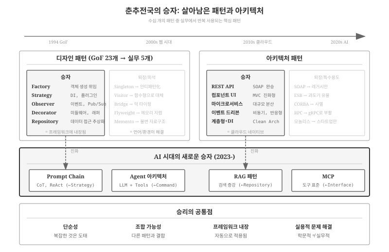
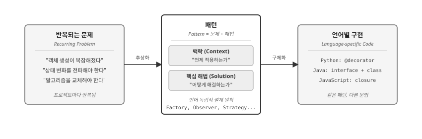
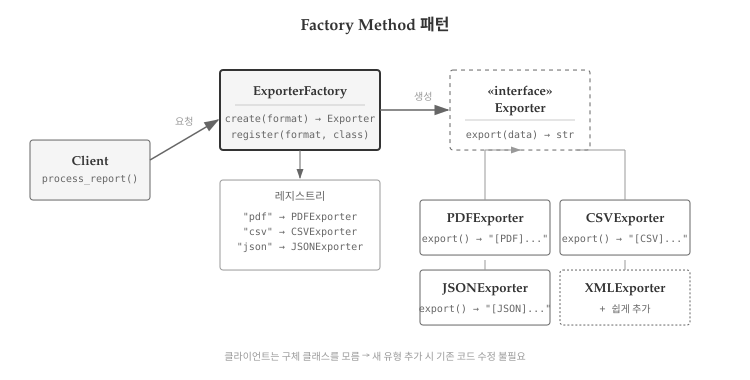
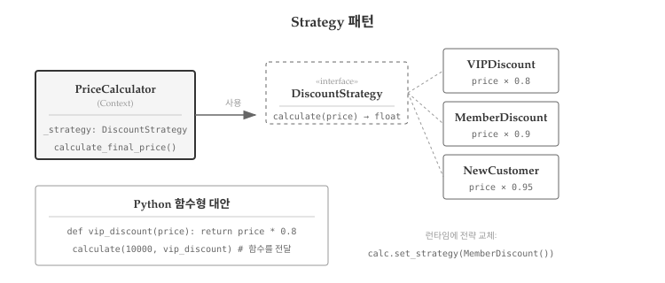
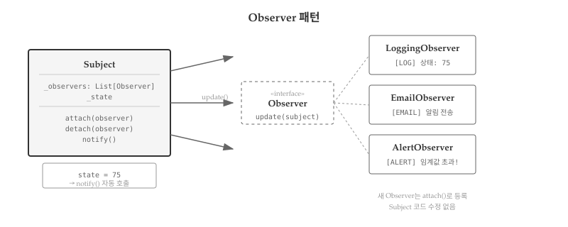
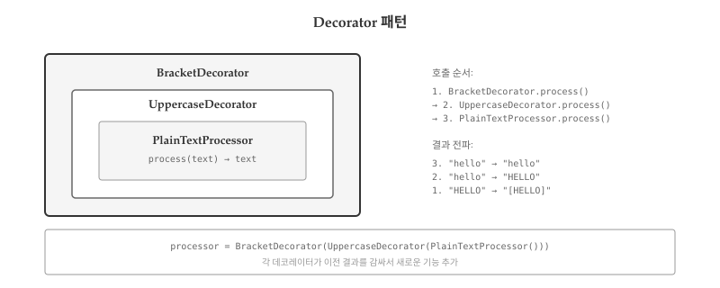
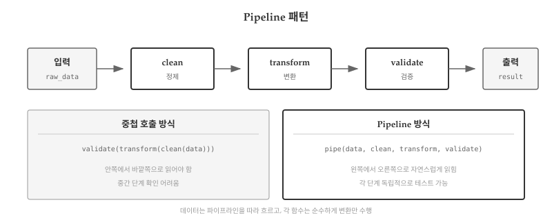
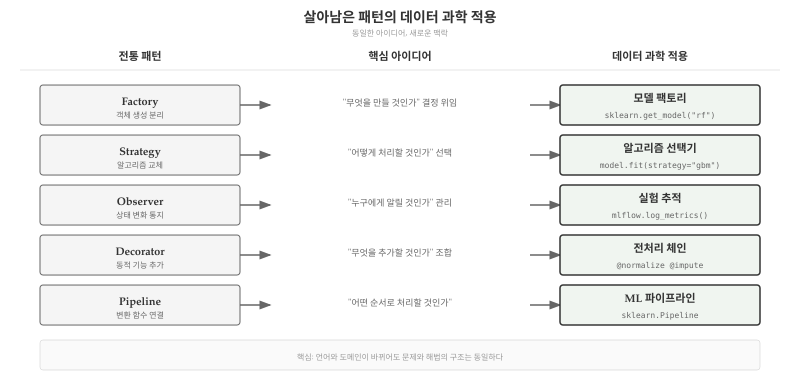
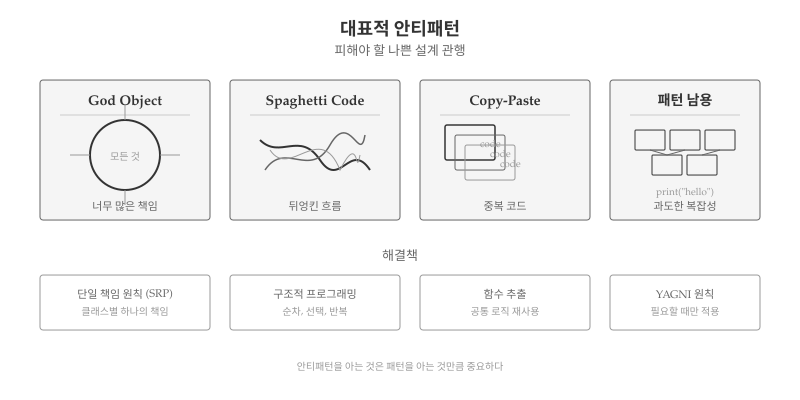

# 살아남은 패턴 {#sec-arch-pattern}

\index{디자인 패턴} \index{살아남은 패턴}

GoF가 1994년 23개 패턴을 정리한 이후 30년이 흘렀다.
그동안 어떤 패턴은 여전히 매일 쓰이고, 어떤 패턴은 잊혔다.
언어가 진화하면서 패턴 자체가 언어 기능으로 흡수되기도 했다.
Iterator는 Python의 `for` 문과 제너레이터가 대신하고, Singleton은 모듈 수준 변수나 의존성 주입이 대체했다.

30년의 자연선택을 거쳐 살아남은 패턴은 무엇일까?
실무에서 반복적으로 마주치는 7개 패턴을 정리한다.

## 왜 7개만 남았나 {#sec-arch-pattern-why-seven}

\index{패턴 진화}

{#fig-pattern-winners}

GoF 23개 패턴 중 실무에서 반복적으로 사용되는 패턴은 손에 꼽을 정도다. 나머지 패턴은 어디로 갔을까? 30년간의 자연선택을 분석하면 명확한 패턴이 보인다.

### 도태된 패턴과 그 이유

**Iterator**는 Python의 `for`/`yield`, Java의 `for-each`, JavaScript의 `for...of`에 흡수되었다. 언어 수준에서 제공되므로 별도 패턴 구현이 불필요해졌다.

**Singleton**은 전역 상태 문제로 안티패턴 취급을 받으며 의존성 주입(DI)으로 대체되었다. 테스트가 어렵고 숨겨진 의존성을 만들어 코드 이해를 방해한다.

**Template Method**는 고차 함수로 대체되었다. 상속 기반 구조보다 함수를 인자로 전달하는 방식이 더 유연하다.

**Visitor**는 패턴 매칭과 멀티디스패치로 대체되었다. Rust의 `match`, Python의 `match-case`가 더 간결한 해법을 제공한다.

**Flyweight**는 메모리가 저렴해지면서 필요성이 줄었다. 문자열 인터닝 같은 경우는 언어 런타임이 자동으로 처리한다.

### 생존 조건

살아남은 패턴에는 공통점이 있다.

**언어에 흡수되지 않았다.** Factory, Observer, Strategy는 언어 기능만으로 해결되지 않는 **설계 결정**을 담고 있다. "어떤 객체를 생성할 것인가", "누구에게 통지할 것인가", "어떤 알고리즘을 사용할 것인가"는 문법이 아니라 설계자가 결정해야 하는 문제다.

**안티패턴으로 인식되지 않았다.** Factory는 Singleton과 같은 생성 패턴이지만, 결합도를 낮추는 방향이라 여전히 권장된다. 전역 상태를 만들지 않고 테스트 가능한 코드를 유도한다.

**함수형 프로그래밍과 공존한다.** Strategy는 고차 함수로 간결하게 구현되고, Observer는 반응형 프로그래밍의 기초가 되었다. OOP 전용이 아니라 **패러다임을 초월한 아이디어**인 패턴이 살아남았다.

| 패턴 | 분류 | 핵심 아이디어 | 데이터 과학 적용 |
|------|------|--------------|-----------------|
| Factory | 생성 | 객체 생성 로직 분리 | 모델 팩토리 |
| Strategy | 행위 | 알고리즘 교체 가능 | 알고리즘 선택기 |
| Observer | 행위 | 상태 변화 전파 | 실험 추적 |
| Decorator | 구조 | 동적 기능 추가 | 전처리 체인 |
| Pipeline | 함수형 | 변환 함수 연결 | ML 파이프라인 |
| Partial | 함수형 | 인자 미리 고정 | 설정 주입 |

: 살아남은 6개 패턴과 데이터 과학 적용 {#tbl-survivor-patterns}

## 패턴이란 무엇인가 {#sec-arch-pattern-what}

\index{패턴 정의}

건축가 크리스토퍼 알렉산더(Christopher Alexander)는 패턴을 "특정 맥락에서 반복적으로 발생하는 문제에 대한 해법"이라고 정의했다 [@Alexander1977].
핵심은 **반복**과 **변형**이다—문제는 반복되지만, 해법은 상황에 맞게 변형된다.

{#fig-pattern-definition}

왼쪽에는 프로젝트마다 반복되는 문제들이 있다.
"객체 생성이 복잡해졌다", "상태 변화를 여러 곳에 전파해야 한다", "알고리즘을 런타임에 교체해야 한다".
가운데 패턴은 **맥락**(언제 적용하는가)과 **핵심 해법**(어떻게 해결하는가)의 쌍으로 문제를 추상화한다.
오른쪽에는 언어별 구현이 있다—같은 Factory라도 Python에서는 딕셔너리 레지스트리로, Java에서는 `interface + class`로, JavaScript에서는 클로저로 구현할 수 있다.

> "같은 해법을 수백만 번 다시 사용할 수 있되, 매번 똑같이 적용하지는 않는다."
> — 크리스토퍼 알렉산더

## 생성: Factory {#sec-arch-pattern-factory}

\index{Factory} \index{팩토리}

### 문제 {#sec-arch-pattern-factory-problem}

클라이언트 코드가 생성할 객체의 정확한 클래스를 미리 알 수 없거나, 여러 클래스 중 런타임에 선택해야 할 때 문제가 발생한다.

```{python}
#| label: arch-pattern-factory-problem
# 문제: 직접 생성 시 결합도 증가
class PDFExporter:
    def export(self, data):
        return f"[PDF] {data}"

class CSVExporter:
    def export(self, data):
        return f"[CSV] {data}"

class JSONExporter:
    def export(self, data):
        return f"[JSON] {data}"

# 클라이언트가 구체 클래스를 모두 알아야 함
def process_report(data, format_type):
    if format_type == "pdf":
        exporter = PDFExporter()
    elif format_type == "csv":
        exporter = CSVExporter()
    elif format_type == "json":
        exporter = JSONExporter()
    else:
        raise ValueError(f"지원하지 않는 형식: {format_type}")

    return exporter.export(data)

print(process_report("매출 보고서", "pdf"))
```

`process_report` 함수가 모든 Exporter 클래스를 직접 알고 있다.
XML 형식을 추가하려면 `XMLExporter` 클래스를 만들고, `if-elif` 체인도 수정해야 한다.

### 해법 {#sec-arch-pattern-factory-solution}

{#fig-pattern-factory}

Factory 패턴은 **객체 생성 책임을 분리**한다.
클라이언트는 형식 문자열만 전달하고, Factory가 적절한 객체를 반환한다.

```{python}
#| label: arch-pattern-factory-impl
from abc import ABC, abstractmethod

# Product 인터페이스
class Exporter(ABC):
    @abstractmethod
    def export(self, data: str) -> str:
        pass

# ConcreteProduct들
class PDFExporter(Exporter):
    def export(self, data: str) -> str:
        return f"[PDF] {data}"

class CSVExporter(Exporter):
    def export(self, data: str) -> str:
        return f"[CSV] {data}"

class JSONExporter(Exporter):
    def export(self, data: str) -> str:
        return f"[JSON] {data}"

# Factory - 딕셔너리 레지스트리 방식
class ExporterFactory:
    _exporters = {
        "pdf": PDFExporter,
        "csv": CSVExporter,
        "json": JSONExporter,
    }

    @classmethod
    def create(cls, format_type: str) -> Exporter:
        exporter_class = cls._exporters.get(format_type)
        if exporter_class is None:
            supported = ", ".join(cls._exporters.keys())
            raise ValueError(f"'{format_type}'은(는) 지원하지 않습니다. 지원 형식: {supported}")
        return exporter_class()

    @classmethod
    def register(cls, format_type: str, exporter_class):
        cls._exporters[format_type] = exporter_class

# 클라이언트 코드 - 구체 클래스를 모름
def process_report(data: str, format_type: str) -> str:
    exporter = ExporterFactory.create(format_type)
    return exporter.export(data)

print(process_report("매출 보고서", "pdf"))
print(process_report("재고 현황", "csv"))
```

### 확장 {#sec-arch-pattern-factory-extend}

XML 형식을 추가해도 기존 코드를 수정하지 않는다.
새 클래스를 만들고 등록만 하면 된다.

```{python}
#| label: arch-pattern-factory-extend
# 새 형식 추가 - 기존 코드 수정 없음
class XMLExporter(Exporter):
    def export(self, data: str) -> str:
        return f"<data>{data}</data>"

ExporterFactory.register("xml", XMLExporter)
print(process_report("설정 파일", "xml"))
```

**개방-폐쇄 원칙(OCP)**이 적용되었다—확장에는 열려 있고, 수정에는 닫혀 있다.

### 함수형 대안 {#sec-arch-pattern-factory-functional}

Python에서는 클래스 없이 함수와 딕셔너리만으로도 Factory를 구현할 수 있다.

```{python}
#| label: arch-pattern-factory-functional
# 함수형 Factory
EXPORTERS = {
    "pdf": lambda data: f"[PDF] {data}",
    "csv": lambda data: f"[CSV] {data}",
    "json": lambda data: f"[JSON] {data}",
}

def create_exporter(format_type):
    return EXPORTERS.get(format_type, lambda data: data)

exporter = create_exporter("pdf")
print(exporter("간단한 보고서"))
```

단순한 경우에는 함수형 접근이 더 간결하다.
객체 상태가 필요하면 클래스 기반 Factory가 적합하다.

## 행위: Strategy {#sec-arch-pattern-strategy}

\index{Strategy} \index{전략 패턴}

### 문제 {#sec-arch-pattern-strategy-problem}

동일한 문제를 해결하는 **여러 알고리즘**이 있고, 런타임에 알고리즘을 **교체**해야 한다.
할인 계산, 정렬 방식, 압축 알고리즘, 인증 방식 등이 전형적인 예다.

```{python}
#| label: arch-pattern-strategy-problem
# 문제: 조건문으로 알고리즘 선택
def calculate_discount(price, customer_type):
    if customer_type == "vip":
        return price * 0.8  # 20% 할인
    elif customer_type == "member":
        return price * 0.9  # 10% 할인
    elif customer_type == "new":
        return price * 0.95  # 5% 할인
    else:
        return price

print(calculate_discount(10000, "vip"))
```

고객 유형이 추가될 때마다 `elif`가 늘어난다.

### 해법 {#sec-arch-pattern-strategy-solution}

{#fig-pattern-strategy}

Strategy 패턴은 각 알고리즘을 **독립된 객체**로 분리한다.

```{python}
#| label: arch-pattern-strategy-class
from abc import ABC, abstractmethod

# Strategy 인터페이스
class DiscountStrategy(ABC):
    @abstractmethod
    def calculate(self, price: float) -> float:
        pass

# ConcreteStrategy들
class VIPDiscount(DiscountStrategy):
    def calculate(self, price: float) -> float:
        return price * 0.8

class MemberDiscount(DiscountStrategy):
    def calculate(self, price: float) -> float:
        return price * 0.9

class NoDiscount(DiscountStrategy):
    def calculate(self, price: float) -> float:
        return price

# Context
class PriceCalculator:
    def __init__(self, strategy: DiscountStrategy):
        self._strategy = strategy

    def set_strategy(self, strategy: DiscountStrategy):
        self._strategy = strategy

    def calculate_final_price(self, price: float) -> float:
        return self._strategy.calculate(price)

# 사용
calculator = PriceCalculator(VIPDiscount())
print(f"VIP 가격: {calculator.calculate_final_price(10000)}원")

calculator.set_strategy(MemberDiscount())
print(f"회원 가격: {calculator.calculate_final_price(10000)}원")
```

### 함수형 Strategy {#sec-arch-pattern-strategy-functional}

Python에서는 함수가 일급 객체이므로, **함수를 전략으로** 사용할 수 있다.

```{python}
#| label: arch-pattern-strategy-functional
# 함수형 Strategy
def vip_discount(price):
    return price * 0.8

def member_discount(price):
    return price * 0.9

def no_discount(price):
    return price

DISCOUNT_STRATEGIES = {
    "vip": vip_discount,
    "member": member_discount,
    "normal": no_discount,
}

def get_final_price(price, customer_type):
    strategy = DISCOUNT_STRATEGIES.get(customer_type, no_discount)
    return strategy(price)

print(f"VIP: {get_final_price(10000, 'vip')}원")
print(f"회원: {get_final_price(10000, 'member')}원")
```

5부 함수형 프로그래밍에서 배운 **고차 함수**가 Strategy 패턴의 함수형 구현이다.

## 행위: Observer {#sec-arch-pattern-observer}

\index{Observer} \index{옵저버}

### 문제 {#sec-arch-pattern-observer-problem}

5부 반응형 프로그래밍에서 이미 Observer 패턴의 기초를 다뤘다.
**Observer 패턴**은 객체 간 **일대다 의존 관계**를 정의한다.
하나의 객체(Subject)가 변경되면, 그에 의존하는 모든 객체(Observer)가 자동으로 통지받고 갱신된다.

### 해법 {#sec-arch-pattern-observer-solution}

{#fig-pattern-observer}

```{python}
#| label: arch-pattern-observer-impl
from abc import ABC, abstractmethod
from typing import List

# Observer 인터페이스
class Observer(ABC):
    @abstractmethod
    def update(self, subject: 'Subject') -> None:
        pass

# Subject
class Subject:
    def __init__(self):
        self._observers: List[Observer] = []
        self._state = None

    def attach(self, observer: Observer) -> None:
        if observer not in self._observers:
            self._observers.append(observer)

    def detach(self, observer: Observer) -> None:
        self._observers.remove(observer)

    def notify(self) -> None:
        for observer in self._observers:
            observer.update(self)

    @property
    def state(self):
        return self._state

    @state.setter
    def state(self, value):
        self._state = value
        self.notify()

# ConcreteObserver
class LoggingObserver(Observer):
    def update(self, subject: Subject) -> None:
        print(f"[LOG] 상태 변경: {subject.state}")

class AlertObserver(Observer):
    def __init__(self, threshold):
        self._threshold = threshold

    def update(self, subject: Subject) -> None:
        if isinstance(subject.state, (int, float)) and subject.state > self._threshold:
            print(f"[ALERT] 경고: 값 {subject.state}이(가) 임계값 초과!")

# 사용
subject = Subject()
subject.attach(LoggingObserver())
subject.attach(AlertObserver(threshold=50))

subject.state = 30
print()
subject.state = 75
```

### 함수형 Observer {#sec-arch-pattern-observer-functional}

클래스 대신 함수를 콜백으로 등록할 수도 있다.

```{python}
#| label: arch-pattern-observer-functional
class EventEmitter:
    def __init__(self):
        self._listeners = {}

    def on(self, event: str, callback):
        if event not in self._listeners:
            self._listeners[event] = []
        self._listeners[event].append(callback)

    def emit(self, event: str, *args, **kwargs):
        if event in self._listeners:
            for callback in self._listeners[event]:
                callback(*args, **kwargs)

# 사용
emitter = EventEmitter()
emitter.on("data", lambda x: print(f"받은 데이터: {x}"))
emitter.on("error", lambda e: print(f"오류 발생: {e}"))

emitter.emit("data", "Hello, World!")
emitter.emit("error", "연결 실패")
```

JavaScript의 EventEmitter, Node.js의 이벤트 시스템과 유사한 패턴이다.

## 구조: Decorator {#sec-arch-pattern-decorator}

\index{Decorator} \index{데코레이터}

### 문제 {#sec-arch-pattern-decorator-problem}

기존 객체의 기능을 **동적으로 확장**하고 싶을 때, 상속을 사용하면 클래스가 폭발한다.
"로깅 기능이 있는 파일 읽기"와 "암호화 기능이 있는 파일 읽기"를 각각 만들면, "로깅과 암호화 모두"는 또 다른 클래스가 필요하다.

### 해법 {#sec-arch-pattern-decorator-solution}

{#fig-pattern-decorator}

Decorator 패턴은 객체를 **감싸서** 새로운 기능을 추가하되, 원래 인터페이스는 그대로 유지한다.

```{python}
#| label: arch-pattern-decorator-impl
from abc import ABC, abstractmethod

# Component 인터페이스
class TextProcessor(ABC):
    @abstractmethod
    def process(self, text: str) -> str:
        pass

# ConcreteComponent
class PlainTextProcessor(TextProcessor):
    def process(self, text: str) -> str:
        return text

# Decorator 기반 클래스
class TextDecorator(TextProcessor):
    def __init__(self, processor: TextProcessor):
        self._processor = processor

    def process(self, text: str) -> str:
        return self._processor.process(text)

# ConcreteDecorator들
class UppercaseDecorator(TextDecorator):
    def process(self, text: str) -> str:
        return super().process(text).upper()

class TrimDecorator(TextDecorator):
    def process(self, text: str) -> str:
        return super().process(text).strip()

class BracketDecorator(TextDecorator):
    def process(self, text: str) -> str:
        return f"[{super().process(text)}]"

# 자유롭게 조합
processor = PlainTextProcessor()
processor = TrimDecorator(processor)
processor = UppercaseDecorator(processor)
processor = BracketDecorator(processor)

print(processor.process("   hello world   "))
```

### Python @decorator {#sec-arch-pattern-decorator-python}

Python의 `@decorator` 문법은 GoF Decorator 패턴과 **이름은 같지만 다른 개념**이다.
Python 데코레이터는 함수나 클래스를 **감싸는 함수**로, 메타프로그래밍 도구다.
그러나 "기존 동작에 새 동작을 추가"한다는 점에서 유사하다.

```{python}
#| label: arch-pattern-decorator-python
import time
from functools import wraps

def timing(func):
    """함수 실행 시간을 측정한다."""
    @wraps(func)
    def wrapper(*args, **kwargs):
        start = time.time()
        result = func(*args, **kwargs)
        elapsed = time.time() - start
        print(f"[TIMING] {func.__name__}: {elapsed:.4f}초")
        return result
    return wrapper

def retry(max_attempts=3):
    """실패 시 재시도하는 데코레이터"""
    def decorator(func):
        @wraps(func)
        def wrapper(*args, **kwargs):
            for attempt in range(1, max_attempts + 1):
                try:
                    return func(*args, **kwargs)
                except Exception as e:
                    print(f"[RETRY] 시도 {attempt}/{max_attempts} 실패: {e}")
                    if attempt == max_attempts:
                        raise
        return wrapper
    return decorator

@timing
@retry(max_attempts=2)
def fetch_data(url):
    time.sleep(0.1)
    return f"데이터 from {url}"

result = fetch_data("https://api.example.com")
print(result)
```

## 함수형: Pipeline {#sec-arch-pattern-pipeline}

\index{Pipeline} \index{파이프라인}

### 패턴 설명 {#sec-arch-pattern-pipeline-intro}

**Pipeline 패턴**은 데이터가 여러 함수를 **순차적으로 통과**하며 변환되는 구조다.
Unix의 파이프(`|`)나 pandas의 메서드 체이닝이 대표적 예다.

### Python 구현 {#sec-arch-pattern-pipeline-impl}

```{python}
#| label: arch-pattern-pipeline-impl
from functools import reduce

def pipeline(*functions):
    """함수들을 파이프라인으로 연결한다."""
    def piped(data):
        return reduce(lambda x, f: f(x), functions, data)
    return piped

# 개별 변환 함수들
def strip_whitespace(text):
    return text.strip()

def to_lowercase(text):
    return text.lower()

def remove_punctuation(text):
    import string
    return text.translate(str.maketrans('', '', string.punctuation))

def split_words(text):
    return text.split()

# 파이프라인 구성
text_processor = pipeline(
    strip_whitespace,
    to_lowercase,
    remove_punctuation,
    split_words,
)

raw_text = "  Hello, World! This is a TEST.  "
print(text_processor(raw_text))
```

`pipeline(f, g, h)(x)`는 `h(g(f(x)))`와 같다.
각 함수가 독립적이므로, 순서를 바꾸거나 새 단계를 추가하기 쉽다.

{#fig-pattern-pipeline}

### 실전 예제: 데이터 전처리 {#sec-arch-pattern-pipeline-data}

```{python}
#| label: arch-pattern-pipeline-data
def filter_valid(records):
    return [r for r in records if r.get("value") is not None]

def normalize_values(records):
    if not records:
        return records
    max_val = max(r["value"] for r in records)
    return [{**r, "value": r["value"] / max_val} for r in records]

def add_category(records):
    def categorize(val):
        if val >= 0.7: return "high"
        if val >= 0.3: return "medium"
        return "low"
    return [{**r, "category": categorize(r["value"])} for r in records]

data_pipeline = pipeline(filter_valid, normalize_values, add_category)

raw_data = [
    {"id": 1, "value": 100},
    {"id": 2, "value": None},
    {"id": 3, "value": 50},
]

for record in data_pipeline(raw_data):
    print(record)
```

## 함수형: Partial Application {#sec-arch-pattern-partial}

\index{Partial Application}

### 개념 설명 {#sec-arch-pattern-partial-concept}

**Partial Application**은 함수의 일부 인자를 **미리 고정**하여 새 함수를 만드는 것이다.
`f(a, b, c)`에서 `a=1`을 고정하면 `g(b, c) = f(1, b, c)`가 된다.

### Python 구현 {#sec-arch-pattern-partial-impl}

```{python}
#| label: arch-pattern-partial-impl
from functools import partial

def greet(greeting, name, punctuation):
    return f"{greeting}, {name}{punctuation}"

# Partial Application: greeting 고정
greet_hello = partial(greet, "안녕하세요")
greet_goodbye = partial(greet, "안녕히 가세요")

print(greet_hello("철수", "!"))
print(greet_goodbye("영희", "~"))

# 더 많은 인자 고정
greet_formal = partial(greet, "안녕하십니까", punctuation=".")
print(greet_formal("김 사장님"))
```

### 실전 예제: 설정 주입 {#sec-arch-pattern-partial-config}

Partial Application은 **의존성 주입**에 유용하다.
함수에 설정을 미리 주입하면 나중에 호출할 때 핵심 인자만 전달하면 된다.

```{python}
#| label: arch-pattern-partial-config
def fetch_data(base_url, api_key, endpoint):
    return f"[{base_url}/{endpoint}] with key={api_key[:4]}..."

# 설정을 미리 주입
fetch_from_api_v1 = partial(
    fetch_data,
    base_url="https://api.v1.example.com",
    api_key="secret123456"
)

fetch_from_api_v2 = partial(
    fetch_data,
    base_url="https://api.v2.example.com",
    api_key="newsecret789"
)

# 사용 시에는 endpoint만 전달
print(fetch_from_api_v1(endpoint="users"))
print(fetch_from_api_v2(endpoint="products"))
```

## 패턴 조합 {#sec-arch-pattern-composition}

\index{패턴 조합}

실제 시스템에서는 여러 패턴이 함께 사용된다.
Factory가 Strategy를 생성하고, Observer가 상태 변화를 전파하는 구조가 흔하다.

```{python}
#| label: arch-pattern-composition
# Factory + Strategy + Observer 조합
class NotificationStrategy(ABC):
    @abstractmethod
    def send(self, message: str) -> None:
        pass

class EmailNotification(NotificationStrategy):
    def send(self, message: str) -> None:
        print(f"[EMAIL] {message}")

class SlackNotification(NotificationStrategy):
    def send(self, message: str) -> None:
        print(f"[SLACK] {message}")

# Factory
class NotificationFactory:
    _strategies = {
        "email": EmailNotification,
        "slack": SlackNotification,
    }

    @classmethod
    def create(cls, channel: str) -> NotificationStrategy:
        return cls._strategies.get(channel, EmailNotification)()

# Observer + Strategy
class OrderSystem(Subject):
    def __init__(self):
        super().__init__()
        self._notifiers = []

    def add_notifier(self, channel: str):
        notifier = NotificationFactory.create(channel)
        self._notifiers.append(notifier)

    def place_order(self, order_id: str):
        self.state = f"주문 {order_id} 접수됨"
        for notifier in self._notifiers:
            notifier.send(self.state)

# 사용
order_system = OrderSystem()
order_system.attach(LoggingObserver())
order_system.add_notifier("email")
order_system.add_notifier("slack")

order_system.place_order("ORD-12345")
```

## 데이터 과학에서의 패턴 적용 {#sec-arch-pattern-ds}

\index{데이터 과학 패턴}

살아남은 패턴은 데이터 과학과 머신러닝 영역에서도 동일한 문제를 해결한다. 웹 개발에서 검증된 패턴이 ML 파이프라인에서 어떻게 적용되는지 살펴본다.

{#fig-pattern-ds-application}

### Factory → 모델 팩토리 {#sec-arch-pattern-ds-factory}

scikit-learn의 모델 선택은 Factory 패턴의 전형적인 적용 사례다. 클라이언트 코드가 구체적인 모델 클래스를 알 필요 없이, 문자열로 모델을 요청하면 팩토리가 적절한 객체를 반환한다.

```{python}
#| label: arch-pattern-ds-factory
# 데이터 과학에서의 Factory 패턴
def create_model(model_type: str, **params):
    """모델 타입에 따라 적절한 모델을 생성한다."""
    models = {
        "rf": lambda: {"name": "RandomForest", "params": params},
        "gbm": lambda: {"name": "GradientBoosting", "params": params},
        "svm": lambda: {"name": "SVM", "params": params},
    }
    creator = models.get(model_type)
    if creator is None:
        raise ValueError(f"지원하지 않는 모델: {model_type}")
    return creator()

# 설정 파일에서 모델 타입만 읽어서 생성
config = {"model_type": "rf", "n_estimators": 100}
model = create_model(config["model_type"], n_estimators=config.get("n_estimators", 50))
print(f"생성된 모델: {model}")
```

AutoML 도구들(Auto-sklearn, FLAML)은 이 패턴을 확장하여 모델 선택 자체를 자동화한다.

### Strategy → 알고리즘 선택기 {#sec-arch-pattern-ds-strategy}

하이퍼파라미터 튜닝에서 탐색 전략(Grid Search, Random Search, Bayesian Optimization)을 교체하는 것이 Strategy 패턴이다.

```{python}
#| label: arch-pattern-ds-strategy
# 탐색 전략을 교체 가능하게 구성
def grid_search(param_grid):
    return f"Grid Search: {len(param_grid)} combinations"

def random_search(param_grid, n_iter=10):
    return f"Random Search: {n_iter} samples"

def bayesian_search(param_grid, n_trials=20):
    return f"Bayesian Optimization: {n_trials} trials"

# 전략 선택
SEARCH_STRATEGIES = {
    "grid": grid_search,
    "random": random_search,
    "bayesian": bayesian_search,
}

def tune_model(param_grid, strategy="random", **kwargs):
    search_fn = SEARCH_STRATEGIES.get(strategy, random_search)
    return search_fn(param_grid, **kwargs)

params = {"learning_rate": [0.01, 0.1], "max_depth": [3, 5, 7]}
print(tune_model(params, strategy="grid"))
print(tune_model(params, strategy="bayesian", n_trials=30))
```

### Observer → 실험 추적 {#sec-arch-pattern-ds-observer}

MLflow, Weights & Biases 같은 실험 추적 도구는 Observer 패턴을 구현한다. 학습 중 메트릭이 변경될 때마다 여러 Observer(로깅, 시각화, 알림)가 자동으로 통지받는다.

```{python}
#| label: arch-pattern-ds-observer
# 실험 추적 시스템의 Observer 패턴
class ExperimentTracker:
    def __init__(self):
        self._observers = []

    def add_observer(self, observer):
        self._observers.append(observer)

    def log_metric(self, name: str, value: float, step: int):
        for observer in self._observers:
            observer(name, value, step)

# Observer 함수들
def console_logger(name, value, step):
    print(f"[Step {step}] {name}: {value:.4f}")

def alert_on_nan(name, value, step):
    if value != value:  # NaN 체크
        print(f"[ALERT] NaN detected in {name} at step {step}")

# 학습 루프에서 사용
tracker = ExperimentTracker()
tracker.add_observer(console_logger)
tracker.add_observer(alert_on_nan)

# 학습 중 메트릭 기록
for epoch in range(3):
    tracker.log_metric("loss", 0.5 - epoch * 0.1, epoch)
```

### Pipeline → ML 파이프라인 {#sec-arch-pattern-ds-pipeline}

scikit-learn의 `Pipeline`은 함수형 Pipeline 패턴의 데이터 과학 버전이다. 전처리, 피처 엔지니어링, 모델 학습을 하나의 파이프라인으로 구성한다.

```{python}
#| label: arch-pattern-ds-pipeline
from functools import reduce

# ML 파이프라인의 단순화된 구현
def make_pipeline(*steps):
    """sklearn.Pipeline의 간소화 버전"""
    def pipeline(X):
        return reduce(lambda data, step: step(data), steps, X)
    return pipeline

# 전처리 단계들
def fill_missing(data):
    return [0 if x is None else x for x in data]

def scale(data):
    max_val = max(data) if data else 1
    return [x / max_val for x in data]

def to_features(data):
    return {"features": data, "n_samples": len(data)}

# 파이프라인 구성
preprocessing = make_pipeline(fill_missing, scale, to_features)

raw_data = [100, None, 50, 200]
result = preprocessing(raw_data)
print(result)
```

실제 프로젝트에서는 `sklearn.pipeline.Pipeline`, Prefect, Airflow 같은 도구가 이 패턴을 제공한다.

## 안티패턴 {#sec-arch-pattern-antipattern}

\index{안티패턴} \index{YAGNI}

패턴을 과도하게 적용하면 오히려 문제가 된다.

{#fig-pattern-antipattern}

**God Object**: 하나의 클래스가 너무 많은 책임을 진다. 수천 줄짜리 `Manager` 클래스가 전형적인 예다.

**패턴 만능주의**: 단순한 문제에 복잡한 패턴을 적용한다. 설정 파일 하나 읽는 데 Factory + Builder + Strategy를 동원할 필요는 없다.

**Spaghetti Code**: 구조 없이 코드가 얽혀 있다. 패턴은 이를 방지하지만, 과도한 추상화는 다른 형태의 복잡성을 만든다.

::: {.callout-warning}
## YAGNI - You Aren't Gonna Need It

패턴을 적용하기 전에 자문하라: "정말 필요한가?"
미래의 확장성을 위해 지금 복잡성을 추가하는 것은 대부분 낭비다.
현재 문제를 가장 단순하게 해결하고, 나중에 필요하면 리팩토링하라.
:::

## 디버깅 {#sec-arch-pattern-debug}

\index{패턴 디버깅}

### Factory 디버깅 {#sec-arch-pattern-debug-factory}

Factory에서 자주 발생하는 오류는 **등록되지 않은 타입 요청**이다.

```{python}
#| label: arch-pattern-debug-factory
#| error: true
try:
    exporter = ExporterFactory.create("excel")
except ValueError as e:
    print(f"오류: {e}")
```

지원 형식 목록을 제공하고, 명확한 에러 메시지로 안내한다.

### Observer 디버깅 {#sec-arch-pattern-debug-observer}

Observer에서 자주 발생하는 문제:

1. **순환 통지**: A가 B를 통지하고, B가 다시 A를 통지하여 무한 루프
2. **메모리 누수**: Observer를 해제하지 않아 메모리에 남음
3. **순서 의존성**: Observer 호출 순서에 의존하는 로직

### Pipeline 디버깅 {#sec-arch-pattern-debug-pipeline}

파이프라인에서 어느 단계에서 문제가 발생했는지 파악하기 어려울 수 있다.
**로깅 래퍼**를 사용하면 각 단계를 추적할 수 있다.

```{python}
#| label: arch-pattern-debug-pipeline
def debug_step(name):
    def decorator(func):
        def wrapper(data):
            print(f"[{name}] 입력: {str(data)[:30]}...")
            result = func(data)
            print(f"[{name}] 출력: {str(result)[:30]}...")
            return result
        return wrapper
    return decorator

@debug_step("1. Strip")
def debug_strip(text):
    return text.strip()

@debug_step("2. Lower")
def debug_lower(text):
    return text.lower()

debug_pipeline = pipeline(debug_strip, debug_lower)
debug_pipeline("  Hello World!  ")
```

::: {.content-visible when-format="pdf"}
\faLightbulb\ 생각해볼 점
:::

::: {.content-visible when-format="html"}
## 💡 생각해볼 점 {.unnumbered}
:::

### 패턴의 본질

살아남은 패턴의 공통점은 **패러다임을 초월한 아이디어**라는 점이다. Factory는 OOP에서 딕셔너리 레지스트리로, Strategy는 고차 함수로, Observer는 이벤트 이미터로 구현할 수 있다. 언어와 패러다임이 바뀌어도 핵심 문제와 해법은 동일하다.

| 패턴 | 핵심 질문 | 전통 구현 | 데이터 과학 구현 |
|------|----------|----------|-----------------|
| Factory | 무엇을 만들 것인가? | 딕셔너리 레지스트리 | 모델 팩토리 |
| Strategy | 어떻게 처리할 것인가? | 함수 전달 | 알고리즘 선택기 |
| Observer | 누구에게 알릴 것인가? | 이벤트 이미터 | 실험 추적 |
| Decorator | 무엇을 추가할 것인가? | @decorator | 전처리 체인 |
| Pipeline | 어떤 순서로? | reduce + 함수 | sklearn.Pipeline |

: 패턴의 핵심 질문과 구현 {#tbl-pattern-essence}

### 패턴 적용 기준

패턴을 적용할지 결정할 때 세 가지를 자문하라.

1. **이 문제가 반복되는가?** 한 번만 발생하는 문제에 패턴을 적용하면 과잉 설계다.
2. **해법을 분리하면 유연성이 생기는가?** 분리해도 변경 가능성이 없다면 복잡성만 증가한다.
3. **지금 당장 필요한가?** 미래의 확장성을 위해 현재 복잡성을 추가하는 것은 대부분 낭비다.

세 질문 모두에 "예"일 때만 패턴을 적용하라. YAGNI(You Aren't Gonna Need It) 원칙을 기억하자.

### 데이터 과학에서의 패턴

앞서 살펴본 것처럼, 살아남은 패턴은 데이터 과학 프로젝트에서도 동일한 문제를 해결한다. scikit-learn의 `Pipeline`은 함수형 Pipeline 패턴이고, MLflow의 실험 추적은 Observer 패턴이다. 웹 개발과 ML 엔지니어링이 다른 도메인처럼 보이지만, 설계 문제의 본질은 같다.

차이점은 **불확실성의 수준**이다. 웹 개발에서 Factory가 생성하는 객체는 결정적(deterministic)이지만, ML에서 모델 팩토리가 생성하는 모델은 확률적(probabilistic)이다. Strategy 패턴으로 교체하는 알고리즘이 명시적 규칙이 아니라 학습된 모델이라는 점이 다르다.

### 패턴만으로 해결할 수 없는 문제

전통적인 패턴에는 근본적인 한계가 있다. 모든 패턴은 개발자가 **규칙을 명시적으로 작성**한다는 전제 위에 서 있다. Strategy 패턴으로 알고리즘을 교체하려면 가능한 알고리즘을 미리 정의해야 하고, Factory 패턴으로 객체를 생성하려면 모든 케이스를 분기해야 한다.

문제는 모든 경우를 규칙으로 표현할 수 없다는 점이다. 고양이 사진인지 개 사진인지 구분하는 규칙을 `if-else`로 작성할 수 있는가? 자연어 질문에 적절한 답변을 생성하는 규칙을 명시할 수 있는가? 이러한 문제는 규칙 기반 패러다임—**Software 1.0**—의 영역을 넘어선다.

다음 파트에서는 규칙 대신 **데이터에서 패턴을 학습**하는 새로운 패러다임을 다룬다. 기계학습은 개발자가 규칙을 작성하는 대신 데이터와 모델이 규칙을 도출한다. 이것이 **Software 2.0**이며, 전통적인 디자인 패턴과는 완전히 다른 사고방식을 요구한다. 그러나 Factory, Strategy, Observer, Pipeline 같은 구조적 패턴은 ML 시스템에서도 여전히 유효하다—다만 그 안에 담기는 내용이 명시적 규칙에서 학습된 모델로 바뀔 뿐이다.

\index{패턴!요약}
