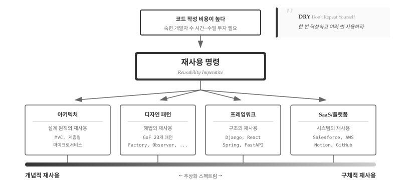
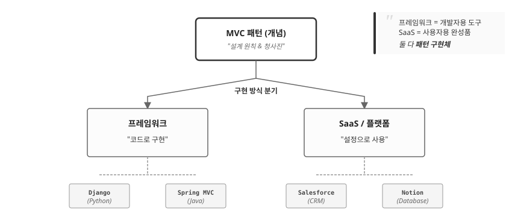
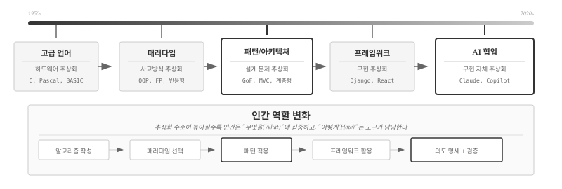
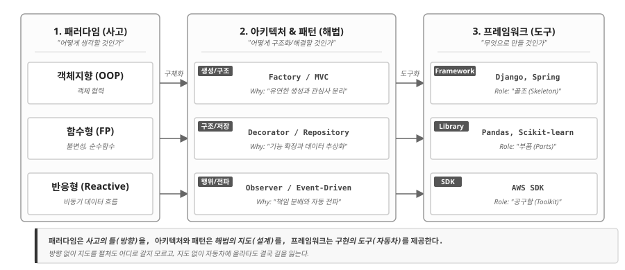
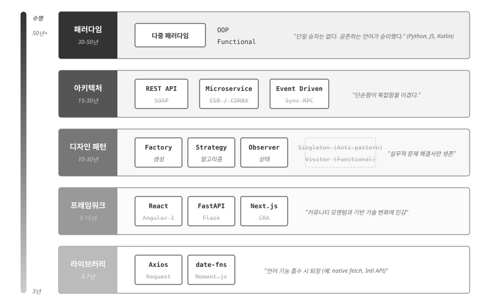
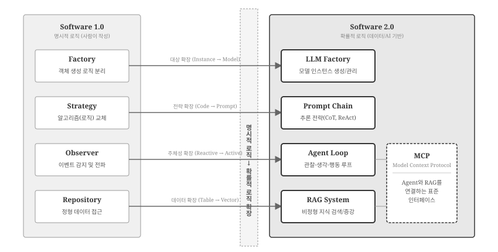

# 재사용 명령 {#sec-arch-reuse}

\index{재사용} \index{Reusability Imperative} \index{소프트웨어 설계}

5부에서 프로그래밍 패러다임을 배웠다.
명령형, 객체지향, 함수형, 선언형, 반응형—각 패러다임은 문제를 바라보는 **세계관**을 제시했다.
그렇다면 이제 무엇을 해야 하는가?

6부에서는 패러다임을 실제 코드로 구현하는 **설계 원칙**을 다룬다.
추상적인 세계관을 구체적인 구조로 번역하는 것이다.
이 번역 과정에서 핵심 키워드는 **재사용(Reuse)**이다.

## 왜 재사용인가 {#sec-arch-reuse-why}

\index{DRY 원칙} \index{코드 비용} \index{McIlroy} \index{Parnas}

소프트웨어 공학의 역사는 곧 **재사용의 역사**다.
1968년 NATO 소프트웨어 공학 컨퍼런스(가르미슈, 독일)에서 맥일로이(M. Douglas McIlroy)는 "대량 생산 가능한 소프트웨어 컴포넌트(Mass Produced Software Components)"를 제안했다[@McIlroy1968].
마치 전자 부품(Software ICs)처럼 표준화된 소프트웨어 모듈을 조립하여 시스템을 구축하자는 비전이었다.
현대의 컴포넌트 기반 개발(Component-Based Development)은 여기서 시작되었다.
4년 후 파나스(David Parnas)는 "정보 은닉(Information Hiding)" 원칙을 제시하며 모듈 분해의 기준을 명확히 했다[@Parnas1972].
모듈은 내부의 설계 결정을 숨겨야 하며, 이를 통해 시스템의 변경 용이성(Changeability)과 유지보수성을 높일 수 있다는 주장이었다.

코드 작성 비용이 높았기 때문이다.
1970년대 한 줄의 코드를 작성하는 데 드는 비용은 현재 가치로 수십 달러에 달했다.
숙련된 개발자가 수 시간에서 수일을 투자해야 제대로 작동하는 코드가 나왔고, 디버깅과 테스트에 더 많은 시간이 들었다.

이 경제적 현실이 **재사용 명령(Reusability Imperative)**을 낳았다.
"한 번 작성하고 여러 번 사용하라(Write Once, Use Many)"는 당연한 경제적 선택이었다[@Krueger1992].
DRY(Don't Repeat Yourself) 원칙, 모듈화, 컴포넌트 기반 개발—모두 이 명령에서 비롯된 것이다.

## 재사용 스펙트럼 {#sec-arch-reuse-spectrum}

\index{디자인 패턴} \index{아키텍처 패턴} \index{프레임워크} \index{SaaS}

재사용 명령을 실현하기 위해 소프트웨어 공학은 다양한 해법을 발전시켜 왔다.
흥미로운 점은 이 해법들이 **추상화 수준**에 따라 뚜렷한 스펙트럼을 형성한다는 것이다.
가장 추상적인 "설계 원칙의 재사용"에서 시작하여, 점점 구체적인 "시스템의 재사용"까지 연속체를 이룬다.

{#fig-arch-reuse-hierarchy}

@fig-arch-reuse-hierarchy 는 재사용 해법들을 추상화 수준에 따라 배치한다.
맨 위의 "코드 작성 비용이 높다"는 문제에서 출발하여 "재사용 명령"이라는 원칙이 도출된다.
하단의 추상화 스펙트럼은 네 가지 접근법을 **개념적**(왼쪽)에서 **구체적**(오른쪽)으로 배열한다.
왼쪽으로 갈수록 아이디어만 빌려오고 구현은 직접 하며, 오른쪽으로 갈수록 완성된 코드나 시스템을 그대로 사용한다.

### 스펙트럼의 네 영역

스펙트럼을 따라 네 가지 재사용 영역이 배치된다.
왼쪽 끝의 아키텍처부터 오른쪽 끝의 SaaS까지, 각 영역은 "무엇을 재사용하는가"와 "얼마나 직접 구현하는가"에서 뚜렷이 구분된다.
하나씩 살펴보자.

**아키텍처**는 설계 원칙의 재사용이다.
MVC, 계층형 아키텍처, 마이크로서비스는 시스템 전체를 어떻게 구조화할지에 대한 검증된 청사진이다.
가장 추상적인 수준에서 "전체 그림"을 제시하므로 스펙트럼 맨 왼쪽에 위치한다.
매번 아키텍처를 고민할 필요 없이, 문제 유형에 맞는 아키텍처를 선택하면 된다.

**디자인 패턴**은 해법의 재사용이다.
GoF(Gang of Four: Erich Gamma, Richard Helm, Ralph Johnson, John Vlissides)가 1994년 정리한 23개 패턴은 "검증된 설계 해법"을 문서화한 것이다[@Gamma1994].
\index{GoF} \index{Gang of Four}
Factory, Observer, Strategy 패턴을 알면 매번 처음부터 설계할 필요가 없다.
아키텍처보다 구체적이지만 여전히 언어에 독립적인 **개념**이므로, Python이든 Java든 적용할 수 있다.

**프레임워크**는 구조의 재사용이다.
Django, React, Spring은 패턴과 아키텍처를 특정 언어로 구현한 **구축 도구**다.
수천 시간의 개발 노력이 응축된 코드를 무료로 사용할 수 있다.
개발자는 프레임워크가 제공하는 뼈대 위에 비즈니스 로직만 채우면 된다.
코드를 직접 작성하지만, 구조는 프레임워크가 강제한다.

**SaaS/플랫폼**은 시스템의 재사용이다.
Salesforce, AWS, Notion은 완성된 시스템을 서비스로 제공한다.
코드를 작성하지 않고 설정만으로 기능을 사용한다.
재사용의 가장 구체적인 형태로, 스펙트럼 맨 오른쪽에 위치한다.

{#fig-arch-concept-impl}

@fig-arch-concept-impl 은 하나의 패턴이 어떻게 서로 다른 구현체로 분기하는지 보여준다.
MVC^[Model-View-Controller: 데이터를 담는 **모델(Model)**, 화면을 그리는 **뷰(View)**, 둘 사이 흐름을 제어하는 **컨트롤러(Controller)**를 분리하는 설계 원칙. 1979년 Smalltalk에서 처음 등장했다.]라는 **개념**(언어 독립적 원칙)은 두 갈래로 갈라진다.
한쪽은 **프레임워크**로 이어진다—Django, Spring MVC처럼 개발자가 코드를 작성하는 **개발자용 도구**다.
다른 쪽은 **SaaS**로 이어진다—Salesforce, Notion처럼 사용자가 설정만 하는 **사용자용 완성품**이다.
핵심은 **같은 개념의 추상화 수준이 다른 표현**이라는 점이다.
패턴을 이해하면 어떤 프레임워크든 빠르게 익히고, 어떤 SaaS의 제약도 정확히 파악할 수 있다.
역으로 프레임워크만 알면 기술 스택이 바뀔 때마다 처음부터 다시 배워야 한다—이것이 개념적 재사용(스펙트럼 왼쪽)을 배우는 이유다.

### 스펙트럼의 트레이드오프

네 영역 모두 **같은 동기**—코드 작성 비용 절감—에서 출발하지만, 공짜 점심은 없다.
스펙트럼의 어디에 서느냐에 따라 얻는 것과 잃는 것이 달라진다.
왼쪽(개념적)으로 갈수록 구현의 자유가 커지지만 직접 작성할 코드도 늘어나고, 오른쪽(구체적)으로 갈수록 코드량은 줄지만 도구의 규칙에 종속된다.
@tbl-arch-spectrum-tradeoff 는 핵심만 요약한 것이고, 실제로 스펙트럼의 양 끝은 세 가지 축—자유도, 학습 곡선, 종속성—에서 선명하게 갈린다.

```{r}
#| label: tbl-arch-spectrum-tradeoff
#| tbl-cap: "재사용 스펙트럼의 트레이드오프"
#| echo: false

library(gt)
library(tibble)

tibble(
  `스펙트럼 위치` = c("왼쪽 (개념적)", "오른쪽 (구체적)"),
  `자유도` = c("높음", "낮음"),
  `작성 코드량` = c("많음", "적음"),
  `학습 곡선` = c("원리 이해", "도구 숙달"),
  `종속성` = c("낮음", "높음")
) |>
  gt() |>
  tab_options(
    table.font.size = px(14),
    heading.title.font.size = px(16),
    column_labels.font.weight = "bold"
  ) |>
  cols_align(align = "center", columns = everything())
```

**자유도와 코드량의 교환**이 첫 번째 트레이드오프다.
개념적 수준(아키텍처, 패턴)에서는 아이디어만 빌려오므로 구현의 자유도가 높다.
MVC 아키텍처를 Python으로 구현하든 Go로 구현하든 개발자 마음이다.
그러나 자유에는 대가가 따른다—모든 코드를 직접 작성해야 한다.

구체적 수준(프레임워크, SaaS)에서는 반대다.
Django를 선택하면 MTV(Model-Template-View) 구조가 강제되고, AWS Lambda를 사용하면 함수 시그니처가 정해진다.
자유도는 낮지만 작성할 코드량도 극적으로 줄어든다.

**학습 곡선의 성격**도 다르다.
왼쪽에서는 "왜 이렇게 설계하는가"라는 원리를 이해해야 한다.
Observer 패턴의 의도를 모르면 잘못 적용하기 쉽다.
오른쪽에서는 "이 도구를 어떻게 사용하는가"라는 숙달이 필요하다.
Django의 ORM 문법, AWS 콘솔의 설정 방법을 익혀야 한다.

**종속성(Lock-in)**은 가장 미묘한 트레이드오프다.
아키텍처나 패턴은 언어와 플랫폼에 독립적이므로 기술 스택을 바꿔도 지식이 유효하다.
반면 SaaS에 깊이 의존하면 전환 비용이 천문학적으로 올라간다.
Salesforce에서 다른 CRM으로 이전하는 것은 시스템 재구축에 가깝다.

어디에서 재사용할지는 단순히 "편함"의 문제가 아니다.
프로젝트의 수명, 팀의 역량, 기술 종속 허용 범위를 종합적으로 고려해야 한다.
스타트업은 SaaS로 빠르게 출발하고, 규모가 커지면 프레임워크로 내재화하며, 핵심 경쟁력은 패턴과 아키텍처 수준에서 직접 설계한다—이것이 실무에서 흔히 보는 진화 경로다.

## 추상화 진화 {#sec-arch-reuse-evolution}

\index{추상화} \index{AI 협업}

앞 절의 재사용 스펙트럼이 "어디서 재사용할 것인가"라는 **공간적** 선택이었다면, 이번 절은 "추상화가 어떻게 진화해왔는가"라는 **시간적** 궤적을 다룬다.
70년간 추상화 계층이 켜켜이 쌓이면서 인간의 역할도 함께 변해왔다.

{#fig-arch-evolution}

@fig-arch-evolution 상단의 타임라인은 다섯 단계를 보여준다.
1950년대 **고급 언어**가 하드웨어를 추상화하자, 인간은 레지스터 대신 알고리즘에 집중했다.
1980년대 **패러다임**이 사고방식을 추상화하자, 인간은 "OOP로 갈까, 함수형으로 갈까"를 선택했다.
1990년대 **패턴과 아키텍처**가 설계 문제를 추상화하자, 인간은 검증된 해법을 어디에 적용할지 고민했다.
2000년대 **프레임워크**가 구현을 추상화하자, 인간은 Django 위에서 비즈니스 로직만 작성했다.

2020년대 **AI 협업**은 구현 자체를 추상화한다.
"Observer 패턴으로 이벤트 시스템 만들어줘"라고 말하면 AI가 코드를 생성한다.
인간의 역할은 **의도 명세와 검증**으로 수렴한다—무엇을 만들 것인지 지시하고, 제대로 만들어졌는지 판단하는 것이다.

### 감추지만 사라지지 않는다

각 추상화 계층은 아래 계층을 **감출** 뿐, **제거하지 않는다**.
Django를 쓴다고 HTTP 프로토콜이 사라지지 않고, AI가 코드를 생성한다고 알고리즘이 없어지지 않는다.
평상시에는 위 계층만 다루면 되지만, **문제가 생기면 아래로 내려가야 한다**.

Django의 ORM이 느릴 때 "Django가 느리다"로 끝나면 막막하다.
"Repository 패턴이 N+1 쿼리를 유발한다"고 진단하려면 한 계층 아래(패턴)를 알아야 한다.
"인덱스 없는 풀 스캔이 발생한다"고 분석하려면 두 계층 아래(데이터베이스)까지 내려가야 한다.
**추상화는 복잡성을 숨기지만, 디버깅은 그 복잡성을 다시 꺼내는 작업이다.**

AI 시대에도 마찬가지다.
AI가 생성한 코드가 올바른지 검증하려면 Strategy 패턴^[알고리즘을 캡슐화하여 런타임에 교체할 수 있게 만드는 행위 패턴. 정렬 방식, 결제 수단, 할인 정책 등 "어떻게 처리할 것인가"를 분리한다.]의 의도를 알아야 한다.
AI에게 명확한 지시를 내리려면 "계층형 아키텍처에서 서비스 레이어에 비즈니스 로직을 구현해줘"라고 말할 수 있어야 한다.
**상위 계층 도구가 강력해질수록, 하위 계층 지식의 차별화 가치가 증가한다**—이것이 추상화 진화의 역설이다.

### 학습 순서의 딜레마

추상화 진화는 학습 순서에 딜레마를 만든다.
실무에서는 프레임워크부터 시작하는 것이 빠르다—Django 튜토리얼을 따라 하면 당장 웹사이트가 나온다.
그러나 프레임워크만 아는 개발자는 **추상화가 새는(leaky abstraction)** 순간에 무력해진다.

반대로, 알고리즘과 자료구조부터 차근차근 배우면 기초는 탄탄하지만 실용적인 결과물까지 멀다.
현실적인 접근은 **두 방향을 번갈아 오가는 것**이다.
프레임워크로 시작해서 동작하는 코드를 만들고, 문제가 생기면 한 계층 아래로 내려가서 원리를 파악한다.
그 원리를 바탕으로 다시 위로 올라와 더 나은 코드를 작성한다.

AI 협업 시대에도 원칙은 같다.
AI가 생성한 코드로 시작하되, 그 코드가 왜 이렇게 작성되었는지 이해하려고 노력한다.
이해하지 못하면 질문하고, 질문하려면 개념을 알아야 한다.
**도구가 강력해질수록 도구를 제대로 쓰기 위한 지식의 가치가 높아진다**—이것이 6부에서 패턴과 아키텍처를 다루는 이유다.

## 패러다임 &rarr; 프레임워크 {#sec-arch-reuse-paradigm}

\index{패러다임} \index{아키텍처} \index{패턴}

왜 같은 문제를 놓고 어떤 개발자는 클래스를 만들고, 어떤 개발자는 함수를 합성하는가?
답은 **패러다임**에 있다.
객체지향으로 사고하면 Factory 패턴이 자연스럽고, 함수형으로 사고하면 고차 함수가 떠오른다.
패러다임은 코드가 아니다. 그러나 모든 코드의 출발점이다.

@fig-arch-paradigm-link 은 소프트웨어 설계가 구체화되는 세 단계를 보여준다.
**패러다임**은 "어떻게 생각할 것인가"를 결정하고, **패턴**은 "어떻게 해결할 것인가"에 답하며, **프레임워크**는 "무엇으로 만들 것인가"를 제공한다.
그림 하단의 비유가 핵심을 찌른다—패러다임은 **방향**을, 패턴은 **지도**를, 프레임워크는 **자동차**를 제공한다.
방향 없이 지도를 펼쳐도 어디로 갈지 모르고, 지도 없이 자동차에 올라도 길을 잃는다.

{#fig-arch-paradigm-link}

### 패러다임이 낳은 아키텍처와 패턴

@fig-arch-paradigm-link  에서 객체지향, 함수형 , 반응형 프로그래밍 패러다임이 각각 다른 패턴과 연결된다.
객체지향이 "객체 협력"을 핵심으로 삼으니 **객체 생성**(Factory)과 **관심사 분리**(MVC)가 자연스럽게 따라왔다.
함수형이 "불변성과 순수함수"를 강조하니 **기능 확장**(Decorator)과 **데이터 추상화**(Repository)가 함수 합성으로 재해석되었다.
반응형이 "비동기 데이터 흐름"을 다루니 **상태 전파**(Observer)와 **이벤트 기반 구조**가 핵심 패턴으로 자리 잡았다.

패러다임은 단순한 코딩 스타일이 아니라 **문제를 바라보는 렌즈**다.
그 렌즈가 어떤 패턴을 자연스럽게 보이게 하고, 어떤 패턴을 어색하게 만드는지 이해하면 5부에서 6부로 이어지는 흐름이 선명해진다.

**객체지향 프로그래밍**은 GoF 23개 패턴의 토대다.
캡슐화, 상속, 다형성을 활용해 MVC 아키텍처가 등장했고, 그 안에서 Factory, Strategy, Observer 패턴이 발견되었다.
5부에서 배운 클래스와 상속의 심화 적용이 바로 이 패턴들이다.

**함수형 프로그래밍**은 OOP 패턴을 단순화하거나 대체한다.
Strategy 패턴은 고차 함수 하나로 간결하게 구현되고, Decorator 패턴은 Python의 `@decorator` 문법과 직결된다.
5부에서 배운 함수 합성과 파이프라인은 행위 패턴의 함수형 대안이다.

**반응형 프로그래밍**은 이벤트 드리븐 아키텍처를 낳았다.
그 핵심에 Observer 패턴이 있다.
5부에서 구현한 Subject-Observer 구조가 React의 상태 관리, Vue의 반응성 시스템으로 이어진다.

**선언형 프로그래밍**은 패턴을 프레임워크 안에 감춘다.
React의 선언형 UI를 작성할 때 개발자는 Observer 패턴을 의식하지 않지만, 내부에서는 상태 변화가 자동으로 전파된다.
Django ORM으로 쿼리를 작성할 때 Repository 패턴을 명시하지 않지만, 프레임워크가 데이터 접근을 추상화한다.

### 아키텍처와 패턴이 구현된 프레임워크

앞 절에서 패러다임이 패턴을 "낳는다"고 했다면, 여기서는 그 패턴이 프레임워크 안에서 어떻게 "굳어지는가"를 본다.
패턴은 설계 원칙이고, 프레임워크는 그 원칙을 **강제하는 구조물**이다.
개발자가 패턴을 선택하는 게 아니라, 프레임워크가 이미 선택해 놓은 패턴 위에서 코드를 작성한다.

```{r}
#| label: tbl-arch-pattern-framework
#| tbl-cap: "패턴과 프레임워크의 대응"
#| echo: false

library(gt)
library(tibble)

tibble(
  `패턴` = c("MVC", "Observer", "Factory", "Repository", "Decorator"),
  `핵심 아이디어` = c(
    "Model-View-Controller 분리",
    "상태 변화 자동 전파",
    "객체 생성 로직 분리",
    "데이터 접근 추상화",
    "동적 기능 추가"
  ),
  `프레임워크 구현` = c(
    "Django(MTV), Spring MVC, Rails",
    "React(useState), Vue(reactivity), RxJS",
    "Spring Bean Factory, Angular DI",
    "Django ORM, SQLAlchemy, JPA",
    "Express 미들웨어, Koa, Python @decorator"
  )
) |>
  gt() |>
  tab_options(
    table.font.size = px(13),
    column_labels.font.weight = "bold"
  ) |>
  cols_align(align = "left", columns = everything()) |>
  cols_width(
    `패턴` ~ px(100),
    `핵심 아이디어` ~ px(180),
    `프레임워크 구현` ~ px(280)
  )
```

표 @tbl-arch-pattern-framework 의 핵심은 **가로로 읽는 것**이다.
MVC를 알면 Django, Spring, Rails 세 프레임워크의 구조가 한눈에 들어온다.
언어가 다르고 문법이 달라도 **뼈대가 같다**—Model은 데이터, View는 표현, Controller는 흐름 제어.
Django가 이를 MTV로 부르든, Rails가 convention over configuration을 외치든, 본질은 동일하다.

이것이 패턴을 배우는 실용적 이유다.
프레임워크는 유행을 타지만 패턴은 남는다.
React에서 Vue로, Django에서 FastAPI로, Spring에서 Quarkus로 이동할 때 패턴을 아는 개발자는 "아, 여기서도 Observer를 쓰는구나"라며 빠르게 적응한다.

역으로, 패턴을 모르면 프레임워크의 규칙이 **임의적인 제약**처럼 느껴진다.
Django가 왜 `models.py`, `views.py`, `urls.py`로 파일을 나누라고 강제하는지, Express가 왜 미들웨어를 체이닝하는지—패턴에서 답을 찾을 수 있다.

## 춘추전국의 승자 {#sec-arch-reuse-winners}

\index{디자인 패턴!승자} \index{아키텍처 패턴!승자} \index{프레임워크!세대교체}

소프트웨어 세계에서 30년은 긴 시간이다.
1994년 GoF가 23개 패턴을 정리한 이후, 수백 개의 패턴, 수십 가지 아키텍처, 수천 개의 프레임워크가 등장했다 사라졌다.
살아남은 것은 극소수다.
패러다임부터 라이브러리까지, 각 계층에서 누가 승자가 되었고 **왜** 그들이 살아남았는지 살펴본다.

{#fig-arch-winners}

### 추상화 수준이 수명을 결정한다 {#sec-arch-winners-abstraction}

\index{추상화!수명}

승자를 논하기 전에 먼저 이해해야 할 법칙이 있다.
@fig-arch-winners 왼쪽의 수명 막대가 보여주듯, **추상화 수준이 높을수록 수명이 길다.**
패러다임은 30년에서 50년을 버티고, 아키텍처는 15년에서 30년을 유지하며, 디자인 패턴은 10년에서 30년간 살아남는다.
반면 프레임워크는 5년에서 15년이면 세대교체를 겪고, 라이브러리는 3년에서 7년이면 구식이 된다.

```{r}
#| label: tbl-arch-abstraction-lifespan
#| tbl-cap: "추상화 계층별 수명"
#| echo: false
#| message: false

library(gt)
library(tibble)

tibble(
  계층 = c("패러다임", "아키텍처", "디자인 패턴", "프레임워크", "라이브러리/SDK"),
  예시 = c("OOP, FP, 반응형", "MVC, 계층형, 이벤트 드리븐", "Factory, Observer, Strategy", "Django, React, Spring", "Lodash, Moment.js, jQuery"),
  평균수명 = c("30-50년", "15-30년", "10-30년", "5-15년", "3-7년"),
  변화속도 = c("거의 불변", "느림", "느림", "중간", "빠름")
) |>
  gt() |>
  tab_options(
    table.font.size = px(13),
    column_labels.font.weight = "bold"
  ) |>
  cols_label(
    평균수명 = "평균 수명",
    변화속도 = "변화 속도"
  ) |>
  cols_align(align = "center", columns = c(평균수명, 변화속도))
```

왜 이런 차이가 발생하는가?
**추상화 수준이 높을수록 구체적인 기술에 덜 의존**하기 때문이다.
패러다임은 "세계를 어떻게 볼 것인가"라는 철학적 질문에 답한다.
OOP가 "객체의 협력으로 세상을 모델링하자"고 말할 때, 그것은 Java든 Python이든, 메모리가 4KB든 4TB든 상관없이 적용된다.
반면 라이브러리는 구체적인 문제를 구체적인 방식으로 해결한다.
Moment.js가 날짜를 다루는 방식은 JavaScript 엔진, 브라우저 API, ECMAScript 버전에 의존하므로 기반 기술이 바뀌면 라이브러리도 바뀌어야 한다.

### 패러다임: 공존의 승리 {#sec-arch-winners-paradigm}

\index{프로그래밍 패러다임!승자}

@fig-arch-winners 최상단의 패러다임 계층에서는 특이한 현상이 관찰된다.
**단일 승자가 없다.**
OOP가 FP를 몰아내지도, 반응형이 명령형을 대체하지도 않았다.
대신 **다중 패러다임(Multi-Paradigm)을 지원하는 언어**가 승리했다.
Python, JavaScript, Kotlin 같은 현대 언어들이 OOP, 함수형, 반응형, 선언형을 모두 지원하며 개발자 커뮤니티를 장악한 반면, 단일 패러다임에 충실한 언어들은 틈새 시장에 머물렀다.

```{r}
#| label: tbl-paradigm-winners
#| tbl-cap: "패러다임 지원 현황: 다중 패러다임 언어의 부상"
#| echo: false
#| message: false

library(gt)
library(tibble)

paradigm_df <- tibble(
  언어 = c("Python", "JavaScript", "Kotlin", "Rust", "C++", "Java"),
  OOP = c("✓", "✓", "✓", "✓", "✓", "✓"),
  함수형 = c("✓", "✓", "✓", "✓", "일부", "일부"),
  반응형 = c("✓", "✓", "✓", "✓", "✗", "✓"),
  선언형 = c("✓", "✓", "✓", "✓", "✗", "✗"),
  결과 = c("승자", "승자", "승자", "승자", "유지", "유지")
)

paradigm_df |>
  gt() |>
  tab_header(
    title = "현대 언어의 패러다임 지원"
  ) |>
  cols_align(align = "center", columns = -언어) |>
  tab_style(
    style = cell_fill(color = "#f0f0f0"),
    locations = cells_body(rows = 결과 == "승자")
  ) |>
  tab_footnote(
    footnote = "✓ = 완전 지원, 일부 = 부분 지원, ✗ = 미지원",
    locations = cells_column_labels(columns = OOP)
  )
```

다중 패러다임이 승리한 이유는 현실 문제가 단일 패러다임으로 해결되지 않기 때문이다.
웹 서버를 만든다고 가정하면, HTTP 요청 처리는 함수형이 깔끔하고, 비즈니스 도메인은 OOP가 자연스럽고, UI 상태 관리는 반응형이 효과적이다.
한 애플리케이션 안에서 세 패러다임이 공존해야 한다.

패러다임 간 트레이드오프도 공존을 촉진했다.
OOP는 상태 관리에 강하지만 동시성에 약하고, FP는 동시성에 강하지만 상태 변화가 자연스러운 문제에서 어색하다.
어느 하나가 "정답"이 아니라, **문맥에 따라 최선이 달라진다.**
진입 장벽의 현실도 무시할 수 없다.
순수 함수형 언어인 Haskell이나 순수 OOP 언어인 Smalltalk는 학습 곡선이 가파르다.
Python이 성공한 이유 중 하나는 "OOP도 되고 함수형도 되고, 필요하면 절차적으로도 작성할 수 있다"는 유연함이다.
결론적으로 OOP, FP, 반응형 모두 살아남았지만, 이들을 "선택적으로 사용할 수 있게 해주는 언어"가 진정한 승자다.

### 아키텍처: 단순함의 승리 {#sec-arch-winners-architecture}

\index{아키텍처 패턴!승자}

@fig-arch-winners 두 번째 계층인 아키텍처에서는 **단순한 것이 복잡한 것을 이겼다.**
REST API가 SOAP과 XML-RPC를 밀어냈고, 마이크로서비스가 ESB와 CORBA를 대체했으며, 이벤트 드리븐이 동기식 RPC를 누르고 주류가 되었다.

```{r}
#| label: tbl-arch-winners
#| tbl-cap: "아키텍처 패턴의 승자와 패자"
#| echo: false
#| message: false

library(gt)
library(tibble)

tibble(
  승자 = c("REST API", "마이크로서비스", "이벤트 드리븐"),
  패자 = c("SOAP, XML-RPC", "ESB, CORBA", "동기식 RPC"),
  이유 = c("HTTP 자체를 활용, 별도 프로토콜 불필요", "독립 배포, 기술 다양성 허용", "느슨한 결합, 확장성")
) |>
  gt() |>
  tab_options(
    table.font.size = px(13),
    column_labels.font.weight = "bold"
  ) |>
  cols_align(align = "left", columns = everything())
```

단순함이 승리하는 이유는 명확하다.
이해하기 쉬운 것이 확산되기 때문이다.
REST는 "HTTP 메서드 = CRUD 연산"이라는 단순한 대응으로 수백만 개발자가 API를 만들게 했다.
SOAP의 WSDL을 읽어본 사람이라면 왜 REST가 이겼는지 안다.
팀 규모가 커지면 복잡함이 비용으로 전환된다.
100명의 개발자가 ESB를 통해 서비스를 연동하는 것보다, 각 팀이 독립적으로 REST API를 노출하는 것이 훨씬 빠르다.
단순한 아키텍처는 디버깅도 쉽다.
CORBA에서 문제가 생기면 IDL 컴파일러, ORB, 네이밍 서비스, 보안 계층 어디서 문제가 발생했는지 추적하기 어렵지만, REST에서는 curl 한 줄로 API가 작동하는지 확인할 수 있다.
패자들의 공통점은 과도한 추상화, 거대한 명세, 중앙 집중형 통제다.
Enterprise Service Bus(ESB)는 "모든 것을 통합하겠다"는 야심 때문에 무너졌다.

### 디자인 패턴: 실용성의 승리 {#sec-arch-winners-pattern}

\index{디자인 패턴!승자}

@fig-arch-winners 세 번째 계층인 디자인 패턴에서는 GoF의 23개 패턴 중 실무에서 반복적으로 사용되는 것이 **Factory, Strategy, Observer 세 개에 불과**하다.
나머지는 퇴장하거나 희석되었다.

Factory 패턴은 객체 생성 로직을 분리하는 역할을 맡으며, Spring의 Bean Factory와 React의 createElement가 내부에서 활용한다.
Strategy 패턴은 알고리즘을 교체 가능하게 만들어 의존성 주입(DI)의 근간이 되고 플러그인 아키텍처의 핵심이기도 하다.
Observer 패턴은 상태 변화를 전파하며 이벤트 시스템, Pub/Sub, 리액티브 프로그래밍의 기반이 된다.

반면 Singleton은 전역 상태, 높은 결합도, 테스트 어려움으로 안티패턴이 되었고 DI 컨테이너가 대체한다.
Visitor는 함수형 패턴 매칭이 더 간결하여 람다와 고차 함수가 대안을 제공한다.
@fig-arch-winners 에서 취소선으로 표시된 패턴들이 바로 이들이다.

```{r}
#| label: tbl-pattern-survivors
#| tbl-cap: "디자인 패턴의 승자와 퇴장자"
#| echo: false
#| message: false

library(gt)
library(tibble)

tibble(
  구분 = c("승자", "승자", "승자", "퇴장", "퇴장"),
  패턴 = c("Factory", "Strategy", "Observer", "Singleton", "Visitor"),
  역할 = c("생성", "알고리즘", "상태", "전역 상태", "순회"),
  현재상태 = c("프레임워크 내장", "DI의 근간", "이벤트 시스템 기반", "안티패턴화", "함수형으로 대체")
) |>
  gt() |>
  tab_options(
    table.font.size = px(13),
    column_labels.font.weight = "bold"
  ) |>
  cols_label(현재상태 = "현재 상태") |>
  tab_style(
    style = cell_fill(color = "#f0f0f0"),
    locations = cells_body(rows = 구분 == "승자")
  )
```

세 개 패턴이 살아남은 이유는 매일 마주치는 문제를 해결하기 때문이다.
"객체를 어떻게 만들지?"(Factory), "알고리즘을 어떻게 교체하지?"(Strategy), "상태 변화를 어떻게 전파하지?"(Observer)라는 질문은 어떤 프로젝트에서든 등장한다.
프레임워크가 패턴을 내장한 것도 생존의 비결이다.
개발자가 직접 구현할 필요가 없어졌지만, Django ORM이 Repository 패턴이고 React의 useState가 Observer 패턴이라는 것을 "알면" 프레임워크가 왜 그렇게 설계되었는지 이해할 수 있다.
세 패턴은 서로 조합되기도 한다.
Factory와 Strategy, Observer와 Decorator 조합이 흔하며, 독립적으로 사용하기보다 레고 블록처럼 결합된다.
무엇보다 설명하기 쉽다는 점이 확산에 기여했다.
"Observer 패턴으로 구현해"라고 말하면 팀원 모두가 무슨 의미인지 아는 반면, 복잡한 패턴은 설명하는 데만 30분이 걸린다.

### 프레임워크와 라이브러리: 세대교체의 동력 {#sec-arch-winners-framework}

\index{프레임워크!세대교체} \index{라이브러리!세대교체}

@fig-arch-winners 하단의 프레임워크와 라이브러리 계층은 가장 빠른 세대교체를 경험한다.
패러다임과 패턴이 수십 년을 버틸 때, 프레임워크와 라이브러리는 **5년 주기로 세대교체**가 일어난다.
프론트엔드에서 React가 Angular 1을 밀어내고, Next.js가 CRA(Create React App)를 대체한 것이 대표적이다.
Python 웹 프레임워크도 Django에서 Flask를 거쳐 FastAPI로 주류가 이동했고, Java도 Spring에서 Spring Boot를 거쳐 Quarkus와 Micronaut로 변화하고 있다.

프레임워크가 변덕스러운 이유는 기반 기술의 변화에 종속되기 때문이다.
React는 브라우저의 Virtual DOM 성능에 의존하므로 브라우저 엔진이 바뀌면 React의 최적화 전략도 바뀌어야 한다.
FastAPI가 Flask를 밀어낸 이유는 Python 3.5의 async/await와 타입 힌트 덕분이다.
언어나 런타임이 진화하면 이전 프레임워크의 설계 가정이 무너진다.

커뮤니티 모멘텀도 결정적이다.
프레임워크는 생태계에 의존하므로 플러그인, 튜토리얼, Stack Overflow 답변, 취업 시장이 모두 선순환해야 한다.
어느 순간 Vue.js의 생태계가 Angular를 추월하면, 새 프로젝트는 Vue를 선택하고, Vue의 생태계는 더 커지고, Angular는 레거시가 된다.
**네트워크 효과가 승자 독식을 만든다.**
오래된 프레임워크는 하위 호환성 때문에 설계를 바꾸기 어렵다.
Angular 1.x에서 2.x로 넘어갈 때 거의 재작성이 필요했던 이유다.
새 프레임워크는 기존의 설계 실수를 보고 "처음부터 다시 하면 더 잘 만들 수 있다"며 등장한다.

라이브러리는 프레임워크보다 더 빨리 교체된다.
Moment.js에서 Day.js를 거쳐 date-fns로 날짜 처리 라이브러리가 바뀌었고, Lodash에서 Ramda를 거쳐 native ES6로 유틸리티 함수가 이동했으며, Request에서 Axios를 거쳐 fetch API로 HTTP 클라이언트가 변화했다.
JavaScript의 날짜 API가 개선되면 Moment.js는 불필요해진다.
**언어 자체가 기능을 흡수하면 라이브러리는 퇴장한다.**

```{r}
#| label: tbl-framework-lifecycle
#| tbl-cap: "프레임워크/라이브러리의 세대교체 원인"
#| echo: false
#| message: false

library(gt)
library(tibble)

lifecycle_df <- tibble(
  원인 = c("기반 기술 변화", "커뮤니티 모멘텀", "호환성 부담", "문제 영역 변화", "언어 기능 흡수"),
  프레임워크 = c("async/await로 Flask→FastAPI", "Vue가 Angular 추월", "Angular 1→2 단절", "SPA→SSR 전환", "Express 미들웨어→native fetch"),
  라이브러리 = c("ES6 모듈로 RequireJS 퇴장", "Axios가 Request 대체", "거의 없음 (버리고 교체)", "jQuery→React 상태 관리", "Moment.js→native Intl API"),
  영향도 = c("높음", "높음", "중간", "높음", "매우 높음")
)

lifecycle_df |>
  gt() |>
  tab_header(
    title = "세대교체의 원동력"
  ) |>
  cols_align(align = "left") |>
  tab_style(
    style = cell_fill(color = "#f5f5f5"),
    locations = cells_body(rows = 영향도 == "매우 높음")
  )
```

지금까지 살펴본 패러다임, 아키텍처, 패턴, 프레임워크의 승자들을 관통하는 공통점이 있다.
수십 년간 살아남은 것들, 세대교체 속에서도 주류 자리를 지킨 것들, 새로 등장해서 빠르게 시장을 점령한 것들 모두 네 가지 특성을 공유한다.
이 특성은 "무엇이 살아남을까?"를 예측하는 데도, "어떤 기술에 투자할까?"를 결정하는 데도 유용한 기준이 된다.

::: {.callout-tip}
## 승자의 네 가지 특성

**단순성(Simplicity)** — 복잡한 것은 도태된다. REST가 SOAP을 이긴 이유, Factory가 Abstract Factory보다 많이 쓰이는 이유, Python이 Java보다 입문자에게 인기 있는 이유가 모두 단순함에 있다.

**조합 가능성(Composability)** — 승자들은 레고 블록처럼 결합된다. 다중 패러다임 언어, Factory와 Strategy 패턴 조합, 마이크로서비스 아키텍처 모두 "작은 것을 조합해 큰 것을 만드는" 철학을 따른다.

**실용적 문제 해결** — 학문적 우아함보다 실무에서 반복되는 문제를 해결하는 것이 생존의 조건이다. Observer 패턴이 살아남은 이유는 "상태 변화를 어떻게 전파하지?"라는 질문이 매일 등장하기 때문이다.

**낮은 진입 장벽** — 배우기 쉬운 것이 확산된다. Python이 Haskell보다 사용자가 많은 이유, React가 Angular보다 입문자에게 친숙한 이유는 학습 곡선이 채택을 결정하기 때문이다.
:::

### Software 1.0에서 2.0으로 {#sec-arch-winners-ai}

\index{AI 패턴} \index{RAG} \index{MCP} \index{Software 2.0}

AI 시대에 새로운 패턴이 등장하고 있다.
흥미로운 점은 AI 패턴이 **무에서 탄생하지 않았다**는 것이다.
전통적인 디자인 패턴 위에 AI 특화 기능이 덧붙여진 형태다.

{#fig-arch-winners-ai}

@fig-arch-winners-ai 은 Software 1.0(왼쪽)에서 Software 2.0(오른쪽)으로의 패턴 진화를 보여준다.
왼쪽의 전통 패턴은 사람이 명시적 로직으로 작성하는 규칙 기반 시스템이고, 오른쪽의 AI 패턴은 데이터와 AI가 확률적 로직을 학습하는 시스템이다.
중앙의 전이 영역에 표시된 것처럼, 핵심은 **명시적 로직에서 확률적 로직으로의 확장**이다.

Factory 패턴은 LLM Factory로 진화했다.
객체 생성 로직 분리가 모델 인스턴스 생성 분리로 확장되었으며, 대상이 Instance에서 Model로 바뀌었다.
LangChain의 `ChatOpenAI()`와 `ChatAnthropic()` 팩토리가 대표적이다.

Strategy 패턴은 Prompt Chain으로 진화했다.
알고리즘 교체 가능성이 추론 전략 교체로 확장되었으며, 전략이 Code에서 Prompt로 바뀌었다.
Chain-of-Thought, ReAct, Tree-of-Thought는 같은 문제를 다른 추론 전략으로 푸는 것이다.

Observer 패턴은 Agent Loop로 진화했다.
상태 변화 전파가 관찰-생각-행동 루프로 확장되었으며, 주체성이 Reactive에서 Active로 바뀌었다.
Agent가 도구 실행 결과를 받아 다음 행동을 결정하는 루프는 Observer 패턴의 능동적 변형이다.

Repository 패턴은 RAG System으로 진화했다.
정형 데이터 접근 추상화가 비정형 지식 검색 추상화로 확장되었으며, 데이터가 Table에서 Vector로 바뀌었다.
벡터 DB에서 관련 문서를 검색하고 LLM에 전달하는 것은 Repository 패턴과 구조적으로 동일하다.

@fig-arch-winners-ai 오른쪽에 점선으로 표시된 MCP(Model Context Protocol)는 Agent Loop와 RAG System을 연결하는 표준 인터페이스다.
Anthropic이 2024년 발표한 이 프로토콜은 Agent가 외부 도구와 지식 소스에 접근하는 방식을 표준화한다.
과거의 승자 패턴을 아는 것이 AI 시대에도 중요한 이유는 **프레임워크를 이해하는 열쇠**이기 때문이다.
LangChain이 Factory 패턴으로 LLM을 추상화하고, Agent가 Observer 패턴으로 이벤트를 처리한다는 것을 알면, 새로운 AI 프레임워크도 빠르게 파악할 수 있다.
패턴은 변하지 않고, 그것이 적용되는 영역만 확장된다.


::: {.content-visible when-format="pdf"}
\faLightbulb\ 생각해볼 점
:::

::: {.content-visible when-format="html"}
## 💡 생각해볼 점 {.unnumbered}
:::

소프트웨어 세계의 30년 역사가 가르치는 교훈은 명확하다.
**추상화 수준이 높을수록 오래 살아남는다.**
패러다임은 반세기를 버티고, 아키텍처는 20년을 살고, 패턴은 10년 이상 유지되지만, 프레임워크는 5년마다 세대교체를 겪고, 라이브러리는 3년이면 구식이 된다.

이 사실이 학습 전략을 결정한다.
패러다임과 패턴에 투자한 시간은 30년간 복리로 돌아온다.
프레임워크에 투자한 시간은 5년 후 감가상각된다.
물론 당장 코드를 작성하려면 프레임워크를 알아야 하지만, **패턴을 알면 프레임워크가 왜 그렇게 설계되었는지 이해할 수 있고, 새 프레임워크가 등장해도 빠르게 적응할 수 있다.**

모든 계층에서 승자의 공통점은 **단순함, 조합 가능성, 실용성, 낮은 진입 장벽**이다.
SOAP보다 REST가, Singleton보다 Factory가, Angular보다 React가 승리한 이유가 여기에 있다.
복잡한 것은 도태된다—이것은 자연 선택의 법칙과 닮았다.

AI 시대에도 패턴을 배우는 이유는 분명하다.
LangChain이 Factory로 LLM을 추상화하고, Agent가 Observer로 이벤트를 처리한다는 것을 알면, AI 프레임워크도 빠르게 파악할 수 있다.
AI에게 "Factory 패턴으로 구현해"라고 지시하려면, Factory 패턴이 무엇인지 알아야 한다.
**패턴은 변하지 않고, 그것이 적용되는 영역만 확장된다.**

다음 장에서는 이 추상적인 논의를 구체화한다.
SDK, Runtime, Framework 같은 개념들이 실제로 어떻게 조합되어 하나의 애플리케이션을 구동하는지, Streamlit 대시보드를 해부하며 살펴본다.

\index{재사용!역사}
\index{패턴!승자}
\index{추상화!수명}
