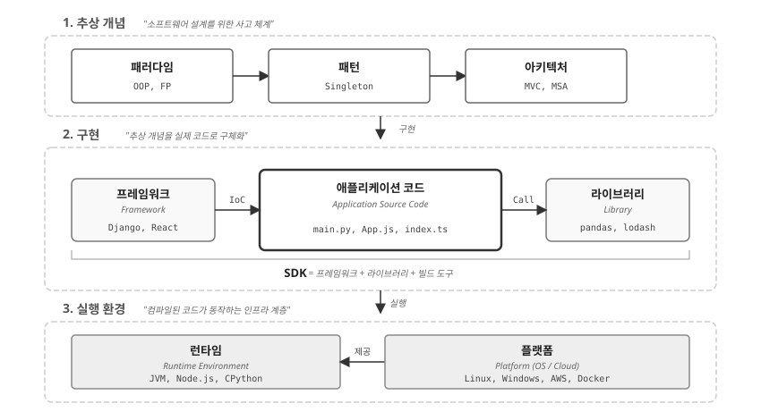
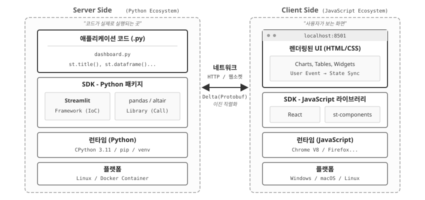
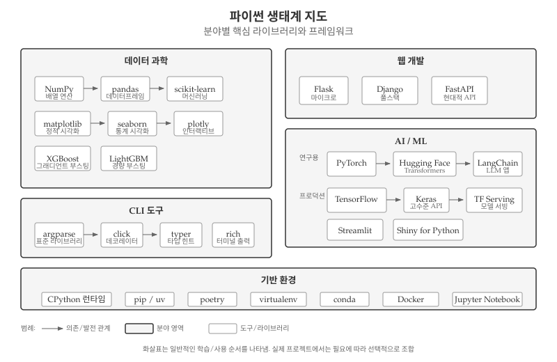
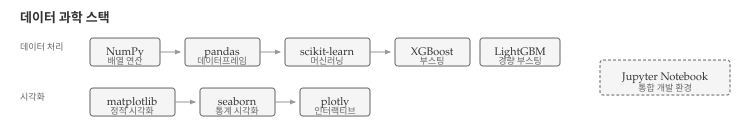
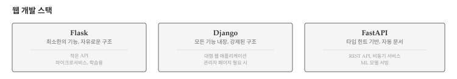
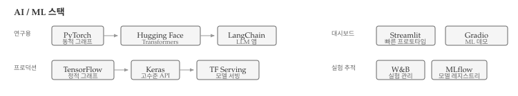
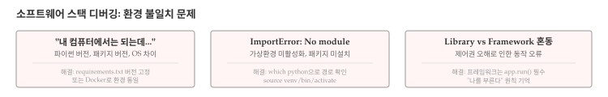

# 소프트웨어 스택 {#sec-arch-stack}

\index{SDK} \index{Runtime} \index{Framework} \index{Library}

설계 패턴과 아키텍처는 추상적 개념이다. 실제로 작동하려면 구체적인 **실행 환경**이 필요하다.
MVC 패턴을 알아도 Django나 Flask 없이는 웹 애플리케이션을 만들 수 없고,
계층형 아키텍처를 설계해도 파이썬 런타임 없이는 코드가 실행되지 않는다.

이 장에서는 패턴과 아키텍처가 **구현되고 실행되는 환경**—개발 도구 스택을 해부한다.
SDK, Runtime, Library, Framework, Platform—이 용어들은 자주 사용되지만 정확한 의미와 관계를 아는 개발자는 많지 않다.
설계를 현실로 만드는 도구들의 역할과 관계를 이해하면, 기술 선택과 디버깅 모두 수월해진다.

## 3계층 모델 {#sec-arch-stack-model}

\index{3계층 모델} \index{추상 개념} \index{구현} \index{실행 환경}

소프트웨어 개발은 세 가지 계층으로 나눌 수 있다. 맨 위에는 패러다임, 패턴, 아키텍처 같은 **추상 개념**이 자리한다. 가운데에는 프레임워크, 애플리케이션 코드, 라이브러리로 이루어진 **구현** 계층이 있다. 맨 아래에는 런타임과 플랫폼으로 구성된 **실행 환경** 계층이 코드를 실제로 구동한다.

{#fig-arch-stack-hierarchy}

@fig-arch-stack-hierarchy 에서 주목할 점은 **화살표의 방향**이다. 추상 개념은 구현으로, 구현은 실행 환경으로 **구체화**된다. 역방향으로 보면, 실행 환경이 구현을 **지탱**하고, 구현이 추상 개념을 **실현**한다.

개발자의 일상 대부분은 가운데 구현 계층에서 이루어진다—main.py를 작성하고, Django를 활용하고, pandas를 호출한다. 그러나 좋은 설계를 하려면 위쪽 추상 개념 계층을 알아야 하고, 문제를 디버깅하려면 아래쪽 실행 환경 계층을 이해해야 한다.

## 실행 환경 계층 {#sec-arch-stack-runtime}

\index{Platform} \index{Runtime}

실행 환경 계층은 코드가 실제로 구동되는 토대다. 플랫폼(Platform)이 하드웨어와 운영체제를 추상화하고, 런타임(Runtime)이 프로그래밍 언어의 실행을 담당한다. 개발자가 작성한 파이썬 코드가 CPU에서 실행되기까지, 여러 계층이 복잡성을 숨기고 단순한 인터페이스를 제공한다.

### Platform {#sec-arch-stack-platform}

**플랫폼(Platform)**은 소프트웨어가 실행되는 기반 환경이다.
가장 넓은 의미에서 플랫폼은 세 가지 수준으로 나뉜다.

**운영체제(OS)**: Linux, Windows, macOS가 대표적이다.
파일 시스템, 프로세스 관리, 네트워크 스택 등 기본 서비스를 제공한다.
같은 파이썬 코드라도 Windows의 경로 구분자(`\`)와 Linux의 경로 구분자(`/`)가 달라 문제가 생기기도 한다.

**클라우드**: AWS, GCP, Azure 같은 클라우드 서비스는 가상화된 인프라를 제공한다.
EC2 인스턴스, Lambda 함수, S3 스토리지—모두 클라우드 플랫폼의 구성요소다.
온프레미스 서버 관리 없이 코드만 배포하면 된다.

**컨테이너**: Docker, Kubernetes는 애플리케이션을 격리된 환경에서 실행한다.
"내 컴퓨터에서는 되는데..."라는 문제를 해결한다.
개발 환경과 프로덕션 환경을 동일하게 유지할 수 있다.

### Runtime {#sec-arch-stack-runtime-detail}

**런타임(Runtime)**은 프로그램이 실행되는 동안 필요한 환경 전체를 가리킨다.
메모리 관리, 가비지 컬렉션, 타입 검사, 예외 처리 등을 담당한다.

```{python}
#| label: arch-stack-runtime-check
#| echo: true
import sys
import platform

print(f"Python 구현체: {platform.python_implementation()}")
print(f"Python 버전: {sys.version}")
print(f"운영체제: {platform.system()} {platform.release()}")
```

**파이썬 런타임**은 여러 구현체가 있다. 가장 널리 쓰이는 **CPython**은 C로 작성된 표준 구현체로, `.py` 파일을 바이트코드로 컴파일한 뒤 인터프리터로 실행한다. `pip install`로 설치하는 대부분의 패키지가 CPython을 기준으로 작성되었다. **PyPy**는 JIT(Just-In-Time) 컴파일러를 사용하여 CPython보다 빠르며, 반복문이 많은 코드에서 성능 향상이 두드러진다. 다만 C 확장 호환성이 완벽하지 않아 NumPy 같은 일부 패키지가 작동하지 않을 수 있다. **Jython**은 Java 가상 머신(JVM) 위에서 파이썬을 실행하여 Java 라이브러리를 직접 호출할 수 있지만, 파이썬 3을 완전히 지원하지 않는다.

**JavaScript 런타임**도 다양하다. Google이 개발한 **V8** 엔진은 Chrome과 Node.js에서 사용하며, JIT 컴파일로 빠른 실행 속도를 제공한다. **SpiderMonkey**는 Firefox에서 사용하는 Mozilla의 JavaScript 엔진이다. **Node.js**는 V8 엔진 위에 이벤트 루프와 비동기 I/O를 추가한 서버 사이드 런타임으로, 브라우저 밖에서 JavaScript를 실행할 수 있게 해준다.

**Java 런타임**은 JVM(Java Virtual Machine)이다. Oracle의 **HotSpot**이 표준 JVM 구현체이며, **GraalVM**은 다언어 지원 VM으로 Java, JavaScript, Python, Ruby 등을 하나의 VM에서 실행할 수 있다.

같은 코드라도 어떤 런타임을 사용하느냐에 따라 성능, 호환성, 배포 방식이 달라진다.

## 구현 계층 {#sec-arch-stack-impl}

\index{Library} \index{Framework} \index{IoC}

구현 계층은 개발자가 실제로 코드를 작성하는 영역이다. 라이브러리(Library)와 프레임워크(Framework)가 핵심 구성요소이며, SDK(Software Development Kit)가 이들을 통합하여 제공하기도 한다. 라이브러리와 프레임워크의 차이를 이해하면 새로운 도구를 접했을 때 어떻게 활용해야 하는지 빠르게 파악할 수 있다.

### Library {#sec-arch-stack-library}

**라이브러리(Library)**는 개발자가 필요할 때 호출하는 코드 모음이다.
핵심 특징은 **"내가 부른다"**는 것이다.

```{python}
#| label: arch-stack-library-example
import pandas as pd

# 개발자가 필요할 때 함수를 호출한다
df = pd.read_csv("https://raw.githubusercontent.com/mwaskom/seaborn-data/master/iris.csv")
print(f"데이터 크기: {df.shape}")
print(df.head(3))
```

위 코드에서 `pd.read_csv()`는 개발자가 원하는 시점에 호출했다. pandas는 요청에 응답할 뿐, 프로그램의 흐름을 통제하지 않는다.

대표적인 파이썬 라이브러리로는 데이터 분석을 위한 **pandas**, 수치 계산과 다차원 배열을 다루는 **NumPy**, HTTP 클라이언트로 API 호출과 웹 스크래핑에 활용되는 **requests**, 차트와 그래프를 생성하는 시각화 도구 **matplotlib** 등이 있다.

### Framework {#sec-arch-stack-framework}

**프레임워크(Framework)**는 라이브러리와 반대다.
핵심 특징은 **"나를 부른다"**—즉, **제어의 역전(IoC, Inversion of Control)**이다.

```{python}
#| label: arch-stack-framework-example
#| eval: false
# Django 예제 (실행 불가, 개념 설명용)
# views.py

from django.http import HttpResponse

def hello(request):
    return HttpResponse("Hello, World!")

# 개발자는 함수를 정의만 한다
# Django가 HTTP 요청이 들어오면 이 함수를 '호출'한다
```

위 코드에서 `hello()` 함수는 개발자가 직접 호출하지 않는다.
사용자가 브라우저에서 `/hello/` URL에 접속하면, Django가 알아서 이 함수를 호출한다.
제어권이 개발자에서 Django로 역전된 것이다.

::: {.callout-note}
## 제어의 역전(IoC)

- **라이브러리**: "내가 부른다" — `pandas.read_csv()`처럼 개발자가 필요할 때 함수를 호출한다.
- **프레임워크**: "나를 부른다" — Django가 `views.py`의 함수를, React가 컴포넌트의 `render()`를 알아서 호출한다.

제어권이 개발자에서 프레임워크로 역전되었기 때문에 IoC(Inversion of Control)라 부른다.
:::

대표적인 파이썬 프레임워크로는 ORM, 관리자 페이지, 인증 시스템을 내장한 풀스택 웹 프레임워크 **Django**가 있다. **Flask**는 최소한의 기능만 제공하는 마이크로 웹 프레임워크로 확장성이 높다. **FastAPI**는 타입 힌트 기반의 현대적 API 프레임워크로 자동 문서 생성 기능을 제공한다. **Streamlit**은 파이썬 코드만으로 대시보드를 생성하는 데이터 앱 프레임워크다.

### Library vs Framework 비교 {#sec-arch-stack-comparison}

라이브러리와 프레임워크의 핵심 차이는 **제어권**이다. @tbl-arch-lib-framework 는 두 개념의 차이를 정리한다.

| 구분 | Library | Framework |
|------|---------|-----------|
| 제어권 | 개발자 | 프레임워크 |
| 호출 방향 | 내가 부른다 | 나를 부른다 |
| 유연성 | 높음 | 낮음 (정해진 구조) |
| 학습 곡선 | 낮음 | 높음 |
| 예시 | pandas, requests | Django, React |

: Library와 Framework 비교 {#tbl-arch-lib-framework}

::: {.callout-tip}
## 선택 기준

라이브러리는 특정 기능만 필요하거나, 기존 코드에 기능을 추가하거나, 자유로운 구조가 필요할 때 선택한다. 프레임워크는 전체 애플리케이션 구조가 필요하거나, 팀 협업에서 일관성이 중요하거나, 빠른 개발이 필요할 때 적합하다.
:::

### SDK {#sec-arch-stack-sdk}

라이브러리와 프레임워크를 개별적으로 설치하고 설정하는 것은 번거롭다. 특정 플랫폼이나 서비스를 대상으로 개발할 때는 필요한 도구들이 미리 통합되어 있으면 편리하다. **SDK(Software Development Kit)**는 이런 필요에서 탄생했다. 프레임워크, 라이브러리, 빌드 도구, 문서를 하나로 묶어 해당 플랫폼 개발에 필요한 모든 것을 제공한다.

```
SDK = Framework + Library + Build Tools + Documentation
```

**빌드 도구(Build Tools)**는 소스 코드를 배포 가능한 형태로 변환한다. 파이썬에서는 **setuptools**가 패키지를 빌드하고, **wheel**이 배포용 바이너리 형식을 생성한다. 최근에는 **hatch**와 **flit**이 더 단순한 빌드 워크플로우를 제공한다. JavaScript에서는 **webpack**, **vite**, **esbuild**가 모듈 번들링을 담당한다. Java와 Android에서는 **Maven**과 **Gradle**이 컴파일부터 테스트, 배포까지 빌드 자동화를 담당한다.

빌드 도구와 함께 **패키지 관리자**도 SDK의 핵심 구성요소다. 파이썬에서는 **pip**가 표준 패키지 관리자로 오랫동안 사용되었다. 최근에는 Rust로 작성된 **uv**가 pip보다 10~100배 빠른 속도로 주목받고 있다. **poetry**는 의존성 관리와 가상환경을 통합하여 프로젝트 관리를 단순화한다. JavaScript 생태계에서는 **npm**, **yarn**, **pnpm**이 패키지 관리를 담당한다.

대표적인 SDK로는 **Android SDK**가 있다. Java/Kotlin 컴파일러, 에뮬레이터, Android Studio 등 Android 앱 개발에 필요한 모든 것을 포함한다. **iOS SDK(Xcode)**는 Swift 컴파일러, 시뮬레이터, Interface Builder를 묶은 iOS/macOS 앱 개발 키트다. **AWS SDK for Python(boto3)**은 S3, EC2, Lambda 등 모든 AWS 서비스에 접근할 수 있는 라이브러리다. SDK를 설치하면 해당 플랫폼에서 개발하는 데 필요한 도구가 한 번에 갖춰진다.

## 실전 예제: Streamlit 해부 {#sec-arch-stack-streamlit}

\index{Streamlit} \index{WebSocket} \index{Protobuf}

앞서 살펴본 3계층 모델이 실제 애플리케이션에서 어떻게 구체화되는지 Streamlit 대시보드를 예로 들어 살펴본다. Streamlit은 파이썬 코드만으로 웹 대시보드를 만들 수 있어 데이터 과학자들에게 인기 있는 프레임워크다.

{#fig-arch-streamlit-stack}

@fig-arch-streamlit-stack 은 파이썬 Streamlit 대시보드를 예로 들어, 3계층 모델이 실제로 어떻게 구체화되는지 보여준다.
하드웨어(CPU, RAM, Storage)부터 운영체제(Linux), 컨테이너(Docker), 런타임(CPython), 프레임워크(Streamlit), 애플리케이션 코드(dashboard.py), 그리고 브라우저까지—7개 계층이 협력하여 하나의 웹 애플리케이션을 구동한다.

@fig-arch-streamlit-stack 에서 주목할 점은 서버와 클라이언트가 **서로 다른 언어 생태계**를 사용한다는 것이다.
서버는 파이썬(CPython 런타임, Streamlit/pandas 패키지)으로 구성되고, 클라이언트는 JavaScript(V8 런타임, React 라이브러리)로 구성된다.
그렇다면 파이썬 코드가 어떻게 JavaScript 대시보드가 되는 것일까?

### Streamlit의 동작 원리

흔히 "파이썬을 JavaScript로 변환(Transpile)한다"고 오해하지만, Streamlit의 동작 방식은 **원격 제어(Remote Control)**에 가깝다.

`pip install streamlit`을 실행하면 파이썬 서버뿐 아니라, 이미 완성된 React 웹 애플리케이션도 함께 설치된다. 브라우저가 `localhost:8501`에 접속하면 서버는 파이썬 코드가 아닌, **미리 빌드된 React 앱**(index.html + main.js)을 먼저 내려보낸다. React 앱에는 "heading 메시지가 오면 `<h1>` 태그를 그린다", "dataframe 메시지가 오면 `<table>`을 그린다"는 규칙이 내장되어 있다.

React 앱이 로딩되면 즉시 서버에 웹소켓(WebSocket) 연결을 맺는다.
서버는 파이썬 스크립트(dashboard.py)를 처음부터 끝까지 실행하면서, `st.title("안녕")`같은 코드를 만날 때마다 **Delta 메시지**를 생성한다.
"heading 타입, 내용은 '안녕'"이라는 정보가 **Protobuf**(Protocol Buffers) 이진 포맷으로 직렬화되어 웹소켓을 통해 브라우저로 전송된다.
Protobuf는 JSON보다 작고 빠른 구글의 직렬화 포맷으로, 대용량 데이터프레임이나 차트 데이터를 효율적으로 전달한다.
브라우저의 React 앱은 메시지를 받는 즉시 해당 컴포넌트를 화면에 렌더링한다.

핵심은 파이썬 코드가 JavaScript로 "번역"되는 것이 아니라, 파이썬이 **명령을 보내고** JavaScript가 **명령을 수행**한다는 점이다.
방송국의 PD(파이썬)가 대본을 쓰고 지시하면, TV 화면(React)이 영상을 보여주는 구조다.
그래서 Streamlit 앱을 배포하려면 파이썬 프로세스가 계속 실행되어야 하고, 서버가 꺼지면 대시보드도 멈춘다.

## 파이썬 생태계 지도 {#sec-arch-stack-python-ecosystem}

\index{파이썬 생태계}

파이썬은 범용 언어로 시작했지만, 30년간 축적된 패키지 생태계 덕분에 거의 모든 분야에서 활용된다. 데이터 과학, 웹 개발, 인공지능, 자동화 스크립트까지—각 분야마다 핵심 라이브러리와 프레임워크 조합이 다르다. 초보자는 방대한 선택지 앞에서 길을 잃기 쉽고, 경험 있는 개발자도 다른 분야로 넘어갈 때 새로운 스택을 익혀야 한다. 분야별 대표 도구와 그 관계를 지도처럼 파악하면, 필요한 도구를 빠르게 찾고 학습 우선순위를 정할 수 있다.

{#fig-arch-python-ecosystem}

@fig-arch-python-ecosystem 은 분야별 대표 스택을 한눈에 보여준다. 데이터 분석에는 pandas, matplotlib, Jupyter 조합이 적합하고, 웹 API 개발에는 FastAPI, SQLAlchemy, Pydantic을 함께 사용한다. 대형 웹 서비스에는 Django, PostgreSQL, Redis 스택이 검증되었고, ML 연구에는 PyTorch, Hugging Face, W&B(Weights & Biases)가 널리 쓰인다. 데이터 대시보드에는 Streamlit 또는 Shiny for Python을 선택한다. 각 스택의 세부 구성을 아래에서 살펴본다.

### 데이터 과학 스택

데이터 과학 분야에서는 수치 계산부터 머신러닝까지 계층적으로 연결된 라이브러리 스택이 형성되어 있다.

{#fig-arch-stack-data-science}

@fig-arch-stack-data-science 에서 보듯이, 데이터 과학 스택은 두 갈래로 나뉜다. 데이터 처리 계열은 NumPy에서 pandas, scikit-learn, XGBoost/LightGBM으로 이어지고, 시각화 계열은 matplotlib에서 seaborn, plotly로 발전한다. **NumPy**는 모든 수치 계산의 기반으로 다차원 배열과 선형대수 연산을 제공한다. **pandas**는 DataFrame으로 테이블 데이터를 조작하며, SQL과 유사한 연산을 파이썬에서 수행한다. **scikit-learn**은 분류, 회귀, 클러스터링, 전처리 등 머신러닝 알고리즘을 모아둔 라이브러리다. **matplotlib**과 **seaborn**은 논문이나 보고서용 정적 차트를 생성한다.

### 웹 개발 스택

파이썬 웹 개발에서는 프로젝트 규모와 요구사항에 따라 세 가지 주요 프레임워크 중 하나를 선택한다.
 
{#fig-arch-stack-web}

@fig-arch-stack-web 은 세 프레임워크의 특징과 적합한 사용 사례를 보여준다. **Flask**는 마이크로서비스나 학습용으로 적합하며, 필요한 기능만 확장해서 사용할 수 있다. **Django**는 관리자 페이지, ORM, 인증 시스템이 내장되어 있어 대형 웹 애플리케이션에 적합하다. **FastAPI**는 타입 힌트를 활용한 자동 문서 생성과 비동기 지원이 강점으로, REST API나 ML 모델 서빙에 널리 쓰인다.

### AI/ML 스택

AI/ML 분야에서는 연구용과 프로덕션용으로 생태계가 나뉜다. 최근에는 LLM 애플리케이션 개발을 위한 도구도 빠르게 성장하고 있다.

{#fig-arch-stack-aiml}

@fig-arch-stack-aiml 은 연구용과 프로덕션용으로 나뉜 AI/ML 생태계를 보여준다. 연구용 계열은 PyTorch에서 Hugging Face Transformers, LangChain으로 이어지고, 프로덕션 계열은 TensorFlow에서 Keras, TensorFlow Serving으로 연결된다. 대시보드 도구로는 Streamlit과 Gradio가 있으며, 실험 추적에는 W&B와 MLflow가 쓰인다. **PyTorch**는 동적 계산 그래프와 디버깅 용이성 덕분에 연구 커뮤니티에서 선호된다. **TensorFlow**는 TensorFlow Lite(모바일)와 TensorFlow.js(웹) 등 프로덕션 배포에 강점이 있다. **Hugging Face**는 BERT, GPT 등 수천 개의 사전 학습 모델을 제공하는 허브다. **LangChain**은 RAG와 에이전트를 구축하는 LLM 애플리케이션 프레임워크다.

### CLI 도구 스택

명령줄 인터페이스(CLI) 도구 개발에도 표준 라이브러리부터 현대적인 타입 힌트 기반 도구까지 다양한 선택지가 있다.

{#fig-arch-stack-cli}

@fig-arch-stack-cli 는 인자 파싱과 터미널 출력 두 영역으로 CLI 도구를 분류한다. 인자 파싱은 표준 라이브러리 **argparse**에서 시작해 데코레이터 기반의 **click**, 타입 힌트 기반의 **typer**로 발전했다. typer는 FastAPI와 동일한 철학으로 설계되어 타입 힌트만으로 자동 완성과 도움말을 생성한다. 터미널 출력에는 색상, 테이블, 프로그레스 바를 지원하는 **rich**가 대표적이며, **tqdm**은 반복문 진행률 표시에, **colorama**는 크로스 플랫폼 색상 출력에 사용된다. 

## 디버깅 {#sec-arch-stack-debug}

\index{디버깅} \index{환경 문제}

소프트웨어 스택에서 발생하는 문제는 대부분 **환경 불일치**에서 비롯된다. 코드 자체에는 오류가 없는데도 실행 환경이 다르면 예상치 못한 동작이 발생한다. 개발자 노트북에서 잘 돌아가던 코드가 서버에서 실패하거나, 동료의 컴퓨터에서 import 에러가 나는 경우가 대표적이다. 스택의 각 계층—런타임, 라이브러리, 프레임워크—이 서로 맞물려 있기 때문에 한 곳의 버전 차이가 전체 동작에 영향을 미친다.

{#fig-arch-stack-debug}

@fig-arch-stack-debug 는 가장 흔한 세 가지 환경 문제와 해결 방법을 보여준다. 첫 번째는 **"내 컴퓨터에서는 되는데..."** 문제로, 개발 환경과 프로덕션 환경의 차이가 원인이다. 파이썬 버전 차이(3.9 vs 3.11), 패키지 버전 차이(pandas 1.x vs 2.x), 운영체제 차이(Windows vs Linux) 등이 문제를 일으킨다. 해결책은 `requirements.txt`에 정확한 버전을 고정하거나, Docker로 환경 자체를 통일하는 것이다.
```bash
# requirements.txt에 버전 고정
pip freeze > requirements.txt

# 또는 Docker로 환경 통일
docker build -t myapp .
docker run myapp
```

두 번째는 **"ImportError: No module named 'xxx'"** 에러로, 가상환경이 활성화되지 않았거나 패키지가 설치되지 않았을 때 발생한다. `which python` 명령으로 현재 어떤 파이썬을 사용 중인지 확인하면 원인을 파악할 수 있다. `/usr/bin/python`이면 시스템 파이썬을 사용 중이므로 가상환경을 활성화해야 한다.
```bash
# 가상환경 확인
which python
# /usr/bin/python이면 시스템 Python (X)
# ./venv/bin/python이면 가상환경 (O)

# 가상환경 활성화
source venv/bin/activate
pip install -r requirements.txt
```

세 번째는 **Library와 Framework 혼동** 문제다. Flask를 라이브러리처럼 사용하거나, pandas를 프레임워크처럼 사용하면 예상대로 동작하지 않는다. 프레임워크는 제어권을 프레임워크가 가져가므로 `app.run()` 같은 진입점 호출이 필수다. "내가 부른다"면 라이브러리, "나를 부른다"면 프레임워크라는 원칙을 기억하면 혼동을 피할 수 있다.
```python
# 잘못된 예: Flask를 라이브러리처럼 사용
from flask import Flask
app = Flask(__name__)
# ... 하지만 app.run()을 호출하지 않음

# 올바른 예: Flask는 프레임워크
if __name__ == "__main__":
    app.run(debug=True)  # Flask가 제어권을 가져감
```

::: {.content-visible when-format="pdf"}
\faLightbulb\ 생각해볼 점
:::

::: {.content-visible when-format="html"}
## 💡 생각해볼 점 {.unnumbered}
:::

**추상화의 대가는 무엇인가?** 스택의 각 계층은 하위 복잡성을 숨기고 단순한 인터페이스를 제공한다. `pandas.read_csv()`를 호출할 때 파일 시스템, 메모리 관리, 문자 인코딩을 신경 쓰지 않아도 된다. 하지만 성능 문제가 발생하거나 예상치 못한 오류를 만나면, 숨겨진 계층을 파고들어야 한다. 추상화가 높을수록 편리하지만, 문제 해결 시 더 깊이 내려가야 하는 역설이 존재한다.

**"내가 부른다" vs "나를 부른다"—제어권의 문제.** 라이브러리를 쓸 때는 개발자가 주인이지만, 프레임워크를 쓸 때는 프레임워크가 주인이다. Django의 ORM이 마음에 들지 않아도 쉽게 교체할 수 없다. 프레임워크는 생산성을 높여주지만, 그 대가로 자유를 제한한다. 새 프로젝트를 시작할 때 "얼마나 많은 결정을 프레임워크에 위임할 것인가?"라는 질문은 기술 선택 이상의 의미를 갖는다.

**살아남는 도구의 조건은 무엇인가?** NumPy는 2006년부터, Flask는 2010년부터 현역이다. 반면 수많은 도구가 등장했다 사라졌다. 살아남은 도구들의 공통점은 "한 가지를 잘 하고, 다른 도구와 잘 연결된다"는 것이다. 모든 것을 해결하려는 올인원 솔루션보다, 유닉스 철학을 따르는 작은 도구들이 더 오래 살아남는 경향이 있다.

다음 장에서는 소프트웨어 **아키텍처**를 다룬다. 스택이 "무엇으로 만드는가"라면, 아키텍처는 "어떻게 구조화하는가"다. 계층형, 이벤트 기반, 마이크로서비스—각 아키텍처가 어떤 문제를 해결하고, 언제 어떤 구조를 선택해야 하는지 살펴본다.

\index{소프트웨어 스택!정리}
