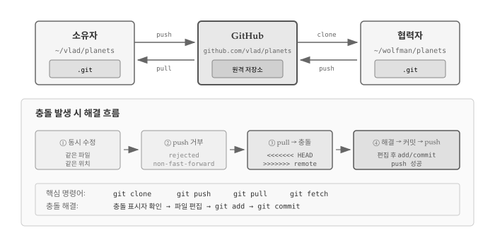
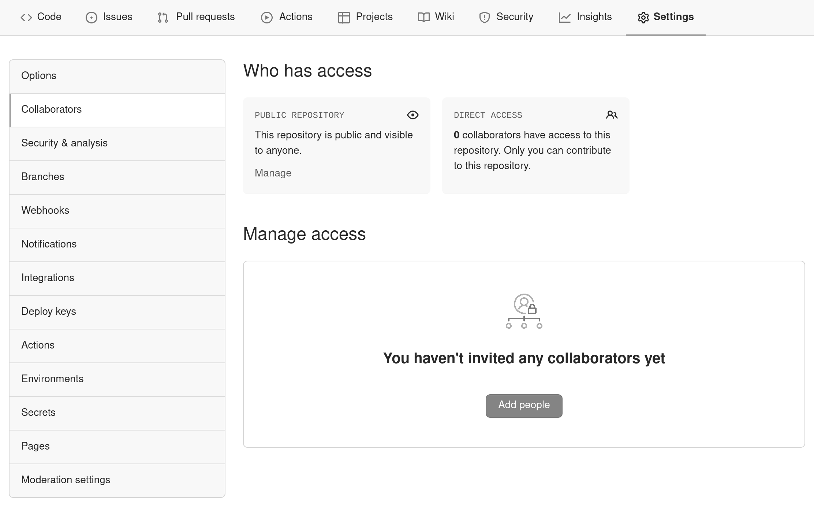
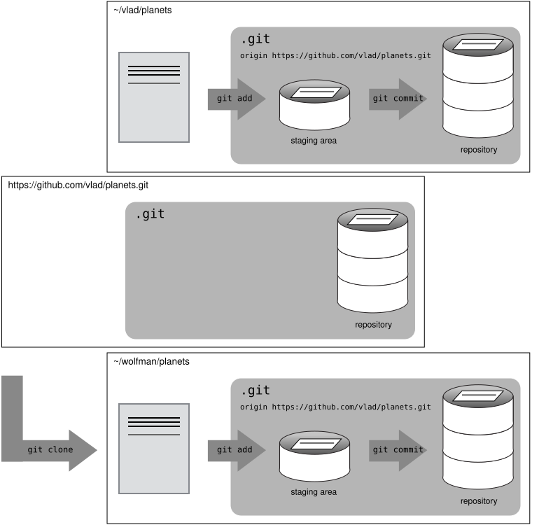
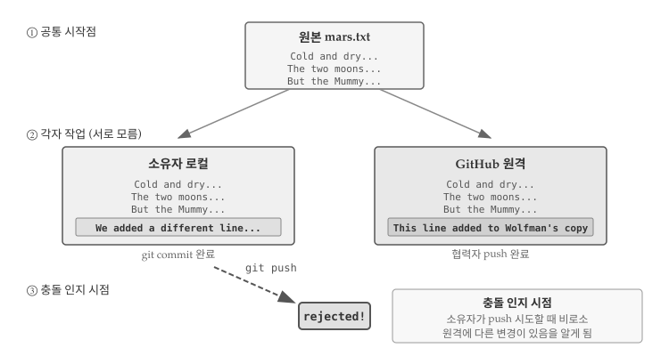
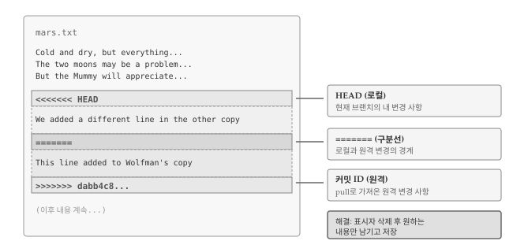

# 협업과 충돌 해결 {#sec-git-collab}

\index{git!협업} \index{git!충돌}

버전 관리의 진정한 힘은 여러 사람이 하나의 프로젝트에서 동시에 작업할 때 발휘된다. 혼자 작업할 때도 Git은 유용하지만, 팀 협업 환경에서 Git 없이 코드를 관리한다는 것은 상상하기 어렵다. 협업 과정에서 발생하는 가장 큰 도전은 **충돌(conflict)**이다. 두 사람이 같은 파일의 같은 부분을 동시에 수정하면 Git은 어느 쪽을 선택해야 할지 알 수 없다. 충돌은 피할 수 없는 현상이지만, Git은 충돌을 감지하고 해결하는 체계적인 방법을 제공한다.

{#fig-git-collab-overview}

@fig-git-collab-overview 는 협업의 기본 구조와 충돌 해결 과정을 보여준다. 소유자와 협력자가 GitHub를 중심으로 `clone`, `push`, `pull` 명령어로 변경 사항을 주고받는다. 같은 위치를 동시에 수정하면 충돌이 발생하고, Git은 충돌 표시자(`<<<<<<<`, `=======`, `>>>>>>>`)를 삽입하여 양쪽 변경 사항을 보여준다. 개발자가 직접 파일을 편집하여 최종 내용을 결정한 후 커밋하면 충돌이 해결된다.

## 협업 기초 {#sec-git-collab-basics}

Git의 진가는 여러 사람이 함께 작업할 때 드러난다. 협업 실습을 위해 두 사람이 짝을 이루어보자. 한 사람은 **소유자**(Owner)로서 GitHub 저장소를 제공하고, 다른 사람은 **협력자**(Collaborator)로서 소유자의 저장소를 복제하여 변경 사항을 추가한다. 실습이 끝나면 역할을 바꿔서 양쪽 경험을 모두 해보는 것이 좋다.

::: callout-note
### Clone vs Fork: 두 가지 협업 모델

\index{git!fork}

GitHub 협업에는 크게 두 가지 모델이 있다. **협력자 모델(Collaborator Model)**은 소유자가 팀원에게 저장소 쓰기 권한을 부여하고, 협력자가 `git clone`으로 저장소를 복제한 뒤 직접 push하는 방식이다. 신뢰된 팀원 간의 협업에 적합하다.

**포크 모델(Fork Model)**은 원본 저장소를 자신의 GitHub 계정으로 복사(fork)한 뒤, 복사본에서 작업하고 Pull Request를 통해 원본에 병합을 요청하는 방식이다. 원본 저장소에 쓰기 권한이 없어도 기여할 수 있어 오픈소스 프로젝트에서 주로 사용된다.

이번 장에서는 협력자 모델을 다룬다. 포크 모델과 Pull Request는 오픈소스 기여를 다루는 별도 장에서 자세히 설명한다.
:::

::: callout-tip
### 혼자 실습하기

짝이 없다면 터미널 창을 두 개 열어 한쪽은 소유자, 다른 쪽은 협력자 역할을 맡으면 된다. 두 번째 창이 다른 컴퓨터에서 접속한 협력자라고 가정하고 진행한다.
:::

소유자는 먼저 협력자에게 저장소 접근 권한을 부여해야 한다. GitHub 저장소 페이지에서 **Settings** → **Collaborators**로 이동하여 협력자의 GitHub 사용자명을 입력한다.



협력자는 [https://github.com/notifications](https://github.com/notifications)에서 초대를 수락한다.

\index{git!clone}

초대를 수락한 협력자는 소유자의 저장소를 본인 컴퓨터로 **복제(clone)**한다. 복제는 원격 저장소 전체를 로컬에 다운로드하는 작업이다.

``` bash
$ git clone https://github.com/vlad/planets.git ~/Desktop/vlad-planets
```

URL의 `vlad` 부분을 실제 소유자의 GitHub 사용자명으로 바꾼다.



복제가 완료되면 협력자는 로컬에서 자유롭게 파일을 수정할 수 있다.

``` bash
$ cd ~/Desktop/vlad-planets
$ nano pluto.txt
$ cat pluto.txt

It is so a planet!
```

``` bash
$ git add pluto.txt
$ git commit -m "Add notes about Pluto"

 1 file changed, 1 insertion(+)
 create mode 100644 pluto.txt
```

커밋을 완료했으면 소유자의 원격 저장소로 푸시한다.

``` bash
$ git push origin master

Counting objects: 4, done.
Delta compression using up to 4 threads.
Compressing objects: 100% (2/2), done.
Writing objects: 100% (3/3), 306 bytes, done.
Total 3 (delta 0), reused 0 (delta 0)
To https://github.com/vlad/planets.git
   9272da5..29aba7c  master -> master
```

`git clone`으로 저장소를 복제하면 Git이 자동으로 원본 URL을 `origin`이라는 이름으로 등록한다. 따라서 `git remote add origin ...`을 별도로 실행할 필요가 없다.

GitHub 웹사이트에서 소유자 저장소를 새로고침하면 협력자가 추가한 커밋을 확인할 수 있다. 소유자는 `git pull`로 변경 사항을 로컬에 가져온다.

``` bash
$ git pull origin master

remote: Counting objects: 4, done.
remote: Compressing objects: 100% (2/2), done.
remote: Total 3 (delta 0), reused 3 (delta 0)
Unpacking objects: 100% (3/3), done.
From https://github.com/vlad/planets
 * branch            master     -> FETCH_HEAD
Updating 9272da5..29aba7c
Fast-forward
 pluto.txt | 1 +
 1 file changed, 1 insertion(+)
 create mode 100644 pluto.txt
```

소유자 로컬 저장소, 협력자 로컬 저장소, GitHub 원격 저장소 세 곳이 모두 동기화되었다.

### 협업 워크플로우

\index{git!workflow}

협업 시에는 작업 전에 항상 `git pull`로 최신 상태를 가져오는 습관이 중요하다. 권장 워크플로우는 다음과 같다.

1. `git pull origin main`으로 로컬 저장소를 최신 상태로 갱신
2. 파일 수정 작업 수행
3. `git add`로 스테이징
4. `git commit -m "메시지"`로 커밋
5. `git push origin main`으로 원격에 업로드

한 번에 큰 변경을 커밋하기보다 작은 단위로 자주 커밋하는 것이 좋다. 작은 커밋은 리뷰하기 쉽고, 문제가 생겼을 때 원인을 추적하기도 편하다.

::: callout-note
### 변경 사항 미리 확인하기

`git pull` 없이 원격 저장소의 변경 사항만 확인하고 싶다면 `git fetch`를 사용한다. `fetch`는 원격 변경 사항을 다운로드하지만 로컬 브랜치에 병합하지는 않는다.

``` bash
$ git fetch origin master
$ git diff master origin/master
```

`diff` 명령어로 로컬과 원격의 차이를 확인한 후 병합 여부를 결정할 수 있다.
:::


## 충돌 발생과 해결 {#sec-git-collab-conflict}

\index{충돌}
\index{git!conflict}
\index{git!resolve}

여러 사람이 동시에 작업하면 같은 파일의 같은 부분을 수정하는 상황이 발생할 수 있다. 혼자 작업하더라도 노트북과 데스크톱에서 번갈아 작업하다 보면 비슷한 문제가 생긴다. Git은 이런 **충돌(conflict)**을 감지하고 **해결(resolve)**할 수 있는 도구를 제공한다.

충돌이 어떻게 발생하고 해결하는지 실습해보자. 현재 양쪽 저장소의 `mars.txt` 파일 내용은 다음과 같다.

``` bash
$ cat mars.txt

Cold and dry, but everything is my favorite color
The two moons may be a problem for Wolfman
But the Mummy will appreciate the lack of humidity
```

협력자가 파일 끝에 한 줄을 추가한다.

``` bash
$ nano mars.txt
$ cat mars.txt

Cold and dry, but everything is my favorite color
The two moons may be a problem for Wolfman
But the Mummy will appreciate the lack of humidity
This line added to Wolfman's copy
```

변경 사항을 커밋하고 푸시한다.


``` bash
$ git add mars.txt
$ git commit -m "Add a line in our home copy"

[main 5ae9631] Add a line in our home copy
 1 file changed, 1 insertion(+)
```

``` bash
$ git push origin main

Counting objects: 5, done.
Delta compression using up to 4 threads.
Compressing objects: 100% (3/3), done.
Writing objects: 100% (3/3), 352 bytes, done.
Total 3 (delta 1), reused 0 (delta 0)
To https://github.com/vlad/planets
   29aba7c..dabb4c8  main -> main
```

한편 소유자는 원격 저장소를 확인하지 않고 같은 파일에 다른 내용을 추가한다.


``` bash
$ nano mars.txt
$ cat mars.txt

Cold and dry, but everything is my favorite color
The two moons may be a problem for Wolfman
But the Mummy will appreciate the lack of humidity
We added a different line in the other copy
```

로컬 커밋은 정상적으로 완료된다.

``` bash
$ git add mars.txt
$ git commit -m "Add a line in my copy"

[main 07ebc69] Add a line in my copy
 1 file changed, 1 insertion(+)
```

그러나 푸시를 시도하면 Git이 거부한다.


``` bash
$ git push origin main

To https://github.com/vlad/planets.git
 ! [rejected]        main -> main (non-fast-forward)
error: failed to push some refs to 'https://github.com/vlad/planets.git'
hint: Updates were rejected because the tip of your current branch is behind
hint: its remote counterpart. Merge the remote changes (e.g. 'git pull')
hint: before pushing again.
hint: See the 'Note about fast-forwards' in 'git push --help' for details.
```


{#fig-git-conflict-change}

@fig-git-conflict-change 는 충돌이 발생하는 전형적인 상황을 보여준다. 원본 `mars.txt`에서 시작하여 소유자와 협력자가 각각 같은 위치에 서로 다른 내용을 추가했다. 협력자가 먼저 push를 완료했으므로 GitHub 원격 저장소에는 협력자의 변경 사항이 반영되어 있다. 소유자가 자신의 로컬 커밋을 push하려 하면 Git은 두 변경 사항을 어떻게 합쳐야 할지 판단할 수 없어 push를 거부한다.

원격 저장소에 아직 로컬에 반영되지 않은 커밋이 있기 때문에 Git이 푸시를 거부한 것이다. 다른 사람의 작업을 덮어쓰는 것을 방지하기 위한 안전장치다. 먼저 `git pull`로 원격 변경 사항을 가져와 **병합(merge)**한 후 푸시해야 한다.

\index{병합}
\index{git!merge}
\index{git!pull}

``` bash
$ git pull origin main

remote: Counting objects: 5, done.
remote: Compressing objects: 100% (2/2), done.
remote: Total 3 (delta 1), reused 3 (delta 1)
Unpacking objects: 100% (3/3), done.
From https://github.com/vlad/planets
 * branch            main     -> FETCH_HEAD
Auto-merging mars.txt
CONFLICT (content): Merge conflict in mars.txt
Automatic merge failed; fix conflicts and then commit the result.
```

`git pull`이 원격 변경 사항을 가져왔지만, 같은 파일의 같은 위치가 서로 다르게 수정되어 자동 병합에 실패했다. Git은 충돌이 발생한 파일에 양쪽 변경 사항을 표시해둔다.


``` bash
$ cat mars.txt

Cold and dry, but everything is my favorite color
The two moons may be a problem for Wolfman
But the Mummy will appreciate the lack of humidity
<<<<<<< HEAD
We added a different line in the other copy
=======
This line added to Wolfman's copy
>>>>>>> dabb4c8c450e8475aee9b14b4383acc99f42af1d
```

{#fig-git-conflict-markers}

@fig-git-conflict-markers 는 충돌이 발생한 파일의 구조를 보여준다. `<<<<<<< HEAD`와 `=======` 사이에는 현재 브랜치(로컬)의 변경 사항이, `=======`과 `>>>>>>> 커밋ID` 사이에는 원격에서 가져온 변경 사항이 위치한다. 충돌을 해결하려면 세 가지 표시자를 모두 삭제하고 최종적으로 남길 내용만 파일에 남기면 된다.

충돌 표시의 의미는 다음과 같다.

- `<<<<<<< HEAD`: 로컬(현재 브랜치) 변경 사항 시작
- `=======`: 구분선
- `>>>>>>> 커밋ID`: 원격에서 가져온 변경 사항 끝

충돌을 해결하려면 파일을 편집하여 충돌 표시자를 제거하고 최종 내용을 결정해야 한다. 로컬 버전을 유지하든, 원격 버전을 선택하든, 둘을 합치든, 완전히 새로 작성하든 자유롭게 결정할 수 있다. 양쪽 내용을 모두 반영하여 다음과 같이 수정해보자.


``` bash
$ cat mars.txt

Cold and dry, but everything is my favorite color
The two moons may be a problem for Wolfman
But the Mummy will appreciate the lack of humidity
We removed the conflict on this line
```

충돌을 해결한 후 파일을 스테이징하고 커밋하면 병합이 완료된다.


``` bash
$ git add mars.txt
$ git status

On branch main
All conflicts fixed but you are still merging.
  (use "git commit" to conclude merge)

Changes to be committed:

	modified:   mars.txt
```


``` bash
$ git commit -m "Merge changes from GitHub"

[main 2abf2b1] Merge changes from GitHub
```

이제 푸시가 가능하다.


``` bash
$ git push origin main

Counting objects: 10, done.
Delta compression using up to 4 threads.
Compressing objects: 100% (6/6), done.
Writing objects: 100% (6/6), 697 bytes, done.
Total 6 (delta 2), reused 0 (delta 0)
To https://github.com/vlad/planets.git
   dabb4c8..2abf2b1  main -> main
```

Git은 병합 과정을 모두 기록하므로 협력자가 `git pull`을 실행하면 충돌 해결 결과가 자동으로 반영된다.


``` bash
$ git pull origin main

remote: Counting objects: 10, done.
remote: Compressing objects: 100% (4/4), done.
remote: Total 6 (delta 2), reused 6 (delta 2)
Unpacking objects: 100% (6/6), done.
From https://github.com/vlad/planets
 * branch            main     -> FETCH_HEAD
Updating dabb4c8..2abf2b1
Fast-forward
 mars.txt | 2 +-
 1 file changed, 1 insertion(+), 1 deletion(-)
```

병합된 파일을 얻게 된다.

``` bash
$ cat mars.txt

Cold and dry, but everything is my favorite color
The two moons may be a problem for Wolfman
But the Mummy will appreciate the lack of humidity
We removed the conflict on this line
```

협력자 쪽에서는 별도의 충돌 해결 작업 없이 병합된 최종 파일을 받게 된다.

## 충돌 최소화 전략 {#sec-git-collab-minimize}

Git의 충돌 해결 기능이 유용하지만, 충돌 해결에는 시간과 노력이 든다. 충돌이 잘못 해결되면 버그가 발생할 수도 있다. 충돌을 줄이려면 기술적 접근과 프로젝트 관리 전략을 함께 사용하는 것이 좋다.

기술적으로 가장 효과적인 방법은 작업 시작 전에 항상 `git pull`로 최신 상태를 유지하는 것이다. 원격 저장소와 로컬 저장소의 차이가 클수록 충돌 가능성이 높아지므로, 자주 동기화하는 습관이 중요하다. 토픽 브랜치를 활용하면 기능별로 작업을 분리할 수 있어, 메인 브랜치에서 직접 충돌이 발생하는 상황을 피할 수 있다. 커밋 단위를 작게 유지하면 충돌이 발생하더라도 영향 범위가 좁아 해결이 수월하다. 하나의 큰 파일보다 논리적 단위로 분할된 여러 파일이 동시 수정 가능성을 줄여준다.

프로젝트 관리 측면에서는 팀원 간 담당 영역을 명확히 구분하는 것이 효과적이다. 같은 파일을 수정해야 하는 상황이라면 작업 순서를 미리 조율하여 동시 수정을 피하는 것이 좋다. 코딩 스타일 차이로 인한 불필요한 충돌도 자주 발생하는데, 탭과 공백, 들여쓰기 규칙 등을 통일하고 `prettier`, `black`, `rubocop` 같은 린터를 도입하면 스타일 관련 충돌을 원천적으로 방지할 수 있다.

::: callout-warning
### 바이너리 파일 충돌

이미지, PDF, 워드 문서 같은 바이너리 파일에서 충돌이 발생하면 Git은 텍스트 파일처럼 충돌 표시자를 삽입할 수 없다. 대신 다음과 같은 경고 메시지가 나타난다.

``` bash
warning: Cannot merge binary files: image.jpg (HEAD vs. 439dc8c0...)
```

바이너리 충돌 해결 방법:

**방법 1: 한쪽 버전 선택**
``` bash
# 로컬 버전 유지
$ git checkout HEAD image.jpg

# 또는 원격 버전 선택
$ git checkout 439dc8c0 image.jpg

$ git add image.jpg
$ git commit -m "Resolve binary conflict"
```

**방법 2: 양쪽 버전 모두 보존**
``` bash
$ git checkout HEAD image.jpg
$ git mv image.jpg image-local.jpg
$ git checkout 439dc8c0 image.jpg
$ mv image.jpg image-remote.jpg
$ git add image-local.jpg image-remote.jpg
$ git commit -m "Keep both versions of image"
```
:::


::: {.content-visible when-format="pdf"}
\faLightbulb\ 생각해볼 점
:::

::: {.content-visible when-format="html"}
## 💡 생각해볼 점 {.unnumbered}
:::

이번 장에서 다룬 협력자 모델은 신뢰된 팀원 간의 협업에 적합하다. 소유자가 협력자에게 저장소 쓰기 권한을 부여하면, 협력자는 `clone`으로 저장소를 복제하고 `push`로 변경 사항을 직접 반영할 수 있다. 팀 규모가 작고 서로의 작업 영역이 명확할 때 효율적인 방식이다. 반면 오픈소스 프로젝트처럼 불특정 다수가 기여하는 환경에서는 포크 모델과 Pull Request가 더 적합하다.

충돌은 협업의 자연스러운 부산물이다. 같은 파일의 같은 위치를 동시에 수정하면 Git은 어느 쪽을 선택해야 할지 판단할 수 없다. 충돌 표시자(`<<<<<<<`, `=======`, `>>>>>>>`)가 삽입된 파일을 보고 당황할 수 있지만, 이는 Git이 "여기서부터 여기까지가 로컬 변경이고, 여기서부터 여기까지가 원격 변경이니 직접 결정해달라"는 메시지다. 표시자를 제거하고 최종 내용을 남긴 뒤 커밋하면 충돌이 해결된다.

충돌은 push 시점에 비로소 인지된다는 점을 기억하자. 각자 로컬에서 작업하는 동안에는 충돌 여부를 알 수 없다. 작업 전 `git pull`로 최신 상태를 유지하고, 작은 단위로 자주 커밋하며, 팀원 간 담당 영역을 명확히 구분하는 습관이 충돌 빈도를 줄여준다. 충돌이 자주 발생한다면 파일 구조나 워크플로우를 점검해볼 시점이다.

협업 규모가 커지면 브랜치 전략이 필요해진다. 메인 브랜치에서 직접 작업하는 대신 기능별 브랜치를 만들어 작업하고, 완료 후 병합하는 방식이 대규모 팀에서 일반적이다. 브랜치와 병합 전략은 다음 장에서 자세히 다룬다.

