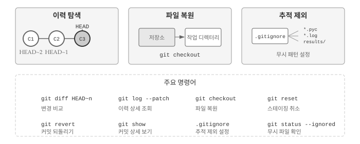
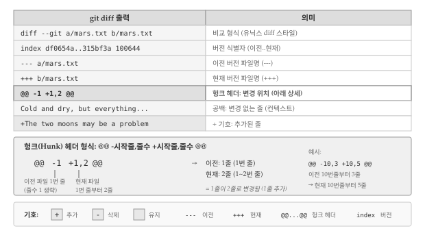
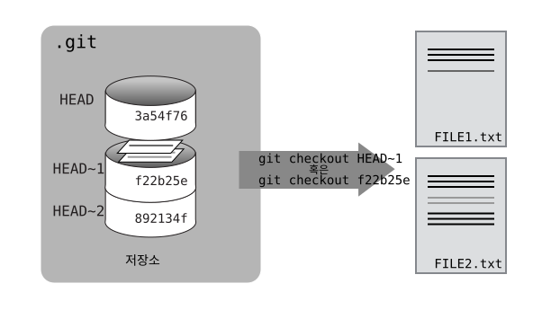
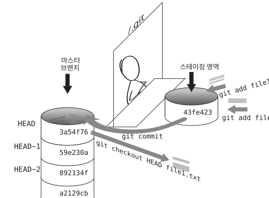
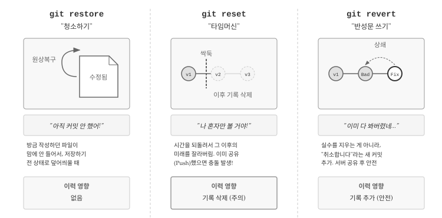
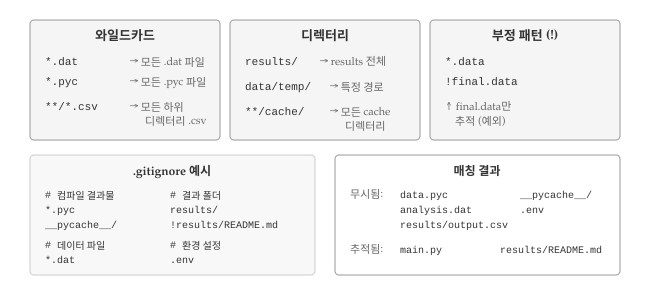

# 히스토리와 파일 관리 {#sec-git-history}

\index{버전 관리!이력}

Git 핵심 가치는 프로젝트의 모든 변경 이력을 안전하게 보존하고, 언제든 과거로 돌아갈 수 있다는 점이다. @fig-git-history-overview 는 이번 장에서 다루는 세 가지 핵심 주제를 보여준다. 첫째, 커밋 히스토리를 탐색하고 변경 사항을 비교하는 방법을 익힌다. 둘째, 실수로 변경한 파일을 과거 버전으로 복원하는 기법을 배운다. 셋째, 버전 관리에서 제외해야 할 파일을 `.gitignore`로 관리하는 방법을 살펴본다.

{#fig-git-history-overview fig-align="center" width="550"}

## 이력 탐색 {#sec-git-history-explore}

Git의 강력한 기능 중 하나는 과거 커밋으로 돌아가 변경 이력을 탐색할 수 있다는 점이다. 앞선 학습에서 `git log` 명령어로 커밋 목록을 확인했는데, 단순히 목록을 보는 데 그치지 않고 특정 시점의 파일 상태를 비교하거나 복원할 수도 있다.

Git에서 가장 자주 사용하는 참조 식별자는 `HEAD`다. `HEAD`는 작업 디렉터리의 **가장 최근 커밋**을 가리키는 특별한 포인터로, 현재 작업 중인 브랜치 끝점을 나타낸다. `HEAD`를 기준으로 과거 커밋을 상대적으로 참조할 수 있어, 이력 탐색의 출발점이 된다.

앞서 `mars.txt` 파일에 한 번에 한 줄씩 내용을 추가했기 때문에, 커밋별로 어떤 변경이 있었는지 눈으로도 쉽게 확인할 수 있다. `HEAD`를 활용한 이력 탐색을 실습하기 위해, 먼저 `mars.txt` 파일에 새로운 내용을 추가해보자.

``` bash
$ nano mars.txt
$ cat mars.txt

Cold and dry, but everything is my favorite color
The two moons may be a problem for Wolfman
But the Mummy will appreciate the lack of humidity
An ill-considered change
```

`An ill-considered change`라는 문구를 추가했다. `git diff HEAD` 명령어로 현재 작업 디렉터리와 가장 최근 커밋 사이의 차이를 확인해보자.

``` bash
$ git diff HEAD mars.txt

diff --git a/mars.txt b/mars.txt
index b36abfd..0848c8d 100644
--- a/mars.txt
+++ b/mars.txt
@@ -1,3 +1,4 @@
 Cold and dry, but everything is my favorite color
 The two moons may be a problem for Wolfman
 But the Mummy will appreciate the lack of humidity
+An ill-considered change.
```

출력 결과는 앞서 살펴본 `git diff`와 동일하지만, `HEAD`를 명시적으로 지정함으로써 비교 기준점을 분명히 했다. @fig-git-diff-output 은 `git diff` 출력의 각 부분이 무엇을 의미하는지 보여준다. 헤더 줄은 비교 대상 파일과 버전 정보를 담고, `@@`로 시작하는 헝크(hunk) 헤더는 변경이 발생한 위치를 표시하며, `+`와 `-` 기호는 각각 추가된 줄과 삭제된 줄을 나타낸다.

{#fig-git-diff-output fig-align="center" width="500"}

`HEAD` 참조의 진정한 강점은 과거 커밋을 상대적으로 탐색할 수 있다는 점이다.

틸드(tilde) 기호 `~`와 숫자를 조합하면 `HEAD`로부터 몇 단계 이전 커밋인지를 나타낼 수 있다. 예를 들어 `HEAD~1`은 바로 직전 커밋을 의미한다. \index{git!HEAD} \index{git!diff}

``` bash
$ git diff HEAD~1 mars.txt
```

숫자를 늘리면 더 과거로 거슬러 올라간다. `HEAD~2`는 두 단계 이전 커밋을 가리키며, 현재 작업 디렉터리와 해당 시점 사이의 모든 변경 사항을 보여준다.

``` bash
$ git diff HEAD~2 mars.txt

diff --git a/mars.txt b/mars.txt
index df0654a..b36abfd 100644
--- a/mars.txt
+++ b/mars.txt
@@ -1 +1,4 @@
 Cold and dry, but everything is my favorite color
+The two moons may be a problem for Wolfman
+But the Mummy will appreciate the lack of humidity
+An ill-considered change
```

`git diff`와 유사하지만 다른 용도로 사용되는 명령어가 `git show`다. `git diff`가 두 상태 사이의 **차이점**을 보여준다면, `git show`는 특정 커밋의 메타정보(작성자, 날짜, 커밋 메시지)와 함께 해당 커밋에서 변경된 내용을 보여준다. \index{git!show}

``` bash
$ git show HEAD~2 mars.txt

commit 34961b159c27df3b475cfe4415d94a6d1fcd064d
Author: Vlad Dracula <vlad@tran.sylvan.ia>
Date:   Thu Aug 22 10:07:21 2013 -0400

    Start notes on Mars as a base

diff --git a/mars.txt b/mars.txt
new file mode 100644
index 0000000..df0654a
--- /dev/null
+++ b/mars.txt
@@ -0,0 +1 @@
+Cold and dry, but everything is my favorite color
```

Git 커밋 이력은 연쇄적으로 연결된 사슬과 같다. 각 커밋은 이전 커밋을 부모로 가리키며, 이 연결 고리를 따라 프로젝트의 전체 역사를 추적할 수 있다. `HEAD`는 언제나 현재 브랜치 가장 최신 커밋을 가리키고, 틸드 표기법으로 과거를 탐색한다. `HEAD~1`("head 마이너스 1"로 읽는다)은 바로 직전 커밋이고, `HEAD~123`은 현재 위치에서 123번째 이전 커밋을 의미한다.

프로젝트가 커지면 이력 탐색이 점점 복잡해진다. 50개 이상의 파일과 수백 개의 커밋이 있는 상황에서 특정 파일의 변경 이력만 확인하고 싶다면 `git log mars.txt`처럼 파일을 지정하면 된다. 해당 파일과 관련된 커밋만 표시된다. 커밋 메시지가 모호하게 작성되어 있다면 `--patch` 옵션을 추가하여 각 커밋의 메타정보와 함께 실제 변경 내용(diff)을 볼 수 있다.

``` bash
$ git log --patch mars.txt
```


## 커밋 식별자 {#sec-git-history-id}

`HEAD~n` 표기법 외에도 커밋을 참조하는 방법이 있다. `git log` 명령어를 실행하면 각 커밋 옆에 40자리 16진수 문자열이 표시되는데, 이것이 바로 커밋의 고유 식별자(SHA-1 해시)다.

Git은 커밋 내용, 작성자 정보, 타임스탬프, 부모 커밋 정보 등을 조합하여 암호학적 해시를 계산한다. 동일한 내용이면 항상 같은 해시가 나오고, 조금이라도 다르면 완전히 다른 해시가 생성된다. 전 세계 모든 Git 저장소에서 동일한 변경 사항은 동일한 식별자를 갖게 되어, 분산 환경에서도 커밋을 고유하게 식별할 수 있다.

예제의 첫 번째 커밋 식별자 `f22b25e3233b4645dabd0d81e651fe074bd8e73b`를 사용하여 현재 상태와 비교해보자.

``` bash
$ git diff f22b25e3233b4645dabd0d81e651fe074bd8e73b mars.txt

diff --git a/mars.txt b/mars.txt
index df0654a..93a3e13 100644
--- a/mars.txt
+++ b/mars.txt
@@ -1 +1,4 @@
 Cold and dry, but everything is my favorite color
+The two moons may be a problem for Wolfman
+But the Mummy will appreciate the lack of humidity
+An ill-considered change
```

결과는 `HEAD~2`와 동일하다. 40자리 문자열 전체를 입력하는 것은 번거로우므로, Git은 식별자의 앞 몇 글자만으로도 커밋을 찾을 수 있게 해준다. 보통 7자리 정도면 대부분의 프로젝트에서 충분히 고유하다.

``` bash
$ git diff f22b25e mars.txt

diff --git a/mars.txt b/mars.txt
index df0654a..93a3e13 100644
--- a/mars.txt
+++ b/mars.txt
@@ -1 +1,4 @@
 Cold and dry, but everything is my favorite color
+The two moons may be a problem for Wolfman
+But the Mummy will appreciate the lack of humidity
+An ill-considered change
```


## 파일 복원 {#sec-git-history-restore}

이력 탐색의 궁극적인 목적은 과거 상태로 파일을 복원하는 것이다. 실수로 중요한 코드를 삭제했거나, 변경 사항이 예상대로 작동하지 않을 때 이전 버전으로 되돌릴 수 있어야 버전 관리의 의미가 있다.

실수로 `mars.txt` 파일의 내용을 완전히 다른 것으로 덮어썼다고 가정해보자.

``` bash
$ nano mars.txt
$ cat mars.txt

We will need to manufacture our own oxygen
```

기존 내용이 모두 사라지고 새로운 한 줄만 남았다. `git status`로 현재 상태를 확인하면, 파일이 변경되었지만 아직 스테이징 영역에 추가되지 않았음을 알 수 있다. \index{git!status}

``` bash
$ git status

On branch master
Changes not staged for commit:
  (use "git add <file>..." to update what will be committed)
  (use "git checkout -- <file>..." to discard changes in working directory)

    modified:   mars.txt

no changes added to commit (use "git add" and/or "git commit -a")
```

변경 사항을 커밋하지 않았으므로, `git checkout` 명령어로 마지막 커밋 상태로 파일을 복원할 수 있다.

``` bash
$ git checkout HEAD mars.txt
$ cat mars.txt

Cold and dry, but everything is my favorite color
The two moons may be a problem for Wolfman
But the Mummy will appreciate the lack of humidity
```

`git checkout`은 저장소에서 특정 버전의 파일을 "꺼내와서" 작업 디렉터리에 덮어쓴다. `HEAD`를 지정하면 가장 최근 커밋의 파일 상태로 복원된다. 더 오래된 버전이 필요하다면 커밋 식별자나 `HEAD~n` 표기법을 사용하면 된다. \index{git!checkout}

``` bash
$ git checkout f22b25e mars.txt
```

``` bash
$ cat mars.txt

Cold and dry, but everything is my favorite color
```

``` bash
$ git status

# On branch master
Changes to be committed:
  (use "git reset HEAD <file>..." to unstage)
# Changes not staged for commit:
#   (use "git add <file>..." to update what will be committed)
#   (use "git checkout -- <file>..." to discard changes in working directory)
#
#   modified:   mars.txt
#
no changes added to commit (use "git add" and/or "git commit -a")
```

첫 번째 커밋 시점의 파일 내용이 복원되었다. 주목할 점은 복원된 변경 사항이 자동으로 스테이징 영역에 추가된다는 것이다. 파일을 다시 최신 상태로 되돌리려면 `HEAD`를 지정하여 `git checkout`을 실행한다.

``` bash
$ git checkout HEAD mars.txt
```

::: callout-tip
### 헤드(HEAD)를 잃지 말자

앞서 `git checkout f22b25e mars.txt` 명령어로 특정 파일만 복원했다. 그런데 `checkout` 명령어는 파일 복원 외에도 브랜치 전환 기능이 있어서, 파일명을 빠뜨리면 Git이 의도를 오해할 수 있다. 실수로 파일명 없이 커밋 식별자만 지정하면 다음과 같은 상황이 발생한다.

``` bash
$ git checkout f22b25e

Note: checking out 'f22b25e'.
You are in 'detached HEAD' state. You can look around, make experimental
changes and commit them, and you can discard any commits you make in this
state without impacting any branches by performing another checkout.
If you want to create a new branch to retain commits you create, you may
do so (now or later) by using -b with the checkout command again. Example:
 git checkout -b <new-branch-name>
HEAD is now at f22b25e Start notes on Mars as a base
```

"detached HEAD" 상태는 과거 커밋을 구경하는 "관광 모드"와 같다. 현재 브랜치에서 분리되어 과거 시점에 서 있는 상태이므로, 여기서 변경 사항을 커밋하면 어느 브랜치에도 속하지 않는 "미아 커밋"이 된다. 과거를 둘러본 후에는 반드시 `git checkout master` (또는 `git checkout main`) 명령어로 원래 브랜치로 돌아와야 한다.
:::

파일을 복원할 때 핵심은 되돌아가고 싶은 시점의 커밋을 정확히 지정하는 것이다. 변경이 발생하기 *이전* 상태의 커밋 식별자를 사용해야 원하는 버전을 얻을 수 있다. @fig-git-checkout 은 `HEAD~1` 시점(커밋 식별자 `f22b25e`)으로 파일을 복원하는 과정을 보여준다.

{#fig-git-checkout fig-align="center" width="450"}

@fig-git-checkout-cartoon 은 지금까지 학습한 Git의 핵심 개념을 종합적으로 보여준다. 작업 디렉터리에서 파일을 수정하고, `git add`로 스테이징 영역에 올리고, `git commit`으로 저장소에 기록하며, 필요할 때 `git checkout`으로 과거 버전을 복원하는 전체 흐름을 한눈에 파악할 수 있다.

{#fig-git-checkout-cartoon fig-align="center" width="450"}

::: callout-tip
### 흔한 사례 단순화

`git status` 출력 결과에는 유용한 힌트가 포함되어 있다.

``` bash
(use "git checkout -- <file>..." to discard changes in working directory)
```

버전 식별자를 생략하고 `git checkout -- 파일명` 형태로 실행하면 자동으로 `HEAD` 버전으로 복원된다. 더블 대시 `--`는 "여기서부터는 파일명이다"라고 Git에게 명시적으로 알려주는 구분자다. 파일명이 브랜치 이름이나 커밋 식별자와 우연히 겹치는 경우에도 Git이 의도를 정확히 파악할 수 있게 해준다.
:::

Git이 파일 단위로 버전을 관리한다는 점은 작업 방식에도 영향을 준다. 모든 내용을 하나의 거대한 파일에 담으면, 특정 부분만 과거 버전으로 되돌리기 어렵다. 예를 들어 논문의 서론은 이전 버전으로 복원하고 싶지만 결론은 그대로 유지하고 싶을 때, 단일 파일이면 번거로운 수작업이 필요하다. 반면 서론과 결론을 별도 파일로 분리해두면 각각 독립적으로 버전을 관리할 수 있어 훨씬 유연하다.

파일 복원 시 주의할 점이 있다. `git checkout HEAD data_cruncher.py`와 `git checkout <커밋ID> data_cruncher.py` 모두 특정 버전을 복원하지만, `HEAD~1`을 지정하면 직전 커밋의 버전을 가져온다. 파일명을 지정하지 않고 `git checkout HEAD`만 실행하면 모든 변경된 파일을 최신 커밋 상태로 되돌려서 작업 중이던 다른 파일의 변경 사항까지 모두 잃게 되므로 주의해야 한다.

### 스테이징된 변경사항 취소

`git checkout`으로 스테이징하지 않은 변경 사항을 취소할 수 있지만, 이미 `git add`로 스테이징한 변경 사항은 `git checkout`만으로 취소할 수 없다. 스테이징된 변경 사항을 취소하려면 먼저 `git reset`으로 스테이징 영역에서 제거해야 한다. \index{git!reset}

``` bash
$ git reset HEAD mars.txt

Unstaged changes after reset:
M   mars.txt
```

변경 사항이 "unstaged" 상태가 되었다. 이제 `git checkout -- mars.txt`를 실행하면 변경 사항을 완전히 취소할 수 있다.

::: callout-note
### 스테이징과 커밋 타이밍

`git add`와 `git commit` 사이의 타이밍을 이해하는 것은 Git 작업흐름의 핵심이다. 파일을 생성한 직후 `git add`를 실행하면 그 시점의 내용이 스테이징 영역에 올라간다. 이후 파일에 내용을 덧붙여도 이미 스테이징된 버전에는 영향을 주지 않는다. `git commit`은 스테이징 영역의 내용을 저장소에 커밋하고, `git checkout HEAD`는 커밋된 버전을 작업 디렉터리로 가져온다.
:::

### 협업 환경 커밋 되돌리기

협업 환경에서 이미 푸시된 커밋을 되돌리려면 `git revert`를 사용한다. `git revert [커밋 ID]` 명령어는 지정한 커밋의 변경 사항을 취소하는 *새로운 커밋*을 생성한다. 기존 이력을 수정하지 않고 취소 내역을 추가하는 방식이므로 협업자들에게 영향을 주지 않는다. \index{git!revert}

`git checkout`과 달리 `git revert`는 저장소 이력에 새 커밋을 추가한다. 되돌리기 절차는 먼저 `git log`로 커밋 목록과 식별자를 확인하고, 해당 ID를 복사한 다음(앞 7자리 정도면 충분하다), `git revert [커밋 ID]`를 실행한다. 편집기가 열리면 새 커밋 메시지를 작성하고 저장하면 된다.

### 복원 명령어 비교

@fig-git-restore-commands 는 세 가지 되돌리기 명령어를 비유로 설명한다. `git restore`는 "청소하기"에 해당한다. 아직 커밋하지 않은 파일 수정 내용이 마음에 들지 않을 때, 마지막으로 저장한 상태로 덮어씌운다. 커밋 이력에는 아무런 영향을 주지 않으므로 부담 없이 사용할 수 있다.

{#fig-git-restore-commands fig-align="center" width="550"}

`git reset`은 "타임머신"과 같다. 특정 시점으로 되돌아가면서 그 이후의 커밋 기록을 삭제한다. 혼자 작업할 때는 유용하지만, 이미 원격 저장소에 푸시한 커밋을 `reset`으로 되돌리면 다른 협업자의 저장소와 충돌이 발생한다. `git revert`는 "반성문 쓰기"에 비유할 수 있다. 실수한 커밋을 지우는 대신 "취소합니다"라는 새 커밋을 추가하므로, 이미 서버에 공유한 커밋도 안전하게 되돌릴 수 있다. 협업 환경에서는 `git revert`가 유일하게 안전한 선택이다.

## 추적 대상에서 제외 {#sec-git-history-ignore}

모든 파일을 Git으로 추적할 필요는 없다. 편집기가 자동 생성하는 백업 파일(`*.bak`, `*~`), 컴파일 결과물(`*.o`, `*.pyc`), 데이터 분석 중 생성되는 대용량 임시 파일 등은 버전 관리에 포함시키면 저장소만 불필요하게 커지고 핵심 변경 사항을 파악하기 어려워진다.

Git에서 특정 파일이나 디렉터리를 추적 대상에서 제외하는 방법을 알아보자. 먼저 실습용 더미 파일을 생성한다. \index{추적 제외}

```bash
$ mkdir results
$ touch a.dat b.dat c.dat results/a.out results/b.out
```

`mkdir`로 `results` 디렉터리를 만들고, `touch`로 여러 개의 빈 파일을 생성했다. `git status`로 현재 상태를 확인하면 새로 생성된 파일들이 "Untracked files"로 표시된다.

``` bash
$ git status

On branch master
Untracked files:
  (use "git add <file>..." to include in what will be committed)

	a.dat
	b.dat
	c.dat
	results/
nothing added to commit but untracked files present (use "git add" to track)
```

데이터 파일(`*.dat`)과 결과 디렉터리(`results/`)가 추적 대상 후보로 나열되었다. 대용량 데이터 파일이나 자동 생성되는 결과물을 버전 관리에 포함시키면 저장소 크기가 급격히 커지고, `git status`나 `git diff` 출력이 지저분해져서 정작 중요한 소스 코드 변경 사항을 놓치기 쉽다.

`.gitignore` 파일을 생성하여 Git에게 특정 파일을 무시하라고 지시할 수 있다. 프로젝트 루트 디렉터리에 `.gitignore` 파일을 만들고 무시할 패턴을 명시한다. \index{.gitignore}

``` bash
$ nano .gitignore
$ cat .gitignore

*.dat
results/
```

`*.dat`는 확장자가 `.dat`인 모든 파일을 의미하고, `results/`는 해당 디렉터리와 그 안의 모든 내용을 무시하라는 뜻이다. 와일드카드(`*`)와 디렉터리 표기(`/`)를 조합하여 다양한 패턴을 지정할 수 있다. 단, 이미 Git이 추적 중인 파일은 `.gitignore`에 추가해도 계속 추적된다는 점에 유의하자.

`.gitignore` 파일을 생성한 후 `git status`를 다시 실행하면 출력이 훨씬 깔끔해진다.


``` bash
$ git status

On branch master
Untracked files:
  (use "git add <file>..." to include in what will be committed)

	.gitignore
nothing added to commit but untracked files present (use "git add" to track)
```

이제 Git은 `.gitignore` 파일만 새로운 파일로 인식한다. `.gitignore` 자체는 버전 관리에 포함시켜야 한다. 저장소를 공유하는 협업자들도 동일한 파일을 무시하도록 설정을 공유하는 것이 바람직하기 때문이다.


``` bash
$ git add .gitignore
$ git commit -m "Ignore data files and the results folder."
$ git status

# On branch master
nothing to commit, working directory clean
```

`.gitignore`의 추가 이점은 실수로 불필요한 파일을 커밋하는 것을 방지한다는 점이다. 무시 패턴에 해당하는 파일을 `git add`하려고 하면 Git이 경고 메시지를 출력한다.

``` bash
$ git add a.dat

The following paths are ignored by one of your .gitignore files:
a.dat
Use -f if you really want to add them.
```

정말로 무시 대상 파일을 추가해야 한다면 `-f` (force) 옵션을 사용한다. `git add -f a.dat` 명령어로 강제 추가할 수 있다. 현재 무시되고 있는 파일 목록을 확인하려면 `git status --ignored` 옵션을 사용한다.

@fig-gitignore-patterns 는 `.gitignore`에서 자주 사용하는 패턴 유형을 정리한 것이다. 와일드카드로 특정 확장자를 일괄 무시하거나, 디렉터리 전체를 제외하거나, 부정 패턴으로 예외를 지정하는 방법을 익혀두면 프로젝트 관리가 훨씬 수월해진다.

{#fig-gitignore-patterns fig-align="center" width="520"}

### 고급 패턴 활용

`.gitignore` 파일은 다양한 패턴을 지원하여 유연하게 파일을 무시할 수 있다. `results/data`는 추적하고 `results/plots`만 무시하려면 `results/plots/`를 명시하면 된다. `**` 패턴을 사용하면 디렉터리 깊이에 관계없이 매칭할 수 있어서, `**/*.csv`는 프로젝트 내 모든 위치의 `.csv` 파일과 매칭된다. 특정 디렉터리의 특정 확장자만 무시하려면 `results/data/position/gps/*.data`처럼 경로를 정확히 지정한다.

`!` (느낌표) 연산자는 앞서 정의된 무시 패턴을 부정하여 특정 파일을 다시 추적 대상에 포함시킨다. \index{연산자!느낌표 (부정)} 모든 `.data` 파일을 무시하되 `final.data`만 추적하려면 다음과 같이 작성한다.

```
*.data           # 모든 .data 파일 무시
!final.data      # final.data는 예외로 추적
```

규칙 순서가 중요하다. 먼저 전체를 무시하고, 그 다음 예외를 지정해야 한다. `results/` 전체를 무시하되 `results/data`만 예외로 추적하려면 `results/*`로 내부 항목을 무시하고, `!results/data/`로 예외를 지정한다. `results/` 자체를 무시하면 하위 항목에 대한 예외가 적용되지 않으므로 `results/*` 형태로 작성해야 한다. `*.csv`와 `!*.csv`가 연속으로 있으면 두 번째 줄이 첫 줄의 규칙을 취소하여 결과적으로 어떤 `.csv` 파일도 무시되지 않는다.

::: callout-note
### 일반적으로 무시해야 할 파일

프로젝트에서 버전 관리에서 제외해야 할 파일 유형으로는 컴파일 결과물(`*.o`, `*.pyc`), 편집기 백업 파일(`*~`, `*.swp`), OS 시스템 파일(`.DS_Store`, `Thumbs.db`), 환경 설정 파일(`.env`), 대용량 데이터 파일 등이 있다.
:::


::: {.content-visible when-format="pdf"}
\faLightbulb\ 생각해볼 점
:::

::: {.content-visible when-format="html"}
## 💡 생각해볼 점 {.unnumbered}
:::

Git의 이력 탐색 기능은 단순히 과거를 돌아보는 것을 넘어 프로젝트 관리 방식 자체를 바꿔놓는다. `HEAD~n` 표기법으로 과거 커밋을 상대적으로 참조하고, SHA-1 해시로 특정 시점을 정확히 지목할 수 있다는 점은 "언제든 되돌릴 수 있다"는 심리적 안전망을 제공한다. 실험적인 변경을 두려워할 필요가 없어지면서 오히려 더 대담한 시도가 가능해진다.

파일 복원 명령어를 선택할 때는 상황에 따른 적절한 도구를 고르는 안목이 필요하다. 아직 커밋하지 않은 변경 사항을 취소하려면 `git checkout`이 적합하고, 이미 스테이징한 파일은 `git reset`으로 먼저 언스테이징해야 한다. 협업 환경에서 이미 푸시한 커밋을 되돌려야 한다면 이력을 수정하는 대신 `git revert`로 취소 커밋을 추가하는 것이 안전하다. 세 명령어의 차이를 이해하지 못하면 협업자의 작업을 망가뜨리거나 중요한 변경 사항을 영구적으로 잃을 수 있다.

`.gitignore` 설정은 프로젝트 초기에 신경 써야 할 중요한 작업이다. 나중에 추가하면 이미 추적 중인 파일에는 적용되지 않아 `git rm --cached` 같은 추가 작업이 필요하다. 언어나 프레임워크별로 표준 `.gitignore` 템플릿을 제공하는 [gitignore.io](https://gitignore.io) 같은 서비스를 활용하면 시행착오를 줄일 수 있다. 환경 설정 파일(`.env`)이나 API 키가 담긴 파일은 반드시 제외해야 하며, 실수로 커밋했다면 이력에서 완전히 제거하는 별도의 조치가 필요하다.

버전 관리의 진정한 가치는 "실수해도 괜찮다"는 자유에 있다. 코드를 작성하다 막히면 이전 상태로 돌아가면 되고, 새로운 접근법을 시도하다 실패해도 커밋 이력이 안전망 역할을 한다. Git의 이력 탐색과 파일 복원 기능을 익히면 프로그래밍이 훨씬 유연해지고, 협업에서도 서로의 작업을 방해하지 않으면서 독립적으로 실험할 수 있는 환경이 만들어진다.

