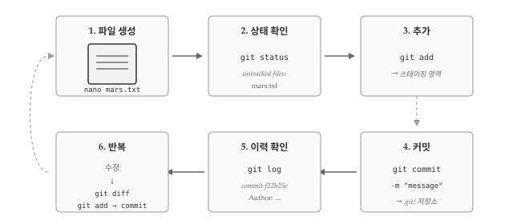
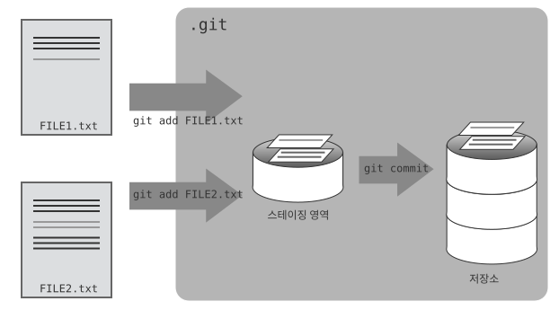

# 변경사항 추적 {#sec-git-tracking}
\index{변경사항 추적}

Git 저장소를 초기화했다면 이제 실제로 파일을 만들고 변경사항을 추적할 차례다.
버전 관리 핵심은 파일 변경 이력을 체계적으로 기록하는 것이며, Git에서는 **추가(add)**와 **커밋(commit)** 두 단계로 변경사항을 기록한다.
파일을 생성하고, 수정하고, 변경사항을 저장소에 기록하는 전체 흐름을 직접 실습하면서 Git의 기본 작업 방식을 익혀보자.

{#fig-git-tracking-overview}

실습을 시작하기 전에 현재 작업 디렉토리가 올바른지 확인해야 한다. Git 명령어는 현재 디렉토리를 기준으로 동작하므로, 의도한 저장소가 아닌 곳에서 명령을 실행하면 예상치 못한 결과가 나올 수 있다. `pwd` 명령어로 현재 위치를 확인하고, `planets` 디렉토리에 있는지 점검한다.

```bash
$ pwd

/home/vlad/Desktop/planets
```

만약 앞선 실습에서 `moons` 하위 디렉토리를 만들고 그 안에서 작업했다면, `cd ..` 명령어로 상위 디렉토리인 `planets`로 돌아와야 한다.

```bash
$ pwd

/home/vlad/Desktop/planets/moons
```

```bash
$ cd ..
```

## 첫 번째 파일 생성과 추적 {#sec-git-tracking-first}

Git 저장소가 준비되었으니 첫 번째 파일을 만들어 추적해보자.
버전 관리의 시작점은 항상 파일 생성이며, 새로 만든 파일을 Git이 인식하고 추적하도록 명시적으로 지정해야 한다.

화성 전진기지 프로젝트의 기록을 담을 `mars.txt` 파일을 생성한다.
파일 편집에는 `nano` 편집기를 사용하지만, 본인이 선호하는 편집기를 사용해도 무방하다.
앞서 `core.editor`로 설정한 편집기와 다른 것을 사용해도 된다.
텍스트 편집기 선택에 관한 자세한 내용은 챗GPT 유닉스 쉘 "어떤 편집기가 좋을까요?" 부분을 참고한다.

```bash
$ nano mars.txt
```

`mars.txt` 파일에 화성에 대한 첫 인상을 기록한다. 텍스트 편집기가 열리면 아래 내용을 입력한다.

```bash
Cold and dry, but everything is my favorite color
```

입력을 마쳤으면 파일을 저장하고 편집기를 종료한다. `nano` 편집기에서는 <kbd>Ctrl</kbd>+<kbd>O</kbd>로 저장하고 <kbd>Ctrl</kbd>+<kbd>X</kbd>로 종료한다. 파일이 제대로 생성되었는지 `ls` 명령어로 디렉토리 내용을 확인하고, `cat` 명령어로 파일 내용을 출력해본다.

```bash
$ ls

mars.txt
```

```bash
$ cat mars.txt

Cold and dry, but everything is my favorite color
```

`git status` 명령어로 프로젝트 상태를 확인하면 Git이 새 파일을 인지했음을 알 수 있다.
\index{git!status}
\index{상태 확인}

```bash
$ git status

On branch master

Initial commit

Untracked files:
   (use "git add <file>..." to include in what will be committed)

	mars.txt
nothing added to commit but untracked files present (use "git add" to track)
```

"untracked files" 메시지는 디렉토리에 Git이 아직 추적하지 않는 파일이 있다는 뜻이다.
`git add` 명령어로 Git에게 파일 추적을 시작하도록 지시한다.
\index{git!add}
\index{추가}

```bash
$ git add mars.txt
```

`git add` 명령어는 별다른 출력 없이 조용히 완료된다. 파일이 제대로 스테이징 영역에 추가되었는지 확인하려면 `git status`를 다시 실행해본다.

```bash
$ git status

On branch master

Initial commit

Changes to be committed:
  (use "git rm --cached <file>..." to unstage)

	new file:   mars.txt

```

Git이 `mars.txt` 파일을 추적 대상으로 인식했지만, 아직 저장소에 변경사항이 기록된 것은 아니다.
변경사항을 영구히 저장하려면 커밋 명령어를 실행해야 한다.
\index{커밋}


```bash
$ git commit -m "Start notes on Mars as a base"

[master (root-commit) f22b25e] Start notes on Mars as a base
 1 file changed, 1 insertion(+)
 create mode 100644 mars.txt
```

`git commit` 명령어를 실행하면 Git은 `git add`로 준비된 모든 변경사항을 `.git` 디렉토리 내부에 영구 저장한다.
저장된 스냅샷을 **커밋(commit)** 또는 **리비전(revision)**이라 부르며, 각 커밋은 고유한 식별자를 갖는다.
위 예시에서 `f22b25e`가 바로 커밋 식별자의 축약형이다. 실습 환경에 따라 다른 값이 표시될 수 있다.

`-m` 플래그("message"의 약자)로 커밋 메시지를 함께 입력한다. 커밋 메시지는 나중에 변경 이유를 파악하는 데 중요한 역할을 한다.
`-m` 옵션 없이 `git commit`을 실행하면 Git이 설정된 편집기(`nano` 또는 `core.editor`에서 지정한 편집기)를 열어 긴 메시지를 작성할 수 있게 해준다.

[좋은 커밋 메시지][commit-messages]는 변경사항을 간결하게 요약하는 한 줄(영문 기준 50자 이하)로 시작한다.
"If applied, this commit will(적용되면 이 커밋은 ~할 것이다)"라는 문장 형식에 맞추어 작성하면 좋다.
상세한 설명이 필요하면 요약줄 다음에 빈 줄을 두고 본문을 작성한다.
본문에는 변경 이유와 영향 범위를 기록한다.

### 좋은 커밋 메시지 선택하기 {#sec-git-tracking-message-practice}
\index{커밋!메시지}

좋은 커밋 메시지와 나쁜 커밋 메시지의 차이를 직접 비교해보자.
`mars.txt` 파일에 "But the Mummy will appreciate the lack of humidity"라는 줄을 추가한 후 커밋한다고 가정하면, 다음 세 가지 메시지 중 어떤 것이 가장 적절할까?

첫 번째 후보는 "Changes"다. 무엇이 변경되었는지 전혀 알 수 없어 나중에 로그를 검토할 때 쓸모가 없다.
두 번째 후보는 "Added line 'But the Mummy will appreciate the lack of humidity' to mars.txt"다. 변경 내용을 그대로 옮겨 적었지만, `git diff`나 `git show`로 언제든 확인할 수 있는 정보를 반복하는 셈이다.
세 번째 후보는 "Discuss effects of Mars' climate on the Mummy"다. 짧고 명확하며 **왜** 변경했는지 의도를 전달한다.

정답은 세 번째다. 커밋 메시지는 "무엇을 바꿨는가"보다 "왜 바꿨는가"에 초점을 맞춰야 한다.

커밋이 완료된 후에는 `git status`로 저장소 상태를 확인하는 것이 좋다. 모든 변경사항이 저장소에 제대로 반영되었는지, 스테이징 영역에 남아 있는 파일이 없는지 점검할 수 있다.

```bash
$ git status

On branch master
nothing to commit, working directory clean
```

"nothing to commit, working directory clean" 메시지가 표시되면 모든 변경사항이 저장소에 반영된 상태다.
작업 이력을 확인하려면 `git log` 명령어를 사용한다.

```bash
$ git log

commit f22b25e3233b4645dabd0d81e651fe074bd8e73b
Author: Vlad Dracula <vlad@tran.sylvan.ia>
Date:   Thu Aug 22 09:51:46 2013 -0400

    Start notes on Mars as a base
```

`git log`는 저장소의 모든 커밋을 시간 역순(최신 순)으로 보여준다. \index{git!log}
각 항목에는 전체 커밋 식별자, 작성자 정보, 작성 일시, 커밋 메시지가 포함된다.
전체 식별자는 앞서 본 축약형 `f22b25e`로 시작하는 긴 문자열이다.

### 저자와 커미터 구분하기 {#sec-git-tracking-author-committer}

Git은 커밋마다 저자(Author)와 커미터(Committer) 두 가지 이름을 기록한다.
대부분의 경우 두 값이 동일하지만, 오픈소스 프로젝트에서 다른 사람의 패치를 대신 커밋할 때는 달라진다.
`git log --format=full` 명령어로 두 정보를 모두 확인할 수 있다.

```bash
$ git log --format=full
```

`--author` 옵션을 사용하면 커밋 시 다른 사람을 저자로 지정할 수 있다.

```bash
$ git commit --author="Vlad Dracula <vlad@tran.sylvan.ia>"
```

직접 실습해보자. 본인을 저자로 한 커밋과 동료를 저자로 지정한 커밋을 각각 생성한 후, `git log`와 `git log --format=full`로 결과를 비교한다.
저자는 코드를 작성한 사람, 커미터는 저장소에 실제로 커밋한 사람이라는 점에서 협업 시 기여 이력을 정확히 추적하는 데 유용하다.

::: callout-caution
### 변경 이력은 어디에 저장되는가?

`ls` 명령어로 디렉토리를 확인하면 `mars.txt` 파일만 보인다.
Git은 모든 변경 이력을 `.git` 숨김 디렉토리에 저장하므로 작업 디렉토리가 복잡해지지 않는다.
덕분에 과거 버전 파일을 실수로 편집하거나 삭제할 위험이 없다.
:::


## 파일 수정과 변경사항 추적 {#sec-git-tracking-modify}

파일을 처음 추적하기 시작한 후에도 계속해서 내용을 수정하고 변경사항을 기록할 수 있다.
Git의 진정한 가치는 파일이 어떻게 변해왔는지 추적하는 데 있으며, 수정 전후의 차이를 확인하는 기능이 핵심이다.

화성의 달이 늑대인간에게 어떤 영향을 미칠지에 대한 내용을 `mars.txt` 파일에 추가한다. 편집기로 파일을 열어 두 번째 줄을 작성하고 저장한다.

```bash
$ nano mars.txt
$ cat mars.txt

Cold and dry, but everything is my favorite color
The two moons may be a problem for Wolfman
```

`git status`로 상태를 확인하면 Git이 파일 변경을 감지했음을 알 수 있다.

``` bash
$ git status

On branch master
Changes not staged for commit:
  (use "git add <file>..." to update what will be committed)
  (use "git checkout -- <file>..." to discard changes in working directory)

	modified:   mars.txt

no changes added to commit (use "git add" and/or "git commit -a")
```

마지막 줄 "no changes added to commit"에 주목하자.
파일이 수정되었지만 `git add`로 스테이징 영역에 올리거나 `git commit`으로 저장소에 기록하지 않은 상태다.

커밋하기 전에 변경사항을 검토하는 습관을 들이는 것이 좋다.
`git diff` 명령어는 현재 파일 상태와 마지막 커밋 간의 차이를 보여준다.

```bash
$ git diff

diff --git a/mars.txt b/mars.txt
index df0654a..315bf3a 100644
--- a/mars.txt
+++ b/mars.txt
@@ -1 +1,2 @@
 Cold and dry, but everything is my favorite color
+The two moons may be a problem for Wolfman
```

출력 결과가 암호처럼 보이지만, `patch` 같은 도구가 파일을 재구성하는 데 사용하는 표준 형식이다.
@fig-git-diff-output 은 각 줄의 의미를 정리한 것이다.
특히 `@@ -1 +1,2 @@` 형태의 헝크(hunk) 헤더는 변경이 발생한 위치를 나타내며, "이전 파일 1번 줄이 현재 파일에서 1~2번 줄로 변경됨"을 의미한다.
헝크 헤더를 읽을 줄 알면 대규모 diff 출력에서도 원하는 변경 지점을 빠르게 찾을 수 있다.

{#fig-git-diff-output}

변경 내용을 검토했으니 저장소에 기록할 차례다. 앞서 배운 대로 커밋을 시도해본다. 변경사항이 정상적으로 커밋될지, 아니면 예상과 다른 결과가 나올지 직접 확인해보자.

``` bash
$ git commit -m "Add concerns about effects of Mars' moons on Wolfman"
$ git status

On branch master
Changes not staged for commit:
  (use "git add <file>..." to update what will be committed)
  (use "git checkout -- <file>..." to discard changes in working directory)

	modified:   mars.txt

no changes added to commit (use "git add" and/or "git commit -a")
```

커밋이 실행되지 않았다. `git add`를 먼저 실행하지 않았기 때문이다.
수정한 파일을 다시 스테이징 영역에 추가한 후 커밋한다.

### 올바른 커밋 순서 이해하기 {#sec-git-tracking-commit-order}

Git 초보자가 자주 겪는 실수가 `git add` 없이 바로 `git commit`을 실행하는 것이다.
로컬 Git 저장소에 `myfile.txt` 파일의 변경사항을 저장하려면 어떤 명령어 조합이 필요할까?

`git commit -m "my recent changes"`만 실행하면 파일이 스테이징 영역에 없으므로 커밋되지 않는다.
`git init myfile.txt`와 `git commit`을 순서대로 실행하는 것도 틀렸다. `git init`은 새 저장소를 생성하는 명령어이지 파일을 추가하는 명령어가 아니기 때문이다.
`git commit -m myfile.txt "my recent changes"` 형식도 문법 오류다.

올바른 순서는 `git add myfile.txt`로 스테이징 영역에 추가한 후 `git commit -m "my recent changes"`로 커밋하는 것이다.
변경사항을 기록하려면 항상 **add → commit** 순서를 따라야 한다.

``` bash
$ git add mars.txt
$ git commit -m "Add concerns about effects of Mars' moons on Wolfman"

[master 34961b1] Add concerns about effects of Mars' moons on Wolfman
 1 file changed, 1 insertion(+)
```

Git이 커밋 전에 반드시 `git add`를 요구하는 이유는 모든 변경사항을 한꺼번에 커밋하고 싶지 않은 경우가 있기 때문이다.
예를 들어 논문을 작성할 때, 본문에 추가한 인용문과 참고문헌은 커밋하고 싶지만 아직 작성 중인 결론 부분은 제외하고 싶을 수 있다.

Git은 **스테이징 영역(staging area)**이라는 중간 단계를 제공하여 선택적 커밋을 가능하게 한다.
스테이징 영역에는 다음 커밋에 포함할 **변경 묶음(change set)**을 모아둔다.


## 스테이징 영역 {#sec-git-tracking-staging}

스테이징 영역(Staging Area)은 Git의 핵심 개념 중 하나로, 작업 디렉토리와 저장소 사이에 위치한 중간 단계다.
커밋에 포함할 변경사항을 선별적으로 모아두는 공간이며, 스테이징 영역을 활용하면 논리적으로 관련 있는 변경사항만 묶어서 커밋할 수 있다.

::: callout-caution
### 스테이징 영역 역할

Git을 사진 촬영에 비유하면, `git add`는 사진에 찍힐 대상을 프레임 안에 배치하는 것이고, `git commit`은 실제로 셔터를 누르는 것이다.
스테이징 영역에 아무것도 없는 상태에서 `git commit`을 실행하면 Git이 `git commit -a` 또는 `git commit --all` 사용을 권유한다.
"모두 모여서 사진 찍자"는 의미인데, 무심코 사용하면 의도치 않은 변경사항까지 커밋에 포함될 수 있다.

따라서 항상 `git add`로 명시적으로 스테이징 영역에 추가하는 습관을 들이는 것이 좋다.
실수로 원치 않는 파일을 스테이징 영역에 올렸다면 "git undo commit" 또는 `git reset`을 검색해보자.
:::

{#fig-git-staging-area}

@fig-git-staging-area 는 작업 디렉토리에서 스테이징 영역을 거쳐 저장소로 변경사항이 이동하는 흐름을 보여준다.
실습을 통해 확인해보자. 먼저 파일에 한 줄을 더 추가한다. 
\index{스테이징 영역}

``` bash
$ nano mars.txt
$ cat mars.txt

Cold and dry, but everything is my favorite color
The two moons may be a problem for Wolfman
But the Mummy will appreciate the lack of humidity
```

``` bash
$ git diff

diff --git a/mars.txt b/mars.txt
index 315bf3a..b36abfd 100644
--- a/mars.txt
+++ b/mars.txt
@@ -1,2 +1,3 @@
 Cold and dry, but everything is my favorite color
 The two moons may be a problem for Wolfman
+But the Mummy will appreciate the lack of humidity
```

`git diff` 출력에서 `+` 기호로 표시된 줄이 새로 추가된 내용이다.
변경사항을 스테이징 영역에 추가한 후 `git diff`가 어떻게 달라지는지 확인해보자.

``` bash
$ git add mars.txt
$ git diff
```

출력 결과가 없다.
`git diff`는 작업 디렉토리와 스테이징 영역 간의 차이를 보여주는데, 변경사항이 이미 스테이징 영역에 올라갔으므로 차이가 없는 것이다.
스테이징 영역과 마지막 커밋 간의 차이를 보려면 `--staged` 옵션을 사용한다.

```bash
$ git diff --staged

diff --git a/mars.txt b/mars.txt
index 315bf3a..b36abfd 100644
--- a/mars.txt
+++ b/mars.txt
@@ -1,2 +1,3 @@
 Cold and dry, but everything is my favorite color
 The two moons may be a problem for Wolfman
+But the Mummy will appreciate the lack of humidity
```

마지막 커밋과 스테이징 영역 사이의 차이가 표시된다.

### 여러 파일 한꺼번에 커밋하기 {#sec-git-tracking-multi-file}

스테이징 영역에는 여러 파일의 변경사항을 담을 수 있다.
논리적으로 관련 있는 변경사항을 하나의 커밋으로 묶으면 나중에 이력을 추적하기 훨씬 쉬워진다.

직접 실습해보자. 먼저 `mars.txt` 파일에 금성(Venus)을 전진기지 후보로 고려한다는 내용을 추가한다.
그 다음 `venus.txt` 파일을 새로 만들어 금성에 관한 첫 생각을 기록한다.

```bash
$ nano mars.txt    # "Maybe I should start with a base on Venus." 추가
$ nano venus.txt   # "Venus is a nice planet..." 작성
```

두 파일을 스테이징 영역에 추가하고 함께 커밋한다.
`git add` 명령어에 여러 파일명을 공백으로 구분하여 전달하거나, 파일별로 따로 실행해도 된다.

```bash
$ git add mars.txt venus.txt
$ git commit -m "Write plans to start a base on Venus"
```

하나의 커밋에 "화성 파일에 금성 언급 추가"와 "금성 파일 신규 생성"이라는 두 변경사항이 함께 기록된다.
관련 있는 작업을 묶어서 커밋하면 나중에 "금성 관련 작업을 언제 시작했는가?"라는 질문에 명확히 답할 수 있다.

스테이징 영역에 추가된 변경사항을 저장소에 기록할 차례다. 미라(Mummy)가 화성의 건조한 기후를 좋아할 것이라는 내용을 담은 커밋 메시지를 작성한다.

``` bash
$ git commit -m "Discuss concerns about Mars' climate for Mummy"

[master 005937f] Discuss concerns about Mars' climate for Mummy
 1 file changed, 1 insertion(+)
```

커밋 완료 후 `git status`로 저장소 상태를 점검한다. 스테이징 영역에 남아 있는 변경사항이 없는지, 작업 디렉토리가 깨끗한 상태인지 확인하는 습관을 들이면 실수를 예방할 수 있다.

``` bash
$ git status

On branch master
nothing to commit, working directory clean
```

"nothing to commit, working directory clean" 메시지는 모든 변경사항이 저장소에 반영되었음을 의미한다. 세 번째 커밋까지 완료했으니 `git log`로 전체 작업 이력을 확인해보자.

``` bash
$ git log

commit 005937fbe2a98fb83f0ade869025dc2636b4dad5
Author: Vlad Dracula <vlad@tran.sylvan.ia>
Date:   Thu Aug 22 10:14:07 2013 -0400

    Discuss concerns about Mars' climate for Mummy

commit 34961b159c27df3b475cfe4415d94a6d1fcd064d
Author: Vlad Dracula <vlad@tran.sylvan.ia>
Date:   Thu Aug 22 10:07:21 2013 -0400

    Add concerns about effects of Mars' moons on Wolfman

commit f22b25e3233b4645dabd0d81e651fe074bd8e73b
Author: Vlad Dracula <vlad@tran.sylvan.ia>
Date:   Thu Aug 22 09:51:46 2013 -0400

    Start notes on Mars as a base
```

::: callout-tip
### diff와 log 출력 다루기

줄 단위 비교로는 세부 변경 내용을 파악하기 어려울 때가 있다. `git diff --color-words` 옵션을 사용하면 변경된 단어만 색상으로 강조되어 문장 내 수정 사항을 한눈에 확인할 수 있다.

`git log` 출력이 화면보다 길면 Git이 자동으로 페이저(pager) 프로그램을 실행한다. 페이저가 실행되면 화면 하단에 프롬프트 대신 `:`가 표시되는데, <kbd>Q</kbd>로 종료하고 <kbd>Spacebar</kbd>로 다음 페이지로 이동한다. `/검색어`를 입력하면 특정 단어를 검색할 수 있고, <kbd>N</kbd>으로 다음 검색 결과로 넘어간다.

커밋 이력이 길어지면 `git log -1`처럼 숫자를 붙여 출력 개수를 제한하거나, `--oneline` 옵션으로 각 커밋을 한 줄로 요약할 수 있다. 여러 옵션을 조합한 `git log --oneline --graph --all --decorate`는 브랜치 구조를 시각적으로 보여주어 프로젝트 이력을 파악하는 데 유용하다.

``` bash
$ git log --oneline --graph --all --decorate

* 005937f Discuss concerns about Mars' climate for Mummy (HEAD, master)
* 34961b1 Add concerns about effects of Mars' moons on Wolfman
* f22b25e Start notes on Mars as a base
```
:::


## 디렉토리와 파일 추가 {#sec-git-tracking-directory}
\index{디렉토리}

프로젝트가 커지면 파일을 디렉토리로 구조화하게 된다. Git에서 디렉토리를 다루는 방식은 파일과 다르므로 두 가지 특성을 알아두어야 한다.

Git은 빈 디렉토리를 추적하지 않는다. 디렉토리 자체가 아닌 그 안에 담긴 파일만 추적 대상으로 삼기 때문이다. `mkdir directory`로 디렉토리를 생성하고 `git add directory`를 실행해도 `git status`에는 아무것도 나타나지 않는다. 빈 디렉토리를 저장소에 포함시켜야 한다면 `.gitkeep` 같은 빈 파일을 넣어두는 관례가 있다. `.gitkeep`은 특별한 파일이 아니라 단지 디렉토리를 비어 있지 않게 만드는 용도이며, 파일명은 원하는 대로 지어도 된다.

반면 파일이 들어 있는 디렉토리를 추가하면 그 안의 모든 파일이 함께 스테이징 영역에 올라간다. `spaceships` 디렉토리를 만들고 파일을 추가한 뒤 `git add spaceships`를 실행하면 디렉토리 내 모든 파일이 한꺼번에 추적 대상이 된다.

``` bash
$ mkdir spaceships
$ touch spaceships/apollo-11 spaceships/sputnik-1
$ git add spaceships
$ git status
$ git commit -m "Add some initial thoughts on spaceships"
```


## 커밋 작업흐름 요약 {#sec-git-tracking-summary}

지금까지 배운 Git의 기본 작업 흐름을 정리해보자. 변경사항을 저장소에 기록하는 과정은 `git add`와 `git commit` 두 단계로 이루어진다. 먼저 `git add`로 변경된 파일을 스테이징 영역에 추가하고, 이어서 `git commit`으로 스테이징 영역에 모인 변경사항을 저장소에 영구 기록한다. 두 단계를 분리함으로써 여러 파일 중 일부만 선택적으로 커밋하거나, 논리적으로 관련 있는 변경사항을 하나의 커밋으로 묶을 수 있다.

@fig-git-commit 은 작업 디렉토리에서 스테이징 영역을 거쳐 저장소로 변경사항이 이동하는 흐름을 보여준다.

{#fig-git-commit}

### bio 저장소 만들기 {#sec-git-tracking-bio-practice}

지금까지 배운 내용을 종합하여 새 저장소를 처음부터 만들어보자.
저장소 생성, 파일 추가, 커밋, 수정, 변경사항 확인까지 전체 흐름을 한 번에 실습한다.

먼저 `bio`라는 디렉토리를 만들고 Git 저장소로 초기화한다.

```bash
$ cd ..
$ mkdir bio && cd bio
$ git init
```

`me.txt` 파일에 3줄짜리 자기소개를 작성하고 첫 번째 커밋을 생성한다.

```bash
$ nano me.txt          # 3줄 자기소개 작성
$ git add me.txt
$ git commit -m 'Adding biography file'
```

파일에서 한 줄을 수정하고 네 번째 줄을 추가한다.
`git diff` 명령어로 원본과 수정본의 차이를 확인한다.

```bash
$ nano me.txt          # 한 줄 수정, 네 번째 줄 추가
$ git diff me.txt      # 변경사항 확인
```

`-` 기호로 표시된 줄이 삭제되거나 수정된 내용이고, `+` 기호로 표시된 줄이 추가된 내용이다.
커밋 전에 `git diff`로 변경사항을 확인하는 습관을 들이면 의도치 않은 수정이 커밋에 포함되는 것을 방지할 수 있다.

[commit-messages]: https://chris.beams.io/posts/git-commit/

::: {.content-visible when-format="pdf"}
\faLightbulb\ 생각해볼 점
:::

::: {.content-visible when-format="html"}
## 💡 생각해볼 점 {.unnumbered}
:::

Git의 변경사항 추적은 `git add`와 `git commit` 두 단계로 이루어진다.
처음에는 왜 한 번에 저장하지 않고 굳이 두 단계를 거쳐야 하는지 의문이 들 수 있다.
스테이징 영역(staging area)이라는 중간 단계가 존재하는 이유는 "논리적으로 관련 있는 변경사항만 묶어서 커밋"하기 위해서다.
논문을 작성할 때 본문 수정과 참고문헌 추가는 함께 커밋하되, 아직 미완성인 결론 부분은 다음 커밋으로 미루는 식이다.

커밋 메시지는 미래의 나 자신과 동료를 위한 기록이다.
"수정함", "버그 fix" 같은 모호한 메시지는 나중에 특정 변경사항을 찾을 때 아무런 도움이 되지 않는다.
"Add concerns about Mars' moons on Wolfman"처럼 변경 이유와 맥락을 담은 메시지가 좋다.
영문 기준 50자 이내로 요약하고, 상세 설명이 필요하면 빈 줄 뒤에 본문을 추가하는 관례를 따르면 로그 출력도 깔끔해진다.

`git diff`는 커밋 전에 변경사항을 검토하는 필수 도구다.
무심코 `git add .`로 모든 파일을 올리면 디버깅용 `print` 문이나 임시 파일까지 커밋에 포함될 수 있다.
`git diff`로 변경 내용을 확인하고, `git diff --staged`로 스테이징 영역에 올라간 내용을 재확인하는 습관이 실수를 줄여준다.
작업 디렉토리, 스테이징 영역, 저장소라는 세 공간의 관계를 이해하면 Git의 동작 방식이 훨씬 명확해진다.

변경사항을 기록하는 방법을 익혔으니, 다음 단계는 기록된 이력을 활용하는 것이다.
특정 커밋 시점의 파일 내용을 확인하거나, 과거 버전으로 되돌리거나, 두 커밋 간의 차이를 비교하는 작업이 가능해진다.
Git의 진정한 가치는 "실수해도 괜찮다"는 안전망을 제공하는 데 있다.
