# 오픈 사이언스 {#sec-git-workflow}

\index{공개 과학} \index{오픈 사이언스} \index{워크플로우}

과학의 본질은 지식의 공유다. 뉴턴이 "거인의 어깨 위에 서 있다"고 말했듯이, 모든 연구는 선행 연구 위에 쌓인다. 그러나 전통적인 학술 출판 시스템은 이러한 공유를 제한해왔다. 논문은 유료 장벽 뒤에 숨고, 데이터와 코드는 연구자 개인 컴퓨터에 묻혀 사라진다. 오픈 사이언스(Open Science)는 이러한 패러다임을 뒤집는다. 연구의 전 과정—데이터 수집부터 분석 코드, 논문 초고까지—을 공개하여 재현가능성을 확보하고 협업을 촉진한다.

Git과 GitHub는 오픈 사이언스 핵심 인프라다. 버전 관리 시스템은 단순히 코드 백업 도구가 아니라, 연구 과정 전체를 기록하는 전자 연구 노트 역할을 한다. 누가, 언제, 무엇을, 왜 변경했는지 추적할 수 있고, 어느 시점으로든 돌아갈 수 있다. 협업자와 실시간으로 작업을 공유하고, 전 세계 연구자가 접근할 수 있는 공개 저장소에 결과물을 게시한다.

하지만 단순히 GitHub에 코드를 올린다고 오픈 사이언스가 완성되는 것은 아니다. 라이선스를 명시하지 않으면 법적으로 재사용이 불가능하다. 개발 플랫폼과 장기 보존 아카이브 역할을 구분해야 한다. 포크(Fork)와 풀 리퀘스트(Pull Request) 워크플로우를 이해해야 오픈소스 프로젝트에 기여할 수 있다. 이번 장에서는 연구자가 실제로 오픈 사이언스를 실천하기 위해 알아야 할 워크플로우를 다룬다.

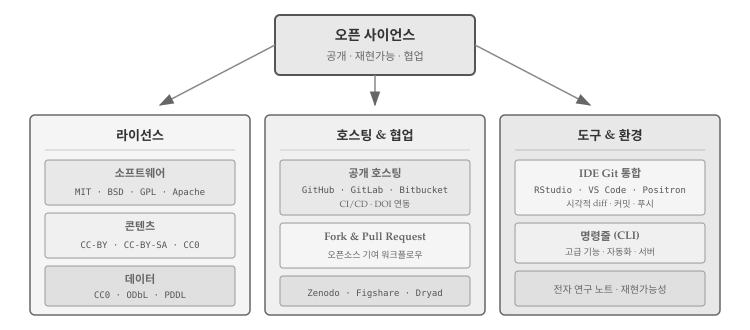{#fig-open-science-overview}

@fig-open-science-overview 는 오픈 사이언스 워크플로우의 네 가지 핵심 요소를 보여준다. 라이선스 선택(소프트웨어 MIT/GPL, 문서 CC-BY, 데이터 CC0), 호스팅 플랫폼 결정(GitHub/GitLab + Zenodo 연동), 포크와 풀 리퀘스트를 통한 협업, IDE 통합을 통한 효율적인 작업 흐름이다.

## 오픈 사이언스 패러다임 {#sec-git-workflow-open}

\index{figshare} \index{Zenodo} \index{Dryad} \index{arXiv} \index{DOI} \index{디지털 객체 식별자}

연구 워크플로우가 근본적으로 바뀌고 있다. 전통적인 방식에서는 과학자가 데이터를 수집하면 학과 서버에 저장하고, 분석 코드는 개인 노트북에만 존재했다. 논문이 출판되어도 코드는 공개되지 않고, 논문 자체도 유료 장벽(paywall) 뒤에 숨어 있었다. 다른 연구자가 결과를 재현하려 해도 방법이 없었다.

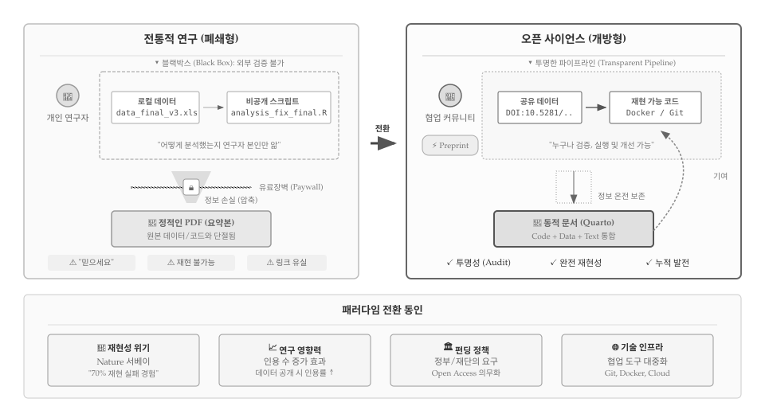{#fig-open-science-paradigm}

@fig-open-science-paradigm 은 두 패러다임 핵심 차이를 보여준다. 전통적 연구에서 데이터와 코드는 "블랙박스" 안에 갇혀 있다. `data_final_v3.xls`, `analysis_fix_final.R` 같은 파일명이 암시하듯 버전 관리 없이 수정을 거듭하고, 연구자 본인만 분석 과정을 알고 있다. 연구 결과가 논문으로 압축되는 과정에서 정보가 손실되고, 유료 장벽(Paywall) 뒤에 숨은 정적인 PDF만 남는다. 독자는 "믿으세요(Trust me)"라는 말에 의존해야 하고, 재현은 불가능하며, 시간이 지나면 링크마저 유실된다..

반면 오픈 사이언스는 "투명한 파이프라인"을 지향한다. 데이터에는 DOI가 부여되어 영구적으로 참조 가능하고, 코드는 Git으로 전체 이력이 기록되며, 도커(Docker)로 실행 환경까지 재현할 수 있다. 정보가 손실 없이 온전히 보존되고, 쿼토(Quarto) 같은 도구로 코드 + 데이터 + 텍스트가 하나의 동적 문서로 통합된다. 프리프린트로 출판 전 피드백을 받고, 커뮤니티 기여가 다시 연구로 환류하는 선순환 구조가 만들어진다. "Show me"—누구나 검증하고, 실행하고, 개선할 수 있다.

### 패러다임 전환 동인

과학계가 오픈 사이언스로 움직이게 된 데는 복합적인 압력이 작용했다. 2010년대 들어 심리학, 의학 등 여러 분야에서 재현가능성 위기가 수면 위로 떠올랐다. 네이처(Nature) 설문조사에 따르면 연구자 70% 이상이 다른 연구를 재현하는 데 실패한 경험이 있다고 응답했고[@Baker2016], 이는 과학적 방법론 자체에 대한 신뢰를 흔들었다. 데이터와 코드가 공개되지 않으니 검증이 불가능했던 것이다. 동시에 연구 공개가 인용 증가로 이어진다는 실증 연구가 축적되면서[@Piwowar2007] 연구자들의 인식도 바뀌기 시작했다. NIH, NSF, EU Horizon 등 주요 연구비 지원 기관이 데이터와 코드 공개를 의무화하자, 오픈 사이언스는 선택이 아닌 필수가 되었다. GitHub, Zenodo 같은 플랫폼이 전 세계 연구자가 실시간으로 협업하고 결과물을 영구 보존할 수 있는 인프라를 제공하면서, 기술적 장벽도 크게 낮아졌다.

### 버전 제어 기반 워크플로우

오픈 사이언스 실천은 구체적인 도구와 워크플로우에서 시작된다. 데이터는 [Figshare](http://figshare.com/), [Zenodo](http://zenodo.org), [Dryad](http://datadryad.org/) 같은 공개 저장소에 업로드되고, [디지털 객체 식별자(DOI)](https://en.wikipedia.org/wiki/Digital_object_identifier)가 부여되어 영구적으로 인용 가능해진다. 분석 코드는 GitHub에서 버전 관리되며, Git을 꾸준히 사용하면 연구 과정 전체가 기록되는 전자 연구 노트가 된다. 누가, 언제, 무엇을, 왜 변경했는지 커밋 메시지와 함께 남고, 각 커밋에 부여된 고유 식별자(SHA)로 특정 시점의 코드를 정확히 참조할 수 있다. 논문이 어느 정도 완성되면 [arXiv](http://arxiv.org/)에 프리프린트로 공개하여 출판 전에 피드백을 받고, 최종 출판 시 데이터, 코드, 프리프린트 링크를 모두 포함하여 누구나 결과를 재현할 수 있게 한다.

버전 제어 저장소에 올라온 모든 것—데이터, 코드, 논문—은 Zenodo 연동을 통해 DOI를 받아 인용 가능한 학술 객체가 된다. 대용량 파일(이미지, 바이너리 데이터 등)은 [Git LFS(Large File Storage)](https://git-lfs.github.com/)를 사용하여 별도 서버에 저장하면서도 버전 관리할 수 있다. [네이처 추천 데이터 저장소](https://www.nature.com/sdata/data-policies/repositories)를 참고하면 분야별로 적합한 저장소를 선택하는 데 도움이 된다.


## 라이선스 선택 {#sec-git-workflow-license}

\index{소프트웨어 라이선스} \index{라이선스!데이터} \index{ODbL} \index{CC0} \index{저작권}

소설을 쓰면 저작권이 생긴다. 그림을 그려도, 음악을 작곡해도, 코드를 작성해도 마찬가지다. 저작권(Copyright)은 창작 행위가 완료되는 순간 자동으로 발생한다. 별도의 등록 절차가 필요 없다. 저작권자는 해당 창작물을 복제, 수정, 배포할 독점적 권리를 갖는다. 다른 사람이 허락 없이 이 권리를 행사하면 저작권 침해가 된다.

소프트웨어 코드도 창작물이다. 100줄짜리 파이썬 스크립트를 작성하면, 그 순간 저작권이 발생한다. GitHub에 코드를 공개했다고 해서 저작권이 사라지는 것이 아니다. 라이선스 없이 공개된 코드는 법적으로 "모든 권리 보유(All Rights Reserved)" 상태다. 누군가 그 코드를 복사해서 자신의 프로젝트에 사용하면, 설령 원저자가 암묵적으로 허용했더라도, 법적으로는 저작권 침해다. "공개되어 있으니 자유롭게 쓸 수 있겠지"라는 생각은 위험하다.

### 라이선스: 저작권 일부 허락

라이선스는 이 문제를 해결한다. 라이선스는 저작권자가 "이런 조건을 지키면 내 창작물을 사용해도 좋다"고 선언하는 법적 문서다. 저작권은 그대로 유지하면서, 특정 권리만 다른 사람에게 허락하는 것이다. MIT 라이선스는 "출처만 밝히면 마음대로 쓰세요"라고 허락하고, GPL은 "수정한 코드도 같은 조건으로 공개하세요"라는 조건을 붙인다. 라이선스가 있어야 다른 연구자가 코드를 안심하고 재사용할 수 있다. 오픈 사이언스의 핵심은 단순한 공개가 아니라 **재사용 가능한 공개**다.

라이선스 선택은 프로젝트 초기에 해야 한다. 협력자가 기여를 시작하면 그들도 자신의 기여분에 대해 저작권을 갖게 된다. 나중에 라이선스를 변경하려면 모든 기여자의 동의가 필요하므로, 협력자가 늘어난 후에는 변경이 사실상 불가능해진다. 연구 프로젝트에서는 코드, 문서, 데이터 각각에 다른 라이선스가 적용된다. 코드에는 MIT나 GPL 같은 소프트웨어 라이선스, 논문이나 매뉴얼에는 크리에이티브 커먼즈(CC), 데이터에는 CC0나 ODbL을 사용한다.

::: {.callout-note}
### 라이선스 vs 특허: 무엇이 다른가?

지적재산권에는 여러 종류가 있다. 소프트웨어와 관련된 대표적인 두 가지가 **저작권(Copyright)**과 **특허(Patent)**다. 둘은 보호 대상부터 다르다. 저작권은 "표현"을 보호한다. 같은 정렬 알고리즘이라도 A가 작성한 코드와 B가 작성한 코드는 각각 별개의 저작권을 갖는다. 반면 특허는 "아이디어"를 보호한다. 특정 알고리즘이나 방법 자체를 독점할 수 있다. @tbl-license-patent 는 두 권리의 주요 차이점을 정리한다.

```{r}
#| label: tbl-license-patent
#| tbl-cap: "저작권과 특허 비교"
#| echo: false

library(gt)
library(tibble)

tibble(
  구분 = c("보호 대상", "발생 시점", "보호 기간", "비용", "오픈소스"),
  `저작권 (라이선스)` = c(
    "표현 (코드의 구체적 작성)",
    "창작 즉시 자동 발생",
    "저작자 사후 70년",
    "무료",
    "MIT, GPL 등으로 공개 가능"
  ),
  특허 = c(
    "아이디어 (알고리즘, 방법)",
    "출원·심사·등록 필요",
    "출원일로부터 20년",
    "출원·유지 비용 발생",
    "특허권 포기 또는 FRAND 조건 필요"
  )
) |>
  gt() |>
  cols_align(align = "left") |>
  tab_options(
    table.font.size = px(13),
    column_labels.font.weight = "bold"
  )
```

오픈소스 라이선스는 저작권에 기반한다. MIT나 GPL로 코드를 공개하면 저작권은 유지하면서 사용 권한을 허락하는 것이다. 하지만 특허는 별개의 문제다. 코드에 MIT 라이선스를 붙여도, 그 코드가 구현한 알고리즘에 특허가 걸려 있으면 사용자가 특허 침해로 소송당할 수 있다. 대표적인 사례가 MP3다. Fraunhofer Institute가 MP3 압축 알고리즘 특허를 보유하고 있어서, 리눅스 배포판들은 오랫동안 MP3 인코더를 기본 포함하지 못했다. LAME 같은 오픈소스 MP3 인코더는 코드 자체는 GPL로 공개되어 있었지만, 특허 때문에 사용에 법적 위험이 따랐다. 2017년 특허가 만료된 후에야 자유롭게 사용할 수 있게 되었다. Apache 2.0 라이선스는 이런 문제를 해결하기 위해 특허권까지 명시적으로 허여한다. 특허가 중요한 프로젝트라면 Apache 2.0을 고려할 필요가 있다.
:::

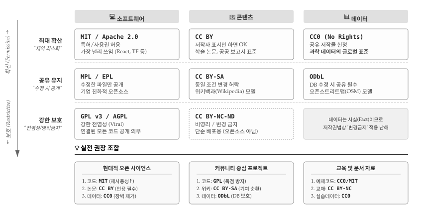{#fig-license-overview}

@fig-license-overview 는 라이선스 선택을 위한 전략 매트릭스다. 세로축은 확산(Permissive)에서 보호(Restrictive)로 이어지는 스펙트럼을 나타내고, 가로축은 소프트웨어, 콘텐츠, 데이터 세 영역을 구분한다. 최대 확산을 원한다면 MIT/CC BY/CC0, 수정본도 공개하길 원하면 MPL/CC BY-SA/ODbL, 강한 보호가 필요하면 GPL 계열을 선택한다. 하단의 실전 권장 조합을 참고하면 프로젝트 성격에 맞는 라이선스를 빠르게 결정할 수 있다. 현대적 오픈 사이언스 프로젝트라면 코드에 MIT, 논문에 CC BY, 데이터에 CC0 조합이 표준이다. [choosealicense.com](https://choosealicense.com/)에서 더 상세한 비교가 가능하다.

### 소프트웨어 라이선스 {#sec-git-workflow-license-sw}

\index{라이선스!GPL} \index{라이선스!MIT} \index{라이선스!아파치} \index{OSI}

오픈소스 라이선스는 크게 두 계열로 나뉜다. **허용적(Permissive) 라이선스**는 사용자에게 최대한의 자유를 부여한다. MIT나 Apache 2.0이 대표적인데, 저작자 표시만 하면 상업적 사용, 수정, 재배포 모두 자유롭다. **카피레프트(Copyleft) 라이선스**는 파생 저작물도 동일한 조건으로 공개하도록 요구한다. GPL이 대표적이며, "전염성(viral)"이라는 별명이 붙었다. GPL 코드를 포함한 소프트웨어를 배포하려면 전체 소스 코드를 GPL로 공개해야 한다.

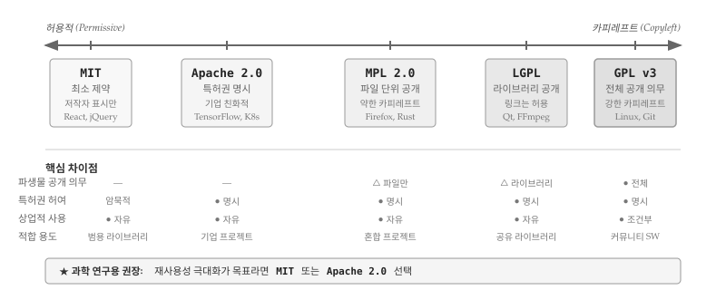{#fig-license-spectrum}

@fig-license-spectrum 은 주요 라이선스를 허용적↔카피레프트 스펙트럼 위에 배치한 것이다. MIT는 가장 단순하고 제약이 적다. 라이선스 전문이 불과 몇 줄이라 이해하기 쉽고, React, jQuery 같은 프론트엔드 라이브러리가 주로 채택한다. Apache 2.0은 MIT와 유사하지만 특허권을 명시적으로 허여하는 조항이 추가되어 기업 환경에 적합하다. TensorFlow, Kubernetes가 Apache 2.0을 사용한다.

MPL(Mozilla Public License)과 LGPL은 중간 지대를 차지한다. MPL은 수정한 파일만 공개하면 되고, LGPL은 라이브러리 자체만 공개하면 해당 라이브러리를 사용하는 애플리케이션은 독점 소프트웨어로 유지할 수 있다. Firefox(MPL), Qt(LGPL)가 예시다. GPL v3는 스펙트럼 끝에 위치하며 가장 강력한 카피레프트 조건을 부과한다. 리눅스 커널과 Git이 GPL을 채택했다.

::: callout-note
### 라이선스 선택 의사결정

라이선스 선택은 프로젝트 목표에 따라 달라진다. **재사용성 극대화**가 목표라면 MIT나 Apache 2.0이 적합하다. 기업을 포함한 누구나 부담 없이 사용할 수 있어 채택률이 높아진다. **커뮤니티 기여 환류**를 강제하고 싶다면 GPL 계열을 고려한다. 수정본이 다시 오픈소스로 돌아오기 때문에 커뮤니티 전체가 혜택을 받는다. **특허 분쟁 방지**가 중요하다면 Apache 2.0이 안전하다. 특허권 허여 조항이 명시되어 있어 기업 법무팀도 안심한다.

[Open Source Initiative](https://opensource.org/licenses)와 [Free Software Foundation](https://www.gnu.org/licenses/license-list.html)에서 승인한 라이선스를 선택하면 법적 검증이 완료된 것이므로 안전하다. 연구자를 위한 소프트웨어 라이선스 선택 가이드[@Morin2012]가 별도 있어 참조하여 활용한다. 
:::

라이선스 결정은 프로젝트 초기에 내려야 한다. 협력자가 기여를 시작하면 해당 기여분에 대한 저작권이 협력자에게 귀속되므로, 나중에 라이선스를 변경하려면 모든 기여자의 동의를 받아야 한다. 이 과정이 복잡해지면 라이선스 변경 자체가 불가능해질 수 있다. 저장소를 생성할 때 `LICENSE` 파일을 함께 만들어 두는 것이 좋다. GitHub는 저장소 생성 시 라이선스 템플릿을 제공하므로 클릭 한 번으로 설정할 수 있다.


::: callout-tip
### 실습: 오픈소스 라이선스 탐색하기

평소 사용하는 소프트웨어 대부분은 오픈소스로 공개되어 있다. 아래 목록에서 프로젝트 하나를 골라 GitHub 저장소를 방문해 보자. 저장소 루트에 있는 라이선스 파일(`LICENSE` 또는 `COPYING`)을 열어 어떤 조건으로 소프트웨어 사용을 허락하는지 확인한다. 앞서 살펴본 MIT, Apache, GPL 중 어느 유형에 해당하는지 비교해 보자.

-   [Git](https://github.com/git/git): 버전 관리 시스템
-   [CPython](https://github.com/python/cpython): 파이썬 공식 구현체
-   [Jupyter](https://github.com/jupyter): 대화형 노트북 환경
-   [EtherPad](https://github.com/ether/etherpad-lite): 실시간 협업 문서 편집기
:::

### 콘텐츠 라이선스 {#sec-git-workflow-license-content}

\index{라이선스!콘텐츠} \index{크리에이티브 커먼즈}

저장소에 매뉴얼, 기술 보고서, 원고 같은 창의적 저작물이 포함되면 소프트웨어용 라이선스로는 부족하다. MIT나 GPL은 소스 코드의 복제, 수정, 배포를 전제로 설계되었기 때문에 텍스트, 이미지, 영상 같은 콘텐츠에 적용하면 어색한 부분이 생긴다. [크리에이티브 커먼즈(Creative Commons)](http://creativecommons.org/)는 콘텐츠 라이선스 문제를 해결하기 위해 4가지 기본 요소를 조합한 라이선스 체계를 만들었다.

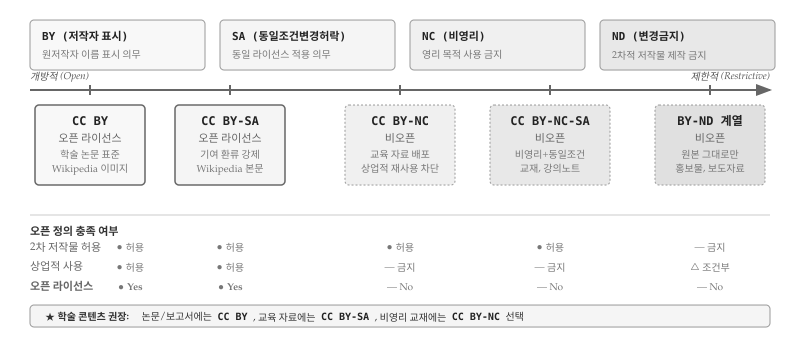{#fig-cc-license}

@fig-cc-license 는 4가지 기본 요소와 주요 조합을 보여준다. **BY(저작자 표시)**는 모든 CC 라이선스의 기본 요소로, 원저작자 이름을 반드시 표시해야 한다. **SA(동일조건변경허락)**는 GPL의 카피레프트와 유사하게, 2차 저작물도 동일한 라이선스를 적용하도록 요구한다. **NC(비영리)**는 영리 목적 사용을 금지하고, **ND(변경금지)**는 원본 그대로만 배포하도록 제한한다.

중요한 점은 [오픈 정의(Open Definition)](http://opendefinition.org/)에 따르면 **CC BY와 CC BY-SA만 진정한 오픈 라이선스**로 인정된다는 것이다. NC나 ND 조건이 붙으면 상업적 재사용이나 파생 저작물 생성이 제한되어 "오픈"의 정의를 충족하지 못한다. 위키백과(Wikipedia) 본문은 CC BY-SA를 사용하여 누구나 내용을 수정하고 공유할 수 있지만, 수정본도 같은 라이선스를 적용해야 한다. 학술 논문이나 공공 보고서는 대부분 CC BY를 채택하여 인용만 제대로 하면 자유롭게 재사용할 수 있게 한다.

::: callout-note
### 콘텐츠 라이선스 선택 의사결정

**광범위한 재사용**이 목표라면 CC BY를 선택한다. 기업, 언론, 다른 연구자 모두 부담 없이 활용할 수 있어 영향력 확산에 유리하다. **기여 환류**를 강제하고 싶다면 CC BY-SA가 적합하다. 위키백과 모델처럼 수정본이 다시 오픈으로 돌아온다. **비영리 교육 자료**라면 CC BY-NC를 고려할 수 있다. 기업의 상업적 활용은 차단하면서 교육 기관과 개인 학습자는 자유롭게 사용할 수 있다. 다만 NC 조건은 "비영리"의 정의가 모호하여 분쟁 소지가 있으므로 신중히 선택해야 한다.
:::

### 데이터 라이선스 {#sec-git-workflow-license-data}

\index{라이선스!데이터} \index{오픈 라이선스} \index{CC0} \index{ODbL}

데이터는 소프트웨어나 콘텐츠와 법적 성격이 근본적으로 다르다. 대부분 국가의 저작권법은 "사실(fact)"에 대해 저작권을 인정하지 않는다. 측정값, 관측 데이터, 통계 수치는 누가 측정하든 동일한 결과가 나오므로 창작성이 인정되지 않는다. 그러나 데이터베이스의 "선택과 배열"에는 창작성이 인정될 수 있고, EU의 sui generis 데이터베이스권처럼 별도 보호 체계를 갖춘 지역도 있다. 이런 법적 불확실성 때문에 데이터에는 명시적 라이선스가 더욱 중요하다.

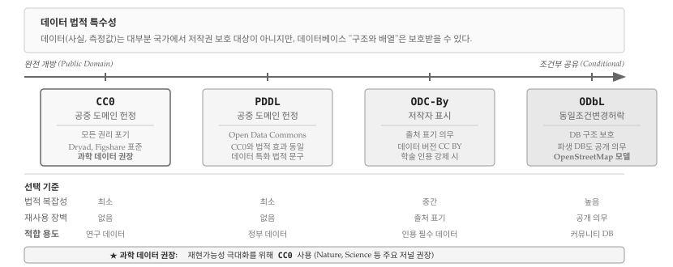{#fig-data-license}

@fig-data-license 는 주요 데이터 라이선스를 개방성 순으로 배치한 것이다. **CC0(Creative Commons Zero)**는 저작권, 데이터베이스권 등 모든 권리를 포기하고 공중 도메인에 헌정한다. 법적 복잡성이 가장 낮고 재사용 장벽이 없어 과학 데이터의 글로벌 표준으로 자리 잡았다. Nature, Science 등 주요 저널이 데이터 공개 시 CC0를 권장하고, Dryad와 Figshare 같은 데이터 저장소도 CC0를 기본으로 요구한다.

**PDDL(Public Domain Dedication and License)**은 Open Data Commons에서 만든 라이선스로, CC0와 법적 효과는 동일하지만 데이터베이스에 특화된 법적 문구를 사용한다. **ODC-By**는 데이터 버전의 CC BY로, 출처 표기를 의무화한다. 학술적 인용을 강제하고 싶을 때 사용하지만, CC0에 비해 재사용 장벽이 높아진다.

**ODbL(Open Database License)**은 데이터베이스의 GPL이라 할 수 있다. 데이터베이스를 수정하거나 파생 데이터베이스를 만들면 동일한 ODbL로 공개해야 한다. 다만 개별 데이터 항목은 자유롭게 추출하여 사용할 수 있다. 오픈스트리트맵(OpenStreetMap)이 ODbL을 채택하여 지도 데이터가 항상 오픈으로 유지되도록 보장한다. 커뮤니티 기반 데이터 프로젝트에 적합하지만, 법적 복잡성이 높아 단순 연구 데이터에는 과도할 수 있다.

::: callout-tip
### 실습: 데이터 라이선스 확인하기

아래 데이터 저장소에서 실제 데이터셋의 라이선스를 확인해 보자. 대부분 CC0를 사용하지만, 일부는 다른 조건을 붙이기도 한다.

- [Dryad](https://datadryad.org/): 생명과학 연구 데이터 (CC0 필수)
- [Zenodo](https://zenodo.org/): 범용 연구 데이터 (다양한 라이선스 선택 가능)
- [Kaggle Datasets](https://www.kaggle.com/datasets): 머신러닝용 데이터 (라이선스 다양)
:::

### 라이선스와 인용 {#sec-git-workflow-citation}

\index{인용} \index{CITATION.cff} \index{DOI}

라이선스와 인용(Citation)은 서로 다른 문제를 해결한다. **라이선스**는 법적 사용 권한을 부여하고, **인용**은 학술적 기여를 인정하는 메커니즘이다. CC0로 데이터를 공개하면 법적으로 출처 표기 의무가 사라지지만, 학술적 관행상 인용은 여전히 기대된다. 연구자 입장에서 인용은 곧 학문적 평판과 연구비 확보에 직결되므로, 법적 의무가 없더라도 인용을 쉽게 할 수 있는 장치를 마련해야 한다.

인용 정보를 제공하는 표준 방식은 저장소 루트에 `CITATION.cff` 파일을 포함하는 것이다. CFF(Citation File Format)는 YAML 기반의 기계 판독 가능한 형식으로, 저자, 제목, 버전, DOI 등 인용에 필요한 메타데이터를 구조화한다. GitHub는 저장소에 `CITATION.cff` 파일이 있으면 "Cite this repository" 버튼을 자동으로 표시하고, 와 APA 형식으로 즉시 복사할 수 있게 한다. Zenodo와 연동하면 릴리스마다 자동으로 DOI가 발급되어 논문에서 특정 버전의 코드를 정확히 인용할 수 있다.

```yaml
cff-version: 1.2.0
message: "이 소프트웨어를 사용하셨다면 아래와 같이 인용해 주세요."
authors:
  - family-names: "김"
    given-names: "연구"
    orcid: "https://orcid.org/0000-0000-0000-0000"
title: "재현가능 분석 패키지"
version: 1.0.0
doi: 10.5281/zenodo.1234567
date-released: 2024-01-15
url: "https://github.com/example/reproducible-analysis"
```

하나의 프로젝트에 여러 유형의 산출물이 포함되면 각각 다른 라이선스를 적용하는 **혼합 라이선스 전략**이 필요하다. [소프트웨어 카펜트리(Software Carpentry)](http://software-carpentry.org/license.html)는 교육 자료에 CC BY, 코드에 MIT 라이선스를 적용하는 조합을 사용한다. 콘텐츠는 자유롭게 수정·재배포하되 출처를 밝히고, 코드는 어떤 프로젝트에든 가져다 쓸 수 있게 한 것이다. 현대적 오픈 사이언스 프로젝트에서 가장 널리 채택되는 조합은 코드에 MIT, 논문/문서에 CC BY, 데이터에 CC0를 적용하는 것이다.


## 호스팅 {#sec-git-workflow-hosting}

\index{호스팅} \index{GitHub} \index{GitLab} \index{Zenodo} \index{Software Heritage} \index{FAIR4RS}

"GitHub은 실험실이고, Zenodo는 도서관이다." 연구 소프트웨어 호스팅의 본질을 이보다 명쾌하게 표현하기 어렵다. 실험실은 매일 실험이 진행되고 장비가 교체되며 결과물이 수정되는 역동적인 공간이다. 도서관은 완성된 저작물을 영구히 보존하고 누구나 찾아볼 수 있게 정리하는 정적인 공간이다. 연구 소프트웨어도 마찬가지로, 개발 단계에서는 실험실 같은 플랫폼이 필요하고, 출판 단계에서는 도서관 같은 아카이브가 필요하다.

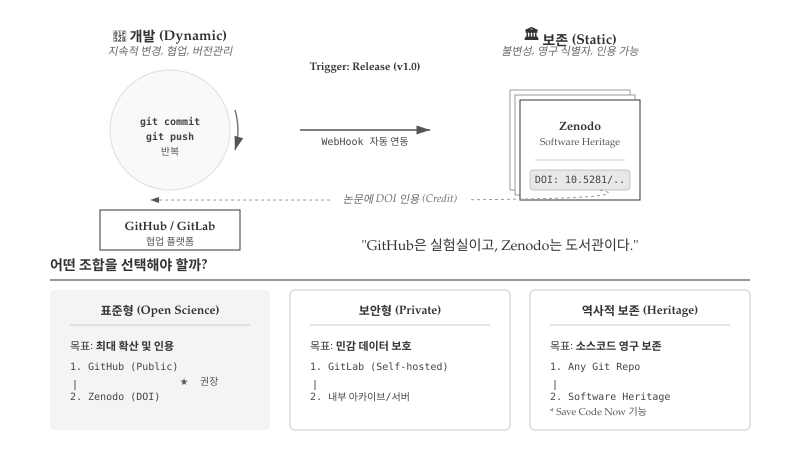{#fig-hosting-options}

@fig-hosting-options 에서 왼쪽 "개발(Dynamic)" 영역은 `git commit`과 `git push`가 반복되는 역동적 공간이다. 코드가 매일 수정되고, 브랜치가 생성되었다가 병합되며, 협업자 간에 변경 사항이 실시간으로 공유된다. [GitHub](http://github.com)와 [GitLab](https://about.gitlab.com/)이 대표적인 개발 플랫폼으로, 버전 관리, 이슈 추적, 코드 리뷰, CI/CD 파이프라인을 제공한다. 오른쪽 "보존(Static)" 영역은 릴리스가 트리거되는 순간 스냅샷이 저장되는 불변의 공간이다. [Zenodo](https://zenodo.org/)나 [Software Heritage](https://www.softwareheritage.org/)가 대표적으로, DOI나 SWHID 같은 영구 식별자를 부여하여 특정 버전의 코드를 영원히 인용할 수 있게 한다.

### 개발과 보존의 본질적 차이

GitHub나 GitLab은 **개발 플랫폼**이지 **아카이브**가 아니다. 저장소 소유자가 언제든 삭제할 수 있고, 서비스 정책도 변경될 수 있다. 실제로 2019년 GitHub이 미국 제재 대상국 개발자들의 접근을 차단했을 때, 수많은 오픈소스 프로젝트가 일시적으로 접근 불가 상태가 되었다. Google Code, Gitorious, BitBucket의 Mercurial 지원 종료 사례에서 보듯, 플랫폼 수명은 연구 결과물 수명보다 짧을 수 있다. 2022년 발표된 [FAIR4RS 원칙](https://www.nature.com/articles/s41597-022-01710-x)(FAIR for Research Software)은 연구 소프트웨어도 데이터처럼 검색 가능(Findable), 접근 가능(Accessible), 상호운용 가능(Interoperable), 재사용 가능(Reusable)해야 한다고 명시한다. 개발 플랫폼만으로는 FAIR 원칙을 충족할 수 없다.

Zenodo는 CERN이 운영하는 범용 연구 아카이브로, GitHub 릴리스와 WebHook으로 자동 연동된다. `v1.0` 태그를 붙여 릴리스를 생성하면 Zenodo가 자동으로 스냅샷을 저장하고 DOI를 발급한다. [`10.5281/zenodo.57467`](https://zenodo.org/record/57467)처럼 버전별 DOI가 부여되고, "부모 DOI"는 항상 최신 버전을 가리킨다. 논문에서 특정 버전 코드를 정확히 인용할 수 있어 재현성이 담보된다. Software Heritage는 UNESCO가 지원하는 비영리 아카이브로, 전 세계 모든 공개 소스코드를 수집한다. "Save Code Now" 기능으로 임의의 Git 저장소를 즉시 보존할 수 있고, SWHID라는 영구 식별자로 특정 커밋까지 참조할 수 있다.

### 호스팅 전략과 지속적 통합 {#sec-git-workflow-ci}

\index{지속적 통합} \index{CI/CD}

프로젝트 성격에 따라 호스팅 전략이 달라진다. **표준형(Open Science)**은 최대 확산과 인용을 목표로 GitHub에서 공개 개발하고 Zenodo로 DOI를 발급받는 조합이다. **보안형(Private)**은 IRB 승인 자료나 환자 정보처럼 민감 데이터를 다룰 때 GitLab 셀프 호스팅으로 기관 내부에서 개발하고, 공개 가능한 부분만 선별하여 아카이브에 업로드한다. **역사적 보존(Heritage)**은 Software Heritage의 "Save Code Now"로 어떤 Git 저장소든 영구 보존할 수 있다.

표준형 워크플로우는 [Zenodo의 GitHub 연동 가이드](https://docs.github.com/en/repositories/archiving-a-github-repository/referencing-and-citing-content)를 따르면 10분 안에 설정된다. 릴리스마다 자동으로 DOI가 발급되고, README에 DOI 배지를 추가하면 방문자가 인용 정보를 즉시 확인할 수 있다. 개발 플랫폼의 진정한 가치는 지속적 통합(Continuous Integration, CI)에 있다. 코드가 커밋될 때마다 자동으로 빌드와 테스트가 실행되어 버그가 저장소에 들어오기 전에 차단된다. GitHub Actions, GitLab CI/CD 모두 오픈소스 프로젝트에 무료로 제공되며, YAML 파일 하나로 설정이 끝난다. 풀 리퀘스트에 녹색 체크 표시가 뜨면 리뷰어는 "제출된 코드가 최소한 기존 테스트를 깨뜨리지 않는다"는 확신을 갖고 병합할 수 있다.

::: callout-note
### 제도적 장벽과 현실적 대응

오픈 사이언스가 이상적이라 해도 현실에는 제약이 있다. 특허 출원 전 공개는 신규성을 상실시킬 수 있고, 기관의 지적재산 정책이 공개를 제한하기도 한다. 기밀 유지 계약(NDA)이 걸린 산학 협력 프로젝트도 있다. 제약에 직면했을 때는 두 가지 전략이 있다. 하나는 특정 프로젝트나 도메인에 대해 예외를 요청하는 것이고, 다른 하나는 기관의 정책 자체를 바꾸도록 설득하는 것이다. 후자가 더 어렵지만 장기적으로 더 큰 영향을 미친다. 오픈 사이언스의 인용 증가 효과, 재현성 담보, 협업 용이성을 데이터로 제시하면 정책 변화의 근거가 된다.
:::


## 포크와 풀 리퀘스트 {#sec-git-workflow-fork-pr}

\index{포크} \index{풀 리퀘스트} \index{PR}

앞선 협업 장에서 다룬 **협력자 모델(Collaborator Model)**은 소유자가 협력자에게 저장소 쓰기 권한을 부여하는 방식이다. 신뢰된 팀원 간의 협업에 적합하지만, 오픈소스 프로젝트처럼 불특정 다수가 기여하는 환경에서는 **포크 모델(Fork Model)**이 더 적합하다. 포크 모델의 핵심은 원본 저장소에 쓰기 권한이 없더라도 기여할 수 있다는 점이다.

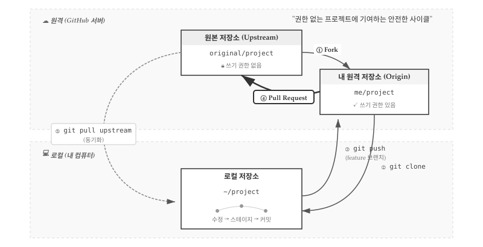{#fig-fork-pr-workflow}

@fig-fork-pr-workflow 는 포크 모델 전체 흐름을 보여준다. 원격 영역에는 쓰기 권한이 없는 원본 저장소(Upstream)와 쓰기 권한이 있는 내 원격 저장소(Origin)가 있고, 로컬 영역에는 실제 작업이 이루어지는 로컬 저장소가 있다. 다섯 단계 사이클이 반복되면서 기여가 이루어진다.

### 포크와 클론 {#sec-git-workflow-fork-clone}

워크플로우는 **포크(Fork)**로 시작한다. GitHub 웹 인터페이스에서 원본 저장소의 "Fork" 버튼을 클릭하면 자신의 계정에 동일한 저장소가 복사된다. 원본 저장소 `original/project`가 `me/project`로 복제되는 것이다. 포크된 저장소에는 쓰기 권한이 있으므로 자유롭게 수정할 수 있다.

포크가 완료되면 **클론(Clone)**으로 로컬 환경에 저장소를 가져온다. `git clone` 명령은 Origin(내 원격 저장소)에서 로컬로 전체 이력을 복제한다.

``` bash
$ git clone https://github.com/me/project.git
$ cd project
```

### 브랜치 작업과 푸시 {#sec-git-workflow-branch-push}

로컬 저장소에서 기능 브랜치를 생성하고 작업한다. main 브랜치에 직접 커밋하지 않고 별도 브랜치에서 작업하는 것이 관례다. 수정 → 스테이지 → 커밋 사이클을 반복하며 변경 사항을 쌓아간다.

``` bash
$ git checkout -b feature-branch
# 코드 수정
$ git add .
$ git commit -m "Add new feature"
```

작업이 완료되면 **푸시(Push)**로 변경 사항을 Origin에 올린다. 반드시 main이 아닌 feature 브랜치로 푸시해야 하는데, 여기에는 몇 가지 중요한 이유가 있다.

첫째, 풀 리퀘스트는 본질적으로 두 브랜치를 비교하는 작업이다. Origin의 feature 브랜치와 Upstream의 main 브랜치가 서로 달라야 "이런 변경 사항이 있으니 병합해 달라"는 요청이 성립한다. 만약 Origin의 main에 직접 푸시하면 비교 대상이 모호해지고, 풀 리퀘스트 생성 자체가 복잡해진다.

둘째, feature 브랜치를 사용하면 여러 작업을 동시에 진행할 수 있다. 예를 들어 `fix-typo`, `add-feature`, `update-docs` 세 개의 브랜치를 만들어 각각 독립적인 풀 리퀘스트를 생성할 수 있다. main에 직접 커밋하면 이런 분리가 불가능하고, 관련 없는 변경들이 하나의 PR에 뒤섞이게 된다.

셋째, 포크한 저장소의 main 브랜치를 깨끗하게 유지해야 Upstream과의 동기화가 수월하다. main 브랜치에 로컬 변경이 섞여 있으면 `git pull upstream` 시 충돌이 발생하기 쉽다. feature 브랜치에서만 작업하고 main은 Upstream의 복사본으로 유지하는 것이 좋다.

``` bash
$ git push origin feature-branch
```

### 풀 리퀘스트 생성 {#sec-git-workflow-pr-create}

푸시가 완료되면 GitHub 웹 인터페이스에서 **풀 리퀘스트(Pull Request)**를 생성한다. Origin의 feature 브랜치에서 Upstream의 main 브랜치로 병합을 요청하는 것이다. 풀 리퀘스트는 "내 변경 사항을 원본 저장소로 가져가 달라"는 요청이므로, 원본 저장소 관리자가 코드 리뷰를 거쳐 승인하면 병합(Merge)된다.

효과적인 풀 리퀘스트 작성을 위해 몇 가지 원칙을 지키면 좋다. 하나의 PR에는 하나의 기능이나 버그 수정만 포함하여 리뷰 부담을 줄인다. PR 설명에는 변경 사유, 테스트 방법, 관련 이슈 번호를 명시한다. CI 테스트가 통과해야 병합 가능하도록 설정하고, 적절한 리뷰어를 지정하여 피드백을 요청한다.

### Upstream 동기화 {#sec-git-workflow-upstream-sync}

포크한 저장소는 원본과 자동으로 동기화되지 않는다. 원본 저장소에 다른 기여자의 변경 사항이 병합되면 내 포크는 뒤처지게 된다. `git pull upstream` 명령으로 원본의 최신 변경 사항을 로컬로 가져와 동기화해야 한다.

``` bash
$ git remote add upstream https://github.com/original/project.git
$ git fetch upstream
$ git merge upstream/main
```

Upstream 원격을 한 번 등록해두면 이후에는 `git fetch upstream`과 `git merge upstream/main`만 반복하면 된다. 새로운 기능 브랜치를 시작하기 전에 항상 Upstream과 동기화하는 습관을 들이면 충돌을 최소화할 수 있다.

## IDE와 Git 통합 {#sec-git-workflow-ide}

\index{통합개발환경} \index{IDE} \index{RStudio} \index{VS Code} \index{Positron}

Git을 사용하는 방법은 크게 두 가지다. 터미널에서 명령어를 직접 입력하는 CLI(Command Line Interface) 방식과, RStudio나 VS Code 같은 통합개발환경(IDE)에서 버튼을 클릭하는 방식이다. 두 방식은 상호 배타적이 아니라 보완적이다. 일상적인 add, commit, push, pull 작업은 IDE에서 시각적으로 처리하고, rebase나 cherry-pick 같은 고급 기능은 필요할 때 CLI로 수행하는 하이브리드 접근이 효율적이다.

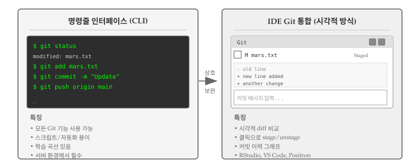{#fig-ide-git-integration}

@fig-ide-git-integration 은 명령줄 인터페이스와 IDE 통합 방식의 차이를 보여준다. 명령줄 방식은 모든 Git 기능을 사용할 수 있고 스크립트 자동화에 유리하다. 서버 환경에서는 CLI가 필수다. 반면 IDE 통합 방식은 시각적 diff 비교, 클릭으로 stage/unstage, 커밋 이력 그래프 등을 제공하여 직관적인 작업이 가능하다.

### RStudio Git 통합 {#sec-git-workflow-rstudio}

R 프로그래밍 언어 전용 통합개발환경 RStudio는 Git 통합이 잘 되어 있다. 일반적인 Git 작업에 대한 시각적 인터페이스를 제공하며, 고급 기능이 필요할 때는 내장 터미널에서 Git 명령을 직접 실행할 수 있다.

RStudio에서 Git을 사용하려면 먼저 프로젝트를 생성한다. @fig-rstudio-project 좌측처럼 File 메뉴에서 "New Project..."를 선택하면 프로젝트 생성 대화 상자가 열린다. 이미 로컬에 `planets` 같은 Git 저장소가 있다면 우측처럼 "Existing Directory" 옵션을 선택한다. GitHub에서 저장소를 복제하려면 "Version Control" 옵션을 선택하면 된다.

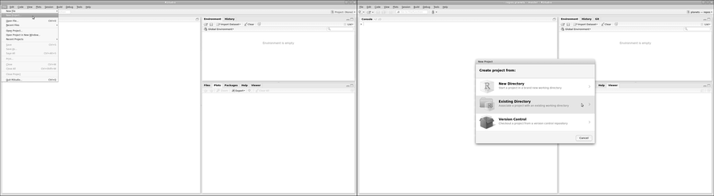{#fig-rstudio-project}

@fig-rstudio-setup 좌측에서 "Browse..."를 클릭하여 Git 저장소가 있는 디렉토리를 선택한 후 "Create Project"를 클릭한다. 프로젝트가 생성되면 우측처럼 RStudio가 해당 디렉토리를 Git 저장소로 인식하고, 우상단에 Git 패널이 나타난다. 메뉴 바의 Git 탭을 통해 다양한 버전 제어 기능에 접근할 수 있다.

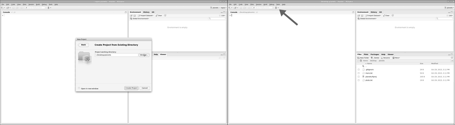{#fig-rstudio-setup}

::: callout-tip
### Git 실행파일을 찾을 수 없는 경우

\index{git} "Version Control" 옵션이 보이지 않거나 Git 기능이 작동하지 않으면 RStudio가 Git 실행파일 위치를 모르는 것이다. `Tools` → `Global Options` → `Git/SVN`에서 Git 실행파일 경로를 지정해야 한다. 맥/리눅스에서는 터미널에서 `which git`, 윈도우에서는 명령 프롬프트에서 `where git`을 실행하면 경로를 확인할 수 있다.
:::

프로젝트 설정이 완료되면 파일을 편집하고 커밋할 수 있다. @fig-rstudio-edit 좌측처럼 Files 패널에서 파일을 선택하여 편집하면 Git 패널에 변경된 파일이 표시된다. 우측처럼 Git 메뉴에서 "Commit..."을 클릭하면 커밋 대화 상자가 열린다.

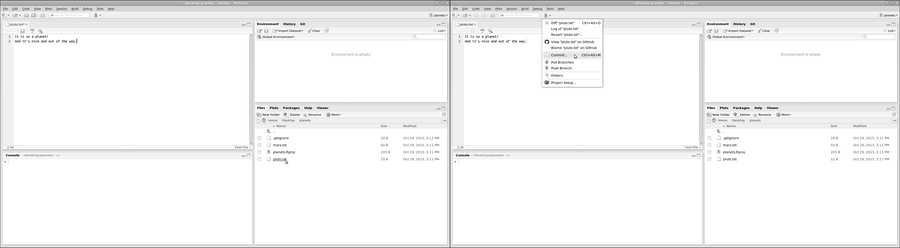{#fig-rstudio-edit}

@fig-rstudio-commit 좌측은 커밋 대화 상자다. 상단에서 커밋할 파일을 선택(Staged 체크)하고, 하단에서 변경 내용을 diff 형식으로 확인할 수 있다. 커밋 메시지를 입력한 후 "Commit" 버튼을 클릭한다. 우측처럼 Git 메뉴에서 "Push Branch"로 원격 저장소에 푸시하거나, "Pull Branch"로 원격 변경 사항을 가져올 수 있다. 푸시/풀 버튼이 비활성화되어 있다면 터미널에서 `git push -u origin main`을 실행하여 원격 저장소를 설정한다.

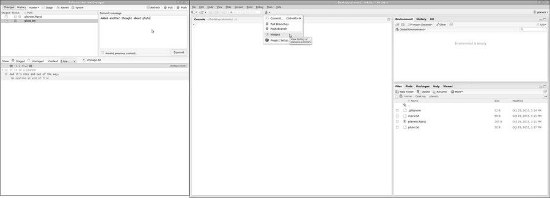{#fig-rstudio-commit}

커밋 이력을 확인하려면 "History" 메뉴를 사용한다. @fig-rstudio-history 좌측은 `git log`의 시각적 버전으로, 각 커밋의 변경 내용을 클릭하여 확인할 수 있다. 우측은 `.gitignore` 파일 설정 화면이다. RStudio는 프로젝트 파일(.Rproj.user/, .Rhistory 등)을 자동으로 생성하는데, 버전 제어에서 제외하려면 `.gitignore`에 추가한다. 대용량 데이터 파일이나 API 키가 포함된 파일도 여기에 등록하여 저장소에 포함되지 않도록 한다.

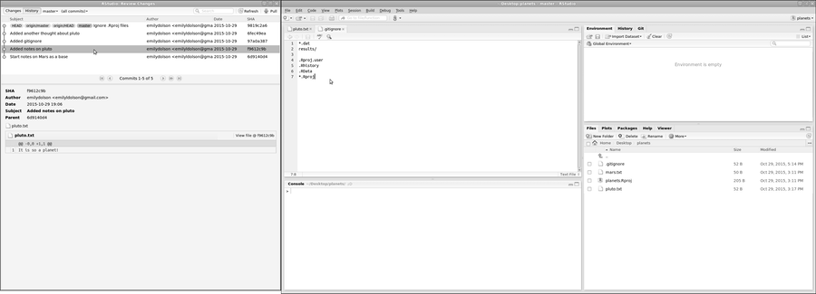{#fig-rstudio-history}

::: callout-tip
### 일회용 산출물 버전관리

일반적으로 일회용 출력(또는 읽기 전용 데이터)을 버전 제어는 권장하지 않는다. `.gitignore` 파일을 수정하여 Git이 파일과 디렉토리를 무시하도록 설정한다. 예를 들어, 그래프 출력물을 저장하는 `graphs` 디렉토리를 버전 제어에서 제외하려면 `.gitignore` 파일에 `graphs/`를 추가한다. RStudio에서 `dir.create("./graphs")` 명령으로 디렉토리를 생성하고, `.gitignore` 파일을 편집하여 블랙리스트에 추가한다.
:::

::: {.content-visible when-format="pdf"}
\faLightbulb\ 생각해볼 점
:::

::: {.content-visible when-format="html"}
## 💡 생각해볼 점 {.unnumbered}
:::

오픈 사이언스는 단순히 연구 결과물을 공개하는 것 이상의 의미를 갖는다. 라이선스를 명시하지 않은 코드는 법적으로 재사용이 불가능하다. "공개되어 있으니 자유롭게 쓸 수 있겠지"라는 생각은 위험하다. MIT나 CC-BY 같은 라이선스를 명시적으로 선택해야 비로소 다른 사람이 안심하고 활용할 수 있다. 프로젝트 시작 단계에서 라이선스를 결정하는 것이 중요한데, 나중에 협력자가 늘어나면 모든 기여자의 동의를 받아야 하기 때문이다.

호스팅 선택도 신중해야 한다. GitHub가 가장 널리 사용되지만, 민감한 데이터가 포함된 연구라면 기관 자체 서버나 셀프 호스팅 가능한 GitLab이 더 적합할 수 있다. 데이터에 DOI를 부여하려면 Zenodo나 Figshare 같은 전문 데이터 저장소를 활용해야 한다. GitHub 저장소와 Zenodo를 연동하면 릴리스마다 자동으로 DOI가 생성되어 논문에서 코드를 인용할 수 있게 된다.

포크와 풀 리퀘스트 워크플로우는 오픈소스 생태계의 핵심이다. 원본 저장소에 쓰기 권한이 없어도 기여할 수 있다는 점이 오픈소스를 가능하게 한다. 처음에는 다소 복잡해 보이지만, Fork → Clone → Branch → Commit → Push → PR의 흐름을 몇 번 연습하면 자연스러워진다. 소규모 프로젝트에서도 PR 기반 워크플로우를 도입하면 코드 리뷰 문화가 자리 잡아 품질이 높아진다.

IDE의 Git 통합 기능은 진입 장벽을 크게 낮춰준다. 명령줄이 익숙하지 않은 연구자도 RStudio나 VS Code에서 클릭 몇 번으로 커밋과 푸시를 수행할 수 있다. 하지만 충돌 해결이나 rebase 같은 상황에서는 여전히 CLI 지식이 필요하다. 둘 다 익혀두면 상황에 따라 효율적인 방법을 선택할 수 있다.

::: {.content-visible when-format="html"}
::: callout-warning
"공개(open)"의 반대는 "폐쇄(closed)"가 아니라 "망가짐(broken)"이다.<br> The opposite of "open" isn't "closed".
The opposite of "open" is "broken".<br> -- John Wilbanks
:::
:::

::: {.content-visible when-format="pdf"}
```{=tex}
\begin{shadequote}[r]{John Wilbanks}
"공개(open)"의 반대는 "폐쇄(closed)"가 아니라 "망가짐(broken)"이다.\\
The opposite of "open" isn't "closed". The opposite of "open" is "broken".
\end{shadequote}
```
:::

