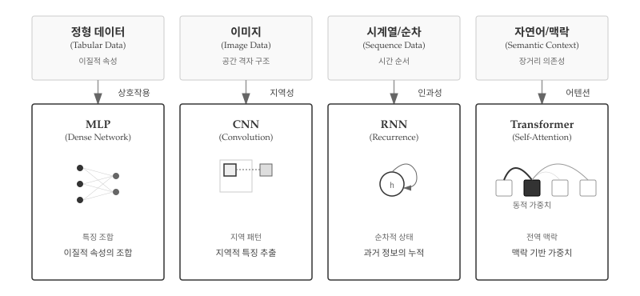
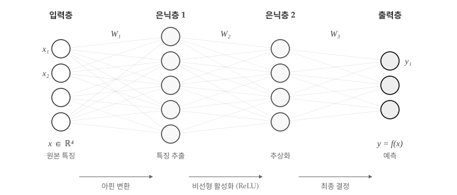
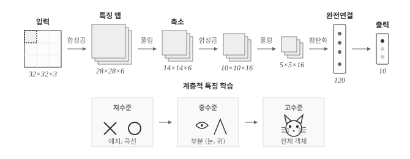
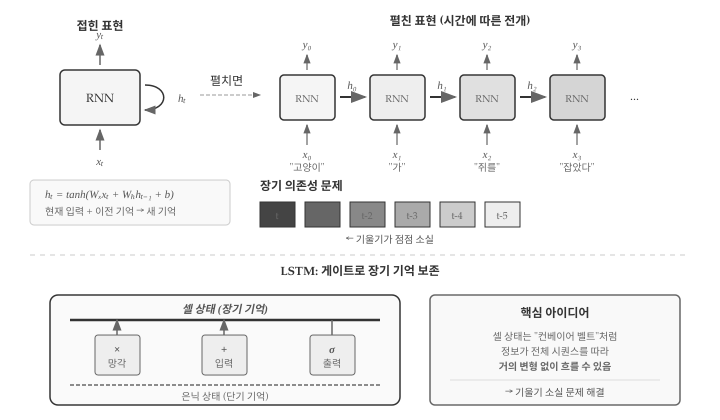
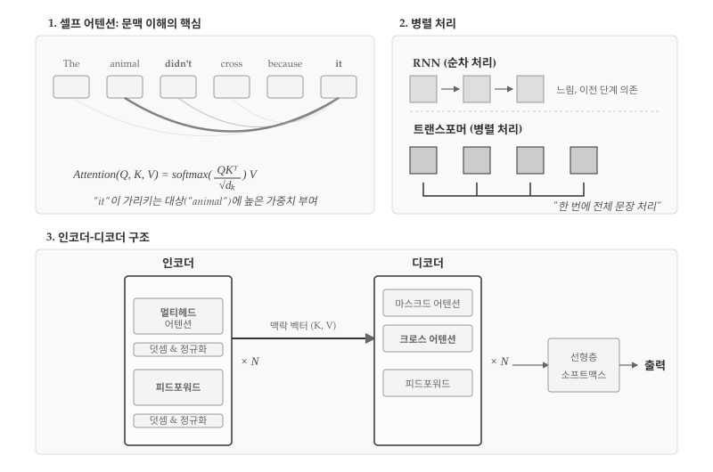
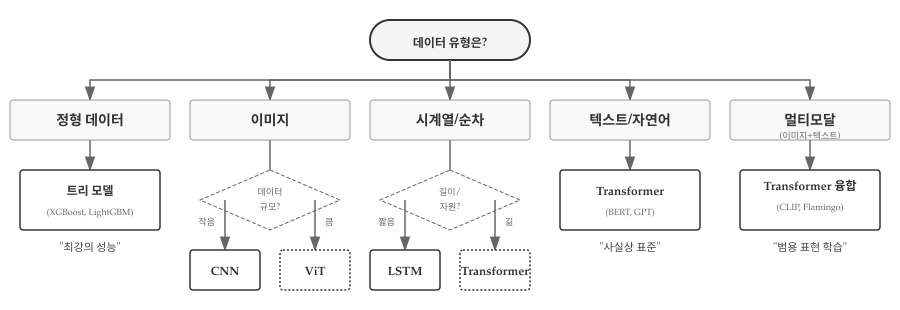

# 신경망 아키텍처 {#sec-ml-architecture}

기계학습에서 아키텍처(architecture)는 데이터가 모델 내부를 어떻게 흐르는지 결정하는 구조적 설계를 의미한다. 건축에서 건물의 구조가 용도에 따라 달라지듯, 신경망 아키텍처도 처리하려는 데이터 유형에 따라 발전해 왔다. 이미지에는 CNN, 시계열에는 RNN, 그리고 텍스트와 범용 작업에는 Transformer가 각각 최적화된 구조로 자리잡았다.

{#fig-ml-architecture-evolution}

@fig-ml-architecture-evolution 은 데이터의 본질적 특성이 아키텍처 선택을 어떻게 결정하는지 보여준다. 정형 데이터는 나이, 도시, 소득처럼 서로 다른 유형의 속성이 섞여 있다. MLP는 완전 연결 구조로 이러한 이질적 특징들의 상호작용을 학습한다. 이미지는 격자 구조를 가진다. 픽셀들은 공간상에서 규칙적으로 배열되어 있고, 인접한 픽셀끼리 강한 상관관계를 보인다. CNN은 작은 필터로 지역적 패턴을 포착하여 에지, 텍스처, 물체를 계층적으로 인식한다. 시계열이나 텍스트 같은 순차 데이터는 시간 순서가 핵심이다. "고양이가 쥐를 잡았다"와 "쥐가 고양이를 잡았다"는 순서만 다를 뿐인데 의미가 정반대다. RNN은 은닉 상태를 순환시켜 과거 정보를 누적하고, Transformer는 어텐션으로 문장 전체의 맥락을 동시에 파악한다. 자연어는 장거리 의존성이 중요하다. "어제 공원에서 ... (100단어) ... 그 강아지"처럼 먼 거리에 있는 단어 간 관계를 파악해야 한다. Transformer의 셀프 어텐션은 모든 단어 쌍의 관계를 한 번에 계산하여 이 문제를 해결한다. 멀티모달 데이터는 이미지와 텍스트를 동시에 처리한다. CLIP이나 Flamingo 같은 모델은 Transformer 구조로 서로 다른 양식의 정보를 통합된 표현 공간에서 학습한다.

아키텍처 선택의 핵심 원리는 "귀납적 편향(Inductive Bias) 매칭"이다. MLP는 특별한 구조적 가정 없이 모든 입력 조합을 탐색하지만, CNN은 "지역성"이라는 강한 가정을 내장한다. 멀리 떨어진 픽셀보다 이웃한 픽셀이 더 관련성이 높다고 미리 가정한다. RNN은 "인과성"을 가정한다. 과거는 미래에 영향을 주지만 그 반대는 아니라고 본다. Transformer는 이러한 제약을 최소화하여 데이터가 스스로 관계를 드러내도록 한다. 데이터가 실제로 격자 구조나 순차 구조를 가진다면, 그에 맞는 귀납적 편향을 가진 모델이 효율적이다. 반대로 데이터 구조가 복잡하거나 알려지지 않았다면, Transformer 같은 범용 구조가 유리하다.

## 다층 퍼셉트론: 모든 것의 시작 {#sec-ml-architecture-mlp}

다층 퍼셉트론(MLP, Multi-Layer Perceptron)은 가장 기본적인 신경망 구조다. 입력층, 은닉층, 출력층으로 구성되며, 각 층의 뉴런은 다음 층의 모든 뉴런과 연결된다(완전 연결, Fully Connected).

{#fig-ml-architecture-mlp}

@fig-ml-architecture-mlp 는 MLP 핵심 구조를 보여준다. 입력층 모든 뉴런이 은닉층 모든 뉴런과 연결되고, 은닉층은 다시 출력층과 완전히 연결된다. 가중치 행렬 W₁, W₂, W₃가 각 층 사이 연결 강도를 결정하며, ReLU 같은 활성화 함수가 비선형성을 부여한다. 그림 하단 처리 흐름은 MLP가 데이터를 변환하는 두 가지 핵심 연산을 보여준다.

**아핀 변환(Affine Transform)**은 선형 변환과 평행 이동을 결합한 연산이다. 수식으로 표현하면 $z = Wx + b$로, 입력 벡터 $x$에 가중치 행렬 $W$를 곱하고 편향 벡터 $b$를 더한다. 기하학적으로 보면 데이터를 회전, 확대/축소, 이동시키는 변환이다. 하지만 아핀 변환만으로는 선형 함수만 표현할 수 있다. 아무리 많은 선형 층을 쌓아도 결과는 여전히 하나의 선형 함수와 동일하다. $W_2(W_1x + b_1) + b_2 = W'x + b'$처럼 단일 행렬 연산으로 축약되기 때문이다.

**비선형 활성화(Non-linear Activation)**가 이 한계를 돌파한다. ReLU($\max(0, x)$), 시그모이드($\frac{1}{1+e^{-x}}$), tanh 같은 활성화 함수를 층 사이에 삽입하면 네트워크가 복잡한 비선형 패턴을 학습할 수 있다. ReLU는 음수를 0으로 만들고 양수는 그대로 통과시키는 단순한 함수지만, 이 비선형성 덕분에 심층 네트워크가 XOR 문제부터 이미지 인식까지 다양한 비선형 함수를 근사할 수 있다. 아핀 변환이 "데이터를 새로운 좌표계로 옮기는" 역할이라면, 비선형 활성화는 "좌표계를 구부려서 복잡한 결정 경계를 만드는" 역할이다.

```python
import torch
import torch.nn as nn

class MLP(nn.Module):
    def __init__(self, input_dim, hidden_dim, output_dim):
        super().__init__()
        self.fc1 = nn.Linear(input_dim, hidden_dim)
        self.fc2 = nn.Linear(hidden_dim, hidden_dim)
        self.fc3 = nn.Linear(hidden_dim, output_dim)
        self.relu = nn.ReLU()

    def forward(self, x):
        x = self.relu(self.fc1(x))
        x = self.relu(self.fc2(x))
        return self.fc3(x)

# 예: 10차원 입력 → 64개 은닉 뉴런 → 3개 클래스 분류
model = MLP(input_dim=10, hidden_dim=64, output_dim=3)
```

MLP 핵심 원리는 범용 근사 정리(Universal Approximation Theorem)다.[^uat] 충분히 넓은 은닉층을 가진 MLP는 어떤 연속 함수든 근사할 수 있다. 임의 연속 함수 $f: [0,1]^n \to \mathbb{R}$와 임의의 $\epsilon > 0$에 대해, 단일 은닉층을 가진 신경망 $F(x) = \sum_{i=1}^{N} \alpha_i \sigma(w_i^T x + b_i)$가 존재하여 $\sup_{x \in [0,1]^n} |F(x) - f(x)| < \epsilon$을 만족한다. 여기서 $\sigma$는 시그모이드나 ReLU 같은 비선형 활성화 함수이고, $N$은 충분히 큰 은닉 뉴런 수다. 단, 정리는 근사 가능성만 보장할 뿐, 필요한 뉴런 수 $N$이나 학습 가능성은 보장하지 않는다.

이론적으로 강력하지만, 실제로는 몇 가지 한계가 있다. 입력 차원이 커지면 필요한 파라미터 수가 폭발적으로 증가한다. 28×28 픽셀 흑백 이미지만 해도 784차원이 된다. 이미지의 픽셀을 1차원으로 펼치면 인접 픽셀 간 관계가 사라진다. 왼쪽 위 픽셀과 오른쪽 아래 픽셀이 구조적으로 동등하게 취급된다. 시퀀스 데이터의 순서 정보도 직접 활용하지 못한다. "고양이가 쥐를"과 "쥐를 고양이가"가 같은 단어 집합으로 보일 수 있다. 이러한 한계를 극복하기 위해 데이터 구조에 특화된 아키텍처가 등장했다.

## CNN: 공간 구조를 이해하다 {#sec-ml-architecture-cnn}

합성곱 신경망(CNN, Convolutional Neural Network)은 이미지의 공간적 구조를 활용하도록 설계되었다. 1998년 얀 르쿤(Yann LeCun)이 LeNet으로 손글씨 숫자 인식에 성공했고, 2012년 알렉스 크리제브스키(Alex Krizhevsky)의 AlexNet이 ImageNet 대회에서 오류율을 절반으로 낮추며 딥러닝 혁명의 서막을 열었다.

{#fig-ml-architecture-cnn}

@fig-ml-architecture-cnn 은 CNN 아키텍처를 보여준다. 합성곱과 풀링을 반복하며 공간 크기는 줄어들고 채널 수는 늘어난다. 저수준 에지에서 고수준 객체로 계층적 추상화가 일어나는 구조다.

CNN 설계의 핵심 통찰은 **지역적 연결(Local Connectivity)**과 **가중치 공유(Parameter Sharing)**다. 지역적 연결은 인접 픽셀끼리 강한 상관관계를 가진다는 이미지의 본질을 반영한다. 3×3 필터는 한 번에 9개 픽셀만 보며, 고양이 귀를 인식하는 데 반대편 구석 픽셀은 불필요하다. 가중치 공유는 동일 필터를 이미지 전체에 적용한다. MLP는 위치마다 별도 가중치가 필요하지만, CNN은 3×3 필터 9개 파라미터로 수백만 픽셀을 처리한다. 파라미터 효율성뿐 아니라, 물체가 어디에 있든 동일하게 인식하는 이동 불변성(Translation Invariance)까지 얻는다.

풀링(Pooling)은 "무엇이 있는가"를 보존하고 "정확히 어디에 있는가"를 버린다. 2×2 최대 풀링은 4픽셀 중 가장 큰 값만 선택하여 해상도를 절반으로 줄인다. 고양이가 이미지에서 10픽셀 왼쪽으로 이동해도 "고양이가 있다"는 판단에는 영향이 없어야 한다. 풀링이 바로 이 위치 둔감성을 제공한다.

```python
import torch.nn as nn

class SimpleCNN(nn.Module):
    def __init__(self):
        super().__init__()
        # 합성곱 층: 3x3 필터로 지역적 패턴 추출
        self.conv1 = nn.Conv2d(in_channels=1, out_channels=32,
                                kernel_size=3, padding=1)
        self.conv2 = nn.Conv2d(32, 64, kernel_size=3, padding=1)

        # 풀링: 공간 크기 축소, 위치 불변성 확보
        self.pool = nn.MaxPool2d(kernel_size=2, stride=2)

        # 완전 연결층: 최종 분류
        self.fc = nn.Linear(64 * 7 * 7, 10)

    def forward(self, x):
        # x: (batch, 1, 28, 28)
        x = self.pool(torch.relu(self.conv1(x)))  # → (batch, 32, 14, 14)
        x = self.pool(torch.relu(self.conv2(x)))  # → (batch, 64, 7, 7)
        x = x.view(x.size(0), -1)                 # Flatten
        return self.fc(x)                          # → (batch, 10)
```

CNN 각 층이 학습하는 특징은 계층적 구조를 이룬다. 초기층은 에지와 색상 변화를, 중간층은 텍스처와 패턴을, 깊은 층은 눈이나 바퀴 같은 부분 객체를, 최상위층은 얼굴이나 자동차 같은 전체 객체를 인식한다. 2012년 AlexNet 내부를 시각화한 연구에서 이 계층적 특징 학습이 실제로 일어남을 확인했다.

CNN은 이후 더 깊어졌다. 2015년 허카이밍(Kaiming He)의 ResNet은 잔차 연결(Skip Connection)로 152층까지 쌓았고, 기울기 소실 없이 학습할 수 있음을 보였다. 최근 Vision Transformer(ViT)가 대규모 데이터에서 CNN을 능가하기도 하지만, 데이터가 적은 환경에서는 CNN의 귀납적 편향이 여전히 유리하다. "지역성"이라는 사전 지식이 적은 데이터에서 더 빠른 수렴을 가능하게 하기 때문이다.

## RNN: 시간을 기억하다 {#sec-ml-architecture-rnn}

순환 신경망(RNN, Recurrent Neural Network)은 시퀀스 데이터를 위해 설계되었다. 텍스트, 음성, 주가처럼 순서가 의미를 결정하는 데이터에서 "고양이가 쥐를 잡았다"와 "쥐가 고양이를 잡았다"는 완전히 다른 의미를 가진다.

{#fig-ml-architecture-rnn}

@fig-ml-architecture-rnn 상단은 RNN의 두 가지 표현을 보여준다. 왼쪽 "접힌 표현"은 자기 순환 구조를 간결하게 나타내고, 오른쪽 "펼친 표현"은 시간에 따라 동일한 RNN 셀이 반복 적용되는 모습이다. "고양이", "가", "쥐를", "잡았다"가 순차적으로 입력되면 은닉 상태 $h$가 각 시점의 문맥을 누적하며 전달된다. 핵심 수식 $h_t = \tanh(W_x x_t + W_h h_{t-1} + b)$는 현재 입력과 이전 기억을 결합해 새 기억을 만드는 과정을 표현한다.

```python
class SimpleRNN(nn.Module):
    def __init__(self, input_dim, hidden_dim, output_dim):
        super().__init__()
        self.rnn = nn.RNN(input_dim, hidden_dim, batch_first=True)
        self.fc = nn.Linear(hidden_dim, output_dim)

    def forward(self, x):
        # x: (batch, seq_len, input_dim)
        output, h_n = self.rnn(x)  # h_n: 마지막 은닉 상태
        return self.fc(h_n.squeeze(0))
```

RNN의 치명적 한계는 **장기 의존성 문제(Long-term Dependency)**다. @fig-ml-architecture-rnn 중간의 기울기 소실 시각화가 보여주듯, 역전파 시 기울기가 시간을 거슬러 전파되면서 점점 작아진다. 시점 $t$에서 $t-5$로 갈수록 색이 옅어지는 것은 기울기가 소실되어 먼 과거 정보가 학습에 거의 기여하지 못함을 의미한다. "어제 공원에서 ... (100단어) ... 그 강아지"에서 "그 강아지"가 무엇을 가리키는지 파악하기 어렵다.

LSTM(Long Short-Term Memory)은 이 문제를 **게이트 메커니즘**으로 해결한다. @fig-ml-architecture-rnn 하단은 LSTM의 핵심 구조를 보여준다. 셀 상태(Cell State)는 "장기 기억"을 담당하는 컨베이어 벨트처럼 정보가 거의 변형 없이 전체 시퀀스를 따라 흐를 수 있다. 세 개의 게이트가 정보 흐름을 제어한다: 망각 게이트(×)는 불필요한 정보를 삭제하고, 입력 게이트(+)는 새 정보를 추가하며, 출력 게이트(σ)는 현재 출력에 사용할 정보를 선택한다.

```python
# LSTM: 게이트로 장기 기억 유지
self.lstm = nn.LSTM(input_dim, hidden_dim, batch_first=True)

# GRU: 게이트를 2개로 간소화한 변형
self.gru = nn.GRU(input_dim, hidden_dim, batch_first=True)
```

셀 상태가 기울기 소실을 해결하는 원리는 잔차 연결(Skip Connection)과 유사하다. 기울기가 셀 상태를 따라 거의 그대로 역전파되므로, 수백 시점 전의 정보도 학습에 기여할 수 있다. 2015-2016년경 LSTM은 기계 번역과 음성 인식에서 최고 성능을 달성했지만, 순차 처리라는 본질적 한계로 인해 병렬화가 어려웠다. Transformer가 이 문제를 해결하며 새로운 시대를 열었다.

## Transformer: 어텐션이 전부다 {#sec-ml-architecture-transformer}

2017년 구글의 "Attention Is All You Need" 논문[@vaswani2017attention]은 딥러닝 역사의 전환점이 되었다. Transformer는 RNN의 순차적 처리 방식을 버리고, **어텐션(Attention)** 메커니즘만으로 시퀀스를 처리한다.

{#fig-ml-architecture-transformer}

@fig-ml-architecture-transformer 는 Transformer의 핵심을 세 부분으로 나눠 보여준다. 첫 번째 섹션은 셀프 어텐션의 원리다. "The animal didn't cross because it"이라는 문장에서 "it"이 무엇을 가리키는지 파악하는 과정을 시각화했다. "it"에서 "animal"로 향하는 굵은 곡선이 높은 어텐션 가중치를 나타내고, 다른 단어들로 향하는 가는 곡선은 상대적으로 낮은 가중치를 보여준다. 하단의 수식 $\text{Attention}(Q, K, V) = \text{softmax}(\frac{QK^T}{\sqrt{d_k}})V$가 이 연산을 수학적으로 표현한다.

두 번째 섹션은 RNN과 Transformer의 처리 방식 차이다. RNN은 순차 처리 방식으로 이전 단계가 완료되어야 다음 단계를 시작할 수 있어 느리고 이전 단계에 의존적이다. 반면 Transformer는 병렬 처리로 모든 단어를 동시에 처리하여 "한 번에 전체 문장 처리"가 가능하다. 하단의 연결선이 모든 블록이 동시에 처리됨을 보여준다.

세 번째 섹션은 인코더-디코더 구조다. 인코더는 멀티헤드 어텐션과 피드포워드 네트워크를 N번 반복하며, 각 층마다 덧셈과 정규화(Add & Norm)로 잔차 연결을 수행한다. 디코더는 마스크드 어텐션으로 미래 정보 누출을 방지하고, 크로스 어텐션으로 인코더의 맥락 벡터(K, V)를 참조한다. 최종 출력은 선형층과 소프트맥스를 거쳐 다음 토큰 확률 분포가 된다.

**Q, K, V: 검색 엔진의 비유**

어텐션의 Query, Key, Value는 검색 엔진에 비유하면 직관적으로 이해된다. 쿼리(Q)는 "무엇을 찾고 있는가"이고, 키(K)는 "각 항목이 무엇을 제공하는가"이며, 값(V)은 "실제로 가져올 정보"다. "it"이라는 단어가 쿼리를 생성하면, 문장의 모든 단어가 키를 제공하고, 쿼리-키 유사도에 따라 값을 가중 합산한다. "animal"의 키가 "it"의 쿼리와 높은 유사도를 보이므로, "animal"의 값이 많이 반영된다.

```python
import torch.nn.functional as F

def scaled_dot_product_attention(Q, K, V):
    d_k = Q.size(-1)
    scores = torch.matmul(Q, K.transpose(-2, -1)) / math.sqrt(d_k)
    attention_weights = F.softmax(scores, dim=-1)
    return torch.matmul(attention_weights, V)
```

$\sqrt{d_k}$로 나누는 스케일링이 핵심이다. 차원이 커지면 내적 값도 커져서 소프트맥스 출력이 극단적으로 치우친다. 스케일링 없이는 기울기가 거의 0이 되어 학습이 멈춘다. 이 작은 트릭이 Transformer의 안정적 학습을 가능케 했다.

**멀티헤드 어텐션: 다양한 관점으로 보기**

단일 어텐션은 하나의 관점으로만 관계를 파악한다. "bank"라는 단어는 문맥에 따라 "은행"일 수도 있고 "강둑"일 수도 있다. 멀티헤드 어텐션은 8개(또는 그 이상) 헤드가 각기 다른 관점에서 관계를 학습한다. 한 헤드는 구문적 관계(주어-동사)를, 다른 헤드는 의미적 관계(대명사-선행사)를 포착할 수 있다. 마치 한 문장을 여러 전문가가 각자의 시각으로 분석한 뒤 의견을 종합하는 것과 같다.

**위치 인코딩: 순서 정보의 주입**

어텐션 연산 자체는 순서를 모른다. "고양이가 쥐를 잡았다"와 "쥐가 고양이를 잡았다"가 동일한 단어 집합으로 보인다. 위치 인코딩(Positional Encoding)이 이 문제를 해결한다. 사인과 코사인 함수를 조합하여 각 위치에 고유한 벡터를 부여하고, 단어 임베딩에 더한다. 신기하게도 이 단순한 방법으로 Transformer는 수천 토큰의 상대적 위치 관계까지 학습한다.

**병렬 처리와 O(n²)의 트레이드오프**

Transformer가 RNN을 대체한 핵심은 병렬화다. RNN은 t번째 단어를 처리하려면 t-1번째까지 완료해야 하므로 1000개 단어면 1000번 순차 연산이 필요하다. Transformer는 모든 단어 쌍의 관계를 한 번에 계산하여 GPU 수천 코어를 동시에 활용한다. 학습 속도가 극적으로 빨라지고, 장거리 의존성도 단일 연산으로 포착된다. 대신 계산 복잡도가 O(n²)이다. 시퀀스 길이가 두 배면 계산량은 네 배다. GPT-4의 128K 토큰 컨텍스트는 이 O(n²) 병목을 극복하기 위해 Sparse Attention 같은 기법을 동원했을 것으로 추정된다.

**확장성: 왜 Transformer만 조 단위 파라미터까지 성장했나**

논문 제목 "Attention Is All You Need"는 RNN이나 CNN 없이 어텐션만으로 충분하다는 선언이다. 이 단순한 구조가 놀라운 확장성을 제공했다. 층을 깊게 쌓아도, 헤드를 늘려도, 은닉 차원을 키워도 구조가 동일하게 유지된다. 복잡한 순환 연결이나 합성곱 필터 설계가 필요 없다. 덕분에 GPT-3의 1750억 파라미터, GPT-4의 추정 1조+ 파라미터까지 스케일업이 가능했다. Scaling Law 연구에 따르면 파라미터, 데이터, 연산량을 함께 늘리면 성능이 예측 가능하게 향상된다. Transformer는 이 법칙을 실현할 수 있는 거의 유일한 아키텍처였다.

## 아키텍처 선택 기준 {#sec-ml-architecture-selection}

어떤 아키텍처를 선택할 것인가는 데이터의 특성과 문제의 요구사항에 따라 달라진다. @fig-ml-architecture-choice 는 데이터 유형을 시작점으로 최적 아키텍처를 탐색하는 의사결정 흐름을 보여준다.

{#fig-ml-architecture-choice}

정형 데이터를 다룬다면 트리 모델(XGBoost, LightGBM)이 최강의 성능을 보인다. 테이블 형태의 데이터는 특징 간 비선형 상호작용이 중요한데, 트리 구조가 이를 자연스럽게 포착한다. Kaggle 대회의 정형 데이터 부문 상위권은 거의 트리 앙상블 모델이 차지한다. 이미지 데이터는 규모에 따라 선택이 갈린다. 수만 장 이하의 작은 데이터셋에서는 CNN(ResNet, EfficientNet)이 안정적이다. 합성곱의 지역성 가정이 샘플 효율성을 높인다. 반면 수백만 장 이상의 대규모 데이터셋에서는 Vision Transformer(ViT)가 CNN을 능가한다. 어텐션의 전역적 수용 영역이 복잡한 패턴 학습에 유리하다.

시계열이나 순차 데이터는 시퀀스 길이와 자원 제약을 고려해야 한다. 시퀀스가 짧거나(수십 스텝 이하) GPU 자원이 제한적이라면 LSTM이 실용적이다. 순차 처리 방식이라 메모리 효율이 좋고, 작은 모델로도 합리적인 성능을 낸다. 시퀀스가 길고(수백~수천 스텝) 충분한 자원이 있다면 Transformer가 표준이다. 병렬 처리로 학습이 빠르고, 장거리 의존성 포착 능력이 뛰어나다. 텍스트나 자연어 처리는 Transformer가 사실상 표준이다. BERT는 문맥 이해에, GPT는 생성에 최적화되어 있다. 멀티모달 데이터는 Transformer 기반 융합 모델을 쓴다. CLIP은 이미지와 텍스트를 공통 임베딩 공간으로 투사하고, Flamingo는 시각적 질의응답을 수행한다.

실무에서는 데이터 유형만큼이나 제약 조건이 중요하다. 작은 데이터셋에서는 단순한 모델이 오히려 좋을 수 있다. 파라미터가 많은 Transformer는 과적합되기 쉬운 반면, 잘 정규화된 CNN이나 LSTM은 안정적이다. 모바일이나 엣지 환경에서는 추론 속도가 생명이다. 경량 CNN(MobileNet, SqueezeNet)이나 증류(distillation)된 작은 Transformer를 선택한다. 의료나 금융처럼 규제가 강한 도메인에서는 해석 가능성이 필수다. 어텐션 가중치를 시각화할 수 있는 Transformer나, 의사결정 경로를 추적할 수 있는 트리 모델이 선호된다. 팀의 경험과 기존 도구 스택도 무시할 수 없다. PyTorch에 익숙한 팀이라면 Hugging Face의 사전학습 Transformer를, TensorFlow 환경이라면 Keras 기반 CNN을 쓰는 것이 현실적이다.

::: {.content-visible when-format="pdf"}
\faLightbulb\ 생각해볼 점
:::

::: {.content-visible when-format="html"}
## 💡 생각해볼 점 {.unnumbered}
:::

2019년 AI 선구자 리치 서튼(Rich Sutton)은 "쓴 교훈(The Bitter Lesson)"[@sutton2019bitter]이라는 글에서 AI 70년 역사를 관통하는 불편한 진실을 지적했다. 인간이 설계한 정교한 도메인 지식은 결국 단순하지만 확장 가능한 방법에 패배한다는 것이다. 체스에서 인간 전문가의 오프닝 데이터베이스보다 무차별 탐색이 이겼고, 음성 인식에서 음소 규칙보다 통계적 학습이 이겼다. 신경망 아키텍처의 역사도 이 교훈을 반복한다. CNN의 지역성, RNN의 순차성, LSTM의 게이트 구조 모두 인간이 설계한 귀납적 편향이다. Transformer는 이런 편향을 최소화하고 "데이터가 스스로 말하게" 했다. 결과는 놀라웠다. 기계 번역용으로 탄생한 구조가 이미지(ViT), 단백질 구조(AlphaFold2), 강화학습(Decision Transformer), 심지어 날씨 예측(Pangu-Weather)까지 적용 영역을 넓혔다.

왜 "덜 영리한" 구조가 승리했을까? 한 가지 답은 확장성(Scalability)이다. CNN과 RNN은 특정 데이터 구조에 최적화되어 있어 그 가정이 맞을 때는 효율적이지만, 스케일업하면 한계에 부딪힌다. Transformer는 균일한 블록을 쌓기만 하면 된다. 층을 깊게, 헤드를 많이, 차원을 크게. Scaling Law가 보장하는 예측 가능한 성능 향상이 가능하다. 또 다른 답은 표현력이다. 사전 가정이 적다는 것은 더 넓은 함수 공간을 탐색한다는 의미다. 충분한 데이터와 연산이 있다면, 인간이 미처 생각하지 못한 패턴까지 발견할 수 있다.

이것이 암시하는 바는 무엇인가? 어쩌면 우리는 계산의 근본 원리에 가까워지고 있는지 모른다. 어텐션은 "관계"를 계산하는 가장 일반적인 방식이다. 모든 쌍의 상호작용을 허용하고, 어떤 관계가 중요한지는 데이터에서 학습한다. 이것이 언어든 이미지든 단백질이든 통하는 이유는, 세상의 구조 자체가 "관계들의 집합"이기 때문일 수 있다. 물론 모든 관계를 계산하는 데는 $O(n^2)$이라는 막대한 비용이 들지만, GPU 발전이 이를 감당 가능하게 만들었다. "쓴 교훈"의 핵심은 결국 연산(Computation)의 승리다.

물론 쓴 교훈에도 한계는 있다. 작은 데이터에서는 여전히 도메인 지식이 강력하다. 의료 영상 100장으로 CNN을 학습시키면 Transformer보다 낫다. 실시간 추론이 필요한 엣지 환경에서는 경량 CNN이 현실적이다. 결국 아키텍처 선택은 "데이터 규모 × 연산 자원 × 도메인 특성"의 함수다. 그러나 자원이 무한히 커지는 방향으로 역사가 흐른다면, 가장 범용적인 구조가 승리하는 추세는 계속될 것이다.

다음 장에서는 이러한 아키텍처가 실제로 "학습"되고 "추론"에 사용되는 과정, 즉 기계학습의 두 가지 실행 모드를 살펴본다.
