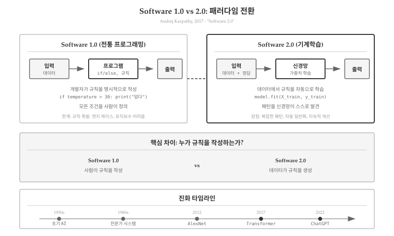
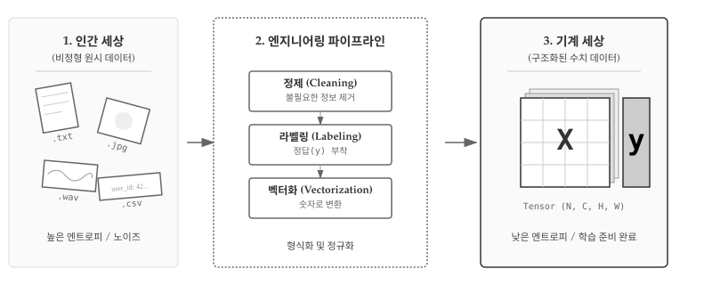
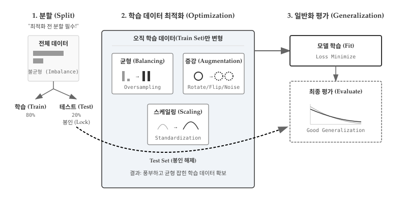
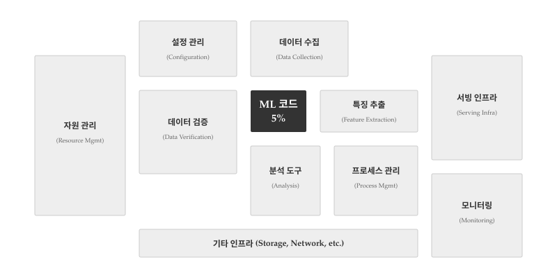

# 소프트웨어 2.0 {#sec-ml-paradigm}


2017년 테슬라의 AI 총괄이었던 안드레이 카파시(Andrej Karpathy)는 "소프트웨어 2.0"이라는 개념을 제시했다. 전통적인 프로그래밍이 개발자가 규칙을 명시적으로 코드로 작성하는 방식이라면, 기계학습은 데이터에서 규칙을 자동으로 학습하는 완전히 다른 패러다임이다. 단순히 새로운 도구가 추가된 것이 아니라, 소프트웨어를 "작성하는 방식" 자체가 바뀌었다. 이 전환은 소프트웨어 개발 방법론뿐만 아니라 하드웨어 측면에서도 근본적인 변화를 가져왔다. 전통적 프로그래밍이 CPU의 순차적 명령 처리에 최적화되어 있다면, 기계학습은 GPU의 병렬 연산 능력을 활용하여 대규모 행렬 계산을 수행한다. CPU에서 GPU로의 이동은 단순한 하드웨어 교체가 아니라, 계산 패러다임 자체의 전환을 의미한다.

:::{.callout-note}
### 안드레이 카파시와 소프트웨어 2.0

카파시는 스탠포드 박사 과정에서 컴퓨터 비전을 연구했고, 이후 테슬라 자율주행 AI를 이끌었다. 2017년 그의 블로그 포스트 "소프트웨어 2.0"은 기계학습이 단순한 기술이 아닌 프로그래밍 패러다임 자체의 전환임을 설득력 있게 주장하며 업계에 큰 반향을 일으켰다.
:::

{#fig-ml-paradigm-shift}

## 전통 프로그래밍 한계 {#sec-ml-paradigm-limits}

전통적인 프로그래밍 방식(소프트웨어 1.0)은 명시적 규칙(explicit rules)에 기반한다. 개발자가 모든 조건과 로직을 코드로 작성하면, 컴퓨터는 그 규칙을 정확히 실행한다.

```python
# 소프트웨어 1.0: 명시적 규칙
def classify_email(email):
    spam_keywords = ["무료", "할인", "당첨", "클릭하세요"]

    for keyword in spam_keywords:
        if keyword in email.lower():
            return "스팸"

    if email.count("!") > 5:
        return "스팸"

    return "정상"
```

규칙 기반 접근법은 도메인이 명확하고 규칙이 유한할 때 효과적이다. 그러나 현실 세계의 많은 문제는 명시적 규칙으로 포착하기 어렵다. 특히 자연어 처리는 규칙 기반 접근의 한계를 명확히 드러낸다. 스팸 이메일 분류를 예로 들면, 초기 필터는 "무료", "당첨", "클릭하세요" 같은 키워드 목록에 의존했다. 그러나 스패머는 "무ㄹㅛ", "당-첨", "클릭 하세요" 등으로 우회했고, 필터는 이에 대응하기 위해 정규표현식과 예외 규칙을 추가해야 했다. 결국 수천 줄의 규칙이 쌓였지만, 새로운 우회 전략에는 여전히 취약했다.

```{r}
#| label: tbl-rule-based-limits
#| tbl-cap: "규칙 기반 접근법의 한계"
#| echo: false
#| message: false
#| warning: false

library(gt)
library(dplyr)

tibble(
  구분 = c("문제", "규칙 기반", "한계"),
  `자연어 처리` = c(
    "스팸 필터, 기계번역",
    "키워드 목록, 문법 규칙",
    "우회 표현, 맥락 처리 실패"
  ),
  `컴퓨터 비전` = c(
    "이미지 분류, 얼굴/필기 인식",
    "픽셀 패턴, 특징점 측정",
    "조명/각도 변화, 필체 변형에 취약"
  ),
  `음성` = c(
    "음성-텍스트, 화자 식별",
    "음소 매핑, 주파수 규칙",
    "억양/사투리, 감정 변화에 민감"
  ),
  `추천/진단` = c(
    "영화 추천, 질병 진단",
    "장르 필터, 증상-질병 룰",
    "개인 취향, 복합 증상 처리 한계"
  )
) |>
  gt() |>
  tab_style(
    style = cell_text(weight = "bold"),
    locations = cells_body(columns = 구분)
  ) |>
  tab_style(
    style = cell_text(weight = "bold"),
    locations = cells_column_labels()
  ) |>
  cols_width(
    구분 ~ px(80),
    everything() ~ px(180)
  ) |>
  tab_options(
    table.font.size = px(11),
    data_row.padding = px(6),
    column_labels.font.weight = "bold"
  )
```

규칙을 더 정교하게 만들수록 시스템은 복잡해지고, 예외 처리가 기하급수적으로 늘어난다. 이른바 "규칙 폭발(rule explosion)" 문제가 발생한다.

## 데이터에서 배우는 프로그램 {#sec-ml-paradigm-learning}

소프트웨어 2.0은 규칙을 명시적으로 작성하지 않는다. 대신 데이터와 정답(레이블)을 제공하면, 알고리즘이 패턴을 스스로 학습한다. 스팸 이메일 분류를 기계학습으로 다시 구현하면 접근 방식이 완전히 달라진다.

```{python}
#| eval: false
# 소프트웨어 2.0: 데이터에서 학습
# 설치: pip install scikit-learn
from sklearn.naive_bayes import MultinomialNB
from sklearn.feature_extraction.text import CountVectorizer

# 학습 데이터: 실제로는 수천~수만 개 필요
emails = [
    "무료 할인 이벤트 지금 클릭",
    "회의 일정 안내 - 내일 오전 10시",
    "당첨되셨습니다! 지금 확인하세요",
    "프로젝트 마감일 연장 공지",
    "특별 무료 경품 클릭",
    "내일 회의실 예약 완료",
    "축하합니다 당첨 확인하세요",
    "분기 보고서 제출 안내",
]
labels = ["스팸", "정상", "스팸", "정상", "스팸", "정상", "스팸", "정상"]

# 모델 학습: 텍스트를 숫자 벡터로 변환 후 패턴 학습
vectorizer = CountVectorizer()  # 단어 빈도 벡터화
X = vectorizer.fit_transform(emails)  # "무료"→[1,0,0,...], "할인"→[0,1,0,...]
model = MultinomialNB()  # 나이브 베이즈 분류기
model.fit(X, labels)  # 데이터에서 확률 패턴 학습

# 예측: 학습된 패턴으로 새 이메일 분류
new_email = ["특별 ㅁㅜㄹㅛ 이벤트"]  # 오타나 우회 표현
prediction = model.predict(vectorizer.transform(new_email))
print(f"예측 결과: {prediction[0]}")  # 출력: 예측 결과: 스팸
```

실행 결과 예시:
```
예측 결과: 스팸
```

기계학습 모델은 "ㅁㅜㄹㅛ"처럼 의도적으로 변형된 표현도 주변 단어("특별", "이벤트")와의 조합 패턴으로 스팸을 판별할 수 있다. 규칙 기반에서는 정규표현식을 수십 개 추가해야 했을 상황이 데이터 학습만으로 해결된다.

두 패러다임의 핵심 차이는 "규칙을 누가 만드는가"에 있다. 소프트웨어 1.0에서는 개발자가 `if "무료" in email`처럼 명시적 조건문으로 규칙을 직접 작성한다. 반면 소프트웨어 2.0에서는 데이터에서 규칙이 자동으로 생성된다. 모델은 학습 과정에서 `P(스팸|"무료") = 0.85`와 같은 확률 패턴을 발견하고, 이를 내부 가중치로 저장한다. 개발자가 작성한 코드는 학습 파이프라인일 뿐, 실제 분류 로직은 데이터로부터 만들어진다.

기계학습 모델은 명시적 키워드 대신 단어 조합의 **확률 패턴**을 학습한다. "무료"와 "할인"이 함께 나올 확률, "회의"와 "일정"이 정상 메일에서 자주 나오는 패턴 등을 수치화한다. 새로운 우회 전략이 나와도 재학습만 하면 되며, 규칙을 일일이 수정할 필요가 없다.

개발자의 역할도 변한다. 코드를 작성하는 대신, 데이터를 수집하고 레이블링하며, 모델 아키텍처를 선택하고, 학습 결과를 평가한다. 프로그래밍의 초점이 "어떻게 해결하는가(how)"에서 "무엇을 해결할 것인가(what)"로 이동한다.


## 코드 vs 데이터 {#sec-ml-paradigm-code-data}

소프트웨어 2.0 패러다임에서는 데이터가 코드보다 중요해진다. 전통 프로그래밍에서 성능을 개선하려면 알고리즘을 최적화하고 코드를 리팩토링한다. 반면 기계학습에서는 같은 알고리즘이라도 더 많고 좋은 데이터를 제공하면 성능이 극적으로 향상된다. 코드는 학습 파이프라인을 정의할 뿐, 실제 "지능"은 데이터에서 나온다.

여기서 말하는 "데이터 중심"은 기존의 데이터베이스 중심 아키텍처(Database-Driven Architecture)와 근본적으로 다르다. 데이터베이스 중심 개발에서 데이터는 **저장되고 조회되는 대상**이다. CRUD(생성, 읽기, 수정, 삭제) 연산을 효율적으로 수행하기 위한 스키마 설계가 핵심이다. 반면 기계학습에서 데이터는 **학습 원자재**다. 레이블이 붙은 데이터에서 패턴을 추출하여 모델의 가중치를 만든다. 데이터베이스는 데이터를 "보관"하지만, 기계학습은 데이터를 "소비"하여 지식을 생성한다.

```{r}
#| label: tbl-code-vs-data
#| tbl-cap: "소프트웨어 1.0 vs 2.0의 핵심 자산 비교"
#| echo: false
#| message: false
#| warning: false

library(gt)
library(dplyr)

tibble(
  패러다임 = c("소프트웨어 1.0", "소프트웨어 2.0"),
  `핵심 자산` = c("소스 코드", "학습 데이터셋"),
  `성능 개선` = c("알고리즘 개선", "더 많은/좋은 데이터"),
  `버그 수정` = c("코드 디버깅", "데이터 정제, 레이블 수정"),
  확장 = c("코드 리팩토링", "데이터 확장, 증강"),
  `지적재산권` = c("코드 라이선스", "데이터 소유권")
) |>
  gt() |>
  tab_style(
    style = cell_text(weight = "bold"),
    locations = cells_body(columns = 패러다임)
  ) |>
  tab_style(
    style = cell_text(weight = "bold"),
    locations = cells_column_labels()
  ) |>
  cols_width(
    패러다임 ~ px(110),
    everything() ~ px(130)
  ) |>
  tab_options(
    table.font.size = px(11),
    data_row.padding = px(6),
    column_labels.font.weight = "bold"
  )
```


### 학습 가능한 데이터 만들기

원시 데이터(raw data)를 모델이 학습할 수 있는 형태로 바꾸는 과정은 소프트웨어 2.0 개발의 핵심이다. @fig-ml-data-pipeline 은 인간 세상의 비정형 데이터가 엔지니어링 파이프라인을 거쳐 기계가 처리 가능한 수치 텐서로 변환되는 전체 흐름을 보여준다. 왼쪽의 혼돈스러운 파일들(.txt, .jpg, .wav, .csv)은 높은 엔트로피 상태다. 사람은 이메일을 읽고 의미를 파악하지만, 컴퓨터는 문자열을 숫자로만 본다. 중앙의 파이프라인(정제→라벨링→벡터화)을 통과하면서 데이터는 낮은 엔트로피의 정형 구조를 갖춘다. 오른쪽의 텐서 X(입력)와 벡터 y(레이블)는 GPU가 직접 연산할 수 있는 형태다. 이 변환이 없으면 아무리 좋은 알고리즘도 무용지물이다.

{#fig-ml-data-pipeline}

@fig-ml-data-pipeline 의 세 단계를 구체적으로 살펴보자. 첫 번째 "인간 세상"에서는 이메일 텍스트, 이미지 파일, 음성 녹음, CSV 로그 등 형식이 제각각이다. 레이블도 없고 노이즈도 많다. 두 번째 "엔지니어링 파이프라인"에서 정제(Cleaning) 단계는 HTML 태그 제거, 특수문자 정리, 중복 제거 등을 수행한다. 이어지는 라벨링(Labeling)에서 사람이 정답을 붙인다. 스팸 필터라면 수만 개 이메일을 하나씩 읽고 "스팸" 또는 "정상" 태그를 달아야 한다. 이 과정이 가장 비용이 많이 들지만, 여기서 품질이 결정된다. 마지막 벡터화(Vectorization)에서 "무료"→[1,0,0,...]처럼 단어를 숫자 인덱스로 바꾼다. 세 번째 "기계 세상"에 도달하면 모든 데이터가 행렬 X와 벡터 y로 정리되어 `model.fit(X, y)` 한 줄로 학습을 시작할 수 있다.

"쓰레기가 들어가면 쓰레기가 나온다(Garbage In, Garbage Out)"는 격언은 기계학습에서 더욱 절실하다. 파이프라인 어느 단계에서든 품질이 떨어지면 모델 성능도 떨어진다. 레이블 오류가 5%만 섞여도 모델은 잘못된 패턴을 학습한다.

### 일반화를 위한 데이터 최적화

레이블 데이터가 준비되었다고 끝이 아니다. 모델이 훈련 데이터에만 과도하게 적응하지 않고(과적합), 실전에서도 잘 작동하도록(일반화) 데이터를 최적화해야 한다. @fig-ml-data-optimization 는 일반화를 달성하기 위한 핵심 전략을 보여준다. 가장 중요한 원칙은 "먼저 분할(Split First!)"이다. 전체 데이터를 학습(Train)과 테스트(Test)로 나눈 후, 테스트 세트는 즉시 봉인한다. 학습 데이터만 최적화 과정을 거친다. 테스트 세트가 학습이나 최적화에 조금이라도 노출되면 "데이터 누수(Data Leakage)"가 발생하고, 실전 성능을 과대평가하게 된다.

{#fig-ml-data-optimization}

@fig-ml-data-optimization 의 왼쪽은 불균형 데이터를 보여준다. 클래스 A가 클래스 B보다 훨씬 많은 상태에서 바로 학습하면 모델은 A에 편향된다. 중앙의 최적화 영역(색상 배경)에서는 학습 데이터만 변형한다. 균형 조정(Balancing)에서 오버샘플링으로 소수 클래스를 늘리고, 증강(Augmentation)에서 원본 이미지를 회전/반전하여 데이터를 확장한다. 스케일링(Scaling)에서 픽셀 값 [0,255]를 [0,1]로 정규화하고, 검증 분할(Validation Split)에서 학습 데이터를 다시 Train/Val로 나눈다. 오른쪽의 학습 및 평가 영역에서는 최적화된 학습 데이터로 모델을 학습하고, 검증 세트로 하이퍼파라미터를 튜닝한다. 모든 튜닝이 끝난 후에야 봉인되었던 테스트 세트가 등장한다(굵은 점선). 테스트 성능이 곧 실전 성능이다. 만약 테스트 세트를 튜닝에 사용했다면 모델은 테스트에 과적합되어 실전에서 실패한다.

불균형 데이터는 모델 편향의 주범이다. @fig-ml-data-optimization 의 1단계에서 보듯 스팸 메일이 10%밖에 없다면, 모델은 "무조건 정상"이라고 답해도 90% 정확도를 얻는다. 학습은 되지만 쓸모없는 모델이 만들어진다. 2단계 최적화 영역의 균형 조정(Balancing)에서 이를 해결한다. 오버샘플링은 소수 클래스(스팸)를 복제하거나 SMOTE로 기존 샘플 사이를 보간하여 합성 샘플을 생성한다. 언더샘플링은 다수 클래스(정상)를 무작위로 제거한다. 클래스 가중치 방법은 손실 함수에서 소수 클래스 오류에 더 높은 페널티를 부여하여 모델이 균형있게 학습하도록 유도한다.

```python
# 불균형 데이터 처리 예시
from imblearn.over_sampling import SMOTE

# 원본: 스팸 100개, 정상 1000개 (1:10 비율)
smote = SMOTE(sampling_strategy=0.5)  # 스팸을 정상의 50%까지 늘림
X_balanced, y_balanced = smote.fit_resample(X, y)
# 결과: 스팸 500개, 정상 1000개 (1:2 비율로 개선)
```

@fig-ml-data-optimization 의 2단계에서 증강(Augmentation)은 데이터를 "인공적으로" 늘리는 기법이다. 원본 고양이 사진 1장을 15도 회전, 좌우 반전, 밝기 조절하면 3장이 된다. 레이블은 모두 "고양이"로 동일하다. 모델은 정면 고양이만 보고 학습한 것이 아니라 여러 각도의 고양이를 경험한 셈이다. 실전에서 약간 기울어진 고양이를 만나도 인식할 가능성이 높아진다. 텍스트 데이터도 마찬가지다. "할인 이벤트"를 "이벤트 할인"으로 순서를 바꾸거나, "할인"을 "특가"로 동의어 치환해도 의미는 유지된다. 증강은 다이어그램에서 원(1개)이 점선 원 2개로 늘어나는 모습으로 표현되어 있다.

```python
#| eval: false
# 이미지 데이터 증강 예시
from torchvision import transforms

augmentation = transforms.Compose([
    transforms.RandomRotation(15),      # ±15도 회전
    transforms.RandomHorizontalFlip(),  # 좌우 반전
    transforms.ColorJitter(0.2, 0.2),   # 밝기/대비 조절
])
# 원본 이미지 100장 → 증강으로 10,000장 효과
```

@fig-ml-data-optimization 의 3단계 학습 및 평가 흐름에서 핵심은 테스트 세트의 격리다. 전체 데이터를 학습 80%, 테스트 20%로 나눈 직후, 테스트 세트는 즉시 봉인된다. 학습 데이터만 최적화를 거쳐 모델 학습에 투입된다. 검증 세트는 학습 데이터를 한번 더 나눠서(Train 85%, Val 15%) 만든다. 검증 세트로 여러 하이퍼파라미터를 시도하고(다이어그램의 회색 점선 루프), 가장 좋은 설정을 찾는다. 모든 튜닝이 끝난 최종 단계에서만 봉인된 테스트 세트가 등장한다(붉은 점선 화살표). 테스트 성능이 85%라면 실전에서도 약 85% 성능을 기대할 수 있다. 만약 테스트 세트로 튜닝까지 했다면 테스트 성능 95%, 실전 성능 70%처럼 큰 격차가 발생한다.

```python
from sklearn.model_selection import train_test_split

# 1단계: 먼저 테스트 세트 분리 (80:20)
X_train, X_test, y_train, y_test = train_test_split(
    X, y, test_size=0.2, stratify=y  # stratify: 클래스 비율 유지
)
# X_test, y_test는 즉시 봉인!

# 2단계: 학습 데이터를 Train/Val로 분할 (85:15)
X_train, X_val, y_train, y_val = train_test_split(
    X_train, y_train, test_size=0.15, stratify=y_train
)
# 최종: 훈련 68%, 검증 12%, 테스트 20%
```

:::{.callout-warning}
### 데이터 품질과 경쟁력

"Garbage in, garbage out"이라는 격언은 기계학습에서 더욱 절실하다. 편향된 데이터로 학습하면 편향된 모델이 만들어진다. 2016년 마이크로소프트의 챗봇 Tay가 악의적인 사용자 데이터를 학습하여 인종차별적 발언을 하게 된 사례가 대표적이다. 2023년에는 한 채용 AI가 남성 중심 데이터로 학습되어 여성 지원자를 차별하는 문제가 발견되었다.

데이터 품질이 곧 경쟁력이다. 실리콘밸리 기업들이 사용자 데이터 확보에 집중하는 이유가 여기에 있다. 구글은 수십억 건의 검색 기록으로, 메타(페이스북)는 수조 개의 사용자 행동 데이터로 경쟁사보다 우수한 모델을 만든다. 같은 알고리즘을 쓰더라도 데이터가 많고 좋으면 이긴다. 데이터는 "새로운 석유"가 아니라 "새로운 소스 코드"다. 데이터 품질 관리와 편향 검출은 이제 기계학습 개발의 필수 과정이다.
:::

## 두 패러다임 공존 {#sec-ml-paradigm-coexist}

소프트웨어 2.0이 모든 것을 대체하는 것은 아니다. 2015년 구글이 발표한 "Hidden Technical Debt in Machine Learning Systems" 논문[@Sculley2015]은 충격적인 사실을 보여준다. 실제 ML 시스템에서 순수 ML 코드(모델 학습 알고리즘)는 전체의 5%에 불과하다. 나머지 95%는 데이터 수집, 특징 추출, 데이터 검증, 모델 서빙 인프라, 모니터링, 설정 관리 등 **전통적인 소프트웨어 1.0 영역**이다. 작고 귀여운 ML 코드 한 조각을 실전에서 돌리려면 그 주변에 거대하고 복잡한 인프라를 구축해야 한다.

{#fig-ml-hidden-debt}

@fig-ml-hidden-debt 가 보여주듯, 중앙의 작은 검은 박스(ML 코드)를 둘러싼 회색/흰색 박스들이 전체 시스템의 대부분을 차지한다. 설정 관리(Configuration)에서 하이퍼파라미터와 환경 설정을 관리하고, 데이터 수집(Data Collection)에서 크롤링·API·로그를 처리한다. 데이터 검증(Data Verification)은 품질 체크와 이상치 탐지를, 특징 추출(Feature Extraction)은 전처리와 벡터화를 담당한다. 자원 관리(Resource Management)는 GPU/CPU 할당을, 분석 도구(Analysis Tools)는 성능 분석을, 프로세스 관리(Process Management)는 워크플로우 스케줄링을, 서빙 인프라(Serving Infrastructure)는 API와 로드밸런싱을, 모니터링(Monitoring)은 성능 추적과 알림을 수행한다. ML 모델이 아무리 정교해도 이 중 하나라도 망가지면 시스템 전체가 무너진다. 결국 소프트웨어 2.0은 소프트웨어 1.0 위에서 동작한다.

두 패러다임의 역할 분담은 명확하다. 소프트웨어 1.0은 규칙이 명확하고 감사 추적이 필요한 비즈니스 로직, OS·컴파일러·데이터베이스 같은 시스템 프로그래밍, 동일 입력에 동일 출력이 보장되어야 하는 결정론적 처리, 왜 그런 결정을 내렸는지 설명이 필요한 상황에 강하다. 반면 소프트웨어 2.0은 이미지·음성·자연어 같은 인식(Perception) 작업, 패턴이 복잡하고 암묵적인 경우, 데이터가 풍부하고 명확한 정답이 있는 경우, 근사적 정답이 허용되는 상황에 우위를 보인다.

실제 시스템은 두 패러다임을 계층적으로 결합한다. 다음 코드는 고객 요청 처리 시스템이다. 자연어 이해 부분은 ML 모델이, 비즈니스 규칙 판단은 전통 코드가 담당한다.

```python
# 실제 시스템: 두 패러다임의 조합
def process_customer_request(request):
    # 소프트웨어 2.0: 자연어 이해 (복잡한 패턴)
    intent = ml_model.classify_intent(request)
    entities = ml_model.extract_entities(request)

    # 소프트웨어 1.0: 비즈니스 로직 (명확한 규칙)
    if intent == "환불요청":
        if entities["days_since_purchase"] > 30:
            return "환불 기간이 지났습니다"  # 명시적 규칙
        if entities["amount"] > 100000:
            return escalate_to_human(request)  # 사람에게 에스컬레이션
        return process_refund(entities)

    # ...
```

ML 모델은 "환불 요청인지 문의인지"를 판단하는 미묘한 자연어 이해를 수행한다. 전통 코드는 30일 환불 규칙, 10만원 이상 수동 처리 같은 비즈니스 정책을 집행한다. 둘은 서로를 보완한다. ML이 없으면 "환불 해주세요"와 "환불 가능한가요?"를 구분하는 규칙을 무한히 작성해야 한다. 전통 코드가 없으면 법적으로 엄격해야 하는 환불 정책을 ML 모델에 학습시켜야 하는데, 이는 설명 불가능하고 감사 추적도 어렵다. 현대 소프트웨어 개발자는 "언제 ML을 쓰고 언제 전통 코드를 쓸지" 판단하는 능력이 필요하다[@Sculley2015].

::: {.content-visible when-format="pdf"}
\faLightbulb\ 생각해볼 점
:::

::: {.content-visible when-format="html"}
## 💡 생각해볼 점  {.unnumbered}
:::

소프트웨어 2.0 패러다임은 개발자에게 근본적인 정체성 질문을 던진다. "나는 코드를 작성하는 사람인가, 데이터를 큐레이션하는 사람인가?" 전통적 개발자는 알고리즘 교과서를 읽고 자료구조를 최적화하며 실력을 키웠다. 논리적 사고가 핵심이었고, 같은 문제를 O(n²)에서 O(n log n)으로 개선하는 것이 자부심이었다. 그러나 기계학습 시대의 개발자는 데이터 품질을 평가하고, 레이블 오류를 찾아내며, 데이터 편향을 검출한다. 통계적 지식과 도메인 이해가 알고리즘 지식만큼 중요해졌다.

더 흥미로운 변화는 "실패의 의미"가 달라진다는 점이다. 전통 프로그래밍에서 버그는 코드 논리 오류다. 디버거로 추적하고, 조건문을 수정하면 해결된다. 결정론적이고 재현 가능하다. 반면 ML 모델의 오류는 종종 데이터에 숨어 있다. 특정 입력에서만 실패하는데, 그 입력이 훈련 데이터에 없었기 때문이다. 수정 방법도 다르다. 코드를 고치는 게 아니라 그 유형의 데이터를 추가하고 재학습한다. 디버깅이 아니라 "데이터 디버깅"이다. 모델이 여성 얼굴 인식률이 낮다면, 여성 얼굴 데이터를 더 모아야 한다. 코드는 바뀌지 않는다.

구글 논문[@Sculley2015]이 지적한 5% vs 95% 비율은 개발자의 시간 배분에도 적용된다. ML 엔지니어는 하루 중 5%만 모델 아키텍처를 고민하고, 95%는 데이터 파이프라인 디버깅, 모델 배포 자동화, A/B 테스트 설계, 성능 모니터링 대시보드 구축에 쓴다. 이 모든 것이 여전히 소프트웨어 1.0 스킬이다. 소프트웨어 2.0 시대가 왔다고 소프트웨어 1.0이 쓸모없어진 것이 아니다. 오히려 ML을 지탱하는 인프라로서 더 중요해졌다. 결국 "좋은 개발자"의 정의가 "알고리즘을 잘 짜는 사람"에서 "문제 해결에 적절한 도구(ML vs 전통 코드)를 선택하고 조합할 줄 아는 사람"으로 진화하고 있다.

앞으로 살펴볼 신경망 아키텍처, 학습/추론 워크플로우, Transformer는 모두 소프트웨어 2.0의 기술적 기반이다. 이 위에서 LLM이 탄생했고, 2023년 이후 또 다른 전환이 시작되었다. 프롬프트로 지시하는 "소프트웨어 3.0" 시대에는 개발자가 데이터조차 준비하지 않고, LLM에게 자연어로 요구사항을 전달한다. 패러다임은 계속 진화하지만, 한 가지 변하지 않는 진실이 있다. 어떤 시대든 "문제를 정확히 정의하고, 적절한 도구를 선택하며, 결과를 비판적으로 평가하는" 능력이 핵심이다.
