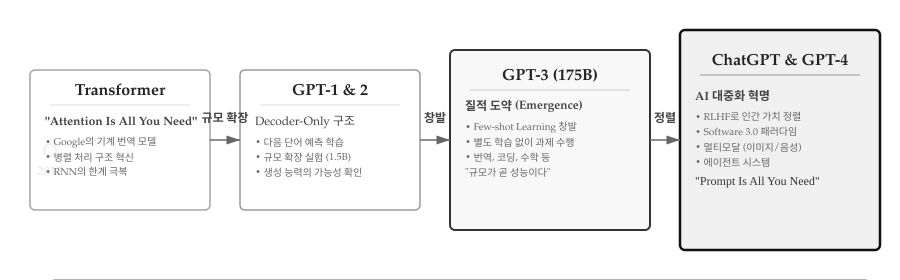
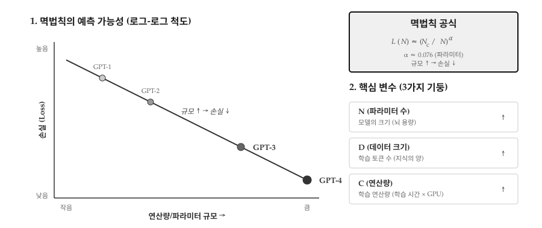
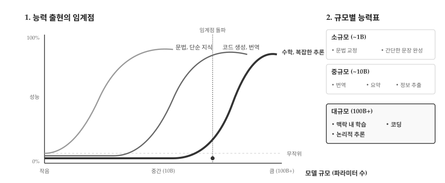
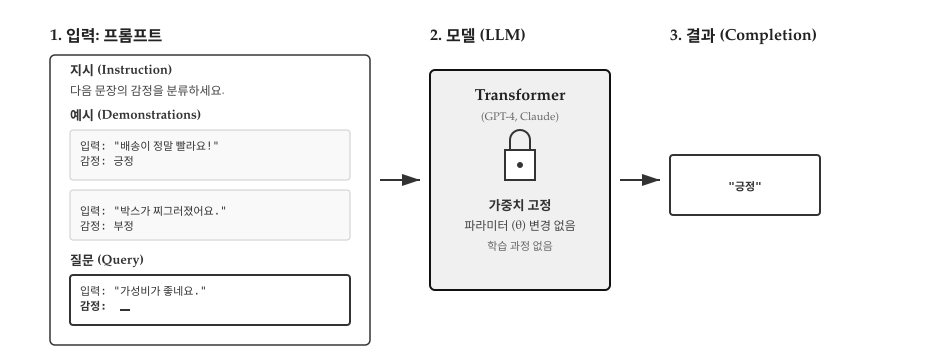
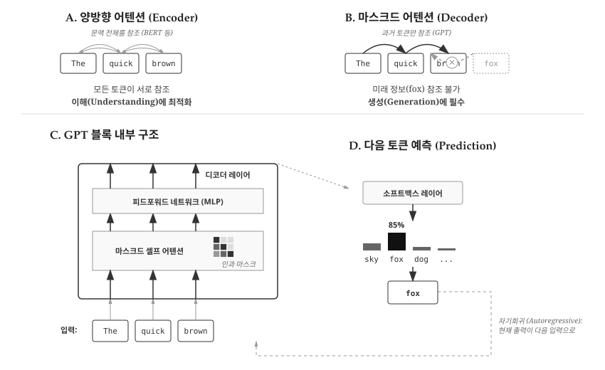
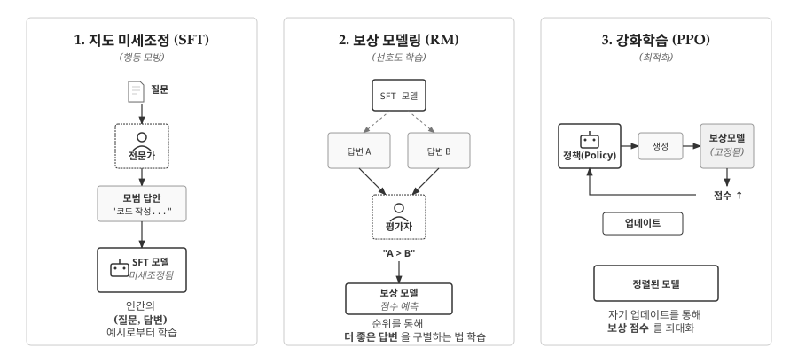
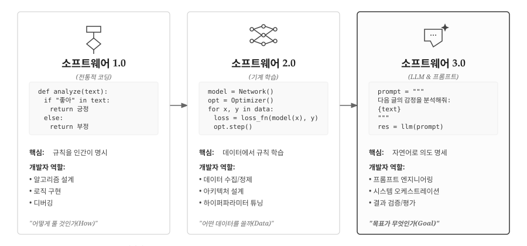
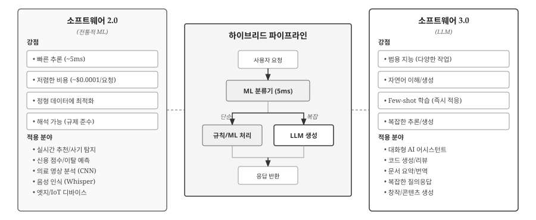
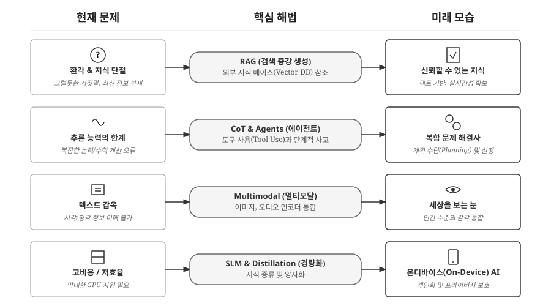

# 트랜스포머에서 거대 언어모형으로 {#sec-ml-to-llm}

2017년 "Attention Is All You Need" 논문이 발표되었을 때, 저자들조차 이 아키텍처가 불과 5년 만에 소프트웨어 개발 방식 자체를 바꾸리라 예상하지 못했다. Transformer는 Google이 영어-독일어 기계 번역을 위해 설계한 특정 목적의 모델이었다. Self-Attention 메커니즘으로 RNN의 순차 처리 한계를 극복하고 병렬 처리를 가능하게 한 것이 핵심 혁신이었지만, 당시에는 그저 번역 품질을 개선하는 기법 정도로 여겨졌다.

하지만 2018년 OpenAI의 GPT-1이 Transformer의 디코더 부분만 떼어내 "다음 단어 예측"이라는 단순한 목표로 학습시키자, 흥미로운 현상이 나타났다. 번역만 잘하는 모델이 아니라, 다양한 작업을 수행할 수 있는 범용 언어 모델의 가능성을 보인 것이다. 2019년 GPT-2(1.5B 파라미터)는 규모를 확장하며 생성 능력을 입증했고, 2020년 GPT-3(175B)에 이르러서는 놀라운 도약이 일어났다. Few-Shot Learning이라는 창발 능력이 나타나면서, 프롬프트에 몇 가지 예시만 제공하면 번역, 코딩, 수학 문제 등을 별도 학습 없이 수행했다. 이는 "규모를 키우자 의도하지 않은 능력들이 나타났다"는 OpenAI 연구진의 표현처럼 예측하지 못한 질적 변화였다.

2022년 ChatGPT의 등장은 LLM을 연구실 밖으로 끌어냈다. RLHF(인간 피드백 강화학습)로 사용자 의도에 정렬된 ChatGPT는 출시 5일 만에 100만 사용자를 확보하며 역대 최단 기록을 세웠다. 이제 소프트웨어 개발 방식이 "코드를 짜는" 시대에서 "의도를 설명하는" 시대로 전환되기 시작했다. GPT-4와 Claude 같은 멀티모달 모델은 이미지와 음성까지 처리하며, 도구를 사용하는 에이전트 시스템으로 진화하고 있다.

{#fig-ml-transformer-to-llm}

@fig-ml-transformer-to-llm 은 이 7년간의 여정을 4단계로 압축한다. (1) 2017년 Transformer 탄생: 구글의 기계 번역 모델로 시작, (2) 2018-2019년 GPT-1/2: 디코더 전용 구조로 범용성 확인, (3) 2020년 GPT-3: 175B 파라미터로 Few-Shot Learning 창발, (4) 2022년 이후 ChatGPT/GPT-4: RLHF로 인간 가치 정렬 및 멀티모달 확장. 각 단계 간 전환을 살펴보면, "규모 확장"이 "창발"을 낳고, "정렬"을 통해 대중화로 이어지는 명확한 패턴을 볼 수 있다. 하단의 핵심 진화 경로는 더 직관적이다: 특정 목적 모델(한 가지 잘하기) → 생성 모델(여러 가지 하기) → 지시 이행 모델(말 알아듣기) → 범용 에이전트(도구 사용하기). 다음 토큰 예측이라는 단순한 목표가 어떻게 범용 지능에 가까운 능력으로 확장되었는지, 그 핵심 원리가 한눈에 들어온다.

## 스케일링 법칙: 더 크면 더 좋다 {#sec-ml-to-llm-scaling}

2020년 OpenAI 연구팀은 놀라운 발견을 논문으로 발표했다[@Kaplan2020ScalingLaws]. 언어 모델의 성능(손실)은 세 가지 요소 - 파라미터 수(N), 학습 데이터 크기(D), 연산량(C) - 에 대해 **멱법칙(power law)**을 따른다는 것이다. 수학적으로 `Loss ∝ N^(-0.076) × D^(-0.095) × C^(-0.050)`로 표현되는 이 관계는 단순하면서도 충격적인 함의를 가진다: **규모를 키우면 성능이 예측 가능하게 향상된다.** 알고리즘 혁신 없이도 더 많은 파라미터, 더 많은 데이터, 더 많은 연산으로 더 좋은 모델을 만들 수 있다는 의미다.

{#fig-ml-scaling-laws}

@fig-ml-scaling-laws 상단의 그래프는 모델 규모와 손실(Loss) 간의 멱법칙 관계를 보여준다. GPT-1(117M)에서 GPT-4(1T+)로 파라미터 수가 증가하면서 손실이 부드러운 곡선을 그리며 감소한다. 이 예측 가능성이 핵심이다. 새로운 알고리즘을 발명할 필요 없이, 더 많은 GPU와 데이터만 확보하면 성능 향상을 보장받을 수 있기 때문이다. 하단의 3가지 요소 분석은 각 요소의 기여도를 보여준다. GPT-1에서 GPT-3로 가는 과정에서 파라미터는 1500배, 데이터는 127배 증가했다. 이 법칙은 2020년대 초반 LLM 경쟁을 "규모 경쟁"으로 만든 이론적 근거가 되었다.

:::{.callout-note}
### 최신 동향: 친칠라(Chinchilla) 법칙과 데이터의 중요성

초기 스케일링 법칙[@Kaplan2020ScalingLaws]은 모델 크기를 키우는 데 집중했지만, DeepMind의 친칠라 연구[@Hoffmann2022Chinchilla]는 **데이터의 양**이 모델 크기만큼이나 중요함을 입증했다. 같은 연산량이라면, 모델을 무작정 키우는 것보다 더 많은 고품질 데이터(토큰)로 학습시키는 것이 더 효율적이라는 것이다. 이는 최근 Llama 3 같은 모델이 상대적으로 작은 크기(8B, 70B)임에도 막대한 양의 데이터(15T 토큰)로 GPT-3를 압도하는 성능을 내는 이론적 근거가 되었다.
:::

```python
# GPT 모델 규모의 성장
models = {
    "GPT-1 (2018)":   {"params": 117_000_000,      "data": "4.5GB"},
    "GPT-2 (2019)":   {"params": 1_500_000_000,    "data": "40GB"},
    "GPT-3 (2020)":   {"params": 175_000_000_000,  "data": "570GB"},
    "GPT-4 (2023)":   {"params": "1T+?",           "data": "수 TB?"},
}
# 파라미터 수가 2년마다 100배 증가
```

| 모델 | 파라미터 | 학습 데이터 | 주요 성과 |
|-----|---------|-----------|----------|
| GPT-1 | 1.17억 | 4.5GB | 사전학습 효과 입증 |
| GPT-2 | 15억 | 40GB | 놀라운 텍스트 생성 |
| GPT-3 | 1750억 | 570GB | Few-shot 학습 |
| GPT-4 | 1조+? | 수 TB? | 멀티모달, 복잡한 추론 |

: GPT 시리즈의 규모 성장 {#tbl-gpt-scaling}

## 창발 능력: 예측 불가의 도약 {#sec-ml-to-llm-emergent}

스케일링 법칙이 점진적 개선을 설명한다면, **창발 능력(Emergent Abilities)**은 갑작스러운 도약을 설명한다. 물리학자 Philip Anderson이 1972년 "More Is Different"라는 논문에서 제시한 개념처럼, 양적 축적이 질적 전환을 가져온다. 일정 규모 이하에서는 전혀 나타나지 않던 능력이 임계점을 넘으면 갑자기 등장하는 현상이다. 0.1B 파라미터 모델에서 1B, 10B로 키워도 수학 문제는 여전히 못 풀다가, 100B를 넘어서자 갑자기 풀기 시작한다. 이는 물이 99도에서 100도로 1도 올라가자 갑자기 끓는 것과 비슷한 상전이(phase transition) 현상이다.

창발의 중요성은 AI 개발 전략을 근본적으로 바꿨다는 데 있다. 작은 모델에서 보이지 않던 능력이 모델을 키우는 것만으로 갑자기 나타난다면, AI 개발 방식은 "알고리즘 설계"에서 "규모 확장과 데이터 확보"로 변화할 수밖에 없다. 실제로 2020년 이후 AI 연구의 주류는 새로운 아키텍처 발명보다 기존 아키텍처의 대규모 학습으로 옮겨갔다.

{#fig-ml-emergent-abilities}

@fig-ml-emergent-abilities 상단 그래프는 이 비선형성을 극명하게 보여준다. 수학 추론 능력은 100B 파라미터 이전에는 무작위 수준에 머물다가 임계점을 넘자 가파르게 상승한다. 계단 함수(step function)처럼 생긴 이 곡선은 스케일링 법칙의 부드러운 곡선과 대조된다. 하단 표는 능력별로 출현 시기가 다름을 보여준다. 맥락 내 학습은 10B에서, 코드 생성은 100B에서, 수학 추론은 그보다 더 큰 규모에서 나타났다. 이 예측 불가능성이 연구자들을 당황시켰다. 스케일링 법칙으로 손실은 예측할 수 있지만, "어떤 능력이 언제 나타날지"는 모델을 실제로 학습시켜봐야만 알 수 있기 때문이다.

특히 주목할 것은 **맥락 내 학습(In-Context Learning)**이다. GPT-3는 프롬프트에 몇 가지 예시만 제공하면 새로운 작업을 수행할 수 있었다. 가중치를 전혀 업데이트하지 않고도 "학습"하는 것처럼 보이는 현상이다. 예를 들어, 감정 분류를 한 번도 학습하지 않은 모델에게 "긍정" 2개, "부정" 1개, "중립" 1개 예시를 보여주면, 다섯 번째 문장의 감정을 맞춘다. 전통적인 기계학습이라면 수천 개의 레이블 데이터를 수집하고 모델을 미세조정해야 하지만, 맥락 내 학습은 프롬프트 4줄로 즉시 작동한다.

{#fig-ml-in-context-learning}

@fig-ml-in-context-learning 왼쪽은 프롬프트 구조를 보여준다. 작업 설명("문장의 감정을 분류하세요"), 예시 3개, 그리고 실제 질의가 하나의 프롬프트로 결합된다. 중앙의 LLM은 이 패턴을 인식하여 오른쪽의 응답을 생성한다. 하단 비교 박스가 핵심을 짚는다. 전통적 ML은 "데이터 수집 → 모델 학습(가중치 변경) → 추론" 3단계를 거치지만, 맥락 내 학습은 "프롬프트 제공 → 가중치 고정 → 즉시 추론"으로 단축된다. 이 능력이 LLM을 진정한 의미의 "범용" 모델로 만들었다. 새로운 작업마다 모델을 재학습할 필요 없이, 프롬프트 엔지니어링만으로 대응할 수 있기 때문이다.

:::{.callout-note}
### 왜 창발이 일어나는가?

창발 능력의 정확한 메커니즘은 아직 완전히 이해되지 않았다. 한 가지 가설은 작은 모델에서도 능력이 "잠재"되어 있지만, 표현력이 부족해 드러나지 않는다는 것이다. 다른 가설은 복잡한 능력이 더 단순한 능력들의 조합이며, 규모가 커지면서 이 조합이 가능해진다는 것이다.
:::

## GPT: 디코더 전용 트랜스포머 {#sec-ml-to-llm-gpt}

GPT(Generative Pre-trained Transformer)는 Transformer의 디코더 부분만 사용하는 **디코더 전용(Decoder-Only)** 아키텍처다. 원래 Transformer는 인코더-디코더 구조로 번역을 위해 설계되었지만, OpenAI는 디코더만 떼어내도 충분히 강력한 언어 모델을 만들 수 있음을 발견했다. 반면 Google의 BERT(2018)는 **인코더 전용(Encoder-Only)** 아키텍처로, 양방향 어텐션을 활용하여 문맥 이해에 특화되었다. 핵심 차이는 어텐션 방향이다. BERT의 인코더는 양방향 어텐션으로 문장 전체를 동시에 보지만, GPT의 디코더는 단방향 어텐션으로 과거 토큰만 참조한다. "The quick brown fox"라는 입력에서 "brown"을 처리할 때, BERT는 "The", "quick", "fox"를 모두 보지만 GPT는 "The", "quick"만 본다.

{#fig-ml-gpt-architecture}

@fig-ml-gpt-architecture 왼쪽은 원래 Transformer의 인코더-디코더 구조를, 오른쪽은 GPT의 디코더 전용 구조를 비교한다. GPT는 입력 토큰 시퀀스("The", "quick", "brown", "fox")를 받아 디코더 블록(Masked Self-Attention + Feed-Forward)을 통과시킨 뒤, 각 위치에서 다음 토큰을 예측한다. "The" 뒤에는 "quick"을, "The quick" 뒤에는 "brown"을 예측하는 식이다. 하단의 학습 과정 설명이 이를 명확히 한다. 같은 문장을 여러 번 재사용하여 자기회귀(Autoregressive) 방식으로 학습한다. 손실 함수는 단순히 "예측한 토큰"과 "실제 다음 토큰"의 CrossEntropy다.

:::{.callout-note}
### 왜 디코더 전용(GPT)이 대세가 되었나?

BERT(인코더 전용)와 GPT(디코더 전용)는 2018년 거의 동시에 등장하여 치열하게 경쟁했다. 초기에는 BERT가 NLP 벤치마크를 휩쓸며 우위를 점했다. 양방향 어텐션 덕분에 문맥 이해력이 뛰어났고, 분류·추출 같은 기존 NLP 작업에 강했기 때문이다. 하지만 2020년 GPT-3 이후 판세가 역전되었다.

디코더 전용 아키텍처가 대세가 된 이유는 크게 세 가지다. 첫째, **생성 능력**이다. 인코더 전용은 빈칸 채우기(MLM)로 학습하여 분류에는 강하지만, 긴 텍스트 생성에는 부적합하다. 반면 디코더 전용은 다음 토큰 예측으로 학습하여 자연스러운 문장 생성이 가능하다. 둘째, **스케일링 효율**이다. 디코더 전용은 구조가 단순하여 파라미터를 늘리기 쉽고, 규모 확장 시 성능 향상이 더 안정적으로 나타났다. 셋째, **창발 능력**이다. 맥락 내 학습(In-Context Learning), 사고 연쇄(Chain-of-Thought) 같은 창발 능력이 디코더 전용 모델에서 주로 발현되었다. ChatGPT, Claude, Gemini 등 현재 주류 LLM이 모두 디코더 전용 아키텍처를 채택한 것은 이러한 장점들이 축적된 결과다.
:::

GPT의 핵심 설계 원칙은 **사전학습(Pre-training)**과 **미세조정(Fine-tuning)**의 분리다. 사전학습 단계에서는 인터넷에서 수집한 방대한 텍스트 코퍼스로 "다음 토큰 예측"만 학습한다. 별도의 레이블 없이도 텍스트 자체가 학습 신호가 되므로, 수조 개의 토큰을 저비용으로 학습할 수 있다. 미세조정 단계에서는 특정 작업(번역, 요약, 대화 등)에 맞게 소량의 레이블 데이터로 모델을 조정한다. 사전학습된 지식 위에 특화된 능력을 얹는 방식이다.

```python
# GPT 사전학습: 레이블 없이 텍스트만으로 학습
corpus = load_internet_text()  # 수 TB 규모
for batch in corpus:
    # 텍스트 자체가 입력이자 정답
    loss = model.forward(batch)  # 다음 토큰 예측
    loss.backward()

# GPT 미세조정: 특정 작업에 적응
fine_tune_data = [
    ("Translate to French: Hello", "Bonjour"),
    ("Summarize: [긴 문서]", "[요약]"),
]
model.fine_tune(fine_tune_data)  # 소량 데이터로 특화
```

GPT 시리즈는 이 아키텍처를 유지하면서 규모만 키웠다. GPT-1(2018)은 12개 레이어, 1.17억 파라미터로 시작했다. GPT-2(2019)는 48개 레이어, 15억 파라미터로 확장하며 놀라운 텍스트 생성 능력을 보였다. GPT-3(2020)는 96개 레이어, 1750억 파라미터에 도달했고, 여기서 맥락 내 학습이라는 창발 능력이 나타났다. 아키텍처 혁신 없이 규모 확장만으로 질적 도약을 이룬 것이다.

## RLHF: 인간 가치 정렬 {#sec-ml-to-llm-rlhf}

GPT-3까지의 모델은 "다음 토큰 예측"만 학습했기 때문에 사용자 의도와 잘 맞지 않았다. "프랑스의 수도는?"이라는 질문에 "파리"라고 답하는 대신 "프랑스의 인구는? 프랑스의 면적은?"처럼 질문을 이어서 생성하기도 했다. 인터넷 텍스트를 무차별로 학습했기 때문에 유해한 콘텐츠도 여과 없이 출력했다. 기술적으로는 훌륭한 언어 모델이지만, 실용적인 어시스턴트로는 부적합했다.

**RLHF(Reinforcement Learning from Human Feedback)**는 이 문제를 해결하기 위해 인간의 선호도를 학습에 반영하는 기법이다. "다음 토큰을 잘 맞추기"에서 "인간이 선호하는 답변 생성"으로 목표를 전환하는 것이다.

{#fig-ml-rlhf-process}

@fig-ml-rlhf-process 는 RLHF의 3단계 프로세스를 위에서 아래로 보여준다. 맨 위의 사전학습 모델(GPT-3)은 다음 토큰 예측만 학습되어 사용자 의도와 불일치한다. 1단계(SFT)에서는 인간이 직접 작성한 (질문, 좋은 답변) 쌍으로 지도 학습을 수행하여 기본적인 정렬을 완성한다. 하지만 여전히 충분하지 않다. 2단계(Reward Model)에서는 같은 질문에 대한 여러 답변을 인간이 순위 매김하여, "어떤 답변이 더 좋은지" 판단하는 보상 모델을 학습시킨다. 3단계(PPO)에서는 이 보상 모델을 활용하여 강화학습을 수행한다. Policy 모델이 답변을 생성하면 보상 모델이 점수를 주고, PPO 알고리즘이 이 점수를 최대화하도록 모델을 반복 업데이트한다. 우측의 피드백 화살표가 보여주듯, 이 과정은 여러 번 반복되며 모델을 점진적으로 인간 선호도에 정렬시킨다.

```python
# RLHF 개념적 코드
from trl import PPOTrainer, PPOConfig

# 1. 보상 모델 (인간 선호도 학습)
reward_model = RewardModel.from_pretrained("...")

# 2. PPO로 정책 최적화
ppo_trainer = PPOTrainer(
    model=policy_model,
    ref_model=ref_model,
    reward_model=reward_model,
    config=PPOConfig(batch_size=16, learning_rate=1e-5)
)

# 3. 학습 루프
for query in queries:
    response = policy_model.generate(query)
    reward = reward_model(query, response)
    ppo_trainer.step([query], [response], [reward])
```

ChatGPT의 성공은 RLHF 덕분이었다. 같은 GPT-3.5 아키텍처라도 RLHF를 적용하자 "도움이 되고, 해롭지 않으며, 정직한" 어시스턴트로 변모했다.

:::{.callout-tip}
### RLHF의 진화: DPO (Direct Preference Optimization)

전통적인 RLHF는 별도의 보상 모델과 복잡한 강화학습(PPO) 과정이 필요하여 학습이 불안정하고 비용이 많이 들었다. 2023년 등장한 **DPO**는 강화학습 없이 선호도 데이터만으로 직접 모델을 최적화하는 기법이다. 수학적으로 PPO와 동등한 효과를 내면서도 훨씬 간단하고 안정적이라, 최근 오픈소스 LLM 진영에서 표준으로 자리 잡고 있다.
:::

## 프롬프트가 곧 프로그램 {#sec-ml-to-llm-software3}

LLM의 등장으로 새로운 프로그래밍 패러다임이 열렸다. Software 1.0이 코드로, Software 2.0이 데이터로 프로그램을 작성했다면, Software 3.0은 **자연어 프롬프트**로 프로그램을 작성한다. 감정 분석 프로그램을 예로 들면, Software 1.0은 "좋다", "나쁘다" 같은 긍정/부정 단어 리스트를 직접 작성하고 if/else로 판단 로직을 짰다. Software 2.0은 수천 개의 레이블 데이터를 수집하여 BERT 모델을 학습시켰다. Software 3.0은 "다음 텍스트의 감정을 분석해주세요"라고 LLM에게 요청하면 끝이다.

{#fig-ml-software-paradigm}

@fig-ml-software-paradigm 은 이 세 패러다임을 나란히 비교한다. 왼쪽 Software 1.0 박스는 규칙 기반 코드를, 중앙 Software 2.0은 데이터 학습 코드를, 오른쪽 Software 3.0(강조 표시됨)은 프롬프트 방식을 보여준다. 코드 예시를 보면 진화가 명확하다. 1.0은 긍정/부정 단어 리스트를 수동으로 작성하고, 2.0은 `model.fit()`으로 데이터에서 학습하며, 3.0은 자연어로 작업을 지시한다. 필요 역량도 변한다: 알고리즘 설계 → 데이터 수집/정제 → 의도 명세. 하단의 워크플로우 비교가 이를 요약한다. 과거는 "문제 → 알고리즘 설계 → 코드 작성 → 테스트"였지만, 현재는 "문제 → 프롬프트 작성 → LLM 호출 → 결과 검증"이며, 피드백 화살표가 보여주듯 반복적 개선이 핵심이다.

```python
# Software 1.0: 규칙 직접 작성
def sentiment_analysis_v1(text):
    positive_words = ["좋다", "훌륭하다", "최고"]
    negative_words = ["나쁘다", "끔찍하다", "최악"]
    # ... 규칙 기반 로직

# Software 2.0: 데이터에서 학습
model = BertForSequenceClassification.from_pretrained(...)
model.fit(train_data, train_labels)
prediction = model.predict(text)

# Software 3.0: 프롬프트로 지시
response = llm.complete("""
다음 텍스트의 감정을 분석해주세요.
텍스트: "오늘 하루가 정말 행복했어요"
감정(긍정/부정/중립):
""")
```

핵심은 추상화 수준의 상승이다. 패러다임이 바뀔 때마다 개발자가 다루는 대상이 "방법(How)"에서 "목적(What)"으로 이동한다. Software 1.0에서는 "어떻게 풀 것인가"를, 2.0에서는 "어떤 데이터를 쓸 것인가"를, 3.0에서는 "목표가 무엇인가"를 고민한다.

그러나 Software 3.0이 이전 패러다임을 완전히 대체하는 것은 아니다. 실제 프로덕션 시스템에서는 **확률적인 AI 컴포넌트(3.0)**를 **결정론적인 코드(1.0)**로 감싸는 **오케스트레이션(Orchestration)** 능력이 중요하다. LLM의 출력은 본질적으로 비결정적이라 동일한 입력에도 다른 결과가 나올 수 있고, 환각이나 오류를 포함할 수 있기 때문이다. 입력 검증, 출력 파싱, 에러 처리, 재시도 로직 등을 전통적인 코드로 구현해야 안정적인 시스템이 된다. LangChain, LlamaIndex 같은 프레임워크가 이러한 오케스트레이션을 지원하며, 8부에서 이를 자세히 다룬다.

{#fig-ml-hybrid-system}

@fig-ml-hybrid-system 은 현실적인 AI 시스템 아키텍처를 보여준다. 왼쪽 Software 2.0 패널은 전통적 ML의 강점을 나열한다: 빠른 추론(~5ms), 저렴한 비용(~$0.0001/요청), 정형 데이터 최적화, 해석 가능성. 실시간 추천, 사기 탐지, 의료 영상 분석, 엣지 디바이스가 대표적인 적용 분야다. 오른쪽 Software 3.0 패널은 LLM의 강점을 보여준다: 범용 지능, 자연어 이해/생성, Few-shot 학습, 복잡한 추론. 대화형 AI, 코드 생성, 문서 요약, 창작이 주요 활용처다. 중앙의 하이브리드 파이프라인이 핵심이다. 사용자 요청이 들어오면 먼저 경량 ML 분류기(5ms)가 단순/복잡을 판단한다. 단순한 요청은 규칙이나 ML로 빠르게 처리하고, 복잡한 요청만 LLM으로 넘긴다. 비용과 지연시간을 최소화하면서도 LLM의 강력한 생성 능력을 활용하는 전략이다.

## 한계와 미래 {#sec-ml-to-llm-limits}

LLM은 놀라운 능력을 보여주지만, 명확한 한계도 있다. 환각(Hallucination)은 가장 골치 아픈 문제다. "김소월이 1945년에 발표한 시"를 물으면, 김소월이 1934년에 사망했음에도 불구하고 그럴듯한 (잘못된) 시를 생성한다. 추론도 취약하다. 간단한 수학 계산조차 틀리거나, 여러 단계를 거치는 논리 문제에서 중간에 길을 잃는다. 지식 단절(Knowledge Cutoff)도 제약이다. 학습 데이터 이후의 정보는 전혀 모르기 때문에 최신 뉴스나 동적 정보를 다루지 못한다. 계산 비용은 실용성을 제한한다. 대규모 모델은 GPU 메모리를 많이 요구하여 실시간 응답이 어렵다.

{#fig-ml-llm-limitations-future}

@fig-ml-llm-limitations-future 는 4가지 현재 문제(왼쪽), 핵심 해법(중앙), 미래 모습(오른쪽)을 3열 구조로 대응시킨다. 첫 번째 행은 환각과 지식 단절 문제를 다룬다. RAG(Retrieval-Augmented Generation)가 해법으로 제시되며, 외부 지식 베이스(Vector DB)를 참조하여 팩트 기반의 신뢰할 수 있는 지식을 제공하는 미래로 나아간다. 두 번째 행은 추론 능력의 한계를 다룬다. 복잡한 논리나 수학 계산에서 오류가 발생하는 문제를 CoT(Chain-of-Thought)와 에이전트가 해결한다. 도구 사용(Tool Use)과 단계적 사고를 통해 계획 수립과 실행이 가능한 복합 문제 해결사로 진화하는 방향이다.

세 번째 행은 텍스트만 처리하는 한계를 지적한다. 시각이나 청각 정보를 이해하지 못하는 "텍스트 감옥"에서 벗어나기 위해 멀티모달(Multimodal) 기술이 등장했다. 이미지와 오디오 인코더를 통합하여 인간 수준의 감각 통합을 목표로 한다. 네 번째 행은 비용과 효율 문제를 다룬다. 막대한 GPU 자원이 필요한 현재의 고비용/저효율 구조를 SLM(Small Language Model)과 지식 증류(Distillation), 양자화(Quantization)로 개선하여, 궁극적으로 스마트폰에서도 동작하는 온디바이스(On-Device) AI를 실현한다. 이러한 발전 방향은 "단순한 텍스트 생성기를 넘어, 신뢰할 수 있고 효율적인 문제 해결 도구"로의 진화를 보여준다.

::: {.content-visible when-format="pdf"}
\faLightbulb\ 생각해볼 점
:::

::: {.content-visible when-format="html"}
## 💡 생각해볼 점 {.unnumbered}
:::

"다음 토큰 예측"이라는 단순한 목표가 어떻게 코드 작성, 수학 증명, 창작까지 가능하게 했을까? 스케일링만으로 창발이 일어난다면, 모델을 계속 키우면 AGI에 도달할 수 있을까? 아니면 현재 아키텍처의 근본적 한계가 있을까?

환각 문제는 LLM의 본질적 특성인가, 해결 가능한 버그인가? 확률 분포에서 샘플링하는 방식이 변하지 않는 한, "거짓말하지 않는 LLM"은 원천적으로 불가능한 것일까? RAG와 같은 외부 지식 연결이 진정한 해결책인지, 임시방편인지 생각해볼 필요가 있다.

전통적 ML(Software 2.0)과 LLM(Software 3.0)의 경계는 어디인가? 5ms 응답이 필요한 실시간 시스템에서 LLM은 영원히 배제될까? 아니면 하드웨어 발전과 모델 경량화가 이 경계를 무너뜨릴까? 10년 후에도 XGBoost로 신용 점수를 매기고 있을까?

프로그래머의 역할은 어떻게 변할까? "코드를 작성하는 사람"에서 "AI의 출력을 검증하고 방향을 제시하는 사람"으로의 전환은 이미 시작되었다. 그렇다면 프로그래밍 교육은 무엇을 가르쳐야 하는가? 알고리즘과 자료구조보다 프롬프트 엔지니어링과 시스템 설계가 더 중요해지는 시대가 올까?
