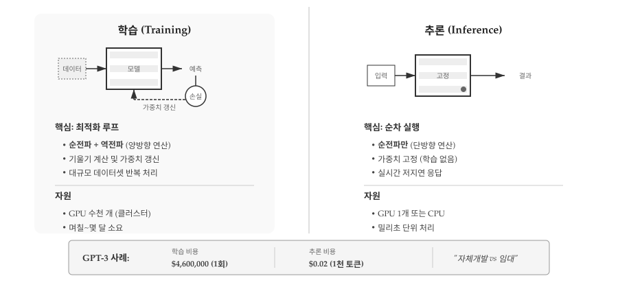
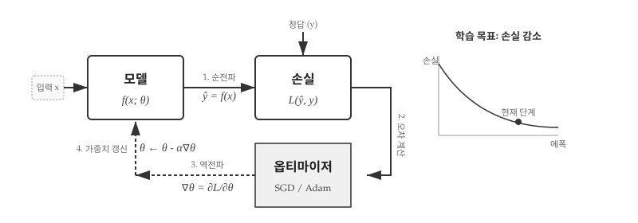
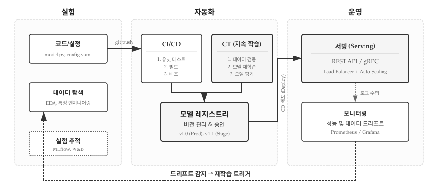
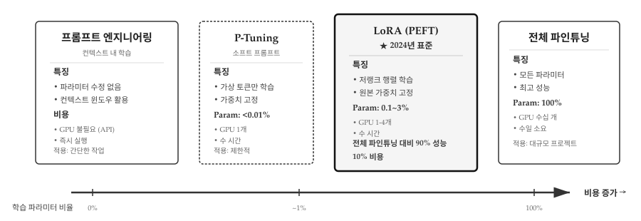

# 학습과 추론 {#sec-ml-workflow}

기계학습 시스템은 두 가지 근본적으로 다른 모드로 실행된다. 학습(Training)은 두뇌를 만드는 과정이고, 추론(Inference)은 만들어진 두뇌를 사용하는 과정이다. 전통 프로그래밍에서 "개발"과 "실행"의 구분과 유사하지만, 자원 요구량과 실행 빈도에서 극단적인 차이가 있다. GPT-4 학습에는 수천 개 GPU가 수 개월간 동작했지만, 추론은 단일 API 호출로 밀리초 안에 완료된다.

{#fig-ml-training-inference}

@fig-ml-training-inference 는 학습과 추론의 극명한 차이를 보여준다. 왼쪽 학습 영역은 짙은 배경으로 강조되어 있다. 목적은 가중치를 학습하여 모델을 생성하는 것이며, 빈도는 1회 또는 주기적 재학습으로 드물다. 자원 요구량은 압도적이다. GPU 수백~수천 개가 수일에서 수개월간 동작한다. 순전파와 역전파를 모두 수행하고, 기울기를 계산하며, 가중치를 반복적으로 업데이트한다. 오른쪽 추론 영역은 밝은 배경에 얇은 테두리로 표현되어 있다. 목적은 학습된 모델로 예측을 수행하는 것이며, 초당 수백~수천 번 실행된다. 자원은 GPU 1개 또는 CPU만으로 충분하고, 밀리초 단위로 응답한다. 순전파만 수행하고 기울기 계산은 없으며 가중치는 고정되어 있다. 하단의 GPT-3 사례가 이 차이를 구체화한다. 학습은 V100 GPU 10,000개가 14일간 작동하여 약 $460만이 소요되었지만, 추론은 A100 GPU 1개로 100ms 만에 완료되며 1,000토큰당 $0.02 정도의 비용만 든다.

## 학습: 가중치를 찾아가는 여정 {#sec-ml-workflow-training}

학습의 본질은 "좋은 가중치를 찾는 탐색"이다. 수조 개의 가능한 파라미터 조합 중에서 손실을 최소화하는 하나를 찾아야 한다. 무작위 탐색은 불가능하다. 175B 파라미터 모델이라면 가능한 조합이 거의 무한대다. 대신 경사 하강법(Gradient Descent)이 효율적인 길잡이가 된다. 현재 위치에서 손실이 가장 빠르게 줄어드는 방향(기울기의 반대)을 계산하고, 그 방향으로 조금씩 이동한다. 산에서 안개 속을 걸을 때 발밑 경사만 보고 골짜기를 찾아가는 것과 같다. 전체 지형(손실 함수)을 볼 수 없지만, 지역적 기울기 정보만으로도 최적점에 도달할 수 있다.

{#fig-ml-training-loop}

@fig-ml-training-loop 는 학습의 핵심 사이클을 보여준다. 첫 번째 순전파(Forward Pass)에서 입력 데이터 X가 모델을 통과하여 예측값 ŷ를 생성한다. 코드로는 `ŷ = model(X)` 한 줄이지만, 내부적으로는 수십~수백 개 층을 거쳐 수백억 번의 곱셈과 덧셈이 일어난다. 두 번째 손실 계산에서 예측값과 정답 y의 차이를 수치화한다. 회귀 문제라면 평균 제곱 오차(MSE), 분류 문제라면 교차 엔트로피(Cross-Entropy)를 사용한다. 세 번째 역전파(Backward Pass)가 학습의 마법이다. 손실 L로부터 모든 가중치에 대한 편미분 ∂L/∂W를 계산한다. 이 기울기가 "손실을 줄이려면 각 가중치를 어느 방향으로 얼마나 조정해야 하는지" 알려준다. 네 번째 가중치 갱신에서 옵티마이저가 기울기 방향의 반대로 가중치를 이동시킨다. 수식 W -= lr × ∂L/∂W가 핵심이다. 학습률 lr은 한 걸음의 크기다. 이 네 단계가 수천~수만 번 반복되며 손실이 점차 감소한다.

```python
import torch
import torch.nn as nn
import torch.optim as optim

# 1. 모델 정의
model = nn.Sequential(
    nn.Linear(10, 64),
    nn.ReLU(),
    nn.Linear(64, 1)
)

# 2. 손실 함수와 옵티마이저 설정
criterion = nn.MSELoss()                        # 평균 제곱 오차
optimizer = optim.Adam(model.parameters(), lr=0.001)

# 3. 학습 루프
for epoch in range(100):
    for X_batch, y_batch in dataloader:
        # 순전파 (Forward Pass)
        predictions = model(X_batch)
        loss = criterion(predictions, y_batch)

        # 역전파 (Backward Pass)
        optimizer.zero_grad()    # 기울기 초기화
        loss.backward()          # 기울기 계산
        optimizer.step()         # 가중치 업데이트

# 4. 학습된 모델 저장
torch.save(model.state_dict(), 'model.pth')
```

경사 하강법의 직관은 산에서 내려가는 과정으로 이해할 수 있다. 현재 위치(가중치)에서 가장 가파른 내리막 방향(기울기의 반대 방향)으로 한 걸음씩 이동한다. 산 정상은 높은 손실, 골짜기는 낮은 손실을 의미한다. 학습률(learning rate)은 한 걸음의 크기를 결정한다. 너무 크면 골짜기를 지나쳐 버리고, 너무 작으면 수렴이 느리다. Adam 옵티마이저는 자주 업데이트되는 파라미터의 학습률을 자동으로 줄이고, 드물게 업데이트되는 파라미터는 학습률을 유지하거나 증가시켜 효율적인 탐색을 가능하게 한다.


## 추론: 학습된 지식의 활용 {#sec-ml-workflow-inference}

추론은 학습이 만든 "두뇌"를 실제로 사용하는 단계다. 가중치는 이미 결정되어 있고, 더 이상 바꾸지 않는다. 학습이 "지식을 압축하는" 과정이라면, 추론은 "압축된 지식을 풀어내는" 과정이다. GPT-3는 45TB의 텍스트 데이터를 700GB 파라미터로 압축했다. 추론 시에는 이 700GB "지식 베이스"를 조회하여 답을 생성한다. 역전파나 기울기 계산이 필요 없으므로 훨씬 빠르고 가볍다. 대신 올바른 추론 모드 설정이 중요하다. PyTorch의 `model.eval()`과 `torch.no_grad()`를 빠뜨리면 불필요한 계산 그래프가 생성되어 메모리와 연산이 2~3배 낭비된다.

```python
# 학습된 모델 로드
model = nn.Sequential(
    nn.Linear(10, 64),
    nn.ReLU(),
    nn.Linear(64, 1)
)
model.load_state_dict(torch.load('model.pth'))
model.eval()  # 평가 모드로 전환

# 추론 수행
with torch.no_grad():  # 기울기 계산 비활성화 (메모리 절약)
    new_input = torch.randn(1, 10)
    prediction = model(new_input)
    print(f"예측값: {prediction.item()}")
```

`model.eval()`과 `torch.no_grad()`는 추론 모드를 명시적으로 설정한다. `model.eval()`은 Dropout이나 BatchNorm 같은 층을 추론 모드로 전환한다. Dropout은 학습 시 뉴런을 무작위로 끄지만 추론 시에는 모두 활성화한다. `torch.no_grad()`는 기울기 계산과 저장을 건너뛴다. PyTorch는 기본적으로 모든 연산의 계산 그래프를 추적하여 역전파를 준비하는데, 추론 시에는 불필요하다. 이 두 줄을 생략하면 메모리와 연산이 2~3배 낭비된다.

```python
# 잘못된 추론 (비효율적)
prediction = model(input)  # 기울기 그래프가 생성됨

# 올바른 추론
with torch.no_grad():
    prediction = model(input)  # 순수한 순전파만 수행
```

## 자원 요구량의 극단적 차이 {#sec-ml-workflow-resources}

@fig-ml-training-inference 하단 GPT-3 사례가 보여주듯, 학습과 추론의 자원 요구량 차이는 상상 이상이다. 학습은 NVIDIA V100 GPU 10,000개가 약 14일간 작동하며 전기료만 $460만 정도 소요된다. 반면 추론은 단일 A100 GPU(또는 최적화된 CPU)로 요청당 약 100ms 만에 완료되고 1,000토큰당 $0.02 정도의 비용만 든다. 학습 비용이 추론 비용의 수백만 배에 달한다. 이 극단적 차이는 기계학습 시스템 설계에 중요한 함의를 가진다.

학습 인프라는 분산 학습(Distributed Training)이 필수다. 단일 GPU로는 수개월이 걸릴 작업을 수백 개 GPU로 수일 만에 완료한다. 체크포인트(Checkpoint)로 중간 상태를 저장하여 장애 시 재시작할 수 있어야 한다. 수십 시간 학습 중 전원이 나가면 처음부터 다시 시작해야 하기 때문이다. 실험 추적(Experiment Tracking) 도구로 하이퍼파라미터와 성능을 기록한다. 학습률 0.001과 0.0001 중 어느 것이 나았는지 나중에 비교할 수 있어야 한다.

```python
# 분산 학습 예시 (PyTorch DDP)
import torch.distributed as dist
from torch.nn.parallel import DistributedDataParallel as DDP

dist.init_process_group("nccl")
model = DDP(model, device_ids=[local_rank])

# 체크포인트 저장
if epoch % 10 == 0:
    torch.save({
        'epoch': epoch,
        'model_state_dict': model.state_dict(),
        'optimizer_state_dict': optimizer.state_dict(),
        'loss': loss,
    }, f'checkpoint_epoch_{epoch}.pt')
```

추론 인프라는 응답 속도와 처리량에 집중한다. 모델 최적화(ONNX, TensorRT)로 불필요한 연산을 제거하고 연산자를 융합하여 10~100배 빠른 추론이 가능하다. 배치 처리(Batching)로 여러 요청을 묶어 GPU 활용률을 높인다. 단일 요청은 GPU 코어의 일부만 쓰지만, 32개 요청을 동시에 처리하면 GPU를 포화시킬 수 있다. 캐싱과 CDN 활용으로 동일한 입력에 대해 모델을 다시 실행하지 않고 저장된 결과를 반환한다. "오늘 날씨는?" 같은 반복 질문에 효과적이다.

```python
# ONNX로 모델 최적화
import torch.onnx

torch.onnx.export(
    model,
    dummy_input,
    "model.onnx",
    input_names=['input'],
    output_names=['output'],
    dynamic_axes={'input': {0: 'batch_size'}}
)

# TensorRT로 추가 최적화 (NVIDIA GPU)
import tensorrt as trt
# ... TensorRT 최적화 파이프라인
```

## 실시간 서빙과 MLOps {#sec-ml-workflow-mlops}

학습된 모델을 실제 서비스에 배포하는 것은 학습 자체만큼이나 복잡하다. 전통적인 소프트웨어는 한 번 배포하면 코드가 바뀌기 전까지 동일하게 동작한다. 그러나 기계학습 모델은 "살아 있다". 실시간 데이터가 유입되면서 입력 분포가 변하고, 사용자 행동 패턴이 바뀌며, 외부 환경이 달라진다. 작년에 학습한 추천 모델이 올해도 잘 작동한다는 보장이 없다. MLOps(Machine Learning Operations)는 이 "살아있는" 시스템을 관리하는 체계다. 데이터 수집부터 모델 학습, 배포, 모니터링, 그리고 성능이 떨어지면 자동으로 재학습하는 전체 생명주기를 자동화한다.

{#fig-ml-mlops-pipeline}

@fig-ml-mlops-pipeline 은 MLOps의 핵심 인사이트를 보여준다. 전통적인 DevOps는 코드만 관리하지만, MLOps는 코드 + 데이터 + 모델을 함께 버전 관리한다. 왼쪽 실험 영역에서 데이터 과학자가 코드를 작성하고 데이터를 탐색한다. model.py와 config.yaml을 수정하고, EDA(탐색적 데이터 분석)로 특징을 엔지니어링하며, MLflow나 Weights & Biases로 실험을 추적한다. 중앙 자동화 영역은 두 개의 파이프라인으로 나뉜다. CI/CD 파이프라인은 코드 변경을 감지한다. 개발자가 GitHub에 푸시하면 자동으로 테스트를 실행하고, 통과하면 빌드하여 배포한다. CT(Continuous Training) 파이프라인은 데이터 변화를 감지한다. 새로운 데이터가 유입되면 자동으로 검증하고, 모델을 재학습하며, 성능을 평가한다. 두 파이프라인 모두 모델 레지스트리로 수렴한다. 레지스트리는 모델의 버전(v1.0, v1.1, v2.0)과 메타데이터(하이퍼파라미터, 성능 지표)를 저장한다. 오른쪽 운영 영역에서 승인된 모델이 서빙 인프라로 배포된다. REST API로 초당 수천 요청을 처리하고, Prometheus와 Grafana로 실시간 모니터링한다.

@fig-ml-mlops-pipeline 하단의 점선 화살표가 MLOps의 본질을 보여준다. 모니터링 시스템이 데이터 드리프트(Data Drift)나 개념 드리프트(Concept Drift)를 감지하면, 재학습을 자동으로 트리거한다. 데이터 드리프트는 입력 분포가 바뀌는 현상이다. 추천 시스템에서 사용자의 관심사가 변하거나, 이미지 분류에서 카메라 각도가 달라지면 모델 성능이 떨어진다. 개념 드리프트는 입력과 출력의 관계가 바뀌는 현상이다. 스팸 필터에서 스패머가 새로운 우회 전략을 쓰면 기존 모델은 무력해진다. 모니터링이 이를 감지하면 자동으로 새 데이터를 수집하고, CT 파이프라인이 재학습을 시작한다. 순환 구조다. "한 번 배포하고 끝"이 아니라 지속적으로 진화한다.

```python
# FastAPI를 이용한 간단한 모델 서빙
from fastapi import FastAPI
import torch

app = FastAPI()
model = load_model('model.pth')

@app.post("/predict")
async def predict(data: InputData):
    with torch.no_grad():
        tensor = preprocess(data)
        prediction = model(tensor)
        return {"prediction": prediction.tolist()}
```

## 파인튜닝: 학습과 추론의 중간 지대 {#sec-ml-workflow-finetuning}

GPT-3를 처음부터 학습하려면 수백만 달러가 든다. 다행히 모든 모델을 from scratch로 학습할 필요는 없다. 사전학습(Pre-training)된 모델을 가져와서 자신의 작업에 맞게 조정하면 된다. 이것이 전이 학습(Transfer Learning)이다. OpenAI가 수억 달러를 들여 학습한 GPT-3를 가져와서, 의료 도메인 데이터 수천 건으로 며칠만 파인튜닝하면 의료 전문 모델이 된다. 비유하자면 수년간 의과대학을 다닌 사람(사전학습)을 데려와 전문의 레지던트 과정(파인튜닝)만 거치는 것과 같다. 완전히 새로 교육하는 것보다 훨씬 효율적이다. 문제는 "어떻게 파인튜닝할 것인가"다. 2024년 들어 선택지가 폭발적으로 늘어났다.

{#fig-ml-finetuning-spectrum}

@fig-ml-finetuning-spectrum 은 파인튜닝 방법들을 비용 축 위에 배치했다. 가장 왼쪽은 프롬프트 엔지니어링이다. 파라미터를 전혀 수정하지 않고 컨텍스트 윈도우만 활용한다. GPU가 불필요하고 API로 즉시 실행할 수 있지만, 간단한 작업에만 효과적이다. P-Tuning은 가상 토큰(Soft Prompts)만 학습한다. 파라미터 업데이트 비율이 0.01% 미만이지만, 학습 시 전체 모델을 메모리에 로드해야 하므로 메모리 절감 효과는 제한적이다. 중앙의 LoRA가 핵심이다. 원본 가중치는 고정하고 저랭크 행렬(A×B)만 학습한다. 전체 파라미터의 0.1~3%만 업데이트하지만, 전체 파인튜닝 대비 90% 성능을 10% 비용으로 달성한다. GPU 1-4개로 수 시간 만에 완료되며, 2024년 사실상의 표준이 되었다. 가장 오른쪽은 전체 파인튜닝이다. 모든 파라미터(100%)를 업데이트하여 최고 성능을 얻지만, GPU 클러스터가 수일간 필요하다. 대규모 프로젝트가 아니면 비현실적이다.

```python
from transformers import AutoModelForSequenceClassification, Trainer

# 사전학습된 BERT 로드
model = AutoModelForSequenceClassification.from_pretrained(
    "bert-base-uncased",
    num_labels=2
)

# 일부 층만 학습 (나머지는 동결)
for param in model.bert.encoder.layer[:10].parameters():
    param.requires_grad = False

# 파인튜닝 (적은 데이터, 짧은 시간)
trainer = Trainer(
    model=model,
    train_dataset=my_dataset,
    # ... 설정
)
trainer.train()
```

@fig-ml-finetuning-spectrum 하단은 메모리 요구량을 비교한다. Full Fine-tuning은 175B 파라미터 전체를 메모리에 적재하고 기울기까지 저장해야 하므로 수백 GB가 필요하다. LoRA는 원본 모델은 읽기 전용으로 두고 작은 어댑터(수 MB~수 GB)만 학습하므로 일반 GPU에서도 가능하다. Prompt Tuning은 가중치를 아예 건드리지 않으므로 추론과 비슷한 메모리만 쓴다. 실무에서는 LoRA가 "스위트 스팟"이다. Full Fine-tuning의 90% 성능을 10% 비용으로 달성한다. Hugging Face의 PEFT(Parameter-Efficient Fine-Tuning) 라이브러리가 LoRA를 포함한 다양한 경량 기법을 지원한다.


::: {.content-visible when-format="pdf"}
\faLightbulb\ 생각해볼 점
:::

::: {.content-visible when-format="html"}
## 💡 생각해볼 점 {.unnumbered}
:::

학습과 추론의 분리는 기계학습 시스템의 가장 기본적인 구조였지만, 이 경계가 빠르게 무너지고 있다. @fig-ml-training-inference 는 학습과 추론을 명확히 구분했지만, 실제로는 두 모드가 뒤섞이는 현상이 늘어난다. 온라인 학습(Online Learning)은 추론 중에도 모델을 지속적으로 업데이트한다. 추천 시스템이 대표적이다. 사용자가 영화를 클릭할 때마다 모델이 선호도를 학습하여 다음 추천에 즉시 반영한다. 학습이 "한 번의 거대한 배치 작업"에서 "끊임없는 미세 조정"으로 변한다. @fig-ml-mlops-pipeline 의 피드백 루프가 이를 보여준다. 모니터링이 성능 저하를 감지하면 즉시 재학습이 트리거된다. 연속 학습(Continual Learning)은 한 걸음 더 나아간다. 새로운 데이터에 적응하면서 기존 지식을 보존한다. 일반적인 파인튜닝은 프랑스어를 학습시키면 영어를 잊어버린다("파국적 망각"). 연속 학습은 Elastic Weight Consolidation 같은 기법으로 중요한 가중치를 보호하며 프랑스어를 추가한다.

LLM의 등장은 학습과 추론의 구분을 더욱 복잡하게 만들었다. 프롬프트 엔지니어링은 가중치를 전혀 바꾸지 않으면서도 모델의 "행동"을 조정한다. "당신은 친절한 고객 서비스 봇입니다"라는 프롬프트 한 줄로 모델의 톤과 스타일이 바뀐다. 가중치 업데이트가 없으니 기술적으로는 추론이지만, 모델 동작을 제어한다는 점에서 "학습"과 유사하다. In-context learning은 더 흥미롭다. "Q: 2+2=? A: 4. Q: 3+5=? A:"처럼 예시를 프롬프트에 넣으면 모델이 패턴을 파악하고 새로운 문제를 푼다. 가중치는 고정되어 있지만, 컨텍스트 안에서 "학습"이 일어나는 것처럼 보인다. Transformer의 어텐션이 예시들 사이의 관계를 계산하면서 일종의 메타 학습(Learning to Learn)을 수행하는 것으로 해석된다.

이것이 의미하는 바는 무엇인가? 어쩌면 "학습"의 정의가 바뀌고 있는지 모른다. 전통적으로 학습은 "가중치를 변경하는 것"이었다. 그러나 LLM은 가중치 변경 없이도 새로운 작업에 적응한다. 컨텍스트가 일종의 "소프트 가중치"로 작동하는 셈이다. 이 관점에서 보면, 진짜 학습은 사전학습(Pre-training) 단계에서 이미 끝났고, 파인튜닝이나 프롬프팅은 학습된 "범용 지능"을 특정 작업에 "라우팅"하는 과정일 수 있다. GPT-4가 Python도 쓰고, 시도 쓰며, 법률 문서도 작성하는 것은 여러 전문가를 학습시킨 게 아니라, 하나의 범용 모델이 프롬프트에 따라 다른 "역할"을 수행하는 것이다.

2024-2025년 들어 경계는 더욱 흐려졌다. 테스트 타임 컴퓨트 스케일링(Test-Time Compute Scaling)은 추론 시 "생각하는 시간"을 늘려 성능을 향상시킨다. OpenAI o1(2024년 9월)이 대표적이다. 복잡한 수학 문제를 풀 때 Chain-of-Thought를 매우 길게 생성하며 자체 검증한다. AIME 2024 수학 시험에서 GPT-4는 9%만 맞혔지만 o1은 79%를 달성했다. 추론에 더 많은 연산을 투입하면 성능이 향상된다는 발견이다. 전통적 관점에서 추론은 "고정된 모델의 빠른 실행"이었지만, o1은 "추론 중에 더 깊이 사고하는" 새로운 패러다임을 제시한다. 테스트 타임 트레이닝(Test-Time Training)은 한 걸음 더 나아간다. 추론 시점에 입력 데이터로 모델 파라미터를 일시적으로 업데이트한다. 자기지도학습 손실로 테스트 데이터 분포에 적응하여, ARC 벤치마크에서 6배 정확도 향상을 보였다. 가중치가 완전히 고정된 것도 아니고, 영구적으로 변하는 것도 아니다. 추론이 끝나면 원래대로 돌아온다. 학습과 추론의 경계가 사라지고 있다.

효율성 측면에서도 혁신이 일어나고 있다. Mixture of Experts(MoE)는 2025년 프론티어 모델의 60% 이상이 채택한 아키텍처다. 거대한 모델을 여러 "전문가"로 나누고, 입력마다 관련된 전문가만 활성화한다. DeepSeek-R1, Kimi K2 같은 최신 모델이 MoE 방식을 쓴다. 전체 파라미터는 수천억 개지만 추론 시에는 일부만 사용하여 10배 빠른 속도와 1/10 비용을 달성한다. 뇌가 작업에 따라 특정 영역만 활성화하는 것과 유사하다. 학습 방법론도 진화한다. Direct Preference Optimization(DPO)은 RLHF를 단순화했다. 별도의 보상 모델 없이 인간 선호도를 직접 학습하며, 2024년 내내 다양한 변형이 쏟아졌다. Retrieval-Augmented Generation(RAG)은 2024년 arXiv에만 1,200편 이상 논문이 나올 정도로 폭발적으로 성장했다. 모델이 외부 지식을 검색하여 답변하므로, 파라미터에 모든 지식을 담을 필요가 없어진다.

결국 "학습"과 "추론"이라는 이분법은 점점 의미를 잃고 있다. 추론 중에 학습하고(TTT), 학습 없이 적응하며(ICL), 필요한 부분만 활성화하고(MoE), 외부 지식을 가져온다(RAG). 다음 장에서는 Transformer 아키텍처가 어떻게 GPT와 같은 대규모 언어 모델로 발전했는지, 그리고 LLM이 소프트웨어 개발 패러다임에 어떤 혁명을 가져왔는지 살펴본다.
