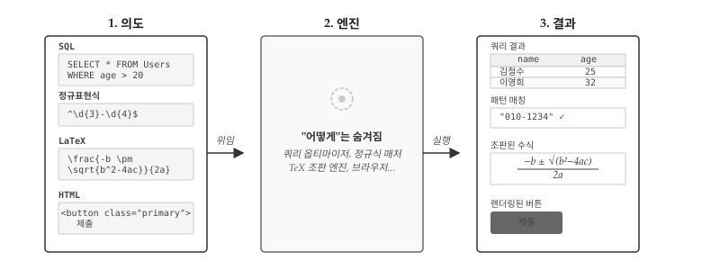
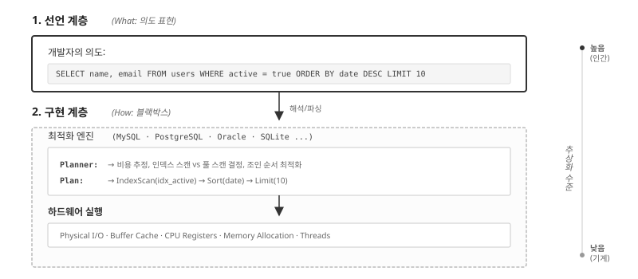
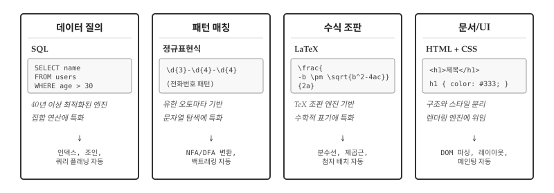
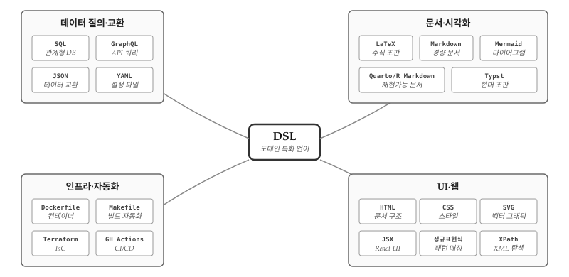
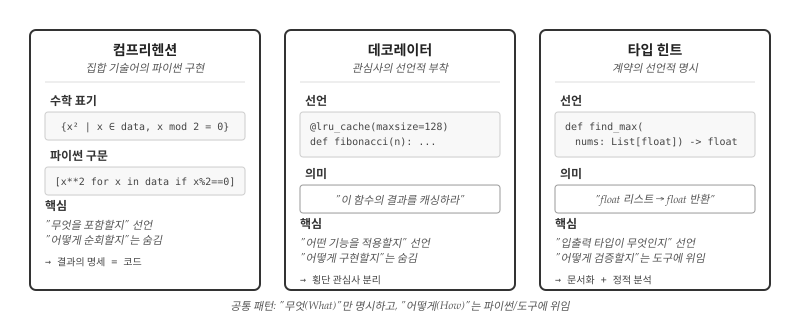
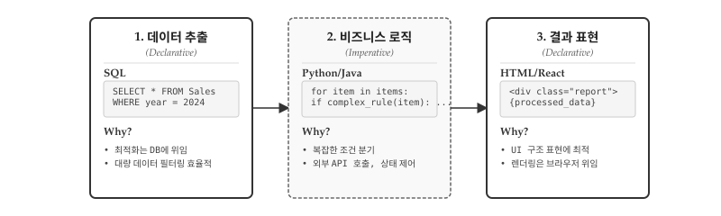
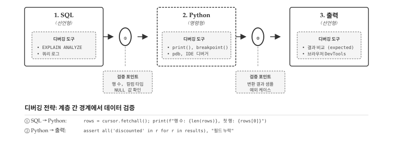

# 선언형 프로그래밍 {#sec-declarative}

\index{선언형 프로그래밍} \index{Declarative Programming}

선언형 프로그래밍은 단순한 코딩 스타일이 아니다. "무엇을(What)" 원하는지 선언하고, "어떻게(How)" 수행할지는 시스템에 위임하는 근본적인 사고방식의 전환이다. 명령형이 요리 레시피라면, 선언형은 식당 주문에 가깝다. "양파를 썰고, 팬에 기름을 두르고, 중불에서 3분간 볶는다"처럼 모든 절차를 명시하는 대신, "양파 볶음 주세요"라고 결과만 말한다.

{#fig-declarative-overview}

@fig-declarative-overview 는 선언형 프로그래밍의 핵심 구조를 네 가지 대표적인 DSL로 보여준다. SQL은 "20세 이상 사용자를 찾아라"고 선언하면 쿼리 옵티마이저가 인덱스 탐색, 조인 순서, 정렬 전략을 결정해 테이블 형태의 결과를 반환한다. 정규표현식은 `^\d{3}-\d{4}$` 패턴만 선언하면 NFA/DFA 변환과 백트래킹을 거쳐 문자열 매칭 여부를 판정한다. LaTeX는 `\frac{-b \pm \sqrt{b^2-4ac}}{2a}` 수식을 선언하면 TeX 조판 엔진이 분수선, 제곱근 기호, 위첨자 배치를 자동으로 계산해 수학적으로 정확한 수식을 렌더링한다. HTML의 `<button class="primary">제출</button>`은 브라우저 렌더링 엔진에 위임되어 DOM 파싱, 레이아웃 계산, 페인팅을 거쳐 클릭 가능한 버튼으로 화면에 나타난다. 네가지 DSL 모두 개발자는 **의도만 선언**하고, **실행의 복잡성은 전문 엔진에 위임**한다는 공통 구조를 갖는다.

흥미로운 점은 이 패러다임이 프로그래밍을 넘어 인류의 협업 방식과 맞닿아 있다는 것이다. 병원에서 의사는 "MRI 촬영해 주세요"라고 선언하지, 자기공명영상의 물리학 원리부터 기계 조작법까지 설명하지 않는다. 변호사가 "계약서 검토해 주세요"라고 요청할 때, 법률 조항 하나하나 어떻게 해석할지 지시하지 않는다. 전문 지식의 위임은 문명의 근간이며, 선언형 프로그래밍은 이 원리를 소프트웨어에 적용한 것이다.


## 추상화 계층 분리 {#sec-declarative-abstraction}

\index{추상화} \index{최적화}

선언형의 핵심은 두 계층의 분리에 있다. 개발자가 의도를 표현하는 **선언 계층(What)**과, 시스템이 알아서 처리하는 **구현 계층(How)**이다. 구현 계층은 개발자에게 블랙박스다—내부를 몰라도 선언만 정확하면 결과를 얻는다.

{#fig-declarative-abstraction}

@fig-declarative-abstraction 에서 선언 계층의 SQL 쿼리 `SELECT name, email FROM users WHERE active = true ORDER BY date DESC LIMIT 10`은 인간의 언어에 가깝다. "활성 사용자 중 최근 가입순으로 10명의 이름과 이메일을 달라"는 의도만 표현할 뿐이다. 구현 계층은 MySQL, PostgreSQL, Oracle, SQLite 같은 데이터베이스 엔진이 담당한다. 쿼리 플래너(Planner)가 비용을 추정하고, 인덱스 스캔과 풀 스캔 중 효율적인 방법을 선택하며, 조인 순서를 최적화한다. 실행 계획(Plan)이 수립되면 `IndexScan(idx_active) → Sort(date) → Limit(10)` 같은 구체적인 연산 순서가 결정된다. 최종적으로 하드웨어 계층에서 물리적 I/O, 버퍼 캐시, CPU 레지스터, 메모리 할당, 병렬 스레드가 동원되어 실제 데이터를 처리한다.

개발자가 알아야 할 것은 선언 계층뿐이다. B-트리 인덱스가 어떻게 동작하는지, 해시 조인과 중첩 루프 조인 중 어느 쪽이 효율적인지, 버퍼 캐시 크기를 얼마로 설정해야 하는지 몰라도 된다. 데이터베이스 엔진이 업그레이드되면 동일한 쿼리가 더 빠르게 실행되고, 하드웨어가 바뀌어도 코드 수정 없이 성능이 향상된다. 선언과 구현의 분리는 시스템이 독립적으로 진화할 수 있는 여지를 만든다.

파이썬에서 SQLite를 사용해 선언형 패러다임을 직접 체험해보자. 인메모리 데이터베이스에 사용자 테이블을 만들고, SQL 쿼리로 원하는 데이터를 요청한다. 개발자가 작성하는 것은 `SELECT ... WHERE ... ORDER BY ... LIMIT` 형태의 선언문뿐이다. SQLite 엔진이 테이블 스캔, 필터링, 정렬, 결과 제한을 어떤 순서로 처리할지는 전적으로 엔진의 몫이다.

```{python}
#| label: declarative-layers-example
import sqlite3

# 메모리 DB 생성 및 테이블/데이터 준비
conn = sqlite3.connect(":memory:")
cursor = conn.cursor()

cursor.execute("""
    CREATE TABLE users (
        name TEXT, email TEXT, active INTEGER, date TEXT
    )
""")
cursor.executemany(
    "INSERT INTO users VALUES (?, ?, ?, ?)",
    [("김철수", "kim@ex.com", 1, "2024-03-15"),
     ("이영희", "lee@ex.com", 1, "2024-03-10"),
     ("박민수", "park@ex.com", 0, "2024-03-12"),
     ("최지연", "choi@ex.com", 1, "2024-03-08")]
)

# 선언 계층: SQL로 의도만 표현
query = """
    SELECT name, email FROM users
    WHERE active = 1
    ORDER BY date DESC
    LIMIT 3
"""
# 구현 계층(블랙박스): SQLite 엔진이 알아서 처리
results = cursor.execute(query).fetchall()

print("활성 사용자 (최근 가입순 3명):")
for name, email in results:
    print(f"  {name}: {email}")

conn.close()
```

출력 결과를 보면 활성 사용자 3명이 최근 가입순으로 정렬되어 나온다. 개발자는 정렬 알고리즘을 구현하지 않았고, 필터링 로직을 직접 작성하지도 않았다. `WHERE active = 1`과 `ORDER BY date DESC`라는 선언만으로 원하는 결과를 얻었다. 동일한 쿼리를 MySQL이나 PostgreSQL에서 실행해도 결과는 같다. 구현 계층이 달라져도 선언 계층의 코드는 변하지 않는다—선언형 프로그래밍의 핵심 가치다.


## DSL: 전문 지식 캡슐화 {#sec-declarative-dsl}

\index{DSL} \index{도메인 특화 언어}

선언형 프로그래밍의 가장 강력한 형태는 DSL(Domain Specific Language, 도메인 특화 언어)이다. 범용 프로그래밍 언어가 모든 문제를 다루려 하지만, DSL은 특정 영역에 최적화된 언어를 설계한다. 데이터 질의에는 SQL, 패턴 매칭에는 정규표현식, 수식 조판에는 LaTeX, 문서 구조에는 HTML—각 DSL은 해당 도메인의 전문가들이 수십 년간 축적한 지식을 문법과 엔진에 응축해 놓은 것이다.

{#fig-declarative-dsl}

@fig-declarative-dsl 에서 보듯 SQL, 정규표현식, LaTeX, HTML/CSS는 모두 특정 문제 영역에 특화된 선언형 언어다. 데이터베이스 이론, 오토마타 이론, 조판 알고리즘, 렌더링 엔진—각 분야에서 40년 이상의 연구와 최적화가 축적되어 있다. 개발자는 이 거인들의 어깨 위에 서서 한 줄의 선언으로 수십 년의 전문 지식을 활용한다.

### 데이터 질의: SQL

SQL이 1970년대에 등장한 이후, 수십 년간 쿼리 옵티마이저가 발전해왔다. 통계 기반 비용 추정, 인덱스 활용 전략, 병렬 실행 계획 등 개발자가 직접 구현하기 어려운 최적화가 자동으로 적용된다. 동일한 결과를 명령형으로 작성하면 성능이 떨어질 뿐 아니라, 데이터 규모가 커질수록 그 격차는 기하급수적으로 벌어진다. 데이터베이스와 SQL 문법은 4부 분야별 코딩 `tool-database.qmd`에서 자세히 다룬다.

### 패턴 매칭: 정규표현식

`\d{3}-\d{4}-\d{4}`라는 짧은 선언이 전화번호 패턴을 표현한다. 정규표현식 엔진은 NFA(비결정적 유한 오토마타)에서 DFA(결정적 유한 오토마타)로의 변환, 백트래킹 최적화 등 컴퓨터 과학의 이론적 성과를 적용한다. 동일한 검증을 명령형으로 작성하면 수십 줄의 조건문이 필요하고, 패턴이 복잡해질수록 유지보수가 불가능해진다. 정규표현식 문법과 활용법은 `tool-regex.qmd`에서 자세히 다룬다.

### 수식 조판: LaTeX

\index{LaTeX}

`\frac{-b \pm \sqrt{b^2-4ac}}{2a}`라는 선언이 근의 공식을 표현한다. LaTeX 조판 엔진은 분수선의 두께와 길이, 제곱근 기호의 곡률, 위첨자와 아래첨자의 정확한 위치를 자동으로 계산한다. 도널드 크누스(Donald Knuth)가 1978년부터 개발한 TeX 엔진에는 수학 조판에 관한 수십 년의 타이포그래피 지식이 응축되어 있다. 동일한 수식을 HTML과 CSS로 직접 구현하려면 수백 줄의 코드가 필요하고, 브라우저마다 다르게 렌더링될 수 있다. LaTeX는 "이 수식을 아름답게 조판하라"고 선언하면, 나머지는 TeX 엔진이 알아서 처리한다.

### 문서 구조: HTML/CSS

HTML은 문서의 의미 구조를, CSS는 표현 스타일을 선언한다. `<article>`, `<h1>`, `<p>` 같은 태그는 "이것이 글의 본문이다, 제목이다, 문단이다"라고 선언할 뿐, 화면에 어떻게 배치될지는 브라우저 렌더링 엔진이 결정한다. DOM 파싱, 레이아웃 계산, 페인팅 순서 최적화 등 복잡한 과정이 추상화되어 있다.

::: {.callout-note}
### AI 시대 DSL 지형도

앞서 살펴본 SQL, 정규표현식, LaTeX, HTML/CSS는 DSL의 일부에 불과하다. 실제 소프트웨어 개발에서 마주치는 DSL은 훨씬 다양하며, AI 시대에 그 중요성이 다시 부각되고 있다.

{#fig-declarative-dsl-landscape}

**데이터 질의·교환**: SQL과 GraphQL은 데이터를 질의하고, JSON과 YAML은 데이터를 교환한다. API 시대에 이 네 가지는 필수 교양이다.

**문서·시각화**: LaTeX는 학술 조판의 표준이고, Markdown은 경량 문서 작성의 사실상 표준이다. Mermaid는 코드로 다이어그램을 그리고, Quarto/R Markdown은 분석과 문서를 통합한다. 최근 주목받는 Typst는 LaTeX의 현대적 대안이다.

**인프라·자동화**: Dockerfile은 컨테이너 환경을, Makefile은 빌드 자동화를, Terraform은 클라우드 인프라를, GitHub Actions는 CI/CD 파이프라인을 선언한다. DevOps 엔지니어에게 이 네 가지는 일상 언어다.

**UI·웹**: HTML, CSS, SVG는 웹의 삼위일체다. JSX는 React 생태계에서 UI를 선언하고, 정규표현식은 패턴 매칭에, XPath는 XML 탐색에 특화되어 있다.

**AI가 생성하고, 인간이 검증한다.** ChatGPT에게 "30세 이상 VIP 고객의 최근 구매 내역을 조회하는 SQL을 작성해줘"라고 요청하면 즉시 쿼리가 생성된다. 그러나 그 쿼리가 **올바른지** 판단하는 것은 개발자의 몫이다. `LEFT JOIN`과 `INNER JOIN`의 차이를 모르면 누락된 데이터를 발견하지 못한다. `GROUP BY` 없이 집계 함수를 사용한 오류를 잡아내려면 SQL 문법을 이해해야 한다. 인덱스가 없는 컬럼에 `WHERE` 조건을 걸어 성능이 저하되는 것을 예측하려면 쿼리 실행 계획을 읽을 줄 알아야 한다.

GitHub Copilot이 제안한 정규표현식 `^[\w.-]+@[\w.-]+\.\w+$`가 이메일을 올바르게 검증하는가? 탐욕적 매칭(greedy matching)으로 인해 예상과 다른 부분이 캡처되지는 않는가? AI가 생성한 Dockerfile에서 `RUN` 명령어가 레이어를 불필요하게 늘려 이미지 크기를 부풀리지는 않는가? Terraform 코드가 의도치 않게 보안 그룹을 열어두지는 않았는가?

**역설적으로, AI가 코드를 더 많이 생성할수록 DSL을 깊이 이해하는 개발자의 가치가 올라간다.** AI는 패턴을 학습해 그럴듯한 코드를 만들지만, 그 코드가 특정 상황에서 올바르게 동작하는지, 성능상 문제는 없는지, 보안 취약점은 없는지 판단하지 못한다. DSL의 문법과 의미, 엣지 케이스와 함정을 아는 개발자만이 AI의 출력을 검증하고 교정할 수 있다. AI 시대의 개발자 역량은 "코드를 작성하는 능력"에서 "코드를 검증하는 능력"으로 무게중심이 이동하고 있다.
:::


## 위임의 함정: 맹신과 오용 {#sec-declarative-pitfalls}

\index{SQL 인젝션} \index{ReDoS}

전문성을 위임한다고 해서 책임까지 위임되는 것은 아니다. DSL 엔진이 아무리 정교해도, 잘못된 선언은 심각한 결과를 초래한다. 선언형의 강력함은 동시에 위험의 원천이기도 하다.

**SQL 인젝션**은 선언형의 가장 악명 높은 함정이다. 사용자 입력을 검증 없이 SQL 쿼리에 삽입하면, 공격자가 의도하지 않은 명령을 실행할 수 있다. `SELECT * FROM users WHERE name = '사용자입력'`에서 사용자가 `'; DROP TABLE users; --`를 입력하면 테이블 전체가 삭제된다. 선언의 힘을 빌렸지만, 그 선언이 어떻게 해석되는지 이해하지 못한 결과다.

```{python}
#| label: declarative-injection-risk
# 위험한 코드 (절대 사용 금지)
user_input = "'; DROP TABLE users; --"
dangerous_query = f"SELECT * FROM users WHERE name = '{user_input}'"
print(f"위험한 쿼리:\n{dangerous_query}")

# 안전한 코드: 파라미터 바인딩 사용
safe_query = "SELECT * FROM users WHERE name = ?"
print(f"\n안전한 쿼리: {safe_query}")
print(f"파라미터: ('{user_input}',)")
```

**ReDoS(정규표현식 서비스 거부)**는 덜 알려졌지만 똑같이 위험하다. 백트래킹이 기하급수적으로 증가하는 패턴에 악의적 입력을 넣으면 서버가 멈춘다. `(a+)+$` 같은 패턴에 `aaaaaaaaaaaaaaaaaaaaaaaaaaaaab`를 입력하면 매칭 시도가 수십억 번 발생한다. 정규표현식 엔진의 내부 동작을 모르면 이런 함정을 피할 수 없다.

위임은 신뢰를 전제로 하지만, **검증 없는 신뢰는 위험**하다. DSL을 사용한다는 것은 해당 도메인의 규칙과 함정을 이해해야 한다는 뜻이다. SQL을 쓰려면 인젝션 방어법을, 정규표현식을 쓰려면 백트래킹의 위험을 알아야 한다. 앞서 살펴본 "AI가 생성하고 인간이 검증한다"는 원칙이 여기서도 적용된다. AI가 생성한 쿼리나 패턴이 보안상 안전한지 판단하려면 DSL의 함정을 알아야 한다.


## 파이썬 선언형 요소 {#sec-declarative-python}

\index{리스트 컴프리헨션} \index{데코레이터} \index{타입 힌트}

파이썬은 본질적으로 명령형 언어다. 변수에 값을 할당하고, 조건문으로 분기하고, 반복문으로 순회한다. 그러나 파이썬은 선언형 스타일도 지원하는 멀티패러다임 언어다. 특정 구문에서는 "무엇을 원하는지"만 선언하면 파이썬 인터프리터가 "어떻게 수행할지"를 알아서 처리한다.

파이썬의 선언형 요소 중 가장 대표적인 세 가지가 **컴프리헨션, 데코레이터, 타입 힌트**다. 컴프리헨션은 수학의 집합 기술어를 파이썬 문법으로 옮긴 것으로, "어떤 원소들로 컬렉션을 구성할지" 선언한다. 데코레이터는 함수에 "어떤 부가 기능을 적용할지" 선언하는 메타 프로그래밍 도구다. 타입 힌트는 "입력과 출력의 타입이 무엇인지" 선언하여 정적 분석 도구가 코드를 검증하게 한다. 세 요소 모두 "How"가 아닌 "What"에 집중한다는 공통점이 있다.

{#fig-declarative-python}

@fig-declarative-python 은 파이썬의 선언형 요소가 공유하는 패턴을 보여준다. 각 요소는 "무엇"만 명시하고 "어떻게"는 파이썬 인터프리터나 외부 도구에 위임한다. 컴프리헨션은 순회와 필터링의 구현을 숨기고, 데코레이터는 횡단 관심사(cross-cutting concern)의 구현을 캡슐화하며, 타입 힌트는 검증 로직을 정적 분석기에 맡긴다.

### 컴프리헨션: 집합 기술어 {#sec-declarative-comprehension}

리스트 컴프리헨션 `[x**2 for x in range(10) if x % 2 == 0]`은 수학의 집합 기술어(set-builder notation) `{x² | x ∈ {0,...,9}, x mod 2 = 0}`를 파이썬 문법으로 옮긴 것이다. "어떤 원소들로 리스트를 구성할지" 선언하는 방식이다.

```{python}
#| label: declarative-comprehension-philosophy
# 집합 기술어 스타일: 조건을 만족하는 원소들의 집합
data = range(20)

# {x² | x ∈ data, x는 짝수, x > 5}
squares = [x**2 for x in data if x % 2 == 0 and x > 5]
print(f"조건을 만족하는 제곱: {squares}")

# 딕셔너리 컴프리헨션: {k → v | k, v는 특정 조건 만족}
word = "mississippi"
freq = {char: word.count(char) for char in set(word)}
print(f"문자 빈도: {freq}")
```

명령형 반복문과 달리, 컴프리헨션은 "결과 컬렉션이 어떤 특성을 가지는지" 직접 읽힌다. 반복문은 "어떻게 순회하는지" 눈으로 따라가야 결과를 예측할 수 있지만, 컴프리헨션은 선언 자체가 결과의 명세다.

### 데코레이터: 관심사 선언 {#sec-declarative-decorator}

\index{데코레이터}

데코레이터는 함수에 "어떤 부가 기능을 적용할지" 선언한다. `@lru_cache`는 "결과를 캐싱하라", `@staticmethod`는 "인스턴스 없이 호출 가능하게 하라", `@property`는 "메서드를 속성처럼 접근하게 하라"고 선언한다. 구현 방법은 데코레이터 내부에 캡슐화되어 있다.

```{python}
#| label: declarative-decorator-philosophy
from functools import lru_cache
import time

# 선언: "이 함수의 결과를 캐싱하라"
@lru_cache(maxsize=128)
def fibonacci(n):
    if n < 2:
        return n
    return fibonacci(n-1) + fibonacci(n-2)

# 캐싱 없이 동일한 기능을 구현하려면
# 캐시 딕셔너리 관리, 키 해싱, 만료 정책 등을
# 직접 구현해야 한다

start = time.time()
result = fibonacci(35)
elapsed = time.time() - start
print(f"fibonacci(35) = {result}, 시간: {elapsed:.4f}초")
```

Flask, FastAPI 같은 웹 프레임워크에서 `@app.route("/users")`는 "이 함수를 /users 경로에 매핑하라"고 선언한다. URL 라우팅, HTTP 메서드 처리, 요청/응답 변환 등 복잡한 웹 서버 로직이 프레임워크에 위임된다.

### 타입 힌트: 계약의 선언 {#sec-declarative-type-hints}

\index{타입 힌트}

타입 힌트는 "이 함수가 어떤 타입을 받고 반환하는지" 선언한다. 런타임에 강제되지 않지만, 정적 분석 도구(mypy, Pyright)가 타입 일관성을 검증한다.

```{python}
#| label: declarative-type-hints
from typing import List, Optional

def find_maximum(numbers: List[float]) -> Optional[float]:
    """리스트에서 최댓값을 찾는다. 빈 리스트면 None 반환."""
    if not numbers:
        return None
    return max(numbers)

# 타입 힌트는 문서화이자 계약이다
# - 호출자에게: "float 리스트를 전달하라"
# - 사용자에게: "Optional[float]을 받을 준비를 하라"
scores: List[float] = [85.5, 90.0, 78.5]
result: Optional[float] = find_maximum(scores)
print(f"최댓값: {result}")
```

타입 힌트의 선언적 특성은 코드가 "무엇을 기대하는지" 명시적으로 드러낸다는 점에 있다. 구현을 읽지 않아도 함수의 계약을 파악할 수 있다.


## 명령형과의 협력 {#sec-declarative-hybrid}

\index{하이브리드 프로그래밍}

현실의 코드는 순수하게 선언형이거나 명령형인 경우가 드물다. 대부분의 프로그램은 두 패러다임을 조합한다. SQL로 데이터를 가져온 뒤 파이썬으로 복잡한 변환을 수행하고, 정규표현식으로 패턴을 찾은 뒤 조건문으로 후처리한다. 패러다임 선택은 이분법이 아니라 스펙트럼이다.

{#fig-declarative-hybrid}

@fig-declarative-hybrid 는 현실 애플리케이션의 전형적인 구조를 보여준다. **1단계 데이터 추출**에서 SQL이 `SELECT * FROM Sales WHERE year = 2024`로 대량 데이터를 필터링한다. 최적화는 데이터베이스 엔진에 위임되므로 개발자는 "무엇을" 원하는지만 선언한다. **2단계 비즈니스 로직**에서 파이썬이나 자바가 복잡한 조건 분기, 외부 API 호출, 상태 제어를 담당한다. SQL로 표현하기 어려운 `if complex_rule(item): ...` 같은 절차적 로직이 여기에 속한다. **3단계 결과 표현**에서 HTML/React가 처리된 데이터를 UI로 렌더링한다. `<div class="report">{processed_data}</div>` 형태로 구조만 선언하면 브라우저가 실제 화면 출력을 처리한다.

선언형(입력) → 명령형(처리) → 선언형(출력)이라는 "샌드위치 구조"가 웹 애플리케이션, 데이터 파이프라인, API 서버 등 대부분의 현대 소프트웨어에서 반복된다.

샌드위치 구조의 핵심은 **각 계층이 자신에게 최적화된 도구를 사용**한다는 점이다. SQL은 인덱스를 활용해 수백만 행에서 필요한 데이터만 효율적으로 추출한다. 파이썬은 조건 분기, 외부 API 호출, 복잡한 계산처럼 SQL로 표현하기 어려운 로직을 처리한다. HTML/React는 DOM 구조와 이벤트 처리를 브라우저에 위임한다. 각 계층에서 "억지로" 다른 패러다임을 쓰려 하면 코드가 복잡해지고 성능이 저하된다.

실제 웹 애플리케이션을 생각해보자. 사용자가 "2024년 매출 상위 10개 상품"을 요청하면 SQL이 집계와 정렬을 처리한다. 반환된 데이터에 할인율 계산, 재고 상태 확인, 추천 알고리즘 적용 같은 비즈니스 로직이 파이썬에서 실행된다. 최종 결과는 React 컴포넌트가 테이블이나 차트로 렌더링한다. 세 계층이 각자의 강점을 발휘하는 것이다.

```{python}
#| label: declarative-hybrid-sandwich
import sqlite3

# === 1단계: 데이터 추출 (SQL - 선언형) ===
conn = sqlite3.connect(":memory:")
cursor = conn.cursor()
cursor.execute("CREATE TABLE sales (product TEXT, amount INT, year INT)")
cursor.executemany("INSERT INTO sales VALUES (?, ?, ?)", [
    ("노트북", 1200000, 2024), ("마우스", 35000, 2024),
    ("키보드", 89000, 2024), ("모니터", 450000, 2023)
])
rows = cursor.execute(
    "SELECT product, amount FROM sales WHERE year = 2024"
).fetchall()
conn.close()

# === 2단계: 비즈니스 로직 (Python - 명령형) ===
def apply_discount(product, amount):
    rate = 0.1 if amount >= 100000 else 0.05
    return {"product": product, "original": amount, "discounted": int(amount * (1 - rate))}

processed = [apply_discount(p, a) for p, a in rows]

# === 3단계: 결과 표현 (문자열 포맷 - 선언형) ===
template = "{product}: {original:,}원 → {discounted:,}원"
for item in processed:
    print(template.format(**item))
```

SQL이 `WHERE year = 2024` 조건으로 필요한 데이터만 추출하고, 파이썬이 금액별 할인율을 계산하며, 템플릿 문자열이 최종 출력 형식을 선언한다. 각 단계가 명확히 분리되어 있으므로 할인 정책이 바뀌면 2단계만, 출력 형식이 바뀌면 3단계만 수정하면 된다.

역방향 흐름도 존재한다. 사용자 입력(HTML 폼)을 받아 검증 로직(파이썬)을 거쳐 데이터베이스(SQL)에 저장하는 경우다. 입력과 출력 모두 선언형이고, 중간 처리가 명령형인 구조는 동일하다. 양방향으로 데이터가 흐르는 풀스택 애플리케이션에서 샌드위치 구조는 더욱 명확하게 드러난다.

::: {.callout-tip}
### 경계 인식의 기술

두 패러다임 사이를 오갈 때 핵심은 **언제 전환할지 인식**하는 것이다.

**선언형을 유지해야 할 때**: 문제가 DSL의 도메인에 정확히 맞을 때(SQL의 집합 연산, 정규표현식의 패턴 매칭), 엔진 최적화가 직접 구현보다 나을 때(대용량 데이터의 인덱스 활용), 동일 패턴이 반복될 때(데이터 변환 파이프라인).

**명령형으로 전환해야 할 때**: DSL 문법을 억지로 확장해 가독성이 떨어질 때, 상태 변화를 추적해야 할 때(이전 결과에 따라 다음 동작이 달라지는 경우), 중첩 구조나 재귀가 필요할 때(HTML 파싱, 트리 탐색).

정규표현식이 HTML을 "완벽하게" 파싱할 수 없는 것은 이론적 한계(정규 언어 vs 문맥 자유 언어)에서 비롯된다. `<div><p>내용</p></div>`처럼 단순한 경우는 `r'<p>(.*?)</p>'`로 추출할 수 있지만, 중첩 태그, 속성, 주석이 섞이면 한계에 부딪힌다. 경계를 인식하면 억지 확장 대신 `BeautifulSoup` 같은 적합한 도구로 전환할 수 있다.
:::


## 디버깅: 계층 경계에서 검증하기 {#sec-declarative-debug}

\index{선언형!디버깅}

샌드위치 구조에서 버그가 발생하면 어디서 문제가 생겼는지 찾기가 쉽지 않다. SQL이 잘못된 데이터를 반환했는가? 파이썬 로직에 오류가 있는가? 출력 형식이 문제인가? 세 가지 패러다임이 섞여 있기 때문에 각 계층을 개별적으로 디버깅해서는 전체 그림을 놓치기 쉽다.

{#fig-declarative-debug-sandwich}

@fig-declarative-debug-sandwich 는 샌드위치 디버깅의 핵심 전략을 보여준다. 버그 추적은 **계층 내부**가 아니라 **계층 사이 경계**에서 시작해야 한다. 체크포인트 ①에서 SQL 결과가 파이썬으로 올바르게 전달되었는지, 체크포인트 ②에서 비즈니스 로직 결과가 출력 계층으로 제대로 넘어가는지 확인한다.

```{python}
#| label: declarative-debug-boundary
# === 샌드위치 디버깅: 경계 검증 패턴 ===

# 1단계 결과 시뮬레이션 (실제로는 DB에서 조회)
sql_result = [
    {"name": "김철수", "amount": 150000},
    {"name": "이영희", "amount": 85000},
    {"name": None, "amount": 120000},  # NULL 값 포함
]

# ① 체크포인트: SQL → Python 경계
print(f"[검증①] 행 수: {len(sql_result)}")
print(f"[검증①] 첫 행: {sql_result[0]}")
print(f"[검증①] NULL 포함 여부: {any(r['name'] is None for r in sql_result)}")

# 2단계: 비즈니스 로직 (명령형)
processed = []
for row in sql_result:
    if row['name'] is None:
        continue  # NULL 필터링
    discount = row['amount'] * 0.1 if row['amount'] >= 100000 else 0
    processed.append({
        'name': row['name'],
        'original': row['amount'],
        'discount': discount
    })

# ② 체크포인트: Python → 출력 경계
print(f"[검증②] 처리된 행 수: {len(processed)}")
print(f"[검증②] 샘플: {processed[0] if processed else 'empty'}")
assert all('discount' in r for r in processed), "discount 필드 누락"
```

각 체크포인트에서 확인할 항목은 다음과 같다. **체크포인트 ①**에서는 행 수, 컬럼 타입, NULL 값 존재 여부를 점검한다. SQL 쿼리가 예상한 결과를 반환했는지 확인하는 단계다. **체크포인트 ②**에서는 변환 결과 샘플, 필수 필드 존재 여부, 예외 케이스 처리 결과를 확인한다. 비즈니스 로직이 모든 경우를 올바르게 처리했는지 검증하는 단계다.

::: {.callout-tip}
### 계층별 디버깅 도구

샌드위치 구조에서 각 계층은 고유한 디버깅 도구를 갖는다. **SQL 계층**에서는 `EXPLAIN ANALYZE`로 쿼리 실행 계획을 확인하고, 쿼리 로그로 실제 전송된 SQL을 점검한다. **파이썬 계층**에서는 `print()`, `breakpoint()`, IDE 디버거로 변수 값과 실행 흐름을 추적한다. **출력 계층**에서는 예상 결과와 비교하거나, 웹이라면 브라우저 DevTools로 렌더링 결과를 확인한다. 핵심은 각 도구를 계층 내부가 아니라 **계층 경계에서 활용**하는 것이다.
:::


::: {.content-visible when-format="pdf"}
\faLightbulb\ 생각해볼 점
:::

::: {.content-visible when-format="html"}
## 💡 생각해볼 점 {.unnumbered}
:::

**통제의 양도는 신뢰의 문제다.** 선언형 프로그래밍에서 "어떻게"를 시스템에 맡긴다는 것은 결국 그 시스템을 신뢰한다는 뜻이다. 쿼리 옵티마이저가 내 쿼리를 최적으로 실행할 것이라고, 정규표현식 엔진이 패턴을 정확히 매칭할 것이라고 믿는다. 신뢰가 무너지면 선언형의 이점도 사라진다. SQL 쿼리가 예상보다 느릴 때 `EXPLAIN`을 찍어보거나, 정규표현식이 이상하게 동작할 때 부분 패턴으로 분해해 테스트한다. 선언형을 쓰면서도 구현 계층을 들여다볼 줄 알아야 하는 이유가 여기에 있다.

**샌드위치 구조는 우연이 아니다.** 웹 애플리케이션, 데이터 파이프라인, API 서버 할 것 없이 "선언형(입력) → 명령형(로직) → 선언형(출력)" 패턴이 반복된다. SQL로 데이터를 가져오고, 파이썬으로 비즈니스 로직을 처리하고, HTML/React로 결과를 렌더링한다. 입력과 출력은 형식이 고정되어 있어 선언형이 효율적이고, 중간 로직은 상황에 따라 분기해야 하므로 명령형이 자연스럽다. 특정 패턴이 반복된다면 그 이유가 있다. 샌드위치 구조가 보편적인 이유를 이해하면 새로운 시스템을 설계할 때도 같은 원리를 적용할 수 있다.

**경계를 인식하는 것이 디버깅의 절반이다.** 샌드위치 구조에서 버그가 발생하면 "어느 계층에서 문제가 생겼는가"를 먼저 파악해야 한다. SQL이 잘못된 데이터를 반환했는가, 파이썬 로직에 오류가 있는가, 출력 형식이 문제인가. 계층 내부를 파고들기 전에 계층 사이 경계에서 데이터를 검증하는 습관이 중요하다. 체크포인트 ①에서 SQL 결과를 확인하고, 체크포인트 ②에서 변환 결과를 확인하면 문제 범위가 좁혀진다. 이 접근법은 단일 패러다임에서는 덜 중요하지만, 여러 패러다임이 섞인 현실 코드에서는 필수다.

**AI가 코드를 생성할수록 DSL 지식이 더 중요해진다.** 역설적이지만, LLM이 SQL 쿼리나 정규표현식을 대신 작성해줄수록 그 결과를 검증할 능력이 더 필요하다. AI가 생성한 `SELECT ... JOIN ... WHERE ...` 쿼리가 원하는 결과를 반환하는지, `r'\d{3}-\d{4}'` 패턴이 의도한 문자열만 매칭하는지 확인하려면 DSL 자체를 이해해야 한다. 코드 작성 도구가 발전할수록 코드 검증 역량의 가치는 오히려 높아진다.

\index{SQL}
\index{정규표현식}
\index{리스트 컴프리헨션}
\index{데코레이터}
