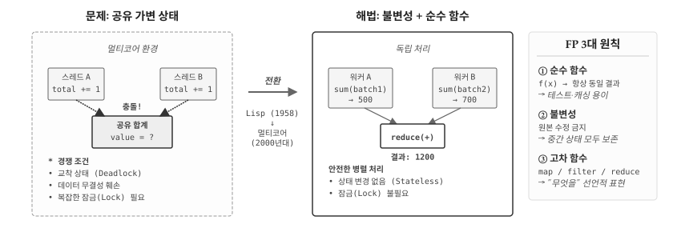
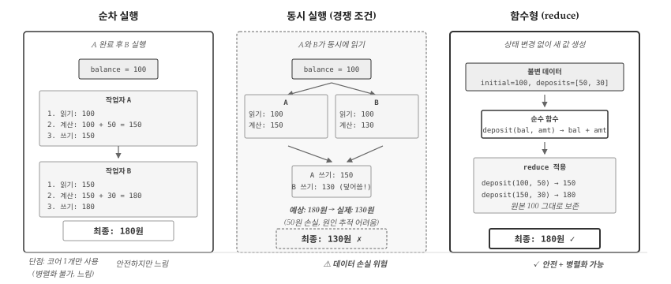
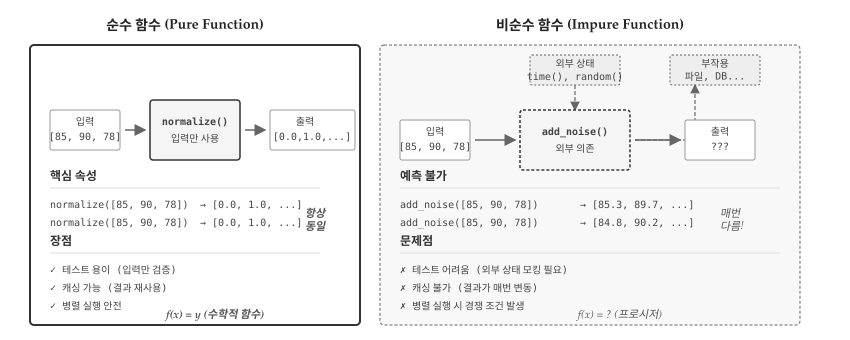
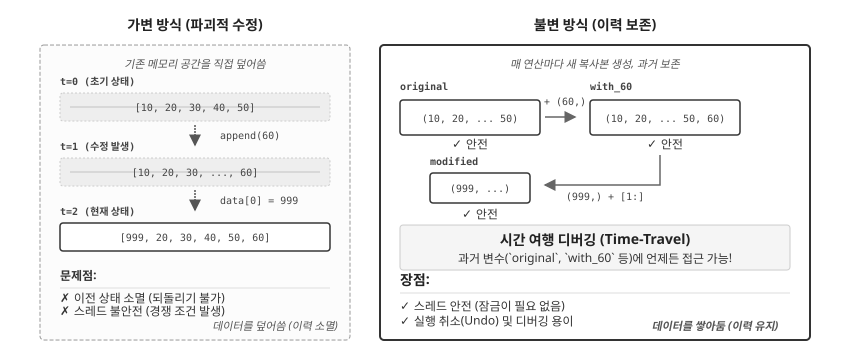
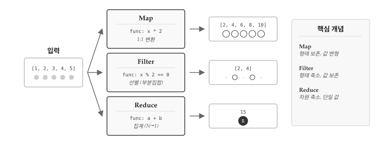
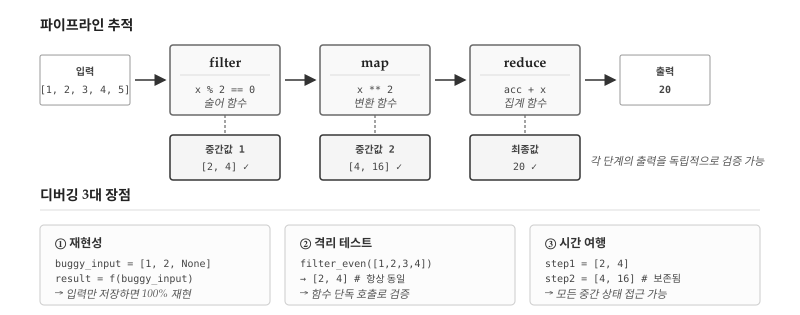

# 함수형 프로그래밍 {#sec-fp}

\index{함수형 프로그래밍} \index{Functional Programming}

2000년대 중반, 소프트웨어 산업에 조용한 위기가 찾아왔다. 인텔은 2004년 4GHz 프로세서 개발을 포기했다. 클럭 속도를 높이면 발열과 전력 소모가 감당할 수 없는 수준으로 치솟았기 때문이다. 대신 선택한 해법이 **멀티코어(Multi-core)**다. 코어 하나의 속도를 높이는 대신, 코어 여러 개를 병렬로 배치했다. 그런데 이 변화가 프로그래밍 패러다임 전체를 뒤흔들었다. 명령형, 절차적, 객체지향—지금까지 배운 모든 패러다임이 **공유 가변 상태(Shared Mutable State)**라는 공통 전제 위에 서 있었기 때문이다.

앞 장에서 OOP가 캡슐화와 다형성으로 복잡성을 분할한다고 배웠다. 단일 스레드 환경에서는 완벽하게 작동한다. 그러나 두 개의 코어가 **같은 객체의 상태를 동시에 변경**하려 하면? 경쟁 조건(Race Condition), 교착 상태(Deadlock), 데이터 손상이 발생한다. 잠금(Lock)을 도입하면 성능이 떨어지고, 잠금이 복잡해지면 새로운 버그가 생긴다. @fig-fp-overview 는 공유 가변 상태가 일으키는 문제와 함수형 프로그래밍의 해법이 제시되어 있다. OOP는 상태 변경을 **캡슐화**했을 뿐, 상태 변경 자체를 제거하지는 못했다.

{#fig-fp-overview}

이때 학계에서만 머물던 오래된 패러다임이 재조명받았다. 1958년 존 매카시(John McCarthy)가 만든 **Lisp**—세계에서 두 번째로 오래된 고급 언어다. Lisp는 처음부터 **불변 데이터**와 **순수 함수**를 중심으로 설계되었다. 상태를 변경하지 않으면 경쟁 조건이 원천적으로 사라진다. 50년 넘게 "학술용 언어"로 치부되던 함수형 프로그래밍이 멀티코어 시대의 해법으로 떠오른 것이다. \index{Lisp}

Scala(2004), Clojure(2007), Haskell의 재부상, 그리고 JavaScript와 Python에 함수형 기능이 대거 추가되면서 함수형 패러다임은 주류로 진입했다. 데이터 과학에서는 특히 중요하다. 수백만 행의 데이터를 병렬로 처리할 때, 상태 변경 없이 데이터를 변환하는 함수형 스타일이 버그를 줄이고 확장성을 높인다.


## 공유 상태의 저주 {#sec-fp-shared-state}

\index{공유 가변 상태} \index{경쟁 조건}

공유 가변 상태가 왜 위험한지 은행 계좌 예제로 살펴보자. `balance += amount`는 한 줄이지만, 컴퓨터 내부에서는 세 단계로 나뉜다: 읽기 → 계산 → 쓰기. 두 스레드가 이 과정을 동시에 수행하면 어떻게 될까? @fig-fp-race-condition 은 순차 실행, 동시 실행(경쟁 조건), 함수형 접근법 세 가지를 비교한다.

{#fig-fp-race-condition}

```{python}
#| label: fp-race-condition-simulation
# 경쟁 조건 시뮬레이션: 두 작업자가 동시에 계좌 잔액을 수정

def sequential_deposit():
    """순차 실행: 정상 동작"""
    balance = 100

    # 작업자 A: 50원 입금 (읽기 → 계산 → 쓰기)
    temp = balance      # 1. 읽기: 100
    temp = temp + 50    # 2. 계산: 150
    balance = temp      # 3. 쓰기: 150

    # 작업자 B: 30원 입금
    temp = balance      # 1. 읽기: 150
    temp = temp + 30    # 2. 계산: 180
    balance = temp      # 3. 쓰기: 180

    return balance

def concurrent_deposit():
    """동시 실행: 경쟁 조건 발생"""
    balance = 100

    # 두 작업자가 "동시에" 읽기 (같은 값을 읽음)
    temp_a = balance    # A가 100 읽음
    temp_b = balance    # B도 100 읽음 (동시!)

    # 각자 계산
    temp_a = temp_a + 50  # A: 100 + 50 = 150
    temp_b = temp_b + 30  # B: 100 + 30 = 130

    # 순서대로 쓰기 (나중에 쓴 값이 덮어씀)
    balance = temp_a    # A가 150 씀
    balance = temp_b    # B가 130으로 덮어씀!

    return balance

print("=== 순차 실행 ===")
print(f"최종 잔액: {sequential_deposit()}원 (100 + 50 + 30 = 180)")

print("\n=== 동시 실행 (경쟁 조건) ===")
print(f"최종 잔액: {concurrent_deposit()}원 (A의 50원 입금이 사라짐!)")
```

문제의 핵심은 `balance += 50`이 **원자적(atomic)이지 않다**는 점이다. 읽기와 쓰기 사이에 다른 스레드가 끼어들면 데이터가 손실된다. 잠금(Lock)으로 해결할 수 있지만, 잠금은 성능을 떨어뜨리고 교착 상태의 위험이 있다. **함수형 접근법은 근본적으로 다르다**—상태를 변경하지 않으면 잠금이 필요 없다.

```{python}
#| label: fp-functional-deposit
from functools import reduce

# 함수형 방식: 상태를 변경하지 않고 새 값을 반환
def deposit(balance, amount):
    """순수 함수: 입력만으로 결과 결정, 원본 변경 없음"""
    return balance + amount

# 입금 내역 (불변 데이터)
initial_balance = 100
deposits = [50, 30]  # A가 50원, B가 30원 입금

# reduce로 순차 적용 (공유 상태 없음)
final_balance = reduce(deposit, deposits, initial_balance)

print(f"초기 잔액: {initial_balance}원")
print(f"입금 내역: {deposits}")
print(f"최종 잔액: {final_balance}원 (100 + 50 + 30 = 180)")
```

`deposit()` 함수는 `balance`를 변경하지 않고 **새 값을 반환**한다. `reduce()`는 입금 내역을 순차적으로 적용하되, 각 단계에서 이전 결과를 입력으로 받아 새 결과를 생성한다. 공유 상태가 없으므로 경쟁 조건이 발생할 여지가 없다. **상태 변경 없음 = 잠금 불필요**—함수형 프로그래밍이 병렬 처리에 유리한 핵심 이유다.


## 순수 함수 {#sec-fp-pure}

\index{순수 함수} \index{Pure Function}

함수형 프로그래밍의 핵심은 **순수 함수(Pure Function)**다. 수학에서 함수 $f(x) = x^2$를 생각해보자. $f(3)$은 언제 계산하든, 누가 계산하든, 어떤 컴퓨터에서 계산하든 항상 9다. 어제 계산한 값과 내일 계산할 값이 다를 리 없다. 순수 함수는 바로 이 수학적 함수의 성질을 프로그래밍에 가져온 것이다.

순수 함수는 두 가지 조건을 만족한다. 첫째, **결정론적(Deterministic)**이어야 한다. 같은 입력을 주면 언제나 같은 출력을 반환한다. `normalize([85, 90, 78])`을 호출하면 오늘도, 내일도, 1년 후에도 동일한 결과가 나온다. 둘째, **부작용(Side-effect)**이 없어야 한다. 함수 외부의 변수를 읽거나 변경하지 않고, 파일을 쓰거나 네트워크 요청을 보내지 않는다. 함수가 하는 일은 오직 입력을 받아 출력을 계산하는 것뿐이다.

@fig-fp-pure 는 순수 함수와 비순수 함수의 차이를 시각화한다. 순수 함수 `normalize()`는 입력 데이터만 사용해 결과를 계산한다. 외부에서 들어오는 화살표도, 외부로 나가는 화살표도 없다. 반면 비순수 함수 `add_noise()`는 `random()` 같은 외부 상태에 의존하고, 파일이나 데이터베이스에 부작용을 남긴다. 같은 입력을 주어도 매번 다른 결과가 나올 수 있다.

{#fig-fp-pure}

데이터 과학에서 순수 함수가 어떻게 작동하는지 살펴보자. `normalize()`와 `z_score()`는 모두 순수 함수다. 입력 리스트만으로 결과가 완전히 결정되며, 함수 외부의 어떤 것도 건드리지 않는다.

```{python}
#| label: fp-pure-data-science
# 순수 함수: 같은 입력 → 같은 출력
def normalize(values):
    """Min-Max 정규화 (순수 함수)"""
    min_v, max_v = min(values), max(values)
    if max_v == min_v:
        return [0.0] * len(values)
    return [(v - min_v) / (max_v - min_v) for v in values]

def z_score(values):
    """Z-점수 표준화 (순수 함수)"""
    mean = sum(values) / len(values)
    std = (sum((v - mean) ** 2 for v in values) / len(values)) ** 0.5
    if std == 0:
        return [0.0] * len(values)
    return [(v - mean) / std for v in values]

data = [10, 20, 30, 40, 50]

print(f"원본: {data}")
print(f"정규화: {[f'{v:.2f}' for v in normalize(data)]}")
print(f"Z-점수: {[f'{v:.2f}' for v in z_score(data)]}")

# 같은 입력 → 항상 같은 출력
print(f"재호출: {normalize(data) == normalize(data)}")  # True
```

순수 함수가 주는 실질적인 이점은 무엇일까? 먼저 **테스트가 단순해진다**. `normalize([10, 20, 30])`의 결과를 검증하려면 입력과 예상 출력만 비교하면 된다. 데이터베이스 연결을 모킹하거나, 파일 시스템을 준비하거나, 특정 시간대를 시뮬레이션할 필요가 없다. 둘째, **캐싱(메모이제이션)**이 가능하다. `normalize([85, 90, 78])`을 한 번 계산했다면 그 결과를 저장해두고, 같은 입력이 들어오면 재계산 없이 저장된 값을 반환할 수 있다. 결과가 입력에만 의존하므로 캐시된 값이 틀릴 리 없다. 셋째, **병렬 처리가 안전하다**. 순수 함수는 외부 상태를 건드리지 않으므로 여러 스레드에서 동시에 호출해도 경쟁 조건이 발생하지 않는다.

그렇다면 비순수 함수는 왜 존재할까? 현실 세계와 상호작용하려면 부작용이 불가피하기 때문이다. 랜덤 샘플링, 현재 시간 조회, 파일 읽기, 네트워크 요청—모두 외부 상태에 의존하거나 외부 상태를 변경한다.

```{python}
#| label: fp-impure-data-science
import random

# 비순수 함수: 외부 상태에 의존
random.seed(None)  # 현재 시간에 의존

def sample_data(n):
    """랜덤 샘플링 - 매번 다른 결과 (비순수)"""
    return [random.gauss(0, 1) for _ in range(n)]

print(f"샘플1: {[f'{v:.2f}' for v in sample_data(3)]}")
print(f"샘플2: {[f'{v:.2f}' for v in sample_data(3)]}")  # 다른 값

# 비순수 함수: 외부 상태 변경
results_cache = []  # 외부 상태

def process_and_cache(data):
    """결과를 외부 캐시에 저장 (비순수)"""
    result = sum(data) / len(data)
    results_cache.append(result)  # 부작용!
    return result

process_and_cache([1, 2, 3])
process_and_cache([4, 5, 6])
print(f"캐시 상태: {results_cache}")  # 함수 외부가 변경됨
```

비순수 함수가 나쁜 것은 아니다. 파일 읽기, 데이터베이스 쿼리, 시각화 출력, 사용자 입력 처리—유용한 프로그램이라면 어딘가에서 반드시 외부 세계와 상호작용해야 한다. 함수형 프로그래밍의 핵심 전략은 **순수한 부분과 비순수한 부분을 명확히 분리**하는 것이다. 데이터를 변환하고 계산하는 핵심 로직은 순수 함수로 작성한다. I/O와 상태 변경은 프로그램의 가장 바깥 경계로 몰아넣는다. 마치 계란을 깰 때 노른자(순수 로직)와 껍데기(I/O)를 분리하듯, 코드의 핵심부를 부작용으로부터 보호하는 것이다. 이렇게 하면 핵심 로직을 테스트하고 재사용하기 쉬워지고, 버그가 발생해도 원인을 추적하기 훨씬 수월해진다.


## 불변성 {#sec-fp-immutable}

\index{불변성} \index{Immutability}

**불변성(Immutability)**은 데이터가 한번 생성되면 절대 변경되지 않는 특성이다. 회계 장부를 생각해보자. 거래 내역을 수정액으로 덮어쓰는 대신, 새로운 거래를 추가해 기록을 남긴다. 1월 잔액 100만원, 2월 입금 50만원, 3월 출금 30만원이 각각 별도 항목으로 남아있으면 언제든 특정 시점의 잔액을 확인할 수 있다. 반면 원장을 직접 수정해 "현재 잔액 120만원"만 남기면 과거 이력은 사라진다.

프로그래밍에서 불변성도 마찬가지다. 데이터를 "수정"하는 대신 **새로운 데이터를 생성**한다. @fig-fp-immutable 는 가변 방식과 불변 방식의 차이를 보여준다. 가변 방식에서는 `append()`나 인덱스 할당으로 원본을 직접 수정하면 이전 상태가 소멸한다. 불변 방식에서는 각 연산이 새로운 데이터를 반환하므로 `original`, `with_60`, `modified` 모두 독립적으로 존재한다.

{#fig-fp-immutable}

```{python}
#| label: fp-immutable-comparison
# === 가변적 접근: 원본을 직접 수정 ===
dataset = [10, 20, 30, 40, 50]
print(f"원본 (가변 전): {dataset}")

# 원본 수정
dataset.append(60)
dataset[0] = 999
print(f"원본 (가변 후): {dataset}")  # 원본이 변경됨

# === 불변적 접근: 새 데이터 생성 ===
original = (10, 20, 30, 40, 50)  # 튜플은 불변
print(f"원본 (불변): {original}")

# 새 데이터 생성
with_60 = original + (60,)
modified = (999,) + original[1:]

print(f"60 추가: {with_60}")
print(f"첫 요소 변경: {modified}")
print(f"원본 유지: {original}")  # 원본 그대로
```

파이썬에서 리스트는 가변(mutable) 자료구조다. `append()`, `pop()`, 인덱스 할당 모두 원본 리스트를 직접 수정한다. 반면 튜플은 불변(immutable)이다. 요소를 추가하거나 변경하려면 반드시 새로운 튜플을 만들어야 한다. `original + (60,)` 표현식은 `original`을 건드리지 않고 새 튜플을 반환한다. 문자열도 불변이다. `s.upper()`는 `s`를 대문자로 바꾸는 것이 아니라 새로운 대문자 문자열을 반환한다.

불변성의 실용적 가치는 데이터 분석 파이프라인에서 두드러진다. 원본 데이터를 보존하면서 단계별로 변환을 적용하면 중간 결과를 모두 확인할 수 있다.

```{python}
#| label: fp-immutable-pipeline
# 데이터 분석 파이프라인: 불변 스타일
scores = [85, 92, 78, 95, 88]

# 각 단계가 새 리스트를 반환 (원본 변경 없음)
step1 = [x + 5 for x in scores]         # 가산점 부여
step2 = [x for x in step1 if x >= 90]   # 90점 이상 필터
step3 = [x / 100 for x in step2]        # 비율로 변환

print(f"원본:   {scores}")      # [85, 92, 78, 95, 88]
print(f"가산점: {step1}")       # [90, 97, 83, 100, 93]
print(f"필터:   {step2}")       # [90, 97, 100, 93]
print(f"비율:   {step3}")       # [0.9, 0.97, 1.0, 0.93]
```

리스트 컴프리헨션은 원본을 건드리지 않고 **새 리스트를 반환**한다. `scores`는 처음부터 끝까지 변하지 않는다. `step1`, `step2`, `step3`가 모두 독립적으로 존재하므로 "왜 78점이 빠졌지?"라는 질문에 즉시 답할 수 있다. `step1`을 출력하면 가산점 적용 결과가 보이고(83점), `step2`를 출력하면 필터링에서 탈락한 이유를 확인할 수 있다.

불변성은 병렬 처리에서 더욱 빛난다. 여러 워커가 동시에 데이터를 처리할 때 각자 독립적인 복사본을 다루므로 경쟁 조건이 발생하지 않는다. 또한 실행 취소(Undo) 기능 구현도 자연스럽다. 모든 이전 상태가 보존되어 있으므로 특정 시점으로 되돌리는 것은 해당 변수를 참조하기만 하면 된다. 비용은 메모리다. 매번 새 객체를 생성하므로 가변 방식보다 메모리를 더 사용한다. 하지만 현대 언어들은 구조 공유(structural sharing) 기법으로 이 비용을 최소화한다.


## 일급 함수와 고차 함수 {#sec-fp-higher-order}

\index{일급 함수} \index{고차 함수} \index{First-class Function}

프로그래밍 언어에서 "일급 객체(First-class Citizen)"[^first-class]란 아무 제약 없이 자유롭게 다룰 수 있는 값을 뜻한다. 정수 `42`는 변수에 저장하고, 함수에 전달하고, 함수에서 반환받을 수 있다. 리스트 `[1, 2, 3]`도 마찬가지다. 그런데 C나 Java 같은 전통적 언어에서 함수는 이런 자유가 없었다. 함수는 "호출하는 것"이지 "값으로 다루는 것"이 아니었다.

[^first-class]: "일급 시민"이라는 용어는 사회적 비유에서 왔다. 일급 시민은 투표권, 재산권, 이동의 자유 등 모든 권리를 누린다. 이급 시민은 일부 권리가 제한된다. 프로그래밍에서 일급 객체는 변수 할당, 함수 인자 전달, 반환값 사용이라는 "세 가지 권리"를 모두 갖는다. 정수, 문자열, 리스트는 처음부터 일급이었지만, 함수는 많은 언어에서 오랫동안 이급 취급을 받았다.

함수형 프로그래밍에서 함수는 **일급 객체**다. 숫자나 문자열처럼 변수에 할당하고, 다른 함수의 인자로 전달하며, 함수의 반환값으로 사용할 수 있다. 함수가 일급 객체가 되면 **고차 함수(Higher-order Function)**가 가능해진다. 고차 함수란 함수를 인자로 받거나, 함수를 반환하거나, 둘 다 하는 함수다. 수학에서 미분 연산자 $\frac{d}{dx}$가 함수를 받아 함수를 반환하듯, 고차 함수는 함수 자체를 조작한다.

@fig-fp-higher-order 는 `map`, `filter`, `reduce` 세 가지 핵심 고차 함수가 데이터를 어떻게 변환하는지 보여준다. 세 함수 모두 "어떤 함수를 적용할지"를 인자로 받는다. 반복문을 직접 작성하는 대신, **무엇을 할지(what)**만 선언하면 **어떻게(how)**는 고차 함수가 처리한다.

{#fig-fp-higher-order}

함수가 일급 객체라는 것은 함수를 리스트에 담을 수 있다는 뜻이기도 하다. 데이터 과학에서 여러 변환 함수를 순차적으로 적용하거나, 사용자가 선택한 변환을 동적으로 실행할 때 유용하다.

```{python}
#| label: fp-higher-order-ds
# 데이터 변환 함수들
def log_transform(x):
    import math
    return math.log1p(x)  # log(1+x)로 0도 처리

def square_root(x):
    return x ** 0.5

def reciprocal(x):
    return 1 / x if x != 0 else 0

# 함수를 리스트에 저장 (일급 객체이므로 가능)
transformations = [log_transform, square_root, reciprocal]
transform_names = ["log(1+x)", "sqrt(x)", "1/x"]

data = [1, 4, 9, 16, 25]

# 각 변환 함수를 꺼내서 적용
for name, transform in zip(transform_names, transformations):
    result = [f"{transform(x):.2f}" for x in data]
    print(f"{name}: {result}")
```

`transformations` 리스트에 함수 세 개가 담겨 있다. `log_transform`, `square_root`, `reciprocal`은 함수 객체 자체다(괄호 없음). 반복문에서 `transform` 변수에 함수가 할당되고, `transform(x)`로 호출한다. 함수를 값처럼 저장하고 꺼내 쓸 수 있기 때문에 가능한 패턴이다.

고차 함수의 진정한 힘은 **함수를 반환하는 함수**에서 드러난다. 설정에 따라 다르게 동작하는 함수를 "찍어내는" 팩토리를 만들 수 있다.

```{python}
#| label: fp-higher-order-factory
# 고차 함수: 함수를 반환하는 함수 (팩토리 패턴)
def make_scaler(method="minmax"):
    """스케일링 함수를 생성하는 팩토리"""
    if method == "minmax":
        def scaler(values):
            min_v, max_v = min(values), max(values)
            return [(v - min_v) / (max_v - min_v) for v in values]
        return scaler  # 함수 자체를 반환
    elif method == "zscore":
        def scaler(values):
            mean = sum(values) / len(values)
            std = (sum((v - mean)**2 for v in values) / len(values)) ** 0.5
            return [(v - mean) / std for v in values]
        return scaler  # 다른 함수를 반환
    else:
        raise ValueError(f"Unknown method: {method}")

# 스케일러 함수 생성 (함수가 함수를 반환)
minmax_scaler = make_scaler("minmax")
zscore_scaler = make_scaler("zscore")

data = [10, 20, 30, 40, 50]

print(f"원본: {data}")
print(f"MinMax: {[f'{v:.2f}' for v in minmax_scaler(data)]}")
print(f"Z-score: {[f'{v:.2f}' for v in zscore_scaler(data)]}")
```

`make_scaler("minmax")`를 호출하면 Min-Max 정규화를 수행하는 **함수**가 반환된다. `make_scaler("zscore")`를 호출하면 Z-점수 표준화를 수행하는 **다른 함수**가 반환된다. 반환된 함수는 변수에 저장해두고 나중에 호출할 수 있다. 스케일링 방법을 문자열 하나로 선택하되, 실제 로직은 함수 객체로 캡슐화되는 것이다. 설정 파일에서 `"minmax"` 또는 `"zscore"`를 읽어와 동적으로 스케일러를 생성하는 시나리오를 생각해보라.


## map, filter, reduce {#sec-fp-map-filter-reduce}

\index{map} \index{filter} \index{reduce}

`map()`, `filter()`, `reduce()`는 함수형 프로그래밍의 핵심 도구다. 왜 하필 이 세 가지일까? 리스트 데이터를 다루는 연산은 수없이 많지만, 본질적으로 세 가지 유형으로 수렴한다.

- **변환(Map)**: 각 요소를 다른 값으로 바꾼다. 입력 N개 → 출력 N개. 형태는 보존하고 값만 변형한다.
- **선별(Filter)**: 조건에 맞는 요소만 남긴다. 입력 N개 → 출력 ≤N개. 값은 보존하고 형태를 축소한다.
- **집계(Reduce)**: 모든 요소를 하나로 합친다. 입력 N개 → 출력 1개. 차원을 축소해 단일 값을 만든다.

수학에서 이를 **리스트 대수(List Algebra)**라 부른다. 덧셈, 뺄셈, 곱셈이 산술의 기본 연산이듯, map, filter, reduce는 리스트 처리의 기본 연산이다. 복잡한 데이터 파이프라인도 결국 이 세 연산의 조합으로 표현할 수 있다. 명령형 반복문과 비교하면서 각각 살펴보자.

### map: 변환 {#sec-fp-map}

`map(func, iterable)`은 각 요소에 함수를 적용하여 새 시퀀스를 생성한다. 입력이 5개면 출력도 5개다. 리스트의 형태(길이)는 보존하고 각 값만 변형한다. 수학에서 $f: A \to B$가 집합 $A$의 모든 원소를 집합 $B$의 원소로 대응시키듯, `map`은 시퀀스의 모든 요소를 새로운 값으로 대응시킨다.

```{python}
#| label: fp-map-comparison
# 데이터: 판매 금액 (천원 단위)
sales = [1200, 850, 2300, 1800, 950]

# === 명령형 방식: 반복문과 상태 변경 ===
sales_won_imperative = []
for s in sales:
    sales_won_imperative.append(s * 1000)

# === 함수형 방식: map ===
sales_won_functional = list(map(lambda s: s * 1000, sales))

print(f"명령형: {sales_won_imperative}")
print(f"함수형: {sales_won_functional}")
```

명령형은 빈 리스트를 만들고 `append`로 채운다. 함수형은 **"각 요소에 함수를 적용한다"**는 의도를 직접 표현한다.

```{python}
#| label: fp-map-ds
# 데이터 과학 예제: 여러 열에 변환 적용
import math

# 특성 데이터
features = [
    {"age": 25, "income": 50000, "score": 720},
    {"age": 35, "income": 75000, "score": 680},
    {"age": 45, "income": 120000, "score": 750},
]

# 로그 변환 적용
def log_transform_income(record):
    return {**record, "log_income": math.log(record["income"])}

features_transformed = list(map(log_transform_income, features))

for f in features_transformed:
    print(f"income: {f['income']:,} → log: {f['log_income']:.2f}")
```

### filter: 선택 {#sec-fp-filter}

`filter(func, iterable)`은 조건을 만족하는 요소만 선택한다. 입력이 5개면 출력은 0개에서 5개 사이다. `map`과 반대로 값은 그대로 보존하고 형태(길이)를 축소한다. 첫 번째 인자는 참/거짓을 반환하는 **술어 함수(predicate)**다. 술어가 참인 요소만 결과에 포함되고, 거짓인 요소는 버려진다.

```{python}
#| label: fp-filter-comparison
# 고객 데이터
customers = [
    {"name": "김철수", "age": 28, "purchase": 150000},
    {"name": "이영희", "age": 45, "purchase": 320000},
    {"name": "박민수", "age": 32, "purchase": 85000},
    {"name": "정수진", "age": 55, "purchase": 450000},
]

# === 명령형 방식 ===
vip_imperative = []
for c in customers:
    if c["purchase"] > 200000:
        vip_imperative.append(c)

# === 함수형 방식 ===
vip_functional = list(filter(lambda c: c["purchase"] > 200000, customers))

print("VIP 고객 (명령형):")
for c in vip_imperative:
    print(f"  {c['name']}: {c['purchase']:,}원")

print("\nVIP 고객 (함수형):")
for c in vip_functional:
    print(f"  {c['name']}: {c['purchase']:,}원")
```

### reduce: 집계 {#sec-fp-reduce}

`reduce(func, iterable)`은 요소들을 누적하여 단일 값으로 집계한다. 입력이 몇 개든 출력은 단 1개다. 리스트라는 차원 자체를 축소해 스칼라 값을 만든다. 함수는 두 인자를 받는다: 지금까지의 누적값(accumulator)과 현재 요소. `reduce(f, [a, b, c, d])`는 `f(f(f(a, b), c), d)`와 같다. 합계, 곱, 최댓값, 문자열 연결—모두 `reduce`로 표현할 수 있다.

```{python}
#| label: fp-reduce-ds
from functools import reduce

# 일별 매출 데이터
daily_sales = [
    {"date": "2024-01-01", "amount": 150000},
    {"date": "2024-01-02", "amount": 230000},
    {"date": "2024-01-03", "amount": 180000},
    {"date": "2024-01-04", "amount": 290000},
    {"date": "2024-01-05", "amount": 210000},
]

# reduce로 총 매출 계산
total_sales = reduce(
    lambda acc, record: acc + record["amount"],
    daily_sales,
    0  # 초기값
)

# reduce로 최고 매출일 찾기
best_day = reduce(
    lambda best, record: record if record["amount"] > best["amount"] else best,
    daily_sales
)

print(f"총 매출: {total_sales:,}원")
print(f"최고 매출일: {best_day['date']} ({best_day['amount']:,}원)")
```

### 파이프라인: 연쇄 사용 {#sec-fp-chaining}

`map`, `filter`, `reduce`를 연결하면 **데이터 파이프라인**이 된다. 유닉스 셸에서 `cat file | grep pattern | wc -l`처럼 명령어를 파이프(`|`)로 연결하듯, 함수형 프로그래밍에서는 고차 함수를 중첩해 데이터 흐름을 표현한다. 안쪽에서 바깥쪽으로 읽으면 된다: 먼저 `filter`로 걸러내고, `map`으로 변환하고, `reduce`로 집계한다.

```{python}
#| label: fp-pipeline
from functools import reduce

# 거래 데이터
transactions = [
    {"type": "sale", "amount": 500, "category": "electronics"},
    {"type": "refund", "amount": 150, "category": "clothing"},
    {"type": "sale", "amount": 1200, "category": "electronics"},
    {"type": "sale", "amount": 300, "category": "books"},
    {"type": "refund", "amount": 200, "category": "electronics"},
    {"type": "sale", "amount": 800, "category": "electronics"},
]

# 파이프라인: 전자제품 판매만 → 금액 추출 → 총합
electronics_sales = reduce(
    lambda acc, x: acc + x,              # 집계
    map(
        lambda t: t["amount"],           # 금액만 추출
        filter(
            lambda t: t["type"] == "sale" and t["category"] == "electronics",
            transactions                  # 조건 필터
        )
    ),
    0
)

print(f"전자제품 총 판매액: {electronics_sales:,}원")
```

::: {.callout-tip}
### 리스트 컴프리헨션 vs map/filter

파이썬에서는 리스트 컴프리헨션이 `map`/`filter` 조합보다 읽기 쉬운 경우가 많다. `[x**2 for x in data if x % 2 == 0]`은 "data에서 짝수만 골라 제곱한다"로 자연스럽게 읽힌다. 반면 `list(map(lambda x: x**2, filter(lambda x: x % 2 == 0, data)))`는 람다가 중첩되어 가독성이 떨어진다.

```{python}
#| label: fp-comprehension-vs-map
data = [1, 2, 3, 4, 5, 6, 7, 8, 9, 10]

# map + filter
result_functional = list(map(
    lambda x: x ** 2,
    filter(lambda x: x % 2 == 0, data)
))

# 리스트 컴프리헨션 (더 파이썬다움)
result_comprehension = [x ** 2 for x in data if x % 2 == 0]

print(f"map/filter: {result_functional}")
print(f"컴프리헨션: {result_comprehension}")
```

단순한 변환과 필터링은 컴프리헨션이 파이썬다운 선택이다. 하지만 변환 함수가 복잡해지면 람다 대신 별도 함수로 정의하고 `map`에 전달하는 편이 낫다. 또한 `map`과 `filter`는 **지연 평가(lazy evaluation)**를 지원해 대용량 데이터에서 메모리 효율이 좋다.
:::


## 함수 합성 {#sec-fp-composition}

\index{함수 합성} \index{Function Composition}

데이터 전처리 파이프라인을 생각해보자. 결측값 제거 → 이상치 클리핑 → 정규화 순서로 처리해야 한다. 앞 절에서 본 `reduce(map(filter(...)))`처럼 함수를 중첩할 수 있지만, 중첩이 깊어지면 가독성이 떨어진다. 또한 같은 전처리 과정을 여러 데이터셋에 반복 적용하려면 매번 중첩 구조를 다시 작성해야 한다.

**함수 합성(Function Composition)**은 여러 함수를 연결하여 **새로운 함수**를 만드는 기법이다. 수학에서 $(f \circ g)(x) = f(g(x))$처럼, 작은 함수들을 조립해 복잡한 변환을 표현한다. 핵심은 중첩 호출이 아니라 **함수 자체를 조합**한다는 점이다. `preprocess = compose(normalize, clip, remove_nulls)`로 정의하면, `preprocess`는 세 함수를 순차 적용하는 **새 함수**가 된다. 이 함수를 변수에 저장하고, 다른 데이터셋에 재사용하고, 필요하면 단계를 교체할 수 있다.

그런데 왜 `compose()` 같은 유틸리티 함수가 필요할까? 중첩 호출 `normalize(clip(remove_nulls(data)))`로도 같은 결과를 얻는다. 차이는 **재사용성**에 있다. 중첩 호출은 매번 전체 구조를 다시 작성해야 한다. 데이터셋 A, B, C에 동일한 전처리를 적용하려면 같은 중첩 구조를 세 번 반복해야 한다. 반면 `compose()`는 파이프라인 자체를 **함수 객체**로 만들어 변수에 저장한다. `preprocess = compose(normalize, clip, remove_nulls)`로 한 번 정의하면 `preprocess(data_A)`, `preprocess(data_B)`, `preprocess(data_C)`처럼 재사용할 수 있다. 설정에 따라 파이프라인을 동적으로 구성하는 것도 가능하다. 디버그 모드면 로깅 함수를 끼워넣고, 프로덕션에서는 빼는 식이다.

`compose()`의 실행 순서에 주의하라. `compose(f, g, h)(x)`는 `f(g(h(x)))`와 같다. **오른쪽에서 왼쪽**으로 실행되는 것이다. 수학의 함수 합성 $(f \circ g)(x) = f(g(x))$와 동일한 순서다. 코드에서 `compose(normalize, clip, remove_nulls)`라고 쓰면, 실제 실행은 `remove_nulls` → `clip` → `normalize` 순이다. 읽는 순서와 실행 순서가 반대라서 혼란스러울 수 있다. 일부 라이브러리는 왼쪽에서 오른쪽으로 실행되는 `pipe()`를 제공하기도 한다. 어떤 방식이든 프로젝트 내에서 일관성을 유지하는 것이 중요하다.

```{python}
#| label: fp-composition-ds
# 데이터 전처리 함수들
def remove_nulls(data):
    """결측값 제거"""
    return [x for x in data if x is not None]

def clip_outliers(data, lower=0, upper=100):
    """이상치 클리핑"""
    return [max(lower, min(upper, x)) for x in data]

def normalize(data):
    """0-1 정규화"""
    min_v, max_v = min(data), max(data)
    if max_v == min_v:
        return [0.5] * len(data)
    return [(x - min_v) / (max_v - min_v) for x in data]

# 함수 합성 유틸리티
def compose(*funcs):
    """함수들을 오른쪽에서 왼쪽으로 합성"""
    def composed(x):
        for f in reversed(funcs):
            x = f(x)
        return x
    return composed

# 전처리 파이프라인 생성
preprocess = compose(
    normalize,
    lambda d: clip_outliers(d, 0, 100),
    remove_nulls
)

# 원본 데이터 (결측값, 이상치 포함)
raw_data = [None, 25, 150, 30, None, -10, 45, 80, 200, 55]

# 파이프라인 적용
clean_data = preprocess(raw_data)

print(f"원본: {raw_data}")
print(f"전처리 후: {[f'{x:.2f}' for x in clean_data]}")
```

함수 합성의 장점은 **재사용성, 테스트 용이성, 유연한 조합**이다. `remove_nulls`, `clip_outliers`, `normalize` 각각은 독립적인 순수 함수이므로 개별 테스트가 쉽다. 전처리 순서를 바꾸고 싶으면 `compose()` 인자 순서만 조정하면 된다. 새로운 단계(예: 로그 변환)를 추가하려면 함수 하나를 더 끼워넣으면 된다. 레고 블록을 조립하듯 파이프라인을 구성할 수 있는 것이다. 객체지향에서 "상속보다 조합을 선호하라"는 원칙이 있듯, 함수형에서는 "중첩보다 합성을 선호하라"고 말할 수 있다.


## 디버깅 {#sec-fp-debug}

\index{FP 디버깅}

명령형 프로그래밍에서 버그를 재현하려면 "그 시점의 상태"를 복원해야 한다. 변수가 어떤 값이었는지, 파일에 무엇이 쓰여 있었는지, 데이터베이스 레코드가 어떤 상태였는지 모두 알아야 한다. 동시성 버그라면 스레드 실행 순서까지 재현해야 한다. 사실상 불가능에 가깝다. 함수형 코드는 다르다. 순수 함수는 **입력만 저장하면 언제든 동일한 결과를 재현**할 수 있다. 외부 상태에 의존하지 않으므로 "그때 그 환경"을 복원할 필요가 없다.

{#fig-fp-debugging}

@fig-fp-debugging 은 함수형 디버깅의 핵심을 보여준다. 파이프라인의 각 단계(`filter` → `map` → `reduce`)가 독립적이므로 중간값을 언제든 확인할 수 있다. 문제가 발생하면 해당 단계의 입력/출력만 검증하면 된다. 재현성, 격리 테스트, 시간 여행—이 세 가지가 함수형 디버깅의 장점이다.

```{python}
#| label: fp-debug-pipeline
# 디버깅을 위한 파이프라인 단계별 출력
def debug_step(name):
    """디버깅용 래퍼"""
    def wrapper(func):
        def wrapped(data):
            result = func(data)
            print(f"[{name}] 입력 {len(data)}개 → 출력 {len(result)}개")
            return result
        return wrapped
    return wrapper

@debug_step("필터: 양수만")
def filter_positive(data):
    return [x for x in data if x > 0]

@debug_step("변환: 제곱")
def square_all(data):
    return [x ** 2 for x in data]

@debug_step("필터: 100 이하")
def filter_under_100(data):
    return [x for x in data if x <= 100]

# 파이프라인 실행
data = [-5, 3, 8, -2, 12, 7, -1, 4]
result = filter_under_100(square_all(filter_positive(data)))

print(f"\n최종 결과: {result}")
```

`debug_step` 데코레이터는 함수형 디버깅의 핵심 패턴이다. 원본 함수를 수정하지 않고 래퍼로 감싸 입력/출력을 로깅한다. 파이프라인의 어느 단계에서 데이터가 예상과 다르게 변하는지 즉시 파악할 수 있다. 문제가 되는 단계를 찾으면 해당 함수만 격리해서 테스트하면 된다. `filter_positive([3, -2, 8])`처럼 단독 호출해도 항상 같은 결과가 나오므로, 전체 파이프라인을 다시 실행할 필요가 없다.

::: {.callout-tip}
### 순수 함수 디버깅의 3대 장점

1. **재현성**: 버그가 발생한 입력을 저장해두면 언제 어디서든 동일한 결과를 재현할 수 있다. 외부 상태를 복원할 필요가 없다.

2. **격리 테스트**: 파이프라인의 각 함수를 독립적으로 테스트할 수 있다. 문제가 되는 함수만 단독 호출해 디버깅하면 된다.

3. **시간 여행**: 불변 데이터 구조를 사용하면 모든 중간 상태가 보존된다. 버그가 발생한 "그 시점"으로 돌아가 상태를 확인할 수 있다.

```python
# 순수 함수: 입력만 저장하면 재현 가능
buggy_input = [1, 2, None, 4]
result = process(buggy_input)  # 항상 같은 결과

# 비순수 함수: 외부 상태도 함께 저장해야 재현
external_config = load_config()  # 시점에 따라 다름
result = process_with_state(buggy_input)  # 결과가 달라질 수 있음
```
:::


::: {.content-visible when-format="pdf"}
\faLightbulb\ 생각해볼 점
:::

::: {.content-visible when-format="html"}
## 💡 생각해볼 점 {.unnumbered}
:::

**순수 함수의 경계는 어디인가?** 현실의 프로그램은 파일을 읽고, API를 호출하고, 데이터베이스에 쓴다. 이 모든 것이 부작용이다. "순수 함수로 작성하라"는 조언이 실제로 의미하는 바는 무엇일까? 한 가지 접근은 프로그램을 **순수한 코어(core)**와 **불순한 셸(shell)**로 분리하는 것이다. 데이터 변환 로직은 순수 함수로 작성하고, I/O는 프로그램의 가장자리로 밀어낸다. 이 경계를 어디에 그을지는 설계 판단이다. 너무 엄격하면 코드가 장황해지고, 너무 느슨하면 테스트가 어려워진다.

**불변성의 비용은 감당할 만한가?** 매 연산마다 새 복사본을 만들면 메모리 사용량이 늘어난다. 100만 행 데이터프레임을 10단계로 전처리하면 10개의 복사본이 생긴다. 파이썬의 가비지 컬렉터가 중간 결과를 수거하지만, 메모리 피크는 높아진다. 성능이 중요한 상황에서 불변성을 포기해야 할까, 아니면 구조적 공유(structural sharing) 같은 고급 기법을 도입해야 할까? 트레이드오프를 이해하고 상황에 맞게 선택해야 한다.

**리스트 컴프리헨션과 map/filter 중 무엇을 쓸 것인가?** 파이썬 커뮤니티에서도 의견이 갈린다. 귀도 반 로섬은 `map`/`filter`를 제거하려 했지만 반발로 철회했다. 리스트 컴프리헨션이 "파이썬다운" 것은 맞지만, 함수를 인자로 전달하는 고차 함수의 본질은 `map`/`filter`에서 더 명확히 드러난다. 팀에서 어떤 스타일을 표준으로 삼을지, 언제 예외를 허용할지 합의가 필요하다.

**객체지향과 함수형은 적인가, 동반자인가?** 파이썬은 멀티패러다임 언어다. 클래스로 데이터를 캡슐화하면서 메서드는 순수 함수처럼 작성할 수 있다. `dataclass(frozen=True)`는 불변 객체를 만들고, 메서드는 `self`를 수정하지 않고 새 인스턴스를 반환한다. 상태를 캡슐화하되 변이를 피하는 하이브리드 접근이 실무에서 더 현실적일 수 있다. 어느 패러다임이 "옳다"가 아니라, 문제에 맞는 도구를 고르는 것이 프로그래머의 역량이다.

\index{순수 함수}
\index{불변성}
\index{고차 함수}
\index{멀티코어}
\index{병렬 처리}
\index{경쟁 조건}
