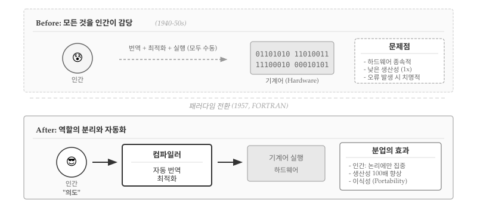
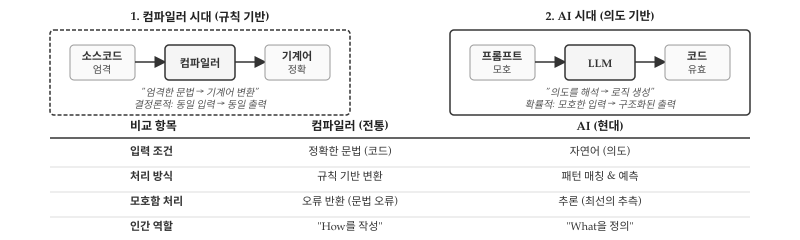
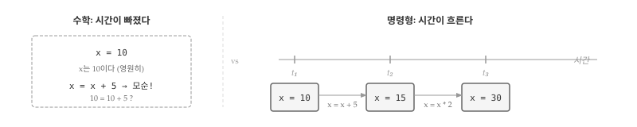
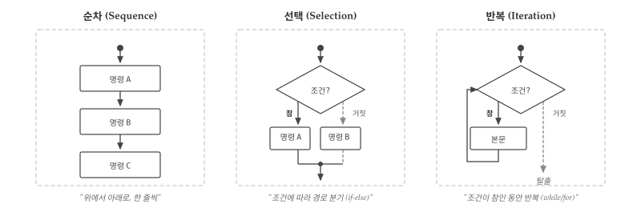
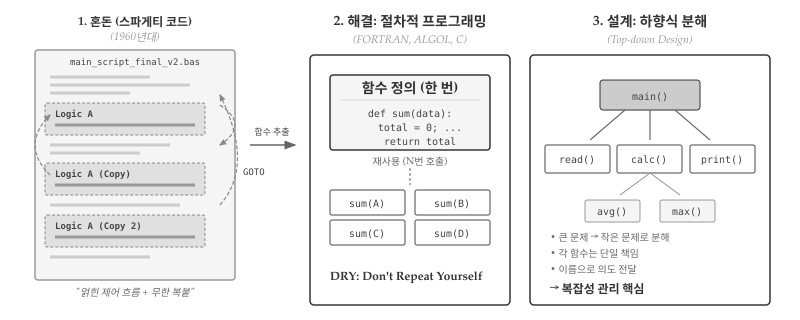
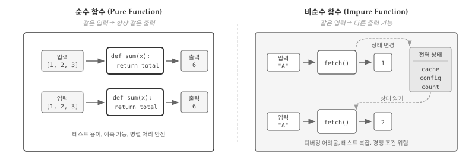
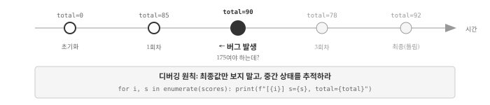
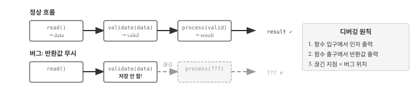

# 명령형과 절차적 프로그래밍 {#sec-imperative}

\index{명령형 프로그래밍} \index{절차적 프로그래밍}

명령형 프로그래밍(Imperative Programming)은 가장 오래되고 직관적인 패러다임이다.
컴퓨터에게 **어떻게(How)** 작업을 수행할지 단계별로 지시하는 방식이다.
절차적 프로그래밍(Procedural Programming)은 명령형의 확장으로, 반복되는 코드를 프로시저(함수)로 묶어 구조화한다.

두 패러다임은 밀접하게 연결되어 있어 함께 다룬다.
명령형이 **무엇을 하라**의 기본 단위라면, 절차적은 **어떻게 조직할 것인가**의 구조화 방법이다.

## 컴파일러: 역할 분리 시작 {#sec-imperative-compiler}

\index{컴파일러} \index{역할 분리}

명령형 프로그래밍이 등장하기 전, 프로그래머는 기계어를 직접 작성했다.
0과 1의 나열, 또는 어셈블리 명령어를 한 줄씩 타이핑하며 CPU가 이해하는 언어로 말해야 했다.
생산성은 처참했다—월 수십 줄의 코드, 1비트 오류로 전체 프로그램 실패, 기계가 바뀌면 처음부터 재작성.

{#fig-compiler-division}

@fig-compiler-division 에서 보듯이, 1957년 FORTRAN 컴파일러가 등장하면서 패러다임이 바뀌었다.
프로그래머는 더 이상 기계어를 직접 쓰지 않아도 됐다.
`x = x + 1`처럼 인간의 의도에 가까운 문장을 작성하면, 컴파일러가 기계어로 번역해줬다.
**역할 분리**가 시작된 것이다.

- **인간**: "무엇(What)"을 원하는지 표현
- **컴파일러**: "어떻게(How)" 기계어로 변환할지 결정
- **기계**: 변환된 명령어를 실행

컴파일러와 프로그래머의 분업이 생산성을 폭발시켰다.
프로그래머는 레지스터 번호나 메모리 주소 대신 변수 이름으로 사고할 수 있게 됐다.
같은 코드를 여러 기계에서 실행할 수 있게 됐고, 오타나 타입 오류를 컴파일러가 잡아줬다.
명령형 프로그래밍은 **컴파일러가 번역해주는 고급 언어**의 등장과 함께 태어났다.

::: {.callout-note}
### 문법에서 의미로: 추상화의 도약

1957년 컴파일러는 인간에게 **문법(Syntax)**을 요구했다.
한 글자라도 틀리면 거부—규칙은 절대적이고, 출력은 결정론적이었다.

{#fig-ai-analogy}

2020년대 AI는 **의미(Semantics)**를 이해한다.
@fig-ai-analogy 에서 보듯이 "대략 이런 느낌"이라는 모호한 입력도 받아들이고, 맥락을 파악해 여러 해결책을 제시한다.
컴파일러가 절대 못 했던 것—**"왜 이렇게 짰나요?"**라는 질문에 답하고, 코드를 리뷰하고, 개선안까지 제안한다.

- **공통점**: 인간은 "무엇을" 말하고, 도구가 "어떻게"를 처리한다.
- **차이점**: 추상화의 경계가 문법에서 의미로 한 단계 올라갔다.
:::

## 명령형 프로그래밍 핵심 {#sec-imperative-state}

\index{상태} \index{변수} \index{시간}

명령형 프로그래밍을 이해하려면 수학과 프로그래밍에서 "="의 의미 차이부터 시작해야 한다.

수학에서 `x = 10`은 "x는 10과 같다"는 **정의**다.
한번 정의되면 x는 영원히 10이고, `x = x + 5`라는 식은 10 = 15를 의미하므로 **모순**이다.
그러나 프로그래밍에서 `x = 10`은 "x에 10을 넣어라"는 **명령**이다.
`x = x + 5`는 "현재 x에 5를 더한 값을 다시 x에 넣어라"는 뜻이고, 완벽히 유효한 문장이다.

차이의 핵심은 **시간**이다.
수학에서 x는 시간과 무관한 상수지만, 명령형 프로그래밍에서 x는 시간에 따라 변하는 **상태(State)**다.
t₁ 시점에서 x는 10이고, t₂ 시점에서 15이며, t₃ 시점에서 30이 된다.
변수는 "이름이 붙은 시간 함수"이고, 할당문은 그 함수의 값을 갱신하는 수단이다.

{#fig-imperative-overview}

```{python}
#| label: imperative-state
# 명령형의 핵심: 같은 변수, 다른 시점, 다른 값
x = 10        # t₁: x는 10
print(f"t₁ → x = {x}")

x = x + 5     # t₂: x는 15 (이전 값 10 + 5)
print(f"t₂ → x = {x}")

x = x * 2     # t₃: x는 30 (이전 값 15 × 2)
print(f"t₃ → x = {x}")
```

@fig-imperative-overview 에서 보듯이, 명령형의 본질은 **상태 전이(State Transition)**다.
각 명령문은 현재 상태를 입력받아 다음 상태를 출력하는 함수처럼 동작한다.
프로그램 전체는 이런 상태 전이의 연쇄다.

명령형 프로그래밍의 버그 대부분은 **시점을 놓치는 것**에서 비롯된다.
"지금 x가 뭐지?"라는 질문에 "10"이라고 답했는데 실제로는 이미 15로 바뀌어 있었다면?
상태 추적 실패가 곧 버그다.
디버깅 장에서 상태 추적 기법을 자세히 다룬다.

## 순차 실행과 제어 흐름 {#sec-imperative-control}

\index{순차 실행} \index{제어 흐름} \index{뵘-야코피니 정리}

상태가 명령형의 **재료**라면, 제어 흐름은 **조리법**이다.
어떤 순서로 명령을 실행하고, 언제 분기하며, 무엇을 반복할지 결정하는 것이 제어 흐름(Control Flow)이다.

1966년 뵘(Böhm)과 야코피니(Jacopini)는 컴퓨터 과학 역사상 가장 우아한 정리 중 하나를 증명했다 [@Bohm1966].
**순차, 선택, 반복**—단 세 가지 구조만으로 모든 계산 가능한 알고리즘을 표현할 수 있다.
어떤 복잡한 프로그램도, 어떤 정교한 인공지능도, 결국 순차·선택·반복 블록의 조합이다.

{#fig-control-flow}

@fig-control-flow 구조적 프로그램 정리가 혁명적이었던 이유는 `goto`의 추방 때문이다.
1960년대 코드는 `goto`로 점철되어 있었다—"37번 줄로 가라", "조건이 참이면 158번 줄로 점프하라".
코드를 읽으려면 줄 번호를 따라 미로를 헤매야 했고, 유지보수는 악몽이었다.
뵘-야코피니 정리는 수학적으로 증명했다: `goto` 없이도 **모든 것**을 표현할 수 있다.
2년 후 다익스트라(Dijkstra)의 "Go To Statement Considered Harmful" [@Dijkstra1968]이 방아쇠를 당기면서 구조적 프로그래밍 운동이 시작되었다.

세 구조의 본질은 단순하다.
**순차**는 위에서 아래로 한 줄씩—요리 레시피처럼 순서대로 실행한다.
**선택**은 갈림길에서 조건에 따라 경로를 고른다—"점수가 60 이상이면 합격, 아니면 불합격".
**반복**은 조건이 참인 동안 같은 작업을 되풀이한다—1부터 100까지 더하기를 100줄이 아닌 3줄로.

```{python}
#| label: control-three-structures
# 세 구조의 조합: 성적 처리
scores = [85, 92, 78, 65, 90]
total, passed = 0, 0

for s in scores:           # 반복: 각 점수에 대해
    total += s
    if s >= 70:            # 선택: 70점 이상이면
        passed += 1

avg = total / len(scores)  # 순차: 평균 계산
print(f"평균 {avg:.1f}점, 합격 {passed}명")
```

제어 흐름의 핵심 통찰은 **실행 경로(Execution Path)**다.
같은 프로그램이라도 입력에 따라 완전히 다른 경로를 탄다.
`scores`에 90점짜리가 하나 더 들어오면 `passed`가 하나 늘어나고, 60점짜리가 들어오면 `if` 블록을 건너뛴다.
**프로그램을 이해한다는 것은 가능한 모든 경로를 파악하는 것**이다.
테스트가 모든 분기를 최소 한 번씩 실행해보는 것—분기 커버리지(Branch Coverage)—을 목표로 하는 이유도 여기에 있다.

## 절차적 프로그래밍 {#sec-imperative-procedural}

\index{프로시저} \index{서브루틴} \index{소프트웨어 위기}

1960년대 후반, 소프트웨어 산업은 심각한 위기에 직면했다. 프로그램 규모가 커지면서 동일한 로직이 수십, 수백 군데에 복사되었고, 단 한 줄을 수정하려면 프로그램 전체를 뒤져야 했다. 1968년 NATO 소프트웨어 공학 회의에서 공식화된 "소프트웨어 위기(Software Crisis)"의 한 원인이 바로 **코드 중복**이었다 [@NATO1968].

**절차적 프로그래밍**은 반복되는 코드를 함수(function) 또는 프로시저(procedure)라는 이름 붙은 블록으로 추출하여 위기에 대응했다. 한 번 정의하고 여러 번 호출한다는 단순한 원칙이 혁명적 결과를 낳았다. FORTRAN(1957), ALGOL(1960), C(1972)가 함수 추상화를 체계화한 대표 언어다.

{#fig-imperative-procedural}

```{python}
#| label: imperative-procedural
# 절차적 프로그래밍: 함수로 로직 추상화
def average(data):
    """리스트의 평균을 계산한다"""
    total = 0
    for x in data:
        total += x
    return total / len(data)

# 한 번 정의, 여러 번 사용
print(f"반 A 평균: {average([85, 90, 78]):.1f}")
print(f"반 B 평균: {average([92, 88, 76, 95]):.1f}")
print(f"반 C 평균: {average([70, 65, 80, 75, 85]):.1f}")
```

`average()` 함수는 "어떻게 평균을 구하는가"라는 세부 구현을 캡슐화한다. 호출하는 쪽은 "무엇을 원하는가"만 표현하면 된다. 로직 변경이 필요하면 함수 정의 한 곳만 수정하면 되고, 모든 호출 지점에 변경이 자동 반영된다. **DRY(Don't Repeat Yourself)** 원칙의 기원이다.^[DRY 원칙은 1999년 앤디 헌트(Andy Hunt)와 데이브 토머스(Dave Thomas)가 『실용주의 프로그래머(The Pragmatic Programmer)』[@Hunt2019Pragmatic]에서 명명했다. 핵심 주장은 "모든 지식은 시스템 내에서 단일하고, 명확하며, 권위 있는 표현을 가져야 한다"는 것이다. 코드 중복이 위험한 이유는 변경 시 여러 곳을 수정해야 하고, 하나라도 누락하면 버그가 발생하기 때문이다. 함수 추출은 중복 제거의 가장 기본적인 수단이다.]

### 하향식 설계 {#sec-imperative-topdown}

\index{하향식 설계} \index{Top-down Design}

절차적 프로그래밍과 함께 등장한 설계 방법론이 **하향식 설계(Top-down Design)**다. 복잡한 문제를 먼저 큰 덩어리로 나누고, 각 덩어리를 다시 작은 문제로 분해하며, 최종적으로 각 조각을 함수로 구현한다. @fig-imperative-procedural 오른쪽 패널이 하향식 구조를 보여준다.

하향식 설계가 없던 시절 프로그래머는 모든 로직을 하나의 긴 코드 블록에 순서대로 작성했다. 성적 처리 프로그램이라면 입력 검증, 평균 계산, 최댓값 탐색, 결과 출력이 뒤섞여 수백 줄이 한 덩어리가 되었다. 어디서 무엇을 하는지 파악하려면 전체를 읽어야 했고, 한 부분을 수정하면 예상치 못한 곳에서 오류가 발생했다.

```{python}
#| label: imperative-topdown
# 하향식 설계: 성적 처리 시스템
def validate(scores):
    """점수 유효성 검증"""
    return all(0 <= s <= 100 for s in scores)

def calculate_stats(scores):
    """통계 계산"""
    return sum(scores) / len(scores), max(scores)

def main():
    """전체 흐름 제어"""
    scores = [85, 90, 78, 92, 88]
    if validate(scores):
        avg, highest = calculate_stats(scores)
        print(f"평균: {avg:.1f}, 최고: {highest}")

main()
```

하향식 설계의 강점은 `main()` 함수만 읽어도 프로그램 전체 흐름이 한눈에 들어온다는 점이다. "점수를 검증하고, 통계를 계산하고, 출력한다"라는 의도가 함수 이름으로 드러난다. 검증 로직에 버그가 있다면 `validate()` 함수만 살펴보면 되고, 통계 계산 방식을 바꾸려면 `calculate_stats()` 함수만 수정하면 된다. 각 함수가 단일 책임을 가지므로 변경의 영향 범위가 명확해진다.

절차적 프로그래밍이 코드 중복 문제를 해결했지만, 새로운 질문이 생긴다. 함수들이 서로 데이터를 공유해야 할 때 어떻게 할 것인가? 앞선 예제에서 `validate()`와 `calculate_stats()`는 각각 `scores`를 매개변수로 받았다. 그런데 함수가 많아지고 공유해야 할 데이터가 늘어나면, 매번 매개변수로 전달하는 방식이 번거로워진다. 바로 여기서 **전역 변수**라는 유혹이 등장한다.

## 부작용과 전역 변수 {#sec-imperative-side-effect}

\index{부작용} \index{Side Effect} \index{전역 변수}

명령형 프로그래밍의 본질은 **상태 변경**이다. 변수에 값을 할당하고, 그 값을 읽어서 계산하고, 결과를 다시 저장한다. 함수가 자신의 반환값 외에 외부 상태를 변경하는 것을 **부작용(Side Effect)**이라 하는데, 명령형에서는 부작용이 자연스럽게 발생한다.

{#fig-side-effect}

@fig-side-effect 왼쪽의 순수 함수 `sum()`은 입력 `[1, 2, 3]`에 대해 항상 `6`을 반환한다. 첫 번째 호출이든 백 번째 호출이든, 아침에 실행하든 자정에 실행하든 결과는 동일하다. 함수 외부의 어떤 것도 읽지 않고, 어떤 것도 변경하지 않기 때문이다. 테스트가 단순해지고, 결과를 예측할 수 있으며, 여러 스레드에서 동시에 호출해도 안전하다.

오른쪽의 비순수 함수 `fetch()`는 상황이 다르다. 첫 번째 호출에서 입력 `"A"`에 대해 `1`을 반환하지만, 동시에 전역 상태(cache, config, count 등)를 변경한다. 두 번째 호출에서 **같은 입력** `"A"`를 넣었는데도 결과는 `2`다. 함수가 전역 상태를 읽어서 이전 호출 이력에 따라 다른 값을 반환하기 때문이다. 캐시에 저장된 값을 반환하거나, 호출 횟수를 카운트하거나, 설정 값에 따라 동작이 달라질 수 있다. 같은 코드를 실행해도 결과가 달라지니 디버깅이 어렵고, 테스트를 작성하려면 전역 상태를 매번 초기화해야 한다. 멀티스레드 환경에서는 경쟁 조건(Race Condition) 위험까지 더해진다.

### 원본이 바뀐다 {#sec-mutable-object}

\index{가변 객체} \index{참조 전달}

파이썬에서 리스트, 딕셔너리, 집합 같은 **가변 객체(Mutable Object)**를 함수에 전달하면 복사본이 아닌 **참조가 전달**된다. 함수 내부에서 해당 객체를 수정하면 호출자의 원본 데이터가 함께 변경된다. 의도한 동작이라면 문제없지만, 대부분의 경우 호출자는 자신의 데이터가 수정될 것이라 예상하지 않는다.

```{python}
#| label: imperative-side-effect-list
# 참조에 의한 전달: 원본 데이터 오염
def get_top_scores(scores, n=3):
    """상위 n개 점수를 반환한다"""
    scores.sort(reverse=True)        # 부작용: 원본을 내림차순 정렬
    return scores[:n]

original = [85, 92, 78, 90]
top3 = get_top_scores(original)
print(f"상위 3개: {top3}")
print(f"원본 데이터: {original}")  # [92, 90, 85, 78] - 순서가 바뀜!
```

`get_top_scores()`는 상위 점수만 반환하면 되는 단순한 함수처럼 보인다. 그러나 내부에서 `sort()`를 호출하면서 원본 리스트의 순서가 뒤바뀐다. 호출 직후에는 문제가 없어 보인다—상위 3개 점수도 정확히 반환된다. 그러나 수십 줄 뒤에서 `original`을 "입력 순서대로" 처리하려 할 때 버그가 터진다. 디버깅은 `original`을 사용하는 지점에서 시작하지만, 범인은 한참 전에 호출된 `get_top_scores()`에 숨어 있다.

해결책은 원본을 건드리지 않는 것이다. `sorted()` 함수는 원본을 수정하지 않고 **새로운 정렬된 리스트**를 반환한다.

```{python}
#| label: imperative-pure-list
# 원본 보존: sorted() 사용
def get_top_scores_safe(scores, n=3):
    """상위 n개 점수를 반환한다 (원본 보존)"""
    return sorted(scores, reverse=True)[:n]

original = [85, 92, 78, 90]
top3 = get_top_scores_safe(original)
print(f"상위 3개: {top3}")
print(f"원본 데이터: {original}")  # [85, 92, 78, 90] - 보존!
```

`list.sort()`와 `sorted()`의 차이를 모르면 버그를 만들기 쉽다. 비슷한 쌍으로 `list.reverse()`와 `reversed()`, `list.append()`와 `+ [item]`이 있다. 원본을 보존해야 하는 상황에서는 항상 **새 객체를 반환하는 함수**를 선택하라.

### 공유되는 기본값 {#sec-mutable-default}

\index{가변 기본 인자}

함수 매개변수에 기본값을 지정하면 호출 시 인자를 생략할 수 있어 편리하다. 그러나 기본값으로 **가변 객체**를 사용하면 예상치 못한 동작이 발생한다. Python 개발자라면 한 번쯤 겪는 함정이다.

```{python}
#| label: imperative-mutable-default
# 버그: 가변 객체를 기본값으로 사용
def add_item(item, items=[]):
    items.append(item)
    return items

print(add_item("사과"))
print(add_item("바나나"))
print(add_item("포도"))
```

첫 호출에서 `['사과']`가 나오는 건 예상대로다. 그런데 두 번째 호출에서 `['바나나']`가 아닌 `['사과', '바나나']`가 나온다. 세 번째는 `['사과', '바나나', '포도']`. 마치 함수가 이전 호출을 "기억"하는 것처럼 동작한다.

원인은 Python이 함수를 **정의할 때** 기본값을 평가한다는 점이다. `def add_item(item, items=[])` 문장이 실행되는 순간 빈 리스트 `[]`가 **딱 한 번** 생성되고, 이후 모든 호출이 그 리스트를 공유한다. 호출할 때마다 새 리스트가 만들어지는 게 아니다.

가변 기본값 버그가 까다로운 이유는 **한 번 테스트해서는 잡히지 않기** 때문이다. `add_item("사과")`를 호출하고 결과를 확인하면 `['사과']`가 나온다—완벽히 정상이다. 버그는 같은 함수를 **여러 번** 호출할 때만 드러난다. 단위 테스트(unit test)가 매번 새 프로세스를 띄우지 않는 한, 테스트 실행 순서에 따라 통과하기도 실패하기도 하는 불안정한(flaky) 테스트가 된다.

해결책은 `None`을 기본값으로 사용하고 함수 내부에서 새 객체를 생성하는 것이다. `None` 기본값 패턴은 Python 커뮤니티에서 **관용구(idiom)**로 자리 잡았다.

```{python}
#| label: imperative-mutable-fix
# 표준 패턴: None을 기본값으로
def add_item_fixed(item, items=None):
    if items is None:
        items = []               # 호출마다 새 리스트 생성
    items.append(item)
    return items

print(add_item_fixed("사과"))
print(add_item_fixed("바나나"))
```

`items=None`으로 선언하고 함수 본문에서 `if items is None: items = []`로 처리하면 매 호출마다 독립적인 리스트가 생성된다. 빈 딕셔너리 `{}`나 빈 집합 `set()`도 마찬가지다. 가변 객체를 기본값으로 직접 사용하지 마라.

::: {.callout-warning}
### 전역 변수의 위험성

전역 변수는 프로그램 어디서든 접근하고 수정할 수 있어 편리해 보인다. 그러나 규모가 커지면 어디서 값이 변경되었는지 추적하기 어려워진다. 함수 A가 전역 변수를 수정하고, 함수 B가 그 값에 의존한다면, A와 B 사이에 보이지 않는 결합(coupling)이 생긴다. 특히 멀티스레드 환경에서는 경쟁 조건(Race Condition)이 발생할 수 있다. 가능하면 전역 변수 대신 함수 매개변수와 반환값을 사용하라.
:::


## 커지면 무너진다 {#sec-imperative-limits}

\index{데이터와 함수 분리} \index{절차적 프로그래밍!한계}

절차적 프로그래밍은 작은 규모에서 잘 동작한다. 그러나 프로그램이 커지면 구조적 한계가 드러난다. 핵심 문제는 **데이터와 함수의 분리**다.

```{python}
#| label: imperative-limitation-small
# 학생 한 명: 문제없어 보인다
student1_name = "김철수"
student1_scores = [85, 90, 78]

def get_average(scores):
    return sum(scores) / len(scores)

def is_passing(scores, threshold=60):
    return get_average(scores) >= threshold

print(f"{student1_name}: 평균 {get_average(student1_scores):.1f}")
```

학생이 한 명일 때는 깔끔하다. 그런데 학생이 늘어나면?

```{python}
#| label: imperative-limitation-grow
# 학생 세 명: 변수가 폭발한다
student1_name = "김철수"
student1_scores = [85, 90, 78]
student1_grade = "2학년"

student2_name = "이영희"
student2_scores = [92, 88, 95]
student2_grade = "2학년"

student3_name = "박민수"
student3_scores = [78, 82, 80]
student3_grade = "3학년"

# 세 학생의 평균을 출력하려면?
for name, scores in [(student1_name, student1_scores),
                     (student2_name, student2_scores),
                     (student3_name, student3_scores)]:
    print(f"{name}: {get_average(scores):.1f}")
```

학생이 100명이면 `student1_name`부터 `student100_name`까지 300개의 변수가 필요하다. 더 심각한 문제는 **연결 관계**다. `student47_name`과 `student47_scores`가 같은 학생을 가리킨다는 보장이 어디에도 없다. 복사-붙여넣기 한 번 잘못하면 47번 학생 이름에 48번 점수가 붙는다.

```{python}
#| label: imperative-limitation-bug
# 흔한 실수: 잘못된 연결
student47_name = "정수진"
student47_scores = [88, 91, 85]

student48_name = "최동훈"
student48_scores = [75, 80, 78]  # 복사하다가...

# 어딘가에서 실수
result = f"{student47_name}: {get_average(student48_scores):.1f}"  # 버그!
print(result)  # 정수진 점수가 아닌 최동훈 점수
```

이름과 점수를 묶어 딕셔너리로 관리하면 나아 보인다. 그러나 속성이 늘어나면 딕셔너리도 복잡해진다. 학년, 연락처, 출석률, 과목별 점수... 키 이름을 일일이 기억해야 하고, 오타 하나에 `KeyError`가 터진다.

```{python}
#| label: imperative-limitation-dict
# 딕셔너리: 구조는 나아졌지만...
students = [
    {"name": "김철수", "scores": [85, 90, 78], "grade": "2학년"},
    {"name": "이영희", "scores": [92, 88, 95], "grade": "2학년"},
    {"name": "박민수", "scores": [78, 82, 80], "grade": "3학년"},
]

# 키 오타 한 번이면 끝
for s in students:
    avg = get_average(s["scores"])
    # print(s["Score"])  # KeyError: 'Score' - 대소문자 실수
    print(f"{s['name']}: {avg:.1f}")
```

절차적 패러다임의 근본 한계가 여기 있다. **데이터 구조**와 **해당 데이터를 다루는 함수**가 분리되어 있다. `get_average()`는 어떤 리스트든 받아들인다—학생 점수든, 기온 데이터든, 주가든. 유연해 보이지만, 학생 데이터에만 적용해야 하는 비즈니스 로직을 강제할 방법이 없다.

**객체지향 프로그래밍(OOP)**은 데이터와 함수를 하나로 묶어 분리 문제를 해결한다. 다음 장에서 같은 학생 관리 예제를 OOP로 다시 작성하면서 차이를 확인한다.


## 디버깅 {#sec-imperative-debugging}

\index{디버깅} \index{상태 추적}

명령형 프로그래밍에서 버그는 **상태 변화**에서 발생한다. 변수가 언제 어떤 값으로 바뀌었는지 추적하지 못하면 원인을 찾을 수 없다. @fig-imperative-debugging 은 전형적인 명령형 버그를 보여준다. 최종값 `92`만 보면 뭐가 잘못됐는지 알 수 없다. 중간 상태를 추적해야 2회차에서 `175`가 아닌 `90`이 된 걸 발견한다.

{#fig-imperative-debugging}

```{python}
#| label: debug-state-imperative
# 버그: += 대신 = 사용
scores = [85, 90, 78, 92]
total = 0

for i, s in enumerate(scores):
    total = s                              # 버그! 덮어쓰기
    print(f"[{i}] s={s}, total={total}")   # 상태 추적

print(f"최종: {total}")                    # 예상 345, 실제 92
```

`+=`와 `=`의 차이는 코드 한 글자지만 결과는 완전히 다르다. 반복문 안에서 변수가 어떻게 변하는지 `print()`로 출력하면 버그가 드러난다. 루프 경계 오류(off-by-one), 변수명 섀도잉도 같은 방식으로 찾는다—중간 상태를 찍어보면 된다.

### 절차적 버그: 데이터 흐름 {#sec-debug-procedural}

함수를 사용하면 버그 유형이 달라진다. @fig-procedural-debugging 처럼 함수는 **데이터 파이프라인**이다. 반환값을 저장하지 않으면 데이터가 사라진다. 호출 순서가 틀리면 잘못된 입력으로 처리한다. 버그를 찾으려면 **데이터가 어디서 끊겼는지** 추적하라.

{#fig-procedural-debugging}

```{python}
#| label: debug-procedural-flow
# 데이터 흐름 추적
def validate(data):
    print(f"  validate 입력: {data}")
    result = all(x >= 0 for x in data)
    print(f"  validate 반환: {result}")
    return result

def process(data):
    print(f"  process 입력: {data}")
    result = [x * 2 for x in data]
    print(f"  process 반환: {result}")
    return result

data = [-1, 2, 3]
print("1. validate 호출")
is_valid = validate(data)       # 반환값 저장!

print("2. process 호출")
if is_valid:
    output = process(data)      # 순서 확인!
    print(f"결과: {output}")
else:
    print("유효하지 않은 데이터")
```

함수 입구와 출구에서 값을 출력하면 데이터가 어디서 끊기는지 보인다. `validate(data)` 호출 후 반환값을 저장하지 않았다면? `is_valid`가 없으니 다음 단계로 넘어갈 수 없다. 호출 순서가 바뀌었다면? 검증 없이 처리가 먼저 실행되어 잘못된 결과가 나온다.

::: {.callout-tip}
### print 디버깅 팁

상태 추적용 `print()`에는 `[DEBUG]`, `>>>`, `###` 같은 접두사를 붙여라. 나중에 일괄 삭제하기 쉽다.  일명 "추적자 탄환(tracer bullets)"[@Hunt2019Pragmatic]이라 부르며, 코드가 예상대로 동작하는지 빠르게 확인하는 실용적 기법으로 권장한다.
:::


::: {.content-visible when-format="pdf"}
\faLightbulb\ 생각해볼 점
:::

::: {.content-visible when-format="html"}
## 💡 생각해볼 점 {.unnumbered}
:::

**컴퓨터는 본질적으로 명령형 기계다.** CPU는 메모리에서 값을 읽고, 연산하고, 다시 쓴다. 함수형이든 객체지향이든, 결국 기계어 수준에서는 상태 변경의 연속이다. 명령형 패러다임을 깊이 이해해야 다른 패러다임이 "무엇을 숨기고 있는지" 알 수 있다. 추상화의 이면을 모르면 성능 문제나 예상치 못한 버그 앞에서 무력해진다.

**"상태는 보이지 않는다."** 코드만 봐서는 프로그램의 현재 상태를 알 수 없다. 실행 이력(history)이 상태를 결정하기 때문이다. `total = 90`이라는 코드가 있다면, 여기에 도달하기까지 어떤 경로를 거쳤는지에 따라 버그 여부가 갈린다. 디버깅이 어려운 이유가 여기에 있다. 코드를 읽는 것이 아니라 **시간을 추적**해야 한다.

**절차적 프로그래밍이 적합한 영역은 분명히 존재한다.** 일회성 스크립트, 데이터 파이프라인, 빌드 자동화처럼 "순서대로 처리하면 끝"인 작업에서는 굳이 클래스를 만들 필요가 없다. 오히려 단순한 함수 조합이 더 읽기 쉽고 유지보수하기 쉽다. 모든 문제에 객체지향을 적용하려는 것은 망치를 든 사람이 모든 것을 못으로 보는 것과 같다.

**"부작용을 최소화하라"는 조언은 불완전하다.** 진짜 원칙은 **"부작용을 명시적으로 만들어라"**다. 함수 이름에 부작용을 드러내고(`update_`, `save_`, `modify_`), 부작용이 일어나는 지점을 코드 한 곳에 모아라. 부작용 자체가 악이 아니다. 어디서 일어나는지 모르는 것이 악이다.

\index{순수 함수}
\index{하향식 설계}
