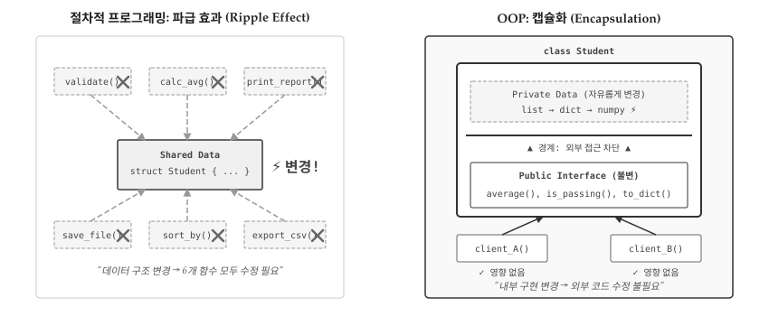
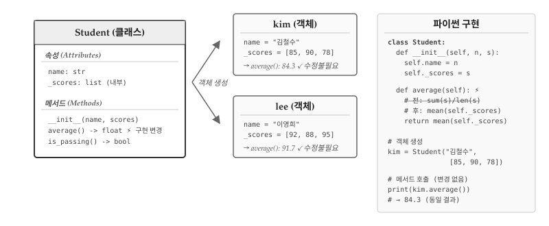
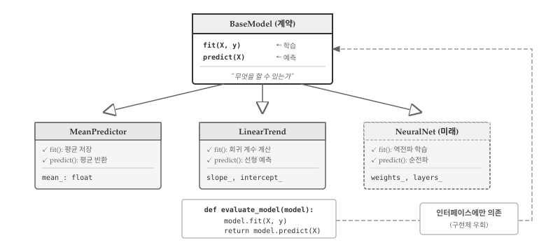
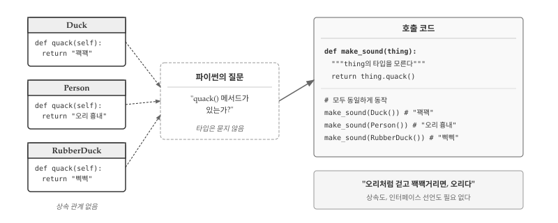
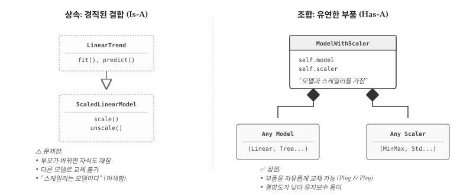
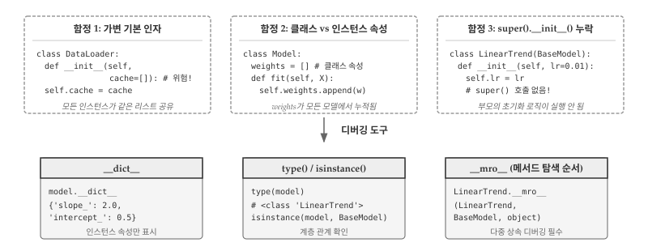

# 객체지향 프로그래밍 {#sec-oop}

\index{객체지향 프로그래밍} \index{OOP} \index{Object-Oriented Programming}

1960년대 후반, 소프트웨어 산업은 위기에 직면했다. 하드웨어 성능은 기하급수적으로 향상되었지만, 소프트웨어 개발은 그 속도를 따라가지 못했다. 프로젝트는 예산을 초과하고, 일정은 지연되며, 납품된 시스템은 버그투성이였다. 1968년 NATO 컨퍼런스에서 이 현상에 **소프트웨어 위기(Software Crisis)**라는 이름이 붙었다. 문제의 핵심은 명확했다: 절차적 프로그래밍으로는 **대규모 시스템의 복잡성**을 감당할 수 없었다.

앞 장에서 살펴본 학생 관리 예제가 바로 그 축소판이다. 학생 100명을 관리하려면 300개의 변수가 필요했고, `student47_name`과 `student47_scores`가 같은 학생을 가리킨다는 보장이 없었다. 함수를 추가할수록 어떤 함수가 어떤 데이터를 건드리는지 파악하기 어려워졌다. 한 곳을 수정하면 예상치 못한 곳에서 버그가 터졌다. 프로그램이 커질수록 복잡성은 선형이 아니라 기하급수적으로 증가했다.

{#fig-oop-overview}

객체지향 프로그래밍(OOP)은 **복잡성을 분할**하기 위해 탄생했다. 1967년 노르웨이에서 Ole-Johan Dahl과 Kristen Nygaard가 만든 Simula가 시초다. 항만 시뮬레이션을 개발하면서 배, 고객, 창고를 각각 **독립된 단위**로 묶었더니 시스템 전체를 한꺼번에 이해하지 않아도 됐다. 배의 동작을 수정해도 창고 코드는 건드릴 필요가 없었다. 복잡한 시스템을 **변경해도 영향 범위가 제한**되는 구조—바로 여기서 OOP의 핵심 가치가 드러난다.


## 변경의 지역화 {#sec-oop-localization}

\index{변경의 지역화} \index{캡슐화}

OOP의 진짜 목적은 코드 재사용이 아니다. 상속을 통한 재사용은 OOP의 부산물일 뿐, 핵심 가치는 **변경의 지역화(Localization of Change)**다. 잘 설계된 객체는 내부 구현이 바뀌어도 외부 인터페이스가 유지된다. 100군데에서 호출되는 코드를 수정할 때, 캡슐화가 잘 되어 있으면 한 곳만 고치면 된다.

앞 장의 학생 문제를 OOP로 해결해보자. 절차적 방식에서는 데이터(`scores`)와 함수(`get_average()`)가 분리되어 있었다. 평균 계산 방식을 바꾸려면 `get_average()` 함수를 찾아 수정해야 하는데, `get_average()`가 학생 점수 외에 다른 데이터에도 사용되고 있다면 영향 범위를 파악하기 어렵다.

```{python}
#| label: oop-student-class
class Student:
    """학생 데이터와 관련 연산을 하나로 묶는다"""
    def __init__(self, name, scores):
        self.name = name
        self._scores = scores  # 내부 구현: 리스트

    def average(self):
        return sum(self._scores) / len(self._scores)

    def is_passing(self, threshold=60):
        return self.average() >= threshold

# 데이터와 연산이 하나의 단위로 묶였다
kim = Student("김철수", [85, 90, 78])
lee = Student("이영희", [92, 88, 95])

print(f"{kim.name}: {kim.average():.1f}")
print(f"{lee.name}: {lee.average():.1f}, 합격: {lee.is_passing()}")
```

`_scores`에 언더스코어를 붙인 건 "내부 구현"이라는 신호다. 외부에서는 `average()`와 `is_passing()` 메서드만 사용하면 된다. 나중에 점수 저장 방식을 리스트에서 딕셔너리로 바꾸거나, 가중 평균으로 계산 로직을 변경해도 **외부 코드는 수정할 필요가 없다**. 변경이 `Student` 클래스 내부에 **지역화**된 것이다.

{#fig-oop-class}

@fig-oop-class 는 변경의 지역화가 실제로 어떻게 작동하는지 보여준다. `average()` 메서드의 내부 구현이 `sum(s)/len(s)`에서 `mean(self._scores)`로 바뀌었다고 가정하자. 클래스 정의에서 `average()` 메서드 한 곳만 수정하면 된다. `kim` 객체와 `lee` 객체는 여전히 `kim.average()`를 호출하고, 결과값 84.3과 91.7도 동일하게 반환된다. 외부 코드는 수정할 필요가 없다. 만약 `average()`를 100군데에서 호출하고 있었다면, 절차적 방식에서는 100군데를 일일이 확인해야 했겠지만, 캡슐화된 클래스에서는 한 곳만 고치면 된다. 이것이 OOP가 대규모 시스템에서 유지보수를 가능하게 만드는 핵심 원리다.

::: {.callout-note}
### self의 정체

\index{self}파이썬 초보자가 가장 혼란스러워하는 부분이 `self`다. 메서드 정의에는 `self`가 있는데, 호출할 때는 전달하지 않는다. 비밀은 파이썬이 자동으로 변환한다는 점에 있다. `kim.average()`를 호출하면 파이썬은 내부적으로 `Student.average(kim)`으로 바꾼다. `self`는 "호출한 객체 자신"을 가리키는 관례적 이름일 뿐, `this`나 `me`로 써도 동작한다. 다만 파이썬 커뮤니티의 강력한 관습이므로 `self`를 고수하라. 메서드는 일반 함수와 다르지 않다—단지 첫 번째 인자로 객체를 받도록 설계된 함수일 뿐이다.
:::


## 인터페이스: 계약으로 설계 {#sec-oop-interface}

\index{인터페이스} \index{계약}

앞 절에서 `average()` 메서드의 내부 구현을 바꿔도 외부 코드가 영향받지 않는다고 했다. 그런데 한 가지 전제가 있다. `average()`라는 **메서드 이름**, **매개변수**, **반환값 타입**이 그대로 유지되어야 한다. 만약 메서드 이름을 `calc_avg()`로 바꾸거나, 반환값을 `float`에서 `dict`로 바꾼다면? `kim.average()`를 호출하던 100군데 코드가 모두 깨진다. 변경의 지역화가 작동하려면 **안정된 인터페이스**가 전제 조건이다.

인터페이스는 "이 객체가 무엇을 할 수 있는가"를 정의하는 **계약(Contract)**이다. 계약은 구현 방법이 아니라 **약속**을 명시한다. "이 객체에 `average()`를 호출하면 `float`를 반환한다"는 약속이 계약이다. 내부에서 `sum()/len()`을 쓰든 `statistics.mean()`을 쓰든 `numpy.mean()`을 쓰든 상관없다. 계약만 지키면 외부 코드는 깨지지 않는다. 반대로 말하면, 인터페이스를 함부로 바꾸면 변경의 지역화가 무너진다. 인터페이스 설계에 시간을 투자해야 하는 이유다.

데이터 과학에서 가장 성공적인 인터페이스 사례가 scikit-learn의 `fit()`과 `predict()`다. 수백 개의 모델이 같은 계약을 따른다. `model.fit(X, y)`로 학습하고 `model.predict(X)`로 예측한다. 내부 알고리즘이 선형 회귀든, 결정 트리든, 신경망이든 사용법은 동일하다. 덕분에 모델을 교체해도 파이프라인 코드를 수정할 필요가 없다.

```{python}
#| label: oop-interface
class BaseModel:
    """모델 인터페이스 정의: fit()과 predict() 계약"""
    def __init__(self):
        self.is_fitted = False

    def fit(self, X, y):
        """학습 데이터로 모델을 훈련한다"""
        raise NotImplementedError("구현 필요")

    def predict(self, X):
        """새 데이터에 대해 예측한다"""
        if not self.is_fitted:
            raise RuntimeError("fit()을 먼저 호출하세요")
        return self._predict(X)

    def _predict(self, X):
        raise NotImplementedError("구현 필요")
```

`BaseModel`은 구체적인 알고리즘을 구현하지 않는다. 대신 "모든 모델은 `fit()`과 `predict()`를 가져야 한다"는 **계약**을 선언한다. 실제 구현은 자식 클래스가 담당한다.

```{python}
#| label: oop-implementations
class MeanPredictor(BaseModel):
    """가장 단순한 모델: 항상 평균값 예측"""
    def fit(self, X, y):
        self.mean_ = sum(y) / len(y)
        self.is_fitted = True
        return self

    def _predict(self, X):
        return [self.mean_] * len(X)


class LinearTrend(BaseModel):
    """단순 선형 추세 모델"""
    def fit(self, X, y):
        n = len(X)
        sum_x, sum_y = sum(X), sum(y)
        sum_xy = sum(x * yi for x, yi in zip(X, y))
        sum_xx = sum(x * x for x in X)

        self.slope_ = (n * sum_xy - sum_x * sum_y) / (n * sum_xx - sum_x ** 2)
        self.intercept_ = (sum_y - self.slope_ * sum_x) / n
        self.is_fitted = True
        return self

    def _predict(self, X):
        return [self.slope_ * x + self.intercept_ for x in X]
```

`MeanPredictor`는 단순히 평균을 반환하고, `LinearTrend`는 선형 회귀를 수행한다. 내부 구현은 완전히 다르지만 **인터페이스는 동일**하다. 두 모델을 실제로 사용해보자.

```{python}
#| label: oop-interface-usage
# 학습 데이터: x=시간, y=매출
X = [1, 2, 3, 4, 5]
y = [10, 22, 28, 41, 52]

# MeanPredictor: 평균만 예측
mean_model = MeanPredictor()
mean_model.fit(X, y)
print(f"MeanPredictor 예측: {mean_model.predict([6, 7])}")

# LinearTrend: 선형 추세 예측
linear_model = LinearTrend()
linear_model.fit(X, y)
print(f"LinearTrend 예측: {[f'{p:.1f}' for p in linear_model.predict([6, 7])]}")
```

두 모델 모두 `fit(X, y)`로 학습하고 `predict(X)`로 예측한다. 호출 방식이 동일하므로 모델을 교체해도 사용하는 쪽 코드는 수정할 필요가 없다.

{#fig-oop-inheritance}

@fig-oop-inheritance 는 계약으로서의 인터페이스가 어떻게 작동하는지 보여준다. 상단의 `BaseModel`이 계약이다. "이 객체는 `fit()`과 `predict()`를 제공한다"라는 약속만 정의하고, 구체적인 구현은 비워둔다. 하단의 `MeanPredictor`, `LinearTrend`, 그리고 미래에 추가될 `NeuralNet`은 각각 계약을 이행하는 구현체다. `MeanPredictor`는 평균을 저장하고, `LinearTrend`는 회귀 계수를 계산하며, `NeuralNet`은 역전파로 가중치를 학습한다. 내부 알고리즘은 완전히 다르지만, 외부에서 보면 모두 "학습하고 예측하는 객체"일 뿐이다.

핵심은 하단의 `evaluate()` 함수다. `model.fit(X, y); model.predict(X)`라는 두 줄만 작성하면 어떤 모델이든 동작한다. `MeanPredictor`를 전달하든 `LinearTrend`를 전달하든 `evaluate()` 코드는 수정할 필요가 없다. 내년에 `NeuralNet`을 추가해도 마찬가지다. 계약만 지키면 클라이언트 코드는 영향받지 않는다. 인터페이스가 **확장에는 열려 있고, 수정에는 닫혀 있는** 구조를 만드는 것이다.


## 다형성 {#sec-oop-polymorphism}

\index{다형성} \index{Polymorphism}

앞 절에서 인터페이스를 "계약"이라고 정의했다. 다형성(Polymorphism)은 그 계약의 **실행 시점 해석**이다. 컴파일 시점에는 `model.predict()`가 어떤 코드를 실행할지 결정되지 않는다. 런타임에 `model` 변수에 실제로 담긴 객체가 무엇인지에 따라 실행 경로가 달라진다. 인터페이스가 "무엇을 할 수 있는가"를 정의한다면, 다형성은 "**같은 호출이 상황에 따라 다르게 동작한다**"는 것을 보장한다.

```{python}
#| label: oop-polymorphism
# 학습 데이터
X_train = [1, 2, 3, 4, 5]
y_train = [2.1, 4.0, 5.9, 8.1, 10.0]
X_test = [6, 7, 8]

# 런타임에 어떤 모델인지 결정된다
models = [MeanPredictor(), LinearTrend()]

for model in models:
    model.fit(X_train, y_train)
    preds = model.predict(X_test)
    print(f"{model.__class__.__name__}: {[f'{p:.1f}' for p in preds]}")
```

동일한 `model.predict(X_test)` 호출이 첫 번째 반복에서는 평균값을 반환하고, 두 번째 반복에서는 선형 회귀 예측값을 반환한다. 코드를 작성할 때가 아니라 **실행할 때** 동작이 결정된다. 이 유연함이 플러그인 아키텍처, 전략 패턴, 의존성 주입의 기반이 된다. 설정 파일이나 사용자 입력에 따라 알고리즘을 동적으로 교체할 수 있다.

다형성이 주는 진짜 이점은 **조건 분기의 제거**다. 다형성 없이 여러 모델을 처리하려면 `if-elif-else` 사슬이 필요하다.

```python
# 다형성 없이: 타입마다 분기
def predict_without_polymorphism(model_type, X):
    if model_type == "mean":
        return [mean_value] * len(X)
    elif model_type == "linear":
        return [slope * x + intercept for x in X]
    elif model_type == "neural":
        return neural_forward(X)
    # 새 모델 추가 시 여기를 수정해야...
```

모델이 추가될 때마다 이 함수를 수정해야 한다. 반면 다형성을 사용하면 `model.predict(X)` 한 줄로 끝난다. 새 모델이 추가되어도 호출 코드는 건드리지 않는다. **열린-닫힌 원칙(Open-Closed Principle)**—확장에는 열려 있고, 수정에는 닫혀 있다—이 실현되는 방식이다.

\index{열린-닫힌 원칙} \index{Open-Closed Principle} \index{SOLID}

열린-닫힌 원칙은 1988년 버트란드 마이어(Bertrand Meyer)가 『객체지향 소프트웨어 구성』[@Meyer1988OOSC]에서 처음 명명했다. 이후 로버트 마틴(Robert C. Martin)이 『애자일 소프트웨어 개발』[@Martin2002Agile]에서 SOLID 원칙의 두 번째 글자 'O'로 정립하면서 널리 알려졌다. 핵심 통찰은 **기존 코드를 수정하지 않고도 시스템을 확장할 수 있어야 한다**는 것이다. 수정은 버그를 만들고, 테스트를 무효화하며, 의존하는 모든 코드에 파급된다. 반면 확장은 새 코드를 추가할 뿐 기존 코드를 건드리지 않는다.

OOP에서 열린-닫힌 원칙이 자연스럽게 구현되는 이유는 **다형성** 덕분이다. 인터페이스를 정의하고 구현체를 분리하면, 새 구현체를 추가해도 인터페이스를 사용하는 코드는 변경할 필요가 없다. `BaseModel`을 사용하는 수백 개의 함수가 있어도 `NeuralNet` 클래스를 추가하는 순간 모든 함수에서 동작한다. 기존 함수를 열어서 `elif model_type == "neural"`을 추가할 필요가 없다.

다른 패러다임에서도 유사한 개념이 존재한다. 함수형 프로그래밍에서는 **고차 함수(Higher-Order Function)**가 비슷한 역할을 한다. 동작을 함수로 전달받으면 기존 함수를 수정하지 않고 새 동작을 주입할 수 있다. 파이썬의 `sorted(data, key=fn)`가 예시다—정렬 알고리즘은 그대로 두고 `key` 함수만 바꿔서 정렬 기준을 확장한다. 절차적 프로그래밍에서는 함수 포인터나 콜백으로 유사하게 구현할 수 있지만, 언어 수준의 체계적인 지원이 부족하다. OOP는 클래스 계층, 인터페이스, 다형성이라는 일관된 메커니즘으로 열린-닫힌 원칙을 **설계 시점부터** 강제할 수 있다는 점에서 차별화된다.


### 덕 타이핑 {#sec-oop-duck-typing}

\index{덕 타이핑} \index{Duck Typing}

Java나 C++에서 다형성은 상속이나 인터페이스 구현을 통해서만 가능하다. 클래스 선언 시점에 "나는 `Predictable` 인터페이스를 구현한다"고 명시해야 한다. 파이썬은 다르다. **실행 시점에 메서드가 존재하는지**만 확인한다. 타입을 묻지 않는다.

```{python}
#| label: oop-duck-typing
# BaseModel을 상속하지 않는 완전히 독립된 클래스
class RandomGuess:
    """랜덤 예측기 - 상속 없음, 인터페이스 선언 없음"""
    def __init__(self, seed=42):
        import random
        self.rng = random.Random(seed)

    def fit(self, X, y):
        self.min_val, self.max_val = min(y), max(y)
        return self

    def predict(self, X):
        return [self.rng.uniform(self.min_val, self.max_val) for _ in X]

# 상속 관계 없이도 같은 방식으로 동작
random_model = RandomGuess()
random_model.fit(X_train, y_train)
preds = random_model.predict(X_test)
print(f"RandomGuess: {[f'{p:.1f}' for p in preds]}")
```

`RandomGuess`는 `BaseModel`과 아무런 관계가 없다. 상속도 없고, `BaseModel`을 import하지도 않는다. 그러나 `fit()`과 `predict()` 메서드를 가지므로 기존 코드와 함께 동작한다. 파이썬 인터프리터는 "이 객체가 `MeanPredictor`의 서브클래스인가?"라고 묻지 않는다. "이 객체에 `fit()` 메서드가 있는가?"만 확인한다.

{#fig-oop-duck-typing}

@fig-oop-duck-typing 는 덕 타이핑의 핵심을 보여준다. `Duck`, `Person`, `RubberDuck`은 상속 관계가 전혀 없는 독립된 클래스다. 공통 조상도 없고, 인터페이스 선언도 없다. 그러나 세 클래스 모두 `quack()` 메서드를 가지므로 `make_sound()` 함수에서 동일하게 동작한다. 파이썬의 질문은 단 하나다: "`quack()` 메서드가 있는가?" 타입은 묻지 않는다.

"오리처럼 걷고 오리처럼 꽥꽥거리면, 그것은 오리다"—덕 타이핑의 철학이다. 정적 타입 언어에서는 클래스 계층을 미리 설계해야 하지만, 파이썬에서는 사후에 호환되는 클래스를 추가할 수 있다. 외부 라이브러리의 클래스를 수정하지 않고도 기존 함수와 함께 사용할 수 있다.

물론 트레이드오프가 있다. 타입 검사가 없으므로 런타임에야 오류가 드러난다. `quack()` 대신 `quak()`이라고 오타를 내도 컴파일러가 잡아주지 않는다. 실행해봐야 `AttributeError`가 발생한다. 이런 위험을 줄이려면 **타입 힌트**와 `mypy` 같은 정적 분석 도구를 함께 사용하라. 또는 `hasattr(obj, 'quack')`로 메서드 존재 여부를 명시적으로 확인할 수도 있다.


## 조합: 상속보다 유연한 재사용 {#sec-oop-composition}

\index{조합} \index{Composition}

OOP 초보자는 코드 재사용을 위해 상속을 남용한다. 그러나 상속은 **강한 결합**을 만든다. 부모를 수정하면 모든 자식이 영향받는다. **조합(Composition)**은 더 유연한 대안이다: 객체를 상속하는 대신 **속성으로 포함**한다.

{#fig-oop-composition}

1994년 출간된 『디자인 패턴』[@GoF1994]에서 4인방(Gang of Four: 에리히 감마, 리처드 헬름, 랄프 존슨, 존 블리시디스)은 "**상속보다 조합을 선호하라(Favor composition over inheritance)**"는 원칙을 제시했다. 상속이 **컴파일 타임**에 관계를 고정하는 반면, 조합은 **런타임**에 부품을 교체할 수 있기 때문이다. 스케일러를 표준화(StandardScaler)에서 정규화(MinMaxScaler)로 바꾸고 싶다면, 상속 구조에서는 새 클래스를 만들어야 한다. 조합에서는 `self.scaler = MinMaxScaler()`로 한 줄만 수정하면 된다.

```{python}
#| label: oop-composition
class Scaler:
    """데이터 스케일링 담당"""
    def fit(self, data):
        self.min_ = min(data)
        self.max_ = max(data)
        return self

    def transform(self, data):
        rng = self.max_ - self.min_
        return [(x - self.min_) / rng if rng != 0 else 0 for x in data]


class ModelWithScaler:
    """스케일러를 '포함'하는 모델 (상속 아님)"""
    def __init__(self, model):
        self.model = model              # 조합: 모델을 속성으로
        self.scaler = Scaler()          # 조합: 스케일러를 속성으로

    def fit(self, X, y):
        X_scaled = self.scaler.fit(X).transform(X)
        self.model.fit(X_scaled, y)
        return self

    def predict(self, X):
        X_scaled = self.scaler.transform(X)
        return self.model.predict(X_scaled)

# 어떤 모델이든 스케일러와 조합 가능
scaled_model = ModelWithScaler(LinearTrend())
scaled_model.fit(X_train, y_train)
print(f"스케일링 적용: {[f'{p:.1f}' for p in scaled_model.predict(X_test)]}")
```

`ModelWithScaler`는 `LinearTrend`를 상속하지 않는다. 대신 `self.model`에 모델 객체를 **포함**한다. 장점은 명확하다: `MeanPredictor`, `RandomGuess`, 외부 라이브러리 모델까지 어떤 것이든 조합할 수 있다. 스케일러 구현을 바꿔도 모델은 영향받지 않고, 모델을 바꿔도 스케일러는 영향받지 않는다. 각 부품이 **독립적으로 변경 가능**하다.

조합의 핵심 메커니즘은 **위임(Delegation)**이다. \index{위임} `ModelWithScaler.fit()`은 직접 학습하지 않고 `self.model.fit()`에 작업을 **위임**한다. 자신이 모든 걸 구현하는 대신, 적합한 부품에 요청을 전달한다. 상속이 "나는 부모다"라면, 조합은 "나는 부품들을 조율한다"이다. 오케스트라 지휘자가 직접 악기를 연주하지 않듯, `ModelWithScaler`는 실제 계산을 부품에 맡기고 흐름만 조율한다.

조합은 **의존성 주입(Dependency Injection)**의 기반이기도 하다. \index{의존성 주입} `__init__(self, model)`에서 모델을 외부에서 주입받으므로, 테스트 시 실제 모델 대신 Mock 객체를 넣을 수 있다. 데이터베이스 연결, 외부 API 호출처럼 테스트하기 어려운 부품을 가짜로 대체하면 단위 테스트가 쉬워진다. 상속 구조에서는 부모 클래스를 통째로 모킹해야 하므로 테스트가 복잡해진다.

상속은 "is-a" 관계가 명확할 때만 사용하라. `LinearTrend`**는** `BaseModel`**이다**—자연스럽다. 그러나 `ModelWithScaler`**는** `LinearTrend`**이다**—어색하다. 어색한 상속은 조합으로 대체하라.

::: {.callout-warning}
### 상속 계층이 깊어지면 위험 신호

3단계 이상의 상속 계층(`A → B → C → D`)은 대부분 설계 문제를 암시한다. 자식 클래스가 부모의 일부 메서드만 필요하거나, 부모 클래스 변경이 예상치 못한 자식에 영향을 미친다면 상속 대신 조합을 고려하라. scikit-learn의 `Pipeline`이 대표적인 조합 사례다. `Pipeline([('scaler', StandardScaler()), ('model', LinearRegression())])`처럼 변환기와 모델을 상속 없이 **리스트로 조합**한다. 각 단계는 독립적이고, 순서를 바꾸거나 부품을 교체하기 쉽다.
:::


## 디버깅: OOP 특유의 함정 {#sec-oop-debug}

\index{디버깅!OOP}
\index{가변 기본 인자}
\index{클래스 속성}
\index{인스턴스 속성}

OOP 코드에서 자주 발생하는 버그는 세 가지 함정에서 비롯된다: **가변 기본 인자**, **클래스 속성 vs 인스턴스 속성 혼동**, **`super().__init__()` 누락**이다. @fig-oop-debugging 은 세 가지 함정과 디버깅 도구를 요약한다.

{#fig-oop-debugging}

첫 번째 함정은 **가변 기본 인자**다. 앞 장에서 함수의 기본 인자로 리스트나 딕셔너리를 사용하면 안 된다고 배웠다. 클래스 생성자에서도 동일한 문제가 발생한다. 데이터 로더를 만들 때 캐시를 기본값으로 빈 리스트를 지정하면 모든 인스턴스가 **같은 리스트를 공유**한다.

```{python}
#| label: oop-debug-mutable
# 위험: 가변 객체를 기본값으로
class DataLoader:
    def __init__(self, cache=[]):   # 버그!
        self.cache = cache

loader1 = DataLoader()
loader1.cache.append("train.csv")

loader2 = DataLoader()
loader2.cache.append("test.csv")

print(f"loader1.cache: {loader1.cache}")  # ['train.csv', 'test.csv']
print(f"loader2.cache: {loader2.cache}")  # 동일한 리스트!
```

해결책은 `None`을 기본값으로 사용하고 생성자 내부에서 새 리스트를 생성하는 것이다.

```{python}
#| label: oop-debug-mutable-fix
# 해결: None + 내부 생성
class DataLoader:
    def __init__(self, cache=None):
        self.cache = cache if cache is not None else []
```

두 번째 함정은 **클래스 속성과 인스턴스 속성의 혼동**이다. 파이썬에서 클래스 본문에 직접 정의한 변수는 클래스 속성이 되어 모든 인스턴스가 공유한다. 반면 `__init__` 안에서 `self.변수`로 정의하면 인스턴스 속성이 되어 각 객체가 독립적으로 소유한다. 모델의 가중치를 클래스 수준에서 정의하면 **모든 모델 인스턴스가 가중치를 공유**하는 심각한 버그가 발생한다.

```{python}
#| label: oop-debug-classattr
# 위험: 클래스 속성으로 가변 객체 정의
class BuggyModel:
    weights = []  # 클래스 속성 - 모든 인스턴스가 공유

    def fit(self, X, y):
        self.weights.append(sum(y) / len(y))  # 누적됨!

model1 = BuggyModel()
model1.fit([1, 2], [10, 20])

model2 = BuggyModel()
model2.fit([3, 4], [30, 40])

print(f"model1.weights: {model1.weights}")  # [15.0, 35.0] - 두 모델이 공유!
print(f"model2.weights: {model2.weights}")  # 동일
```

`__init__`에서 인스턴스 속성으로 정의해야 각 모델이 독립적인 가중치를 갖는다.

```{python}
#| label: oop-debug-classattr-fix
# 해결: 인스턴스 속성으로 정의
class CorrectModel:
    def __init__(self):
        self.weights = []  # 인스턴스 속성 - 각자 소유

    def fit(self, X, y):
        self.weights.append(sum(y) / len(y))
```

세 번째 함정은 **`super().__init__()` 호출 누락**이다. \index{super()!\_\_init\_\_()} 상속받은 자식 클래스에서 `__init__`을 오버라이드할 때, 부모의 초기화 로직을 명시적으로 호출해야 한다. 이를 잊으면 부모 클래스가 설정해야 할 속성이 생성되지 않아 `AttributeError`가 발생한다. 특히 다중 상속에서는 `super()`가 MRO(메서드 탐색 순서)를 따라 올바른 부모를 호출하므로 반드시 사용해야 한다.

```{python}
#| label: oop-debug-super
# 위험: 부모 초기화 누락
class BaseModel:
    def __init__(self):
        self.fitted_ = False   # 학습 여부 플래그

class LinearTrendBuggy(BaseModel):
    def __init__(self, learning_rate=0.01):
        # super().__init__() 호출 누락!
        self.lr = learning_rate

model = LinearTrendBuggy()
# print(model.fitted_)  # AttributeError: 'LinearTrendBuggy' object has no attribute 'fitted_'
print("fitted_ 속성 존재?", hasattr(model, 'fitted_'))  # False
```

`super().__init__()`을 명시적으로 호출해야 부모의 `fitted_` 속성이 초기화된다.

::: {.callout-tip}
### 디버깅 도구 세 가지

\index{\_\_dict\_\_}
\index{\_\_mro\_\_}
\index{isinstance()}

객체 상태를 확인하는 세 가지 도구를 기억하라.

```{python}
#| label: oop-debug-tools
model = LinearTrend()
model.fit([1, 2, 3], [2, 4, 6])

# 1. __dict__: 인스턴스 속성 확인
print("인스턴스 속성:", model.__dict__)

# 2. type() / isinstance(): 타입 확인
print("타입:", type(model).__name__)
print("BaseModel 상속?", isinstance(model, BaseModel))

# 3. __mro__: 메서드 탐색 순서 (다중 상속 디버깅)
print("MRO:", [c.__name__ for c in LinearTrend.__mro__])
```

`__mro__`(Method Resolution Order)는 다중 상속에서 메서드가 어떤 순서로 탐색되는지 보여준다. 다중 상속을 사용하면 `super()`가 직관과 다르게 동작할 수 있다. `super()`는 "부모 클래스"가 아니라 **MRO의 다음 클래스**를 호출하기 때문이다. \index{다이아몬드 상속} 특히 두 부모가 공통 조상을 갖는 다이아몬드 상속 구조에서는 공통 조상의 `__init__`이 두 번 호출될 위험이 있다. 파이썬은 C3 선형화 알고리즘으로 MRO를 계산해 각 클래스가 정확히 한 번만 호출되도록 보장하지만, 예상치 못한 동작이 발생하면 `__mro__`부터 출력해보라.
:::


::: {.content-visible when-format="pdf"}
\faLightbulb\ 생각해볼 점
:::

::: {.content-visible when-format="html"}
## 💡 생각해볼 점 {.unnumbered}
:::

**OOP의 본질은 "변경의 지역화"다.** 1960년대 소프트웨어 위기의 핵심은 수정의 파급 효과였다. 한 줄을 고치면 어디서 버그가 터질지 예측할 수 없었다. OOP는 **캡슐화**로 내부 구현을 숨기고, **인터페이스**로 외부와의 계약을 명시함으로써 변경의 영향 범위를 객체 내부로 한정한다. `Student` 클래스 내부에서 성적을 리스트에서 딕셔너리로 바꿔도 `average()` 메서드 시그니처만 유지하면 외부 코드는 수정할 필요가 없다. 대규모 시스템에서 이 특성이 없으면 유지보수가 사실상 불가능하다.

**다형성은 조건문의 적이다.** `if model_type == "linear": ... elif model_type == "neural": ...` 같은 분기는 새 모델이 추가될 때마다 수정이 필요하다. 다형성은 `model.predict()`라는 단일 호출로 런타임에 적절한 메서드가 실행되도록 보장한다. 열린-닫힌 원칙(OCP)이 실현되는 방식이다—기존 코드를 **수정**하지 않고 새 클래스를 **확장**만 하면 된다. 조건 분기가 늘어나는 코드를 발견하면 다형성으로 리팩토링할 수 있는지 검토하라.

**상속보다 조합을 먼저 고려하라.** 1994년 GoF의 『디자인 패턴』이 강조한 원칙이다. 상속은 컴파일 타임에 관계를 고정하지만, 조합은 런타임에 부품을 교체할 수 있다. `ModelWithScaler`가 `LinearTrend`를 상속하는 대신 `self.model`로 포함하면, 어떤 모델이든 끼워 넣을 수 있다. 핵심 메커니즘은 **위임**이다—자신이 모든 걸 구현하는 대신 적합한 부품에 요청을 전달한다. 상속 계층이 3단계를 넘어가면 설계를 재검토하라.

**파이썬의 덕 타이핑은 유연함과 위험을 동시에 준다.** "오리처럼 걷고 꽥꽥거리면 오리다"—Java처럼 인터페이스를 명시적으로 선언하지 않아도 `fit()`과 `predict()` 메서드만 있으면 어떤 객체든 모델로 사용할 수 있다. 외부 라이브러리 클래스를 수정 없이 기존 함수와 함께 사용할 수 있는 강력함이다. 그러나 `quack()` 대신 `quak()`이라고 오타를 내도 실행 전까지 오류가 드러나지 않는다. 타입 힌트와 `mypy`로 정적 분석을 병행하면 두 세계의 장점을 취할 수 있다.

**OOP 디버깅의 핵심은 객체 상태를 눈으로 확인하는 것이다.** `print(model.__dict__)` 한 줄이 1시간의 디버깅을 줄여준다. 가변 기본 인자, 클래스 속성과 인스턴스 속성 혼동, `super().__init__()` 누락—세 가지 함정은 모두 **객체 상태가 예상과 다를 때** 발생한다. `__dict__`로 인스턴스 속성을, `type()`과 `isinstance()`로 타입을, `__mro__`로 메서드 탐색 순서를 확인하라. 다중 상속에서 다이아몬드 문제가 의심되면 MRO부터 출력하라.

\index{캡슐화}
\index{상속}
\index{다형성}
\index{조합}
\index{인터페이스}
\index{소프트웨어 위기}
\index{열린-닫힌 원칙}
\index{덕 타이핑}
\index{위임}
