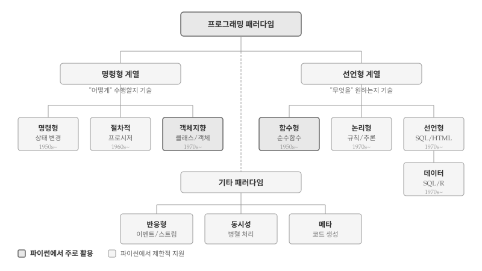
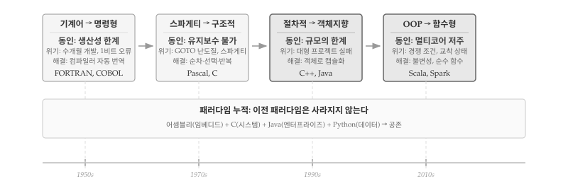
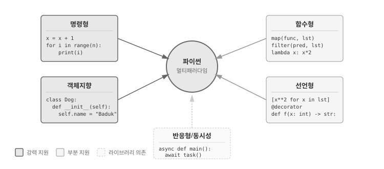

# 패러다임의 이해 {#sec-paradigm}

\index{프로그래밍 패러다임} \index{패러다임}

프로그래밍 언어는 단순히 문법의 집합이 아니다.
각 언어는 특정한 **사고방식**을 반영하며, 문제를 바라보고 해결하는 고유한 관점을 제공한다.
프로그래밍 패러다임(Programming Paradigm)은 프로그램을 구성하고 문제를 해결하는 근본적인 접근 방식을 의미한다.

패러다임이라는 용어는 토마스 쿤(Thomas Kuhn)의 과학철학에서 유래했다 [@Kuhn1962].
쿤은 과학이 점진적으로 발전하는 것이 아니라 패러다임 전환을 통해 혁명적으로 변화한다고 주장했다.
프로그래밍에서도 마찬가지다.
1950년대 기계어 프로그래밍, 1960년대 구조적 프로그래밍, 1980년대 객체지향 프로그래밍, 2010년대 함수형 프로그래밍 부활은 각각 소프트웨어 개발 방식을 근본적으로 바꾸었다.

{#fig-paradigm-overview}

## 패러다임의 진화 {#sec-paradigm-evolution}

\index{패러다임 진화} \index{소프트웨어 위기}

프로그래밍 패러다임은 소프트웨어가 직면한 **위기**를 해결하기 위해 등장했다.
각 패러다임은 선행 방식의 한계를 극복하고자 탄생했으며, 새로운 패러다임이 등장해도 기존 패러다임이 사라지지는 않는다.
오히려 특정 영역에서 여전히 강점을 발휘하거나, 새 패러다임에 흡수되어 공존한다.

{#fig-paradigm-evolution}

### 기계어 &rarr; 명령형 (1950년대) {#sec-paradigm-evo-imperative}

\index{기계어} \index{어셈블리}

명령형 언어의 등장을 이끈 동인은 **생산성의 절대적 한계**였다.
기계어 프로그래밍은 극도로 어렵고 느렸다.
메모리 주소를 16진수로 직접 계산하고, 프로세서 레지스터를 수동으로 관리해야 했다.
프로그램 하나를 완성하는 데 수개월이 걸렸고, 주소 1비트 오류 같은 작은 실수가 전체 시스템을 멈추게 했다.
게다가 하드웨어 종류마다 완전히 다른 코드를 작성해야 했다.
컴파일러 등장이 해결책이었다.
인간이 읽을 수 있는 언어를 기계어로 자동 번역함으로써, 프로그래머가 하드웨어 세부사항에서 해방되었다.

초기 컴퓨터는 0과 1로 이루어진 기계어로 프로그래밍했다.
메모리 주소를 직접 계산하고, 프로세서 레지스터를 수동으로 관리해야 했다.
프로그램 작성에 수개월이 걸렸고, 작은 실수 하나가 전체 시스템을 멈추게 했다.

**FORTRAN**(1957)과 **COBOL**(1959)의 등장은 혁명이었다.
인간이 읽을 수 있는 명령어로 프로그램을 작성하면 컴파일러가 기계어로 번역했다.
`A = B + C`처럼 수학 공식에 가까운 표현이 가능해졌다.
생산성이 10배 이상 향상되었고, 프로그래머가 하드웨어 세부사항에서 해방되었다.

**기계어 프로그래밍은 사라졌는가?**
아니다.
임베디드 시스템, 디바이스 드라이버, 성능이 극도로 중요한 영역에서 어셈블리는 여전히 사용된다.
다만 대부분의 개발자에게 기계어는 더 이상 일상적인 도구가 아니게 되었다.

### 스파게티 &rarr; 구조적 프로그래밍 (1960~70년대) {#sec-paradigm-evo-structured}

\index{스파게티 코드} \index{구조적 프로그래밍} \index{GOTO}

구조적 프로그래밍 등장을 이끈 동인은 **유지보수 불가능성**이었다.
`GOTO` 문이 프로그램 흐름을 난도질했다.
한 줄을 읽으면 10줄 앞으로 점프하고, 다시 20줄 뒤로 돌아가는 "스파게티 코드"가 만연했다.
작성한 지 한 달만 지나도 본인조차 코드를 이해할 수 없었다.
버그 수정이 새 버그를 낳고, 코드 변경 비용이 신규 개발보다 커지는 악순환이 이어졌다.
1968년 NATO 소프트웨어 공학 컨퍼런스에서 "소프트웨어 위기"가 공식 선언될 정도였다.
다익스트라 "GOTO Considered Harmful"(1968)이 해결의 실마리를 제시했다.
순차·선택·반복 세 구조만으로 모든 알고리즘을 표현할 수 있음을 증명하면서, 코드가 위에서 아래로 자연스럽게 흐르도록 만들었다.

명령형 언어가 보급되면서 새로운 문제가 등장했다.
`GOTO` 문으로 프로그램의 흐름이 뒤엉켜 **스파게티 코드**가 만연했다.
수천 줄의 코드에서 버그를 찾기란 마치 미로에서 출구를 찾는 것과 같았다.
1968년 에츠허르 다익스트라(Edsger Dijkstra)는 "Go To Statement Considered Harmful"이라는 논문으로 `GOTO`의 해악을 지적했다 [@Dijkstra1968].

**구조적 프로그래밍**은 `GOTO` 없이 프로그램을 작성할 수 있음을 보였다.
순차(sequence), 선택(if-else), 반복(loop) 세 가지 제어 구조만으로 모든 알고리즘을 표현할 수 있다.
**Pascal**(1970)과 **C**(1972)가 구조적 프로그래밍을 구현한 대표적 언어다.
코드가 블록 단위로 정리되고, 프로시저(함수)로 모듈화되면서 유지보수가 훨씬 수월해졌다.

**GOTO는 완전히 사라졌는가?**
대부분의 현대 언어는 `GOTO`를 지원하지 않거나 사용을 강력히 권장하지 않는다.
하지만 C와 같은 저수준 언어에서는 에러 처리나 중첩 루프 탈출에 제한적으로 사용되기도 한다.

### 복잡성을 객체로 (1980~90년대) {#sec-paradigm-evo-oop}

\index{소프트웨어 위기} \index{객체지향}

객체지향 프로그래밍의 등장을 이끈 동인은 **규모의 한계**였다.
절차적 프로그래밍에서 데이터(`struct`)와 함수는 분리되어 있었다.
"특정 함수가 어떤 데이터를 다루는가?"를 코드에서 파악하기 어려웠고, 수백 개의 함수와 전역 변수가 뒤섞이면서 변경의 파급 효과를 추적하기 불가능해졌다.
1970년대 후반, 대형 프로젝트가 줄줄이 실패했다.
예산 초과, 일정 지연, 버그 투성이 소프트웨어.
IBM OS/360 프로젝트는 수천 명을 투입하고도 수년간 지연되었고, 프레드 브룩스(Fred Brooks)는 이러한 경험을 『맨먼스 미신』에 기록했다 [@Brooks1975].
해결책은 데이터와 해당 데이터를 다루는 함수를 "객체"라는 하나의 단위로 묶는 것이었다.
`student.calculate_average()`처럼 "누구의 무엇"이 코드에 드러나고, 캡슐화로 내부 구현을 숨기며, 상속으로 코드를 재사용한다.

1970년대 후반, **소프트웨어 위기**가 본격화되었다.
프로젝트는 예산을 초과하고 일정은 지연되었으며, 완성된 소프트웨어도 버그투성이였다.
절차적 프로그래밍으로는 수십만 줄 규모의 시스템을 감당하기 어려웠다.
데이터와 함수가 분리되어 있어, 코드 변경의 파급 효과를 추적하기 힘들었다.

**객체지향 프로그래밍(OOP)**은 데이터와 동작을 객체라는 단위로 묶어 복잡성을 관리했다.
**Smalltalk**(1972)에서 개념이 정립되었고, **C++**(1983)이 산업계에 보급했으며, **Java**(1995)가 "한 번 작성하면 어디서나 실행"이라는 슬로건으로 대중화시켰다.
캡슐화, 상속, 다형성은 대규모 소프트웨어 개발의 표준 도구가 되었다.
GUI 애플리케이션, 엔터프라이즈 시스템, 게임 개발에서 OOP가 지배적 패러다임으로 자리 잡았다.

**절차적 프로그래밍은 사라졌는가?**
아니다. 시스템 프로그래밍, 스크립팅, 간단한 자동화 작업에서 절차적 스타일이 여전히 효과적이다.
파이썬이나 자바스크립트에서도 클래스 없이 함수만으로 프로그램을 작성하는 경우가 흔하다.

### 병렬 시대 함수형 부활 (2010년대~) {#sec-paradigm-evo-fp}

\index{멀티코어} \index{함수형 부활}

함수형 프로그래밍의 부활을 이끈 동인은 **멀티코어 저주**였다.
CPU 클럭 속도 향상이 물리적 한계에 도달하면서, 무어의 법칙은 트랜지스터 수에서만 유효해졌다.
성능 향상은 멀티코어로 방향을 틀었지만, OOP 공유 상태와 가변 객체는 병렬 처리의 최대 적이었다.
두 스레드가 같은 객체를 동시에 수정하면 경쟁 조건(race condition)이 발생한다.
실행 순서에 따라 결과가 달라지고, 디버깅은 거의 불가능했다.
교착 상태(deadlock)로 시스템이 멈추기도 한다.
성능을 높이려고 병렬화했더니 오히려 버그가 폭발하는 역설적 상황이 벌어졌다.
함수형 프로그래밍 핵심 원칙—불변성과 순수 함수—이 해답이 되었다.
상태를 공유하지 않으면 경쟁 조건이 원천 차단된다.
같은 입력에 항상 같은 출력을 내는 순수 함수는 어떤 순서로 실행해도 결과가 동일하다.

2000년대 후반, CPU 클럭 속도 향상이 한계에 도달했다.
대신 멀티코어 프로세서가 보편화되었다.
그러나 OOP의 공유 상태(shared state)와 가변 데이터는 병렬 프로그래밍의 골칫거리였다.
여러 스레드가 같은 객체를 수정하면 경쟁 조건(race condition)과 교착 상태(deadlock)가 발생했다.

**함수형 프로그래밍(FP)**은 1950년대 Lisp에서 시작되었지만, 오랫동안 학계에 머물렀다.
불변 데이터와 순수 함수는 병렬 처리에 이상적이었다.
같은 입력에 항상 같은 출력을 반환하는 순수 함수는 어떤 순서로 실행해도 결과가 동일하다.
**Scala**, **Clojure**, **Haskell**이 주목받았고, Java 8(람다), JavaScript(ES6), Python(map/filter/reduce)도 함수형 기능을 강화했다.
빅데이터 처리 프레임워크인 **Spark**와 **Hadoop**은 함수형 패턴을 핵심으로 채택했다.

**OOP는 사라지고 있는가?**
아니다. OOP는 여전히 엔터프라이즈 개발, 게임 엔진, UI 프레임워크의 기반이다.
다만 현대 개발에서는 OOP와 FP를 혼합하여 사용하는 경우가 많다.
클래스 내부에서 불변 객체를 사용하거나, 함수형 스타일의 데이터 변환을 적용하는 식이다.

### 데이터 언어 별도 진화 {#sec-paradigm-evo-data}

\index{SQL} \index{R} \index{데이터 언어}

지금까지 살펴본 패러다임은 주로 **소프트웨어 공학** 관점의 진화다.
애플리케이션 개발, 시스템 프로그래밍, 웹 서비스 구축 등을 위한 범용 언어의 역사였다.
그러나 **데이터 중심 언어**는 다른 경로로 발전했다.

**SQL**(1974)은 관계형 데이터베이스를 다루기 위해 태어났다.
"어떤 데이터를 원하는가"를 선언하면 데이터베이스 엔진이 최적의 실행 계획을 수립한다.
SQL은 처음부터 **순수 선언형 언어**로 설계되었다.
반복문도 변수 할당도 없이, 집합 연산만으로 데이터를 조회하고 변환한다.
소프트웨어 공학의 OOP 혁명이 한창이던 1990년대에도, 데이터베이스 세계는 SQL의 선언형 패러다임을 고수했다.

**R**(1993)과 **S**(1976)는 통계학자를 위한 언어다.
벡터와 행렬을 기본 자료형으로 삼고, 데이터 분석에 특화된 함수를 제공한다.
R은 함수형 프로그래밍의 영향을 강하게 받았다.
`apply()` 계열 함수, 파이프 연산자(`%>%`, `|>`), tidyverse의 동사형 함수들은 함수형 패턴의 전형이다.
OOP도 지원하지만(S3, S4, R6), 데이터 분석 워크플로우에서는 함수형 스타일이 지배적이다.

**파이썬**은 특이한 위치에 있다.
범용 언어로 시작했지만, NumPy(2006), pandas(2008), scikit-learn(2010)의 등장으로 데이터 과학 생태계의 중심이 되었다.
pandas의 DataFrame은 R의 영향을 받았고, 메서드 체이닝은 함수형 파이프라인과 유사하다.
파이썬은 소프트웨어 공학(OOP, 절차적)과 데이터 과학(함수형, 선언형)의 **교차점**에 서 있다.

데이터 언어와 소프트웨어 공학 언어를 가르는 핵심은 **목적의 차이**다.
소프트웨어 공학 언어는 "어떻게 시스템을 구축할 것인가"에 집중한다.
데이터 언어는 "어떻게 데이터를 변환하고 분석할 것인가"에 집중한다.
전자는 상태 관리, 캡슐화, 확장성이 핵심이고, 후자는 변환 파이프라인, 불변성, 재현가능성이 핵심이다.
같은 함수형 패러다임이라도, Haskell의 타입 시스템과 R의 벡터 연산은 해결하려는 문제가 다르다.

### 패러다임은 대체 아닌 누적 {#sec-paradigm-evo-accumulation}

\index{패러다임 누적}

프로그래밍 패러다임의 역사에서 중요한 교훈이 있다.
**새로운 패러다임은 이전 패러다임을 대체하지 않고 누적된다.**
기계어 위에 명령형이, 명령형 위에 구조가, 구조 위에 객체지향이, 그리고 함수형이 층층이 쌓였다.
데이터 언어는 소프트웨어 공학 층위와 별도로, 선언형과 함수형을 중심으로 독자적인 생태계를 구축했다.

오늘날 개발자는 상황에 따라 여러 패러다임을 오간다.
시스템의 핵심 아키텍처는 객체지향으로 설계하고, 데이터 변환 파이프라인은 함수형으로 작성하며, 데이터베이스 질의는 SQL로, 설정 파일은 선언형(YAML, JSON)으로 관리한다.
단일 패러다임에 집착하기보다, 문제에 맞는 도구를 선택하는 **실용적 접근**이 현대 프로그래밍의 특징이다.

## 패러다임 분류 {#sec-paradigm-taxonomy}

\index{명령형 패러다임} \index{선언형 패러다임}

프로그래머와 컴퓨터 사이에는 근본적인 긴장이 존재한다.
컴퓨터는 "무엇을 해야 하는지"가 아니라 "어떻게 해야 하는지"만 이해한다.
0과 1의 명령을 순서대로 실행할 뿐, "최대값을 찾아라"나 "중복을 제거해라" 같은 의도를 직접 해석하지 못한다.
프로그래밍 패러다임의 두 거대한 줄기—**명령형(Imperative)**과 **선언형(Declarative)**—는 바로 그 간극을 어디서 메울 것인가에 대한 서로 다른 답이다.
명령형은 프로그래머가 컴퓨터의 언어로 내려가 절차를 직접 기술하고, 선언형은 컴퓨터를 프로그래머의 의도로 끌어올려 결과만 선언하게 한다.

**명령형 계열**의 핵심은 **상태(state)**와 **변경(mutation)**이다.
프로그래머는 변수에 값을 저장하고, 조건과 반복을 통해 상태를 단계별로 변화시켜 원하는 결과에 도달한다.
코드는 컴퓨터가 실행하는 순서를 그대로 반영하며, 각 줄이 메모리의 어딘가를 바꾼다.
절차적 프로그래밍, 객체지향 프로그래밍 모두 명령형의 확장이다.

다음은 리스트에서 짝수만 골라 제곱한 값의 합계를 구하는 명령형 코드다.

```{python}
#| label: paradigm-imperative-example
# 명령형: 상태를 단계별로 변경하며 결과 도출
numbers = [1, 2, 3, 4, 5, 6, 7, 8, 9, 10]

result = 0                    # 상태 초기화
for num in numbers:           # 하나씩 순회
    if num % 2 == 0:          # 조건 검사
        squared = num ** 2    # 중간 계산
        result = result + squared  # 상태 누적

print(f"짝수 제곱의 합: {result}")
```

**선언형 계열**은 "어떻게"가 아닌 "무엇을"에 집중한다.
프로그래머는 원하는 결과의 **명세(specification)**를 작성하고, 실행 방법은 언어나 시스템에 위임한다.
SQL이 "30세 이상 고객을 찾아라"라고 선언하면 데이터베이스 엔진이 인덱스를 탈지, 풀스캔을 할지 결정한다.
함수형 프로그래밍, 논리형 프로그래밍, 그리고 SQL·HTML·CSS 같은 도메인 특화 언어가 선언형에 속한다.

동일한 문제를 선언형 스타일로 해결하면 코드의 구조가 달라진다.

```{python}
#| label: paradigm-declarative-example
# 선언형: 원하는 결과를 명세로 기술
numbers = [1, 2, 3, 4, 5, 6, 7, 8, 9, 10]

# "짝수를 골라 제곱하고 합산하라" - 의도만 명시
result = sum(x**2 for x in numbers if x % 2 == 0)

print(f"짝수 제곱의 합: {result}")
```

명령형 코드는 6줄에 걸쳐 반복문, 조건문, 누적 연산을 펼쳐놓았다.
선언형 코드는 한 줄의 제너레이터 표현식으로 동일한 결과를 얻는다.
명령형에서 `result = result + squared`처럼 상태를 직접 변경하는 반면, 선언형에서는 중간 변수 없이 변환 파이프라인만 정의한다.

두 접근법의 차이는 **지도와 내비게이션**의 차이로 비유할 수 있다.
명령형은 "첫 번째 신호등에서 좌회전, 200미터 직진 후 우회전"처럼 경로를 한 단계씩 지시한다.
선언형은 "서울역으로 가줘"라고 목적지만 말하면 내비게이션이 최적 경로를 알아서 계산한다.
어떤 방식이 더 나은지는 상황에 따라 다르다—익숙한 길은 직접 운전이 빠르고, 낯선 도시에서는 내비게이션이 낫다.

## 주요 패러다임 소개 {#sec-paradigm-main}

\index{절차적 프로그래밍} \index{객체지향 프로그래밍} \index{함수형 프로그래밍}

앞서 패러다임의 역사적 진화를 살펴봤다면, 이제는 각 패러다임의 **구체적인 작동 방식**을 들여다볼 차례다.
같은 문제—학생 성적 처리—를 명령형, 객체지향, 함수형, 선언형으로 각각 풀어보면서 패러다임마다 코드 구조와 사고방식이 어떻게 달라지는지 비교한다.
파이썬은 멀티패러다임 언어이므로, 하나의 언어 안에서 여러 스타일을 직접 실험해볼 수 있다.
패러다임을 "이론"으로 배우는 것과 "코드"로 체험하는 것은 다르다—직접 손으로 쳐보면서 각 접근법의 장단점을 느껴보자.

### 명령형과 절차적 {#sec-paradigm-imperative}

모든 프로그래밍은 명령형에서 시작한다.
변수를 선언하고, 값을 할당하고, 조건을 검사하고, 반복을 수행하는 것—컴퓨터가 실제로 하는 일을 코드로 옮긴 것이 명령형 프로그래밍이다.
초기 프로그램은 명령어가 위에서 아래로 쭉 늘어선 형태였다.
문제는 프로그램이 커지면서 발생했다.
수백 줄의 코드에서 같은 로직이 여러 곳에 복사되고, 한 곳을 고치면 나머지도 일일이 수정해야 했다.

**절차적 프로그래밍**은 반복되는 코드를 **프로시저(함수)**로 묶어 재사용하는 해법을 제시했다.
"평균을 계산하라"처럼 특정 작업을 이름 붙여 한 곳에 정의하고, 필요할 때마다 호출한다.
코드가 블록 단위로 정리되면서 프로그램의 구조가 보이기 시작했다.
C 언어의 `main()` 함수에서 시작해 여러 함수를 호출하는 구조가 절차적 프로그래밍의 전형이다.

다음 예제는 학생 성적 처리를 명령형과 절차적 두 방식으로 비교한다.

```{python}
#| label: paradigm-imperative-raw
# 순수 명령형: 모든 로직이 순차적으로 나열
scores_a = [85, 90, 78, 92, 88]
scores_b = [70, 75, 80, 85, 90]

# 학생 A 평균 계산
total_a = 0
for s in scores_a:
    total_a = total_a + s
avg_a = total_a / len(scores_a)

# 학생 B 평균 계산 - 동일한 로직 반복
total_b = 0
for s in scores_b:
    total_b = total_b + s
avg_b = total_b / len(scores_b)

print(f"A 평균: {avg_a}, B 평균: {avg_b}")
```

동일한 평균 계산 로직이 두 번 작성되었다.
학생이 100명이라면 같은 코드가 100번 복사될 것이다.
절차적 프로그래밍은 반복되는 로직을 함수로 추출하여 해결한다.

```{python}
#| label: paradigm-procedural
# 절차적: 반복 로직을 함수로 추출
def calculate_average(numbers):
    """숫자 리스트의 평균을 계산한다."""
    total = 0
    for n in numbers:
        total = total + n
    return total / len(numbers)

def get_grade(avg):
    """평균 점수를 등급으로 변환한다."""
    if avg >= 90: return 'A'
    if avg >= 80: return 'B'
    if avg >= 70: return 'C'
    return 'D'

# 함수 호출로 간결해진 메인 로직
scores_a = [85, 90, 78, 92, 88]
scores_b = [70, 75, 80, 85, 90]

avg_a = calculate_average(scores_a)
avg_b = calculate_average(scores_b)

print(f"A: {avg_a:.1f}점 ({get_grade(avg_a)})")
print(f"B: {avg_b:.1f}점 ({get_grade(avg_b)})")
```

절차적 프로그래밍 핵심은 **분해(decomposition)**다.
복잡한 문제를 작은 함수들로 쪼개고, 함수들을 조합하여 전체 프로그램을 구성한다.
하지만 절차적 프로그래밍에도 한계가 있다.
데이터(`scores_a`)와 해당 데이터를 다루는 함수(`calculate_average`)가 분리되어 있어, 프로그램이 커질수록 "어떤 함수가 어떤 데이터를 다루는가"를 추적하기 어려워진다.

### 객체지향 {#sec-paradigm-oop}

절차적 프로그래밍의 한계는 규모가 커질수록 드러났다.
수백 개의 함수와 수천 개의 변수가 뒤섞이면서, "성적 데이터는 어떤 함수가 다루는가", "평균 계산 함수를 고치면 어디에 영향을 미치는가"를 파악하기 어려워졌다.
**객체지향 프로그래밍(OOP)**은 근본적인 발상의 전환을 제안한다.
데이터와 해당 데이터를 다루는 함수를 분리하지 말고, 하나의 **객체**로 묶어라.

학생 성적을 다시 예로 들면, 절차적 방식에서 `scores_a`라는 데이터와 `calculate_average`라는 함수는 별개였다.
객체지향에서는 `Student`라는 클래스가 성적 데이터와 평균 계산 로직을 함께 품는다.
`student.average()`라고 호출하면 "해당 학생의 평균"이라는 의미가 코드에 드러난다.

```{python}
#| label: paradigm-oop
# 객체지향: 데이터와 동작을 하나의 객체로 캡슐화
class Student:
    def __init__(self, name, scores):
        self.name = name          # 속성: 학생 이름
        self.scores = scores      # 속성: 점수 리스트

    def average(self):
        """학생의 평균 점수를 계산한다."""
        return sum(self.scores) / len(self.scores)

    def grade(self):
        """학생의 등급을 반환한다."""
        avg = self.average()
        if avg >= 90: return 'A'
        if avg >= 80: return 'B'
        if avg >= 70: return 'C'
        return 'D'

    def report(self):
        """학생의 성적표를 출력한다."""
        return f"{self.name}: {self.average():.1f}점 ({self.grade()})"

# 객체 생성 및 사용
student_a = Student("김철수", [85, 90, 78, 92, 88])
student_b = Student("이영희", [70, 75, 80, 85, 90])

print(student_a.report())
print(student_b.report())
```

객체지향의 힘은 **상속(inheritance)**에서 빛난다.
기존 클래스를 확장하여 새로운 클래스를 만들 수 있다.
대학원생이 학부생과 같은 성적 계산 로직을 공유하면서 논문 점수만 추가로 관리한다면, `Student`를 상속받아 `GradStudent`를 정의한다.

```{python}
#| label: paradigm-oop-inheritance
# 상속: 기존 클래스를 확장
class GradStudent(Student):
    def __init__(self, name, scores, thesis_score):
        super().__init__(name, scores)  # 부모 생성자 호출
        self.thesis_score = thesis_score

    def average(self):
        """대학원생은 논문 점수가 30% 반영된다."""
        course_avg = super().average()
        return course_avg * 0.7 + self.thesis_score * 0.3

grad = GradStudent("박민수", [85, 90, 88], thesis_score=95)
print(f"대학원생 {grad.report()}")
```

`GradStudent`는 `Student`의 `report()` 메서드를 그대로 사용하지만, `average()` 계산 방식만 재정의(override)했다.
코드 중복 없이 새로운 유형을 추가할 수 있다—객체지향이 대규모 소프트웨어 개발에서 지배적 패러다임이 된 이유다.

### 함수형 {#sec-paradigm-functional}

객체지향이 "상태를 어떻게 관리할 것인가"에 집중한다면, 함수형은 더 급진적인 질문을 던진다.
**상태를 아예 없애면 어떨까?**

**함수형 프로그래밍(FP)**의 핵심 아이디어는 **순수 함수(pure function)**와 **불변성(immutability)**이다.
순수 함수는 같은 입력에 항상 같은 출력을 반환하고, 함수 외부의 어떤 것도 변경하지 않는다.
변수에 값을 재할당하거나 객체의 속성을 수정하는 대신, 항상 새로운 값을 만들어 반환한다.

왜 굳이 제약을 스스로 부과할까?
명령형과 객체지향에서 버그의 상당 부분은 **예상치 못한 상태 변경**에서 비롯된다.
`process_data()` 함수가 전역 변수를 수정하고, `validate()` 함수가 같은 변수를 읽는다면, 실행 순서에 따라 결과가 달라진다.
멀티스레드 환경에서는 더 심각해진다—두 스레드가 같은 객체를 동시에 수정하면 경쟁 조건(race condition)이 발생한다.
순수 함수는 상태 공유 문제를 원천 차단한다.
외부 상태를 건드리지 않으므로, 어떤 순서로 실행해도 결과가 동일하다.

```{python}
#| label: paradigm-functional-pure
# 함수형: 상태 변경 없이 데이터 변환
def add_bonus(scores, bonus):
    """원본을 수정하지 않고 새 리스트를 반환한다."""
    return [s + bonus for s in scores]

def passing_scores(scores, threshold=60):
    """합격 점수만 필터링한다."""
    return [s for s in scores if s >= threshold]

def average(scores):
    """평균을 계산한다."""
    return sum(scores) / len(scores) if scores else 0

# 파이프라인: 데이터가 함수들을 통과하며 변환
original = [55, 70, 45, 80, 65]

with_bonus = add_bonus(original, 5)      # [60, 75, 50, 85, 70]
passed = passing_scores(with_bonus)       # [60, 75, 85, 70]
final_avg = average(passed)               # 72.5

print(f"원본: {original}")          # 원본은 그대로
print(f"보너스 후: {with_bonus}")
print(f"합격자: {passed}")
print(f"합격자 평균: {final_avg}")
```

함수형의 또 다른 특징은 **고차 함수(higher-order function)**다.
함수를 변수에 저장하고, 다른 함수의 인자로 전달하고, 함수가 함수를 반환한다.
`map`, `filter`, `reduce`는 고차 함수의 대표적 예다.

```{python}
#| label: paradigm-functional-higher
# 고차 함수: 함수를 인자로 받고 반환
from functools import reduce

scores = [55, 70, 85, 90, 45, 78]

# map: 각 점수에 보너스 5점 추가
with_bonus = list(map(lambda s: s + 5, scores))

# filter: 60점 이상만 합격
passed = list(filter(lambda s: s >= 60, with_bonus))

# reduce: 합격자 점수 합계
total = reduce(lambda acc, s: acc + s, passed, 0)

print(f"원점수: {scores}")
print(f"보너스 후: {with_bonus}")   # [60, 75, 90, 95, 50, 83]
print(f"합격자: {passed}")          # [60, 75, 90, 95, 83]
print(f"합격 점수 합계: {total}")    # 403
```

함수형 프로그래밍은 데이터 변환 파이프라인에서 위력을 발휘한다.
입력 데이터가 일련의 순수 함수를 통과하며 원하는 형태로 변환되는 구조는, 데이터 과학과 빅데이터 처리에서 표준 패턴이 되었다.
Spark, pandas, dplyr 모두 함수형 패러다임 영향을 받았다.

### 선언형 {#sec-paradigm-declarative}

명령형, 절차적, 객체지향, 함수형 모두 **범용 프로그래밍 언어**를 전제로 한다.
어떤 문제든 해결할 수 있지만, 그만큼 세부 사항을 직접 다뤄야 한다.
**선언형 프로그래밍**은 다른 전략을 취한다.
특정 도메인에 한정하되, 해당 영역에서는 "무엇을 원하는가"만 말하면 시스템이 알아서 처리하게 한다.

SQL이 대표적이다.
"80점 이상인 점수만 가져와라"라고 선언하면, 데이터베이스 엔진이 인덱스를 탈지, 테이블을 풀스캔할지 결정한다.
프로그래머는 **데이터 접근 로직**을 작성하지 않는다—**원하는 데이터의 조건**만 명시한다.

```sql
-- SQL: 선언형의 전형
SELECT name, score
FROM students
WHERE score >= 80
ORDER BY score DESC;
```

파이썬에서 동일한 작업을 명령형으로 구현하면, 루프와 조건문이 뒤섞인 코드가 된다.
선언형 스타일로 작성하면 의도가 훨씬 명확해진다.

```{python}
#| label: paradigm-declarative-compare
# 명령형 vs 선언형 비교
scores = [85, 70, 92, 60, 78, 95, 55]

# 명령형: 어떻게 찾을지 단계별로 기술
result_imperative = []
for score in scores:
    if score >= 80:
        result_imperative.append(score)
result_imperative.sort(reverse=True)

# 선언형: 무엇을 원하는지 명세로 기술
result_declarative = sorted([s for s in scores if s >= 80], reverse=True)

print(f"명령형: {result_imperative}")   # [95, 92, 85]
print(f"선언형: {result_declarative}")  # [95, 92, 85]
```

명령형 코드에서는 `for` 루프, `if` 조건, `append` 호출, `sort` 호출이 순차적으로 나열된다.
선언형 코드에서는 "80점 이상을 내림차순 정렬하라"라는 의도가 한 줄에 담긴다.
리스트 컴프리헨션은 파이썬이 제공하는 선언형 요소의 핵심이다.

파이썬의 또 다른 선언형 요소로 **데코레이터**가 있다.
데코레이터는 함수에 **추가 기능을 붙이는 스티커**라고 생각하면 쉽다.
함수 본문을 건드리지 않고, `@이름` 한 줄로 기능을 선언적으로 추가한다.

성적 처리 함수에 "실행 전후로 메시지를 출력하라"는 기능을 추가해보자.

```{python}
#| label: paradigm-declarative-decorator
# 데코레이터: 함수에 기능을 붙이는 스티커
def log(func):
    def wrapper(scores):
        print(f"▶ {func.__name__} 시작")
        result = func(scores)
        print(f"◀ {func.__name__} 완료")
        return result
    return wrapper

@log  # "average 실행 전후에 로그를 출력하라"고 선언
def average(scores):
    avg = sum(scores) / len(scores)
    print(f"평균: {avg}")
    return avg

# 함수 호출
_ = average([85, 90, 78])
```

`@log` 한 줄이 "실행 전후에 메시지를 출력하라"는 정책을 선언한다.
`average` 함수 본문에는 로그 코드가 전혀 없지만, 데코레이터 덕분에 자동으로 실행된다.
함수 본문은 핵심 로직만, 부가 기능은 데코레이터로—관심사를 분리하여 코드를 깔끔하게 유지한다.

### 반응형 {#sec-paradigm-reactive}

지금까지 살펴본 패러다임은 프로그램이 **능동적으로** 작업을 수행한다.
함수를 호출하고, 루프를 돌리고, 데이터를 변환한다.
**반응형 프로그래밍**은 관점을 뒤집는다.
프로그램은 **대기**하고, 외부에서 이벤트가 발생하면 **반응**한다.

스프레드시트가 반응형의 좋은 비유다.
셀 A1에 숫자를 입력하고, B1에 `=A1*2`라는 수식을 작성하면, A1이 바뀔 때마다 B1이 자동으로 갱신된다.
프로그래머가 "A1이 바뀌면 B1을 다시 계산하라"고 명시적으로 코딩하지 않는다—**의존 관계**만 선언하면 시스템이 변화를 전파한다.

성적 관리 시스템을 생각해보자.
학생 점수가 입력되면 평균을 다시 계산하고, 합격 여부를 판정하고, 로그를 남겨야 한다.
명령형으로 작성하면 점수 입력 코드에 이 모든 로직이 뒤섞인다.
반응형에서는 "점수가 바뀌면 이것을 해라"라고 **반응을 등록**해두면, 점수 변경 시 자동으로 실행된다.

```{python}
#| label: paradigm-reactive-score
# 반응형: 성적이 바뀌면 자동으로 반응
reactions = []

def on_score_change(callback):
    """반응을 등록한다."""
    reactions.append(callback)

def update_score(name, score):
    """점수를 변경하고 등록된 모든 반응을 실행한다."""
    for react in reactions:
        react(name, score)

# 반응 등록: 점수가 바뀌면 무엇을 할지 선언
on_score_change(lambda n, s: print(f"[기록] {n}: {s}점"))
on_score_change(lambda n, s: print(f"[판정] {n}: {'합격' if s >= 60 else '불합격'}"))

# 점수 입력 → 등록된 반응이 자동 실행
update_score("철수", 85)
update_score("영희", 55)
```

`update_score`는 점수만 전달할 뿐, 어떤 반응이 실행될지 모른다.
새로운 반응(예: 알림 전송)을 추가하려면 `on_score_change`로 등록만 하면 된다—`update_score` 함수는 건드리지 않는다.
**관심사 분리**와 **확장성**이 반응형의 핵심 장점이다.

반응형 프로그래밍은 **제어의 역전(Inversion of Control)**을 실현한다.
명령형에서는 프로그래머가 "언제, 무엇을 호출할지" 결정한다—주도권이 코드에 있다.
반응형에서는 시스템이 이벤트를 감지하고 적절한 핸들러를 호출한다—주도권이 시스템으로 넘어간다.

이를 **"할리우드 원칙"**이라 부르기도 한다: "Don't call us, we'll call you."
배우가 오디션 후 캐스팅 담당자에게 매일 전화하는 게 아니라, 결과가 나오면 담당자가 연락하는 것과 같다.
프로그래머는 "점수가 바뀌면 이것을 해라"고 등록해두고, 실제 호출 시점은 시스템에 맡긴다.

제어의 역전은 코드의 **결합도를 낮춘다**.
`update_score`는 누가 반응하는지 모르고, 반응 함수는 누가 자신을 호출하는지 모른다.
새로운 반응을 추가해도 기존 코드를 건드리지 않는다—**개방-폐쇄 원칙(OCP)**의 실현이다.
React, Vue, Django, Spring 같은 현대 프레임워크가 제어의 역전을 핵심 설계 원리로 삼는다.

## 파이썬과 멀티패러다임 {#sec-paradigm-python}

\index{멀티패러다임} \index{파이썬}

파이썬은 순수주의자의 언어가 아니다.
Haskell처럼 함수형만 허용하거나, Java처럼 객체지향을 강제하지 않는다.
파이썬은 **멀티패러다임 언어**로 설계되었다—프로그래머가 문제에 맞는 도구를 자유롭게 선택하도록 여러 패러다임을 동시에 지원한다.

{#fig-paradigm-python}

@fig-paradigm-python 에서 보듯, 파이썬은 각 패러다임을 서로 다른 깊이로 지원한다.
**명령형과 절차적 프로그래밍**은 파이썬의 뿌리다.
변수 할당, 조건문, 반복문, 함수 정의는 파이썬의 가장 기본적인 구성 요소로, 어떤 파이썬 프로그램이든 바로 이 요소들로 시작한다.
초보자가 가장 먼저 배우는 것도 바로 절차적 스타일이다.

**객체지향 프로그래밍** 역시 파이썬의 핵심에 깊이 박혀 있다.
"파이썬에서 모든 것은 객체다"라는 말이 있다.
정수 `42`, 문자열 `"hello"`, 함수, 심지어 클래스 자체도 모두 객체다.
클래스 정의, 상속, 다형성, 매직 메서드(`__init__`, `__str__` 등)를 통해 완전한 객체지향 프로그래밍이 가능하다.
Django, Flask 같은 웹 프레임워크, NumPy, pandas 같은 데이터 과학 라이브러리 모두 객체지향 설계를 기반으로 한다.

**함수형 프로그래밍**은 파이썬이 부분적으로 수용한 패러다임이다.
람다 표현식, `map()`, `filter()`, `reduce()`, 리스트 컴프리헨션, 제너레이터 표현식을 통해 함수형 스타일을 적용할 수 있다.
함수가 일급 객체(first-class citizen)이므로 변수에 저장하고, 인자로 전달하고, 반환값으로 사용할 수 있다.
다만 Haskell이나 Clojure처럼 불변성을 강제하거나 꼬리 재귀 최적화를 제공하지는 않는다—함수형을 "지원"하지만 "강제"하지 않는다.

**선언형 요소**는 파이썬 곳곳에 스며들어 있다.
리스트 컴프리헨션 `[x**2 for x in numbers if x > 0]`은 명령형 루프의 선언형 대안이다.
데코레이터 `@property`, `@staticmethod`, `@dataclass`는 클래스나 함수의 동작을 선언적으로 수정한다.
타입 힌트 `def greet(name: str) -> str:`는 함수의 계약을 선언한다.
SQLAlchemy나 Django ORM은 SQL 질의를 파이썬 객체로 선언적으로 표현한다.

**반응형 프로그래밍**은 파이썬이 가장 약하게 지원하는 영역이다.
`asyncio` 모듈로 비동기 이벤트 처리가 가능하지만, JavaScript의 Promise나 RxJS처럼 언어 수준에서 자연스럽게 녹아들지는 않는다.
본격적인 반응형 프로그래밍을 위해서는 RxPY 같은 외부 라이브러리가 필요하다.

파이썬의 진정한 강점은 **패러다임 혼합**에 있다.
하나의 프로그램 안에서 클래스 구조(OOP)로 전체 아키텍처를 잡고, 메서드 내부에서는 컴프리헨션(선언형)과 람다(함수형)를 활용하며, 외부 API 호출은 `asyncio`(반응형)로 처리할 수 있다.

```{python}
#| label: paradigm-python-multi
# 하나의 코드에서 여러 패러다임 혼합

class ScoreAnalyzer:  # OOP: 클래스로 구조화
    def __init__(self, scores):
        self.scores = scores

    def filter_valid(self):
        # 선언형: 컴프리헨션으로 유효한 점수만 필터링
        return [s for s in self.scores if 0 <= s["score"] <= 100]

    def average_by_subject(self):
        # 함수형 스타일: 딕셔너리로 과목별 집계
        valid = self.filter_valid()
        totals = {}
        counts = {}
        for s in valid:
            subject = s["subject"]
            totals[subject] = totals.get(subject, 0) + s["score"]
            counts[subject] = counts.get(subject, 0) + 1
        return {subj: totals[subj] / counts[subj] for subj in totals}

# 학생 성적 데이터
scores = [
    {"student": "철수", "subject": "수학", "score": 85},
    {"student": "영희", "subject": "수학", "score": 95},
    {"student": "민수", "subject": "수학", "score": 90},
    {"student": "철수", "subject": "영어", "score": 80},
    {"student": "영희", "subject": "영어", "score": -10},  # 오류 데이터 (무효)
    {"student": "민수", "subject": "영어", "score": 70},
]

analyzer = ScoreAnalyzer(scores)  # 명령형: 객체 생성
print(analyzer.average_by_subject())
```

`ScoreAnalyzer` 클래스는 객체지향 구조를 제공하고, `filter_valid` 메서드는 선언형 컴프리헨션을 사용하며, 전체 흐름은 명령형으로 진행된다.
파이썬 프로그래머는 문제의 성격에 따라 가장 적합한 도구를 골라 쓴다—멀티패러다임의 실용성이 바로 여기에 있다.


::: {.content-visible when-format="pdf"}
\faLightbulb\ 생각해볼 점
:::

::: {.content-visible when-format="html"}
## 💡 생각해볼 점 {.unnumbered}
:::

패러다임의 역사가 보여주는 진짜 교훈은 **위기가 혁신을 낳는다**는 점이다.
스파게티 코드의 유지보수 지옥이 구조적 프로그래밍을 낳았고, 대형 프로젝트 좌초가 객체지향을 불러왔다.
멀티코어 시대의 동시성 버그가 함수형을 부활시켰다.
지금 우리가 쓰는 모든 패러다임은 누군가의 고통에서 태어났다.
다음 위기는 무엇이고, 어떤 패러다임이 등장할까?

패러다임을 "문법"으로 배우면 반쪽짜리다.
진짜 이해는 **규칙을 어겼을 때 무엇이 깨지는지** 아는 것이다.
명령형에서 상태 추적을 놓치면 버그가 생기고, 함수형에서 부작용을 허용하면 예측이 불가능해지며, 반응형에서 실행 순서를 가정하면 시스템이 무너진다.
패러다임의 규칙은 임의로 정해진 것이 아니다—수십 년간 실패를 겪으며 정제된 **생존 전략**이다.

제어의 역전이 주는 통찰도 깊다.
"Don't call us, we'll call you"—할리우드 원칙은 단순한 설계 기법이 아니라 **주도권을 넘기는 용기**다.
프로그래머가 모든 것을 통제하려 하면 코드는 경직되고, 시스템에 주도권을 맡기면 유연성이 생긴다.
React, Django, Spring이 성공한 이유는 개발자에게 "무엇"만 묻고 "언제, 어떻게"는 프레임워크가 결정하기 때문이다.
AI 시대에 할리우드 원칙은 더 확장된다—LLM에게 "어떻게"를 맡기고, 인간은 "무엇, 왜"에 집중하는 것이 새로운 분업이다.

파이썬을 배우는 사람에게 멀티패러다임은 **축복이자 책임**이다.
언어가 강제하지 않으므로 스스로 선택해야 한다.
"성적 처리를 클래스로 풀어야 할까, 함수 몇 개로 충분할까?"라는 질문에 파이썬은 답을 주지 않는다.
판단은 프로그래머 몫이다.
다음 장부터 각 패러다임의 핵심을 깊이 파고들면서, 언제 어떤 도구를 꺼내야 할지 감각을 익혀간다.

\index{멀티패러다임}
\index{코딩 스타일}
