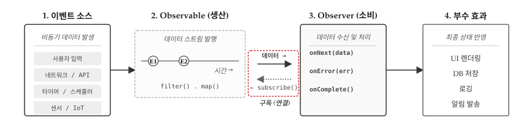
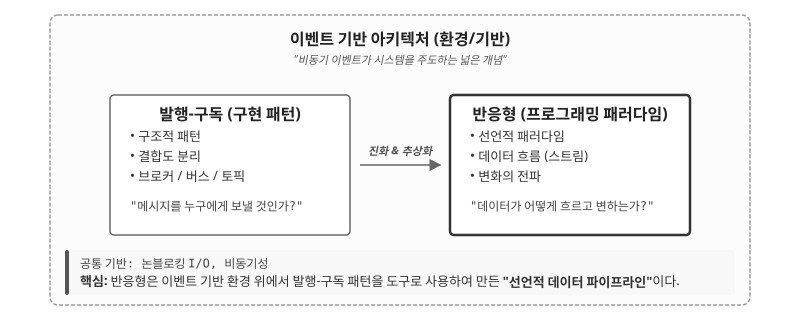
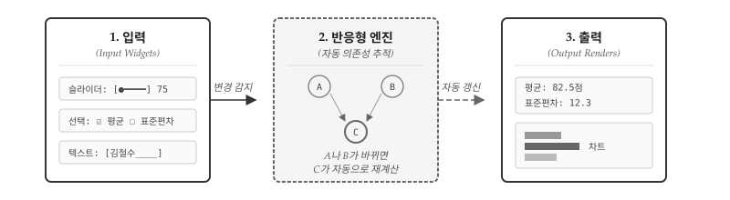
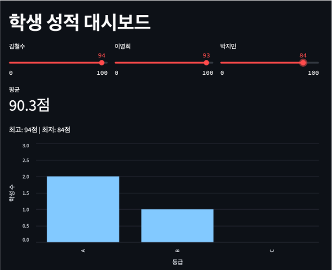
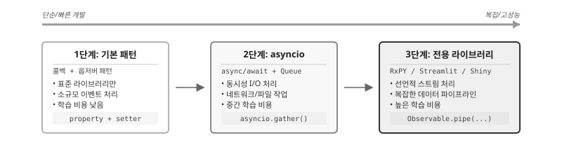
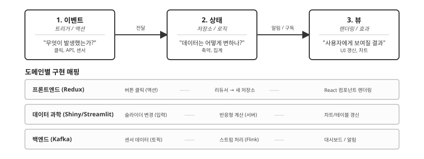
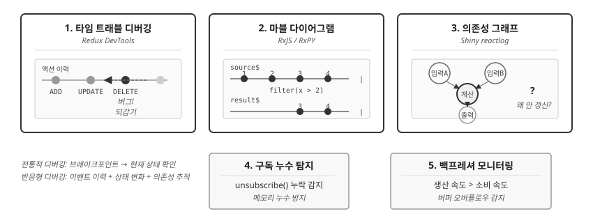

# 반응형 프로그래밍 {#sec-reactive}

\index{반응형 프로그래밍} \index{Reactive Programming}

반응형 프로그래밍(Reactive Programming)은 데이터 흐름과 변화의 전파를 중심으로 하는 패러다임이다.
이벤트가 발생하면 관련 코드가 자동으로 실행되고, 상태 변화가 의존 관계를 따라 전파된다.
스프레드시트에서 셀 값이 바뀌면 해당 셀을 참조하는 수식이 자동으로 재계산되는 것과 같은 원리다.

{#fig-reactive-overview}

@fig-reactive-overview 는 반응형 시스템의 핵심 구조를 보여준다. **1. 이벤트 소스**에서 사용자 입력, 네트워크/API, 타이머, 센서/IoT 등 비동기 데이터가 발생한다. **2. Observable(생산)**은 이 데이터를 스트림으로 발행하며 `filter()`, `map()` 같은 연산자로 변환한다. **3. Observer(소비)**가 `subscribe()`를 호출해야 비로소 연결이 성립되어 데이터가 흐르기 시작한다. Observer는 `onNext(data)`, `onError(err)`, `onComplete()` 세 가지 콜백으로 데이터를 수신한다. 최종적으로 **4. 부수 효과**에서 UI 렌더링, DB 저장, 로깅, 알림 발송 등 실제 작업이 수행된다.

반응형 패러다임이 주목받는 이유는 현대 소프트웨어의 특성에 있다. 웹 애플리케이션, 모바일 앱, IoT 시스템은 모두 비동기 이벤트에 반응해야 한다. 전통적인 명령형 방식으로 이 복잡성을 다루면 콜백 중첩과 상태 관리가 엉망이 되기 쉽다. 반응형 프로그래밍은 "무엇이 바뀌면 무엇이 따라서 바뀌는지"를 선언적으로 표현하여 이 문제를 해결한다.


## 비동기 생태계 세가지 개념 {#sec-reactive-layers}

\index{이벤트 기반} \index{Pub-Sub} \index{반응형!계층}

반응형 프로그래밍을 이해하려면 비동기 생태계 전체를 조망해야 한다. 이벤트 기반 아키텍처가 환경(기반)을 제공하고, 그 위에서 Pub-Sub 패턴과 반응형 프로그래밍이 각각 다른 역할을 수행한다.

{#fig-reactive-layers}

@fig-reactive-layers 는 세 개념의 관계를 보여준다. **이벤트 기반 아키텍처(Event-Driven Architecture)**는 비동기 이벤트가 시스템을 주도하는 넓은 환경이다. 이 환경 위에서 두 가지 접근법이 공존한다. **Pub-Sub 패턴**은 발행자와 구독자를 분리하는 구조적 패턴으로, "메시지를 누구에게 보낼 것인가"라는 결합도 문제를 해결한다. **반응형 프로그래밍**은 데이터 흐름과 변화 전파를 선언적으로 다루는 패러다임으로, "데이터가 어떻게 흐르고 변하는가"라는 질문에 답한다. Reactive는 Event-Driven 환경 위에서 Pub-Sub 패턴을 도구로 활용하여 만든 "선언적 데이터 파이프라인"이다.

### 역사적 발전 과정 {#sec-reactive-history}

\index{이벤트 기반!역사} \index{Pub-Sub!역사} \index{반응형!역사}

세 개념은 순차적으로 발전했으며, 각 시대에 주류였던 프로그래밍 패러다임이 구현 방식을 결정했다.

**1세대: 이벤트 기반 (1970-80년대)** — 명령형/절차적 프로그래밍이 지배하던 시대다. C, Assembly로 콜백 함수를 등록하고 이벤트 루프에서 폴링하는 방식이 표준이었다. X Window System, 초기 GUI 툴킷이 대표적이다. "이벤트가 발생하면 핸들러를 실행"하는 단순한 메커니즘이지만, 상태 관리가 복잡해지면 코드가 급격히 엉망이 되는 한계가 있었다.

**2세대: Pub-Sub (1980-90년대)** — 객체지향 프로그래밍의 부상과 함께 Observer 패턴이 Gang of Four(1994) 디자인 패턴으로 정형화되었다. Java, C++, Smalltalk로 발행자와 구독자를 분리하여 결합도를 낮추는 구조가 확립되었다. IBM MQ, TIBCO 같은 메시지 미들웨어가 엔터프라이즈 시스템에 도입되었고, JMS(Java Message Service)가 표준 API로 자리잡았다. 결합도 문제는 해결했지만, 콜백이 중첩되면 "콜백 지옥"에 빠지기 쉬웠다.

**3세대: 반응형 (1997년~)** — 1997년 코널 엘리엇(Conal Elliott)의 FRP(Functional Reactive Programming) 논문이 이론적 토대를 놓았다. 2009-2011년 에릭 마이어(Erik Meijer)가 ReactiveX를 개발하고 Netflix가 실전에 적용하면서 산업계에 확산되었다. 2013년 Reactive Manifesto가 발표되어 반응형 시스템의 4대 원칙(응답성, 복원력, 탄력성, 메시지 기반)이 정립되었다. 명령형 콜백 관리를 선언적 데이터 흐름으로 추상화하여 합성 가능한(composable) 코드를 작성할 수 있게 되었다.

```{r}
#| label: tbl-reactive-evolution
#| tbl-cap: "비동기 프로그래밍의 세대별 발전"
#| echo: false
library(gt)
library(tibble)

tibble(
  세대 = c("1세대", "2세대", "3세대"),
  시기 = c("1970-80s", "1980-90s", "1997~"),
  패러다임 = c("절차적", "객체지향", "반응형"),
  `비동기 처리 방식` = c("콜백 + 이벤트 루프", "Observer 패턴", "스트림 + 연산자"),
  한계 = c("상태 관리 복잡", "콜백 지옥, 에러 전파 어려움", "선언적, 합성 가능")
) |>
  gt() |>
  cols_align(align = "center", columns = everything()) |>
  tab_style(
    style = cell_text(weight = "bold"),
    locations = cells_column_labels()
  )
```

반응형 프로그래밍이 해결하고자 한 핵심 문제는 **콜백 지옥(Callback Hell)**이다. 1-2세대 방식으로 비동기 작업을 연쇄적으로 처리하면 콜백이 깊게 중첩되어 가독성과 유지보수성이 급격히 저하된다.

```javascript
// 콜백 지옥: 반응형이 해결하고자 한 문제
fetchUser(userId, function(user) {
    fetchOrders(user.id, function(orders) {
        fetchProducts(orders[0].id, function(products) {
            // 깊어지는 중첩, 에러 처리 분산, 흐름 파악 어려움
        });
    });
});
```

반응형 패러다임은 이 문제를 스트림과 연산자 체인으로 해결한다. `fetchUser().pipe(switchMap(fetchOrders), switchMap(fetchProducts)).subscribe(...)` 형태로 선형적이고 읽기 쉬운 코드가 된다.

### 이벤트 기반 {#sec-reactive-event-driven}

**이벤트 기반(Event-Driven)**은 가장 기초적인 메커니즘이다. "이벤트가 발생하면 핸들러를 실행한다"는 단순한 원리에 기반한다. 콜백 함수, 이벤트 루프, 핸들러 등록이 핵심 메커니즘이다. GUI 프로그래밍에서 버튼 클릭 시 함수를 호출하는 것이 전형적인 예다.

```{python}
#| label: reactive-event-driven
# 이벤트 기반의 기초: 콜백 등록과 호출
class Button:
    def __init__(self, label):
        self.label = label
        self._handlers = []

    def on_click(self, handler):
        self._handlers.append(handler)

    def click(self):
        for handler in self._handlers:
            handler()

button = Button("저장")
button.on_click(lambda: print("파일 저장 중..."))
button.on_click(lambda: print("저장 완료!"))
button.click()
```

### Pub-Sub {#sec-reactive-pubsub}

**Pub-Sub(Publisher-Subscriber)**는 한 단계 높은 추상화다. 이벤트 발생자(Publisher)와 이벤트 소비자(Subscriber)를 분리하여 결합도를 낮춘다. 발행자는 누가 구독하는지 모르고, 구독자는 누가 발행하는지 모른다. 메시지 브로커, 토픽 기반 라우팅이 핵심이다.

```{python}
#| label: reactive-pubsub
# Pub-Sub: 발행자와 구독자의 분리
class EventBus:
    def __init__(self):
        self.subscribers = {}

    def subscribe(self, topic, handler):
        if topic not in self.subscribers:
            self.subscribers[topic] = []
        self.subscribers[topic].append(handler)

    def publish(self, topic, data):
        if topic in self.subscribers:
            for handler in self.subscribers[topic]:
                handler(data)

bus = EventBus()
bus.subscribe("score_updated", lambda s: print(f"평균 재계산: {s}"))
bus.subscribe("score_updated", lambda s: print(f"차트 갱신: {s}"))
bus.publish("score_updated", {"student": "김철수", "score": 85})
```

### 반응형 {#sec-reactive-reactive}

**반응형(Reactive)**은 최상위 추상화다. 데이터를 시간에 따라 흐르는 스트림으로 취급하고, 스트림 간의 의존 관계가 자동으로 전파된다. "A가 바뀌면 A에 의존하는 B, C가 자동으로 재계산된다"는 선언적 모델이다. map, filter, reduce 같은 함수형 연산자로 스트림을 조합한다.

```{python}
#| label: reactive-reactive-concept
# 반응형: 의존 관계의 자동 전파
class ReactiveValue:
    def __init__(self, value):
        self._value = value
        self._dependents = []

    @property
    def value(self):
        return self._value

    @value.setter
    def value(self, new_value):
        self._value = new_value
        for dependent in self._dependents:
            dependent()  # 의존하는 계산 자동 실행

    def subscribe(self, callback):
        self._dependents.append(callback)

# 성적 입력값
score = ReactiveValue(85)

# 의존하는 계산들 (자동 갱신)
score.subscribe(lambda: print(f"  → 등급 계산: {'A' if score.value >= 90 else 'B' if score.value >= 80 else 'C'}"))
score.subscribe(lambda: print(f"  → 통과 여부: {'통과' if score.value >= 60 else '재시험'}"))

print("점수를 85로 설정:")
score.value = 85
print("\n점수를 92로 변경:")
score.value = 92
```

### 세 개념 비교 {#sec-reactive-comparison}

세 개념의 핵심 차이는 **관심사**에 있다. 이벤트 기반은 "이벤트가 발생하면 X를 실행"이라는 메커니즘을 제공한다. Pub-Sub는 "누가 누구에게 메시지를 보내는가"라는 결합도 문제를 해결한다. 반응형은 "값이 바뀌면 의존하는 모든 것이 자동으로 갱신"이라는 선언적 데이터 흐름을 제공한다.

```{r}
#| label: tbl-reactive-comparison
#| tbl-cap: "이벤트 기반 vs Pub-Sub vs 반응형 비교"
#| echo: false
library(gt)
library(tibble)

tibble(
  구분 = c("핵심 질문", "결합도", "데이터 흐름", "에러 처리", "대표 사례"),
  `이벤트 기반` = c(
    "무엇을 실행할까?",
    "높음 (핸들러 직접 등록)",
    "단방향, 수동 전파",
    "각 핸들러에서 개별 처리",
    "DOM 이벤트, GUI 콜백"
  ),
  `Pub-Sub` = c(
    "누구에게 보낼까?",
    "낮음 (브로커 경유)",
    "단방향, 토픽 기반",
    "구독자별 개별 처리",
    "메시지 큐, 알림 시스템"
  ),
  `반응형` = c(
    "무엇이 의존하는가?",
    "최소 (선언적 의존성)",
    "양방향, 자동 전파",
    "스트림 연산자로 통합",
    "Shiny, RxJS, Streamlit"
  )
) |>
  gt() |>
  cols_align(align = "center", columns = everything()) |>
  cols_align(align = "left", columns = 구분) |>
  tab_style(
    style = cell_text(weight = "bold"),
    locations = cells_column_labels()
  ) |>
  tab_style(
    style = cell_text(weight = "bold"),
    locations = cells_body(columns = 구분)
  )
```

세 개념은 서로 배타적이지 않고 **계층적**으로 쌓인다. 반응형 시스템은 내부적으로 Pub-Sub 패턴을 사용하고, Pub-Sub은 이벤트 기반 메커니즘 위에 구축된다. 따라서 "어떤 것이 더 좋은가"가 아니라 "어떤 수준의 추상화가 필요한가"를 판단해야 한다.

**상황별 권장 추상화 수준**은 명확하다. 버튼 클릭 한 번에 함수 하나를 실행하는 단순한 경우라면 이벤트 기반으로 충분하다. 여러 컴포넌트가 동일한 이벤트를 구독해야 할 때는 Pub-Sub로 결합도를 낮춘다. 값이 변하면 의존하는 모든 계산이 자동으로 갱신되어야 하는 경우, 예컨대 스프레드시트처럼 셀 간 의존성이 복잡한 시스템이라면 반응형이 적합하다. merge, debounce, throttle 같은 복잡한 스트림 조합이 필요한 실시간 대시보드나 금융 시스템에서는 RxPY 같은 전용 라이브러리가 필수다.

추상화 수준 선택에서 가장 중요한 원칙은 **과도한 추상화를 피하는 것**이다. 단순한 버튼 클릭에 RxPY를 도입하면 오버엔지니어링이다. 반대로, 10개 이상의 이벤트 소스가 서로 의존하는 대시보드를 콜백만으로 구현하면 유지보수가 불가능해진다. "지금 이 수준으로 충분한가?"를 먼저 자문하고, 한계를 느낄 때 다음 단계로 이동하라.


## Shiny와 데이터 과학 혁명 {#sec-reactive-shiny}

\index{Shiny} \index{Streamlit} \index{데이터 과학!반응형}

반응형 프로그래밍이 데이터 과학의 한 축이 된 계기는 2012년 R Shiny의 등장이다. Shiny 이전에 통계학자나 분석가가 인터랙티브 웹 애플리케이션을 만들려면 JavaScript, HTML, 서버 프로그래밍을 모두 알아야 했다. Shiny는 R 코드만으로 반응형 웹 앱을 만들 수 있게 했다.

{#fig-reactive-shiny}

@fig-reactive-shiny 는 Shiny/Streamlit의 핵심 원리를 보여준다. 사용자가 슬라이더를 조작하거나 체크박스를 선택하면(입력), 반응형 엔진이 의존성 그래프를 추적하여(반응형 엔진), 관련된 차트와 통계가 자동으로 갱신된다(출력). 개발자는 "무엇을" 표시할지만 선언하고, "언제 갱신할지"는 프레임워크가 알아서 처리한다.

Shiny가 한 시대를 풍미한 이유는 진입 장벽을 낮추면서도 강력한 결과물을 만들어냈기 때문이다. R을 아는 통계학자라면 JavaScript 없이도 인터랙티브 대시보드를 제작할 수 있게 되었고, 데이터 시각화와 탐색적 분석이 정적 보고서에서 동적 애플리케이션으로 진화했다. 전통적인 보고서가 데이터에서 분석, 문서 작성, 공유로 이어지는 단방향 흐름이었다면, 반응형 앱에서는 입력을 바꾸면 결과가 즉시 바뀌어 탐색적 분석에 최적화된 워크플로우를 제공한다. 동일한 R 코드가 분석과 프레젠테이션을 동시에 담당하면서 재현가능한 분석과 인터랙티브 발표가 결합되었고, 과학 커뮤니케이션의 방식 자체가 바뀌었다.

Shiny의 성공은 Python 생태계에도 영향을 미쳤다. 2019년 Streamlit이 등장하여 "Python 버전 Shiny"를 표방했고, 2022년에는 Posit(구 RStudio)에서 Shiny for Python을 공식 출시했다. 데이터 과학에서 반응형 패러다임은 이제 언어를 넘어 보편적인 도구가 되었다.

```python
# grade_dashboard.py - Streamlit 학생 성적 대시보드
# 실행: streamlit run grade_dashboard.py
import streamlit as st
import pandas as pd
import altair as alt

st.title("학생 성적 대시보드")

# 입력: 슬라이더로 3명의 점수 조정
col1, col2, col3 = st.columns(3)
with col1:
    score_kim = st.slider("김철수", 0, 100, 85)
with col2:
    score_lee = st.slider("이영희", 0, 100, 92)
with col3:
    score_park = st.slider("박지민", 0, 100, 78)

scores = {"김철수": score_kim, "이영희": score_lee, "박지민": score_park}

# 출력 1: 통계 (슬라이더 변경 시 자동 갱신)
mean_score = sum(scores.values()) / len(scores)
st.metric("평균", f"{mean_score:.1f}점")
st.write(f"최고: {max(scores.values())}점 | 최저: {min(scores.values())}점")

# 출력 2: 등급 분포 (슬라이더 변경 시 자동 갱신)
grades = {"A": 0, "B": 0, "C": 0}
for s in scores.values():
    if s >= 90: grades["A"] += 1
    elif s >= 80: grades["B"] += 1
    else: grades["C"] += 1

# Altair 차트: 정수 y축
df = pd.DataFrame({"등급": list(grades.keys()), "학생 수": list(grades.values())})
chart = alt.Chart(df).mark_bar().encode(
    x=alt.X("등급:N", sort=["A", "B", "C"]),
    y=alt.Y("학생 수:Q", axis=alt.Axis(tickMinStep=1), scale=alt.Scale(domain=[0, 3]))
).properties(height=300)
st.altair_chart(chart, use_container_width=True)
```

{#fig-streamlit-dashboard width="50%"}

Streamlit 코드에서 반응형의 핵심이 드러난다. 슬라이더 값이 바뀌면 평균, 최고/최저, 막대 차트가 **자동으로 재계산**된다. 개발자는 "슬라이더가 바뀌면 차트를 다시 그려라"라고 명시하지 않는다. Streamlit이 의존성을 추적하여 필요한 부분만 갱신한다.


## 파이썬 반응형 구현 {#sec-reactive-python}

\index{asyncio} \index{콜백} \index{RxPY} \index{옵저버 패턴}

파이썬은 Elm이나 Erlang처럼 반응형을 언어 자체에 내장한 특화 언어가 아니다. 반응형이 언어 수준에서 지원되지 않기 때문에, 기존 패턴과 라이브러리를 조합하여 반응형 시스템을 구축해야 한다. 파이썬에서 반응형을 구현하는 방법은 크게 세 가지 수준으로 나뉜다.

{#fig-reactive-python-spectrum}

**1단계: 기본 패턴**은 표준 라이브러리만으로 구현한다. `property` 데코레이터와 콜백 리스트를 조합하면 상태 변화 시 자동 알림이 가능하다. 외부 의존성이 없고 코드 이해와 디버깅이 단순하지만, 스트림 연산자가 없어 복잡한 이벤트 조합에는 한계가 있다. 이벤트 소스가 1~2개이고 단순 상태 알림만 필요한 경우에 적합하다.

```{python}
#| label: reactive-basic-pattern
class ReactiveScore:
    def __init__(self):
        self._score, self._callbacks = 0, []
    def on_change(self, fn): self._callbacks.append(fn)
    @property
    def score(self): return self._score
    @score.setter
    def score(self, v):
        self._score = v
        for fn in self._callbacks: fn(v)

student = ReactiveScore()
student.on_change(lambda s: print(f"점수 {s} → 등급 {'A' if s >= 90 else 'B' if s >= 80 else 'C'}"))
student.score = 85
```

**2단계: asyncio**는 네트워크 요청이나 파일 I/O처럼 대기 시간이 긴 작업이 여러 개일 때 효율적이다. `async/await` 문법으로 동기 코드처럼 읽히면서도 동시에 여러 작업을 처리한다. 표준 라이브러리에 포함되어 있고 I/O 바운드 작업에 최적화되어 있지만, 이벤트 스트림 조합이 어렵고 CPU 바운드 작업에는 부적합하다. API 호출이 다수인 크롤러나 웹 서버 개발에 적합하다.

**3단계: 전용 라이브러리**는 복잡한 이벤트 조합이나 실시간 대시보드가 필요할 때 도입한다. RxPY는 `map`, `filter`, `merge`, `debounce` 같은 강력한 스트림 연산자를 제공하고, Streamlit은 데이터 대시보드를 선언적으로 구축할 수 있게 한다. 선언적 코드로 복잡한 비동기 흐름을 처리할 수 있지만, 외부 의존성이 생기고 학습 비용이 높으며 디버깅이 복잡해진다.

적절한 수준 선택이 중요하다. 처음부터 RxPY를 도입할 필요는 없다. 1단계로 시작해서 한계를 느낄 때 다음 단계로 이동하는 것이 현실적이다. 콜백이 3개 이상 중첩되면 asyncio를 검토하고, "A와 B가 모두 발생할 때만 C를 실행"처럼 이벤트 조합이 복잡해지면 RxPY를 검토한다. 인터랙티브 대시보드가 필요하면 Streamlit이나 Shiny가 적합하다. 단순한 버튼 클릭에 RxPY를 도입하면 오버엔지니어링이고, 10개 이상의 이벤트 소스가 서로 의존하는 대시보드를 콜백만으로 구현하면 유지보수가 불가능해진다. "지금 이 수준으로 충분한가?"를 먼저 자문하고, 한계를 느낄 때 다음 단계로 이동하라.


## 반응형 아키텍처 패턴 {#sec-reactive-sandwich}

\index{이벤트 소싱} \index{CQRS} \index{Redux}

선언형 프로그래밍에서 "SQL → Python → HTML" 샌드위치 구조를 살펴보았다. 반응형 프로그래밍에도 유사한 계층 구조가 있다: **이벤트(Event) → 상태(State) → 뷰(View)**. @fig-reactive-sandwich 는 분야를 막론하고 반복되는 아키텍처를 보여준다. 프론트엔드의 Redux, 백엔드의 Kafka, 데이터 과학의 Shiny는 언어와 도구가 다르지만 동일한 "단방향 데이터 흐름"을 구현한다.

{#fig-reactive-sandwich}

**프론트엔드 상태 관리**는 Redux가 2015년 등장한 이후 사실상 표준이 되었다. Redux의 핵심 통찰은 "상태를 한 곳에서 관리하라"다. 장바구니, 로그인 정보, 필터 조건이 컴포넌트마다 흩어져 있으면 어떤 컴포넌트가 어떤 상태를 바꾸는지 추적할 수 없다. Redux는 모든 상태를 단일 저장소(Store)에 모으고, 상태 변경은 반드시 액션(Action)을 통해서만 허용한다. 실무에서 Redux 코드는 수천 줄에 달하지만, 핵심 원리는 단순하다: "무엇이 일어났는가(액션)"와 "그 결과 상태가 어떻게 바뀌는가(리듀서)"를 분리하면, 버그 발생 시 액션 로그만 추적해도 문제를 재현할 수 있다. 대형 이커머스 사이트에서 "장바구니에 담았는데 결제 페이지에서 사라졌다"는 버그가 발생하면, Redux DevTools로 액션 이력을 재생하여 어느 시점에서 상태가 꼬였는지 정확히 파악할 수 있다.

**실시간 데이터 파이프라인**은 IoT, 금융, 모니터링 시스템에서 필수다. 초당 수만 건의 센서 데이터가 쏟아지는 환경에서는 데이터베이스에 저장한 뒤 조회하는 전통적 방식이 통하지 않는다. Apache Kafka가 이벤트를 수집하고, Apache Flink나 Spark Streaming이 실시간으로 집계하며, Grafana 같은 대시보드가 결과를 시각화한다. 실무에서 겪는 가장 큰 어려움은 "늦게 도착하는 이벤트" 처리다. 네트워크 지연으로 5분 전 센서 데이터가 지금 도착하면, 이미 계산한 5분 전 집계 결과를 수정해야 한다. 워터마크(Watermark)와 윈도우(Window) 개념을 제대로 이해하지 않으면, 대시보드 숫자가 계속 바뀌거나 데이터가 누락되는 문제가 발생한다. 파이프라인 코드 자체는 수백 줄이지만, 장애 복구, 재처리, 모니터링까지 포함하면 수만 줄의 인프라 코드가 필요하다.

**이벤트 소싱과 CQRS**는 금융, 의료, 법률처럼 "왜 이 상태가 되었는가"가 중요한 도메인에서 쓰인다. 일반적인 CRUD 시스템은 현재 상태만 저장한다. 계좌 잔액이 100만원이면 100만원만 기록한다. 이벤트 소싱은 "입금 50만원", "출금 30만원", "입금 80만원" 같은 모든 이벤트를 저장하고, 현재 상태는 이벤트를 재생하여 계산한다. 감사(Audit)가 필수인 금융 시스템에서 "왜 잔액이 100만원인가"라는 질문에 답하려면 이벤트 이력이 필요하다. CQRS(Command Query Responsibility Segregation)는 쓰기(Command)와 읽기(Query)를 분리한다. 주문 이벤트는 이벤트 저장소에 기록하고, 대시보드용 집계 데이터는 별도의 읽기 전용 데이터베이스에 유지한다. 복잡도가 높아 "정말 필요한가"를 먼저 자문해야 한다. 단순한 게시판에 이벤트 소싱을 도입하면 오버엔지니어링이다.

세 패턴이 공유하는 핵심 원칙이 있다. **불변성(Immutability)**—상태를 직접 수정하지 않고 새 상태를 생성한다. **단방향 흐름**—이벤트가 상태를 바꾸고, 상태가 뷰를 갱신한다. 역방향은 없다. **관심사 분리**—이벤트 발생, 상태 계산, 화면 렌더링이 명확히 분리되어 각 계층을 독립적으로 테스트할 수 있다. 실무에서 수만 줄의 코드로 구현되는 복잡한 시스템도 이 세 가지 원칙을 따른다. 원칙을 이해하면 Redux, Kafka, Shiny 어느 도구를 쓰더라도 본질은 같다는 것을 알게 된다.


## 디버깅 {#sec-reactive-debug}

\index{반응형!디버깅} \index{타임 트래블 디버깅} \index{마블 다이어그램} \index{의존성 그래프}

전통적인 디버깅은 브레이크포인트에서 현재 상태를 확인한다. 반응형 코드에서는 이 방식이 잘 통하지 않는다. 버그가 발생한 시점에 브레이크포인트를 걸어도, "어떤 이벤트가 이 상태를 만들었는가"를 알 수 없기 때문이다. 상태 A에서 상태 B로 바뀌었을 때, 그 변화를 일으킨 이벤트가 무엇인지, 그 이벤트가 어떤 경로로 전파되었는지 추적해야 한다. 비동기로 실행되는 콜백들의 실행 순서는 코드 순서와 다를 수 있고, 스택 트레이스가 "이벤트 루프"에서 끊어져 원인을 파악하기 어렵다.

반응형 시스템에서 흔히 마주하는 버그 유형은 몇 가지로 수렴한다. "장바구니에 담았는데 결제 페이지에서 사라졌다"—어떤 액션이 상태를 덮어썼거나 누락시켰다. "슬라이더를 움직였는데 차트가 갱신되지 않는다"—의존성 연결이 끊어졌거나 조건부 렌더링이 잘못되었다. "앱이 점점 느려진다"—구독을 해제하지 않아 메모리가 누수되고 있다. "데이터가 밀린다"—이벤트 생산 속도가 소비 속도를 초과해 버퍼가 넘친다. 전통적 디버깅으로 이런 문제를 추적하려면 `console.log`를 수십 군데 심어야 하고, 그마저도 타이밍 문제를 재현하기 어렵다.

{#fig-reactive-debugging}

@fig-reactive-debugging 는 반응형 전용 디버깅 기법 다섯 가지를 보여준다. 상단의 타임 트래블, 마블 다이어그램, 의존성 그래프가 핵심이고, 하단의 구독 누수 탐지와 백프레셔 모니터링은 성능 문제에 대응한다.

### 타임 트래블 디버깅 {#sec-reactive-debug-timetravel}

\index{Redux DevTools}

타임 트래블 디버깅은 반응형 패러다임이 가능하게 만든 혁신적 기법이다. Redux DevTools가 대표적이며, 상태 관리 라이브러리인 Zustand, MobX-State-Tree도 유사한 기능을 제공한다. 원리는 단순하다: 모든 상태 변경을 "액션 로그"로 저장하고, 과거 시점으로 "되감기"하여 상태를 재현한다.

가능한 이유는 반응형 시스템의 두 가지 제약 덕분이다. 첫째, **불변성**—상태를 직접 수정하지 않고 새 상태 객체를 생성하므로, 과거 상태가 보존된다. 둘째, **순수 함수**—리듀서가 동일한 입력에 동일한 출력을 보장하므로, 액션 시퀀스를 재생하면 동일한 상태를 재현할 수 있다.

실무에서 타임 트래블의 위력은 버그 재현에서 드러난다. "장바구니가 비어 있다"는 고객 신고를 받았을 때, 전통적 방식으로는 사용자의 행동 패턴을 추측해야 한다. Redux DevTools가 있으면 액션 로그를 덤프받아 그대로 재생할 수 있다. "ADD_ITEM → ADD_ITEM → CLEAR_CART → ..."—CLEAR_CART 액션이 의도치 않게 호출된 지점을 바로 찾을 수 있다. 액션 하나씩 스텝하며 상태 변화를 관찰하면, 어느 시점에서 데이터가 사라졌는지 정확히 파악된다.

### 마블 다이어그램 {#sec-reactive-debug-marble}

\index{RxJS} \index{RxPY}

마블 다이어그램(Marble Diagram)은 스트림 연산자의 동작을 시간축 위에 시각화한다. RxJS, RxPY 같은 ReactiveX 계열 라이브러리에서 표준 표기법으로 사용된다. `--1--2--3--4--|` 형식으로, 대시(-)는 시간의 흐름, 숫자는 발행된 값, 파이프(|)는 스트림 완료를 나타낸다.

복잡한 스트림 파이프라인을 디버깅할 때 마블 다이어그램이 필수인 이유는, 연산자 체인의 중간 단계를 눈으로 확인할 수 없기 때문이다. `source$.pipe(filter(...), map(...), debounceTime(...), distinctUntilChanged(...))`—어디서 값이 사라지거나 변형되었는지 코드만 봐서는 알기 어렵다. 마블 다이어그램으로 각 단계의 입출력을 그려보면, `filter`가 조건을 잘못 걸러내는지, `debounceTime`이 값을 누락시키는지 명확해진다.

RxJS Marbles 같은 도구는 연산자별 마블 다이어그램을 인터랙티브하게 보여준다. 테스트 코드에서는 가상 시간(Virtual Time)을 사용해 시간 의존적 연산자를 동기적으로 테스트한다. 실제 500ms를 기다리지 않고, `testScheduler.run()`으로 가상 시간을 조작하여 `debounceTime(500)`의 동작을 검증할 수 있다.

### 의존성 그래프 시각화 {#sec-reactive-debug-dependency}

\index{reactlog} \index{Shiny!디버깅}

Shiny, Streamlit 같은 데이터 과학용 반응형 프레임워크에서 가장 흔한 버그는 "왜 이 출력이 갱신되지 않는가"이다. 입력을 바꿨는데 차트가 그대로인 경우, 의존성 연결이 끊어졌거나 조건부 렌더링이 잘못되었을 가능성이 높다.

Shiny의 `reactlog` 패키지는 반응형 의존성 그래프를 브라우저에서 시각화한다. 입력(슬라이더, 체크박스) → 반응형 계산 → 출력(차트, 테이블) 간의 연결을 노드와 엣지로 보여주고, 어떤 노드가 "무효화(invalidated)"되어 재계산되었는지 색상으로 표시한다. "입력A를 바꿨는데 출력C가 갱신되지 않는다"면, A → C 사이의 연결이 끊어진 지점을 그래프에서 찾을 수 있다.

의존성 그래프는 성능 최적화에도 유용하다. 불필요한 재계산이 발생하는지, 순환 의존성이 있는지, 특정 입력 변경이 예상보다 많은 출력을 갱신시키는지 확인할 수 있다. "슬라이더를 움직일 때마다 모든 차트가 깜빡인다"면, 의존성이 과도하게 연결되어 있을 수 있다. 그래프를 보고 불필요한 의존성을 끊거나, `@cached` 데코레이터로 재계산을 방지한다.

::: {.callout-note}
### 추가 디버깅 기법: 구독 누수와 백프레셔

**구독 누수 탐지**는 메모리 누수 방지에 필수다. RxJS에서 `subscribe()`를 호출하면 Subscription 객체가 반환되고, 컴포넌트가 사라질 때 `unsubscribe()`를 호출해야 한다. 누락하면 구독이 계속 살아있어 메모리가 누수된다. `takeUntil()` 연산자나 `Subject`를 활용해 자동 해제 패턴을 적용하는 것이 안전하다.

**백프레셔 모니터링**은 생산 속도가 소비 속도를 초과하는 문제를 감지한다. 센서 데이터가 초당 1000건 발생하는데 처리 속도가 100건이라면, 버퍼가 넘쳐 데이터가 누락되거나 메모리가 폭발한다. `buffer()`, `sample()`, `throttleTime()` 연산자로 생산 속도를 조절하거나, 백프레셔 전략(drop, latest, buffer)을 명시적으로 선택해야 한다.
:::


::: {.content-visible when-format="pdf"}
\faLightbulb\ 생각해볼 점
:::

::: {.content-visible when-format="html"}
## 💡 생각해볼 점 {.unnumbered}
:::

**반응형은 선언형의 시간 확장이다.** 선언형 프로그래밍이 "무엇을" 원하는지 선언하고 "어떻게"를 시스템에 맡긴다면, 반응형은 여기에 시간 차원을 추가한다. "A가 바뀌면 B도 바뀐다"는 관계를 선언하면, 시간에 따라 발생하는 변화가 자동으로 전파된다. SQL이 데이터 질의를 추상화했듯이, 반응형은 상태 변화의 전파를 추상화한다.

**세 개념의 계층을 구분하라.** 이벤트 기반은 "이벤트가 발생하면 X를 실행"하는 메커니즘이고, Pub-Sub은 "누가 누구에게 보내는가"라는 결합도 문제를 해결하며, 반응형은 "값이 바뀌면 의존하는 모든 것이 자동 갱신"되는 선언적 모델이다. 세 개념은 배타적이 아니라 계층적으로 쌓인다. 반응형 시스템은 내부적으로 Pub-Sub을 사용하고, Pub-Sub은 이벤트 기반 위에 구축된다. 단순한 버튼 클릭에 RxPY를 도입하면 오버엔지니어링이고, 10개 이상의 이벤트 소스가 서로 의존하는 대시보드를 콜백만으로 구현하면 유지보수가 불가능해진다.

**이벤트 → 상태 → 뷰 패턴은 분야를 관통한다.** Redux로 장바구니 상태를 관리하든, Kafka + Flink로 실시간 파이프라인을 구축하든, Shiny로 통계 대시보드를 만들든, 동일한 "단방향 데이터 흐름" 원칙이 적용된다. 불변성, 단방향 흐름, 관심사 분리—이 세 가지를 이해하면 도구가 바뀌어도 본질은 같다. 한 영역에서 패턴을 익히면 다른 영역으로 전이할 수 있다.

**반응형 디버깅은 전통적 디버깅과 다르다.** 브레이크포인트에서 현재 상태를 확인하는 방식은 "어떤 이벤트가 이 상태를 만들었는가"라는 질문에 답하지 못한다. 타임 트래블 디버깅으로 액션 이력을 되감고, 마블 다이어그램으로 스트림 연산자의 동작을 시각화하며, 의존성 그래프로 "왜 이 출력이 갱신되지 않는가"를 추적해야 한다. 반응형 코드가 복잡해 보이는 이유는 실행 흐름이 비선형이기 때문이다. 전용 도구 없이 `console.log`만으로는 타이밍 문제를 재현하기 어렵다.

\index{옵저버 패턴}
\index{콜백}
\index{비동기}
\index{데이터 스트림}
\index{Shiny}
\index{Streamlit}
