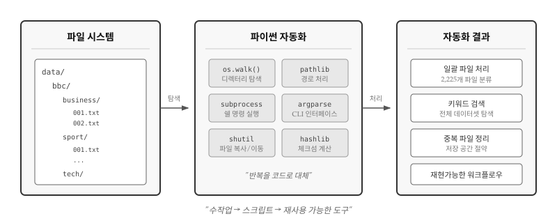
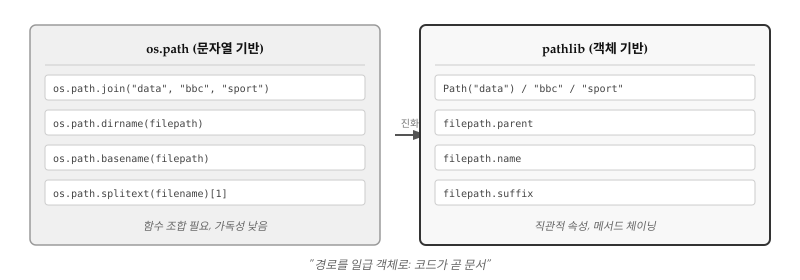
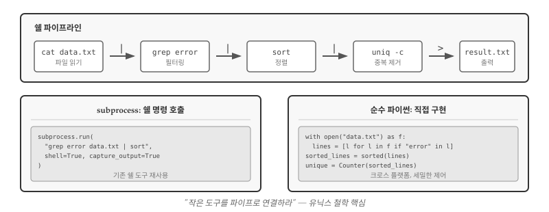
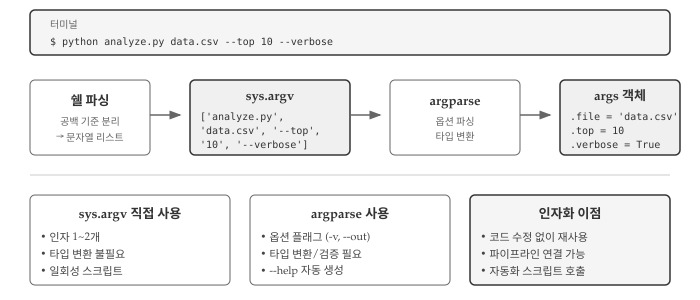
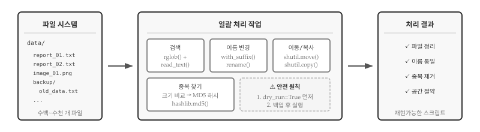
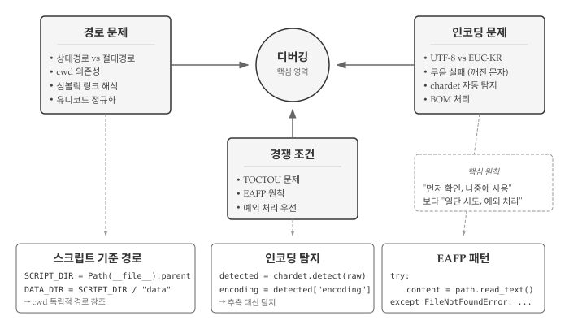

# 파일 자동화 {#sec-file-automation}

\index{파일 자동화} \index{파일 시스템}

파일, 네트워크, 서비스, 데이터베이스에서 데이터를 읽어왔다. 이제
로컬 컴퓨터의 디렉터리와 폴더를 탐색하여 파일을 처리하는 프로그램을 작성한다.
파일은 디렉터리(또는 "폴더")에 정리되어 저장되며, 파이썬 스크립트 하나로
수백 수천 개 파일에 대한 반복 작업을 자동화할 수 있다.

{#fig-make-overview}

왜 자동화인가? 같은 작업을 세 번 이상 반복한다면 스크립트로 만들 가치가 있다.
사진 1,000장의 이름을 규칙에 맞게 바꾸거나, 로그 파일에서 특정 패턴을 찾거나,
백업 폴더의 중복 파일을 정리하는 일은 손으로 하면 지루하고 실수하기 쉽다.
파이썬 스크립트는 반복 작업을 몇 초 만에 처리하고, 언제든 동일한 결과를 재현할
수 있다. 디렉터리 트리를 탐색하기 위해 `os` 모듈의 `listdir()`, `walk()` 함수와
`for` 루프를 조합하고, 파일 경로를 다루는 `os.path` 모듈과 더 현대적인 `pathlib`
모듈을 함께 활용하면, 운영체제에 상관없이 일관된 방식으로 파일 시스템을 조작할
수 있다.


## 파일 이름과 경로 {#sec-make-paths}

\index{파일 이름} \index{경로} \index{디렉토리} \index{폴더}

파일 시스템을 다루려면 먼저 **경로(path)**라는 개념을 이해해야 한다. 경로는
파일이나 디렉터리의 위치를 나타내는 문자열이다. 윈도우에서는 `C:\Users\Documents\file.txt`,
유닉스/맥에서는 `/home/user/documents/file.txt` 형식을 사용한다. 운영체제마다
구분자가 다르다는 점(`\` vs `/`)이 크로스 플랫폼 스크립트 작성 시 주요 골칫거리였고,
구분자 차이 문제를 해결하기 위해 `os.path` 모듈이 등장했다.

모든 실행 프로그램은 "현재 디렉터리(current working directory)"를 가지고
있다. 파일을 열 때 경로를 명시하지 않으면, 파이썬은 현재 디렉터리에서
해당 파일을 찾는다. `os.getcwd()` 함수는 현재 작업 디렉터리를 반환한다.

```{python}
#| label: py-getcwd-include
#| include: false
import os

cwd = os.getcwd()
print(cwd)
```

```{python}
#| label: py-getcwd
#| eval: false
import os

cwd = os.getcwd()
print(cwd)
```

```bash
/Users/swc/gpt-coding2
```

`cwd`는 **current working directory**의 약자다. 파일 위치를 나타내는 문자열을
**경로(path)**라고 부른다. **상대경로(relative path)**는 현재 디렉터리 기준으로
위치를 표현하고, **절대경로(absolute path)**는 파일 시스템 최상위부터
전체 경로를 표현한다.

\index{상대 경로} \index{절대 경로}

```{python}
#| label: py-abspath-include
#| include: false
# 상대경로를 절대경로로 변환
relative_path = "data/romeo.txt"
absolute_path = os.path.abspath(relative_path)
print(absolute_path)
```

```{python}
#| label: py-abspath
#| eval: false
# 상대경로를 절대경로로 변환
relative_path = "data/romeo.txt"
absolute_path = os.path.abspath(relative_path)
print(absolute_path)
```

```
/Users/swc/gpt-coding2/data/romeo.txt
```

`os.path` 모듈은 경로 조작에 필요한 함수들을 제공한다. 경로에서 디렉터리명만
추출하거나, 파일명과 확장자를 분리하거나, 여러 조각을 결합하여 새 경로를
만드는 작업이 빈번하기 때문이다. 특히 `os.path.join()`은 운영체제에 맞는
구분자를 자동으로 적용해주므로, 윈도우와 리눅스에서 모두 동작하는 스크립트를
작성할 때 필수다.

```{python}
#| label: py-path-functions
#| eval: false
import os

# 파일/디렉터리 존재 여부 확인
os.path.exists("data/romeo.txt")    # True/False
os.path.isfile("data/romeo.txt")    # 파일인지 확인
os.path.isdir("data")               # 디렉터리인지 확인

# 경로 분해
os.path.dirname("/home/user/data/file.txt")   # '/home/user/data'
os.path.basename("/home/user/data/file.txt")  # 'file.txt'
os.path.splitext("file.txt")                  # ('file', '.txt')

# 경로 결합 (운영체제에 맞는 구분자 자동 적용)
os.path.join("data", "bbc", "sport", "001.txt")
```

`os.path`는 오랫동안 파이썬의 표준 경로 처리 방식이었다. 하지만 함수를 중첩해서
호출해야 하는 불편함이 있었다. 예를 들어 파일의 확장자를 바꾸려면
`os.path.join(os.path.dirname(path), os.path.splitext(os.path.basename(path))[0] + ".md")`
처럼 복잡한 코드가 필요했다. 파이썬 3.4에서 도입된 `pathlib`은 경로를 객체로
다루어 함수 중첩 문제를 해소했다.

::: {.callout-note}
### pathlib: 현대적 경로 처리

\index{pathlib}

파이썬 3.4부터 도입된 `pathlib` 모듈은 경로를 객체로 다룬다. 문자열 조작
대신 메서드 체이닝으로 경로를 처리하여 코드가 더 읽기 쉬워진다.

{#fig-make-pathlib}

| os.path (문자열 기반) | pathlib (객체 기반) |
|----------------------|---------------------|
| `os.path.join("data", "bbc")` | `Path("data") / "bbc"` |
| `os.path.dirname(path)` | `path.parent` |
| `os.path.basename(path)` | `path.name` |
| `os.path.splitext(name)[1]` | `path.suffix` |
| `os.path.exists(path)` | `path.exists()` |

`Path` 객체는 `/` 연산자로 경로를 결합하고, `.parent`, `.name`, `.suffix` 같은
속성으로 경로 구성 요소에 접근한다. 운영체제별 구분자(`/` vs `\`) 차이도
자동으로 처리된다.
:::


## 디렉터리 탐색 {#sec-make-directory}

\index{디렉터리 탐색} \index{os.listdir} \index{os.walk}

경로를 다루는 법을 알았으니, 이제 디렉터리 구조를 탐색할 차례다. 실제 자동화
작업에서는 "특정 폴더 아래 모든 `.txt` 파일을 찾아라", "하위 디렉터리까지
포함해서 이미지 파일을 수집하라" 같은 요구가 빈번하다. `os.listdir()`는
지정한 디렉터리의 파일과 하위 디렉터리 목록을 반환하지만, 딱 한 단계만
살펴본다. 하위 디렉터리 내용까지 재귀적으로 탐색하려면 `os.walk()`를 사용한다.

```{python}
#| label: py-listdir
import os

# 현재 디렉터리 내용
items = os.listdir(".")
print(items[:5])  # 처음 5개만 출력
```

`os.walk()`는 디렉터리 트리를 순회하며 각 디렉터리에 대해 `(경로, 하위디렉터리들, 파일들)` 튜플을 반환한다. `os.walk()`가 강력한 이유는 **깊이에 상관없이** 모든 하위
디렉터리를 자동으로 탐색하기 때문이다. 복잡한 재귀 함수를 직접 작성할 필요가 없다.

```{python}
#| label: py-walk
#| eval: true
import os

# 디렉터리 트리 순회
for root, dirs, files in os.walk("data/bbc"):
    print(f"디렉터리: {root}")
    print(f"  하위 디렉터리: {dirs}")
    print(f"  파일 수: {len(files)}")
```

`root`는 현재 탐색 중인 디렉터리 경로, `dirs`는 그 안의 하위 디렉터리 이름 목록,
`files`는 파일 이름 목록이다. `os.walk()`가 한 번 호출될 때마다 트리의 다음 단계로
이동하면서 정보를 반환한다. 위 패턴을 익히면 수천 개 파일이 중첩된 복잡한
폴더 구조도 쉽게 처리할 수 있다.

### BBC 뉴스 사례 {#sec-make-bbc}

\index{BBC 뉴스 데이터셋}

[BBC 뉴스 데이터셋](http://mlg.ucd.ie/datasets/bbc.html)으로 실제 자동화를
연습해보자. 5개 뉴스 범주(business, entertainment, politics, sport, tech)
폴더에 `001.txt`, `002.txt` 형식으로 2,225개 기사가 저장되어 있다.
2,225개 파일을 손으로 분류하거나 통계를 내는 건 사실상 불가능하지만,
`os.walk()`와 `Counter`를 조합하면 몇 줄 코드로 범주별 기사 수를 파악할 수 있다.

```{python}
#| label: py-bbc-count
import os
from collections import Counter

# 범주별 파일 수 계산
category_counts = Counter()

for root, dirs, files in os.walk("data/bbc"):
    # root에서 범주명 추출 (예: data/bbc/sport → sport)
    parts = root.split(os.sep)
    if len(parts) >= 3:
        category = parts[-1]
        txt_files = [f for f in files if f.endswith(".txt")]
        category_counts[category] += len(txt_files)

for category, count in category_counts.most_common():
    print(f"{category}: {count}개")
```

위 코드는 `os.walk()`와 문자열 조작으로 작업을 완료했다. 동작은 하지만
`root.split(os.sep)`처럼 경로를 문자열로 다루는 부분이 다소 번거롭다.
앞서 callout에서 소개한 `pathlib`을 사용하면 같은 작업을 더 직관적으로
처리할 수 있다. 다음 예제에서 `pathlib`의 `rglob()` 메서드를 활용해보자.


### 가장 큰 파일 찾기 {#sec-make-largest}

`pathlib`의 `rglob()` 메서드는 **재귀적 glob(recursive glob)**을 수행한다.
`bbc_path.rglob("*.txt")`는 `data/bbc` 아래 모든 하위 디렉터리에서 `.txt`
파일을 찾아 `Path` 객체로 반환한다. 파일 크기는 `Path.stat().st_size`로
얻을 수 있다. BBC 뉴스 데이터셋에서 가장 긴 기사를 찾아보자.

```{python}
#| label: py-largest-file
from pathlib import Path

bbc_path = Path("data/bbc")
largest_file = None
largest_size = 0

for txt_file in bbc_path.rglob("*.txt"):
    size = txt_file.stat().st_size
    if size > largest_size:
        largest_size = size
        largest_file = txt_file

if largest_file:
    print(f"가장 큰 파일: {largest_file}")
    print(f"크기: {largest_size:,} 바이트")
    print(f"범주: {largest_file.parent.name}")
```

for 루프로 하나씩 비교하며 최댓값을 찾는 방식 대신, 파이썬 내장 함수
`max()`에 `key` 인자를 전달하면 더 간결하게 작성할 수 있다. `key=lambda f: f.stat().st_size`는
"각 파일의 크기를 기준으로 비교하라"는 뜻이다. 함수형 스타일에 익숙해지면
코드가 짧아지고 의도가 명확해진다.

```{python}
#| label: py-largest-file-max
from pathlib import Path

bbc_path = Path("data/bbc")
txt_files = list(bbc_path.rglob("*.txt"))

largest = max(txt_files, key=lambda f: f.stat().st_size)
print(f"가장 큰 파일: {largest.name} ({largest.stat().st_size:,} 바이트)")
```

`pathlib`의 장점이 드러난다. `largest.parent.name`으로 상위 디렉터리(범주)를,
`largest.name`으로 파일명을, `largest.suffix`로 확장자를 바로 꺼낼 수 있다.
문자열 슬라이싱이나 `os.path` 함수 호출 없이도 경로의 각 부분에 직관적으로
접근할 수 있어 코드 가독성이 높아진다.


## 쉘과 파이프 {#sec-make-shell}

\index{쉘} \index{파이프}

파이썬으로 파일 자동화를 구현하다 보면 자연스럽게 한 가지 질문에 도달한다.
"쉘 명령어 한 줄이면 끝나는 작업인데 굳이 파이썬 코드로 작성해야 하나?"
수십 년간 축적된 유닉스 도구들—`grep`, `sort`, `awk`, `sed`—은 각자의
영역에서 탁월한 성능을 발휘한다. 파이썬 프로그래머라면 쉘 도구를
**언제 활용하고, 언제 순수 파이썬으로 구현해야 하는지** 판단할 수 있어야 한다.

{#fig-shell-pipe}

### 파이프: 작은 도구의 조합 {#sec-make-pipe-concept}

**쉘(shell)**은 운영체제와 사용자 사이의 명령어 기반 인터페이스다.
유닉스/리눅스에서 `ls`로 디렉터리 내용을 보고, `cd`로 이동하며,
**파이프(`|`)**로 명령어를 연결한다. 파이프는 한 프로그램의 출력을
다른 프로그램의 입력으로 바로 전달하는 메커니즘이다.

```bash
# 로그 파일에서 에러 라인만 추출하여 정렬 후 중복 제거
$ cat server.log | grep "ERROR" | sort | uniq -c > errors.txt
```

위 한 줄 명령은 네 개의 작은 프로그램이 협력한 결과다. `cat`은 파일을 읽고,
`grep`은 패턴을 필터링하며, `sort`는 정렬하고, `uniq`는 중복을 제거한다.
각 도구는 **한 가지 일만 잘 수행**하며, 파이프를 통해 텍스트 스트림으로
연결된다. 바로 유닉스 철학의 핵심이다.

### 파이썬에서 쉘 명령 실행 {#sec-make-subprocess}

`subprocess` 모듈은 파이썬에서 외부 프로그램을 실행하는 표준 방법이다.
쉘 명령의 강력함을 파이썬 스크립트 안에서 활용할 수 있다.

```{python}
#| label: py-subprocess
#| eval: false
import subprocess

# ls -l 실행 (유닉스/맥)
result = subprocess.run(["ls", "-l", "data"],
                        capture_output=True, text=True)
print(result.stdout)
```

```{python}
#| label: py-subprocess-win
#| eval: false
# 윈도우에서는 dir 명령 사용
result = subprocess.run(["dir", "data"],
                        shell=True, capture_output=True, text=True)
print(result.stdout)
```

쉘 파이프라인을 통째로 실행할 수도 있다. `shell=True` 옵션을 사용하면
쉘 문법 그대로 명령어를 전달할 수 있다.

```{python}
#| label: py-subprocess-pipe
#| eval: false
# 쉘 파이프라인을 그대로 실행
result = subprocess.run(
    "grep ERROR server.log | sort | uniq -c",
    shell=True, capture_output=True, text=True
)
print(result.stdout)
```

### 유닉스 철학 {#sec-make-unix}

\index{유닉스 철학}

유닉스 철학은 작업 자동화의 근간이다. 1978년 더그 맥일로이(Doug McIlroy)가
정립한 원칙은 40년이 지난 지금도 소프트웨어 설계의 황금률로 남아 있다.

::: callout-tip
### 유닉스 철학

> Write programs that do one thing and do it well. Write programs to work
> together. Write programs to handle text streams, because that is a
> universal interface. -- Doug McIlroy

- 한 가지 작업만 매우 잘하는 프로그램을 작성한다.
- 프로그램이 함께 동작하도록 작성한다.
- 텍스트를 다루는 프로그램을 작성한다. 텍스트는 보편적 인터페이스다.
:::

파이썬 스크립트도 유닉스 철학을 따를 수 있다. 표준 입력(`stdin`)에서 읽고
표준 출력(`stdout`)으로 쓰는 스크립트는 쉘 파이프라인의 일부가 된다.

```bash
# 파이썬 스크립트를 파이프라인에 끼워넣기
$ cat data.txt | python preprocess.py | python analyze.py > output.txt
```

\index{subprocess}

쉘 명령을 활용할지, 순수 파이썬으로 구현할지는 상황에 따라 달라진다.
`subprocess`는 개발 속도가 빠르다. `grep`, `awk` 같은 검증된 도구를 그대로
재사용하면 몇 줄 코드로 복잡한 텍스트 처리를 끝낼 수 있다. 수 기가바이트
로그 파일을 필터링할 때 `grep`의 성능은 파이썬 순수 구현보다 훨씬 빠르다.
일회성 스크립트나 프로토타입 단계에서는 쉘 명령을 호출하는 편이 효율적이고,
리눅스 서버 환경에서만 돌아가는 스크립트라면 이식성 걱정도 없다.

반면 순수 파이썬 구현은 크로스 플랫폼 호환성이 강점이다. 윈도우, 맥, 리눅스
어디서든 동일하게 동작해야 하는 도구라면 외부 명령 의존을 피해야 한다.
`subprocess`로 쉘 명령을 실행하면 에러 메시지가 텍스트로 반환되어 파싱이
번거롭지만, 파이썬 코드는 `try-except`로 예외를 세밀하게 처리할 수 있다.
JSON이나 객체 같은 구조화된 데이터를 다룰 때도 파이썬 코드가 자연스럽고,
단위 테스트 작성도 쉽다. 배포 환경에서 `grep`이나 `awk` 설치를 보장할 수
없다면 표준 라이브러리만으로 동작하는 순수 파이썬이 안전한 선택이다.

실무에서는 두 접근법을 혼합한다. 무거운 텍스트 처리는 `grep`이나 `awk`에
맡기고, 그 결과를 파이썬에서 파싱하여 구조화된 처리를 수행하는 식이다.
"쉘로 빠르게 필터링하고, 파이썬으로 정교하게 가공한다"는 전략이 효과적이다.


## 명령줄 인자 {#sec-make-args}

\index{명령줄 인자} \index{sys.argv} \index{argparse}

스크립트를 한 번 작성하면 끝이 아니다. 같은 로직을 다른 파일에 적용하거나,
옵션을 바꿔가며 실행해야 하는 상황이 반복된다. 파일 경로나 설정값을 코드에
직접 적으면(하드코딩) 매번 소스를 열어 수정해야 한다. **명령줄 인자**는
코드를 건드리지 않고 실행 시점에 값을 전달하는 방법이다.

{#fig-cli-args}

명령줄 인자가 중요한 이유는 **재사용성**과 **자동화 연결**에 있다. 스크립트가
인자를 받으면 쉘 스크립트, 크론, CI/CD 파이프라인에서 바로 호출할 수 있다.
`python analyze.py data1.csv`와 `python analyze.py data2.csv`처럼 같은 스크립트를
다른 데이터에 적용할 수 있고, `--verbose` 플래그로 디버그 출력을 켜고 끌 수 있다.
유닉스 철학에서 강조하는 "작은 도구의 조합"은 명령줄 인자가 있어야 가능하다.

### sys.argv와 argparse 선택 {#sec-make-argv-choice}

\index{sys.argv} \index{argparse}

파이썬은 명령줄 인자를 처리하는 두 가지 방법을 제공한다. `sys.argv`는 인자를
문자열 리스트로 그대로 전달하고, `argparse`는 인자를 파싱하여 구조화된 객체로
변환한다. 선택 기준은 명확하다.

**sys.argv가 적합한 경우**: 인자가 1~2개이고 형식이 단순할 때. 파일 경로 하나만
받는 스크립트라면 `sys.argv[1]`로 충분하다. 타입 검증이나 도움말이 필요 없는
일회성 스크립트에 적합하다.

**argparse가 필요한 경우**: 옵션 플래그(`-v`, `--output`)가 있거나, 인자 타입
변환(문자열→정수)이 필요하거나, `--help` 도움말을 자동 생성하고 싶을 때.
다른 사람이 사용할 도구라면 `argparse`가 표준이다.

```{python}
#| label: py-argv-simple
#| eval: false
# sys.argv: 단순한 경우
import sys
filepath = sys.argv[1]  # 첫 번째 인자
```

```{python}
#| label: py-argparse-pattern
#| eval: false
# argparse: 구조화된 인자 처리
import argparse

parser = argparse.ArgumentParser(description="파일 분석 도구")
parser.add_argument("file", help="분석할 파일")
parser.add_argument("-n", "--top", type=int, default=5)
parser.add_argument("-v", "--verbose", action="store_true")

args = parser.parse_args()
# args.file, args.top, args.verbose로 접근
```

`argparse`의 핵심 패턴은 세 단계다. 파서 생성(`ArgumentParser`), 인자 정의
(`add_argument`), 파싱 실행(`parse_args`). `add_argument`에서 `type=int`로
타입 변환을, `default=5`로 기본값을, `action="store_true"`로 불리언 플래그를
지정한다. `--help` 옵션은 자동으로 생성된다.

::: callout-tip
### CLI 설계 원칙

\index{CLI 설계}

좋은 CLI 도구는 몇 가지 원칙을 따른다.

- **합리적 기본값**: 필수 옵션을 최소화하고, 대부분의 경우 기본값으로 동작하게 한다
- **--help 필수**: 사용법을 기억할 필요 없이 `--help`로 확인할 수 있어야 한다
- **단일 책임**: 한 스크립트는 한 가지 작업에 집중한다. 복잡한 워크플로우는
  여러 스크립트를 파이프로 연결한다
- **종료 코드**: 성공 시 0, 실패 시 1을 반환하여 쉘 스크립트에서 조건 분기할 수 있게 한다

앞서 작성한 `search_files()` 함수에 `argparse` 인터페이스를 붙이면 바로
CLI 도구가 된다. 로직(함수)과 인터페이스(argparse)를 분리하면 같은 함수를
스크립트, 노트북, 웹 API 등 다양한 환경에서 재사용할 수 있다.
:::


## 파일 일괄 처리 {#sec-make-batch}

\index{일괄 처리}

작업 자동화의 핵심은 **대량 파일을 일괄 처리**하는 것이다. 수천 개 파일의
이름을 바꾸거나, 특정 키워드가 포함된 파일을 찾거나, 중복 파일을 정리하는
작업을 스크립트 하나로 해결할 수 있다.

{#fig-make-batch}

파일 검색은 `rglob()`과 `read_text()`의 조합으로 구현한다. 디렉터리를
재귀적으로 탐색하면서 파일 내용을 읽고, 키워드가 포함되었는지 확인한다.
대소문자를 구분하지 않으려면 `.lower()`로 통일한 뒤 비교하면 된다.

```{python}
#| label: py-file-search
from pathlib import Path

def search_files(directory, keyword, extension=".txt"):
    """디렉터리에서 키워드가 포함된 파일 찾기"""
    results = []
    for filepath in Path(directory).rglob(f"*{extension}"):
        content = filepath.read_text(encoding="utf-8", errors="ignore")
        if keyword.lower() in content.lower():
            results.append(filepath)
    return results

matches = search_files("data/bbc", "football")
print(f"'football' 포함 파일: {len(matches)}개")
```

파일 이름 변경과 이동은 `pathlib`의 `with_suffix()`, `rename()`과
`shutil.move()`로 처리한다. 확장자를 바꾸려면 `filepath.with_suffix(".md")`로
새 경로를 만들고 `rename()`을 호출한다. 다른 드라이브나 파일 시스템으로
이동해야 한다면 `shutil.move()`를 사용한다.

중복 파일 탐지는 2단계로 진행한다. 먼저 파일 크기로 후보군을 좁힌 뒤,
`hashlib.md5()`로 체크섬을 계산하여 내용이 동일한 파일을 식별한다.
크기가 다르면 내용도 다르므로, 해시 계산 대상을 크기가 같은 파일로
한정하면 성능이 크게 향상된다.

::: callout-warning
### 파일 조작 안전 원칙

\index{dry run}

파일 이름 변경, 삭제, 이동은 되돌릴 수 없다. 실무에서는 `dry_run=True`
매개변수를 두어 실제 작업 전에 시뮬레이션 결과를 확인한다. "무엇이
바뀔지" 먼저 출력하고, 결과가 예상과 일치하면 `dry_run=False`로
실행한다. 중요한 데이터는 반드시 백업 후 작업한다.
:::

\index{체크섬}


## 디버깅 {#sec-make-debugging}

\index{디버깅!파일 자동화}

파일 자동화 스크립트가 실패하면 원인을 빠르게 파악하기 어렵다. 수천 개 파일 중
어디서 문제가 발생했는지, 경로가 잘못된 건지 인코딩 문제인지 구분해야 한다.
기초적인 예외 처리 문법보다 중요한 건 **"왜 이 오류가 발생하는가"**에 대한
깊은 이해다.

{#fig-make-debugging}

### 경로 문제 {#sec-make-debug-path}

\index{경로!상대경로} \index{경로!절대경로}

파일 자동화에서 가장 흔한 실패 원인은 **경로**다. 스크립트가 개발 환경에서는
잘 동작하다가 서버에 배포하면 실패하는 경우가 많다. 핵심은 **현재 작업
디렉터리(cwd)**가 어디인지 정확히 파악하는 것이다.

상대경로 `data/romeo.txt`는 cwd가 `/home/user/project`일 때
`/home/user/project/data/romeo.txt`를 가리킨다. 하지만 크론(cron)이나
시스템 서비스로 스크립트를 실행하면 cwd가 `/`나 `/home/user`로 바뀌어
같은 상대경로가 전혀 다른 위치를 가리킨다. 이 문제를 방지하는 방법은
**스크립트 파일 위치를 기준으로 경로를 구성**하는 것이다.

```{python}
#| label: py-script-relative
#| eval: false
from pathlib import Path

# 스크립트 파일이 있는 디렉터리
SCRIPT_DIR = Path(__file__).parent

# 스크립트 위치 기준으로 데이터 경로 설정
DATA_DIR = SCRIPT_DIR / "data"
CONFIG_FILE = SCRIPT_DIR / "config.yaml"
```

`__file__`은 현재 실행 중인 스크립트의 경로를 담고 있다. `.parent`로 디렉터리를
추출하면 cwd에 상관없이 항상 올바른 위치를 참조한다. 주피터 노트북에서는
`__file__`이 정의되지 않으므로, 노트북과 스크립트를 모두 지원하려면 조건 분기가
필요하다.

::: callout-warning
### 심볼릭 링크의 함정

\index{심볼릭 링크}

심볼릭 링크를 통해 스크립트를 실행하면 `__file__`이 링크 경로를 반환한다.
원본 파일 위치가 필요하면 `Path(__file__).resolve()`로 심볼릭 링크를 해석해야
한다. 배포 환경에서 심볼릭 링크를 사용한다면 이 차이를 반드시 인지해야 한다.
:::

### 숨겨진 문자 {#sec-make-debug-hidden}

\index{유니코드 정규화} \index{NFC} \index{NFD}

화면에 똑같이 보이는 두 파일명이 실제로는 다른 바이트열일 수 있다. 한글
파일명은 특히 위험하다. "한글.txt"는 **NFC**(Composed) 형식과
**NFD**(Decomposed) 형식으로 저장될 수 있는데, 두 형식은 화면에서 동일하게
보이지만 바이트 수준에서 다르다.

macOS는 기본적으로 NFD 형식을 사용하고, 윈도우와 리눅스는 NFC를 선호한다.
macOS에서 생성한 파일을 윈도우로 복사했을 때 한글 파일명이 깨지거나,
`Path.exists()`가 `False`를 반환하는 이유가 여기에 있다.

```{python}
#| label: py-unicode-normalize
#| eval: false
import unicodedata
from pathlib import Path

def normalize_path(filepath):
    """경로명을 NFC로 정규화"""
    return Path(unicodedata.normalize("NFC", str(filepath)))

# 검색 대상도 정규화해야 일치함
target_name = unicodedata.normalize("NFC", "한글파일.txt")
```

이 문제가 의심되면 파일명의 바이트를 직접 확인한다.

```{python}
#| label: py-check-bytes
#| eval: false
filename = "한글.txt"
print(filename.encode("utf-8"))  # NFC vs NFD 바이트 비교
print(len(filename))             # NFC: 6, NFD: 8 (자모 분리)
```

### 인코딩 {#sec-make-debug-encoding}

\index{인코딩!UTF-8} \index{인코딩!EUC-KR} \index{chardet}

한국어 텍스트 파일은 UTF-8, EUC-KR, CP949 등 여러 인코딩으로 저장될 수 있다.
잘못된 인코딩으로 읽으면 `UnicodeDecodeError`가 발생하거나, 오류 없이
깨진 문자가 반환된다. 후자가 더 위험하다—오류 없이 진행되어 나중에야 문제를
발견하기 때문이다.

레거시 시스템에서 생성된 파일이나 출처가 불분명한 데이터를 다룰 때는
인코딩을 **탐지**해야 한다. `chardet` 라이브러리가 대표적이다.

```{python}
#| label: py-chardet
#| eval: false
import chardet
from pathlib import Path

def read_with_detection(filepath):
    """인코딩을 자동 탐지하여 텍스트 읽기"""
    raw_bytes = Path(filepath).read_bytes()
    detected = chardet.detect(raw_bytes)

    encoding = detected["encoding"]
    confidence = detected["confidence"]

    if confidence < 0.7:
        print(f"경고: 인코딩 신뢰도 낮음 ({encoding}, {confidence:.0%})")

    return raw_bytes.decode(encoding)
```

`chardet.detect()`는 바이트열을 분석하여 인코딩을 추정하고 신뢰도를 함께
반환한다. 신뢰도가 낮으면 수동 확인이 필요하다. 대량 파일 처리 시에는
샘플 파일로 먼저 인코딩을 확인한 뒤, 확정된 인코딩을 일괄 적용하는 편이 안전하다.

### 대용량 처리 {#sec-make-debug-memory}

\index{대용량 파일} \index{스트리밍}

`Path.read_text()`는 파일 전체를 메모리에 올린다. 수 메가바이트 파일은
문제없지만, 수 기가바이트 로그 파일을 이 방식으로 처리하면 `MemoryError`가
발생하거나 시스템이 느려진다. 대용량 파일은 **줄 단위로 스트리밍** 처리해야
한다.

```{python}
#| label: py-streaming
#| eval: false
from pathlib import Path

def count_lines_streaming(filepath, keyword):
    """대용량 파일을 줄 단위로 처리"""
    count = 0
    with open(filepath, encoding="utf-8") as f:
        for line in f:  # 한 줄씩 읽음, 메모리 효율적
            if keyword in line:
                count += 1
    return count
```

`for line in f` 패턴은 파일 객체를 이터레이터로 사용한다. 파이썬이 내부적으로
버퍼링하며 한 줄씩 반환하므로, 파일 크기에 관계없이 메모리 사용량이 일정하다.
BBC 뉴스 2,225개 파일 같은 규모는 `read_text()`로 충분하지만, 서버 로그나
센서 데이터처럼 기가바이트 단위 파일을 다룬다면 스트리밍이 필수다.

### 경쟁 조건 {#sec-make-debug-race}

\index{경쟁 조건} \index{TOCTOU}

파일 존재 여부를 확인한 뒤 사용하는 패턴에는 **경쟁 조건(race condition)**이
숨어 있다. `if filepath.exists():`를 통과한 직후, 다른 프로세스가 파일을
삭제하면 `read_text()`에서 `FileNotFoundError`가 발생한다. 이를
**TOCTOU(Time-Of-Check to Time-Of-Use)** 문제라고 부른다.

```{python}
#| label: py-toctou-bad
#| eval: false
# 취약한 패턴: 확인과 사용 사이에 틈이 있음
if filepath.exists():
    content = filepath.read_text()  # 여기서 실패할 수 있음
```

```{python}
#| label: py-toctou-good
#| eval: false
# 안전한 패턴: 일단 시도하고 예외 처리
try:
    content = filepath.read_text()
except FileNotFoundError:
    content = None
```

EAFP(Easier to Ask Forgiveness than Permission) 원칙에 따라, 조건 검사보다
예외 처리를 우선하는 편이 안전하다. 특히 여러 프로세스가 동시에 같은
디렉터리를 처리하는 파이프라인에서는 이 패턴이 필수다.


::: {.content-visible when-format="pdf"}
\faLightbulb\ 생각해볼 점
:::

::: {.content-visible when-format="html"}
## 💡 생각해볼 점 {.unnumbered}
:::

작업 자동화의 본질은 **반복을 코드로 대체하는 것**이다. 수백 개 파일의 이름을
하나씩 바꾸는 대신 스크립트 한 번 실행으로 끝내고, 매일 반복되는 데이터 수집은
크론(cron)이나 태스크 스케줄러에 맡긴다. 자동화는 시간을 절약할 뿐 아니라
**재현가능성**을 확보한다. 손으로 클릭하며 처리한 작업은 기록이 남지 않지만,
스크립트는 "어떤 파일을 어떻게 처리했는지"를 코드 자체로 문서화한다. 6개월 후
같은 작업을 반복해야 할 때, 스크립트 하나면 몇 분 만에 끝난다.

유닉스 철학—"한 가지를 잘하는 작은 프로그램"—은 50년이 지난 지금도 유효하다.
`grep`으로 검색하고, `sort`로 정렬하고, `uniq`로 중복을 제거하듯, 파이썬 스크립트도
각각 단일 기능에 집중하고 파이프(`|`)로 연결하면 복잡한 작업을 처리할 수 있다.
BBC 뉴스 데이터셋을 다룬 예제에서 봤듯이, 검색·분류·통계를 각각 별도 함수로
분리하면 테스트하기 쉽고 조합하기 쉽다. 하나의 거대한 스크립트보다 작은 스크립트
여러 개가 낫다는 원칙은 현대 데이터 파이프라인에서도 그대로 적용된다.

`pathlib`은 경로 처리를 문자열 조작에서 객체 지향 방식으로 전환했다.
코드가 간결해지면 버그가 줄고, 가독성이 높아지면 협업이 쉬워진다.

`argparse`로 CLI 인터페이스를 만들면 스크립트의 활용 범위가 넓어진다. 파일 경로,
검색 키워드, 옵션 플래그를 명령줄 인자로 받으면, 코드를 수정하지 않고도 다양한
작업에 같은 스크립트를 재사용할 수 있다. `--dry-run` 옵션으로 실행 전 시뮬레이션을
하고, `--verbose`로 상세 로그를 출력하는 패턴은 실무에서 거의 필수다. 작은 CLI
도구들을 쌓아가다 보면 어느새 자신만의 자동화 도구 모음이 완성된다.

파이썬 스크립트로 개별 작업을 자동화하는 데는 한계가 있다. 여러 스크립트가
서로 의존하는 복잡한 파이프라인—데이터 전처리 → 분석 → 시각화 → 보고서 생성—을
쉘 스크립트로 묶으면 매번 전체를 재실행해야 한다. 원본 데이터만 바뀌었는데
시각화까지 다시 돌리는 건 낭비다. **의존성 기반 빌드 자동화** 도구인 Make는
"무엇이 바뀌었는지" 추적하여 필요한 단계만 재실행한다. 다음 장에서 Make의
핵심 개념과 실전 활용법을 다룬다.

\index{pathlib} \index{유닉스 철학} \index{재현가능성}
