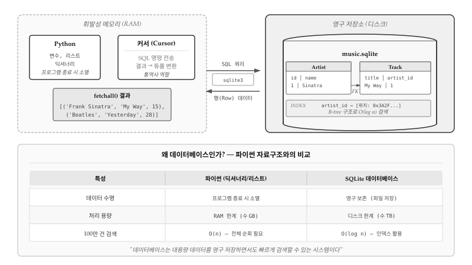
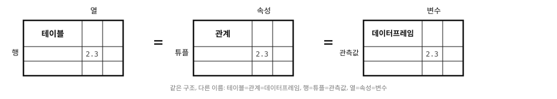
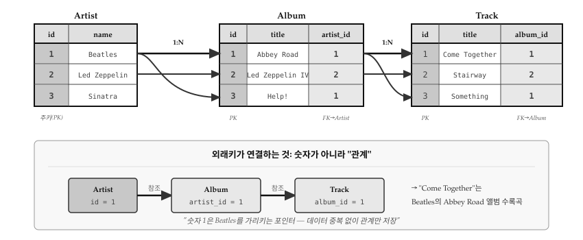
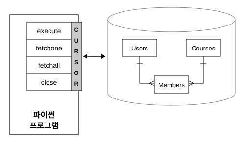
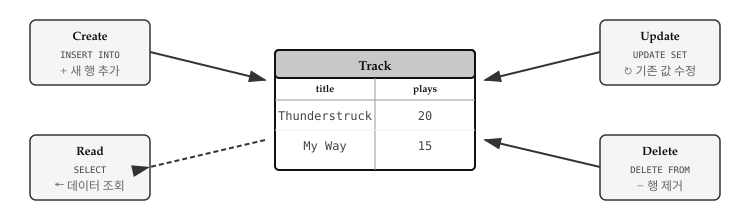
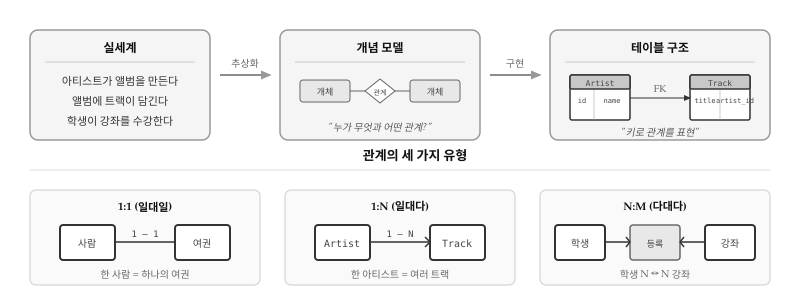
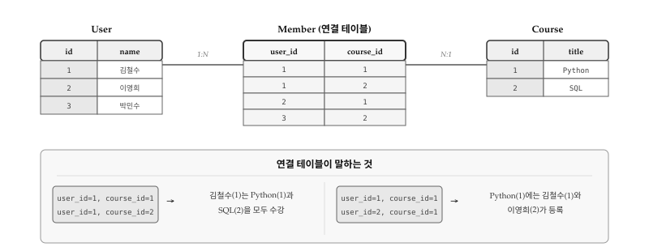
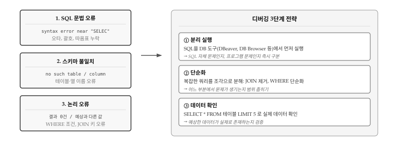

# 데이터베이스와 SQL {#sec-db}

파이썬 프로그램에서 변수, 리스트, 딕셔너리에 저장한 데이터는 프로그램이
종료되는 순간 모두 사라진다. RAM이라는 휘발성 메모리에 존재하기 때문이다.
음악 재생 앱을 만들었는데 사용자가 앱을 껐다 켤 때마다 플레이리스트가
초기화된다면 아무도 쓰지 않을 것이다. **데이터베이스**는 바로 초기화되는 문제를
해결한다. 디스크에 데이터를 영구 저장하면서도, 딕셔너리처럼 빠르게 검색할 수
있는 시스템이다.

@fig-db-architecture 는 파이썬과 데이터베이스라는 두 세계가 어떻게 연결되는지
보여준다. 왼쪽 점선 영역은 RAM에 존재하는 휘발성 데이터다. 파이썬 변수와
자료구조, 그리고 **커서(Cursor)** 객체가 여기에 속한다. 커서는 SQL 명령을
데이터베이스에 전송하고, 반환된 행(Row) 데이터를 파이썬 튜플로 변환하는
통역사 역할을 한다. 오른쪽 실선 영역은 디스크에 저장되는 영구 데이터다.
`music.sqlite` 같은 데이터베이스 파일 안에 Artist, Track 같은 테이블이
존재하고, 외래키(FK)로 서로 연결되어 있다. 인덱스는 B-tree 구조로
구성되어 $O(log n)$ 시간에 원하는 데이터를 찾아낸다.

그렇다면 왜 파이썬 딕셔너리 대신 데이터베이스를 써야 할까? 세 가지 이유가
있다. 첫째, **영속성**이다. 딕셔너리는 프로그램 종료 시 소멸하지만,
데이터베이스는 파일로 영구 보존된다. 둘째, **용량**이다. 딕셔너리는 RAM
한계(수 GB)에 묶이지만, 데이터베이스는 디스크 용량(수 TB)까지 다룰 수 있다.
셋째, **검색 속도**다. 100만 건 데이터에서 특정 값을 찾을 때 딕셔너리는
최악의 경우 전체를 순회해야 하지만($O(n)$), 인덱스가 있는 데이터베이스는
20번 정도의 비교로 찾아낸다($O(log n)$).

{#fig-db-architecture}

Oracle, MySQL, PostgreSQL, Microsoft SQL Server 등 다양한 데이터베이스
시스템이 있지만, 이 장에서는 **SQLite**를 사용한다. 파이썬에 기본 내장되어
있고, 별도의 서버 설치 없이 파일 하나로 동작하기 때문이다. 학습용으로
적합하면서도 실제 모바일 앱이나 임베디드 시스템에서 널리 쓰이는 검증된
데이터베이스다.

\index{데이터베이스}
\index{SQLite}
\index{커서}
\index{인덱스}


## 데이터베이스 개념 {#sec-db-concept}

엑셀이나 구글 시트를 써본 적이 있다면 데이터베이스 구조를 이해하기 쉽다.
스프레드시트에서 데이터를 행과 열로 정리하듯, **관계형 데이터베이스**도
데이터를 **테이블(table)** 형태로 저장한다. 다만 스프레드시트와 달리
여러 테이블을 **키(key)**로 연결하여 중복을 제거하고 데이터 무결성을
보장한다는 점이 다르다. 음악 앱을 예로 들면, 아티스트 정보를 담은 테이블과
트랙 정보를 담은 테이블이 따로 존재하고, 트랙 테이블에서 아티스트 ID만
참조하면 아티스트 이름이 바뀌어도 한 곳만 수정하면 된다.

### 핵심 용어 {#sec-db-terminology}

데이터베이스 세계에는 같은 개념을 부르는 세 가지 용어 체계가 있다.
실무에서 쓰는 일반 용어, 학술 논문에서 쓰는 형식 용어, 그리고 파이썬
데이터 분석에서 쓰는 용어다. @fig-db-terminology 는 세 체계의 대응 관계를
보여준다.

{#fig-db-terminology}

- **테이블(table)**: 데이터를 저장하는 기본 단위다. 학술적으로는
  **관계(relation)**, 파이썬에서는 **데이터프레임(DataFrame)**이라고 부른다.
  음악 앱이라면 Artist, Album, Track처럼 각 개체 유형마다 하나의 테이블을
  만든다. 테이블은 고유한 이름을 가지며, 데이터베이스 안에 여러 개 존재할 수
  있다.

- **행(row)**: 테이블에 저장된 개별 데이터 레코드다. 학술적으로는
  **튜플(tuple)**, 파이썬에서는 **관측값(observation)**이라고 한다.
  Artist 테이블에서 "Frank Sinatra"에 대한 정보 한 줄이 하나의 행이다.
  파이썬에서 데이터를 가져오면 각 행이 튜플 `('Frank Sinatra', 'My Way', 15)`
  형태로 반환된다.

- **열(column)**: 데이터의 속성을 정의한다. 학술적으로는
  **속성(attribute)**, 파이썬에서는 **변수(variable)**라고 한다.
  Artist 테이블이라면 `id`, `name` 같은 열이 있고, Track 테이블이라면
  `title`, `plays`, `artist_id` 같은 열이 있다. 각 열은 데이터 타입(정수,
  문자열 등)이 정해져 있어서 잘못된 형식의 데이터가 들어가는 것을 방지한다.

\index{테이블}
\index{행}
\index{열}
\index{관계}
\index{튜플}
\index{속성}
\index{데이터프레임}
\index{관측값}
\index{변수}


### 세 가지 키 {#sec-db-keys}

테이블 간 관계를 형성하고 데이터를 효율적으로 검색하려면 **키(key)**의
개념을 이해해야 한다. @fig-db-keys 는 Artist, Album, Track 세 테이블이
어떻게 연결되는지 보여준다. Beatles(id=1)라는 아티스트가 Abbey Road와
Help! 두 앨범을 가지고, Abbey Road 앨범에는 Come Together와 Something이
수록되어 있다. 숫자 1이 여러 곳에 등장하지만, 각각의 의미가 다르다.

{#fig-db-keys}

**주키(Primary Key)**는 테이블 내에서 각 행을 고유하게 식별하는 값이다.
Artist 테이블의 `id` 열이 대표적인 예로, 1은 Beatles, 2는 Led Zeppelin을
가리킨다. 데이터베이스가 자동으로 증가시키는 정수를 사용하며, 한번 부여된
주키는 절대 변경하지 않는다. 사람이 읽기 편한 값(예: 아티스트 이름)이
아니라 시스템이 관리하는 숫자라는 점이 중요하다.

**외래키(Foreign Key)**는 다른 테이블의 주키를 참조하는 값으로, 테이블 간
연결 고리 역할을 한다. Album 테이블의 `artist_id` 열이 외래키다. Abbey Road의
`artist_id=1`은 "Beatles가 만든 앨범"이라는 관계를 표현한다. 외래키 덕분에
아티스트 이름을 앨범마다 반복 저장할 필요가 없다. Beatles를 Beetles로 잘못
표기했다면, Artist 테이블 한 곳만 수정하면 모든 앨범 정보가 일관되게 유지된다.

**논리키(Logical Key)**는 사람이 검색에 사용하는 실제 값이다. Artist 테이블의
`name` 열이나 Album의 `title` 열이 해당한다. "Beatles 앨범 찾기"처럼 사용자가
입력하는 검색어와 일치하는 열이다. 논리키는 변경될 수 있으므로(밴드 이름 변경,
오타 수정 등) 테이블 간 연결에는 사용하지 않는다. 대신 검색 속도를 높이기 위해
인덱스를 생성하는 것이 일반적이다.

결국 외래키가 저장하는 것은 숫자가 아니라 "관계"다. `artist_id=1`이라는 값은
"Beatles를 가리키는 포인터"로, 데이터 중복 없이 테이블 간 관계만 표현한다.
Come Together → Abbey Road → Beatles라는 연결 고리가 숫자 하나로 이어지는
것이 관계형 데이터베이스의 핵심 설계 원리다.

\index{주키}
\index{외래키}
\index{논리키}


## 데이터베이스 연결과 생성 {#sec-db-setup}

파이썬에서 SQLite 데이터베이스를 다루려면 `sqlite3` 모듈을 사용한다.
표준 라이브러리에 포함되어 있어서 별도 설치가 필요 없다. 데이터베이스
작업은 연결 → 커서 생성 → SQL 실행 → 커밋 → 종료의 순서로 진행된다.

### SQLite 연결과 커서 {#sec-db-connect}

`sqlite3.connect()` 함수는 데이터베이스 파일에 연결하고 연결 객체를
반환한다. 지정한 파일이 없으면 자동으로 생성되므로 별도의 초기화 작업이
필요 없다. 연결 객체에서 `cursor()` 메서드를 호출하면 SQL 명령을 실행할
커서 객체가 만들어진다. 커서는 `execute()` 메서드로 SQL 문을 데이터베이스에
전송하고, `fetchone()`이나 `fetchall()`로 결과를 받아온다. 데이터를 변경하는
작업(INSERT, UPDATE, DELETE) 후에는 반드시 `commit()`을 호출해야 변경사항이
디스크에 기록된다. 작업이 끝나면 `close()`로 연결을 종료한다.

```{python}
#| eval: false
import sqlite3

conn = sqlite3.connect('music.sqlite')  # 연결 (파일 없으면 생성)
cur = conn.cursor()                      # 커서 생성
cur.execute('SELECT * FROM Track')       # SQL 실행
conn.commit()                            # 변경사항 저장
conn.close()                             # 연결 종료
```

\index{sqlite3}
\index{커서}

::: callout-note
### 커서(Cursor)란?

커서는 데이터베이스와 프로그램 사이의 중개자 역할을 한다. 네트워크 연결에서
소켓이나 파일 작업에서 파일 핸들러와 비슷한 개념이다. 커서를 통해 SQL 명령을
보내고, 결과를 받아온다.
:::

@fig-db-cursor 는 파이썬 프로그램이 커서를 통해 데이터베이스와 통신하는
구조를 보여준다. 커서는 `execute()`, `fetchone()`, `fetchall()`, `close()`
네 가지 핵심 메서드를 제공하며, 데이터베이스 내 여러 테이블(Users, Courses,
Members)에 접근하는 단일 창구 역할을 한다. 양방향 화살표가 나타내듯,
프로그램에서 SQL 명령을 보내면 데이터베이스가 결과를 돌려주는 요청-응답
방식으로 동작한다.

{#fig-db-cursor}


### 테이블 생성 {#sec-db-create-table}

데이터베이스에 데이터를 저장하려면 먼저 테이블 구조를 정의해야 한다.
`CREATE TABLE` 문으로 테이블 이름과 각 열의 이름, 데이터 타입을 지정한다.
학습이나 개발 초기 단계에서는 스키마를 자주 변경하므로, `DROP TABLE IF EXISTS`로
기존 테이블을 삭제한 뒤 새로 만드는 패턴이 유용하다.

```{python}
#| eval: false
import sqlite3

conn = sqlite3.connect('music.sqlite')
cur = conn.cursor()
cur.execute('DROP TABLE IF EXISTS Track')                      # 기존 테이블 삭제
cur.execute('CREATE TABLE Track (title TEXT, plays INTEGER)')  # 새 테이블 생성
conn.close()
```

SQLite에서 자주 사용하는 데이터 타입은 `TEXT`(문자열), `INTEGER`(정수),
`REAL`(실수), `BLOB`(바이너리)이다. 각 열은 지정된 타입의 데이터만 받아들여서
잘못된 형식의 데이터가 들어가는 것을 방지한다.

\index{CREATE TABLE}
\index{DROP TABLE}


## SQL 질의: CRUD 연산 {#sec-db-crud}

데이터베이스 조작은 네 가지 기본 연산으로 이루어진다. **CRUD**라는 이름은
각 연산의 첫 글자를 딴 것으로, Create(생성), Read(조회), Update(수정),
Delete(삭제)를 의미한다. @fig-db-crud 는 네 연산이 테이블과 어떻게
상호작용하는지 보여준다. `INSERT`는 새 행을 추가하고, `SELECT`는 조건에
맞는 행을 가져온다. `UPDATE`는 기존 값을 변경하고, `DELETE`는 행을
제거한다. 모든 데이터베이스 애플리케이션은 결국 이 네 가지 연산의 조합으로
구현된다.

{#fig-db-crud}

\index{CRUD}


### 데이터 삽입 (INSERT) {#sec-db-insert}

`INSERT INTO` 문은 테이블에 새 행을 추가한다. SQL 문에 값을 직접 넣는 대신
물음표(`?`) 플레이스홀더를 사용하고, 실제 값은 튜플로 전달하는 것이 안전하다.
사용자 입력을 직접 SQL에 삽입하면 SQL 인젝션 공격에 취약해지기 때문이다.

```{python}
#| eval: false
import sqlite3

conn = sqlite3.connect('music.sqlite')
cur = conn.cursor()
cur.execute('DROP TABLE IF EXISTS Track')
cur.execute('CREATE TABLE Track (title TEXT, plays INTEGER)')
cur.execute('INSERT INTO Track (title, plays) VALUES (?, ?)', ('Thunderstruck', 20))
cur.execute('INSERT INTO Track (title, plays) VALUES (?, ?)', ('My Way', 15))
conn.commit()  # 반드시 commit 해야 디스크에 저장됨
conn.close()
```

\index{INSERT}

::: callout-warning
### commit()을 잊지 말자

`INSERT`, `UPDATE`, `DELETE` 같은 데이터 변경 작업 후에는
반드시 `commit()`을 호출해야 한다. 그렇지 않으면 프로그램 종료 시
변경사항이 모두 사라진다.
:::


### 데이터 조회 (SELECT) {#sec-db-select}

`SELECT` 문은 테이블에서 원하는 데이터를 가져온다. `SELECT` 다음에 조회할
열 이름을 나열하고, `FROM` 다음에 테이블 이름을 지정한다. 모든 열을 가져오려면
`SELECT *`를 사용한다. 커서 객체는 반복 가능(iterable)하므로 `for` 루프로
결과를 한 행씩 순회할 수 있고, 각 행은 튜플 형태로 반환된다.

```{python}
#| eval: false
import sqlite3

conn = sqlite3.connect('music.sqlite')
cur = conn.cursor()
cur.execute('SELECT title, plays FROM Track')  # 모든 데이터 조회
for row in cur:
    print(row)
conn.close()
```

```
('Thunderstruck', 20)
('My Way', 15)
```

특정 조건에 맞는 행만 가져오려면 `WHERE` 절을 사용한다. 비교 연산자(`=`, `>=`, `<` 등)로
조건을 지정하면 해당 조건을 만족하는 행만 반환된다.

```{python}
#| eval: false
cur.execute('SELECT title, plays FROM Track WHERE plays >= 10')  # 재생 횟수 10회 이상
cur.execute('SELECT * FROM Track WHERE title = ?', ('My Way',))  # 특정 제목 검색
```

\index{SELECT}
\index{WHERE}

::: callout-note
### SQL 등호는 하나

Python에서 비교 연산자는 `==`이지만, SQL에서는 `=`를 사용한다.
`WHERE plays = 10` 처럼 등호 하나만 쓴다.
:::


### 데이터 수정 (UPDATE) {#sec-db-update}

`UPDATE` 문은 이미 저장된 데이터를 변경한다. `SET` 절에서 변경할 열과 새 값을
지정하고, `WHERE` 절로 수정 대상 행을 특정한다. `WHERE` 절을 생략하면 테이블의
모든 행이 수정되므로 반드시 조건을 명시해야 한다.

```{python}
#| eval: false
cur.execute('UPDATE Track SET plays = 16 WHERE title = ?', ('My Way',))  # 재생 횟수 수정
conn.commit()
```

\index{UPDATE}


### 데이터 삭제 (DELETE) {#sec-db-delete}

`DELETE FROM` 문은 테이블에서 행을 제거한다. `WHERE` 절로 삭제 대상을 지정하며,
조건 없이 실행하면 테이블의 모든 데이터가 삭제된다. 삭제된 데이터는 복구할 수
없으므로 신중하게 사용해야 한다.

```{python}
#| eval: false
cur.execute('DELETE FROM Track WHERE plays < 100')  # 재생 횟수 100 미만 삭제
conn.commit()
```

\index{DELETE}


## 데이터 모델링 {#sec-db-modeling}

**데이터 모델링**은 실세계의 복잡한 관계를 테이블 구조로 번역하는 과정이다.
"아티스트가 앨범을 만든다", "학생이 강좌를 수강한다"처럼 자연어로 표현되는
관계를 데이터베이스가 이해할 수 있는 형태로 바꾸는 것이다. 핵심 질문은
"누가 무엇과 어떤 관계인가?"이고, 답은 개체(Entity)와 관계(Relationship)로
표현된다.

@fig-db-modeling 은 모델링의 전체 흐름을 보여준다. 실세계의 관계를 개념 모델로
추상화한 뒤, 테이블 구조로 구현한다. 개체는 테이블이 되고, 관계는 외래키(FK)로
연결된다. 하단에서 세 가지 관계 유형을 확인할 수 있다. 1:1 관계(사람-여권)는
드물고, 1:N 관계(아티스트-트랙)가 가장 흔하며, N:M 관계(학생-강좌)는 연결
테이블이 필요하다.

{#fig-db-modeling}

\index{데이터 모델링}

### 정규화의 필요성 {#sec-db-normalization}

정규화가 왜 필요한지 구체적인 예로 살펴보자. 트랙 테이블에 아티스트 이름을
직접 저장하면 아래와 같은 구조가 된다.

```sql
CREATE TABLE Track (title TEXT, plays INTEGER, artist TEXT);
INSERT INTO Track (title, plays, artist) VALUES ('My Way', 15, 'Frank Sinatra');
INSERT INTO Track (title, plays, artist) VALUES ('New York', 25, 'Frank Sinatra');
```

"Frank Sinatra"라는 문자열이 두 번 저장된다. 만약 100곡이 있다면 같은 문자열이
100번 중복된다. 중복은 저장 공간 낭비뿐 아니라 더 심각한 문제를 야기한다.
아티스트 이름을 "Francis Sinatra"로 수정하려면 100개 행을 모두 찾아 바꿔야
하고, 실수로 99개만 수정하면 같은 사람인데 이름이 다른 이상한 데이터가 된다.

**정규화(Normalization)**는 이런 중복을 제거하는 설계 기법이다.
핵심 원칙은 "같은 정보는 한 곳에만 저장한다"이다. 데이터를 여러 테이블로
분리하고, 고유 번호(키)로 연결하면 중복 없이 관계를 표현할 수 있다.

\index{정규화}


### 다중 테이블 설계 {#sec-db-multi-table}

정규화를 적용하면 데이터를 여러 테이블로 분리하고, **키(key)**를 통해 테이블 간
관계를 설정한다. 앞서 살펴본 트랙 테이블의 중복 문제를 해결하려면 아티스트 정보를
별도 테이블로 분리해야 한다. Artist 테이블에는 아티스트의 고유 번호(id)와
이름(name)만 저장하고, Track 테이블에는 아티스트 이름 대신 해당 아티스트의
id 값만 저장한다. "Frank Sinatra"라는 문자열은 Artist 테이블에 딱 한 번만
존재하고, Track 테이블에서는 숫자 1로 참조하는 방식이다.

이렇게 설계하면 아티스트 이름을 수정할 때 Artist 테이블의 한 행만 바꾸면 된다.
Track 테이블에서는 숫자 1이 여전히 같은 아티스트를 가리키므로 일관성이
자동으로 유지된다. 데이터가 100만 곡으로 늘어나도 아티스트 이름 수정은
단 한 번의 UPDATE로 끝난다.

```sql
-- Artist 테이블: 아티스트 정보를 별도로 저장
CREATE TABLE Artist (
    id INTEGER PRIMARY KEY,
    name TEXT
);

INSERT INTO Artist (id, name) VALUES (1, 'Frank Sinatra');
INSERT INTO Artist (id, name) VALUES (2, 'Led Zeppelin');

-- Track 테이블: 아티스트 ID만 저장
CREATE TABLE Track (
    title TEXT,
    plays INTEGER,
    artist_id INTEGER
);

INSERT INTO Track (title, plays, artist_id) VALUES ('My Way', 15, 1);
INSERT INTO Track (title, plays, artist_id) VALUES ('New York', 25, 1);
INSERT INTO Track (title, plays, artist_id) VALUES ('Stairway', 50, 2);
```

위 SQL 코드에서 `id INTEGER PRIMARY KEY`가 핵심이다. `PRIMARY KEY` 속성을
지정하면 SQLite가 새 행을 삽입할 때마다 고유한 정수를 자동으로 할당한다.
개발자가 직접 ID를 관리할 필요가 없어서 편리하고, 중복이나 누락 실수도 방지된다.
파이썬에서는 INSERT 문에 id 값을 생략하면 자동 할당이 이루어지며,
`last_insert_rowid()` 함수로 방금 할당된 ID를 조회할 수 있다.

```{python}
#| eval: false
import sqlite3

conn = sqlite3.connect('music.sqlite')
cur = conn.cursor()
cur.execute('DROP TABLE IF EXISTS Artist')
cur.execute('CREATE TABLE Artist (id INTEGER PRIMARY KEY, name TEXT)')
cur.execute('INSERT INTO Artist (name) VALUES (?)', ('Frank Sinatra',))  # id 자동 할당
cur.execute('INSERT INTO Artist (name) VALUES (?)', ('Led Zeppelin',))
conn.commit()
cur.execute('SELECT last_insert_rowid()')   # 마지막 삽입 ID 조회
print(cur.fetchone()[0])                     # 2
conn.close()
```

\index{PRIMARY KEY}


### JOIN 연산 {#sec-db-join}

테이블을 분리하면 중복은 제거되지만, 원래 정보를 한눈에 보기 어려워진다.
Track 테이블에는 `artist_id = 1`만 있고 "Frank Sinatra"라는 이름은 없다.
트랙 제목과 아티스트 이름을 함께 보려면 두 테이블의 데이터를 다시 합쳐야 한다.
`JOIN` 연산이 바로 이 역할을 한다. 분리된 테이블들을 키 값을 기준으로
연결하여 마치 하나의 테이블처럼 결과를 만들어낸다.

```sql
SELECT Track.title, Track.plays, Artist.name
FROM Track
JOIN Artist ON Track.artist_id = Artist.id;
```

결과:

```
My Way|15|Frank Sinatra
New York|25|Frank Sinatra
Stairway|50|Led Zeppelin
```

`ON` 절은 두 테이블을 어떤 조건으로 연결할지 지정한다. `Track.artist_id = Artist.id`
조건은 Track 테이블의 외래키와 Artist 테이블의 주키가 일치하는 행끼리 결합하라는
의미다. artist_id가 1인 트랙은 id가 1인 아티스트(Frank Sinatra)와 연결되고,
artist_id가 2인 트랙은 id가 2인 아티스트(Led Zeppelin)와 연결된다. 결과적으로
정규화 전의 데이터처럼 트랙 정보와 아티스트 이름이 한 행에 나타나지만,
실제 저장은 중복 없이 분리된 상태로 유지된다.

\index{JOIN}


### 인덱스와 제약조건 {#sec-db-index}

데이터가 많아지면 검색 속도가 문제가 된다. 100만 곡이 저장된 Track 테이블에서
특정 아티스트의 곡을 찾으려면 모든 행을 하나씩 확인해야 한다. **인덱스(index)**는
이 문제를 해결한다. 자주 검색하는 열에 인덱스를 만들어두면 데이터베이스가
책의 색인처럼 원하는 행을 빠르게 찾아낸다.

```sql
CREATE INDEX artist_name ON Artist(name);
```

인덱스가 없으면 "Frank Sinatra"를 찾기 위해 테이블 전체를 순차 검색한다.
인덱스가 있으면 정렬된 목록에서 이진 검색처럼 빠르게 위치를 찾는다.
데이터가 많을수록 인덱스의 효과가 극적으로 커진다.

\index{인덱스}

인덱스에 `UNIQUE` 제약조건을 추가하면 중복 값 삽입을 막을 수 있다.
아티스트 이름이 중복되면 안 되는 경우 아래처럼 설정한다.

```sql
CREATE UNIQUE INDEX artist_name ON Artist(name);
```

이미 존재하는 이름을 삽입하려고 하면 데이터베이스가 오류를 발생시켜
데이터 무결성을 보호한다. 그러나 프로그램에서 매번 "이미 있는지 확인 후 삽입"
로직을 작성하면 코드가 복잡해진다. `INSERT OR IGNORE` 구문은 이 패턴을
간결하게 표현한다. 중복이면 조용히 무시하고, 새 값이면 삽입한다.

```{python}
#| eval: false
cur.execute('INSERT OR IGNORE INTO Artist (name) VALUES (?)', ('Frank Sinatra',))  # 있으면 무시
cur.execute('SELECT id FROM Artist WHERE name = ?', ('Frank Sinatra',))  # ID 조회
artist_id = cur.fetchone()[0]
```

\index{INSERT OR IGNORE}


### 다대다 관계 {#sec-db-many-to-many}

지금까지 살펴본 아티스트-트랙 관계는 1:N이었다. 한 아티스트가 여러 트랙을 가지지만,
각 트랙은 하나의 아티스트에만 속한다. 그러나 학생과 과목의 관계는 다르다.
한 학생이 여러 과목을 수강하고, 동시에 한 과목에 여러 학생이 등록한다.
이런 **다대다(N:M) 관계**는 외래키 하나로 표현할 수 없다.

해결책은 **연결 테이블(junction table)**을 만드는 것이다. 학생 테이블과 과목
테이블 사이에 "누가 어떤 과목을 수강하는지"를 기록하는 별도 테이블을 둔다.
연결 테이블의 각 행은 하나의 수강 관계를 나타내며, 학생 ID와 과목 ID를
외래키로 가진다. N:M 관계가 두 개의 1:N 관계로 분해되어 관계형 데이터베이스에서
자연스럽게 표현된다. @fig-db-many-to-many 는 User, Course, Member 세 테이블의
구조와 연결 테이블이 어떻게 다대다 관계를 표현하는지 보여준다. 하단 패널에서
연결 테이블의 각 행이 실제로 무엇을 의미하는지 두 가지 관점에서 해석할 수 있다.

{#fig-db-many-to-many}

```sql
CREATE TABLE User (
    id INTEGER PRIMARY KEY,
    name TEXT UNIQUE
);

CREATE TABLE Course (
    id INTEGER PRIMARY KEY,
    title TEXT UNIQUE
);

-- 연결 테이블: 두 외래키의 조합이 주키
CREATE TABLE Member (
    user_id INTEGER,
    course_id INTEGER,
    PRIMARY KEY (user_id, course_id)
);
```

Member 테이블의 각 행은 "이 학생이 이 과목을 수강한다"는 하나의 관계를 표현한다.
user_id가 1이고 course_id가 2인 행이 있다면, 1번 학생이 2번 과목을 수강한다는
의미다. `PRIMARY KEY (user_id, course_id)`는 복합 주키로, 같은 학생이 같은
과목에 두 번 등록하는 것을 방지한다. 연결 테이블 덕분에 학생 정보와 과목 정보는
각각 한 번만 저장되면서도 복잡한 다대다 관계를 완벽하게 표현할 수 있다.

\index{다대다 관계}
\index{연결 테이블}


## 디버깅 {#sec-db-debugging}

데이터베이스 프로그래밍에서 오류는 세 가지 층에서 발생한다. @fig-db-debugging 은
SQL 문법 오류, 스키마 불일치, 논리 오류라는 세 가지 오류 유형과 각각에 대응하는
디버깅 전략을 보여준다. 오류 메시지만 보고 원인을 파악하기 어려울 때가 많은데,
어느 층에서 문제가 생겼는지 먼저 판단하면 해결 방향이 명확해진다.

{#fig-db-debugging}

### 오류의 세 가지 층 {#sec-db-debug-layers}

**SQL 문법 오류**는 가장 발견하기 쉽다. `syntax error near "SELEC"` 같은
메시지가 정확히 어디가 잘못되었는지 알려준다. 오타, 괄호 짝 불일치, 따옴표
누락이 대부분이다. SQL 키워드는 대소문자를 구분하지 않지만(`SELECT`와 `select`
동일), 테이블/열 이름은 데이터베이스마다 다르니 주의해야 한다.

**스키마 불일치**는 SQL 문법은 맞지만 참조하는 테이블이나 열이 실제로 존재하지
않을 때 발생한다. `no such table: Tracks`는 `Track`을 `Tracks`로 잘못 쓴 경우다.
개발 중에 테이블 구조를 변경했는데 코드는 그대로인 경우도 많다. 스키마를
확인하는 습관이 중요하다.

```sql
-- 테이블 목록 확인 (SQLite)
SELECT name FROM sqlite_master WHERE type='table';

-- 테이블 구조 확인
PRAGMA table_info(Track);
```

**논리 오류**가 가장 찾기 어렵다. 쿼리는 실행되지만 결과가 예상과 다르다.
빈 결과가 반환되거나, 원하는 행이 누락되거나, 중복된 행이 나온다. WHERE 조건이
너무 엄격하거나, JOIN 키가 잘못 연결되었거나, NULL 값 처리를 놓친 경우다.

### 분리 실행: 문제 원인 격리 {#sec-db-debug-isolate}

**분리 실행**이 가장 효과적인 전략이다. 프로그램에서 SQL을 실행하기 전에
DBeaver, DB Browser 같은 도구에서 먼저 실행해본다. 같은 SQL이 도구에서는
성공하고 프로그램에서 실패한다면, 문제는 SQL이 아니라 프로그램 코드에 있다.
연결 설정, 파일 경로, 트랜잭션 관리 쪽을 살펴봐야 한다.

반대로 도구에서도 실패한다면 SQL 자체의 문제다. 오류 메시지를 주의 깊게 읽고,
문법이나 스키마를 점검한다. 도구는 오류 위치를 더 정확하게 표시해주는 경우가
많아서, 프로그램의 모호한 에러 메시지보다 디버깅이 쉽다.

### 단순화: 복잡한 쿼리 분해 {#sec-db-debug-simplify}

**단순화**는 복잡한 쿼리를 디버깅할 때 필수다. JOIN이 여러 개인 쿼리가 실패하면
JOIN을 하나씩 제거하면서 어느 부분에서 문제가 생기는지 범위를 좁힌다.
WHERE 조건도 하나씩 추가하면서 결과가 어떻게 바뀌는지 확인한다.

```sql
-- 복잡한 쿼리가 실패할 때: 단순화해서 테스트
SELECT * FROM Track;                              -- 1단계: 테이블 존재 확인
SELECT * FROM Track WHERE plays > 10;             -- 2단계: 조건 하나 추가
SELECT Track.*, Artist.name FROM Track
    JOIN Artist ON Track.artist_id = Artist.id;   -- 3단계: JOIN 추가
```

각 단계에서 결과를 확인하면 문제가 어디서 시작되는지 정확히 알 수 있다.
1단계에서 빈 결과가 나오면 테이블에 데이터가 없는 것이고, 2단계에서 줄어들면
조건이 너무 엄격한 것이다. 3단계에서 행 수가 급격히 변하면 JOIN 키를
점검해야 한다.

### 데이터 확인: 가정 검증 {#sec-db-debug-verify}

**데이터 확인**은 논리 오류를 잡는 핵심이다. 쿼리가 빈 결과를 반환하면
테이블에 데이터가 실제로 있는지, WHERE 조건에 맞는 행이 존재하는지 확인한다.
`SELECT * FROM 테이블 LIMIT 5`로 실제 데이터를 눈으로 보는 것이 가장 확실하다.

```sql
-- 데이터 존재 여부 확인
SELECT COUNT(*) FROM Track;

-- 조건에 맞는 데이터 확인
SELECT COUNT(*) FROM Track WHERE plays > 10;

-- JOIN 키 값 일치 여부 확인
SELECT DISTINCT artist_id FROM Track;
SELECT id FROM Artist;
```

JOIN이 빈 결과를 반환하면 양쪽 테이블의 키 값이 실제로 일치하는지 확인해야
한다. `Track.artist_id`에 있는 값이 `Artist.id`에 존재하지 않으면 INNER JOIN
결과는 비어 있다. 이런 경우 데이터 입력 순서나 외래키 제약 조건을 점검한다.


::: callout-warning
#### NULL 값의 함정

`WHERE name = NULL`은 항상 거짓이다. NULL과의 비교는 `IS NULL` 또는
`IS NOT NULL`을 사용해야 한다. `WHERE name IS NULL`이 올바른 문법이다.
:::


데이터베이스 디버깅의 핵심은 **가정을 검증하는 것**이다. "테이블에 데이터가
있겠지", "JOIN 키가 일치하겠지", "조건이 맞겠지"라는 가정을 하나씩 쿼리로
확인하면 문제를 빠르게 찾을 수 있다.


::: {.content-visible when-format="pdf"}
\faLightbulb\ 생각해볼 점
:::

::: {.content-visible when-format="html"}
## 생각해볼 점 {.unnumbered}
:::

모든 소프트웨어의 본질은 데이터다. 코드는 바뀌고, UI는 리뉴얼되고, 프레임워크는
유행을 타지만, 데이터는 남는다. 10년 된 레거시 시스템을 교체할 때 가장 어려운 작업은
코드 재작성이 아니라 데이터 마이그레이션이다. 잘 설계된 데이터베이스 스키마는
비즈니스 로직의 본질을 담고 있어서, 코드가 사라진 뒤에도 그 가치가 유지된다.

SQL을 배우는 이유는 단순히 "데이터를 저장하고 조회하기 위해서"가 아니다.
SQL은 **선언적 사고방식**을 가르친다. "어떻게 찾을까(how)"가 아니라
"무엇을 원하는가(what)"를 기술하는 언어다. 파이썬에서 중첩 반복문과 조건문으로
복잡하게 작성해야 할 로직이, SQL에서는 `SELECT ... WHERE ... JOIN ...` 한 줄로
표현된다. 데이터베이스 엔진이 최적의 실행 경로를 알아서 찾아준다. 개발자는 의도만
명확히 표현하면 된다. 이러한 사고방식은 데이터 분석, 함수형 프로그래밍, 심지어 AI
프롬프트 작성에도 적용된다.

파이썬과 SQL을 함께 다루는 능력이 중요한 이유는 **두 세계의 경계**에서 일이
벌어지기 때문이다. SQL만으로는 복잡한 비즈니스 로직을 표현하기 어렵고, 파이썬만으로는
대용량 데이터를 효율적으로 처리할 수 없다. 실무에서는 SQL로 필요한 데이터를
추출하고, 파이썬으로 가공하고, 다시 SQL로 저장하는 패턴이 반복된다. 두 언어 사이를
자유롭게 넘나드는 개발자가 데이터 중심 문제를 해결할 수 있다.

데이터베이스를 모르면 "프로그래밍"은 할 수 있어도 "소프트웨어 개발"은 할 수 없다.
변수에 저장한 데이터는 프로그램이 종료되면 사라진다. 사용자가 입력한 정보,
계산한 결과, 학습한 모델 — 이 모든 것을 프로그램 바깥에 영속시키는 것이
데이터베이스의 역할이다. 메모장 앱, 가계부, 게임 저장, SNS 타임라인, 검색 엔진까지,
실제로 쓰이는 거의 모든 소프트웨어 뒤에는 데이터베이스가 있다.
