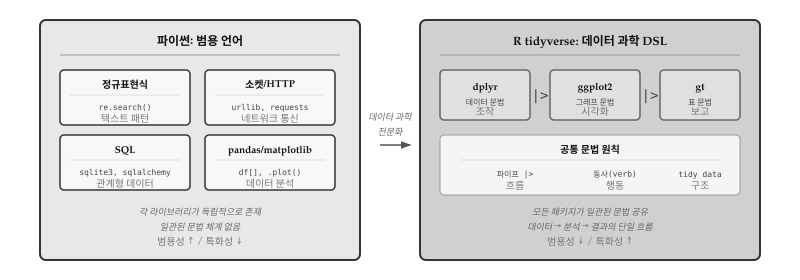
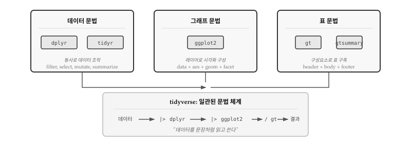
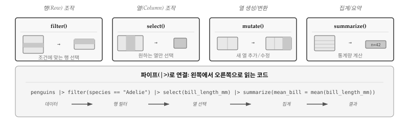
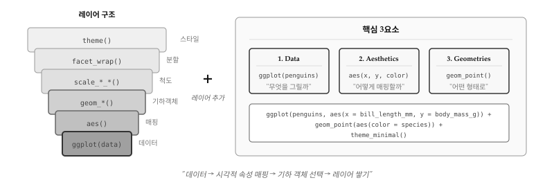
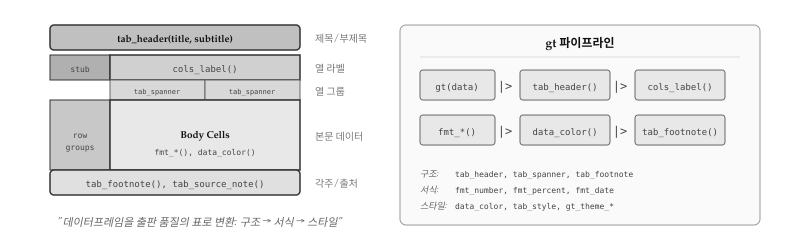
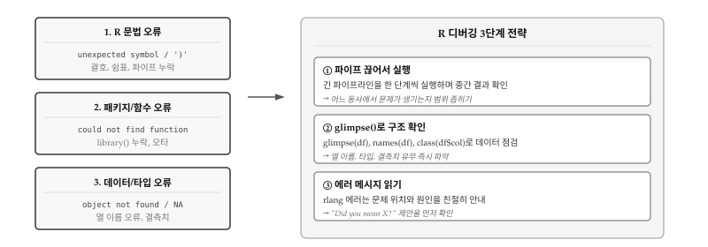

# 데이터 과학과 R {#sec-ds}

앞선 장들에서 정규표현식으로 텍스트를 다루고, 소켓으로 네트워크 통신을 하고,
SQL로 데이터베이스를 조작하는 법을 배웠다. 정규표현식, 소켓, SQL 모두 파이썬
안에서 라이브러리 형태로 사용되지만, 각각의 영역에 특화된 **도메인 특화 언어
(DSL, Domain-Specific Language)**다. 정규표현식은 패턴 매칭을, SQL은 관계형 데이터
조작을 위해 수십 년간 다듬어진 언어다. 범용 언어인 파이썬으로도 같은 작업이
가능하지만, 해당 영역에서는 DSL이 훨씬 간결하고 표현력이 높다.

\index{DSL} \index{도메인 특화 언어}

데이터 과학 역시 마찬가지다. 데이터를 불러오고, 정제하고, 변형하고, 시각화하고,
모형을 개발하고, 분석결과를 보고서로 만드는 일련의 과정은 매우 전문화된 작업이다.
파이썬 pandas, matplotlib, scikit-learn 조합으로도 데이터 과학 작업이 가능하지만,
**R과 tidyverse 생태계**는 분석 전체 흐름을 하나의 일관된 문법 체계로 통합한다.
정규표현식이 텍스트 처리의 DSL이고 SQL이 관계형 데이터의 DSL이라면, R tidyverse는
**데이터 과학의 DSL**이라 할 수 있다.

@fig-ds-dsl-landscape 는 파이썬 생태계와 R tidyverse의 근본적인 차이를 보여준다.
파이썬에서는 정규표현식, 소켓, SQL, pandas가 각각 독립된 라이브러리로 존재하며,
서로 다른 문법과 관례를 따른다. 반면 R tidyverse는 dplyr, ggplot2, gt가 파이프
연산자와 동사 체계라는 **공통 문법**을 공유하여, 데이터 조작부터 시각화, 표 제작까지
하나의 일관된 흐름으로 연결된다.

{#fig-ds-dsl-landscape}


## 데이터 과학 DSL 언어 R {#sec-ds-r-as-dsl}

R은 1993년 뉴질랜드 오클랜드 대학에서 통계학자 로스 이하카(Ross Ihaka)와
로버트 젠틀맨(Robert Gentleman)이 만든 언어다. 태생부터 **통계 분석과
데이터 시각화**를 위해 설계되었다. 벡터 연산이 기본이고, 데이터프레임이
내장 자료구조이며, 통계 함수와 그래프 기능이 언어 핵심에 포함되어 있다.

파이썬이 범용 프로그래밍의 스위스 군용 칼이라면, R은 데이터 과학에 특화된
정밀 도구다. 두 언어 모두 데이터 분석이 가능하지만, R은 통계학자와
데이터 과학자가 "생각하는 방식대로" 코드를 작성할 수 있도록 설계되었다.
**tidyverse** 생태계는 데이터 조작, 시각화, 표 제작에 일관된 **문법(grammar)**을
제공하여, 코드가 마치 데이터를 설명하는 문장처럼 읽힌다.

\index{R} \index{tidyverse} \index{데이터 과학}

R tidyverse가 데이터 과학의 DSL로 자리잡은 데는 세 가지 핵심 요소가 있다.
첫째, **파이프 연산자(`|>`)**가 데이터 흐름을 왼쪽에서 오른쪽으로 자연스럽게
표현한다. 둘째, **일관된 동사(verb) 체계**가 데이터 조작을 영어 문장처럼
읽히게 만든다. 셋째, **문법(grammar) 개념**이 시각화와 표 제작까지 확장되어,
전체 분석 과정이 하나의 언어로 통합된다.

@fig-ds-r-ecosystem 은 R 데이터 과학의 핵심 구조를 보여준다. **데이터 문법**
(dplyr), **그래프 문법**(ggplot2), **표 문법**(gt)이라는 세 기둥이 파이프(`|>`)로
연결되어, 데이터에서 결과물까지 하나의 흐름으로 이어진다. 각 패키지는 독립적으로도
강력하지만, 함께 사용할 때 시너지가 극대화된다.

{#fig-ds-r-ecosystem}


## 데이터 문법: dplyr {#sec-ds-dplyr}

R의 기본 데이터프레임 조작은 `df[df$x > 0, c("a", "b")]`처럼 대괄호와 달러 기호가
중첩되어 읽기 어렵다. 해들리 위컴(Hadley Wickham)은 2014년 dplyr을 발표하며
"데이터 조작을 **동사(verb)**로 표현하자"는 철학을 제시했다. "행을 거른다(filter)",
"열을 고른다(select)", "새 열을 만든다(mutate)"처럼 **행동을 명시적으로 선언**하면,
코드가 곧 분석 의도를 설명하는 문장이 된다.

**dplyr**은 데이터프레임을 조작하는 "동사" 모음이다. SQL의 SELECT, WHERE,
GROUP BY에 해당하는 작업을 R에서 직관적으로 수행한다. 핵심은 다섯 가지 동사:
`filter()`(행 선택), `select()`(열 선택), `mutate()`(열 생성), `summarize()`
(집계), `arrange()`(정렬)다.

\index{dplyr} \index{파이프}


### 핵심 동사 {#sec-ds-dplyr-verbs}

@fig-ds-dplyr-verbs 는 dplyr 핵심 동사가 데이터프레임에 어떤 변형을 가하는지
시각적으로 보여준다. `filter()`는 조건에 맞는 행만 남기고, `select()`는 원하는
열만 추출한다. `mutate()`는 기존 열을 변형하거나 새 열을 추가하고, `summarize()`는
여러 행을 하나의 통계량으로 요약한다. 하단의 파이프라인 예시처럼, 동사들을
`|>`로 연결하면 왼쪽에서 오른쪽으로 읽히는 자연스러운 코드가 된다.

{#fig-ds-dplyr-verbs}

```{r}
#| message: false
library(dplyr)
library(tidyr)
library(ggplot2)
library(palmerpenguins)

# 펭귄 데이터로 dplyr 핵심 동사 사용
penguins |>
  dplyr::filter(species == "Adelie") |>    # 아델리 펭귄만
  select(bill_length_mm, body_mass_g) |>   # 두 열만 선택
  mutate(bill_per_mass = bill_length_mm / body_mass_g * 1000) |>  # 새 열 생성
  summarize(
    mean_bill = mean(bill_length_mm, na.rm = TRUE),
    mean_mass = mean(body_mass_g, na.rm = TRUE)
  )
```

\index{filter} \index{select} \index{mutate} \index{summarize}


### 그룹 연산 {#sec-ds-dplyr-group}

데이터 분석에서 가장 흔한 질문은 "범주별로 어떻게 다른가?"다. 펭귄 종별 평균
체중, 섬별 개체 수, 연도별 매출 합계처럼 **그룹을 나누고 각 그룹에 대해 통계량을
계산**하는 작업이 분석의 핵심이다. SQL에서는 GROUP BY 절로 처리하는데, dplyr에서는
`group_by()`와 `summarize()`의 조합이 동일한 역할을 한다.

`group_by()`는 데이터프레임을 보이지 않게 그룹으로 나눈다. 외관상 변화는 없지만,
이후 `summarize()`나 `mutate()`가 전체 데이터가 아닌 **각 그룹 내에서만** 작동한다.
아래 예시에서 `species`와 `island` 두 열로 그룹을 나누면, 종-섬 조합마다 별도로
개체 수와 평균 체중이 계산된다.

```{r}
penguins |>
  group_by(species, island) |>   # 종과 섬으로 그룹
  summarize(
    n = n(),                      # 개체 수
    mean_mass = mean(body_mass_g, na.rm = TRUE),
    .groups = "drop"
  ) |>
  arrange(desc(mean_mass))       # 체중 내림차순 정렬
```

`group_by()` 후에는 반드시 `.groups = "drop"` 옵션을 추가하거나 `ungroup()`을
호출하는 습관이 중요하다. 옵션 없이 진행하면 후속 연산에서 예상치 못한 그룹
효과가 남아 있을 수 있다. 예를 들어, 그룹이 남아 있는 상태에서 `mutate()`를
실행하면 전체 평균이 아닌 그룹별 평균이 계산되어 의도치 않은 결과가 나온다.

\index{group\_by}


### 조인 연산 {#sec-ds-dplyr-join}

실제 데이터는 여러 테이블에 나뉘어 저장되는 경우가 많다. 고객 정보와 주문 내역,
학생 명단과 수강 기록처럼 **공통 키(key)를 기준으로 두 테이블을 합쳐야** 의미 있는
분석이 가능하다. SQL에서 JOIN으로 처리하는 작업을 dplyr에서는 `left_join()`,
`inner_join()`, `full_join()` 등으로 수행한다.

`left_join()`은 왼쪽 테이블의 모든 행을 유지하고, 오른쪽 테이블에서 일치하는
행을 붙인다. 오른쪽에 일치하는 값이 없으면 NA로 채워진다. `inner_join()`은
양쪽 모두에 일치하는 행만 남기고, `full_join()`은 양쪽 모든 행을 포함한다.
가장 흔히 사용되는 패턴은 `left_join()`으로, 기준 테이블을 유지하면서 추가
정보를 붙이는 상황에 적합하다.

아래 예시에서 `artists` 테이블에는 아티스트 정보가, `albums` 테이블에는 앨범
정보가 담겨 있다. `left_join()`으로 아티스트별 앨범 목록을 만들 수 있다.
Beatles는 앨범이 두 장이므로 두 행으로 확장된다.

```{r}
# 두 테이블 예시
artists <- tibble(
  id = 1:3,
  name = c("Beatles", "Queen", "Nirvana")
)

albums <- tibble(
  artist_id = c(1, 1, 2, 3),
  title = c("Abbey Road", "Let It Be", "A Night at the Opera", "Nevermind")
)

# left_join: 왼쪽 테이블 기준 합치기
artists |>
  left_join(albums, by = c("id" = "artist_id"))
```

`by` 인자에는 조인 기준이 되는 열을 지정한다. 양쪽 테이블에서 열 이름이 다르면
`c("왼쪽열" = "오른쪽열")` 형식으로 매핑한다. 열 이름이 같으면 `by = "열이름"`만
적어도 된다. 여러 열을 기준으로 조인할 때는 `by = c("열1", "열2")` 형식을 사용한다.

\index{left\_join} \index{inner\_join}


## 그래프 문법: ggplot2 {#sec-ds-ggplot}

전통적인 통계 그래픽 시스템은 "막대 그래프를 그려라", "산점도를 그려라"처럼
**그래프 유형 중심**으로 설계되었다. 새로운 유형이 필요하면 별도 함수를 익혀야
했다. 리랜드 윌킨슨(Leland Wilkinson)은 1999년 저서 "The Grammar of Graphics"에서
근본적으로 다른 접근을 제안했다. 모든 그래프는 **데이터**, **미적 매핑(aesthetics)**,
**기하 객체(geometries)**라는 공통 요소로 분해된다는 것이다. 막대 그래프와 산점도는
별개의 유형이 아니라, 같은 문법의 다른 조합일 뿐이다.

**ggplot2**는 위컴이 2005년 윌킨슨의 이론을 R로 구현한 패키지다.
그래프를 데이터, 미적 매핑, 기하 객체로 분해하여
레이어처럼 쌓아 올린다. "데이터를 어떻게 시각화할까"라는 질문 대신 "어떤
매핑과 어떤 도형을 쓸까"로 사고방식이 전환된다.

\index{ggplot2} \index{그래프 문법}


### 레이어 구조 {#sec-ds-ggplot-layers}

@fig-ds-ggplot-layers 는 ggplot2의 레이어 구조를 보여준다. 가장 아래 `ggplot(data)`
에서 시작하여, `aes()`로 변수를 시각적 속성에 매핑하고, `geom_*()`으로 점, 선,
막대 등 도형을 선택한다. 척도(`scale_*()`), 분할(`facet_*()`), 테마(`theme()`)를
순서대로 쌓으면 최종 그래프가 완성된다.

{#fig-ds-ggplot-layers}

```{r}
#| fig-width: 6
#| fig-height: 4
# 산점도: 부리 길이 vs 체중, 종별 형태
ggplot(penguins, aes(x = bill_length_mm, y = body_mass_g)) +
  geom_point(aes(shape = species, fill = species),
             color = "#333", alpha = 0.7, size = 2) +
  scale_shape_manual(values = c(21, 22, 24)) +
  scale_fill_manual(values = c("#333", "#777", "#bbb")) +
  labs(
    title = "펭귄 부리 길이와 체중의 관계",
    x = "부리 길이 (mm)", y = "체중 (g)",
    shape = "종", fill = "종"
  ) +
  theme_minimal(base_family = "나눔고딕") +
  theme(
    plot.title = element_text(face = "bold"),
    panel.grid.minor = element_blank(),
    panel.grid.major = element_line(color = "#ddd")
  )
```

\index{geom\_point} \index{aes}


### 다양한 geom {#sec-ds-ggplot-geoms}

ggplot2는 수십 가지 기하 객체를 제공한다. 산점도를 그리는 `geom_point()`,
선 그래프를 위한 `geom_line()`, 막대 그래프의 `geom_bar()`와 `geom_col()`,
분포를 보여주는 `geom_histogram()`과 `geom_density()` 등이 대표적이다.
데이터 유형과 분석 목적에 따라 적절한 geom을 선택하면 된다.

같은 데이터라도 geom에 따라 전혀 다른 이야기를 전달한다. 연속형 변수의 분포를
비교할 때 `geom_boxplot()`은 중앙값, 사분위수, 이상치를 명확히 보여주고,
`geom_violin()`은 분포의 모양(밀도)을 직관적으로 드러낸다. 아래 예시에서
Gentoo 펭귄의 체중이 다른 종보다 높다는 사실은 두 그래프 모두에서 확인되지만,
Chinstrap 펭귄 체중이 좁은 범위에 밀집되어 있다는 점은 바이올린 플롯에서
더 선명하게 보인다.

```{r}
#| fig-width: 7
#| fig-height: 4
#| fig-cap: "상자 그림과 바이올린 플롯 비교"
library(patchwork)

p1 <- ggplot(penguins, aes(x = species, y = body_mass_g, fill = species)) +
  geom_boxplot(show.legend = FALSE, color = "#333") +
  scale_fill_manual(values = c("#999", "#bbb", "#ddd")) +
  labs(title = "Box Plot", x = NULL, y = "체중 (g)") +
  theme_minimal(base_family = "serif") +
  theme(
    plot.title = element_text(face = "bold"),
    panel.grid.minor = element_blank(),
    panel.grid.major = element_line(color = "#ddd")
  )

p2 <- ggplot(penguins, aes(x = species, y = body_mass_g, fill = species)) +
  geom_violin(show.legend = FALSE, color = "#333") +
  scale_fill_manual(values = c("#999", "#bbb", "#ddd")) +
  labs(title = "Violin Plot", x = NULL, y = NULL) +
  theme_minimal(base_family = "나눔고딕") +
  theme(
    plot.title = element_text(face = "bold"),
    panel.grid.minor = element_blank(),
    panel.grid.major = element_line(color = "#ddd")
  )

p1 + p2
```

\index{geom\_boxplot} \index{geom\_violin}


### 분할: facet {#sec-ds-ggplot-facet}

`facet_wrap()`과 `facet_grid()`는 하나의 그래프를 범주별로 분할하여 작은
멀티플(small multiples)을 만든다. 범주 간 비교가 직관적으로 가능해진다.

`facet_wrap(~ species)`는 단일 변수(종)를 기준으로 패널을 나열한다. 패널 수가
많을 때 `ncol` 또는 `nrow` 인자로 배치를 조절한다. 반면 `facet_grid(sex ~ species)`는
두 변수를 행과 열로 교차 배치하여 2차원 격자를 만든다. 성별과 종의 조합을 한눈에
비교해야 할 때 유용하다.

분할 그래프의 핵심 가치는 "비교 용이성"에 있다. 하나의 복잡한 그래프에 모든
범주를 색상이나 기호로 구분하면 오히려 읽기 어려워진다. 패널로 분리하면 각
범주의 패턴이 명확해지고, 눈을 이동하며 비교할 수 있다. 에드워드 터프티가 말한
"작은 멀티플"의 원리가 바로 facet 함수로 구현된다.

```{r}
#| fig-width: 8
#| fig-height: 3
ggplot(penguins, aes(x = bill_length_mm, y = bill_depth_mm)) +
  geom_point(aes(shape = sex, fill = sex),
             color = "#333", alpha = 0.7, size = 2, na.rm = TRUE) +
  scale_shape_manual(values = c(21, 24), na.translate = FALSE) +
  scale_fill_manual(values = c("#666", "#bbb"), na.translate = FALSE) +
  facet_wrap(~ species, ncol = 3) +
  labs(
    title = "종별 부리 길이와 깊이",
    x = "부리 길이 (mm)",
    y = "부리 깊이 (mm)",
    shape = "성별", fill = "성별"
  ) +
  theme_bw(base_family = "나눔고딕") +
  theme(
    plot.title = element_text(face = "bold"),
    panel.grid.minor = element_blank(),
    strip.background = element_rect(fill = "#f0f0f0", color = "#333")
  )
```

\index{facet\_wrap} \index{facet\_grid}


## 표 문법: gt {#sec-ds-gt}

데이터 분석 결과를 전달할 때 그래프만으로는 부족한 경우가 많다. 정확한 수치,
p-value, 신뢰구간처럼 **숫자 그 자체가 중요한 정보**일 때 표가 필요하다. 그러나
R의 기본 출력은 콘솔용 텍스트에 불과했고, HTML이나 PDF로 내보내려면 복잡한
서식 코드를 직접 작성해야 했다. 리처드 이아넬리(Richard Iannone)는 2018년
gt 패키지를 발표하며 "표도 문법이 있다"는 철학을 제시했다.

**gt** 패키지는 데이터프레임을 출판 품질의 표로 변환한다. 그래프가 패턴을
보여준다면, 표는 정확한 수치를 전달한다. gt는 표의 구조(제목, 열 라벨, 본문,
각주)를 체계적으로 다루는 "표 문법"을 제공한다.

\index{gt} \index{표 문법}


### 표 구조 {#sec-ds-gt-structure}

gt는 표를 **구조(structure)**, **서식(format)**, **스타일(style)**의 세 층으로
나누어 다룬다. 구조는 표의 골격을 결정한다. 제목과 부제목은 `tab_header()`로,
열 이름은 `cols_label()`로, 여러 열을 묶는 상위 그룹은 `tab_spanner()`로 정의한다.
하단의 각주(`tab_footnote()`)와 출처(`tab_source_note()`)도 구조에 속한다.

서식은 **데이터 값의 표현 방식**을 바꾼다. 숫자 1234.567을 소수점 두 자리로
표시하려면 `fmt_number(decimals = 2)`, 백분율은 `fmt_percent()`, 통화는
`fmt_currency()`를 사용한다. 서식은 값 자체가 아니라 "어떻게 보여줄 것인가"에
관한 것이다. 스타일은 **셀의 시각적 외관**을 결정한다. `data_color()`로 배경색을,
`tab_style()`로 글꼴 굵기나 색상을 지정한다. 스타일은 데이터 값과 무관하게
표의 가독성과 미적 완성도를 높인다.

@fig-ds-gt-structure 는 gt 표의 해부학적 구조를 보여준다. 상단에는 제목과
부제목(`tab_header()`), 열 라벨(`cols_label()`), 열 그룹(`tab_spanner()`)이
위치한다. 중앙 본문에는 데이터 셀이 들어가고, 서식 함수(`fmt_*()`)와
조건부 색상(`data_color()`)으로 꾸밀 수 있다. 하단에는 각주(`tab_footnote()`)와
출처(`tab_source_note()`)가 배치된다.

{#fig-ds-gt-structure}


### 기본 표 생성 {#sec-ds-gt-basic}

gt 강점은 dplyr 파이프라인과 자연스럽게 연결된다는 점이다. `summarize()`로
만든 요약 데이터프레임 끝에 `gt()`를 붙이면 곧바로 출판 품질의 표가 된다.
`tab_header()`로 제목을 붙이고, `cols_label()`로 열 이름을 한글로 바꾸고,
`fmt_number()`로 소수점 자릿수를 맞추면 된다.

아래 예시는 펭귄 종별 체중 통계를 표로 정리한다. dplyr에서 gt로 이어지는
파이프라인이 "데이터 정리 → 표 생성 → 서식 적용"이라는 흐름을 명확히 보여준다.

```{r}
library(gt)

penguins |>
  group_by(species) |>
  summarize(
    n = n(),
    mean_mass = mean(body_mass_g, na.rm = TRUE),
    sd_mass = sd(body_mass_g, na.rm = TRUE),
    .groups = "drop"
  ) |>
  gt() |>
  tab_header(
    title = "펭귄 종별 체중 통계",
    subtitle = "Palmer Station LTER 데이터"
  ) |>
  cols_label(
    species = "종",
    n = "개체 수",
    mean_mass = "평균 체중",
    sd_mass = "표준편차"
  ) |>
  fmt_number(columns = c(mean_mass, sd_mass), decimals = 1)
```

\index{tab\_header} \index{cols\_label} \index{fmt\_number}


### 조건부 서식 {#sec-ds-gt-conditional}

표에서 가장 강력한 기능 중 하나가 **조건부 서식**이다. 숫자만 나열된 표에서
최댓값, 최솟값, 이상치를 찾으려면 하나하나 비교해야 한다. 조건부 서식은
값의 크기에 따라 자동으로 색상을 입혀, 눈으로 훑는 것만으로도 패턴을 파악하게
해준다.

`data_color()`는 지정한 열의 값 범위에 따라 색상 팔레트를 적용한다. 아래
예시에서 `mean_bill` 열에 흰색에서 검은색으로 이어지는 그라데이션을 적용하면,
부리 길이가 긴 종-섬 조합이 어디인지 한눈에 들어온다. 엑셀의 조건부 서식과
같은 기능이지만, 코드로 재현 가능하다는 점이 다르다.

```{r}
penguins |>
  group_by(species, island) |>
  summarize(
    n = n(),
    mean_bill = mean(bill_length_mm, na.rm = TRUE),
    .groups = "drop"
  ) |>
  gt() |>
  tab_header(title = "종-섬별 부리 길이") |>
  fmt_number(columns = mean_bill, decimals = 1) |>
  data_color(
    columns = mean_bill,
    palette = c("#ffffff", "#333333")
  )
```

\index{data\_color}


## 디버깅 {#sec-ds-debugging}

tidyverse 파이프라인은 읽기 쉽지만, 길어지면 오류 위치를 찾기 어려워진다.
`penguins |> filter() |> select() |> mutate() |> summarize()` 같은 코드에서
오류가 발생하면, 어느 단계에서 문제가 생겼는지 한눈에 파악하기 힘들다.
파이썬처럼 한 줄씩 실행하는 방식과 달리, 파이프라인은 전체가 하나의 표현식으로
평가되기 때문이다.

R tidyverse 코드에서 오류는 세 가지 층에서 발생한다. @fig-ds-debugging 은
R 문법 오류, 패키지/함수 오류, 데이터/타입 오류라는 세 가지 유형과 각각에
대응하는 디버깅 전략을 보여준다. 오류 메시지를 층별로 분류하면 해결책을
빠르게 찾을 수 있다.

{#fig-ds-debugging}


**R 문법 오류**는 가장 발견하기 쉽다. `unexpected symbol`, `unexpected ')'`
같은 메시지가 괄호, 쉼표, 파이프 누락을 알려준다. R은 파이프 `|>` 끝에서
다음 줄로 이어지는 것을 허용하지만, 줄 끝에 `|>`가 없으면 문장이 끝났다고
판단하여 오류가 발생한다.

**패키지/함수 오류**는 `could not find function "X"` 형태로 나타난다.
대부분 `library()` 호출을 잊었거나, 함수 이름에 오타가 있는 경우다.
tidyverse 함수들은 `dplyr::filter()`처럼 패키지명을 명시하면 library 없이도
사용 가능하다.

**데이터/타입 오류**가 가장 찾기 어렵다. `object 'X' not found`는 열 이름
오타, `Error in ... : non-numeric argument`는 숫자 연산에 문자열이 섞인
경우다. NA(결측치) 처리를 놓치면 `mean()`이나 `sum()` 결과가 전부 NA가
되기도 한다.


### 파이프 끊어서 실행 {#sec-ds-debug-pipe}

긴 파이프라인에서 오류가 발생하면, 파이프를 한 단계씩 끊어서 중간 결과를
확인하는 것이 가장 효과적이다. 첫 번째 동사까지만 실행하고 결과를 확인한 뒤,
문제가 없으면 두 번째 동사를 추가하는 식으로 범위를 좁혀 나간다. 오류가
발생하는 정확한 단계를 찾으면, 해당 동사의 인자(열 이름, 조건식 등)를
집중적으로 검토한다.

RStudio나 Positron에서는 파이프라인 일부를 드래그해서 선택한 뒤 Ctrl+Enter
(또는 Cmd+Enter)로 실행할 수 있다. 전체 파이프라인을 수정하지 않고도 중간
결과를 확인할 수 있어 편리하다.

```{r}
#| eval: false
# 오류가 발생하는 긴 파이프라인
penguins |>
  dplyr::filter(species == "Adelie") |>
  select(bill_length_mm, body_mass) |>    # 오타: body_mass_g가 맞음
  mutate(ratio = bill_length_mm / body_mass)

# 디버깅: 한 단계씩 실행
penguins |>
  dplyr::filter(species == "Adelie")       # 1단계: OK

penguins |>
  dplyr::filter(species == "Adelie") |>
  select(bill_length_mm, body_mass)        # 2단계: 오류 발생! → 열 이름 확인
```


### glimpse()로 구조 확인 {#sec-ds-debug-glimpse}

데이터/타입 오류의 대부분은 **데이터프레임 구조를 모르기 때문**에 발생한다.
열 이름이 `body_mass`인지 `body_mass_g`인지, 숫자로 보이는 열이 실제로
`numeric`인지 `character`인지 확인하지 않으면 오류를 피할 수 없다.

`glimpse()`는 데이터프레임의 구조를 한눈에 보여준다. 열 이름, 타입, 첫 몇 개
값을 콘솔에 출력하여 데이터의 전체 모습을 빠르게 파악할 수 있다. 새로운
데이터를 불러왔을 때, 또는 오류가 발생했을 때 가장 먼저 실행해야 할 함수다.

```{r}
glimpse(penguins)
```

열 이름을 확인하려면 `names(df)`, 특정 열의 타입을 알려면 `class(df$col)`,
결측치 개수를 파악하려면 `sum(is.na(df$col))`을 사용한다.


### 에러 메시지 읽기 {#sec-ds-debug-message}

R 초보자들은 에러 메시지를 무시하고 코드만 들여다보는 경향이 있다. 하지만
tidyverse 패키지들은 rlang 라이브러리를 기반으로 **매우 친절한 에러 메시지**를
제공한다. 오타가 있으면 "Did you mean `species`?"처럼 올바른 이름을 제안하고,
열이 없으면 어떤 열이 존재하는지 목록을 보여준다.

에러 메시지를 꼼꼼히 읽는 습관을 들이면 디버깅 시간이 크게 줄어든다. 특히
dplyr과 ggplot2의 에러 메시지는 문제의 원인과 해결 방향을 구체적으로 알려주므로,
메시지 내용을 그대로 따라가면 대부분 해결된다.

```{r}
#| error: true
# 오타가 있는 코드
penguins |>
  dplyr::filter(speices == "Adelie")   # species를 speices로 잘못 씀
```


::: callout-warning
#### NA 처리를 잊지 말자

R의 `mean()`, `sum()`, `sd()` 등 집계 함수는 NA가 하나라도 있으면 결과가
NA가 된다. 반드시 `na.rm = TRUE` 옵션을 추가하거나, 사전에 `drop_na()`로
결측치를 제거해야 한다.
:::


::: {.content-visible when-format="pdf"}
\faLightbulb\ 생각해볼 점
:::

::: {.content-visible when-format="html"}
## 💡 생각해볼 점 {.unnumbered}
:::

tidyverse는 **도메인 특화 언어(DSL)**다. SQL이 관계형 데이터베이스를 위한 언어이듯,
tidyverse는 테이블 형태 데이터를 다루기 위해 설계된 언어 체계다. `filter()`,
`select()`, `mutate()`는 R 함수이기 이전에 **데이터 조작 동사**다. "행을 거른다",
"열을 고른다", "값을 바꾼다"는 사고 자체가 코드로 직접 번역된다. 범용 언어에서
데이터를 다룰 때 겪는 번역 비용—"내가 하고 싶은 작업을 어떤 문법으로 표현하지?"
—이 tidyverse에서는 거의 사라진다.

핵심은 **선언적(declarative)** 접근이다. `penguins |> filter(species == "Adelie")`는
"아델리 종만 남겨라"라고 **무엇을** 원하는지 선언한다. 반복문을 돌며 조건을
검사하고 새 벡터에 추가하는 **어떻게**의 절차는 dplyr 내부에 숨겨진다. 선언적
코드는 읽기 쉽고, 의도가 명확하며, 실수할 여지가 적다. 데이터 분석에서 "분석
로직"과 "구현 세부사항"을 분리하는 것은 생산성과 재현가능성 모두에 결정적이다.

dplyr, ggplot2, gt는 서로 다른 영역—조작, 시각화, 표—을 다루지만 **동일한 설계
원칙**을 공유한다. 첫 인자는 언제나 데이터, 파이프로 연결 가능, 함수 이름이 곧
동작 설명. 이 일관성 덕분에 하나를 익히면 나머지가 쉬워진다. tidymodels(모델링),
tidytext(텍스트), sf(공간)처럼 확장 패키지들도 같은 문법을 따르므로, tidyverse를
익히는 것은 R 데이터 과학 생태계 전체로 가는 입장권을 얻는 것과 같다.

R의 진짜 강점은 **통계학자들이 직접 구축한 생태계**에 있다. 새로운 통계 방법론은
대부분 R 패키지로 먼저 공개된다. CRAN의 20,000개 이상 패키지 중 상당수가 논문과
함께 발표된 검증된 구현체다. 분석 결과를 논문이나 보고서로 만드는 쿼토(Quarto)
역시 R 생태계에서 출발했다. 데이터 분석의 전체 흐름—수집, 정제, 분석, 시각화,
문서화—을 하나의 일관된 문법 체계 안에서 완결짓는 것, 그것이 tidyverse가 제시하는
데이터 과학의 본질이다.

\index{탐색적 데이터 분석}
