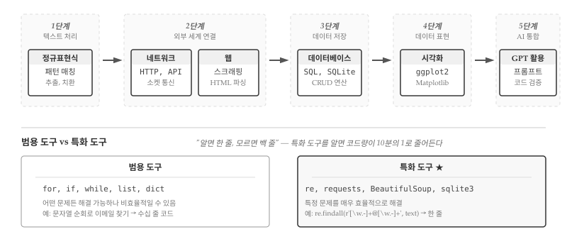

```{r}
#| include: false

source("_common.R")
```

# 특화 도구 입문 {#tool-intro}

\index{특화 도구}

프로그래밍 언어의 기본 문법을 익히고, 자료구조를 다루고, Git으로 협업하는 방법을 배웠다. `for` 루프로 반복하고, `if` 문으로 분기하고, 함수로 코드를 재사용하는 방법을 안다. 리스트와 딕셔너리에 데이터를 담고, 파일에서 읽고 쓰는 것도 할 수 있다. 하지만 막상 실제 문제 앞에 서면 막막해진다. "웹 페이지에서 뉴스 제목을 수집하고 싶은데 어디서 시작해야 하지?", "수만 건의 연구 데이터를 저장하고 검색하려면 어떻게 해야 하지?", "로그 파일에서 특정 패턴을 찾아내려면?" 기본기만으로는 이런 질문에 효율적으로 답하기 어렵다.

기본기와 실전 사이의 간극을 메우는 것이 바로 **분야별 특화 도구**다. 프로그래밍 언어의 기본 문법이 "글쓰기의 문법"이라면, 분야별 도구는 "논문 작성법", "기술 문서 작성법", "시나리오 작성법"에 해당한다. 같은 언어를 사용하더라도 목적에 맞는 도구와 관례를 알면 생산성이 몇 배로 뛰어오른다. 정규 표현식을 알면 수십 줄짜리 문자열 파싱 코드가 한 줄로 줄어든다. SQL을 알면 수십만 건의 데이터에서 원하는 정보를 순식간에 찾아낸다. BeautifulSoup을 알면 웹 페이지 구조를 손쉽게 파싱한다. 각 도구는 특정 영역에서 인류가 수십 년간 축적한 노하우의 결정체다.

4부에서는 텍스트 처리, 네트워크 통신, 웹 스크래핑, 데이터베이스, 시각화, AI 활용 등 프로그래밍의 핵심 영역을 아우르는 특화 도구를 다룬다. @fig-tool-roadmap 은 4부의 학습 흐름을 한눈에 보여준다. 텍스트에서 시작해 외부 세계로 확장하고, 데이터를 저장한 뒤 시각화로 표현하며, 최종적으로 AI와 통합하는 여정이다. 각 단계는 이전 단계 위에 쌓이면서도 독립적으로 활용 가능하다. 정규 표현식만 알아도 일상 업무가 편해지고, 네트워크와 웹까지 알면 인터넷이라는 방대한 데이터 소스에 접근할 수 있다. 데이터베이스와 시각화를 더하면 본격적인 데이터 분석이 가능해지고, AI 활용법까지 익히면 생산성이 비약적으로 향상된다.

{#fig-tool-roadmap}

필자가 처음 프로그래밍을 배울 때 가장 답답했던 점은 "문법은 아는데 뭘 만들어야 할지 모르겠다"는 느낌이었다. 변수 선언, 조건문, 반복문을 익힌 뒤에도 실제 문제를 해결하는 코드를 작성하기까지는 또 다른 학습이 필요했다. 문법과 실전을 잇는 연결 고리가 바로 분야별 도구다. 4부를 마치면 "이런 문제는 정규 표현식으로 풀면 되겠군", "이건 데이터베이스에 저장해야 효율적이겠어", "웹에서 데이터를 가져오려면 requests와 BeautifulSoup을 쓰면 되지"와 같은 판단이 자연스럽게 나온다. 도구 상자가 채워질수록 문제 해결의 선택지가 넓어지고, 코드 품질과 개발 속도 모두 향상된다.

## 범용 도구와 특화 도구 {#sec-tool-intro-general-vs-specialized}

\index{범용 도구} \index{특화 도구}

프로그래밍 도구는 크게 두 종류로 나뉜다. **범용 도구**는 어떤 문제든 해결할 수 있지만, 특정 영역에서는 비효율적이다. 반면 **특화 도구**는 특정 문제를 매우 효율적으로 해결하지만, 그 영역을 벗어나면 쓸모가 없다.

예를 들어, 이메일 주소를 추출하는 문제를 생각해보자. 범용 도구인 `for` 루프와 `if` 문만으로도 해결할 수 있다. 문자열을 한 글자씩 순회하면서 `@` 기호를 찾고, 앞뒤로 유효한 문자를 확인하면 된다. 하지만 코드가 수십 줄로 늘어나고, 엣지 케이스를 처리하다 보면 버그가 생기기 쉽다.

정규 표현식이라는 특화 도구를 사용하면 한 줄로 해결된다.

```python
import re
emails = re.findall(r'[\w.-]+@[\w.-]+', text)
```

4부에서 다루는 모든 주제가 "범용 도구로 가능하지만, 특화 도구로 더 효율적" 패턴을 따른다. 범용 도구로도 해결할 수 있지만, 특화 도구를 알면 코드가 짧아지고, 버그가 줄고, 의도가 명확해진다.

## 학습 흐름 {#sec-tool-intro-roadmap}

4부는 **텍스트에서 시작**하여 **외부 세계로 확장**하고, **데이터를 저장**한 뒤, **시각화로 표현**하고, 최종적으로 **AI와 통합**하는 흐름으로 구성된다. 각 장은 독립적으로 읽을 수 있지만, 순서대로 학습하면 개념이 자연스럽게 연결된다.

\index{정규 표현식}
여정은 **정규 표현식**에서 시작한다. 텍스트에서 패턴을 어떻게 찾을까? 정규 표현식은 패턴을 찾고, 추출하고, 치환하는 미니 언어다. 로그 파일 분석, 데이터 정제, 입력 유효성 검사에 필수적이다. `^`, `$`, `*`, `+`, `[]` 같은 특수 문자가 처음에는 암호처럼 보이지만, 익숙해지면 수십 줄 코드를 한 줄로 압축하는 강력한 도구가 된다.

\index{네트워크}
텍스트를 다룰 수 있게 되면 **네트워크**로 외부 세계와 연결한다. 다른 컴퓨터와 어떻게 통신할까? 소켓, HTTP, API 호출 등 컴퓨터 간 통신의 기초를 다룬다. 클라이언트-서버 모델, 요청과 응답, 상태 코드를 이해하면 웹 서비스와 상호작용하는 프로그램을 작성할 수 있다. 인터넷에 연결된 수십억 대의 컴퓨터가 잠재적인 데이터 소스가 된다.

\index{웹 스크래핑}
네트워크 기초 위에 **웹** 장이 놓인다. 웹 페이지에서 데이터를 어떻게 가져올까? HTML 파싱, 웹 스크래핑, 동적 페이지 처리를 다룬다. BeautifulSoup, requests 같은 라이브러리로 웹에서 데이터를 수집하고 정제하는 방법을 배운다. 뉴스 기사, 상품 가격, 연구 데이터 등 웹에 공개된 정보를 프로그래밍으로 수집할 수 있게 된다.

\index{데이터베이스} \index{SQL}
수집한 데이터는 어딘가에 저장해야 한다. **데이터베이스** 장에서는 대량의 데이터를 어떻게 저장하고 검색할지 다룬다. SQL 기초, 테이블 설계, 쿼리 작성, Python 연동을 배운다. 텍스트 파일이나 CSV로는 감당하기 어려운 수십만 건의 데이터를 효율적으로 관리하고, 복잡한 조건으로 검색하는 방법을 익힌다.

\index{시각화} \index{ggplot2} \index{Matplotlib}
저장된 데이터는 분석하고 공유해야 의미가 있다. **시각화** 장에서는 데이터를 어떻게 그래프로 표현할지 다룬다. ggplot2와 Matplotlib으로 막대 그래프, 산점도, 시계열 차트를 그리는 방법을 배운다. 탐색적 분석으로 데이터의 패턴을 발견하고, 발표용 그래프로 분석 결과를 전달하는 기술이다.

\index{GPT} \index{AI}
마지막으로 **GPT 활용** 장에서 AI와 프로그래밍을 통합한다. AI를 코딩에 어떻게 활용할까? 효과적인 프롬프트 작성, 생성된 코드 검증, AI와의 페어 프로그래밍 워크플로우를 배운다. 앞선 장에서 익힌 정규 표현식, 네트워크, 데이터베이스 지식이 있어야 AI가 생성한 코드를 제대로 평가할 수 있다.

## AI 시대에도 분야별 도구가 필요한 이유 {#sec-tool-intro-ai-era}

"AI가 코드를 대신 작성해주는데, 분야별 도구를 배울 필요가 있을까?" 챗GPT가 등장한 이후 프로그래밍 교육 현장에서 자주 듣는 질문이다. 자연어로 요청하면 코드가 뚝딱 나오는 시대에 굳이 정규 표현식 문법이나 SQL 쿼리 작성법을 암기해야 하는가? 결론부터 말하면, 오히려 더 필요하다. AI가 프로그래밍의 진입 장벽을 낮춰준 것은 사실이지만, 생성된 코드의 품질을 판단하고 실제 문제에 적용하는 능력은 여전히 인간의 몫이다.

AI가 생성한 코드를 **검증하려면** 정규 표현식, SQL, 웹 스크래핑 같은 분야별 도구를 이해해야 한다. 챗GPT에게 "로그 파일에서 IP 주소를 추출하는 정규 표현식을 작성해줘"라고 요청하면 그럴듯한 패턴이 나온다. 하지만 생성된 패턴이 IPv4만 잡는지 IPv6도 잡는지, 유효하지 않은 주소(예: 999.999.999.999)를 걸러내는지 판단하려면 정규 표현식의 기본 문법을 알아야 한다. SQL 쿼리를 생성했을 때도 마찬가지다. AI가 제안한 `SELECT * FROM users WHERE id = '` + user_input + `'` 같은 코드에서 SQL 인젝션 취약점을 발견하려면 파라미터화 쿼리가 왜 필요한지 이해하고 있어야 한다. 도구를 모르면 AI의 실수를 그대로 프로덕션에 배포하게 된다.

AI에게 **정확한 요청**을 하려면 도메인 지식이 필요하다. "이메일 주소를 추출해줘"라는 모호한 요청과 "RFC 5322 형식에 맞는 이메일 주소를 정규 표현식으로 추출하되, 도메인은 최소 2자 이상의 TLD를 포함해야 해"라는 구체적인 요청은 결과물의 품질이 다르다. "데이터를 저장해줘"보다 "SQLite 데이터베이스에 제3정규형으로 정규화된 스키마로 저장하고, 인덱스는 자주 검색되는 컬럼에만 걸어줘"가 더 나은 설계를 이끌어낸다. 프롬프트 엔지니어링의 핵심은 결국 정규 표현식, 데이터베이스, 웹 스크래핑 등 각 분야의 용어와 개념을 정확히 구사하는 것이다. 도구를 모르면 AI에게 무엇을 요청해야 하는지조차 알 수 없다.

AI가 생성한 코드를 **디버깅하고 수정하는 능력**도 도구 지식에서 나온다. 챗GPT가 BeautifulSoup으로 웹 스크래핑 코드를 작성했는데, JavaScript로 동적 렌더링되는 페이지에서 데이터를 가져오지 못한다고 하자. BeautifulSoup과 Selenium의 차이를 모르면 문제의 원인을 파악할 수 없다. AI에게 "안 돼"라고만 말하면 AI도 막연한 답변을 내놓는다. "이 페이지는 JavaScript로 콘텐츠를 로드하는데, BeautifulSoup은 정적 HTML만 파싱하잖아. Selenium이나 Playwright로 바꿔줘"라고 구체적으로 요청해야 올바른 해결책을 얻는다.

AI는 도구를 대체하는 것이 아니라 **증폭**한다. 운전자가 자동차의 원리를 몰라도 운전은 할 수 있지만, 프로페셔널 드라이버는 엔진, 서스펜션, 타이어의 특성을 이해하고 있다. 프로그래밍도 마찬가지다. AI라는 강력한 도구가 생겼지만, 기초가 탄탄한 개발자는 AI를 10배, 100배 더 효과적으로 활용한다. 4부에서 다루는 분야별 도구는 AI 시대에 쓸모없어진 지식이 아니라, AI와 협업하기 위한 필수 언어다.

::: {.content-visible when-format="pdf"}
\faLightbulb\ 생각해볼 점
:::

::: {.content-visible when-format="html"}
💡 생각해볼 점
:::

분야별 도구는 "알면 편하고, 모르면 어렵게 우회하는" 성격이 강하다. 정규 표현식 없이도 텍스트 처리가 가능하고, SQL 없이도 데이터 저장이 가능하다. 하지만 특화 도구를 알면 코드량이 10분의 1로 줄고, 버그 가능성도 현저히 줄어든다. 필자가 처음 정규 표현식을 접했을 때 "왜 진작 배우지 않았을까"라는 후회가 밀려왔던 기억이 있다. 수십 줄짜리 문자열 파싱 코드가 한 줄로 줄어드는 경험은 프로그래밍에 대한 시야를 넓혀준다.

프로그래밍 학습에서 "깊이"와 "너비" 사이의 균형은 늘 고민거리다. 4부는 너비를 넓히는 데 초점을 맞춘다. 각 장에서 핵심 개념과 자주 쓰이는 패턴을 익힌 뒤, 실제 프로젝트에서 필요할 때 깊이 파고들면 된다. 정규 표현식의 모든 메타 문자를 암기할 필요 없이, "패턴 매칭이라는 도구가 존재한다"는 사실만 알아도 문제 해결 방향이 달라진다. 마찬가지로 SQL의 복잡한 조인 문법을 당장 마스터하지 않아도, "관계형 데이터베이스가 대량 데이터 검색에 최적화되어 있다"는 개념을 이해하면 설계 단계에서 올바른 선택을 내릴 수 있다.

AI 시대에 프로그래머의 역할은 "코드 작성자"에서 "설계자이자 검증자"로 바뀌고 있다. 챗GPT에게 "웹 스크래핑 코드 작성해줘"라고 요청하면 그럴듯한 코드가 나온다. 하지만 BeautifulSoup과 Selenium의 차이를 모르면 정적 페이지에 Selenium을 쓰는 비효율적인 코드를 그대로 사용하게 된다. SQL 인젝션이 무엇인지 모르면 AI가 생성한 취약한 쿼리를 프로덕션에 배포할 수도 있다. 분야별 도구에 대한 폭넓은 이해가 있어야 AI가 생성한 코드를 평가하고, 올바른 방향으로 안내할 수 있다. 4부를 통해 도구 상자를 채우고, AI와 함께 더 생산적인 개발자가 되기를 바란다.


