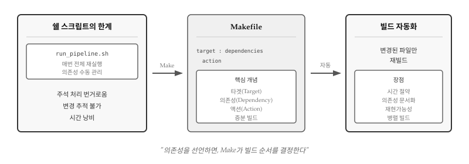
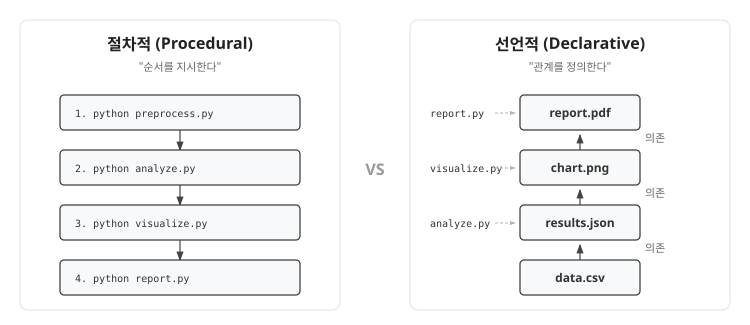
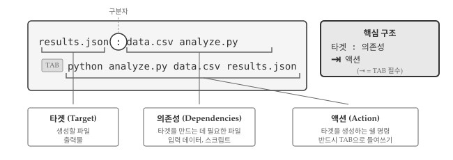
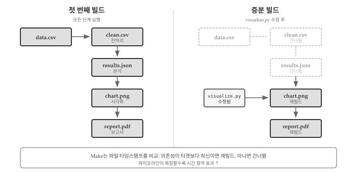
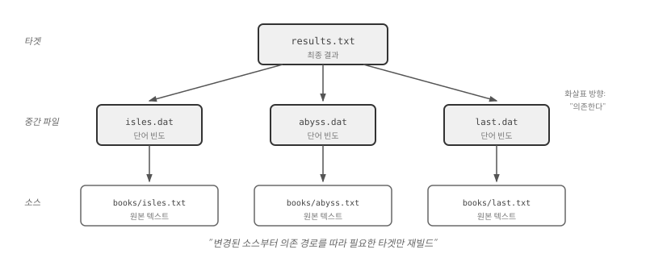
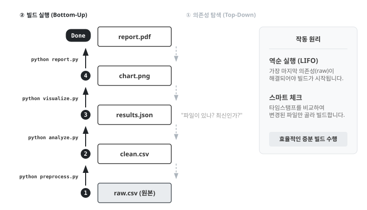
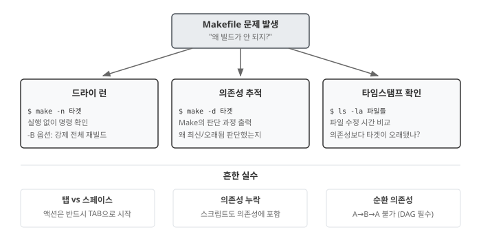

# 빌드 자동화: make {#sec-build-automation}

\index{빌드 자동화} \index{Make} \index{Makefile}

앞 장에서 파이썬 스크립트로 파일 처리를 자동화했다. 하지만 분석 파이프라인이
복잡해지면 새로운 문제가 생긴다. 원본 데이터를 전처리하고, 분석을 수행하고,
그래프를 생성하고, 보고서를 생성하는 워크플로우에서 데이터 파일 하나만 수정해도
전체를 처음부터 다시 실행해야 할까? Make는 **의존성 기반 빌드 자동화** 도구로,
"무엇이 바뀌었는지" 추적하여 필요한 단계만 재실행한다. @fig-make-overview-dsl 은
Make가 의존성을 추적하고 증분 빌드를 수행하는 전체 흐름을 보여준다.

{#fig-make-overview-dsl}


## 절차적 vs 선언적 {#sec-make-paradigm}

\index{절차적 프로그래밍} \index{선언적 프로그래밍}

쉘 스크립트로 파이프라인을 자동화하는 방식은 **절차적(procedural)**이다.
"먼저 A를 실행하고, 그 다음 B를 실행하라"고 **순서**를 지시한다.

```bash
# 절차적: 실행 순서를 명시
python preprocess.py data.csv clean.csv
python analyze.py clean.csv results.json
python visualize.py results.json chart.png
python report.py chart.png report.pdf
```

Make는 **선언적(declarative)** 접근을 취한다. "report.pdf는 chart.png에
의존하고, chart.png는 results.json에 의존한다"고 **관계**를 선언한다.
실행 순서는 Make가 알아서 결정한다. @fig-make-paradigm 에서 보듯이 절차적
방식은 실행 순서를 명시하는 반면, 선언적 방식은 파일 간 의존 관계를 선언한다.

{#fig-make-paradigm}

선언적 방식의 장점은 명확하다. 의존성 그래프만 정확하면 Make가 빌드 순서를
자동으로 도출한다. 새 단계를 추가해도 전체 순서를 재검토할 필요 없이 해당
단계의 의존성만 선언하면 된다. 병렬 실행(`make -j4`)도 Make가 의존성을 보고
안전하게 처리한다. 무엇보다 **의도가 명확**해진다. 쉘 스크립트는 "어떻게
빌드하는가"를 나열하지만, Makefile은 "무엇이 무엇에서 생성되는가"를 선언한다.

::: callout-tip
### 병렬 실행

\index{병렬 실행}

`make -j4`는 **4개 프로세스로 동시에 빌드**하라는 옵션이다. `-j`는 jobs(작업)의
약자이고, 숫자는 동시 실행할 작업 수다.

```makefile
# book1.dat, book2.dat, book3.dat, book4.dat이 서로 독립적이면
all : book1.dat book2.dat book3.dat book4.dat
```

- `make` : 순차 실행 (1→2→3→4)
- `make -j4` : 4개를 동시에 실행 (1,2,3,4 병렬)

CPU 코어가 4개면 `-j4`, 8개면 `-j8`로 설정한다. Make가 의존성 그래프를 분석해서
안전하게 병렬화할 수 있는 작업만 동시에 실행하므로, 사용자가 순서를 신경 쓸
필요가 없다.
:::


## 규칙의 구조 {#sec-make-rule}

\index{타겟} \index{의존성} \index{액션}

Makefile의 기본 단위는 **규칙(rule)**이다. 규칙 하나가 "report.pdf를 만들려면
chart.png가 필요하고, python report.py를 실행하라"는 빌드 단계를 정의한다.
Makefile 전체는 규칙들의 집합이며, Make는 규칙들 사이의 의존 관계를 파악하여
올바른 순서로 실행한다. 규칙은 @fig-make-rule 과 같이 세 부분으로 구성된다.

```makefile
타겟 : 의존성
	액션
```

{#fig-make-rule}

- **타겟(target)**: 생성할 파일. `report.pdf`, `results.json` 같은 출력물
- **의존성(dependency)**: 타겟을 만드는 데 필요한 파일. 입력 데이터나 스크립트
- **액션(action)**: 타겟을 생성하는 쉘 명령. 반드시 **탭 문자**로 들여쓴다

```makefile
results.json : data.csv analyze.py
	python analyze.py data.csv results.json
```

`results.json`은 `data.csv`와 `analyze.py`에 의존한다. 둘 중 하나라도
`results.json`보다 최신이면 액션이 실행된다. 이미 최신이면 "up to date"로
건너뛴다. 타임스탬프 비교가 **증분 빌드(incremental build)**의 핵심이다.

::: callout-warning
### 탭 문자 필수

액션 줄은 반드시 **탭(TAB) 문자**로 들여써야 한다. 스페이스가 아니다.
1970년대 설계의 유산이지만 여전히 그대로다. 대부분의 에디터는 Makefile을
인식하면 자동으로 탭을 사용한다.
:::


## 증분 빌드 {#sec-make-incremental}

\index{증분 빌드} \index{타임스탬프}

Make의 핵심 가치는 **불필요한 재실행을 피하는 것**이다. 데이터 분석에서
전처리가 10분, 모델 학습이 1시간 걸린다고 하자. 시각화 코드만 수정했는데
매번 1시간 10분을 기다려야 한다면 생산성이 떨어진다. Make는 **파일
타임스탬프**를 비교하여 변경된 부분만 재빌드한다. @fig-make-incremental 은
타임스탬프 비교를 통해 재빌드 여부를 결정하는 과정을 보여준다.

{#fig-make-incremental}

```bash
$ make report.pdf
python preprocess.py data.csv clean.csv
python analyze.py clean.csv results.json
python visualize.py results.json chart.png
python report.py chart.png report.pdf

$ touch visualize.py   # 시각화 스크립트만 수정
$ make report.pdf
python visualize.py results.json chart.png   # 여기서부터만 재실행
python report.py chart.png report.pdf
```

`data.csv`가 바뀌면 전체가 재실행되고, `visualize.py`만 바뀌면 시각화
이후 단계만 재실행된다. 파이프라인이 복잡할수록 시간 절약 효과가 커진다.


## 의존성 그래프 {#sec-make-dag}

\index{의존성 그래프} \index{DAG}

여러 규칙을 조합하면 **의존성 그래프(dependency graph)**가 형성된다.
Make는 그래프를 따라 올라가며 필요한 파일을 순서대로 빌드한다. 순환
의존성(A→B→C→A)은 허용되지 않으므로, 그래프는 항상 방향성 비순환
그래프(DAG)다.

```makefile
# 최종 산출물
report.pdf : chart.png report.py
	python report.py chart.png report.pdf

# 시각화
chart.png : results.json visualize.py
	python visualize.py results.json chart.png

# 분석
results.json : clean.csv analyze.py
	python analyze.py clean.csv results.json

# 전처리
clean.csv : data.csv preprocess.py
	python preprocess.py data.csv clean.csv
```


{#fig-make-dependency-dag}

@fig-make-dependency-dag 는 위 Makefile의 의존성 그래프를 시각화한 것이다.
`make report.pdf`를 실행하면 Make는 그래프를 역순으로 탐색한다.
`report.pdf` → `chart.png` → `results.json` → `clean.csv` → `data.csv`.
각 단계에서 타겟이 의존성보다 오래됐는지 확인하고, 필요한 것만 재빌드한다.


## 패턴과 변수 {#sec-make-patterns}

\index{패턴 규칙} \index{자동 변수}

`book1.dat`, `book2.dat`, `book3.dat`를 빌드하는 규칙이 모두 같다면, 세 개의
규칙을 따로 작성하는 건 낭비다. 파일이 100개로 늘어나면 Makefile도 100배로
길어진다. **패턴 규칙**은 `%` 와일드카드로 "`.dat` 파일은 모두 같은 방식으로
빌드하라"고 한 번에 선언한다. **변수**는 파이썬 버전이나 파일 목록처럼 반복되는
값을 한 곳에서 관리하게 해준다. 둘을 조합하면 Makefile의 길이는 파일 수에
관계없이 일정하게 유지된다.

```makefile
%.dat : books/%.txt
	python wordcount.py $< $@
```

`%`는 임의의 문자열과 매칭된다. `book1.dat`을 빌드할 때 `%`가 `book1`로 치환되어
`books/book1.txt`가 의존성이 된다. 액션에서 `$<`와 `$@`는 **자동 변수**로,
각각 첫 번째 의존성(`books/book1.txt`)과 타겟(`book1.dat`)으로 대체된다.

| 변수 | 의미 |
|------|------|
| `$@` | 현재 타겟 |
| `$<` | 첫 번째 의존성 |
| `$^` | 모든 의존성 |

**사용자 정의 변수**는 Makefile 상단에 선언하여 반복되는 값을 한 곳에서 관리한다.

```makefile
PYTHON = python3
DATA = book1.dat book2.dat book3.dat

results.txt : $(DATA)
	$(PYTHON) analyze.py $^ > $@

%.dat : books/%.txt
	$(PYTHON) wordcount.py $< $@
```

`$(PYTHON)`은 `python3`으로, `$(DATA)`는 세 파일 목록으로 확장된다. 새 책
`book4.txt`를 추가하려면 `DATA` 줄에 `book4.dat`만 추가하면 된다. 파이썬 버전을
`python3.11`로 바꾸려면 `PYTHON` 한 줄만 수정하면 Makefile 전체에 반영된다.
변경 지점이 한 곳으로 집중되어 유지보수가 쉬워진다.


## 관례와 패턴 {#sec-make-conventions}

\index{.PHONY} \index{all} \index{clean}

처음 Makefile을 열면 `all`, `clean`, `help` 같은 타겟이 눈에 띈다. 실제 파일을
생성하지 않는데 왜 있을까? Make 커뮤니티에서 수십 년간 축적된 **관례**다.
`make`만 입력하면 전체 빌드가 실행되고, `make clean`으로 생성물을 정리하고,
`make help`로 사용법을 확인한다. 프로젝트마다 빌드 명령을 외울 필요 없이,
관례만 알면 어떤 Makefile이든 바로 사용할 수 있다.

**all**은 Makefile의 "기본 진입점"이다. 타겟을 지정하지 않고 `make`만 실행하면
Make는 파일의 첫 번째 타겟을 빌드한다. `all`을 맨 위에 두고 최종 산출물을
의존성으로 연결하면, 사용자는 세부 타겟을 몰라도 `make` 한 번으로 전체를
빌드할 수 있다.

```makefile
.PHONY : all
all : report.pdf
```

**clean**은 "백지 상태로 되돌리기"다. 분석 결과가 이상하거나 중간 파일이
꼬였을 때, `make clean && make`로 처음부터 다시 빌드한다. 생성된 모든 파일을
삭제하므로 원본 데이터와 스크립트만 남는다. 재현가능한 분석의 핵심은
`clean` 후에도 `make`만으로 동일한 결과를 얻을 수 있어야 한다는 점이다.

```makefile
.PHONY : clean
clean :
	rm -f *.dat results.txt report.pdf
```

`.PHONY` 선언이 왜 필요할까? Make는 타겟 이름과 같은 파일이 존재하면 "이미
최신"이라고 판단하여 액션을 건너뛴다. 만약 프로젝트에 `clean`이라는 파일이
실수로 생성되면 `make clean`이 동작하지 않는다. `.PHONY`는 "타겟 이름과
상관없이 항상 액션을 실행하라"고 지시한다.

**help**는 Makefile의 사용 설명서다. 복잡한 프로젝트에서 어떤 타겟이 있는지,
각 타겟이 무엇을 하는지 한눈에 파악할 수 있다.

```makefile
.PHONY : help
help :
	@echo "사용 가능한 타겟:"
	@echo "  all     - 전체 빌드"
	@echo "  clean   - 생성 파일 삭제"
	@echo "  report  - 보고서 생성"
```

`@` 접두사는 명령어 자체를 화면에 출력하지 않는다. `@` 없이 `echo "hello"`를
실행하면 `echo "hello"`와 `hello`가 모두 출력되지만, `@echo "hello"`는
`hello`만 출력한다. 사용자에게 깔끔한 출력을 보여주고 싶을 때 사용한다.


## 실전 패턴 {#sec-make-practice}

\index{드라이 런}

지금까지 배운 개념을 실제 데이터 분석 프로젝트에 적용해보자. 원본 데이터에서
보고서까지 이어지는 파이프라인을 Makefile 하나로 관리한다. 핵심은 **각 단계를
독립적인 규칙으로 분리**하고, 의존성으로 연결하는 것이다. 전처리 스크립트가
바뀌면 전처리부터 보고서까지 재실행되고, 시각화 스크립트만 바뀌면 시각화와
보고서만 재실행된다. @fig-make-execution-flow 는 Make가 의존성을 역추적한 뒤
아래에서 위로 빌드하는 과정을 보여준다.

{#fig-make-execution-flow}

```makefile
PYTHON = python3
DATA_DIR = data
OUTPUT_DIR = output

.PHONY : all clean

all : $(OUTPUT_DIR)/report.pdf

$(OUTPUT_DIR)/report.pdf : $(OUTPUT_DIR)/chart.png scripts/report.py
	$(PYTHON) scripts/report.py $< $@

$(OUTPUT_DIR)/chart.png : $(OUTPUT_DIR)/results.json scripts/visualize.py
	$(PYTHON) scripts/visualize.py $< $@

$(OUTPUT_DIR)/results.json : $(DATA_DIR)/clean.csv scripts/analyze.py
	$(PYTHON) scripts/analyze.py $< $@

$(DATA_DIR)/clean.csv : $(DATA_DIR)/raw.csv scripts/preprocess.py
	$(PYTHON) scripts/preprocess.py $< $@

clean :
	rm -rf $(OUTPUT_DIR)/*
```

Makefile을 읽는 순서와 Make가 실행하는 순서는 **정반대**다. 사용자가
`make report.pdf`를 입력하면, Make는 `report.pdf`부터 시작해서 의존성을
역으로 추적한다. `chart.png`가 필요하고, `chart.png`를 만들려면 `results.json`이
필요하고... 결국 `raw.csv`까지 거슬러 올라간다. 그런 다음 **가장 아래에서부터
위로** 빌드를 시작한다. 의존성 그래프의 리프(leaf) 노드에서 루트(root) 노드
방향으로 실행되는 것이다.

스크립트 파일도 의존성에 포함시킨 점에 주목하자. `scripts/analyze.py`가
수정되면 `results.json`이 재생성되고, 그 아래 단계도 연쇄적으로 재빌드된다.
스크립트 변경을 의존성에 반영하지 않으면 "코드를 수정했는데 왜 결과가 안 바뀌지?"
하는 혼란이 생긴다.


## 디버깅 {#sec-make-debugging}

\index{디버깅!Make}

Makefile이 예상대로 동작하지 않을 때, 문제의 원인을 빠르게 파악하는 방법을
알아야 한다. Make는 의존성 그래프를 자동으로 계산하므로, "왜 이 규칙이
실행되지 않지?" 또는 "왜 최신인데 다시 빌드하지?"라는 질문에 답하려면
Make의 판단 과정을 들여다봐야 한다. @fig-make-debug 는 Make 디버깅의 세 가지
접근법—드라이 런, 의존성 추적, 흔한 실수 점검—을 요약한다.

{#fig-make-debug}

### 드라이 런 {#sec-make-dry-run}

\index{드라이 런}

`-n` 옵션(또는 `--dry-run`)은 **실제로 실행하지 않고** 무엇이 실행될지만
보여준다. 복잡한 파이프라인을 처음 테스트하거나, 특정 파일을 수정한 후
어떤 단계가 재실행되는지 확인할 때 유용하다.

```bash
$ make -n report.pdf
python scripts/preprocess.py data/raw.csv data/clean.csv
python scripts/analyze.py data/clean.csv output/results.json
python scripts/visualize.py output/results.json output/chart.png
python scripts/report.py output/chart.png output/report.pdf
```

`-n`과 함께 `-B` 옵션을 사용하면 모든 타겟을 "오래된 것"으로 간주하여
전체 빌드 과정을 확인할 수 있다.

### 의존성 추적 {#sec-make-debug-deps}

\index{의존성 추적}

"왜 빌드가 안 되지?"라는 질문에는 `-d` 옵션이 답한다. Make의 의사결정 과정을
상세하게 출력한다. 출력량이 많으므로 파이프로 `less`에 연결하거나 파일로
리다이렉트하는 편이 좋다.

```bash
$ make -d report.pdf 2>&1 | head -50
```

특정 타겟이 왜 최신으로 판단되는지, 어떤 의존성이 누락됐는지 파악할 수 있다.
`--debug=v`(verbose)나 `--debug=b`(basic)로 출력 수준을 조절할 수 있다.

### 흔한 실수 {#sec-make-common-errors}

\index{탭 문자}

**탭 대신 스페이스**: 가장 흔한 실수다. 액션 줄은 반드시 탭으로 시작해야 한다.
스페이스로 들여쓰면 `missing separator` 오류가 발생한다.

```bash
Makefile:5: *** missing separator.  Stop.
```

대부분의 에디터는 Makefile을 인식하면 자동으로 탭을 사용하지만, 복사-붙여넣기
과정에서 탭이 스페이스로 변환되는 경우가 있다.

**의존성 누락**: 스크립트 파일을 의존성에 포함하지 않으면, 스크립트를 수정해도
Make는 타겟이 최신이라고 판단한다. "코드를 바꿨는데 왜 결과가 그대로지?"라는
질문의 원인이 대부분 여기에 있다.

**순환 의존성**: `A`가 `B`에 의존하고 `B`가 `A`에 의존하면 Make는 오류를 낸다.

```bash
make: Circular report.pdf <- chart.png dependency dropped.
```

의존성 그래프는 반드시 DAG(방향성 비순환 그래프)여야 한다.


::: {.content-visible when-format="pdf"}
\faLightbulb\ 생각해볼 점
:::

::: {.content-visible when-format="html"}
## 💡 생각해볼 점 {.unnumbered}
:::

Make는 1976년 스튜어트 펠드만(Stuart Feldman)이 벨 연구소에서 만들었다.
거의 50년이 지났지만 여전히 현역이다. 핵심 통찰—**"무엇이 무엇에 의존하는가"를
선언하면 "어떤 순서로 빌드할까"는 기계가 알아서 계산한다**—이 시대를 초월하기
때문이다. 절차적 스크립트가 "1번 실행, 2번 실행, 3번 실행"을 나열하는 동안,
Make는 "A는 B에서 나온다"라는 관계만 선언하고 실행 순서는 의존성 그래프에서
자동으로 도출한다. 선언적 프로그래밍의 원형을 배우는 셈이다.

Makefile은 **실행 가능한 문서**다. 프로젝트를 처음 접한 사람이 Makefile을
읽으면 "raw.csv에서 clean.csv가, clean.csv에서 results.json이, results.json에서
chart.png가, chart.png에서 report.pdf가 생성된다"는 파이프라인 구조를 한눈에
파악할 수 있다. README에 "이 순서로 실행하세요"라고 적어두면 문서가 코드와
따로 놀기 마련이지만, Makefile은 문서이면서 동시에 실행 로직이다. 6개월 뒤
분석을 재현하려면 `make all` 한 번이면 된다.

Make의 진짜 가치는 **증분 빌드**에 있다. 전체 파이프라인이 10분 걸린다고 하자.
시각화 스크립트만 수정했는데 매번 전처리부터 다시 돌리는 건 낭비다. Make는
타임스탬프를 비교해서 "visualize.py가 chart.png보다 새로우니 chart.png와
report.pdf만 재빌드"한다고 판단한다. 데이터 과학 프로젝트에서 분석 코드는
수십 번 수정되지만 원본 데이터는 거의 바뀌지 않는다. 증분 빌드는 개발 속도를
획기적으로 높인다.

현대 빌드 도구들—Snakemake, Nextflow, doit, CMake—도 모두 같은 원리 위에
서 있다. 문법만 다를 뿐 "타겟-의존성-액션"이라는 핵심 구조는 동일하다.
Make를 제대로 이해하면 어떤 빌드 시스템이든 빠르게 익힐 수 있다. 50년 된
도구를 배우는 게 아니라, 빌드 자동화의 **공통 언어**를 익히는 것이다.

\index{재현가능성} \index{Snakemake} \index{Nextflow} \index{스튜어트 펠드만}
