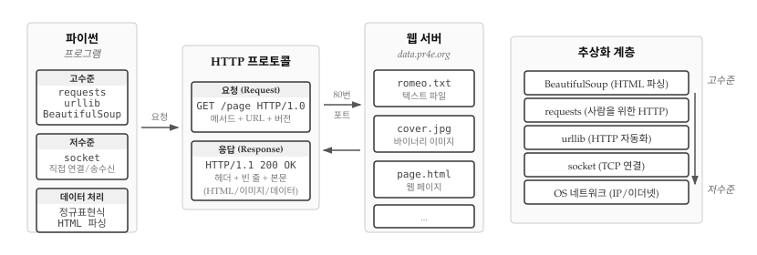
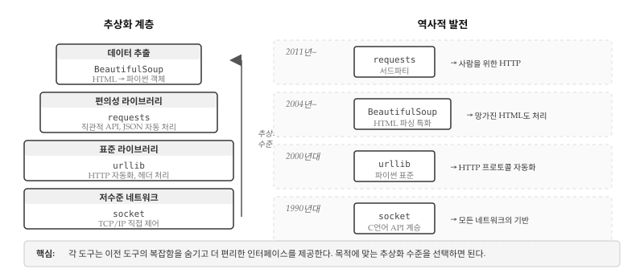
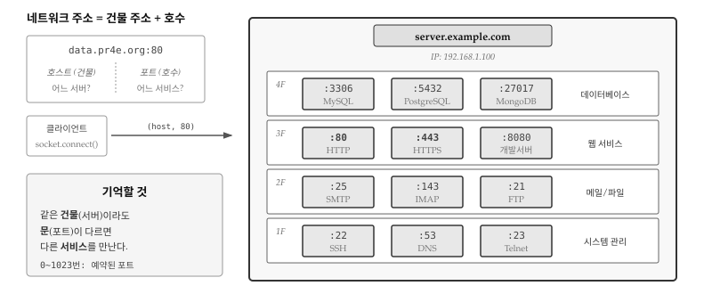
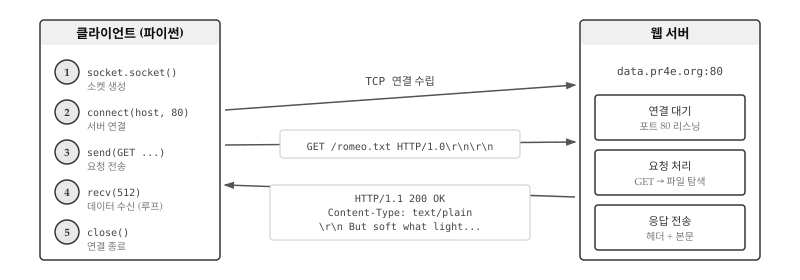
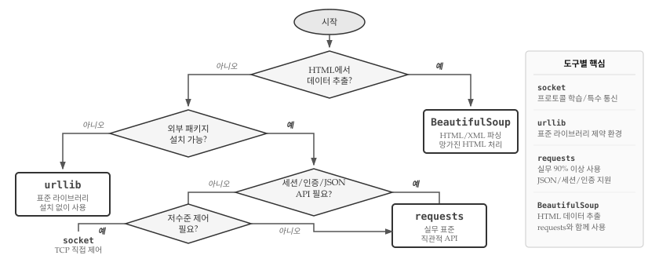
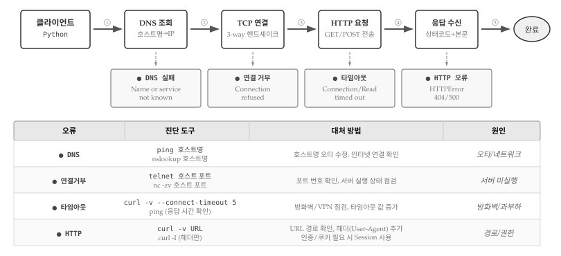

# 네트워크 프로그램 {#sec-network}

앞선 장에서 파일을 읽고 정보를 추출하는 데 집중했다면, 세상에는 인터넷이라는 거대한 정보의 바다가 있다. 웹 브라우저가 매일 수행하는 작업, 즉 HTTP 프로토콜(HyperText Transport Protocol)을 통해 웹 페이지를 가져오는 과정을 파이썬으로 직접 구현해 본다. 웹 페이지 데이터를 읽고 파싱하는 기법을 익히면, 프로그래밍으로 웹의 모든 정보에 접근할 수 있다.

{#fig-network-overview}

## 왜 이렇게 많은 도구가 있을까? {#sec-network-why}

네트워크 프로그래밍을 처음 접하면 `socket`, `urllib`, `requests`, `BeautifulSoup` 등 수많은 패키지가 등장해 혼란스럽다. 왜 하나의 도구로 모든 것을 해결하지 않고 이렇게 여러 도구가 존재하는 것일까? 답은 **추상화(abstraction)**에 있다.

{#fig-network-layers}

컴퓨터 과학의 역사는 복잡함을 숨기고 더 편리한 인터페이스를 제공하는 추상화의 역사다. 1990년대 파이썬이 등장했을 때, 네트워크 프로그래밍은 C 언어 소켓 API를 그대로 계승한 `socket` 모듈로 시작했다. 소켓은 TCP/IP 연결을 직접 제어할 수 있어 강력하지만, HTTP 요청 하나를 보내려면 연결 수립, 요청 문자열 조립, 바이트 인코딩, 응답 파싱, 헤더 분리 등 수십 줄의 코드가 필요했다.

2000년대 웹이 폭발적으로 성장하면서, 파이썬 표준 라이브러리에 `urllib`이 추가되었다. HTTP 프로토콜 세부 사항을 자동으로 처리해주기 때문에 URL만 지정하면 웹 페이지를 가져올 수 있게 되었다. 하지만 `urllib` API는 여전히 직관적이지 않았고, 세션 관리나 JSON 처리 같은 현대적 요구를 충족하기 어려웠다.

2011년 케네스 레이츠(Kenneth Reitz)가 "사람을 위한 HTTP(HTTP for Humans)"라는 슬로건으로 `requests` 라이브러리를 공개했다. `requests`는 `urllib` 위에 구축되어 같은 기능을 수행하지만, API가 훨씬 직관적이고 JSON 응답을 딕셔너리로 바로 변환하는 등 개발자 경험을 크게 개선했다. 파이썬 커뮤니티에서 사실상 표준으로 자리 잡아, 표준 라이브러리가 아님에도 대부분의 프로젝트에서 사용된다.

한편 2004년 레오나드 리처드슨(Leonard Richardson)이 만든 `BeautifulSoup`은 HTML 파싱이라는 특정 문제에 집중했다. 웹 페이지를 가져오는 것과 그 안에서 데이터를 추출하는 것은 별개의 문제다. 현실의 HTML은 태그가 닫히지 않거나 중첩이 잘못된 경우가 많다. BeautifulSoup은 이렇게 **망가진 HTML**도 웹 브라우저처럼 오류 없이 파싱하여 데이터를 추출할 수 있는 기능을 제공한다.

결국 각 도구는 서로 다른 추상화 수준에서 서로 다른 문제를 해결한다. `socket`은 네트워크의 기본 원리를 이해하고 특수한 프로토콜을 구현할 때 필요하다. `urllib`는 외부 의존성 없이 간단한 HTTP 요청을 보낼 때 적합하다. `requests`는 실무에서 HTTP 통신을 편리하게 처리할 때 최선의 선택이다. `BeautifulSoup`은 HTML에서 데이터를 추출할 때 사용한다. **어떤 도구가 좋고 나쁜 게 아니라, 목적에 맞는 추상화 수준을 선택하면 된다.**

## 하이퍼텍스트 전송 프로토콜 {#sec-network-http}

\index{HTTP}
\index{프로토콜}

웹에 동력을 공급하는 네트워크 프로토콜인 HTTP는 생각보다 단순하다. 파이썬에는 `socket`이라는 내장 모듈이 있어서 네트워크 연결과 데이터 검색을 쉽게 처리할 수 있다.

\index{소켓}
**소켓(socket)**은 두 프로그램 사이에 양방향 연결을 제공한다는 점에서 파일과 유사하다. 동일한 소켓으로 데이터를 읽거나 쓸 수 있으며, 한쪽에서 데이터를 쓰면 다른 쪽 응용 프로그램이 이를 받게 된다. 전화기 수화기를 떠올리면 이해하기 쉽다. 연결을 맺고, 말하고 듣고, 통화를 끝내는 과정이 소켓 통신과 같다.

소켓의 다른 쪽 끝에서 아무 데이터도 보내지 않았는데 읽으려고 하면, 프로그램은 데이터가 올 때까지 멈춘 채 기다린다. 양쪽 모두 기다리기만 한다면 영원히 멈춰 있게 된다. 인터넷 통신에서 **프로토콜(protocol)**이 중요한 이유가 여기에 있다. 프로토콜은 누가 먼저 메시지를 보내고, 어떤 형식으로 보내며, 어떻게 응답하는지를 정의한 규칙 집합이다.

{#fig-network-services}

@fig-network-services 는 네트워크 주소를 건물 주소에 비유한다. 호스트 이름이 건물 주소라면, 포트 번호는 그 건물 안의 호수(문 번호)다. 소켓의 강력함은 포트 번호만 바꾸면 웹 서버뿐 아니라 메일 서버, 파일 서버, 데이터베이스 서버 등 어떤 서비스와도 통신할 수 있다는 점이다. HTTP는 80번 포트를, HTTPS는 443번을, 메일 전송(SMTP)은 25번을, 파일 전송(FTP)은 21번을, 원격 접속(SSH)은 22번을 사용한다. 각 서비스마다 고유한 프로토콜 규칙이 있지만, 소켓 수준에서 연결을 맺고 데이터를 주고받는 방식은 동일하다.

::: {.callout-note}
## 프로토콜 역사: HTTP 이전과 이후

HTTP(1991)가 등장하기 전에도 인터넷에는 다양한 프로토콜이 존재했다. **텔넷(Telnet, 1969)**은 원격 컴퓨터에 접속하는 최초의 프로토콜이었고, **FTP(1971)**는 파일 전송을, **SMTP(1982)**는 이메일 전송을 담당했다. **SSH(1995)**는 보안이 취약한 텔넷을 대체하며 암호화된 원격 접속을 제공했다.

그렇다면 왜 네트워크 프로그래밍에서 HTTP가 가장 중요하게 다뤄질까? 1990년대 월드와이드웹(WWW)의 폭발적 성장과 함께 HTTP는 단순한 웹 페이지 전송을 넘어 **범용 데이터 교환 프로토콜**로 진화했다. 오늘날 REST API, JSON 데이터 교환, 클라우드 서비스 등 거의 모든 웹 기반 서비스가 HTTP/HTTPS 위에서 동작한다.

다른 프로토콜이 사라진 것은 아니다. SMTP는 여전히 모든 이메일의 기반이고, SSH는 서버 관리의 필수 도구다. FTP는 SFTP로 진화하여 대용량 파일 전송에 사용된다. 다만 **일반 개발자가 직접 다루는 프로토콜**이 HTTP로 수렴했을 뿐이다. 메일을 보내도 Gmail API(HTTP)를 호출하고, 파일을 업로드해도 클라우드 스토리지 API(HTTP)를 사용하는 시대가 되었다.
:::

HTTP 프로토콜 전체 명세는 RFC2616 문서에 176페이지에 걸쳐 상세히 기술되어 있다.^[<http://www.w3.org/Protocols/rfc2616/rfc2616.txt>] 핵심만 요약하면, 웹 서버에 문서를 요청하려면 80번 포트로 서버에 연결한 뒤 다음 형식의 한 줄을 전송한다.

```
GET http://data.pr4e.org/romeo.txt HTTP/1.0
```

첫 번째 단어 `GET`은 HTTP 메서드로 데이터를 가져오겠다는 의미다. 두 번째 부분은 요청하는 웹 페이지 경로다. 세 번째는 HTTP 버전이다. 요청 후에는 빈 줄을 하나 더 보내야 한다. 서버는 문서에 대한 헤더 정보를 보내고, 빈 줄로 헤더 끝을 알린 후, 실제 문서 본문을 전송한다.


## 소켓으로 웹 페이지 가져오기 {#sec-network-socket}

\index{socket!connect}
\index{socket!send}
\index{socket!recv}

HTTP 프로토콜이 어떻게 작동하는지 가장 직접적으로 알 수 있는 방법은 소켓 프로그램을 작성하는 것이다. 웹 서버에 접속하고, HTTP 규칙에 따라 문서를 요청하고, 서버가 보내주는 응답을 출력하는 간단한 웹 브라우저를 만들어 본다. @fig-network-socket-http 는 클라이언트와 서버 간 HTTP 통신의 전체 흐름을 보여준다. 클라이언트는 소켓을 생성하고(`socket.socket()`), 서버에 연결한 뒤(`connect()`), 요청을 보내고(`send()`), 응답을 받아(`recv()`), 마지막으로 연결을 닫는다(`close()`). 서버는 포트 80에서 대기하다가 요청이 들어오면 파일을 찾아 헤더와 본문을 응답한다.

{#fig-network-socket-http}

```{python}
#| label: py-socket-example
#| eval: false
import socket

mysock = socket.socket(socket.AF_INET, socket.SOCK_STREAM)
mysock.connect(('data.pr4e.org', 80))
cmd = 'GET http://data.pr4e.org/romeo.txt HTTP/1.0\r\n\r\n'.encode()
mysock.send(cmd)

while True:
    data = mysock.recv(512)
    if len(data) < 1:
        break
    print(data.decode(), end='')

mysock.close()
```

`socket.socket()` 함수로 소켓 객체를 생성한다. `AF_INET`은 인터넷 프로토콜(IPv4)을 사용하겠다는 의미이고, `SOCK_STREAM`은 TCP 연결을 뜻한다. `connect()` 메서드로 서버의 80번 포트에 연결한다.

\index{포트}
**포트(port)**는 컴퓨터 내에서 특정 서비스를 식별하는 번호다. IP 주소가 건물 주소라면, 포트 번호는 그 건물 안의 호수와 같다. HTTP는 80번, HTTPS는 443번 포트를 기본으로 사용한다.

연결이 수립되면 `send()` 메서드로 GET 요청을 전송한다. 문자열 끝에 붙은 `\r\n\r\n`은 캐리지 리턴과 줄 바꿈 두 번으로, HTTP 요청의 끝을 알리는 빈 줄을 의미한다. `encode()` 메서드는 문자열을 바이트로 변환하는데, 네트워크 통신은 바이트 단위로 이루어지기 때문이다.

응답을 받을 때는 `recv(512)` 메서드로 512바이트씩 데이터를 읽는다. 더 이상 읽을 데이터가 없으면 빈 바이트열이 반환되고, 이때 루프를 종료한다. `decode()` 메서드는 바이트를 다시 문자열로 변환한다.

프로그램 실행 결과는 다음과 같다.

```bash
HTTP/1.1 200 OK
Date: Wed, 11 Apr 2018 18:52:55 GMT
Server: Apache/2.4.7 (Ubuntu)
Last-Modified: Sat, 13 May 2017 11:22:22 GMT
ETag: "a7-54f6609245537"
Accept-Ranges: bytes
Content-Length: 167
Cache-Control: max-age=0, no-cache, no-store, must-revalidate
Pragma: no-cache
Expires: Wed, 11 Jan 1984 05:00:00 GMT
Connection: close
Content-Type: text/plain

But soft what light through yonder window breaks
It is the east and Juliet is the sun
Arise fair sun and kill the envious moon
Who is already sick and pale with grief
```

출력의 첫 부분은 서버가 보낸 **헤더(header)**다. `Content-Type: text/plain`은 문서가 일반 텍스트임을 나타낸다. 헤더 다음에 빈 줄이 있고, 그 아래가 실제 파일 내용인 `romeo.txt`다.

소켓을 사용하면 웹 서버뿐 아니라 메일 서버, FTP 서버 등 어떤 종류의 서버와도 통신할 수 있다. 프로토콜 문서를 찾아 규칙에 맞게 데이터를 주고받는 코드만 작성하면 된다.

네트워크 통신에서 중요한 개념 중 하나가 **흐름 제어(flow control)**다. `send()`와 `recv()` 함수는 실행 속도가 다를 수 있는데, 송신측이 수신측보다 빠르면 데이터가 버퍼에 쌓이고, 버퍼가 가득 차면 송신측이 잠시 멈춘다. 반대로 수신측이 더 빠르면 데이터를 기다리며 블로킹된다. 운영체제 TCP 스택이 자동으로 처리해주기 때문에 프로그래머가 직접 관리할 필요는 없지만, 대용량 데이터를 전송할 때 왜 프로그램이 잠시 멈추는지 이해하려면 알아두어야 한다.

## 이미지 파일 가져오기 {#sec-network-images}

\index{이미지!다운로드}
\index{바이너리 파일}

텍스트 파일 대신 이미지처럼 바이너리 파일을 가져오는 경우를 살펴본다. 화면에 출력하는 대신 데이터를 메모리에 누적하고, 헤더를 제거한 뒤 파일로 저장한다.

```{python}
#| label: py-socket-images
#| eval: false
import socket
import time

HOST = 'data.pr4e.org'
PORT = 80
mysock = socket.socket(socket.AF_INET, socket.SOCK_STREAM)
mysock.connect((HOST, PORT))
mysock.sendall(b'GET http://data.pr4e.org/cover3.jpg HTTP/1.0\r\n\r\n')
count = 0
picture = b""

while True:
    data = mysock.recv(5120)
    if len(data) < 1:
        break
    #time.sleep(0.25)
    count = count + len(data)
    print(len(data), count)
    picture = picture + data

mysock.close()

# 헤더 종료 지점 탐색 (2개의 CRLF)
pos = picture.find(b"\r\n\r\n")
print('헤더 길이', pos)
print(picture[:pos].decode())

# 헤더를 건너뛰고 이미지 데이터 저장
picture = picture[pos+4:]
fhand = open("stuff.jpg", "wb")
fhand.write(picture)
fhand.close()
```

`sendall()` 메서드는 `send()`와 달리 모든 데이터가 전송될 때까지 반복한다. `b'...'` 구문은 바이트 리터럴로, 이미 인코딩된 바이트 데이터를 나타낸다. 응답 데이터를 `picture` 변수에 계속 누적하면서 총 바이트 수를 추적한다.

HTTP 응답에서 헤더와 본문은 빈 줄(`\r\n\r\n`)로 구분된다. `find()` 메서드로 이 위치를 찾아 헤더를 출력하고, 그 이후 데이터만 파일에 저장한다. 이미지는 바이너리 데이터이므로 파일을 `"wb"` 모드로 열어야 한다.

실행 결과를 보면 흥미로운 점이 있다.

```bash
$ python urljpeg.py
5120 5120
5120 10240
4240 14480
5120 19600
...
3167 230607
헤더 길이 393
HTTP/1.1 200 OK
Content-Type: image/jpeg
...
```

`recv(5120)` 호출마다 정확히 5120바이트를 받지 않는다. 네트워크 상태에 따라 1460, 2920, 4240 등 다양한 크기로 데이터가 도착한다. 요청한 만큼이 아니라 그 순간 도착한 만큼만 받기 때문이다.

주석 처리된 `time.sleep(0.25)`를 풀면 다른 결과가 나온다.

```bash
$ python urljpeg.py
5120 5120
5120 10240
5120 15360
...
5120 230400
207 230607
```

0.25초씩 기다리면 대부분의 호출에서 정확히 5120바이트를 받는다. 서버가 데이터를 보내는 동안 프로그램이 기다렸기 때문에, 다음 `recv()` 호출 시점에 충분한 데이터가 버퍼에 쌓여 있는 것이다.

## urllib로 간편하게 {#sec-network-urllib}

\index{urllib}
\index{urllib.request}

소켓으로 직접 HTTP를 다루는 건 교육적이지만, 실제 개발에서는 `urllib` 모듈을 사용한다. 프로토콜과 헤더 처리를 자동으로 해주기 때문에 웹 페이지를 마치 로컬 파일처럼 다룰 수 있다.

```{python}
#| label: py-urllib-example
#| eval: false
import urllib.request

fhand = urllib.request.urlopen('http://data.pr4e.org/romeo.txt')
for line in fhand:
    print(line.decode().strip())
```

`urlopen()` 함수가 URL을 열면 파일 객체처럼 사용할 수 있다. `for` 루프로 한 줄씩 읽고, `decode()`로 바이트를 문자열로 변환하며, `strip()`으로 줄 끝 공백을 제거한다. 헤더 정보는 내부적으로 처리되어 사용자에게는 본문 데이터만 전달된다.

파일에서 단어 빈도를 세는 것처럼 웹 페이지 내용을 분석할 수도 있다.

```{python}
#| label: py-urllib-wordcount
#| eval: false
import urllib.request

counts = dict()
fhand = urllib.request.urlopen('http://data.pr4e.org/romeo.txt')

for line in fhand:
    words = line.decode().strip().split()
    for word in words:
        counts[word] = counts.get(word, 0) + 1

print(counts)
```

실행 결과:

```python
{'But': 1, 'soft': 1, 'what': 1, 'light': 1, 'through': 1,
 'yonder': 1, 'window': 1, 'breaks': 1, 'It': 1, 'is': 3,
 'the': 3, 'east': 1, 'and': 3, 'Juliet': 1, 'sun': 2, ...}
```

웹 페이지를 열면 로컬 파일과 동일한 방식으로 데이터를 처리할 수 있다. `urllib`는 HTTP뿐 아니라 HTTPS, FTP 등 다양한 프로토콜도 지원한다.

\index{바이너리 파일}
\index{urllib!urlretrieve}

텍스트뿐 아니라 이미지, 동영상 같은 바이너리 파일도 `urllib`로 다운로드할 수 있다. `urlopen()`으로 URL을 열고 `read()`로 전체 데이터를 읽은 뒤 바이너리 모드(`'wb'`)로 파일에 저장하면 된다.

```{python}
#| label: py-urllib-download-simple
#| eval: false
import urllib.request

url = 'http://data.pr4e.org/cover.jpg'

img = urllib.request.urlopen(url).read()
with open('cover.jpg', 'wb') as fhand:
    fhand.write(img)
```

`read()` 메서드는 전체 데이터를 한 번에 메모리로 읽어오기 때문에 작은 파일에는 문제없지만, 대용량 파일에서는 메모리 부족 문제가 생길 수 있다. 이런 경우 **청크(chunk)** 단위로 나눠 받으면 파일 크기에 관계없이 메모리 사용량을 일정하게 유지할 수 있다.

```{python}
#| label: py-urllib-download-chunk
#| eval: false
import urllib.request

url = 'https://www.example.com/large_file.zip'
response = urllib.request.urlopen(url)

with open('large_file.zip', 'wb') as fhand:
    size = 0
    while True:
        chunk = response.read(100000)  # 100KB씩
        if len(chunk) < 1:
            break
        size += len(chunk)
        fhand.write(chunk)
    print(f'{size:,} 바이트 다운로드 완료')
```

더 간단한 방법으로 `urlretrieve()` 함수가 있다. 한 줄로 파일을 다운로드하며, 내부적으로 청크 단위 처리를 자동으로 수행한다.

```{python}
#| label: py-urllib-urlretrieve
#| eval: false
import urllib.request

url = 'http://data.pr4e.org/cover.jpg'
urllib.request.urlretrieve(url, 'cover.jpg')
```

## HTML 파싱과 웹 스크래핑 {#sec-network-scraping}

\index{웹 스크래핑}
\index{스크래핑}
\index{HTML}

`urllib`의 일반적인 활용 사례가 **웹 스크래핑(web scraping)**이다. 웹 브라우저를 가장한 프로그램을 작성하여 웹 페이지를 가져오고, 패턴을 찾아 데이터를 추출하는 기법이다.

검색 엔진은 웹 스크래핑의 대표적인 예다. 구글은 웹 페이지의 소스를 분석하여 다른 페이지로 가는 링크를 추출하고, 그 링크를 따라 또 다른 페이지를 가져오는 과정을 반복한다. 이렇게 웹을 거미줄처럼 탐색하는 프로그램을 **스파이더(spider)** 또는 **웹 크롤러(web crawler)**라고 부른다.

### 정규표현식으로 링크 추출 {#sec-network-regex}

\index{정규표현식!HTML}

HTML에서 링크를 추출하는 가장 간단한 방법은 정규표현식이다.

```html
<h1>The First Page</h1>
<p>
If you like, you can switch to the
<a href="http://www.dr-chuck.com/page2.htm">
Second Page</a>.
</p>
```

위 HTML에서 링크를 추출하는 정규표현식은 다음과 같다.

```
href="(http://.*?)"
```

`href="`로 시작하고, `http://`로 시작하는 URL을 캡처하며, `"`로 끝나는 패턴이다. `.*?`의 물음표는 **비탐욕적 매칭**을 의미한다. 가능한 한 적게 매칭하여 첫 번째 따옴표에서 멈춘다.

```{python}
#| label: py-regex-links
#| eval: false
import urllib.request
import re

url = input('웹사이트 입력: ')
html = urllib.request.urlopen(url).read().decode()
links = re.findall('href="(http://.*?)"', html)
for link in links:
    print(link)
```

실행 예시:

```bash
$ python urllinks.py
웹사이트 입력: http://www.dr-chuck.com/page1.htm
http://www.dr-chuck.com/page2.htm
```

정규표현식은 HTML이 예측 가능하고 잘 구성된 경우에 효과적이다. 하지만 현실의 웹 페이지는 규격을 완벽히 따르지 않는 경우가 많다. 태그 속성의 순서가 다르거나, 작은따옴표를 사용하거나, 불완전한 HTML도 흔하다. 이런 **망가진 HTML**에 대응하려면 전문 파싱 라이브러리가 필요하다.

### BeautifulSoup 추출 {#sec-network-beautifulsoup}

\index{BeautifulSoup}
\index{HTML 파싱}

**BeautifulSoup**은 HTML 파싱을 위한 파이썬 라이브러리다. 불완전한 HTML도 관대하게 처리하여 브라우저가 보정하는 것처럼 데이터를 추출할 수 있다.

```bash
pip install beautifulsoup4
```

```{python}
#| label: py-beautifulsoup
#| eval: false
import urllib.request
from bs4 import BeautifulSoup

url = input('웹사이트 입력: ')
html = urllib.request.urlopen(url).read()
soup = BeautifulSoup(html, 'html.parser')

tags = soup('a')
for tag in tags:
    print(tag.get('href', None))
```

`BeautifulSoup` 객체를 생성할 때 HTML 데이터와 파서를 지정한다. `'html.parser'`는 파이썬 내장 파서다. `soup('a')`는 모든 `<a>` 태그를 찾아 리스트로 반환한다. 각 태그에서 `get('href', None)`으로 `href` 속성값을 추출하는데, 속성이 없으면 `None`을 반환한다.

```bash
$ python urlsoup.py
웹사이트 입력: http://www.dr-chuck.com/page1.htm
http://www.dr-chuck.com/page2.htm

$ python urlsoup.py
웹사이트 입력: http://www.py4inf.com/book.htm
http://amzn.to/1KkULF3
http://www.py4e.com/book
http://amzn.to/1KkULF3
...
```

BeautifulSoup은 태그의 다양한 정보를 추출할 수 있다.

```{python}
#| label: py-beautifulsoup-detail
#| eval: false
import urllib.request
from bs4 import BeautifulSoup

url = input('웹사이트 입력: ')
html = urllib.request.urlopen(url).read()
soup = BeautifulSoup(html, 'html.parser')

tags = soup('a')
for tag in tags:
    print('TAG:', tag)
    print('URL:', tag.get('href', None))
    content = tag.contents[0] if tag.contents else None
    print('내용:', content)
    print('속성:', tag.attrs)
    print()
```

`tag.contents`는 태그 내부 요소들의 리스트다. `tag.attrs`는 모든 속성을 딕셔너리로 반환한다. BeautifulSoup의 더 자세한 사용법은 공식 문서를 참고한다.^[<https://www.crummy.com/software/BeautifulSoup/bs4/doc/>]

## requests: 사람을 위한 HTTP {#sec-network-requests}

\index{requests}

`urllib`는 파이썬 표준 라이브러리라는 장점이 있지만, API가 직관적이지 않고 현대적인 웹 개발에 필요한 기능이 부족하다. 2011년 케네스 레이츠(Kenneth Reitz)가 "HTTP for Humans(사람을 위한 HTTP)"라는 슬로건으로 공개한 **requests** 라이브러리는 이런 문제를 해결하며 파이썬 커뮤니티의 사실상 표준으로 자리 잡았다. PyPI 다운로드 순위에서 항상 상위권을 차지하며, 대부분의 파이썬 프로젝트에서 HTTP 통신에 `requests`를 사용한다.

```bash
pip install requests
```

### 기본 사용법 {#sec-requests-basic}

`requests`의 핵심은 직관적인 API 설계에 있다. HTTP 메서드가 그대로 함수 이름이 되어 `requests.get()`, `requests.post()`, `requests.put()`, `requests.delete()` 등으로 호출한다. 반환되는 `Response` 객체는 상태 코드, 헤더, 본문 등 응답의 모든 정보를 속성으로 제공하며, 바이트 데이터와 텍스트 변환을 자동으로 처리한다.

```{python}
#| label: py-requests-get
#| eval: false
import requests

response = requests.get('http://data.pr4e.org/romeo.txt')
print(response.status_code)  # 200
print(response.text)         # 텍스트 내용 (자동 디코딩)
print(response.content)      # 바이너리 데이터
print(response.headers)      # 응답 헤더 (딕셔너리)
```

`urllib`와 비교하면 차이가 명확하다. `urlopen().read().decode()` 세 단계가 `response.text` 한 줄로 줄어든다. 인코딩 감지도 자동이라 한글 웹 페이지에서도 깨짐 없이 텍스트를 가져온다. `response.content`는 이미지나 PDF 같은 바이너리 데이터를 다룰 때 사용하고, `response.headers`는 서버가 보낸 메타데이터를 딕셔너리 형태로 반환한다.

### JSON API 활용 {#sec-requests-json}

현대 웹 서비스는 HTML 대신 JSON 형식으로 데이터를 주고받는 경우가 많다. REST API를 호출해 날씨 정보를 가져오거나, SNS 데이터를 분석하거나, 클라우드 서비스를 제어할 때 모두 JSON이 사용된다. `requests`는 JSON 처리를 내장 지원하여 응답을 파이썬 딕셔너리로 바로 변환할 수 있다.

```{python}
#| label: py-requests-json
#| eval: false
import requests

response = requests.get('https://api.github.com/users/python')
data = response.json()  # JSON → 딕셔너리 자동 변환
print(data['name'])     # 'Python'
print(data['public_repos'])
```

`response.json()` 메서드 하나로 JSON 파싱이 끝난다. `urllib`에서는 `json.loads(response.read().decode())`처럼 여러 단계가 필요했지만, `requests`는 한 줄로 해결한다. 응답이 유효한 JSON이 아니면 예외가 발생하므로 별도의 유효성 검사도 필요 없다.

### POST 요청과 데이터 전송 {#sec-requests-post}

GET 요청이 서버에서 데이터를 가져온다면, POST 요청은 서버로 데이터를 보낸다. 회원가입 폼 제출, API에 데이터 생성 요청, 파일 업로드 등이 모두 POST 요청이다. `requests`는 폼 데이터, JSON 데이터, 파일 업로드를 각각 다른 매개변수로 구분해 `Content-Type` 헤더까지 자동으로 설정한다.

```{python}
#| label: py-requests-post
#| eval: false
import requests

# 폼 데이터 전송 (application/x-www-form-urlencoded)
response = requests.post('https://httpbin.org/post',
                         data={'username': 'user', 'password': 'pass'})

# JSON 데이터 전송 (application/json)
response = requests.post('https://httpbin.org/post',
                         json={'key': 'value'})

# 파일 업로드 (multipart/form-data)
files = {'file': open('report.pdf', 'rb')}
response = requests.post('https://httpbin.org/post', files=files)
```

`data` 매개변수는 HTML 폼과 동일한 형식으로 인코딩되고, `json` 매개변수는 파이썬 객체를 JSON 문자열로 직렬화한다. 어떤 매개변수를 쓰느냐에 따라 `Content-Type` 헤더가 자동 설정되므로 직접 헤더를 지정할 필요가 없다.

### 실무 옵션: 세션, 헤더, 에러 처리 {#sec-requests-advanced}

실제 웹 스크래핑이나 API 호출에서는 단순한 GET/POST 요청만으로 부족한 경우가 많다. 로그인 상태를 유지해야 하거나, 서버가 봇을 차단해 브라우저로 위장해야 하거나, 네트워크 장애에 대비한 타임아웃 설정이 필요하다. `requests`는 이런 실무 요구사항을 간결한 API로 지원한다.

```{python}
#| label: py-requests-advanced
#| eval: false
import requests

# 세션: 로그인 상태 유지 (쿠키 자동 관리)
session = requests.Session()
session.post('https://example.com/login', data={'user': 'me', 'pass': 'secret'})
response = session.get('https://example.com/dashboard')  # 쿠키 자동 전송

# 헤더: 브라우저로 위장 (봇 차단 우회)
headers = {'User-Agent': 'Mozilla/5.0 (Windows NT 10.0; Win64; x64)'}
response = requests.get('https://example.com', headers=headers)

# 타임아웃: 무한 대기 방지 (초 단위)
response = requests.get('https://example.com', timeout=5)

# 에러 처리: 4xx/5xx 응답을 예외로 변환
response = requests.get('https://example.com')
response.raise_for_status()  # 실패 시 HTTPError 발생
```

`Session` 객체는 쿠키를 자동으로 저장하고 후속 요청에 포함시켜 로그인 상태를 유지한다. 연결 풀링도 지원해 같은 서버로 반복 요청할 때 성능이 향상된다. `headers` 매개변수로 `User-Agent`를 설정하면 파이썬 스크립트가 아닌 일반 웹 브라우저처럼 보이게 할 수 있다. `timeout`은 서버 응답이 없을 때 프로그램이 무한정 멈추는 것을 방지하며, `raise_for_status()`는 HTTP 오류(404, 500 등)를 파이썬 예외로 변환해 `try-except`로 처리할 수 있게 한다.

::: {.callout-tip}
## 네트워크 도구 선택 가이드

{#fig-network-decision-tree}

네트워크 프로그래밍에서 도구 선택은 목적에 따라 달라진다. @fig-network-decision-tree 흐름을 따라가면 상황에 맞는 도구를 찾을 수 있다.

**socket** — TCP/IP를 직접 제어해야 할 때 사용한다. HTTP가 아닌 커스텀 프로토콜을 구현하거나, 네트워크 동작 원리를 학습할 때 적합하다. 실무에서 직접 사용할 일은 드물지만, 다른 도구들이 내부적으로 소켓을 사용하므로 개념을 이해해두면 디버깅에 도움이 된다.

**urllib** — 파이썬 표준 라이브러리로 별도 설치 없이 사용할 수 있다. 보안 정책으로 외부 패키지 설치가 제한된 환경이나 최소 의존성이 요구되는 스크립트에 적합하다. 간단한 GET 요청이나 파일 다운로드는 `urllib`로 충분하다.

**requests** — 실무 프로젝트의 90% 이상에서 사용되는 사실상 표준이다. JSON 자동 파싱, 세션 관리, 인증 처리 등 현대적 웹 개발에 필요한 기능을 직관적인 API로 제공한다. `pip install requests`가 가능한 환경이라면 `urllib` 대신 `requests`를 선택하는 것이 현명하다.

**BeautifulSoup** — HTML에서 데이터를 추출할 때 사용한다. `requests`로 웹 페이지를 가져온 후 BeautifulSoup으로 파싱하는 조합이 웹 스크래핑의 표준 패턴이다. 태그가 닫히지 않거나 구조가 엉망인 HTML도 브라우저처럼 완벽하게 처리할 수 있다.
:::

## 디버깅 {#sec-network-debugging}

네트워크 프로그램 디버깅이 까다로운 이유는 문제 발생 지점이 보이지 않기 때문이다. 로컬 프로그램은 오류가 발생한 코드 라인을 바로 알 수 있지만, 네트워크 요청은 DNS 조회부터 TCP 연결, HTTP 요청, 응답 수신까지 여러 단계를 거친다. @fig-network-debugging 은 요청 흐름의 5단계와 각 단계에서 발생할 수 있는 4가지 실패 유형을 보여준다. 하단 표는 오류 메시지를 보고 어떤 도구로 진단하고 어떻게 대처해야 하는지 정리한 것이다. **오류 메시지가 어느 단계에 해당하는지 파악하는 것**이 디버깅의 첫걸음이다.

{#fig-network-debugging}

### 코드 밖에서 사전 테스트 {#sec-debug-outside}

네트워크 문제가 발생하면 파이썬 코드를 의심하기 전에 **코드 밖에서 먼저 테스트**하는 습관이 중요하다. 터미널에서 `curl` 명령어로 동일한 URL에 요청을 보내보면, 문제가 코드에 있는지 네트워크 환경에 있는지 바로 구분할 수 있다. `curl`이 성공하면 파이썬 코드의 헤더 설정이나 파라미터 구성을 점검하고, `curl`도 실패하면 서버 상태나 네트워크 연결을 먼저 확인해야 한다. 코드와 환경을 분리해서 테스트하면 디버깅 시간을 크게 단축할 수 있다.

```bash
# 상세 출력으로 전체 요청/응답 과정 확인
curl -v http://data.pr4e.org/romeo.txt

# 헤더만 확인 (본문 다운로드 없이)
curl -I http://data.pr4e.org/romeo.txt

# 리다이렉트 따라가기
curl -L http://example.com/redirect
```

`curl -v`의 출력을 읽는 법을 알면 대부분의 문제를 진단할 수 있다. `*`로 시작하는 줄은 연결 정보, `>`는 요청 헤더, `<`는 응답 헤더다. `* Could not resolve host`가 나오면 DNS 문제, `* Connection refused`가 나오면 서버가 해당 포트에서 실행 중이 아닌 것이다.

### 단계별 오류 메시지 읽기 {#sec-debug-errors}

네트워크 오류 메시지는 단순한 에러 문구가 아니라 **실패 지점을 정확히 가리키는 이정표**다. "Name or service not known"은 DNS 단계, "Connection refused"는 TCP 단계, "Read timed out"은 응답 단계에서 문제가 생겼음을 알려준다. 초보자는 오류 메시지를 무시하고 코드 전체를 뒤지는 실수를 하지만, 숙련된 개발자는 메시지 한 줄로 문제 범위를 좁힌다. @fig-network-debugging 하단 표와 대조하면서 메시지를 읽으면 진단 도구 선택과 대처 방법까지 자연스럽게 연결된다.

::: callout-warning
### 오류 메시지가 알려주는 실패 지점

**"Name or service not known"** — DNS 조회 실패. 호스트명에 오타가 있거나 네트워크 연결이 끊겨 있다. `ping google.com`으로 인터넷 연결 자체를 먼저 확인한다.

**"Connection refused"** — TCP 연결 거부. 서버 IP는 맞지만 해당 포트에서 아무것도 실행 중이 아니다. 포트 번호가 맞는지, 서버가 실행 중인지 확인한다.

**"Connection timed out"** — TCP 연결 시도 자체가 응답 없음. 방화벽이 패킷을 차단하거나, 서버가 아예 존재하지 않는 IP일 가능성이 높다.

**"Read timed out"** — 연결은 됐지만 응답이 너무 느림. 서버 과부하이거나 요청 처리가 오래 걸리는 경우다. 타임아웃 값을 늘리거나 재시도 로직을 추가한다.
:::

### 응답 헤더에서 단서 찾기 {#sec-debug-headers}

HTTP 상태 코드가 200 OK라고 해서 모든 것이 정상은 아니다. 서버가 성공 응답을 보냈는데 데이터 형식이 예상과 다르거나, 한글이 깨지거나, 로그인이 풀려 있는 경우가 흔하다. `Content-Type` 헤더가 `application/json`으로 표시되는데 실제로는 HTML 오류 페이지가 오거나, 인코딩 정보가 누락되어 한글이 깨지는 문제는 응답 헤더를 확인하지 않으면 원인을 찾기 어렵다. 상태 코드만 보고 넘어가지 말고, 응답 헤더 전체를 출력해서 `Content-Type`, `Content-Encoding`, `Set-Cookie` 등을 확인하는 습관이 디버깅 시간을 줄여준다.

```{python}
#| label: py-debug-headers
#| eval: false
import requests

response = requests.get('http://data.pr4e.org/romeo.txt')

# 상태 코드 확인
print(f'상태: {response.status_code}')

# 헤더 전체 출력
for key, value in response.headers.items():
    print(f'{key}: {value}')

# 인코딩 확인 (한글 깨짐 원인)
print(f'인코딩: {response.encoding}')
```

`Content-Type`에 `charset=utf-8`이 명시되어 있으면 `response.text`로 문자열을 받고, 없으면 `response.content`로 바이트를 받아 수동으로 디코딩한다. `Set-Cookie` 헤더가 있는데 쿠키를 보내지 않으면 로그인이 풀리거나 접근이 거부될 수 있다. 이때는 `requests.Session()`으로 쿠키를 자동 관리해야 한다.

### 타임아웃 필수 설정 {#sec-debug-timeout}

타임아웃 설정 없이 네트워크 요청을 보내면 서버가 응답하지 않을 때 프로그램이 무한정 대기 상태에 빠진다. 개발 환경에서는 Ctrl+C로 강제 종료하면 그만이지만, 운영 환경에서는 프로세스가 멈추면서 전체 서비스가 마비될 수 있다. 특히 배치 작업이나 API 서버처럼 자동으로 돌아가는 프로그램에서는 타임아웃 미설정이 치명적이다. `requests` 라이브러리는 연결 타임아웃과 읽기 타임아웃을 별도로 지정할 수 있어, 상황에 맞게 세밀한 제어가 가능하다.

```{python}
#| label: py-debug-timeout
#| eval: false
import requests

# 연결 타임아웃 3초, 읽기 타임아웃 10초
try:
    response = requests.get(
        'http://slow-server.example.com',
        timeout=(3, 10)
    )
except requests.exceptions.ConnectTimeout:
    print('연결 시도 시간 초과 - 서버에 도달할 수 없음')
except requests.exceptions.ReadTimeout:
    print('응답 대기 시간 초과 - 서버가 너무 느림')
```

`timeout=(연결, 읽기)` 튜플로 두 값을 분리해서 설정할 수 있다. 연결 타임아웃은 3~5초, 읽기 타임아웃은 API 특성에 따라 10~60초가 일반적이다. 대용량 파일 다운로드라면 읽기 타임아웃을 더 늘리거나, 스트리밍 방식으로 청크 단위로 받아야 한다.

::: {.content-visible when-format="pdf"}
\faLightbulb\ 생각해볼 점
:::

::: {.content-visible when-format="html"}
## 💡 생각해볼 점 {.unnumbered}
:::

네트워크 프로그래밍에서 가장 실용적인 원칙은 **"평소에는 높은 추상화, 문제가 생기면 한 단계 아래"**다. 실무에서는 `requests`로 대부분의 HTTP 통신을 해결하고, BeautifulSoup으로 HTML을 파싱한다. 하지만 "Connection refused"나 "Read timed out" 같은 오류가 발생하면, 소켓 수준에서 무슨 일이 벌어지는지 이해해야 원인을 찾을 수 있다. 저수준 지식은 평소에 쓸 일이 없지만, 디버깅할 때 결정적인 차이를 만든다.

웹에서 데이터를 가져올 때는 **기술적 가능성과 윤리적 허용 범위**를 구분해야 한다. `requests`와 BeautifulSoup을 조합하면 어떤 웹사이트든 데이터를 추출할 수 있지만, `robots.txt` 정책을 무시하거나 요청 간격 없이 수천 건을 보내면 법적 문제가 생긴다. 코드가 동작한다고 해서 실행해도 된다는 뜻은 아니다.

파일 읽기가 로컬 저장소의 문을 열었다면, 네트워크 프로그래밍은 전 세계 서버의 문을 연다. 날씨 API에서 실시간 기상 데이터를 가져오고, 정부 공공데이터 포털에서 통계를 수집하며, 소셜 미디어 API로 여론을 분석할 수 있다. 중요한 것은 도구 자체가 아니라 **"어떤 데이터가 있고, 어떻게 접근할 수 있는가"**를 아는 것이다. HTTP 프로토콜과 JSON 형식만 이해하면 인터넷에 공개된 거의 모든 데이터에 프로그래밍으로 접근할 수 있다.
 
