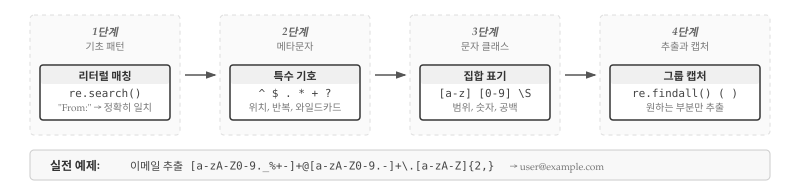
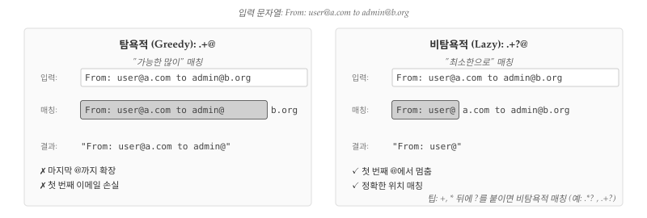
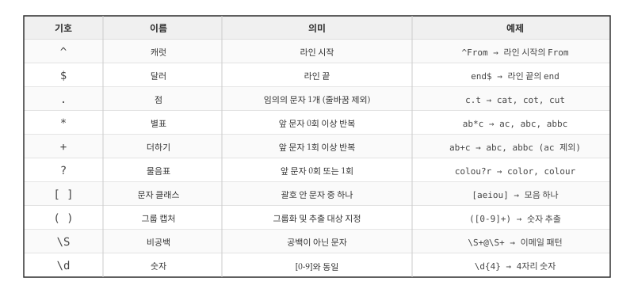

# 정규 표현식 {#sec-regex-intro}
\index{정규 표현식}
\index{regex}

앞선 장에서 파일을 읽고 패턴을 찾아 원하는 정보를 추출하는 방법을 살펴보았다. `split()`, `find()` 같은 문자열 메서드와 리스트 슬라이싱을 조합해 데이터를 가공했는데, 텍스트에서 특정 패턴을 검색하고 추출하는 작업은 프로그래밍에서 매우 빈번하게 발생한다. 파이썬은 이런 작업을 효율적으로 처리할 수 있는 **정규 표현식(Regular Expression)**이라는 강력한 도구를 제공하며, 정규표현식을 이제야 소개하는 이유는 강력한 만큼 구문이 복잡해서 익숙해지는 데 시간이 필요하기 때문이다.

{#fig-regex-overview}

@fig-regex-overview 는 정규표현식의 학습 흐름을 보여준다. 1단계에서는 `re.search()` 함수로 문자열이 특정 패턴을 포함하는지 검사하는 **리터럴 매칭**[^literal]부터 시작하며, 2단계에서 `^`, `$`, `.`, `*`, `+`, `?` 같은 **메타문자**를 익히고, 3단계에서 `[a-z]`, `[0-9]`, `\S` 같은 **문자 클래스**를 배운 후, 4단계에서 `re.findall()`과 괄호 `()`를 사용한 **캡처 그룹**으로 원하는 부분만 추출하는 기법을 익힌다.

[^literal]: 리터럴 매칭(literal matching)은 메타문자 없이 문자 그대로 매칭하는 방식이다. 예를 들어 `"From:"` 패턴은 정확히 "From:"이라는 문자열만 찾는다.

정규표현식은 문자열 검색과 파싱을 위한 DSL(Domain-Specific Language, 도메인 특화 언어)이며, 정규표현식만 다루는 전문 서적이 있을 정도로 깊이 있는 주제다. 이번 장에서는 실무에서 자주 쓰이는 기초 문법을 중심으로 다루며, 더 자세한 내용은 아래 자료를 참고한다.

- <http://en.wikipedia.org/wiki/Regular_expression>
- <https://docs.python.org/3/library/re.html>

파이썬에서 정규표현식은 내장 모듈 [`re`](https://docs.python.org/3/library/re.html)로 지원되며, 가장 기본적인 함수는 패턴 존재 여부를 확인하는 `re.search()`다.
\index{정규 표현식!re.search}

```{python}
#| label: py-regex-intro
#| eval: false
import urllib.request
import re

# 실습파일 다운로드
url = "https://www.py4e.com/code3/mbox-short.txt"
urllib.request.urlretrieve(url, "mbox-short.txt")

# 정규표현식 실습
hand = open('mbox-short.txt')
for line in hand:
    line = line.rstrip()
    if re.search('From:', line):
        print(line)
#> From: stephen.marquard@uct.ac.za
#> From: louis@media.berkeley.edu
#> From: zqian@umich.edu
#> ...
```

위 코드는 파일을 열고 각 라인을 순회하며 `re.search()` 함수로 "From:" 패턴이 포함된 라인만 출력한다. 하지만 단순 문자열 검색은 `in` 연산자로도 충분하므로, 정규표현식의 진정한 힘은 아직 드러나지 않는다. **메타문자(특수문자)**를 활용할 때 비로소 정규표현식의 위력이 발휘되며, 몇 개의 특수 기호만으로 정교한 패턴 매칭과 데이터 추출이 가능해진다.
\index{문자열!re.search}

캐럿 기호(`^`)는 "라인 시작"을 의미하는 앵커(anchor)로, `^From:` 패턴은 라인이 "From:"으로 **시작**하는 경우에만 매칭된다. 아직은 단순한 예제지만, `^` 같은 메타문자로 매칭 조건을 정밀하게 제어할 수 있다는 점이 핵심이다.

```{python}
#| label: py-regex-caret
#| eval: false
import re

hand = open('mbox-short.txt')
for line in hand:
    line = line.rstrip()
    if re.search('^From:', line):
        print(line)
#> From: stephen.marquard@uct.ac.za
#> From: louis@media.berkeley.edu
#> From: zqian@umich.edu
#> ...
```

\index{와일드 카드}
\index{정규 표현식!와일드 카드}

## 패턴 매칭 {#sec-regex-pattern}

정규표현식에는 다양한 메타문자가 있으며, 가장 자주 쓰이는 것이 **점(`.`)**으로 임의의 문자 1개를 매칭한다. `F..m:` 패턴은 "From:", "Fxxm:", "F12m:", "F!@m:" 등과 매칭되는데, 점 2개가 각각 임의의 문자 1개씩을 대신하기 때문이다.

```{python}
#| label: py-regex-char-matching
#| eval: false
import re

hand = open('mbox-short.txt')
for line in hand:
    line = line.rstrip()
    if re.search('^F..m:', line):
        print(line)
#> From: stephen.marquard@uct.ac.za
#> From: louis@media.berkeley.edu
#> From: zqian@umich.edu
#> ...
```

점과 함께 **반복 수량자**를 조합하면 더욱 강력해지는데, `*`는 앞 문자가 0회 이상, `+`는 1회 이상 반복됨을 의미한다. 반복 수량자와 점을 조합한 **와일드카드(wildcard)** 패턴으로 매칭 범위를 크게 확장할 수 있다.

```{python}
#| label: py-regex-char-matching-wild
#| eval: false
import re

hand = open('mbox-short.txt')
for line in hand:
    line = line.rstrip()
    if re.search('^From:.+@', line):
        print(line)
#> From: stephen.marquard@uct.ac.za
#> From: louis@media.berkeley.edu
#> From: zqian@umich.edu
#> ...
```

`^From:.+@` 패턴은 "From:"으로 시작하고, 1개 이상의 임의 문자(`.+`) 뒤에 `@`가 오는 라인을 찾는다. 예를 들어 `From: stephen.marquard@uct.ac.za` 라인에서 `.+` 패턴이 콜론(`:`)과 `@` 사이의 모든 문자를 매칭한다.

`.+`와 `.*`는 **탐욕적(greedy)** 매칭을 수행하는데, 이는 가능한 한 많은 문자를 매칭하려고 "밀어내듯" 확장하는 특성을 말한다. 따라서 문자열에 여러 `@`가 있으면 마지막 `@`까지 매칭된다. 탐욕적 매칭을 제어하려면 `?`를 붙여 비탐욕적(lazy) 매칭으로 전환하면 되며, `.+?`나 `.*?`처럼 사용한다.
\index{탐욕}

## 데이터 추출 {#sec-regex-extract}

앞서 살펴본 `re.search()` 함수는 패턴이 존재하는지 여부만 알려주지만, 실제 데이터 분석에서는 매칭된 부분을 직접 추출해야 하는 경우가 많다. 예를 들어 로그 파일에서 이메일 주소만 뽑아내거나, 웹 페이지에서 특정 형식의 데이터를 수집하는 작업이 여기에 해당한다.

{#fig-regex-greedy}

@fig-regex-greedy 는 `.+@` 패턴의 탐욕적 매칭과 `.+?@` 패턴의 비탐욕적 매칭 차이를 보여준다. 탐욕적 매칭은 가능한 한 많은 문자를 매칭하여 마지막 `@`까지 확장되는 반면, 비탐욕적 매칭은 최소한 문자만 매칭하여 첫 번째 `@`에서 멈춘다. 데이터를 추출할 때 탐욕적 매칭의 특성을 이해하지 못하면 의도치 않은 결과가 나올 수 있으므로, `?`를 붙여 비탐욕적 매칭으로 전환하는 방법을 반드시 알아두어야 한다.

`re.findall()` 함수는 패턴과 매칭되는 모든 부분 문자열을 추출하며, 다양한 형식의 텍스트에서 이메일 주소를 추출하는 예제를 통해 그 활용법을 살펴보자.

``` bash
From stephen.marquard@uct.ac.za Sat Jan  5 09:14:16 2008
Return-Path: <postmaster@collab.sakaiproject.org>
          for <source@collab.sakaiproject.org>;
Received: (from apache@localhost)
Author: stephen.marquard@uct.ac.za
```

위와 같이 라인마다 형식이 다른 경우, 개별 파싱 로직을 일일이 작성하기보다 정규표현식으로 일괄 처리하는 것이 훨씬 효율적이다.
\index{re.findall}
\index{정규 표현식!re.findall}

```{python}
#| label: py-regex-extract-email
import re

s = 'Hello from csev@umich.edu to cwen@iupui.edu about the meeting @2PM'
lst = re.findall(r'\S+@\S+', s)

print(lst)
#> ['csev@umich.edu', 'cwen@iupui.edu']
```

`re.findall()` 함수는 패턴과 매칭되는 모든 문자열을 리스트로 반환하며, `\S+@\S+` 패턴은 "공백이 아닌 문자 1개 이상 + @ + 공백이 아닌 문자 1개 이상" 구조를 찾는다. `\S+` 패턴은 공백이 아닌 문자를 탐욕적으로 매칭하여 공백을 만날 때까지 최대한 확장되며, "@2PM"은 `@` 앞에 공백이 아닌 문자가 없기 때문에 매칭되지 않는다. 이제 파일 전체에 적용해 이메일 주소를 추출해보자.

```{python}
#| label: py-regex-extract-emails
#| eval: false
import re

hand = open('mbox-short.txt')
for line in hand:
    line = line.rstrip()
    x = re.findall(r'\S+@\S+', line)
    if len(x) > 0:
        print(x)
```

각 라인에서 패턴과 매칭되는 모든 문자열을 추출하며, `re.findall()`은 리스트를 반환하므로 결과가 있는 경우에만 출력한다. 원데이터 `mbox.txt` 파일에 프로그램을 실행하면 다음과 같은 출력을 얻는다.

``` bash
['stephen.marquard@uct.ac.za']
['<postmaster@collab.sakaiproject.org>']
['<200801051412.m05ECIaH010327@nakamura.uits.iupui.edu>']
['<source@collab.sakaiproject.org>;']
['apache@localhost)']
['source@collab.sakaiproject.org;']
['stephen.marquard@uct.ac.za']
['louis@media.berkeley.edu']
...
```

출력을 보면 `<`, `;` 같은 불필요한 문자가 포함되어 있어서, 영문자나 숫자로 시작하고 끝나는 이메일만 추출하도록 패턴을 개선해야 한다. **문자 클래스** `[...]`를 사용해 허용할 문자 집합을 명시할 수 있다.

``` bash
[a-zA-Z0-9]\S*@\S*[a-zA-Z]
```

위 패턴을 해석하면, `[a-zA-Z0-9]`는 영문자 또는 숫자로 시작해야 함을 의미하고, `\S*`[^whitespace]는 공백이 아닌 문자가 0개 이상 올 수 있음을 뜻하며, `@`는 골뱅이 문자 그대로이고, 마지막 `[a-zA-Z]`는 영문자로 끝나야 함을 나타낸다. `+` 대신 `*`를 쓴 이유는 `[a-zA-Z0-9]`가 이미 1개 문자를 매칭하기 때문이다.

[^whitespace]: `\S*`는 `\S`와 `*`의 조합이다. `\S`는 공백이 아닌 문자(**S**pace가 아닌 것) 1개를 매칭하고, `*`는 앞 문자가 0회 이상 반복됨을 의미한다. 반대로 소문자 `\s`는 공백 문자(스페이스, 탭, 줄바꿈 등)를 매칭한다. 대문자는 소문자의 반대 의미로 기억하면 된다: `\d`(숫자) ↔ `\D`(숫자 아님), `\w`(단어 문자) ↔ `\W`(단어 문자 아님).
\index{정규 표현식!문자 집합}

```{python}
#| label: py-regex-upgrade-remove
#| eval: false
import re

hand = open('mbox-short.txt')
for line in hand:
    line = line.rstrip()
    x = re.findall(r'[a-zA-Z0-9]\S*@\S*[a-zA-Z]', line)
    if len(x) > 0:
        print(x)
```

``` bash
['stephen.marquard@uct.ac.za']
['postmaster@collab.sakaiproject.org']
['200801051412.m05ECIaH010327@nakamura.uits.iupui.edu']
['source@collab.sakaiproject.org']
['apache@localhost']
['stephen.marquard@uct.ac.za']
['louis@media.berkeley.edu']
...
```

`[a-zA-Z]`로 끝나도록 지정했으므로, "sakaiproject.org>;"에서 `>`는 제외되고 `g`에서 매칭이 종료된다.

## 검색과 추출 {#sec-regex-search-extract}

때로는 특정 조건을 만족하는 라인에서만 데이터를 추출해야 할 때가 있다. "X-"로 시작하는 라인에서 부동소수점 숫자만 추출하는 경우를 생각해보자.

``` bash
X-DSPAM-Confidence: 0.8475
X-DSPAM-Probability: 0.0000
```

모든 라인의 숫자가 아니라 특정 패턴을 가진 라인에서만 숫자를 추출해야 하며, 다음과 같은 패턴을 사용할 수 있다.

``` bash
^X-.*: [0-9.]+
```

위 패턴에서 `^X-`는 "X-"로 시작함을 의미하고, `.*`는 임의 문자가 0개 이상 올 수 있음을 뜻하며, `: `는 콜론과 공백 그대로이고, `[0-9.]+`는 숫자 또는 점이 1개 이상임을 나타낸다. 참고로 문자 클래스 `[...]` 안의 점은 와일드카드가 아닌 리터럴 점이다.

```{python}
#| label: py-regex-search-extraction
#| eval: false
import re

hand = open('mbox-short.txt')
for line in hand:
    line = line.rstrip()
    if re.search(r'^X\S*: [0-9.]+', line):
        print(line)
```

``` bash
X-DSPAM-Confidence: 0.8475
X-DSPAM-Probability: 0.0000
X-DSPAM-Confidence: 0.6178
...
```

원하는 패턴의 라인만 추출되지만, 라인 전체가 아닌 숫자만 추출하려면 어떻게 해야 할까? **캡처 그룹** `()`을 사용하면 검색과 추출을 한 번에 처리할 수 있다. 괄호 `()`는 캡처 그룹을 정의하며, 전체 패턴이 매칭된 후 괄호 안의 부분만 별도로 추출할 수 있다.
\index{정규 표현식!괄호}
\index{괄호!정규 표현식}

```{python}
#| label: py-regex-search-extract-prob
#| eval: false
import re

hand = open('mbox-short.txt')
for line in hand:
    line = line.rstrip()
    x = re.findall(r'^X\S*: ([0-9.]+)', line)
    if len(x) > 0:
        print(x)
```

`([0-9.]+)` 부분이 캡처 그룹이며, `re.findall()` 함수에 캡처 그룹이 있으면 그룹 내용만 반환한다. 전체 패턴이 매칭된 후 숫자 부분만 추출되어 다음과 같은 결과를 얻는다.

``` bash
['0.8475']
['0.0000']
['0.6178']
['0.0000']
['0.6961']
...
```

결과는 문자열이므로 필요시 `float()` 등으로 숫자형으로 변환한다. 또 다른 예제로 파일에서 SVN 리비전 번호를 추출해보자.

``` bash
Details: http://source.sakaiproject.org/viewsvn/?view=rev&rev=39772
```

캡처 그룹으로 `rev=` 뒤의 숫자만 추출할 수 있다.

```{python}
#| label: py-regex-search-extract-digits
#| eval: false
import re

hand = open('mbox-short.txt')
for line in hand:
    line = line.rstrip()
    x = re.findall('^Details:.*rev=([0-9.]+)', line)
    if len(x) > 0:
        print(x)
```

``` bash
['39772']
['39771']
['39770']
['39769']
['39766']
...
```

이메일 발송 시간을 추출하는 예제도 살펴보자. 다음과 같은 형식의 라인에서 시간 부분(시:분:초의 "시")을 추출하고 싶다고 하자.

``` bash
From stephen.marquard@uct.ac.za Sat Jan  5 09:14:16 2008
```

`split()`으로 분리하는 것도 가능하지만, 정규표현식이 더 간결하다. `^From .* ([0-9][0-9]):` 패턴에서 `^From `은 "From "으로 시작함을 의미하고, `.*`는 임의 문자를 매칭하며, ` ([0-9][0-9]):`는 공백 뒤에 오는 2자리 숫자를 캡처하고 콜론이 따라오는 구조를 찾는다.

```{python}
#| label: py-regex-search-extract-days
#| eval: false
import re

hand = open('mbox-short.txt')
for line in hand:
    line = line.rstrip()
    x = re.findall('^From .* ([0-9][0-9]):', line)
    if len(x) > 0:
        print(x)
```

``` bash
['09']
['18']
['16']
...
```

## 이스케이프 문자 {#sec-regex-escape}

`^`, `$`, `.` 같은 메타문자를 리터럴 문자로 매칭하려면 어떻게 해야 할까? 역슬래시(`\`)로 **이스케이프**하면 된다. 금액에서 `$` 기호를 찾는 예제를 보자.

```{python}
#| label: py-regex-escape-dollar
import re
x = 'We just received $10.00 for cookies.'
y = re.findall(r'\$[0-9.]+', x)
print(y)
#> ['$10.00']
```

`\$` 패턴은 "라인 끝" 앵커가 아닌 리터럴 `$` 문자를 매칭한다.

::: {.callout-note}
### 문자 클래스 안의 메타문자

`[...]` 안에서는 대부분의 메타문자가 리터럴로 취급된다. 예를 들어 `[0-9.]`에서 점은 와일드카드가 아닌 실제 점을 의미한다.
:::

## 메타문자 정리 {#sec-regex-metachar}

지금까지 다양한 메타문자를 사용해 패턴을 작성해보았다. 메타문자는 정규표현식의 핵심 구성 요소로, 각각 고유한 의미를 가지며 조합을 통해 복잡한 패턴을 표현할 수 있다. 처음에는 암호처럼 보이지만, 핵심 메타문자 몇 가지만 익히면 텍스트 처리 생산성이 크게 향상된다.

{#fig-regex-metachar}

@fig-regex-metachar 는 실무에서 자주 사용되는 메타문자를 한눈에 볼 수 있도록 정리한 표이다. **앵커**인 `^`와 `$`는 라인의 시작과 끝 위치를 지정하고, **와일드카드** `.`은 줄바꿈을 제외한 임의의 문자 1개를 매칭한다. **수량자** `*`, `+`, `?`는 앞 문자의 반복 횟수를 지정하며, **문자 클래스** `[...]`는 허용할 문자 집합을 명시하고, **캡처 그룹** `(...)`는 매칭된 부분을 추출할 때 사용한다.

::: {.callout-tip}
### 유닉스/리눅스 grep 명령어
\index{grep}

정규표현식은 1960년대부터 유닉스에 내장되어 있으며, `grep`(Global Regular Expression Print) 명령어로 파일 검색이 가능하다.

``` bash
$ grep '^From:' mbox-short.txt
From: stephen.marquard@uct.ac.za
From: louis@media.berkeley.edu
```

다만 `grep` 정규표현식 문법은 파이썬과 약간 다르므로 주의가 필요하다.
:::

## 디버깅 {#sec-regex-debug}

정규표현식 디버깅의 핵심은 **백트래킹(backtracking)**을 이해하는 것이다. 정규표현식 엔진은 패턴 매칭에 실패하면 이전 상태로 되돌아가 다른 경로를 시도하는데, 패턴이 복잡해지면 백트래킹 횟수가 기하급수적으로 증가해 성능 문제를 일으킨다.

{#fig-regex-backtrack}

@fig-regex-backtrack 는 `a+b` 패턴이 "aaac" 문자열에서 실패하는 과정을 보여준다. 탐욕적 수량자 `a+`가 먼저 모든 'a'를 매칭한 후, 'b'를 찾지 못하면 'a' 하나씩 반납하며 재시도한다. 단순한 패턴에서는 문제가 없지만, 중첩 수량자 `(a+)+`나 연속 와일드카드 `.*.*`는 조합이 폭발적으로 증가해 **재앙적 백트래킹(Catastrophic Backtracking)**을 유발한다.

### 성능 문제 패턴

정규표현식에서 가장 치명적인 실수는 백트래킹이 폭발하는 패턴을 작성하는 것이다. 특히 수량자 안에 수량자가 중첩되거나, 와일드카드가 연속으로 나오는 패턴은 입력 길이에 따라 처리 시간이 지수적으로 증가한다. 25자 정도의 입력에서도 수 초에서 수 분이 소요될 수 있으며, 웹 서비스에서 정규표현식 기반 입력 검증이 이런 패턴을 포함하면 서비스 거부(DoS) 공격에 취약해진다.

```{python}
#| label: py-regex-catastrophic
#| eval: false
import re
import time

# 위험한 패턴: 중첩 수량자
pattern = r'(a+)+b'
text = 'a' * 25 + 'c'  # 매칭 실패 시 2^25번 시도

start = time.time()
re.search(pattern, text)  # 수 초 ~ 수 분 소요
print(f"소요 시간: {time.time() - start:.2f}초")
```

::: {.callout-note}
### 왜 기하급수적으로 느려지는가?

`(a+)+` 패턴이 "aaac" 입력에서 실패할 때, 엔진은 'a' 3개를 어떻게 그룹으로 나눌지 모든 조합을 시도한다. `aaa`, `aa+a`, `a+aa`, `a+a+a` 등 각 위치마다 "여기서 끊을까, 계속할까" 두 가지 선택이 있어 n개 문자에 대해 2^(n-1)가지 조합이 생긴다. 25자 입력이면 약 3천만 번의 시도가 필요하고, 30자면 10억 번을 넘어선다.
:::

피해야 할 대표적인 패턴으로는 중첩 수량자 `(a+)+`, 연속 와일드카드 `.*.*`, 중복 선택지 `(a|a)+`, 범용 중첩 `(.+)+` 등이 있다. 중첩 수량자는 단순히 `a+`로, 연속 와일드카드는 `.*` 하나로, 중복 선택지는 `a+`로 대체하면 된다. 범용 중첩 패턴은 매칭하려는 대상에 맞게 구체적인 문자 클래스로 바꾸는 것이 바람직하다.

### 패턴 분해 테스트

복잡한 정규표현식을 한 번에 작성하면 오류를 찾기 어렵다. 효과적인 디버깅 방법은 패턴을 구성 요소별로 분해해 단계적으로 테스트하는 것이다. 각 단계에서 매칭 결과를 확인하면서 점진적으로 패턴을 확장하면, 문제가 발생하는 지점을 정확히 파악할 수 있다.

```{python}
#| label: py-regex-debug-decompose
import re

email = "user.name+tag@sub.domain.com"

# 1단계: 로컬 파트만 테스트
print(re.findall(r'[\w.+-]+', email))

# 2단계: @ 포함
print(re.findall(r'[\w.+-]+@', email))

# 3단계: 도메인 추가
print(re.findall(r'[\w.+-]+@[\w.-]+', email))

# 4단계: 최종 패턴
print(re.findall(r'[\w.+-]+@[\w.-]+\.\w{2,}', email))
```

1단계 `[\w.+-]+`는 이메일의 로컬 파트(@ 앞부분)를 매칭한다. `\w`는 단어 문자(영문자, 숫자, 밑줄)이고, 대괄호 안의 `.+-`는 마침표, 더하기, 하이픈을 리터럴로 허용하며, `+`는 이 문자들이 1회 이상 반복됨을 의미한다. 2단계에서 `@`를 붙여 골뱅이까지 포함하고, 3단계 `[\w.-]+`로 도메인 부분(영문자, 숫자, 마침표, 하이픈)을 추가한다. 4단계 `\.\w{2,}`에서 `\.`는 리터럴 마침표(메타문자가 아님)이고, `\w{2,}`는 단어 문자가 2개 이상 반복되어야 함을 뜻해 `com`, `org` 같은 최상위 도메인(TLD)을 매칭한다.

::: {.callout-tip}
### raw string 필수

파이썬에서 정규표현식 패턴은 반드시 raw string(`r''`)으로 작성한다. 일반 문자열에서 `\d`는 파이썬이 먼저 해석하려고 시도하기 때문이다.

``` python
# 잘못된 방식 (이중 이스케이프 필요)
re.findall('\\d+', text)

# 올바른 방식
re.findall(r'\d+', text)
```
:::

::: {.content-visible when-format="pdf"}
\faLightbulb\ 생각해볼 점
:::

::: {.content-visible when-format="html"}
## 💡 생각해볼 점 {.unnumbered}
:::

정규표현식을 처음 접하면 암호 같은 기호의 나열에 압도당하기 쉽다. 하지만 메타문자 10여 개만 익히면 대부분의 텍스트 처리 작업을 해결할 수 있다. 핵심은 한 번에 완벽한 패턴을 만들려 하지 말고, 단순한 패턴에서 시작해 점진적으로 확장하는 것이다. 패턴 분해 테스트에서 살펴본 것처럼, 로컬 파트 → @ 추가 → 도메인 → TLD 순으로 단계별 검증을 거치면 복잡한 패턴도 체계적으로 구축할 수 있다.

정규표현식의 강력함은 곧 위험성이기도 하다. 몇 글자로 수백 줄의 코드를 대체할 수 있지만, 잘못 작성된 패턴은 프로그램 전체를 멈추게 만들 수 있다. 특히 사용자 입력을 정규표현식으로 검증하는 웹 서비스에서 재앙적 백트래킹 취약점이 발견되면 서비스 전체가 마비될 수 있다. 패턴을 작성할 때는 "정상 입력에서 잘 동작하는가"뿐 아니라 "악의적 입력에서 어떻게 동작하는가"도 반드시 고려해야 한다.

다음 장에서 다룰 네트워크 프로그래밍과 웹 스크래핑에서 정규표현식의 진가가 드러난다. 웹 페이지에서 이메일, 전화번호, 가격 정보를 추출하거나 로그 파일에서 오류 패턴을 찾아낼 때, 정규표현식 없이는 수십 줄의 문자열 처리 코드가 필요하다. "알면 한 줄, 모르면 백 줄"이라는 격언처럼, 정규표현식은 텍스트 데이터를 다루는 프로그래머의 필수 도구다.

