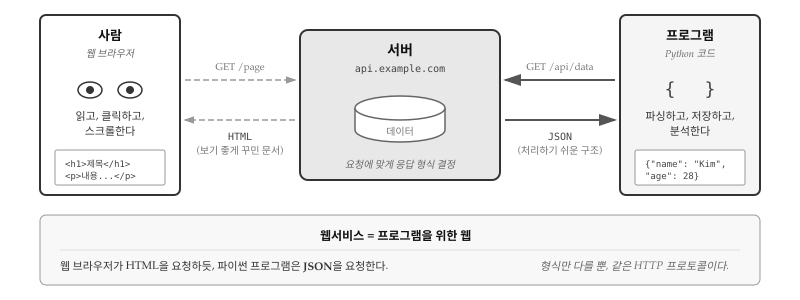
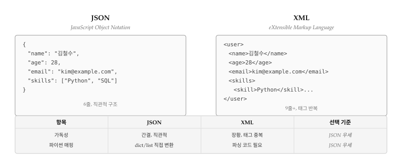
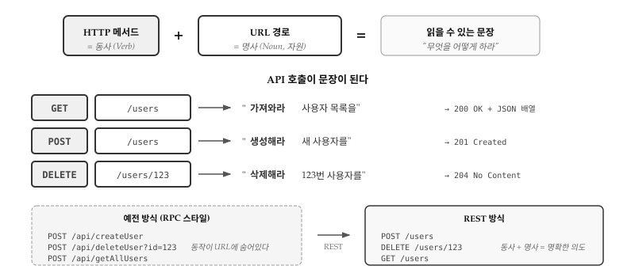
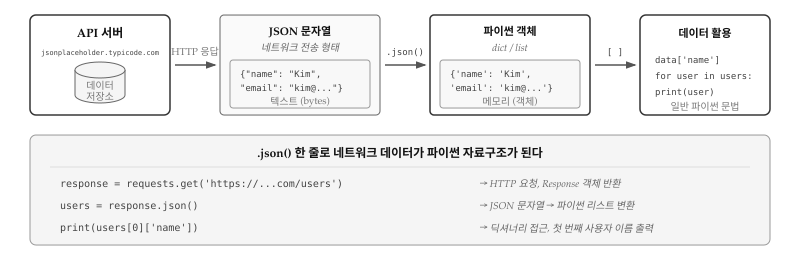
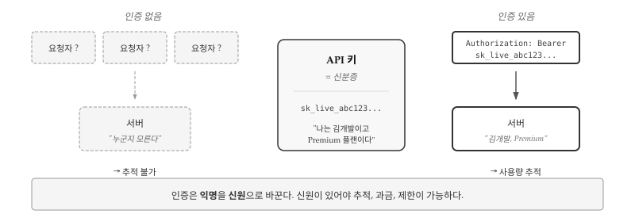
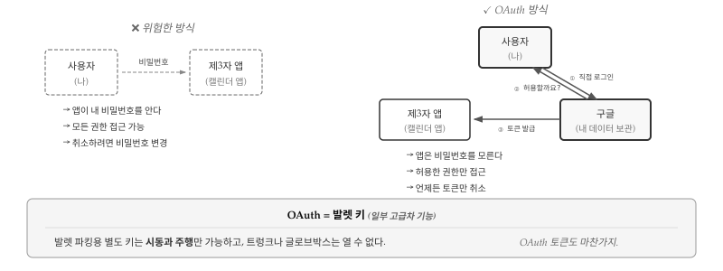
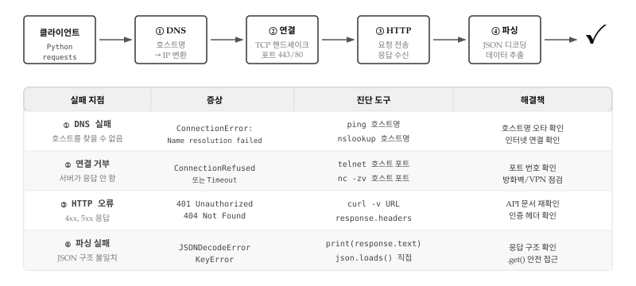

# 웹서비스 {#sec-webservice}

\index{웹서비스}

같은 서버에 요청을 보내도 **누가 요청하느냐에 따라 응답 형식이 달라진다**. 웹 브라우저로 쇼핑몰에 접속하면 화려한 HTML 페이지가 뜨지만, 파이썬 프로그램이 같은 서버의 API에 접속하면 깔끔한 JSON 데이터가 온다. 똑같은 "상품 목록" 정보인데 왜 형식이 다를까?

사람과 프로그램은 정보를 소비하는 방식이 완전히 다르기 때문이다. 사람은 화면을 **읽고, 클릭하고, 스크롤**한다. 예쁜 레이아웃, 이미지, 버튼이 필요하다. 반면 프로그램은 데이터를 **파싱하고, 저장하고, 분석**한다. 장식은 오히려 방해가 되고, 구조화된 형식만 있으면 된다.

{#fig-webservice-overview}

@fig-webservice-overview 는 이 핵심 차이를 보여준다. 왼쪽의 사람은 웹 브라우저를 통해 `GET /page` 요청을 보내고 **HTML**을 받는다. 태그로 꾸며진 문서다. 오른쪽의 프로그램은 `GET /api/data` 요청을 보내고 **JSON**을 받는다. 중괄호와 따옴표로 이루어진 구조화된 데이터다. 서버 입장에서는 같은 데이터베이스에서 같은 데이터를 꺼내지만, 요청자에 맞게 포장을 달리할 뿐이다.

**웹서비스(Web Service)**는 이렇게 프로그램을 위해 설계된 웹이다. HTTP 프로토콜은 동일하게 사용하되, 응답 형식을 프로그램이 처리하기 쉬운 JSON이나 XML로 제공한다. 웹서비스 덕분에 파이썬 코드 몇 줄로 날씨 정보, 환율, 주가, 지도 좌표, 번역 결과 등 인터넷에 공개된 거의 모든 데이터에 접근할 수 있다.

::: {.callout-note}
## 왜 웹서비스가 광범위하게 사용되는가?

웹서비스가 폭발적으로 성장한 이유는 **기존 웹 인프라를 그대로 활용**하기 때문이다. 새로운 프로토콜을 만들 필요 없이 HTTP를 쓰고, 방화벽도 80/443 포트만 열어두면 된다. 웹 브라우저를 위해 구축된 서버, 로드밸런서, CDN, 캐시 시스템이 API 서비스에도 그대로 적용된다.

동시에 **언어 독립적**이다. 파이썬 클라이언트가 자바 서버와 통신하고, 자바스크립트 프론트엔드가 Go 백엔드와 대화한다. JSON이라는 범용 형식 덕분에 어떤 언어든 데이터를 주고받을 수 있다. 한 회사의 서비스가 다른 회사의 앱에 데이터를 제공하고, 그 앱이 또 다른 서비스에 결과를 전달하는 **서비스 생태계**가 가능해진 것이다.
:::

## 데이터 교환 형식 {#sec-webservice-format}

\index{JSON}
\index{XML}

프로그램이 처리하기 좋은 "구조화된 데이터"란 구체적으로 무엇일까? HTML도 태그가 있으니 구조화되어 있는 것 아닌가? 차이는 **목적**에 있다. HTML은 "어떻게 보여줄 것인가"를 정의하고, JSON/XML은 "어떤 데이터인가"를 정의한다. `<h1>상품명</h1>`은 "크게 표시하라"는 뜻이지만, `{"name": "상품명"}`은 "이것이 이름 필드다"라는 뜻이다.

웹서비스에서 두 가지 형식이 주로 사용된다. **XML**(eXtensible Markup Language)은 1990년대부터 사용된 마크업 언어로, 복잡한 문서 구조와 메타데이터를 표현하는 데 강하다. **JSON**(JavaScript Object Notation)은 2000년대 초반에 등장했으며, 간결함과 파이썬 자료구조로 직접 변환되는 장점 덕분에 현재 웹 API의 사실상 표준이 되었다.

{#fig-webservice-json-xml}

@fig-webservice-json-xml 은 동일한 사용자 정보를 JSON과 XML로 표현한 것이다. JSON은 6줄로 끝나는 반면, XML은 태그 이름이 시작과 끝에 반복되어 9줄 이상이 된다. 더 중요한 차이는 파이썬 코드에 있다. JSON은 `json.loads()` 한 줄로 딕셔너리가 되지만, XML은 트리를 탐색하는 파싱 코드가 필요하다.

### JSON: 프로그램을 위한 데이터 형식 {#sec-webservice-json}

JSON은 중괄호 `{}`로 객체(딕셔너리)를, 대괄호 `[]`로 배열(리스트)을 표현한다. 파이썬의 `json` 모듈로 문자열과 파이썬 객체 사이를 자유롭게 변환할 수 있다.

```{python}
#| label: py-json-basic
#| eval: true
import json

# JSON 문자열 → 파이썬 객체
json_str = '''
{
  "name": "김철수",
  "age": 28,
  "skills": ["Python", "SQL", "Docker"]
}
'''

data = json.loads(json_str)
print(f"이름: {data['name']}")
print(f"첫 번째 스킬: {data['skills'][0]}")

# 파이썬 객체 → JSON 문자열
new_data = {"status": "success", "count": 42}
print(json.dumps(new_data, ensure_ascii=False))
```

`json.loads()`는 JSON 문자열을 파이썬 객체로 파싱하고, `json.dumps()`는 파이썬 객체를 JSON 문자열로 변환한다. `ensure_ascii=False`를 지정하면 한글이 유니코드 이스케이프 없이 그대로 출력된다.

### XML 파싱 {#sec-webservice-xml}

\index{ElementTree}
\index{xml.etree}

XML은 계층적 트리 구조로 데이터를 표현한다. 파이썬 표준 라이브러리의 `xml.etree.ElementTree`로 XML을 파싱하고 데이터를 추출한다.

```{python}
#| label: py-xml-parsing
#| eval: true
import xml.etree.ElementTree as ET

xml_data = '''
<users>
    <user id="001">
        <name>Chuck</name>
        <email>chuck@example.com</email>
    </user>
    <user id="009">
        <name>Brent</name>
        <email>brent@example.com</email>
    </user>
</users>
'''

root = ET.fromstring(xml_data)

for user in root.findall('user'):
    user_id = user.get('id')
    name = user.find('name').text
    email = user.find('email').text
    print(f"ID: {user_id}, 이름: {name}, 이메일: {email}")
```

`ET.fromstring()`으로 XML 문자열을 파싱하면 최상위 요소(root)를 반환한다. `findall()`로 특정 태그의 모든 자식을 찾고, `find()`로 첫 번째 자식을 찾는다. `get()`은 태그의 속성값을, `.text`는 태그 내부 텍스트를 가져온다.

JSON과 XML 코드를 나란히 놓으면 차이가 분명해진다. JSON은 `json.loads()` 한 줄로 파이썬 딕셔너리가 되고, 이후로는 `data['name']`처럼 일반적인 딕셔너리 접근 문법을 그대로 쓴다. 반면 XML은 트리 구조를 탐색하는 별도의 API를 익혀야 한다. `findall()`, `find()`, `get()`, `.text` 같은 메서드를 조합해서 원하는 데이터에 도달한다. 같은 정보를 추출하는데 코드 양이 2~3배 늘어나는 셈이다.

그렇다면 XML은 왜 아직도 쓰이는가? 역사적 이유가 크다. 2000년대 초반 웹서비스가 처음 등장했을 때 XML이 사실상 유일한 선택지였고, 금융, 의료, 정부 시스템처럼 변화가 느린 분야에서는 그 당시 구축된 시스템이 여전히 운영 중이다. SOAP 기반 엔터프라이즈 시스템, RSS 피드, 마이크로소프트 오피스 파일 포맷(`.docx`는 XML 압축 파일이다) 등이 대표적이다. 신규 프로젝트라면 JSON을 선택하는 것이 현명하지만, 기존 시스템과 통합해야 할 때는 XML 파싱 능력이 여전히 필요하다.

JSON이든 XML이든, 데이터 형식은 결국 "상자"에 불과하다. 진짜 문제는 그 상자를 어떻게 주고받을 것인가다. 수천 개의 서로 다른 웹서비스가 각자의 방식으로 API를 설계한다면, 개발자는 매번 새로운 규칙을 익혀야 한다. 이 혼란을 정리한 것이 바로 REST 아키텍처다.

## REST API: 웹의 공용 문법 {#sec-webservice-rest}

\index{REST}
\index{API}
\index{아키텍처}

**REST**(REpresentational State Transfer)는 단순한 API 설계 규칙이 아니라, 웹 전체를 관통하는 **아키텍처 스타일**이다. 2000년 로이 필딩(Roy Fielding)이 박사 논문에서 제시한 REST는 웹이 왜 성공했는지를 분석하고, 그 원칙을 API 설계에 적용한 것이다. 핵심은 단순하다. HTTP 메서드를 **동사**로, URL을 **명사**로 사용하면, API 호출 자체가 읽을 수 있는 문장이 된다.

{#fig-webservice-rest}

@fig-webservice-rest 는 REST의 핵심 통찰을 보여준다. `GET /users`는 "사용자 목록을 **가져와라**"가 되고, `POST /users`는 "새 사용자를 **생성해라**"가 되며, `DELETE /users/123`은 "123번 사용자를 **삭제해라**"가 된다. 개발자가 처음 보는 API라도 URL과 메서드만 보면 무슨 동작인지 즉시 파악할 수 있다. 문서를 읽기 전에 API를 이해할 수 있다는 점이 REST가 사실상 표준이 된 이유다.

REST 이전의 RPC(Remote Procedure Call) 스타일 API는 `POST /api/createUser`, `POST /api/deleteUser`, `POST /api/getAllUsers`처럼 동작을 URL에 숨겼다. 메서드는 무조건 POST였고, URL을 읽어야만 의도를 파악할 수 있었다. 반면 REST는 HTTP가 이미 제공하는 동사(GET, POST, PUT, DELETE)를 그대로 활용하고, URL은 오직 자원의 위치만 나타낸다. 웹의 기존 인프라를 재활용하면서도 일관된 인터페이스를 제공하는 것이다.

REST가 웹서비스의 표준으로 자리잡은 데는 실용적인 이유도 있다. 상태를 서버에 저장하지 않는 무상태(stateless) 설계 덕분에 서버 확장이 쉽고, 캐싱을 적용하기도 간편하다. 오늘날 트위터, 구글, 깃허브 등 거의 모든 주요 서비스가 REST 기반 API를 제공하며, 새로운 서비스도 대부분 REST를 따른다. 대부분의 공개 API는 데이터 조회용으로 GET 메서드만 제공하고, POST, PUT, DELETE는 인증된 사용자만 사용할 수 있도록 제한한다.

## 공공 API 활용 {#sec-webservice-public-api}

\index{공공 API}
\index{Open API}

**공공 API**(Public API 또는 Open API)란 외부 개발자가 자유롭게 호출할 수 있도록 공개된 웹서비스 인터페이스다. 정부 기관이 공개하는 공공데이터 API, 기업이 파트너나 일반 개발자에게 제공하는 상용 API, 그리고 학습용으로 만들어진 테스트 API까지 다양한 종류가 있다. 공통점은 **인증 절차를 거치면 누구나 데이터를 요청할 수 있다**는 것이다. 날씨, 환율, 지도, 번역, 주식 시세 등 직접 수집하기 어려운 데이터를 API 한 줄 호출로 가져올 수 있어, 현대 소프트웨어 개발에서 공공 API 활용 능력은 필수 역량이 되었다.

실습에는 **JSONPlaceholder**를 사용한다. 페이스북, 트위터 같은 소셜 네트워크 서비스를 모방한 가상의 REST API로, 사용자(users), 게시글(posts), 댓글(comments), 할 일(todos) 등의 가짜 데이터를 제공한다. 실제 데이터는 아니지만 API 응답 구조가 실무에서 마주치는 형태와 동일하여, 인증 없이 REST API 호출 패턴을 익히기에 적합하다.

{#fig-webservice-api-flow}

@fig-webservice-api-flow 는 API 호출부터 데이터 활용까지의 전체 흐름을 보여준다. API 서버는 데이터베이스에서 정보를 꺼내 JSON 문자열로 변환하여 네트워크로 전송한다. 파이썬 프로그램은 `requests.get()`으로 응답을 받고, `response.json()` 한 줄로 JSON 문자열을 파이썬 딕셔너리나 리스트로 변환한다. 변환된 데이터는 `data['name']`처럼 일반적인 파이썬 문법으로 접근할 수 있다. 가장 기본적인 조회(GET) 요청부터 시작해보자.

```{python}
#| label: py-jsonplaceholder
#| eval: true
import requests

# 사용자 목록 조회
response = requests.get('https://jsonplaceholder.typicode.com/users')
users = response.json()

print(f"총 {len(users)}명의 사용자")
for user in users[:3]:  # 처음 3명만 출력
    print(f"  {user['name']} ({user['email']})")
```

`requests.get()` 함수는 지정한 URL로 HTTP GET 요청을 보내고, 서버의 응답을 `Response` 객체로 반환한다. `response.json()` 메서드는 응답 본문을 JSON으로 파싱하여 파이썬 객체(딕셔너리 또는 리스트)로 변환한다. `json.loads(response.text)`와 동일한 결과지만, 응답의 `Content-Type` 헤더를 확인하고 인코딩을 자동 처리하므로 더 안전하다. 한 번의 API 호출로 10명의 사용자 정보가 담긴 리스트를 받았고, 각 사용자는 이름, 이메일, 주소, 회사 정보 등을 포함한 딕셔너리다.

### 쿼리 파라미터로 필터링 {#sec-webservice-query}

\index{쿼리 파라미터}

실제 API를 사용하다 보면 전체 데이터가 아니라 특정 조건에 맞는 데이터만 필요한 경우가 대부분이다. 수천 명의 사용자 중 특정 지역 사용자만, 수만 개의 게시글 중 특정 작성자의 글만 가져오고 싶을 때 **쿼리 파라미터(query parameter)**를 사용한다. URL 끝에 `?key=value` 형식으로 조건을 붙이면 서버가 해당 조건에 맞는 데이터만 필터링해서 응답한다. `requests` 라이브러리는 `params` 매개변수로 이 과정을 자동화한다.

```{python}
#| label: py-query-params
#| eval: true
import requests

# 특정 사용자의 게시글만 조회
params = {'userId': 1}
response = requests.get(
    'https://jsonplaceholder.typicode.com/posts',
    params=params
)
posts = response.json()

print(f"사용자 1의 게시글: {len(posts)}개")
print(f"첫 번째 게시글: {posts[0]['title'][:30]}...")
```

`params` 딕셔너리를 전달하면 `requests`가 자동으로 URL 인코딩을 수행하여 `?userId=1` 형태로 URL에 붙인다. 공백은 `%20`으로, 한글은 UTF-8 바이트로 변환되어 안전하게 전송된다. 위 코드에서 100개의 전체 게시글 중 사용자 1이 작성한 10개만 필터링되어 반환되었다. 대용량 API에서는 `limit`, `offset`, `page` 같은 파라미터로 페이지네이션을 지원하여 한 번에 가져오는 데이터 양을 조절할 수 있다.

### POST 데이터 전송 {#sec-webservice-post}

\index{POST}
\index{HTTP!메서드}

GET이 서버에서 데이터를 **읽어오는** 동작이라면, POST는 서버에 새로운 데이터를 **보내는** 동작이다. 회원가입 폼을 제출하거나, 블로그에 새 글을 작성하거나, 쇼핑몰에서 주문을 생성할 때 브라우저가 보내는 것이 바로 POST 요청이다. GET 요청은 URL에 모든 정보가 담기지만, POST 요청은 **요청 본문(body)**에 데이터를 담아 전송한다. URL에 노출되지 않으므로 민감한 정보(비밀번호, 결제 정보 등)를 전송할 때도 POST를 사용한다.

```{python}
#| label: py-post-request
#| eval: true
import requests

# 새 게시글 생성 (테스트 API라서 실제로 저장되지는 않음)
new_post = {
    'title': '웹서비스 테스트',
    'body': 'requests 라이브러리로 POST 요청을 보냅니다.',
    'userId': 1
}

response = requests.post(
    'https://jsonplaceholder.typicode.com/posts',
    json=new_post
)

print(f"상태 코드: {response.status_code}")
print(f"생성된 게시글 ID: {response.json()['id']}")
```

`requests.post()` 함수에 `json=` 매개변수를 전달하면 세 가지 작업이 자동으로 처리된다. 파이썬 딕셔너리가 JSON 문자열로 변환되고, `Content-Type: application/json` 헤더가 설정되며, 인코딩까지 알아서 처리된다. 과거에는 `data=json.dumps(new_post)`처럼 수동으로 변환해야 했지만, `json=` 매개변수가 도입되면서 코드가 훨씬 간결해졌다. 위 코드에서 상태 코드 201(Created)은 새 리소스가 성공적으로 생성되었음을 의미한다. JSONPlaceholder는 테스트용 API이므로 실제로 데이터가 저장되지는 않지만, 실제 서버에서는 데이터베이스에 새 레코드가 추가되고 생성된 리소스의 ID가 반환된다.

## API 인증 {#sec-webservice-auth}

\index{API!키}
\index{API!인증}
\index{OAuth}
\index{보안!API 키}

API 인증의 본질은 단 하나의 질문으로 요약된다. **"누구의 요청인가?"** 인증 없이 들어오는 요청은 모두 익명이다. 서버 입장에서 익명의 요청자는 추적할 수도, 요금을 청구할 수도, 사용량을 제한할 수도 없는 존재다. 반면 API 키가 포함된 요청은 신원이 명확하다. 서버는 "김개발, Premium 플랜"처럼 요청자가 누구인지 즉시 파악하고, 사용량을 기록하며, 플랜에 맞는 기능과 한도를 적용한다.

{#fig-webservice-api-auth}

@fig-webservice-api-auth 는 인증의 핵심 역할을 보여준다. 왼쪽의 익명 요청은 점선으로 표시되어 있고, 서버는 "누군지 모른다"고 답한다. 오른쪽의 인증된 요청은 `Authorization: Bearer sk_live_abc123...` 헤더를 포함하고 있어, 서버가 요청자를 정확히 식별할 수 있다. API 키는 디지털 세계 **신분증**이다. 신분증이 있어야 추적, 과금, 권한 제어가 가능해진다. 카카오, 네이버, 구글 같은 대형 플랫폼이 무료 API조차 인증을 요구하는 이유가 바로 여기에 있다.

### API 키 인증 {#sec-webservice-api-key}

가장 널리 사용되는 인증 방식은 **API 키**다. 서비스에 가입하고 개발자 콘솔에서 키를 발급받으면, 이후 모든 API 요청에 키를 포함시켜 보내면 된다. 서버는 키를 확인하여 요청자를 식별하고, 해당 계정의 사용량을 기록하며, 권한에 따라 응답을 제공한다. API 키는 HTTP 헤더, URL 쿼리 파라미터, 또는 요청 본문에 포함될 수 있는데, 헤더 방식이 가장 안전하고 권장된다. URL에 키를 포함하면 서버 로그나 브라우저 히스토리에 키가 남을 수 있기 때문이다.

```{python}
#| label: py-api-key-example
#| eval: false
import requests
import os

# 환경변수에서 API 키 로드 (코드에 직접 쓰지 않음)
api_key = os.environ.get('WEATHER_API_KEY')

# 헤더에 API 키 포함
headers = {'Authorization': f'Bearer {api_key}'}
response = requests.get(
    'https://api.example.com/weather',
    headers=headers,
    params={'city': 'Seoul'}
)
```

위 코드에서 `os.environ.get()`을 사용하는 이유는 API 키를 코드와 분리하기 위해서다. 환경변수에 저장된 키를 읽어오면 코드에 민감 정보가 포함되지 않으므로, GitHub에 푸시해도 키가 유출되지 않는다.

::: {.callout-warning}
## API 키 보안: 반드시 지켜야 할 원칙

API 키는 비밀번호와 동일하게 취급해야 한다. 유출되면 금전적 피해, 데이터 유출, 계정 정지까지 이어질 수 있다. 다음 보안 수칙을 반드시 준수한다.

**코드와 키의 분리**: `.env` 파일에 키를 저장하고, `.gitignore`에 `.env`를 추가하여 저장소에 포함되지 않도록 한다. `python-dotenv` 패키지를 사용하면 `.env` 파일의 내용을 환경변수로 자동 로드할 수 있다.

**최소 권한 원칙**: API 키 발급 시 필요한 권한만 선택한다. 읽기만 필요하다면 쓰기 권한을 부여하지 않는다. 대부분의 API 서비스는 키별로 권한 범위를 설정할 수 있다.

**정기적 키 순환**: 90일마다 새 키를 발급하고 기존 키를 폐기한다. 키가 유출되었을 가능성이 있다면 즉시 폐기하고 새 키로 교체한다.

**사용량 모니터링**: 비정상적인 API 호출 패턴을 감지할 수 있도록 알림을 설정한다. 새벽 시간에 대량 호출이 발생하면 유출 징후일 수 있다.
:::

### OAuth 인증 {#sec-webservice-oauth}

\index{OAuth!2.0}

**OAuth**의 핵심은 단순하다. **비밀번호를 공유하지 않고 권한을 위임하는 것**이다. 캘린더 앱이 구글 캘린더에 접근하려면 예전에는 구글 비밀번호를 앱에 알려줘야 했다. 앱이 비밀번호를 알면 캘린더뿐 아니라 이메일, 드라이브, 결제 정보까지 모든 권한을 갖게 된다. 접근을 취소하려면 비밀번호 자체를 변경해야 한다. OAuth는 이 문제를 해결한다.

{#fig-webservice-oauth}

@fig-webservice-oauth 는 위험한 방식과 OAuth 방식을 대비하여 보여준다. 왼쪽의 비밀번호 공유 방식은 점선으로 표시되어 있다. 사용자가 제3자 앱에 비밀번호를 직접 전달하면, 앱은 모든 권한에 접근할 수 있고, 취소하려면 비밀번호를 변경해야 한다. 오른쪽의 OAuth 방식은 세 주체 간의 신뢰 관계로 이루어진다. 사용자는 구글에 **직접 로그인**하고, 구글이 "앱에 캘린더 접근을 허용할까요?"라고 묻는다. 사용자가 승인하면 구글이 제3자 앱에 **토큰**을 발급한다. 앱은 비밀번호를 절대 알 수 없고, 허용된 권한만 사용할 수 있으며, 토큰만 취소하면 접근이 차단된다.

OAuth는 자동차 **발렛 키**와 같다. 일부 고급 차량에는 발렛 파킹용 별도 키가 있는데, 시동과 주행만 가능하고 트렁크나 글로브박스는 열 수 없다. 차 전체를 맡기는 것이 아니라 필요한 기능만 허용하는 것이다. OAuth 토큰도 마찬가지다. 캘린더 읽기 권한만 부여하면 이메일은 볼 수 없다. 권한 범위(scope)를 세밀하게 제어할 수 있어, 사용자는 최소한의 접근만 허용하고 언제든 취소할 수 있다.

OAuth 구현은 복잡하므로 직접 작성하지 않는다. `requests-oauthlib`, `authlib` 같은 검증된 라이브러리가 인증 흐름을 처리해준다. X(트위터), 구글, 페이스북, 카카오 등 대형 서비스 API는 대부분 OAuth 2.0을 채택하고 있으며, 각 서비스의 개발자 문서에 상세한 연동 가이드가 제공된다.

## 지오코딩 API 실습 {#sec-webservice-geocoding}

\index{지오코딩}
\index{역지오코딩}
\index{카카오!지도 API}

지금까지 배운 REST API, 인증, JSON 파싱을 실제 서비스에 적용해보자. **지오코딩(Geocoding)**은 "서울특별시 강남구 테헤란로 152"와 같은 주소를 위도/경도 좌표(37.5000, 127.0365)로 변환하는 서비스다. 반대로 좌표를 주소로 변환하는 것은 **역지오코딩(Reverse Geocoding)**이라 한다. 배달 앱에서 현재 위치의 주소를 표시하거나, 부동산 사이트에서 매물 위치를 지도에 찍을 때 이 기술이 사용된다.

한국에서는 카카오, 네이버, 구글 등이 지오코딩 API를 제공한다. 카카오 지도 API는 한국 주소 인식률이 높고, 무료 사용량(일 30만 건)이 넉넉하며, 한글 문서가 잘 정리되어 있어 입문용으로 적합하다.

### API 키 발급 {#sec-geocoding-apikey}

카카오 지도 API를 사용하려면 먼저 API 키를 발급받아야 한다.

1. [카카오 개발자 사이트](https://developers.kakao.com/)에 카카오 계정으로 로그인
2. **내 애플리케이션** → **애플리케이션 추가하기** 클릭
3. 앱 이름(예: "지오코딩 테스트")과 사업자명 입력 후 저장
4. 생성된 앱 선택 → **앱 키** 탭에서 **REST API 키** 복사
5. 환경변수에 저장: `export KAKAO_MAP_API_KEY="발급받은키"`

::: {.callout-warning}
## API 키 보안

API 키를 코드에 직접 쓰면 GitHub에 푸시할 때 유출된다. 반드시 환경변수나 `.env` 파일로 분리하고, `.gitignore`에 `.env`를 추가해야 한다.
:::

### 주소 → 좌표 변환 {#sec-geocoding-forward}

주소를 좌표로 변환하는 지오코딩 요청을 보내보자.

```{python}
#| label: py-kakao-geocoding
#| eval: false
import requests
import os

api_key = os.environ.get('KAKAO_MAP_API_KEY')

address = '서울특별시 강남구 테헤란로 152'

response = requests.get(
    'https://dapi.kakao.com/v2/local/search/address.json',
    headers={'Authorization': f'KakaoAK {api_key}'},
    params={'query': address}
)

if response.status_code == 200:
    result = response.json()
    if result['documents']:
        doc = result['documents'][0]
        print(f"주소: {doc['address_name']}")
        print(f"위도: {doc['y']}, 경도: {doc['x']}")
else:
    print(f"오류: {response.status_code}")
```

```
주소: 서울 강남구 테헤란로 152
위도: 37.5000242405515, 경도: 127.036508620542
```

카카오 API는 `Authorization` 헤더에 `KakaoAK` 접두사와 함께 REST API 키를 전달하는 방식을 사용한다. 응답 JSON의 `documents` 배열에 검색 결과가 담기며, 각 문서에는 정제된 주소(`address_name`)와 좌표(`x`, `y`)가 포함된다. `x`가 경도(longitude), `y`가 위도(latitude)임에 주의한다. 카카오 외에도 네이버 지도 API, 구글 Maps API 등이 있으며, 한국 주소라면 카카오나 네이버가 인식률이 높다.

## 디버깅 {#sec-webservice-debug}

\index{디버깅!API}
\index{HTTP!상태 코드}

API 호출 실패의 원인은 다양하다. 오타, 네트워크 문제, 인증 오류, 서버 장애 등 가능성이 많아서 막막해 보이지만, **실패 지점을 찾는 것**이 핵심이다. 요청은 클라이언트에서 서버까지 여러 계층을 통과한다. 어느 계층에서 멈췄는지 파악하면 문제가 좁혀진다.

{#fig-webservice-debug-layers}

@fig-webservice-debug-layers 는 API 요청이 통과하는 네 단계를 보여준다. DNS가 호스트명을 IP로 변환하고, TCP 연결을 맺고, HTTP 요청을 주고받고, 응답을 파싱한다. 각 단계마다 실패 유형이 다르고, 진단 도구도 다르다. "안 돼요"라는 증상만으로는 원인을 알 수 없다. **어느 계층에서 실패했는가**를 먼저 확인해야 한다.

**① DNS 실패**: `ConnectionError: Name resolution failed` 메시지가 나오면 호스트명을 IP로 변환하지 못한 것이다. 호스트명에 오타가 있거나(`api.exampl.com`), 인터넷 연결이 끊겼거나, DNS 서버에 문제가 있다. 터미널에서 `ping api.example.com`이나 `nslookup api.example.com`으로 확인한다.

**② 연결 거부**: IP는 찾았지만 서버가 응답하지 않는다. `ConnectionRefused`나 `Timeout` 오류가 발생한다. 서버가 꺼져 있거나, 포트가 잘못됐거나, 방화벽이 차단하고 있다. `telnet api.example.com 443`이나 `nc -zv api.example.com 443`으로 포트가 열려 있는지 확인한다.

**③ HTTP 오류**: 연결은 됐지만 서버가 오류 응답을 반환한다. 상태 코드가 힌트다.

| 코드 | 의미 | 흔한 원인 |
|------|------|-----------|
| 400 | Bad Request | 잘못된 파라미터, JSON 형식 오류 |
| 401 | Unauthorized | API 키 누락, 만료된 토큰 |
| 403 | Forbidden | 권한 부족, IP 차단 |
| 404 | Not Found | URL 경로 오류, 리소스 삭제됨 |
| 429 | Too Many Requests | 요청 제한 초과 |
| 500 | Internal Server Error | 서버 버그 (내 잘못 아님) |
| 503 | Service Unavailable | 서버 과부하, 점검 중 |

**④ 파싱 실패**: 응답은 왔지만 JSON 디코딩이나 데이터 추출에서 오류가 난다. `JSONDecodeError`는 응답이 JSON이 아닐 때(HTML 에러 페이지 등), `KeyError`는 예상한 필드가 없을 때 발생한다.


### 견고한 코드 {#sec-webservice-robust}

\index{예외 처리!requests}
\index{지수 백오프}

네트워크는 본질적으로 불안정하다. 인터넷 연결이 끊길 수 있고, 서버가 과부하로 응답하지 않을 수 있으며, API 제공자가 서비스를 변경할 수도 있다. 이런 상황에서 프로그램이 갑자기 멈추면 사용자 경험이 나빠지고, 데이터가 손실될 수 있다. 견고한 코드는 **실패를 예상하고 대비**한다.

`requests` 라이브러리는 네트워크 오류를 예외(exception)로 알려준다. `ConnectionError`는 네트워크 문제, `Timeout`은 응답 지연, `HTTPError`는 서버의 오류 응답을 의미한다. 다양한 예외들을 잡아서 처리하면 프로그램이 멈추는 대신 사용자에게 의미 있는 메시지를 보여주거나, 대안을 시도할 수 있다.

```{python}
#| label: py-error-handling
#| eval: true
import requests

def fetch_user(user_id):
    """사용자 정보를 조회하고 에러를 처리한다."""
    url = f'https://jsonplaceholder.typicode.com/users/{user_id}'

    try:
        response = requests.get(url, timeout=5)
        response.raise_for_status()  # 4xx, 5xx → 예외 발생
        return response.json()
    except requests.exceptions.HTTPError as e:
        print(f"HTTP 오류: {e}")
    except requests.exceptions.ConnectionError:
        print("연결 실패: 네트워크를 확인하세요")
    except requests.exceptions.Timeout:
        print("타임아웃: 서버가 응답하지 않습니다")
    except requests.exceptions.RequestException as e:
        print(f"요청 실패: {e}")
    return None

# 정상 요청
user = fetch_user(1)
if user:
    print(f"사용자: {user['name']}")

# 404 오류 (존재하지 않는 사용자)
user = fetch_user(9999)
```

`raise_for_status()` 메서드는 상태 코드가 4xx나 5xx일 때 `HTTPError` 예외를 발생시킨다. 상태 코드를 직접 확인하는 것보다 예외를 사용하면 **정상 흐름과 오류 처리가 분리**되어 코드 의도가 명확해진다. `timeout=5`는 5초 안에 응답이 없으면 포기하라는 뜻이다. 타임아웃을 설정하지 않으면 서버가 응답할 때까지 프로그램이 무한정 기다릴 수 있다.

일시적 오류는 재시도로 해결되기도 한다. 서버 과부하(503), 네트워크 중단, 일시적 타임아웃 같은 상황이다. 단, 즉시 재시도하면 오히려 서버에 부담을 주어 상황이 악화된다. **지수 백오프(exponential backoff)**는 재시도 간격을 점점 늘리는 전략이다. 1초 후 재시도, 실패하면 2초 후, 또 실패하면 4초 후—이렇게 간격을 늘리면 서버가 회복할 시간을 벌 수 있다.

```{python}
#| label: py-retry-logic
#| eval: false
import requests
import time

def fetch_with_retry(url, max_retries=3, delay=1):
    """지수 백오프 재시도"""
    for attempt in range(max_retries):
        try:
            response = requests.get(url, timeout=5)
            response.raise_for_status()
            return response.json()
        except requests.exceptions.RequestException as e:
            if attempt < max_retries - 1:
                print(f"시도 {attempt + 1} 실패, {delay}초 후 재시도...")
                time.sleep(delay)
                delay *= 2  # 간격 2배 증가
            else:
                raise
```

실무에서는 `tenacity`나 `urllib3.util.Retry` 같은 라이브러리를 사용하면 재시도 로직을 더 간결하게 작성할 수 있다. 어떤 방식을 쓰든 핵심은 같다. **네트워크는 실패할 수 있다고 가정하고, 실패했을 때 어떻게 할지 미리 정해두는 것**이다.

::: {.content-visible when-format="pdf"}
\faLightbulb\ 생각해볼 점
:::

::: {.content-visible when-format="html"}
## 💡 생각해볼 점 {.unnumbered}
:::

웹서비스 프로그래밍의 본질은 **신뢰의 설계**다. 내 코드가 아닌 외부 시스템에 의존할 때, 세 가지 신뢰 문제가 발생한다. 첫째, 네트워크는 언제든 끊길 수 있다. 둘째, 상대 서버가 항상 정상일 거라 보장할 수 없다. 셋째, API 제공자가 서비스를 변경하거나 중단할 수 있다. 견고한 코드는 이러한 불확실성을 인정하고 대비한다.

OAuth가 보여주는 교훈도 같은 맥락이다. 비밀번호를 공유하면 편하지만 위험하다. 토큰 기반 인증은 복잡하지만 안전하다. **편의성과 보안은 트레이드오프** 관계이며, 좋은 설계는 둘 사이에서 균형을 찾는다. API 키를 환경변수로 분리하고, 권한 범위를 최소화하고, 만료 시간을 설정하는 것—모두 "최악의 경우"를 상정한 방어적 사고의 산물이다.

디버깅 역시 마찬가지다. "안 돼요"는 진단이 아니다. DNS 실패인지, 연결 거부인지, HTTP 오류인지, 파싱 문제인지—**실패 지점을 특정**해야 해결책이 보인다. 네트워크 프로그래밍에서 막연한 불안감을 느끼는 이유는 통제할 수 없는 변수가 많기 때문이다. 하지만 계층별로 문제를 분리하면 복잡성이 관리 가능해진다. 결국 웹서비스 코딩은 **외부 세계와 협력하면서도 노출된 불확실성으로부터 본인 시스템을 보호하는 기술**이다.
